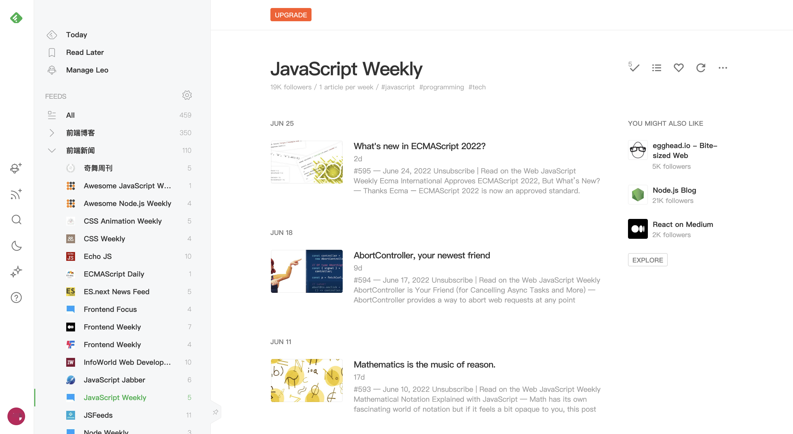
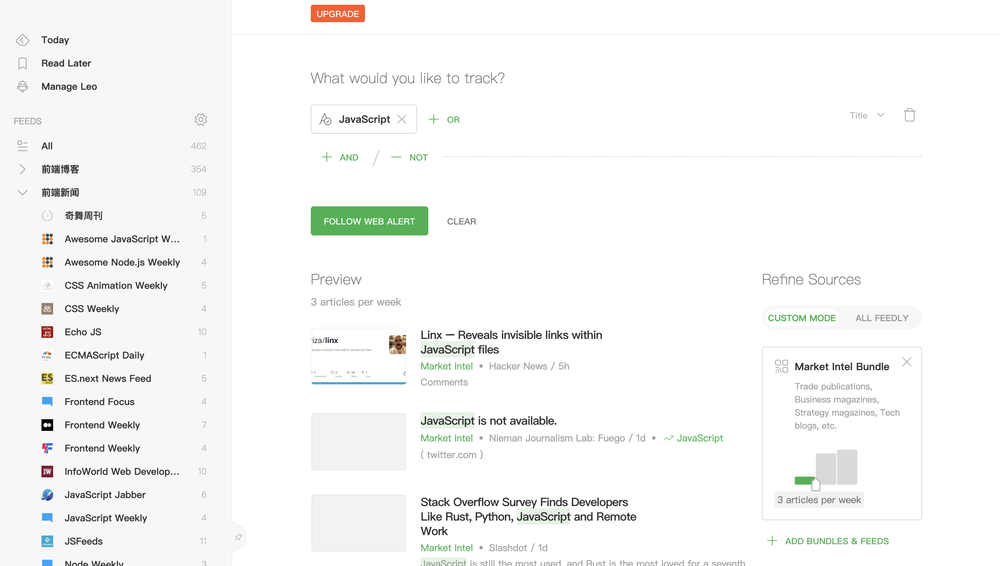
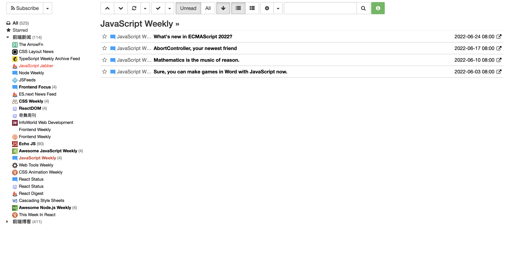
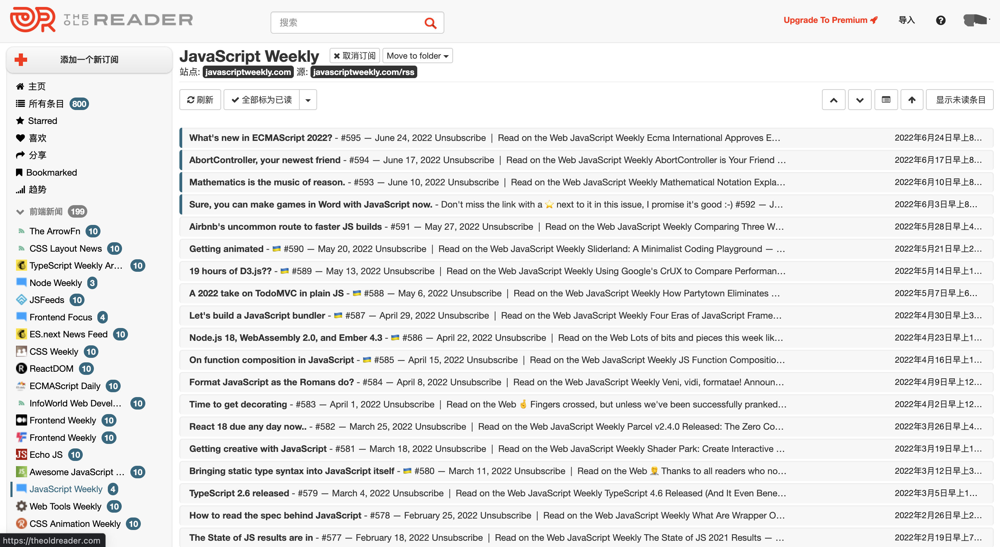
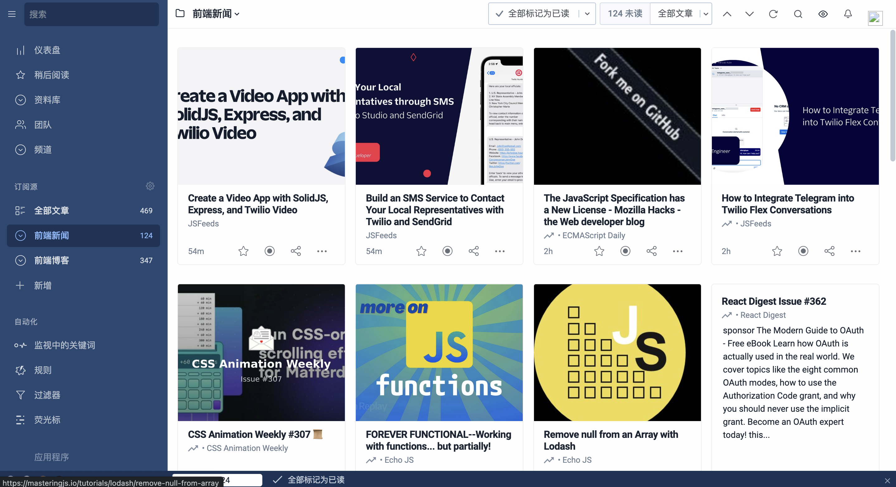
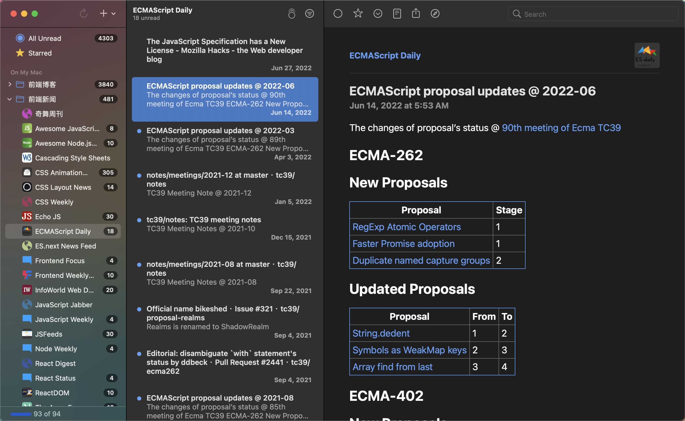
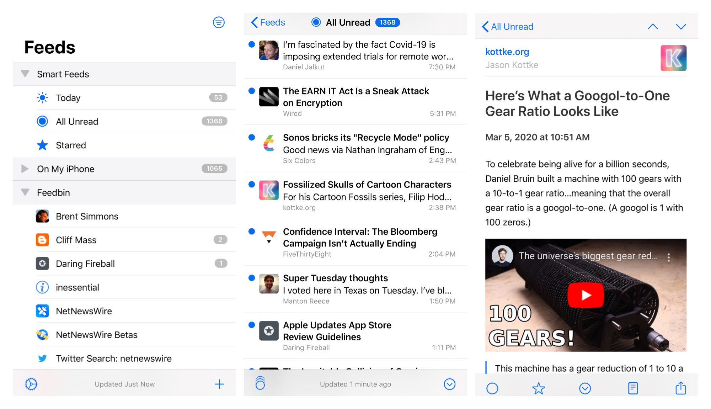

# RSS 订阅工具

最近有小伙伴问，如何获取最新的技术前沿资讯和文章呢？今天就来推荐几款实用的 RSS 阅读器。那什么是 RSS 呢？下面是维基百科对 RSS 的解释：

> RSS（英文全称：RDF Site Summary 或 Really Simple Syndication），中文译作简易资讯聚合，也称聚合内容，是一种消息来源格式规范，用以聚合多个网站更新的内容并自动通知网站订阅者。使用RSS 后，网站订阅者便无需再手动查看网站是否有新的内容，同时RSS 可将多个网站更新的内容进行整合，以摘要的形式呈现，有助于订阅者快速获取重要信息，并选择性地点阅查看。
>

RSS 阅读器可以用来查看 RSS 订阅，当我们订阅的资讯、论坛、博客等网站更新后，就会通知我们，这样就能及时查看最新的技术资讯和文章。

> 注意：经测试，多数博客、论坛、技术资讯、技术教程等网站都支持 RSS 订阅。可以在微信公众号“前端充电宝”后台回复“**RSS**”获取我关注的那些国内外技术博客、技术周刊等网站，可以一键导入到以下应用！
>

## 1. Feedly
Feedly 是一款RSS订阅工具，它将用户自定新闻订阅源内的各种在线资源聚合，并且其扩展工具能够将这些资源做成一个定制的界面，并且以杂志的方式展示出来。我们可以在Feedly上添加、删除订阅，查看订阅更新，哪些网站有更新都一目了然。它支持博客、新闻刊物、研究期刊、实时通讯等任何支持RSS 订阅的网站。Feedly 在订阅源页面提供了与其相关的收藏夹和其他订阅源推荐，很容易就能发现其他同类的优质订阅源。不过 Feedly 限制免费用户只能添加100个订阅，超出之后要付费高级版。

除此之外，Feedly 还支持订阅关键字，当有该关键字的新闻资讯、文章更新时，就会进行消息提醒：

Feedly 可以在 iOS、Android、Mac、Windows 及网页版等多个客户端平台上使用，同步的速度非常快。

**官网：**[https://feedly.com/](https://feedly.com/)

## 2. Commafeed
CommaFeed 是一个 RSS 阅读器，它的界面非常简洁，左侧根据分组显示我们的订阅列表以及更新数量，点击相应的订阅，就可以在右侧查看详情。在右侧对更新列表进行筛选，展示方式修改。在左上角的Subscribe就可以添加单个订阅以及导入订阅列表。

**官网：**[https://www.commafeed.com/](https://www.commafeed.com/)

## 3. The Old Reader
TheOldReader 是一款在线的 RSS 阅读器，支持中文、HTTPS、快捷键、加星、分享、搜索等功能，界面看起来比较简洁。

**官网：**[https://theoldreader.com](https://theoldreader.com)

## 4. Inoreader
Inoreader 是一个优秀的RSS在线阅读器，拥有众多特色功能，包括支持中文界面、加载速度快、支持快速导入google阅读器订阅、支持Google Reader的快捷键、支持未读条目提醒的chrome扩展、可更换皮肤、支持HTTPS协议、支持第三方Chrome扩展等。它不仅支持在网页中使用，还提供了ios和Android版，不过免费版最多支持添加150个订阅，并且在国内访问速度较慢。

**官网：**[https://www.innoreader.com/](https://www.innoreader.com/)

## **5. NetNewsWire**
NetNewsWire 是适一款用于 Mac、iPhone 和 iPad 的免费开源 RSS 阅读器。它可以用来显示博客和新闻网站的文章，并跟踪我们阅读的内容。它的客户端比较简洁，看起来很舒适。支持一键导入订阅源 。支持黑暗模式，会在最左侧导航栏清楚的显示我们的订阅分组，以及每个分组中所有订阅源的更新数量。可以在上面搜索所有的订阅。

IOS 版长这样：

**官网：**[https://netnewswire.com/](https://netnewswire.com/)

今天的分享到这里就结束了，有需要的小伙伴可以在微信公众号“前端充电宝”后台回复“**RSS**”获取我关注的部分国内外前端博主和技术周刊等RSS订阅源文件，在上面的应用中导入即可！

> 更新: 2022-08-09 18:10:25  
> 原文: <https://www.yuque.com/cuggz/feplus/cgg0ya>