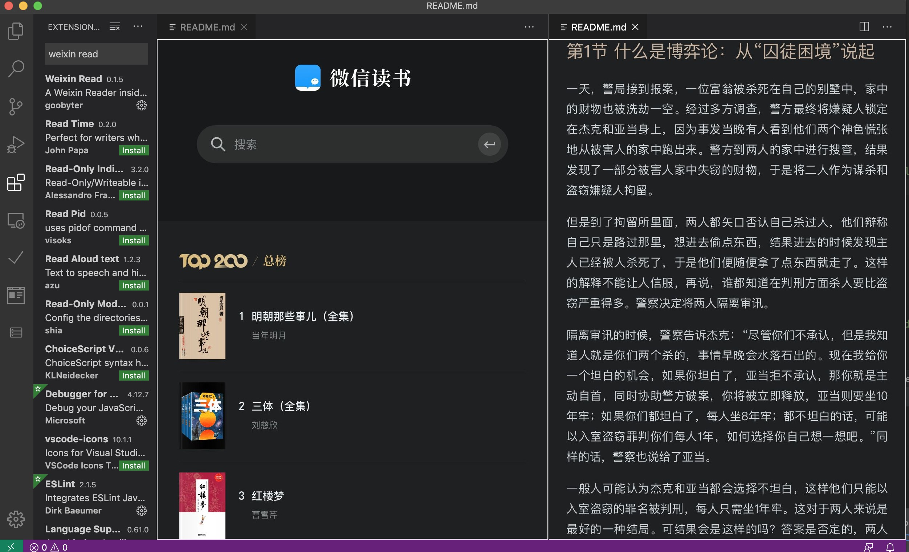
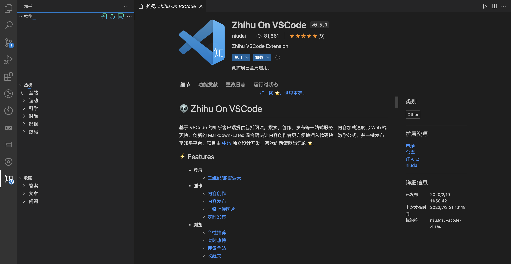
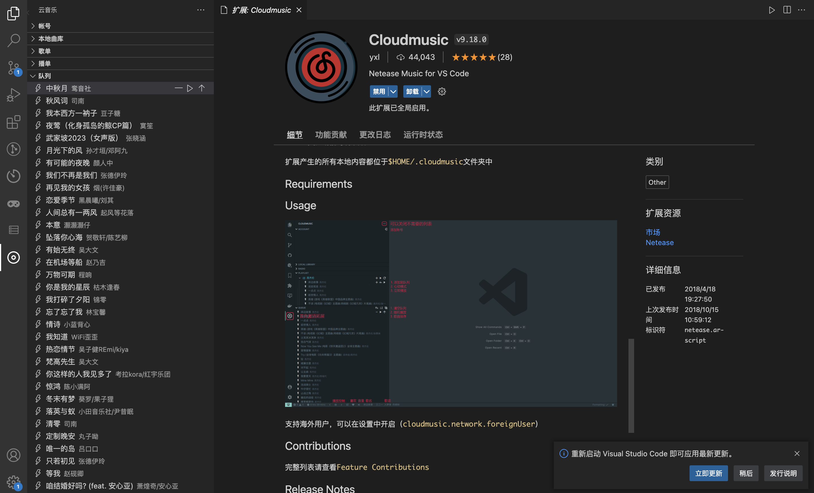
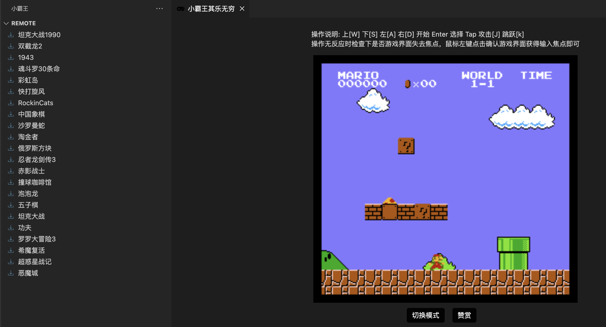
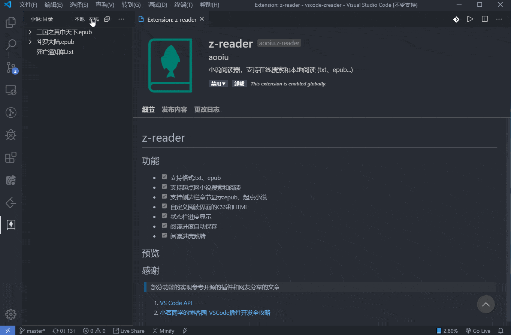
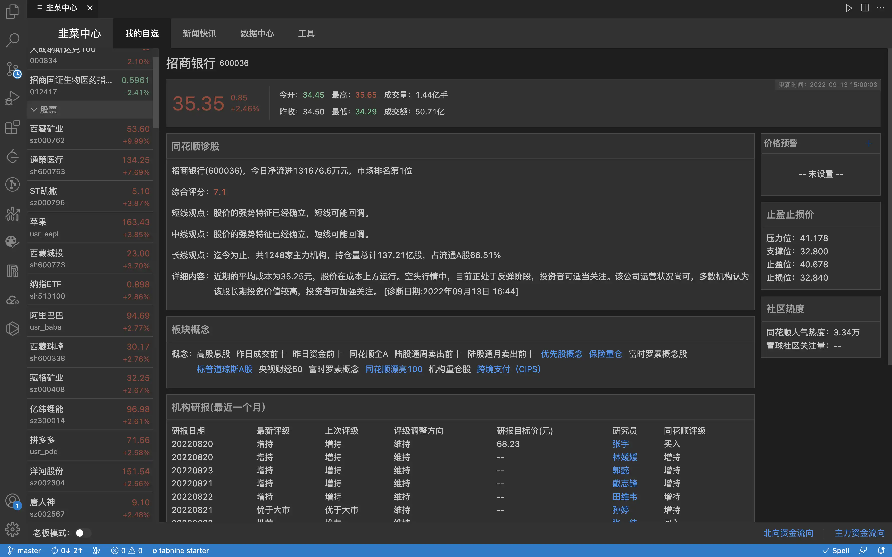
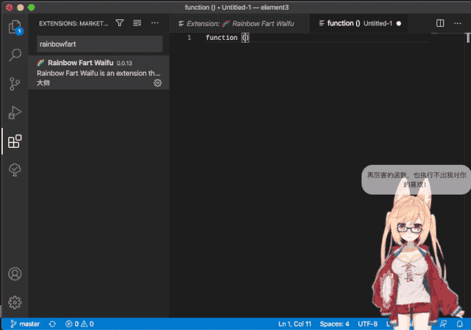
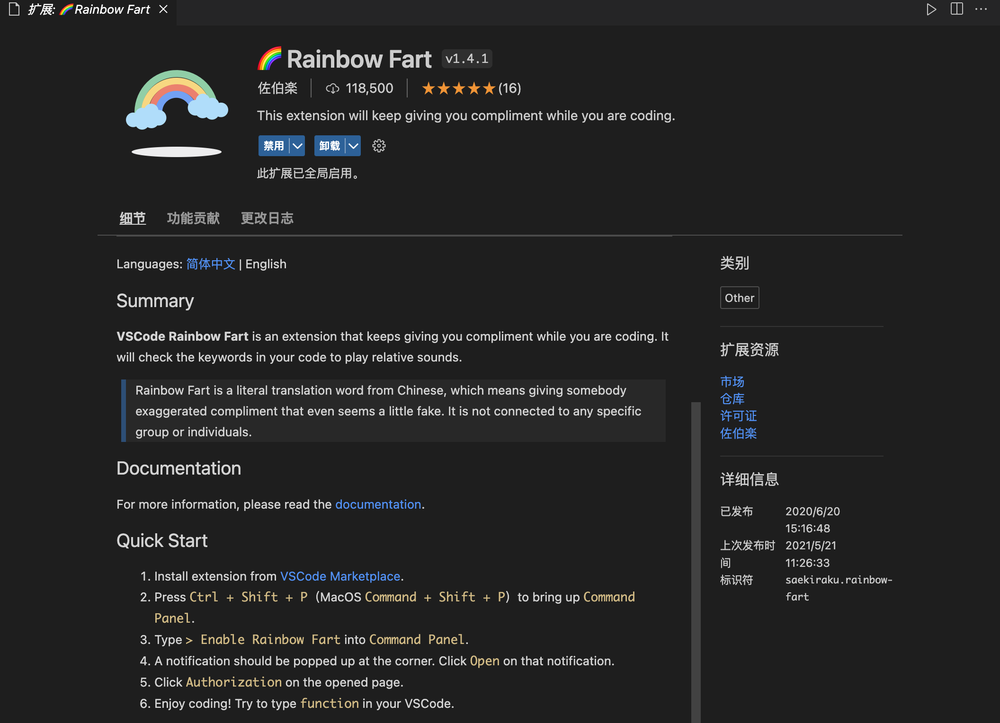
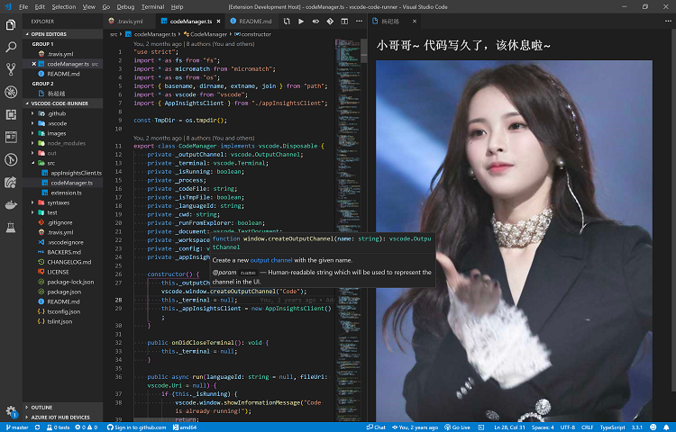
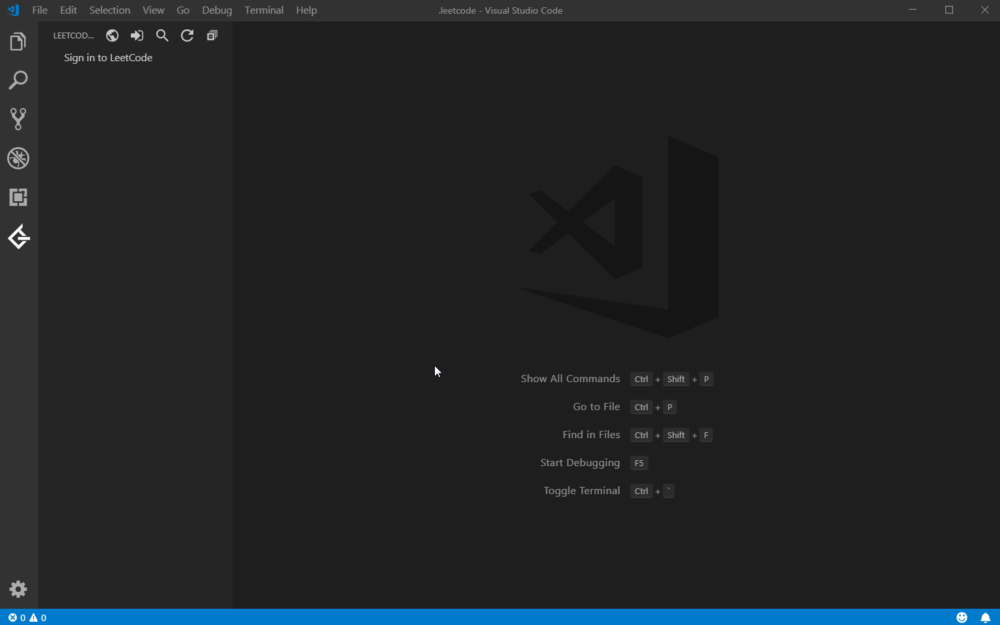

# VS Code 摸鱼插件

VS Code 插件市场中不仅有很多实用的开发插件，还有很多好玩的摸鱼插件，下面就来分享 VS Code 中值得一试的摸鱼插件！

## **Weixin Read**
专门适配微信读书网页版的阅读插件，功能比较简单，可以阅读微信读书的内容，支持登录。安装完成之后，左侧工具栏会出现微信读书的图标，点击即可进入插件。  

+ **插件名：**Weixin Read
+ **官方地址：**[https://marketplace.visualstudio.com/items?itemName=gamedilong.anes](https://marketplace.visualstudio.com/items?itemName=gamedilong.anes)

## Zhihu On VSCode
基于 VSCode 的知乎客户端提供包括阅读，搜索，创作，发布等一站式服务，内容加载速度比 Web 端更快，创新的 Markdown-Latex 混合语法让内容创作者更方便地插入代码块，数学公式，并一键发布至知乎。

+ **插件名：**Zhihu On VSCode
+ **官方地址：**[https://marketplace.visualstudio.com/items?itemName=niudai.vscode-zhihu](https://marketplace.visualstudio.com/items?itemName=niudai.vscode-zhihu)

## **Cloudmusic**
网易云音乐插件，几乎支持了全部可用功能，包括账号登录，歌单同步、搜索、收藏、心动模式、私人FM、歌词显示、榜单查看等功能，还可以查看个人听歌排行、每日推荐，新歌上架等板块。安装完成之后，左侧工具栏会出现云音乐的图标，点击即可进入插件。

+ **插件名：**Cloudmusic
+ **官方地址：**[https://marketplace.visualstudio.com/items?itemName=yxl.cloudmusic](https://marketplace.visualstudio.com/items?itemName=yxl.cloudmusic)

## 小霸王
小霸王是一款基于 vs code 的 nes 游戏插件，能让你在紧张的开发之余在vs code 里发松身心。提供了坦克大战、双节棍、魂斗罗、象棋、俄罗斯方块、坦克大战、彩虹岛等几十款经典游戏。安装完成之后，左侧工具栏会出现小霸王的图标，点击即可进入插件。

+ **插件名：**小霸王
+ **官方地址：**[https://marketplace.visualstudio.com/items?itemName=gamedilong.anes](https://marketplace.visualstudio.com/items?itemName=gamedilong.anes)

## **Bangumi Open**
基于 **Vscode** 的番剧插件，需要配合 bilibili 使用，可以按照分类和时间来查看 B 站上对应的番剧更新时间和连载情况。使用快捷键 Ctrl+Shift+P  调出命令栏后，输入**Open Bangumi **或** Bangumi Open: Week Bangumi** 即可打开插件。

+ **插件名：**Bangumi Open
+ **官方地址：**[https://marketplace.visualstudio.com/items?itemName=SDTTTTT.bangumiopen](https://marketplace.visualstudio.com/items?itemName=SDTTTTT.bangumiopen)

## **daily anime**
追番插件，功能简单，可以看到每天会对应更新的番剧列表，数据来源于bangumi。使用时，可以使用快捷键 **ctrl+shift+p**（Mac：command +shift+p） 来打开命令面板，输入 **anime **可打开番剧页面，输入 **hitokoto **可随机展示一条句子。

+ **插件名：**daily anime
+ **官方地址：**[https://marketplace.visualstudio.com/items?itemName=deepred.daily-anime](https://marketplace.visualstudio.com/items?itemName=deepred.daily-anime)

## **z-reader**
用来摸鱼或学习的小说阅读插件，支持在线搜索和本地阅读，支持txt和epub格式，可以从起点网小说和笔趣阁进行小说搜索和阅读，阅读进度支持自动保存，支持进度跳转。

+ **插件名：**z-reader
+ **官方地址：**[https://marketplace.visualstudio.com/items?itemName=aooiu.z-reader](https://marketplace.visualstudio.com/items?itemName=aooiu.z-reader)

## 韭菜盒子
韭菜盒子，VSCode 里也可以看股票 & 基金实时数据，做最好用的投资插件。

+ **插件名：**韭菜盒子
+ **官方地址：**[https://marketplace.visualstudio.com/items?itemName=giscafer.leek-fund](https://marketplace.visualstudio.com/items?itemName=giscafer.leek-fund)

## Rainbow Fart Waifu
在敲代码的时候一直用甜美的话语鼓励你，还提供了一位虚拟老婆供以娱乐，有多种模型可选。

+ **插件名：**Rainbow Fart Waifu
+ **官方地址：**[https://marketplace.visualstudio.com/items?itemName=ezshine.rainbow-fart-waifu](https://marketplace.visualstudio.com/items?itemName=ezshine.rainbow-fart-waifu)

## Rainbow Fart
一个在你编程时持续夸你写的牛逼的扩展，可以根据代码关键字播放贴近代码意义的真人语音。

+ **插件名：**Rainbow Fart
+ **官方地址：**[https://marketplace.visualstudio.com/items?itemName=saekiraku.rainbow-fart](https://marketplace.visualstudio.com/items?itemName=saekiraku.rainbow-fart)

## 超越鼓励师
在 VS Code 中连续写代码一小时（时间可配置），会有杨超越提醒你该休息啦。除了每过一小时会自动弹出提醒页面，也可以按 F1, 然后输入 ycy: 打开提醒页面来打开提醒页面。

+ **插件名：**超级鼓励师
+ **官方地址：**[https://marketplace.visualstudio.com/items?itemName=formulahendry.ycy](https://marketplace.visualstudio.com/items?itemName=formulahendry.ycy)

## Leetcode
一款强大的 Leetcode 刷题插件，可以直接同步Leetcode所有题目，并且可以直接在VS Code中提交和查看。

+ **插件名：**Leetcode
+ **官方地址：**[https://marketplace.visualstudio.com/items?itemName=LeetCode.vscode-leetcode](https://marketplace.visualstudio.com/items?itemName=LeetCode.vscode-leetcode)

## 掘金
基于 VS Code 的掘金插件，可以边看文章边写代码，不用在 VSCode 和浏览器间频繁切换，提高工作体验和学习效率。边写代码边刷沸点，光明正大地摸鱼。

+ **插件名：**掘金
+ **官方地址：**[https://marketplace.visualstudio.com/items?itemName=luzhenqian.juejin](https://marketplace.visualstudio.com/items?itemName=luzhenqian.juejin)

> 更新: 2023-02-19 23:26:54  
> 原文: <https://www.yuque.com/cuggz/feplus/bhek1p0gktnw506x>