# WebStorm主题

WebStorm 是一个可定制的 IDE，我们可以按照喜欢的方式配置它，可以通过更改主题来改变 IDE 的外观。下面来分享 WebStorm 团队成员最喜欢使用的主题！

文中提到的所有主题都是开箱即用的，可以直接从 IDE 中免费安装：

+ 在插件（Plugins）中找到需要的主题插件，安装并重启 IDE 即可。
+ 可以在**偏好设置**-**外观与行为**-**主题**中切换已经安装的主题：

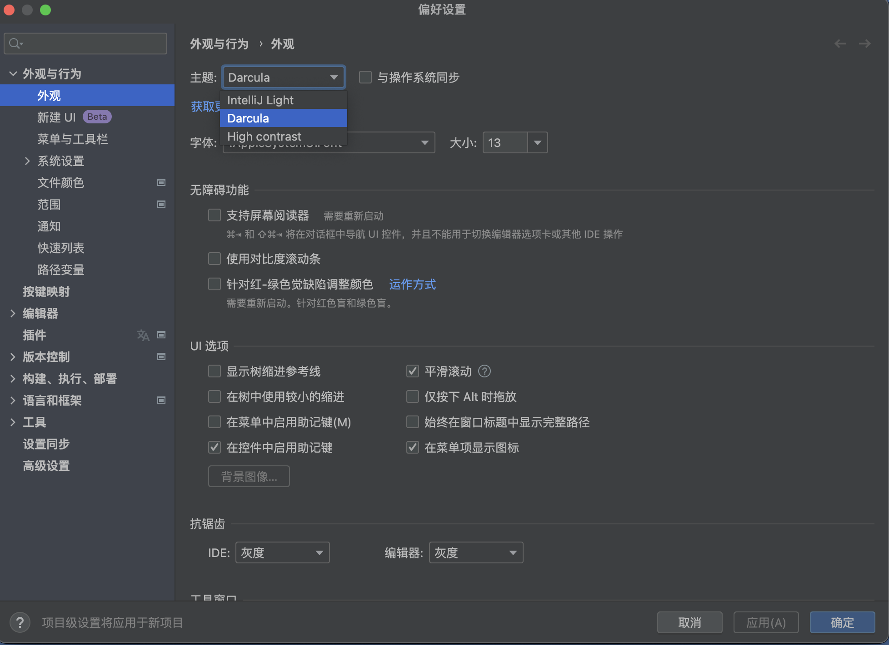

## Darcula
Darcula 预装在 WebStorm 中，因此无需安装任何额外的主题插件：

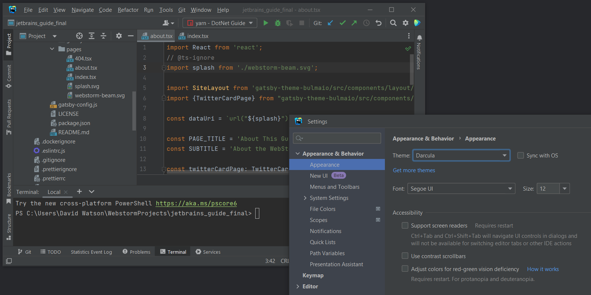

Darcula 中的深色发出的光较少。这更利于长时间观看，并有助于防止眼睛疲劳。该主题适用于：弱光环境和敏感的眼睛。

## IntelliJ Light
IntelliJ Light 是 WebStorm 预装的另一个主题。它与深色主题截然相反，提供更明亮的 IDE 界面。如果在非常明亮的条件下工作或与仅提供浅色模式的其他应用一起工作，使用浅色主题会很有帮助。

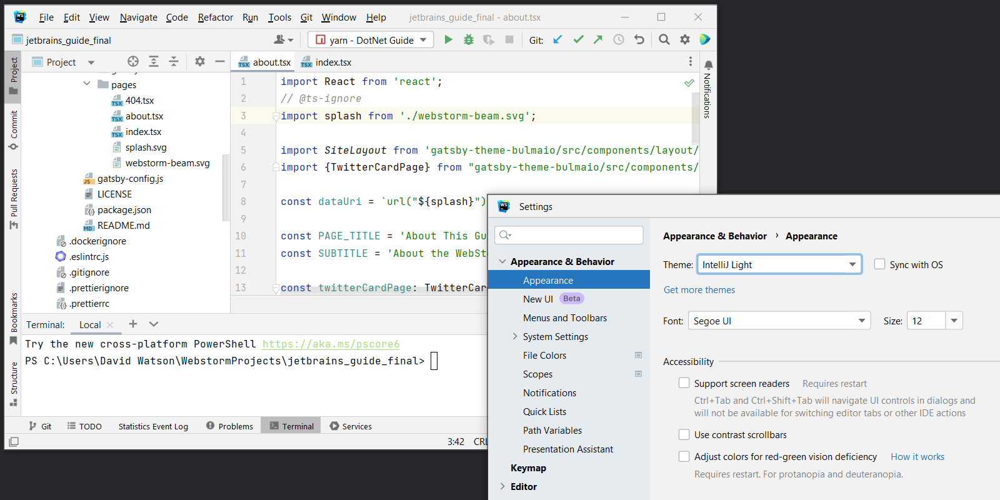

这是很多人喜欢的简单、经典的外观。该主题适用于**：**明亮的环境和带有许多其他浅色主题应用的桌面。

## Dark Purple Theme
Dark Purple 是 WebStorm 中另一个深色主题。 它为 Darcula 提供了一个更暗的对比界面，并用各种红色和紫色代替了蓝色和橙色。

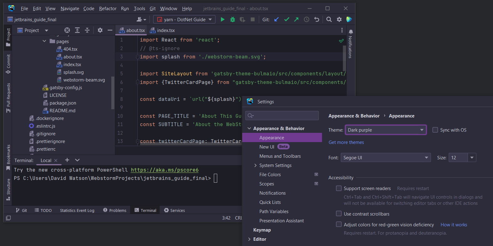

与 Darcula 相比，更强的对比度尤其受到有视觉障碍的用户的喜爱。这个主题是许多 WebStorm 团队成员的最爱。该主题适用于：弱光环境和正在寻找更高对比度颜色的用户。

## One Dark Theme
One Dark Theme 是另一个专为编码而设计的深色主题。它不如其他一些深色主题明亮，这可以使眼睛更舒适。

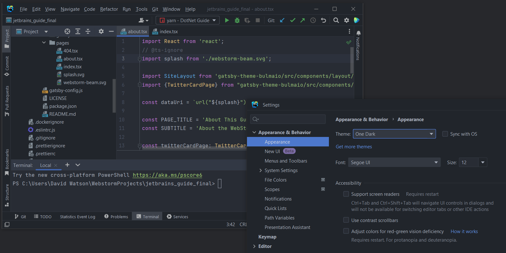

对于一些人来说，深色色调和对比度较低的亮色更容易长时间观看。该主题适用于：弱光条件以及缓解眼睛疲劳。

## Visual Studio Code Dark Plus Theme
Visual Studio Code Dark Plus Theme 基于 Visual Studio Code 的默认外观。 如果习惯了 Visual Studio Code 的外观并想在 WebStorm 中使用它，这个主题提供了类似的效果。

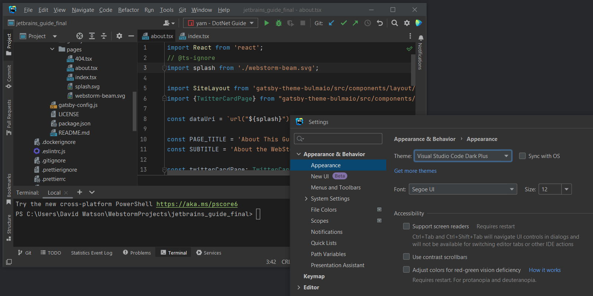

这个主题接近于 VS Code 的深色主题。更深的黑暗意味着 UI 文本和编辑器窗口之间有进一步的对比。 配色方案包含比默认 Darcula 主题中的柔和颜色更深的颜色。该主题适用于弱光条件以及习惯于使用 VS Code 的用户。

## Monokai Pro Theme
Monokai Pro Theme 是对 Sublime Text 编辑器方案的改进。它基于 Monokai Pro，旨在帮助用户集中注意力。它使用专门选择的颜色阴影来提供不会分散注意力的用户界面。该主题包含六种不同的暗黑方案变体。

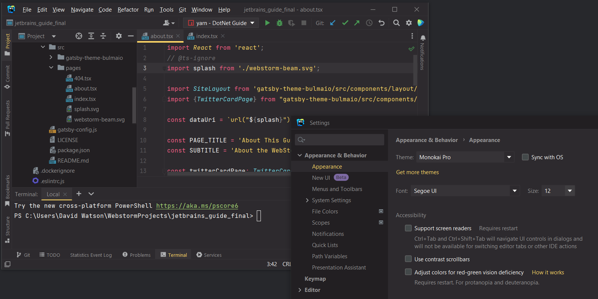

Monokai Pro 主题经过了深思熟虑，使用合理的颜色编码文本元素，使浏览代码变得容易。由于主题包中有不同的变体，因此很容易找到喜欢的那个。该主题适用于：弱光条件以及需要审查大量代码的场景。

## Vuesion Theme
Vuesion Theme 的配色方案基于 Vuesion 项目。它将工程和设计方面的现代最佳实践引入 IDE，它会给IDE 一种组织良好、干净的感觉。

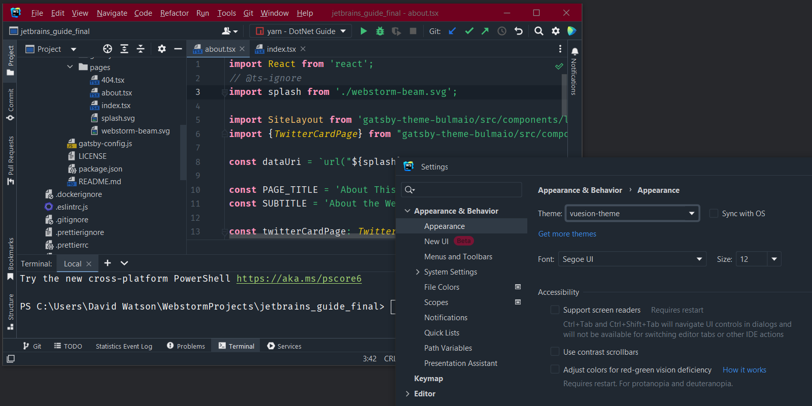

编辑器中的高亮对比很好，整个感觉干净、明快和绿色。该主题适用于：低光照条件和长期在 IDE 中工作的场景。

## Gradianto Theme
有时候，给 IDE 添点色彩，可以提振心情。 Gradianto Theme 包含自然界中发现的一系列渐变，旨在让眼睛轻松，同时色彩鲜艳。

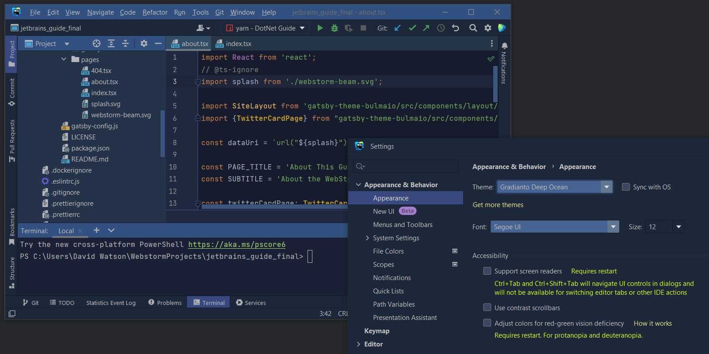

Gradianto 简单又赏心悦目。它不像其他一些黑暗主题那样刺眼，因为它使用彩色调而不是黑色调，因此既不会太亮也会不太暗。该主题适用于：所有光照条件和敏感的眼睛。

## Hiberbee Theme
Hiberbee Theme 充分利用了 Monokai 和 macOS 的优点，并将它们组合成一个超清晰、对比鲜明的深色主题。

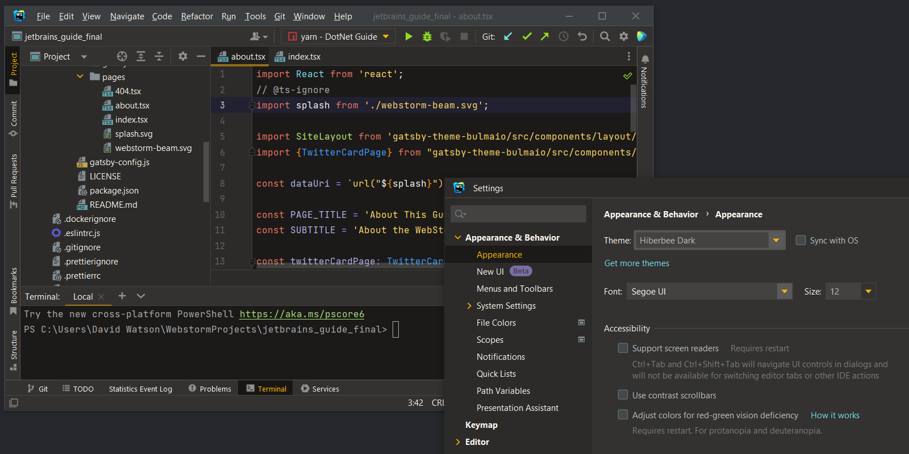

通常，深色主题使用非常明亮的霓虹色来确保文本之间有良好的对比。 Hiberbee Theme 使用明亮的颜色，对比鲜明，但没有霓虹灯般的色调。配色方案也很直观，某些标签、类或部分代码以互补色突出显示。该主题适用于：弱光条件和寻找高对比度非霓虹色的用户。

## Cyan Light Theme
对于喜欢浅色主题但不喜欢所有相关亮白色调的人来说，青色主题是一个完美的折中方案。它偏爱浅灰色而不是白色，营造非常舒适的工作环境。

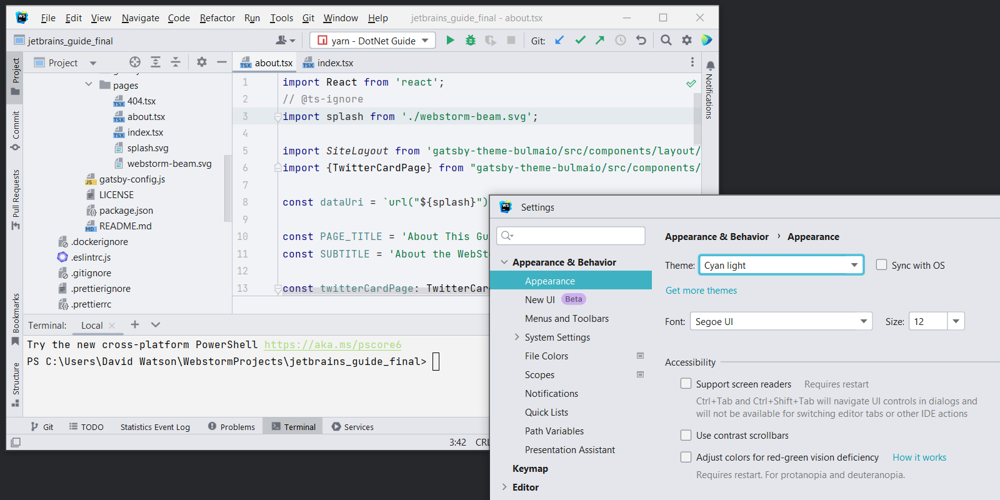

与大多数浅色主题不同，Cyan Light 使用灰白色和青色色调来形成对比。排版简洁而内敛，关键字、标识符、字段和变量以深色呈现，以巧妙但明显地区分它们。该主题适用于：强光条件和敏感的眼睛。

> 更新: 2022-12-28 00:07:35  
> 原文: <https://www.yuque.com/cuggz/feplus/ykmdfm6uy0bnag0t>