# 前端工具

## 1. Small Dev tools
Small Dev Tools 是一个前端工具网站，包含了很多实用的功能，比如JSON解码器、JSON格式化程序、UTF8编码、Base64编码、Base64解码、CSS格式化程序、CSS压缩器等。

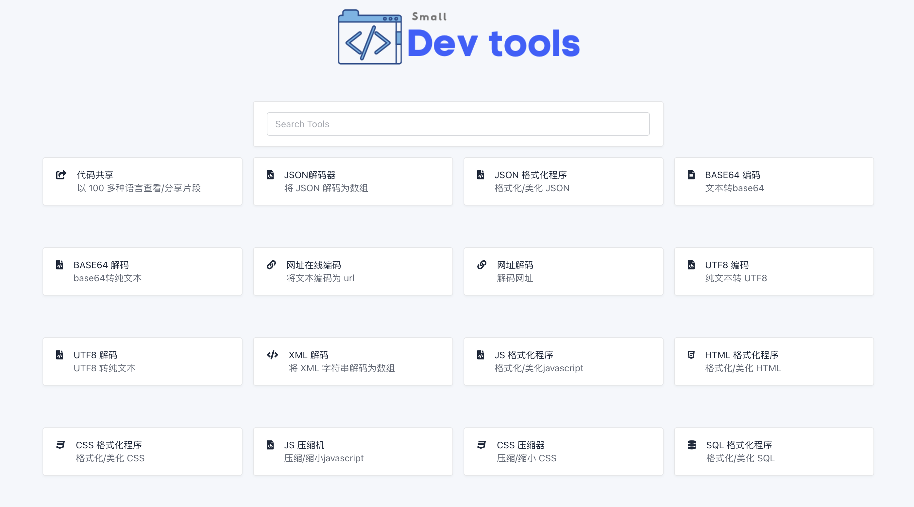

**官网：**[https://smalldev.tools/](https://smalldev.tools/)

## 2. Carbon
Carbon 是一个在线工具，可以生成漂亮的不同风格的代码图片。

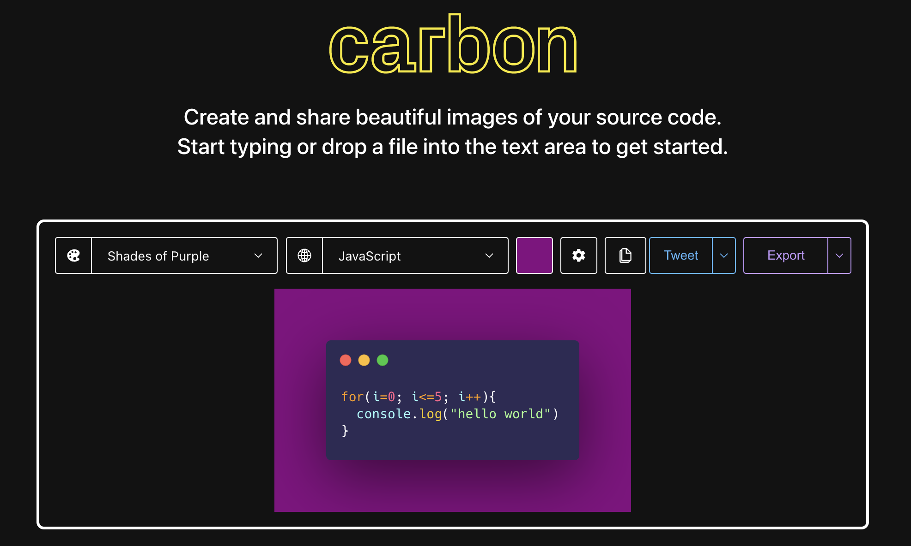

**官网：**[https://carbon.now.sh/](https://carbon.now.sh/?)

## 3. UI Design Daily
UI 设计日报，提供免费优质的 UI 资源。

**官网：**[https://www.uidesigndaily.com/](https://www.uidesigndaily.com/)

## 4. Color Hunt
ColorHunt，即颜色猎人，是一个在线设计配色的网站，其最大的特点就是使用饱和度调配配色方案。每天会根据浏览量进行更新排版，并可以直接使用。

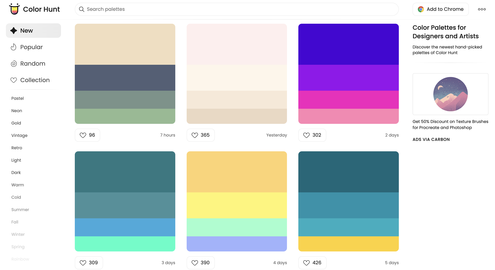

**官网：**[https://colorhunt.co/](https://colorhunt.co/)

## 5. SCHEME COLOR
SCHEME COLOR 是一个在线的配色工具网站，可以根据颜色、类型等查找合适的配色方案。

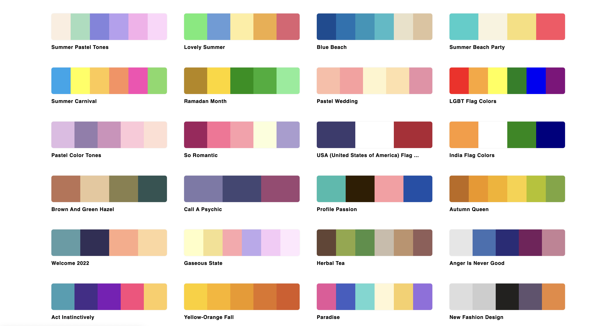

**官网：**[https://www.schemecolor.com/](https://www.schemecolor.com/)

## 6. Keyframes
Keyframes 可以用来创建动画、阴影和使用颜色，帮助我们编写更好的CSS。

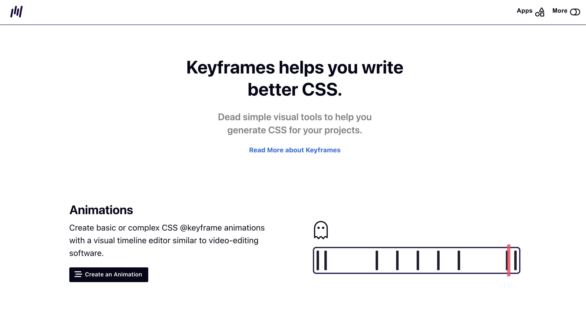

**官网：**[https://keyframes.app/](https://keyframes.app/)

## 7. Design Resources
Design Resources 是一个设计资源的集合。

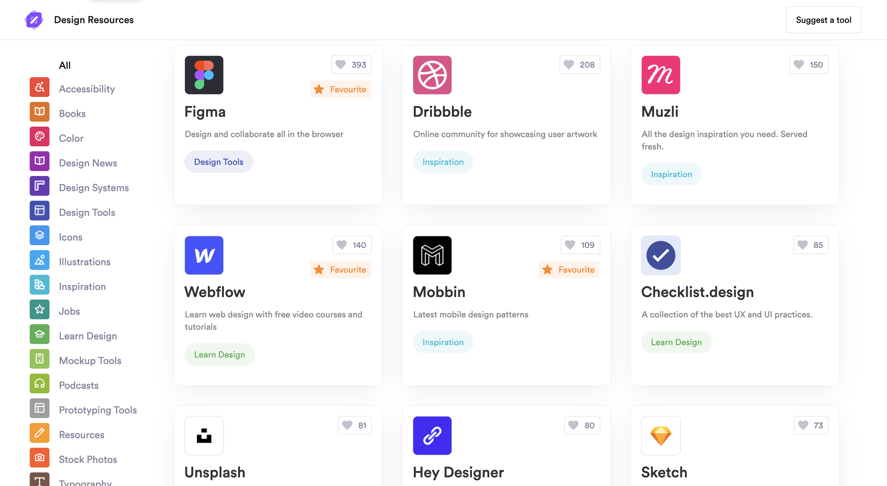

**官网：**[https://www.designresourc.es/](https://www.designresourc.es/)

## 8. Omatsuri
Omatsuri 是一个开源项目，包含12个实用的前端工具。

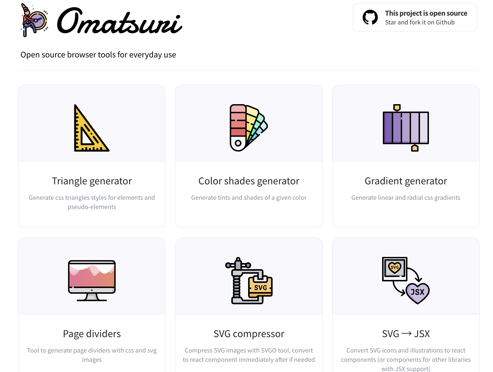

**官网：**[https://omatsuri.app/](https://omatsuri.app/)

## 9. UI Snippets
UI Snippets 是一个前端动画合集，可以通过右键点击想要的动画直接复制对应的 CSS 或 SCSS 代码。

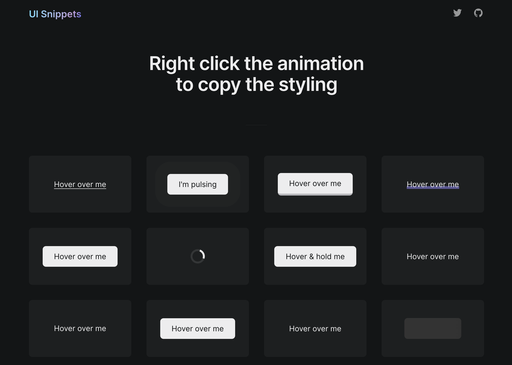

**官网：**[https://ui-snippets.dev/](https://ui-snippets.dev/)

## 10. Pattern CSS
Pattern CSS 可以用漂亮的图案填充空白背景。

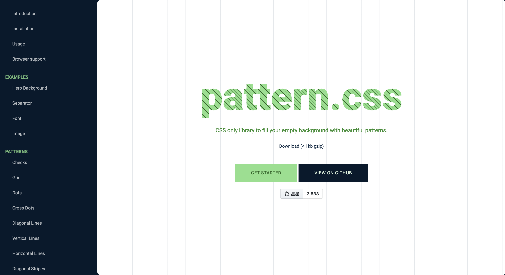

**官网：**[https://bansal.io/pattern-css](https://bansal.io/pattern-css)

## 11. Can I use
Can I use 可以用来查询 HTML5、CSS、JS、SVG 在各种流行浏览器中的特性和兼容性。

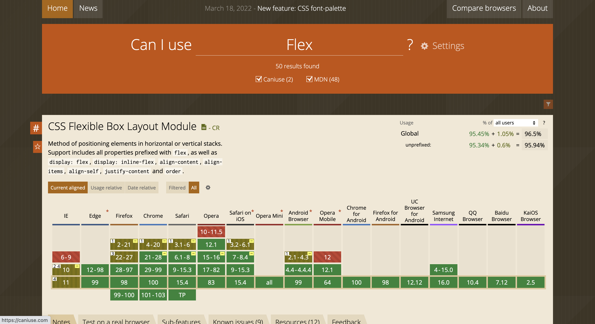

**官网：**[https://caniuse.com/](https://caniuse.com/)

## 12. CSS Gradient
CSS Gradient 是一个用来快速方便的创建 CSS 渐变的网站。

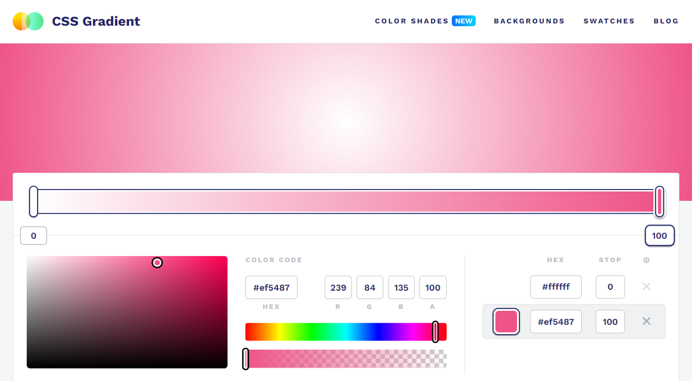

**官网：**[https://cssgradient.io/](https://cssgradient.io/)

## 13. **CSS matic**
CSS matic 是一个 CSS 工具，目前包含4个很有用的工具，分别是：支持各种颜色和透明度的渐变工具，使用渐变工具，可以创建渐变平滑的色彩变化效果和微妙的透明胶片；边框圆角工具可以帮助你方便的实现需要的圆角效果；噪声纹理可以帮助你创造奇妙的背景图案，能够实时预览结果；盒阴影工具可以控制模糊半径的变化，颜色变化，阴影大小，可以实现你想要的任何效果。

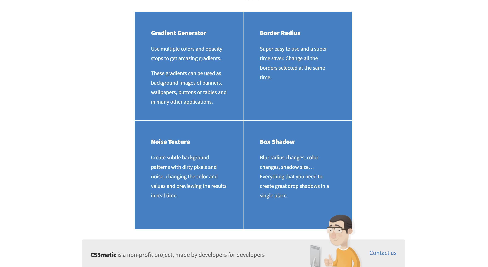

**官网：**[https://www.cssmatic.com/](https://www.cssmatic.com/)

## 14. **Am I Responsive**
Am I Responsive 用来测试响应式网页。输入链接即可生成预览，Am I Responsive 能帮我们测试出页面在手机、平板电脑、笔记本电脑和桌面端设备上的浏览体验。

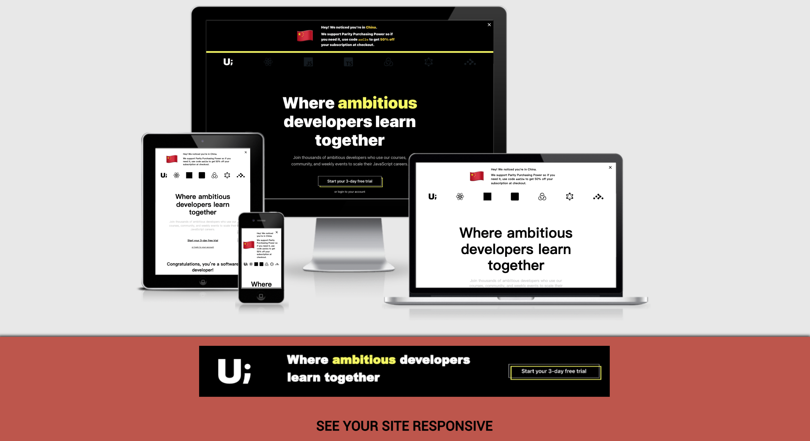

**官网：**[http://ami.responsivedesign.is/](http://ami.responsivedesign.is/)

## 15. CSS Generator
这是一个实用的 CSS 生成器，可以实时查看调试效果。

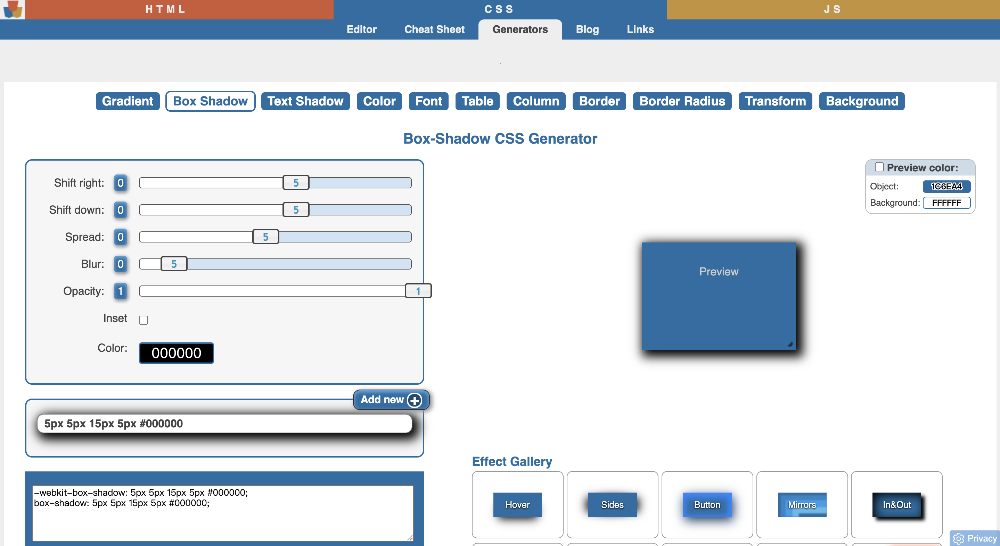

**官网：**[https://html-css-js.com/css/generator/](https://html-css-js.com/css/generator/)

## 16. My Brand New Logo
My Brand New Logo 是一个CSS 调色板生成器，用来创建一致的调色板方案。

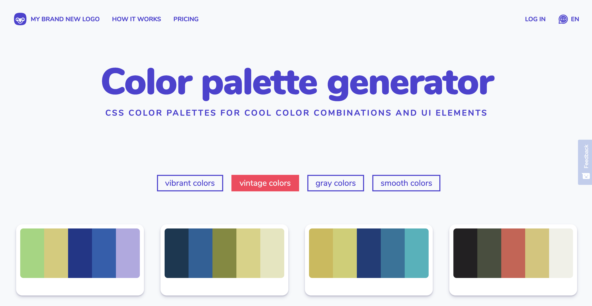

**官网：**[https://mybrandnewlogo.com/color-palette-generator](https://mybrandnewlogo.com/color-palette-generator)

## 17. 裁剪路径生成器
CSS cli-path 功能能够构建复杂的形状，该工具让我们可以轻松地以交互方式构建该多边形。

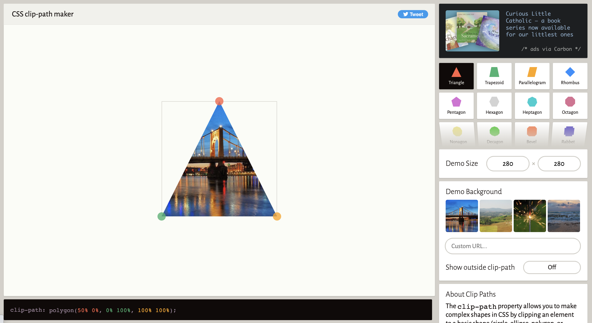

**官网：**[https://bennettfeely.com/clippy/](https://bennettfeely.com/clippy/)

## 18. CSS Grid Generator
CSS Grid Generator 是一个 Grid 布局生成器，通过这个工具可以快速创建自定义CSS Grid布局。

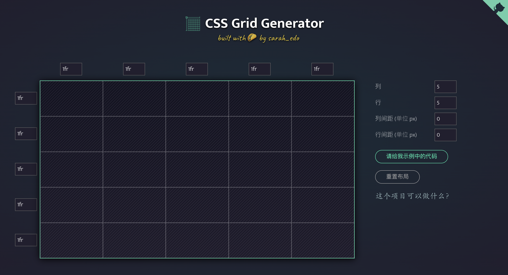

**官网：**[https://cssgrid-generator.netlify.app/](https://cssgrid-generator.netlify.app/)

## 19. CSS Layout Generator
CSS Layout Generator 布局生成器可以为布局组件创建 CSS 和 HTML 的工具。

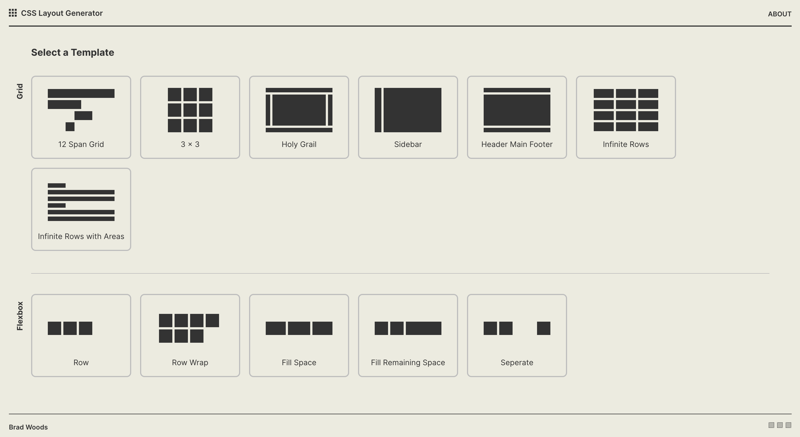

**官网：**[https://layout.bradwoods.io/](https://layout.bradwoods.io/)

## 20. Fluid-responsive font-size calculator
Fluid-responsive font-size calculator 即响应式字体计算器，可以轻松创建流畅的排版体验。它有更广泛的支持，可以用几行 CSS 来实现。

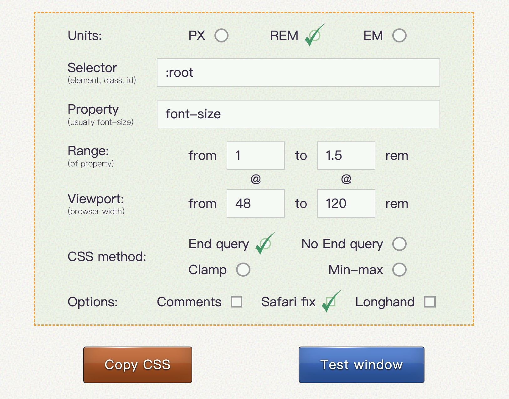

**官网：**[https://websemantics.uk/tools/responsive-font-calculator/](https://websemantics.uk/tools/responsive-font-calculator/)

## 21. regex101
Regex101是学习、测试正则表达式的工具网站。

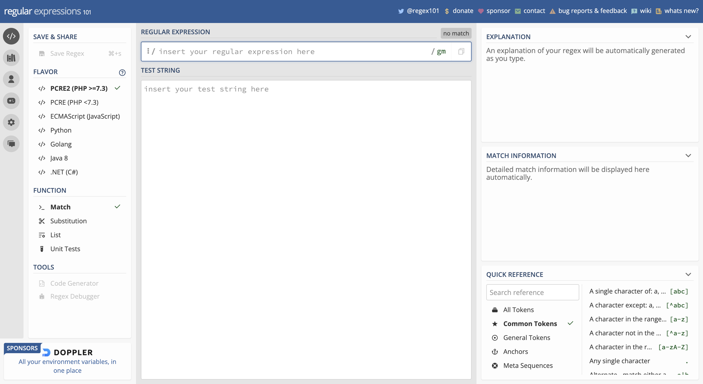  
**官网：**[https://regex101.com/](https://regex101.com/)

## 22. Regex-Vis
Regex-Vis 是一个正则表达式可视化器和编辑器。

**官网：**[https://regex-vis.com/](https://regex-vis.com/)

## 23. Loupe
Loupe 是一个可视化工具，可帮助我们了解 JavaScript 的调用堆栈/事件循环/回调队列是如何执行的。

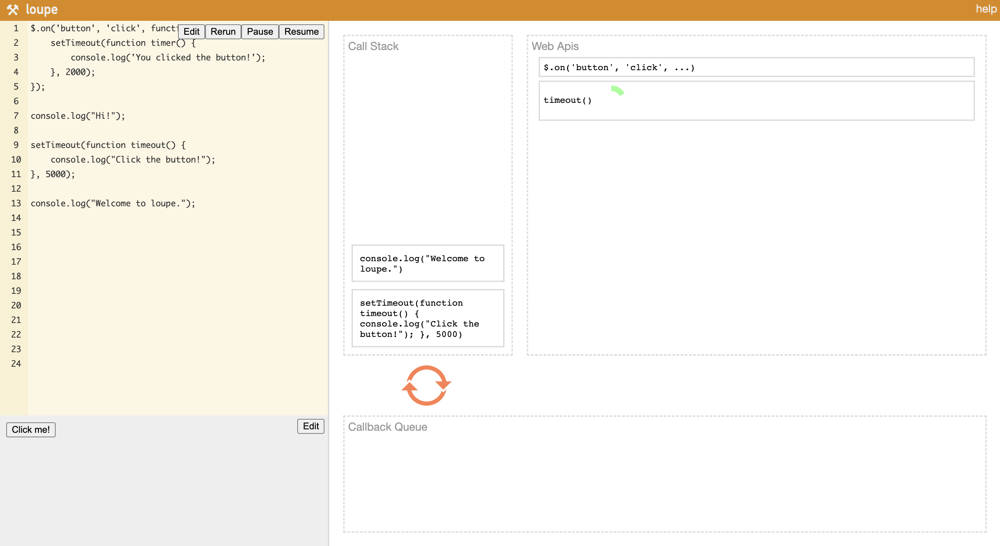

**官网：**[http://latentflip.com/loupe/](http://latentflip.com/loupe/)

## 24. RunJS
RunJS 是一个桌面应用程序，可帮助我们编写专门的 Javascript 和 Typescript 代码。它的一些优势是可以快速测试代码，轻松导入和测试库代码，并且能够修改界面、主题和字体以适应偏好。

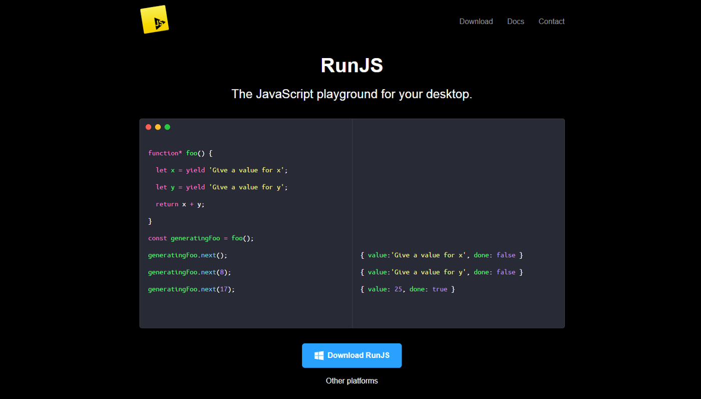

**官网：**[https://runjs.dev/](https://runjs.dev/)

## 25. Wrap SVG Online
Wrap SVG Online 通过拖放从计算机上传图像，可以轻松地编辑网页的 SVG 图像。

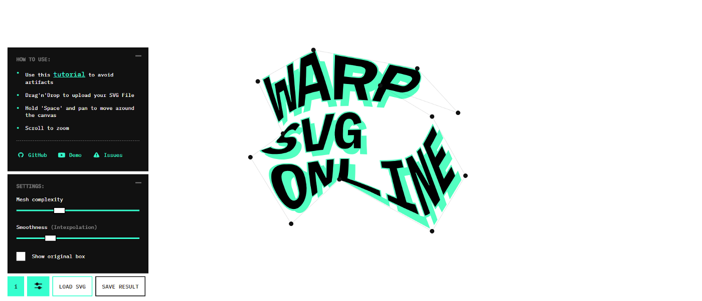

**官网：**[https://pavellaptev.github.io/warp-svg/](https://pavellaptev.github.io/warp-svg/)

## 26. SVG Path Visualizer
SVG Path Visualizer 可以帮助我们通过输入 SVG 路径数据来快速直观地查看 SVG 图像。此外，该工具还提供了详细的说明，以便了解如何创建基本的 SVG 形状，如直线、曲线、三角形等。

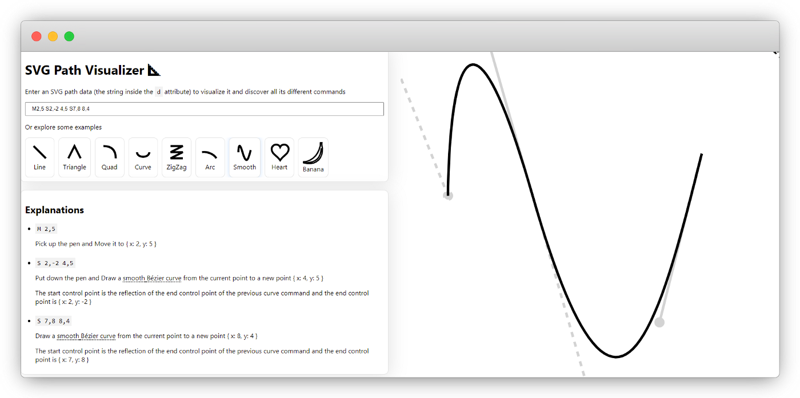

**官网：**[https://svg-path-visualizer.netlify.app/](https://svg-path-visualizer.netlify.app/)

## 27. BGJar
BGJar 是一个在线工具，可以轻松快速地为网站创建 SVG 背景。只需编辑必要的信息，它将自动导出图像或代码供我们应用到网站。

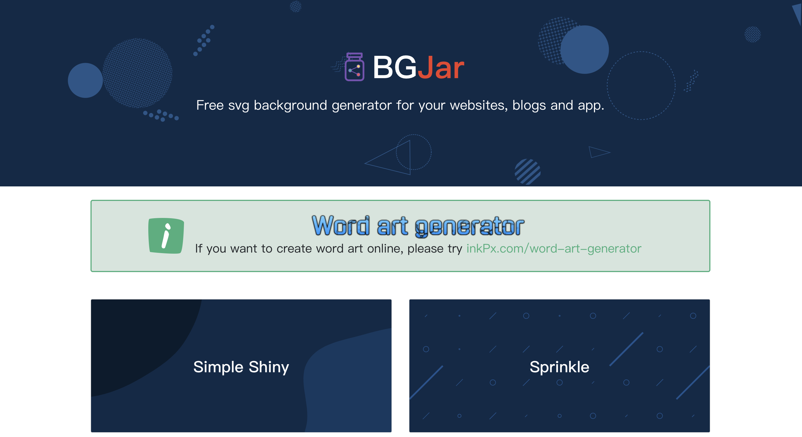

**官网：**[https://bgjar.com/](https://bgjar.com/)

## 28. Wavesnippets
Wavesnippets 可以将代码分步设置为动画、视频或 GIF。

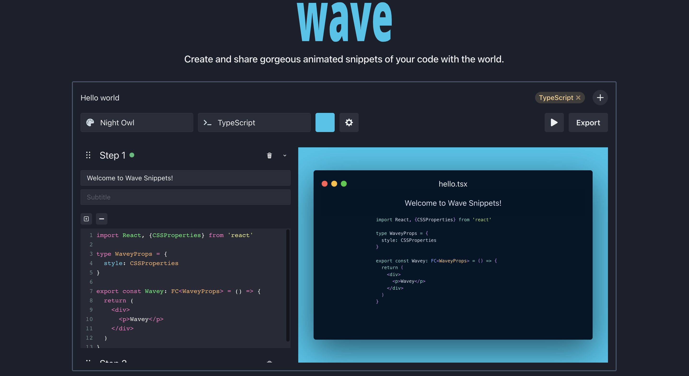

**官网：**[https://www.wavesnippets.com/](https://www.wavesnippets.com/)

## 29. Generate SVG Waves
Generate SVG Waves 可以用来创建 SVG 波形背景。

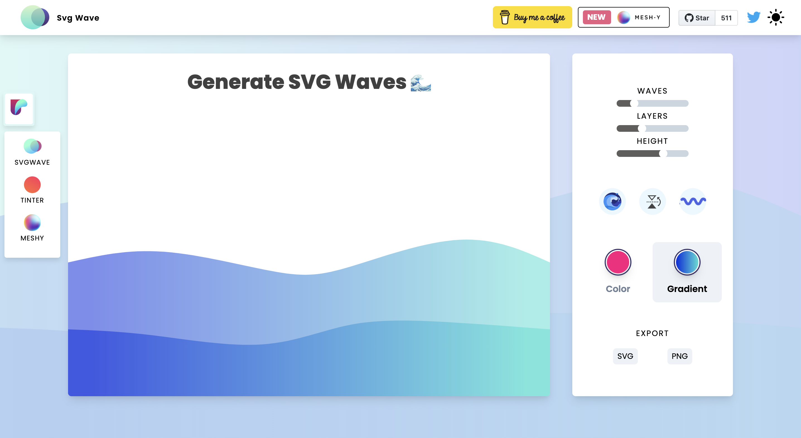

**官网：**[https://svgwave.in/](https://svgwave.in/)

## 30. CodeSandbox
CodeSandbox 是一个为 Web 应用程序开发而构建的在线编辑器，支持多种主流框架。

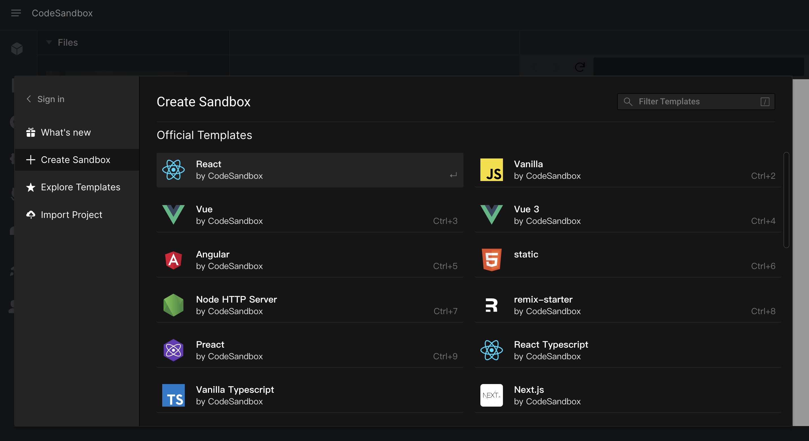

**官网：**[https://codesandbox.io/](https://codesandbox.io/)

## 31. Openbase
Openbase 帮助开发人员在数以百万计的开源软件包中进行选择和使用。

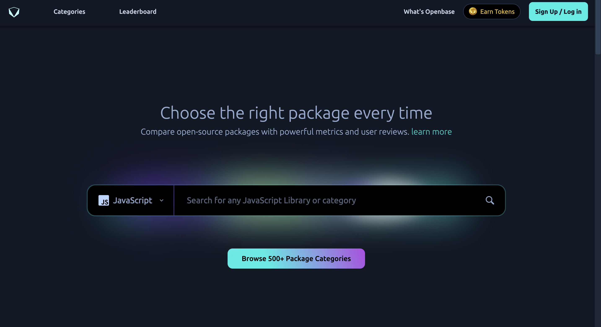

**官网：**[https://openbase.com/](https://openbase.com/)

## 32. CodePen
CodePen 是一个在线的前端代码编辑工具，可用于制作测试页面、代码调试，所见即所得。

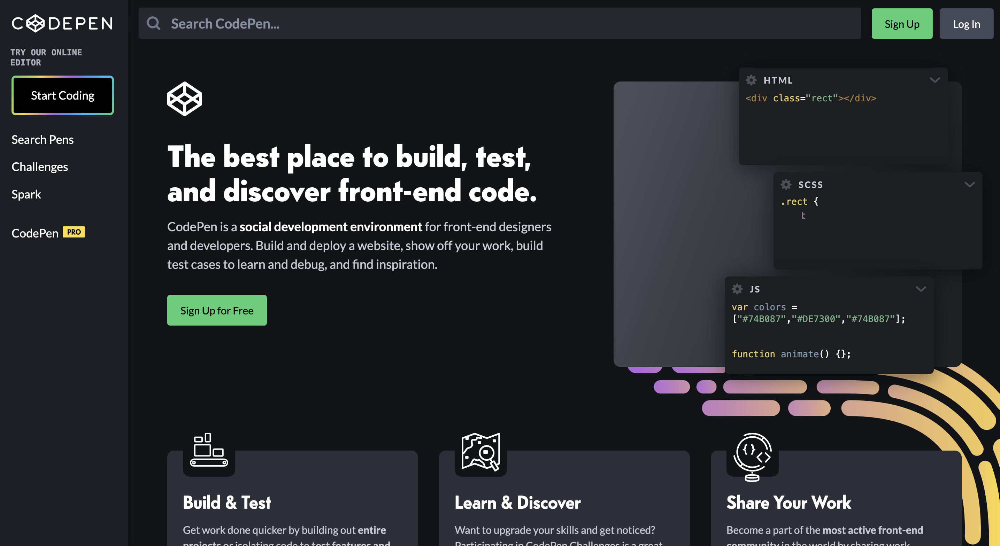

**官网：**[https://codepen.io/](https://codepen.io/)

## 33. JSONLint
JSONLint 是一个 JSON 调试工具，如果遗漏了语法中的某些内容，它会进行检查。JSONLint 是处理大型 JSON 格式的绝佳工具，而且很容易上手。

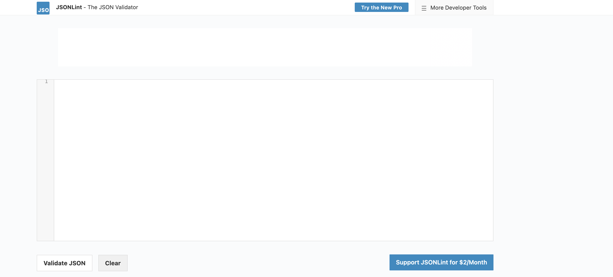

**官网：**[https://jsonlint.com/](https://jsonlint.com/)

## 34. Minify
Minifier 可以对 JavaScript 和 CSS 代码进行压缩，通过缩小可以提高网站加载速度。Minifier 通过删除 .js 和 .css 文件中的空白并重新格式化它们以减小大小。

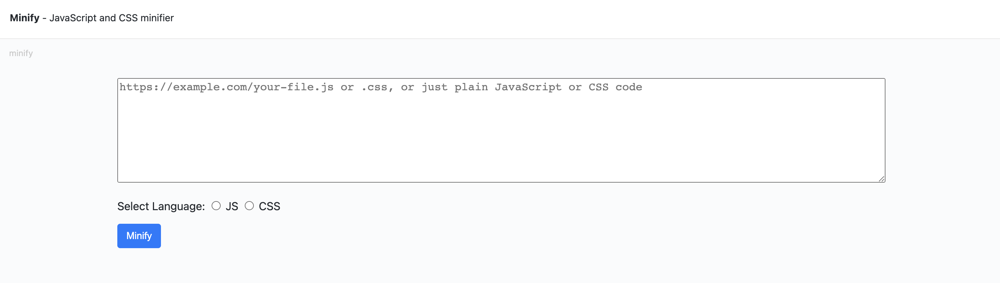

**官网：**[https://www.minifier.org/](https://www.minifier.org/)

## 35. Unminify 
Unminify 和 Minifier 恰恰相反。使用 Unminify 可以使 .js 或 .css 文件可读。这两种工具都非常容易使用。

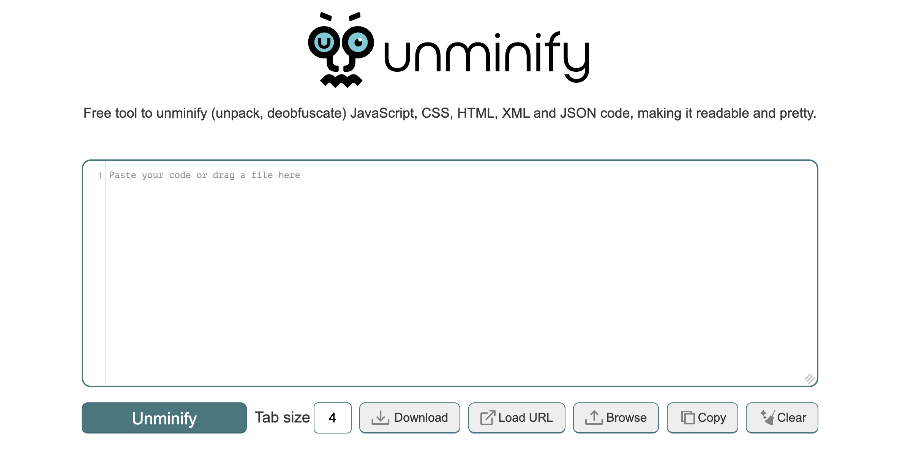

**官网：**[https://unminify.com/](https://unminify.com/)

## 36. CRADIENT.ART
CRADIENT.ART 是一个高级 CSS 渐变编辑器，使用带有分层、设计工具和免费云存储的功能丰富的编辑器设计插图、图案、图标等。

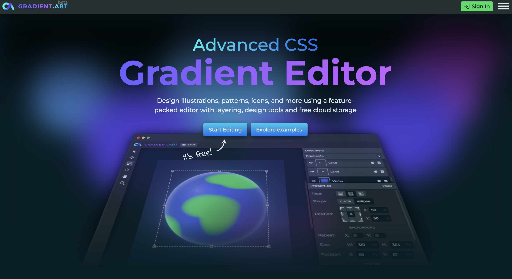

**官网：**[https://gra.dient.art/](https://gra.dient.art/)

## 37. 3DPop
3DPop 可以使用 CSS 生成很棒的 3D 文本效果。

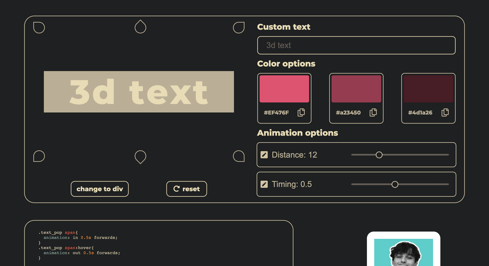

**官网：**[https://textpop3d.web.app/](https://textpop3d.web.app/)

## 38. CSS Photo Filters
CSS Photo Filters 是一个CSS图片滤镜工具，提供了 36 个 CSS 过滤器供我们使用。

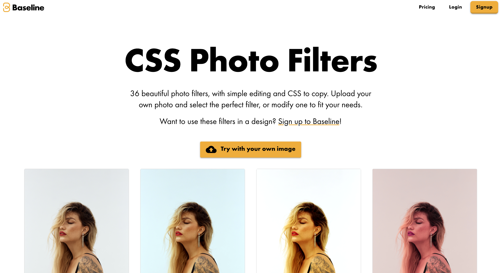

**官网：**[https://baseline.is/tools/css-photo-filters/](https://baseline.is/tools/css-photo-filters/)

> 更新: 2022-04-17 23:30:05  
> 原文: <https://www.yuque.com/cuggz/feplus/dbmpsz>