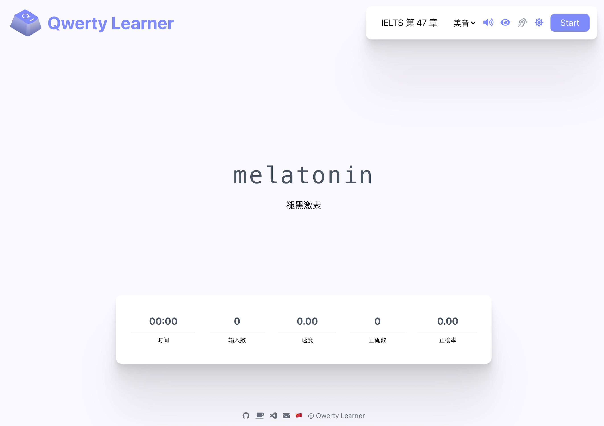
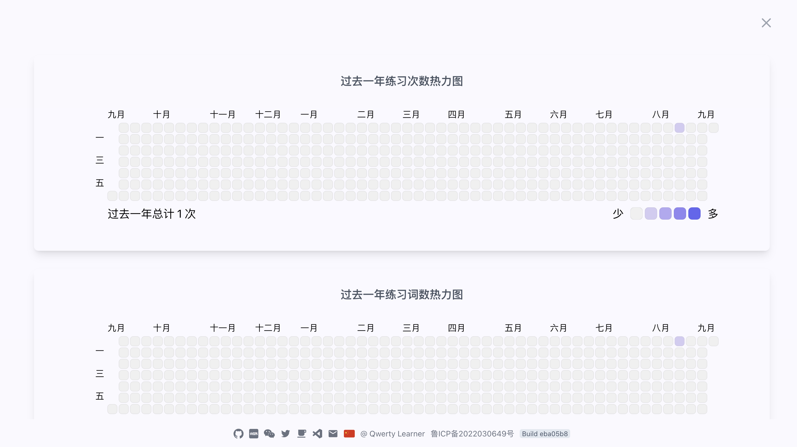
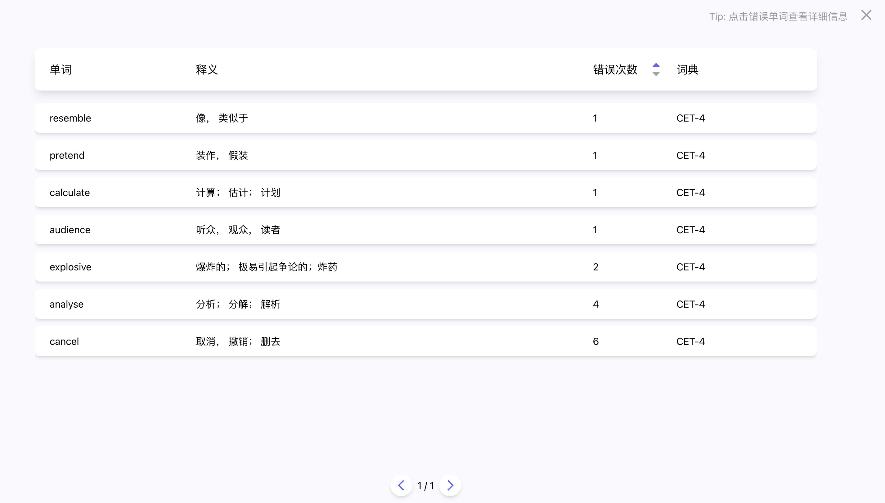
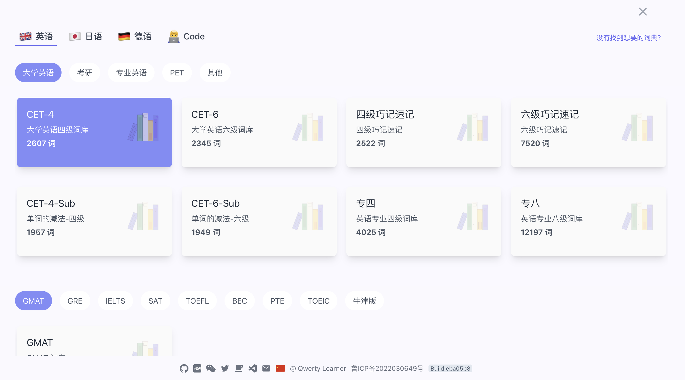
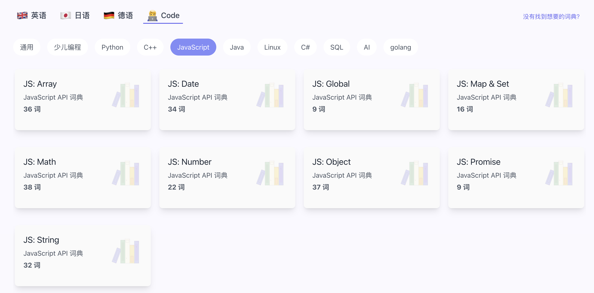

# 单词练习

本文来分享一个基于 React + Typescript + Vite 等技术的**为键盘工作者设计的单词记忆与英语肌肉记忆锻炼应用：**Qwerty Learner，该项目代码是完全开源的，目前已在 Github 上获得了 12.3k Star！

Qwerty Learner 的主要功能就是通过键盘打字练习来帮助大家更好地记住英文单词，在打字的过程中，会伴有单词发音朗读，更有助于记忆。在练习单词时，底部会实时显示练习时间、输入数、速度、正确数和正确率。

练习完每一章后，网站上会出现三个功能按钮，即听写本章、重复本章、下一章，帮助巩固学习。

Qwerty Learner 支持查看历史练习数据：

拼错的单词可以加入错题本，以便进行复习：

Qwerty Learner 内置了常用的 CET-4 、CET-6 、GMAT 、GRE 、IELTS 、SAT 、TOEFL 、考研英语、专业四级英语、专业八级英语等，个人也可以根据自己的喜好添加自己的词库，除此之外，还有程序员常见英语单词以及多种编程语言 API 等词库，支持标准的英式和美式两种英语发音。

编程类提供了多个编程语言词库，可以对常用 API 进行练习：

设计思想：

> 软件设计的目标群体为以英语作为主要工作语言的键盘工作者。部分人会出现输入母语时的打字速度快于英语的情况，因为多年的母语输入练就了非常坚固的肌肉记忆，而英语输入的肌肉记忆相对较弱，易出现输入英语时“提笔忘字”的现象。
>
> 
>
> 同时为了巩固英语技能，也需要持续的背诵单词，本软件将英语单词的记忆与英语键盘输入的肌肉记忆的锻炼相结合，可以在背诵单词的同时巩固肌肉记忆。
>
> 
>
> 为了避免造成错误的肌肉记忆，设计上如果用户单词输入错误则需要重新输入单词，尽可能确保用户维持正确的肌肉记忆。
>
> 
>
> 软件也对需要机考英语的人群有一定的帮助。
>
> ****
>
> **For Coder**：
>
> 内置了程序员工作常用单词的词库，方便练习工作中常用的单词、提高输入速度。也内置了诸多语言的 API 的练习，帮助以程序员快速熟悉常用的 API，更多语言的 API 正在逐步添加中...
>

+ 在线体验：[https://qwerty.kaiyi.cool/](https://qwerty.kaiyi.cool/)
+ Github 地址：[https://github.com/Kaiyiwing/qwerty-learner](https://github.com/Kaiyiwing/qwerty-learner)

> 更新: 2023-09-22 00:31:32  
> 原文: <https://www.yuque.com/cuggz/feplus/ggemp86sr0g8yksc>