# 可视化管理Node.js版本

在日常开发中，我们可能会经常遇到不同项目需要使用不同版本的 Node.js 的情况。虽然社区已经有了很多成熟的 Node.js 版本管理工具，比如 nvm。但是，这些工具基本都是基于 `shell` 的交互式命令的，用起来可能不太直观便捷：比如在 macOS 平台需要安装支持 arm64 架构的版本的 node，nvm 就没办法通过命令（`nvm ls -remote`）来查看；而在 Windows 平台则需要通过 [nvm-windows](https://github.com/coreybutler/nvm-windows) 来单独安装以获得支持。

今天来分享一个高效的 Node.js 版本可视化管理工具：**nvm-desktop**。

## nvm-desktop 是什么？

nvm-desktop 是一个以可视化界面操作方式管理多个 Node 版本的桌面应用，使用 Electron 构建（支持 Macos 和 Windows 系统）。通过该应用，可以快速安装和使用不同版本的 Node。它完美支持为不同的项目单独设置和切换 Node 版本，不依赖操作系统的任何特定功能和 shell。

nvm-desktop 的功能包括：

* 支持为系统全局和项目单独设置Node引擎版本
* 管理Node的命令行工具
* 支持英文和简体中文
* 支持自定义下载镜像地址 (默认是 <https://nodejs.org/dist>)
* Windows 平台支持自动检查更新
* 完整的自动化测试

nvm-desktop 支持设置主题，可选项包括：**跟随系统、亮色、暗黑**

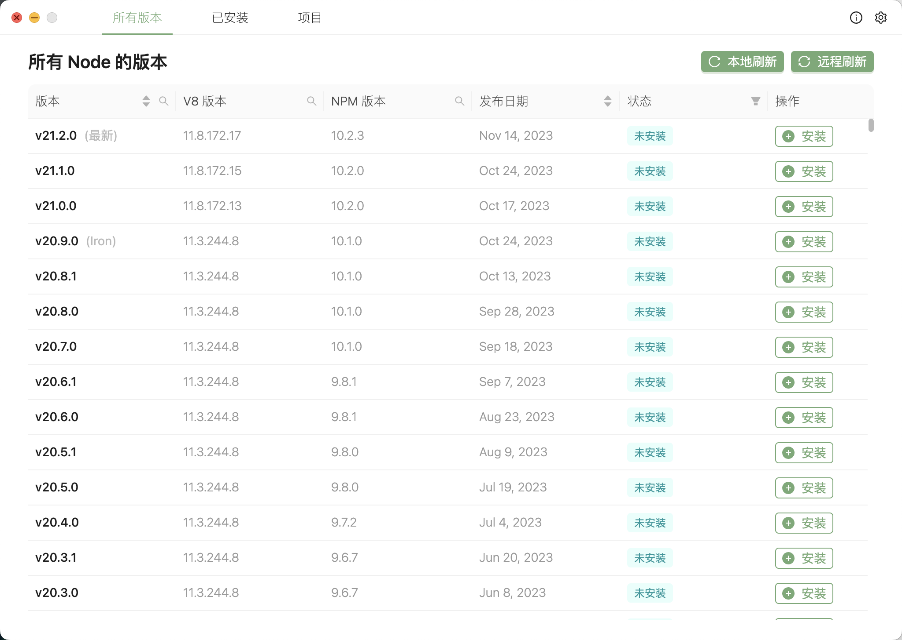

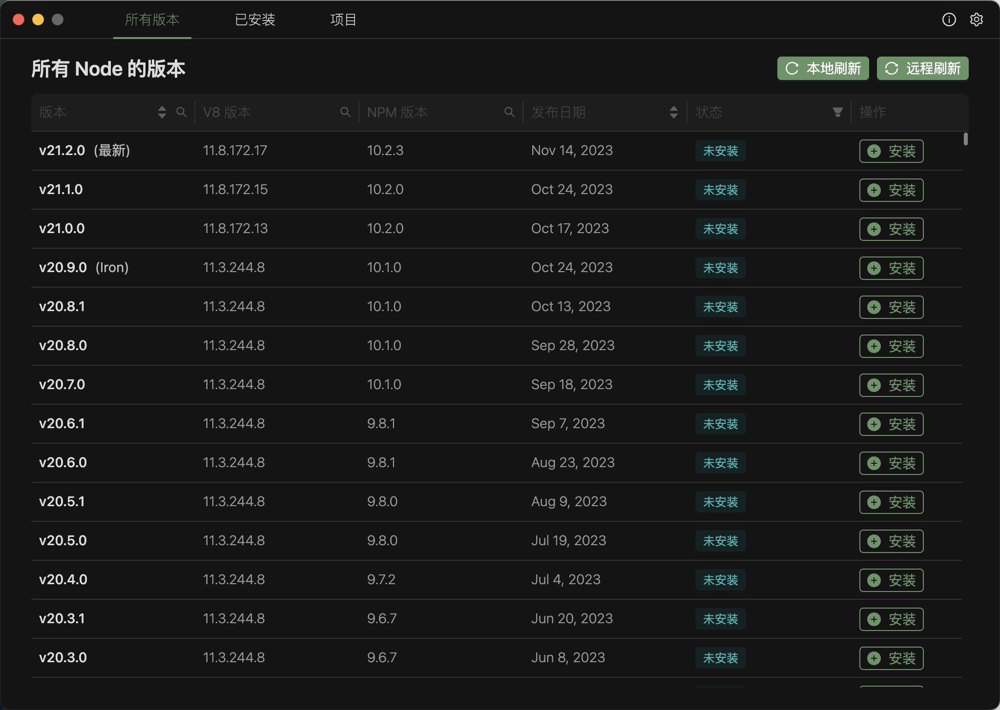

设置**语言**和**镜像地址**：

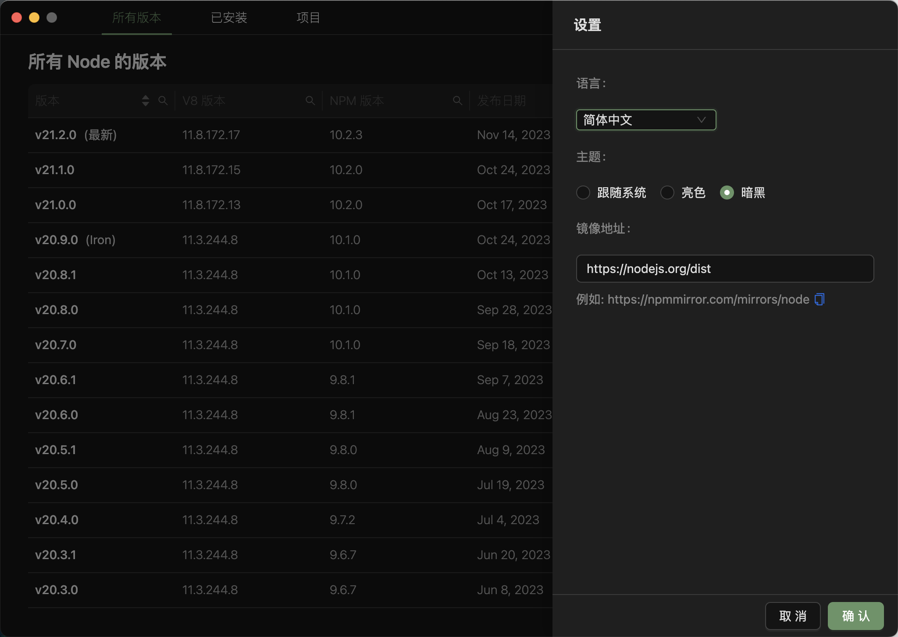

## nvm-desktop 怎么用？

### 下载

首先，在 nvm-desktop 的 [Release 页面](https://github.com/1111mp/nvm-desktop/releases)下载系统对应的版本：

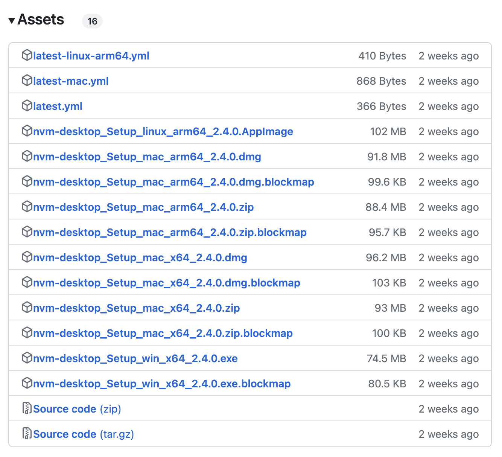

下载完成之后，进行安装。

### 环境配置

安装完成之后，如果使用的是 Mac 电脑，需要在`~/.bashrc`、 `~/.profile` 或 `~/.zshrc` 文件添加以下内容，以便在登录时自动获取它：

```shell
export NVMD_DIR="$HOME/.nvmd" 
export PATH="$NVMD_DIR/bin:$PATH"
```

> <font style="color:rgb(18, 18, 18);">如果电脑系统默认的是 </font><font style="color:rgb(18, 18, 18);background-color:rgb(245, 245, 245);">zsh</font><font style="color:rgb(18, 18, 18);">, 可以复制这个命令添加到 </font><code><font style="color:rgb(18, 18, 18);background-color:rgb(245, 245, 245);">~/.zshrc</font></code><font style="color:rgb(18, 18, 18);"> 文件中即可。如果电脑使用的是 </font><font style="color:rgb(18, 18, 18);background-color:rgb(245, 245, 245);">bash</font><font style="color:rgb(18, 18, 18);">，则复制粘贴到 </font><code><font style="color:rgb(18, 18, 18);background-color:rgb(245, 245, 245);">~/.bashrc</font></code><font style="color:rgb(18, 18, 18);"> 文件中去即可。如果有其他安装问题，可以查看官方文档：</font>[<font style="color:rgb(18, 18, 18);">https://github.com/1111mp/nvm-desktop/blob/main/README-zh\_CN.md</font>](https://github.com/1111mp/nvm-desktop/blob/main/README-zh_CN.md)

### <font style="color:rgb(18, 18, 18);background-color:rgb(245, 245, 245);">基本使用</font>

<font style="color:rgb(18, 18, 18);background-color:rgb(245, 245, 245);">Windows</font><font style="color:rgb(18, 18, 18);"> 下则不需要额外的操作，安装好运行之后直接搜索指定的 </font><font style="color:rgb(18, 18, 18);background-color:rgb(245, 245, 245);">Node.js</font><font style="color:rgb(18, 18, 18);"> 版本点击下载安装即可。</font>

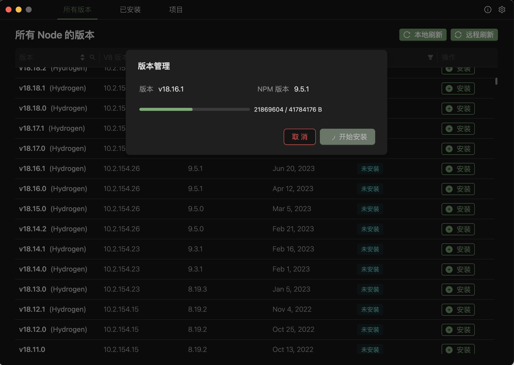

下载的过程中会实时显示下载进度。

安装了新的 Node.js 版本之后，可以在已安装中查看：

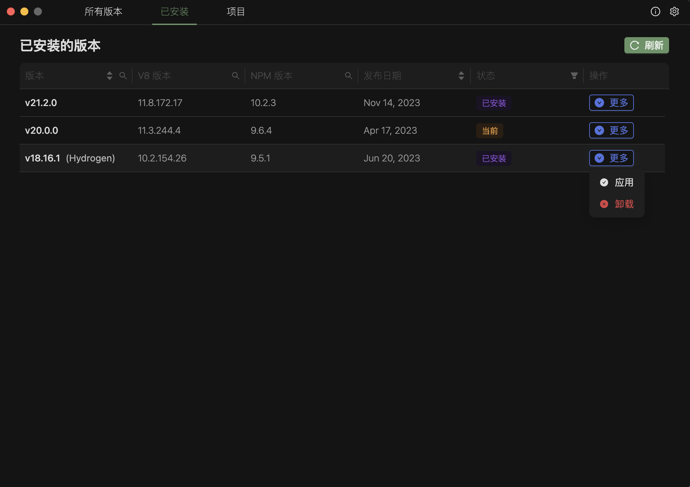

可以应用或者卸载已经下载好的版本。

可以在终端中查看是否切换成功：

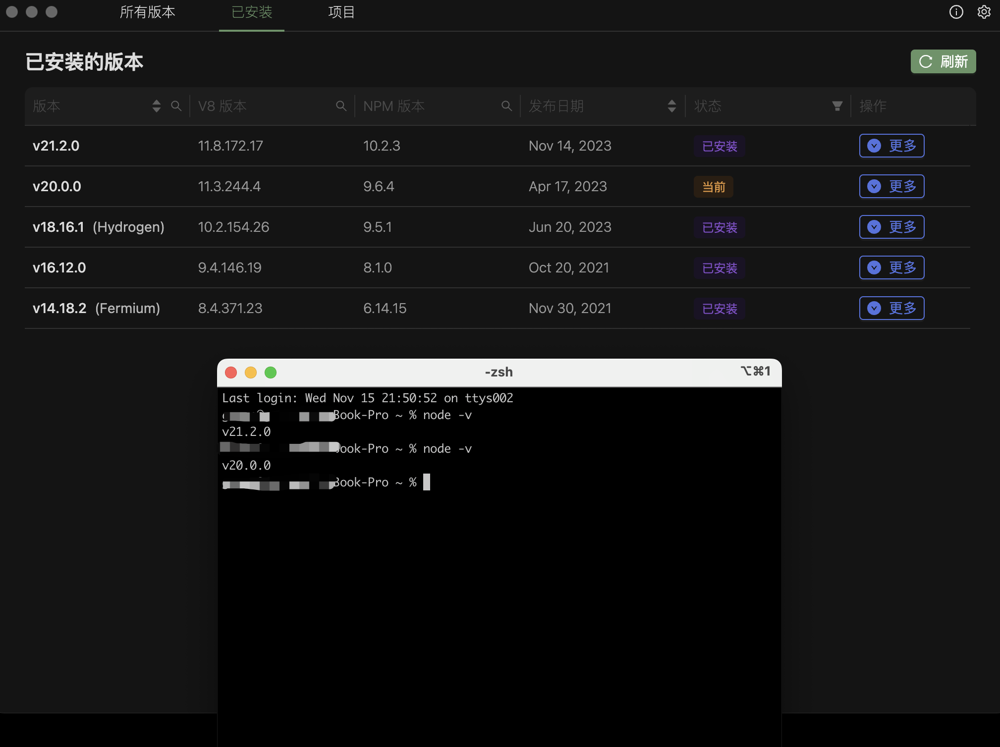

nvm-desktop 还支持为每个项目设置不同的 Node.js 版本，只需从本地添加项目，并设置需要的版本即可：

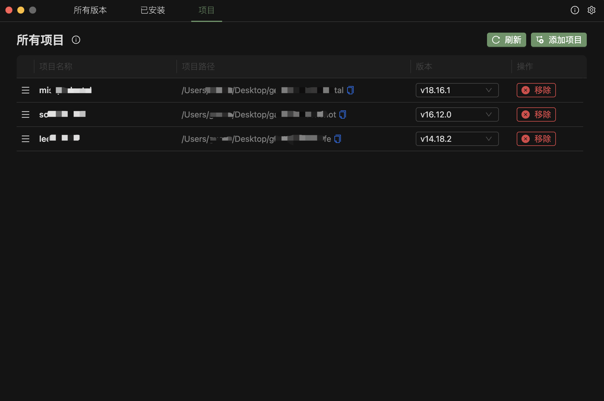

这样设置之后，全局的 Node.js 版本和项目的 Node.js 版本互不干扰。

除此之外，点击版本名称可以查看该版本的更新日志，点击右上角的“远程刷新”按钮可以获取最新的 Node.js 版本：

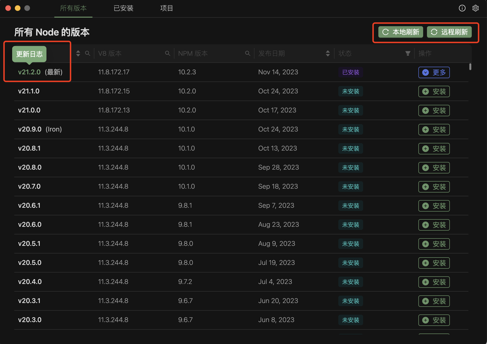

支持搜索 Node.js 版本、 V8 版本、NPM 版本，支持按发布时间排序，对不同版本进行筛选：

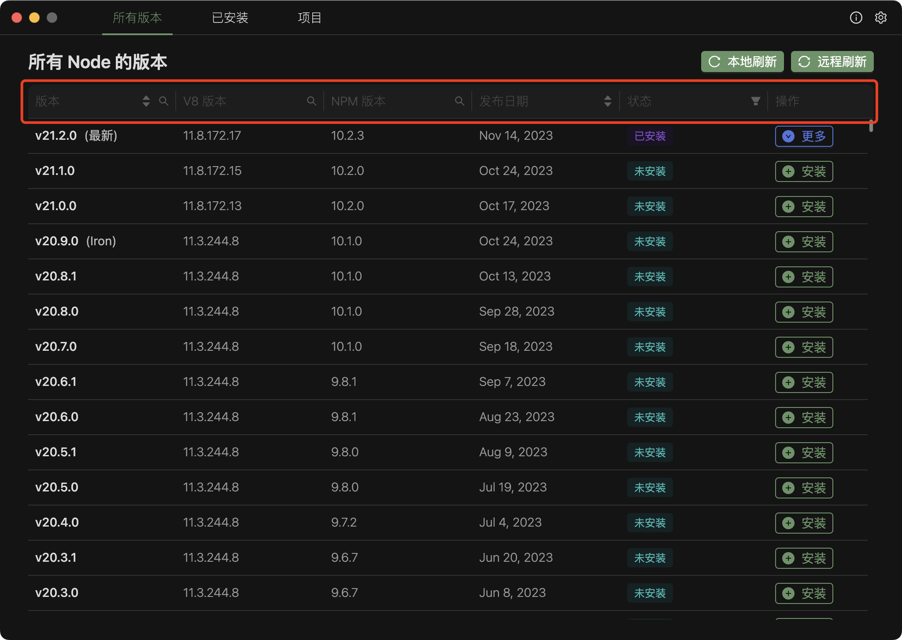

### 便捷访问

在 Mac 上，支持在顶部菜单栏便捷修改 Node.js 版本：

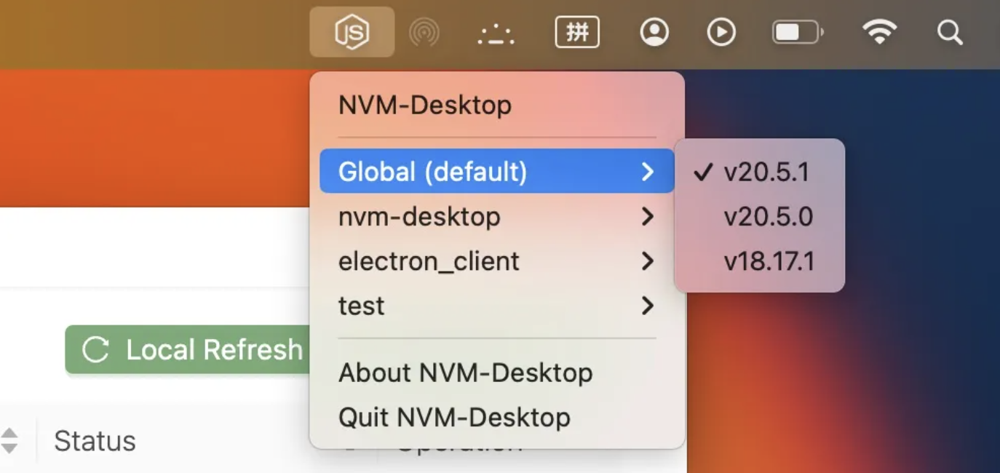

在 Windows 上，支持在右下角菜单便捷修改 Node.js 版本：

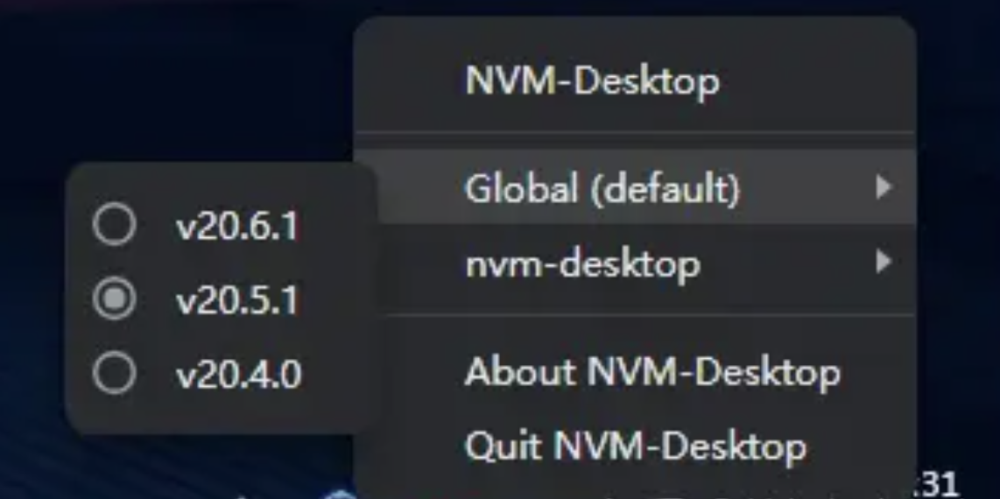

## 小结

nvm-desktop 简直是懒人的福音，再也不用写命令去切换 Node.js 版本了！

Github：<https://github.com/1111mp/nvm-desktop>


> 更新: 2024-02-24 16:22:21  
> 原文: <https://www.yuque.com/cuggz/feplus/lg56xa0hyg2e3ky1>