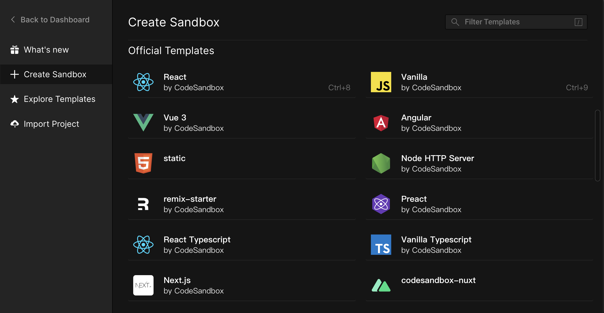
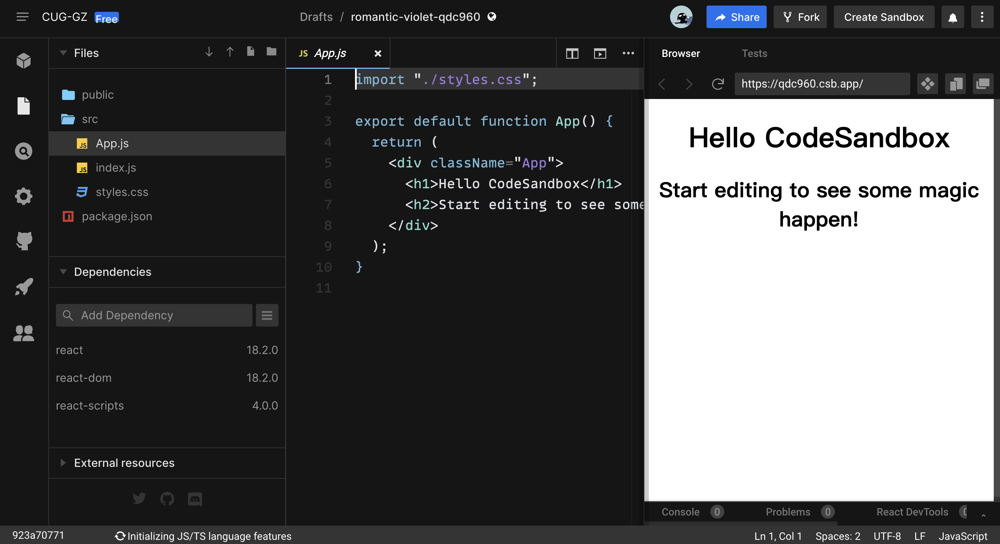
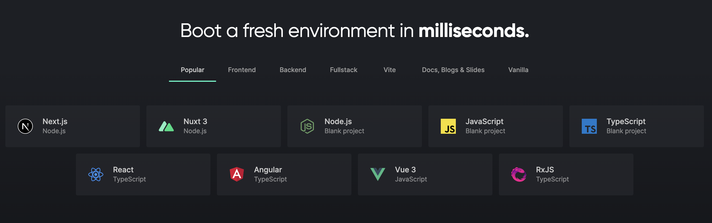
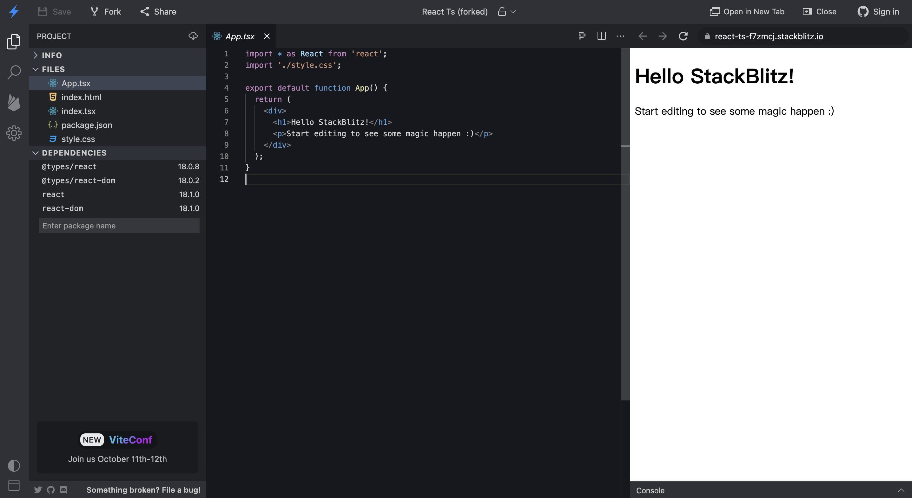
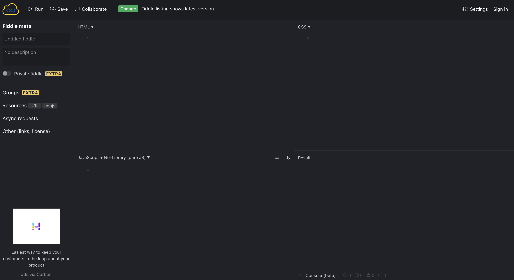
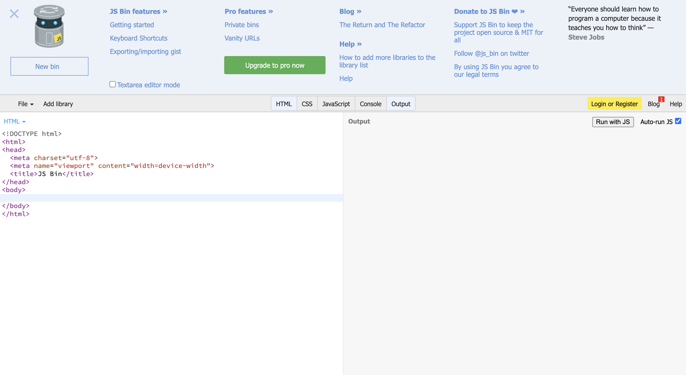
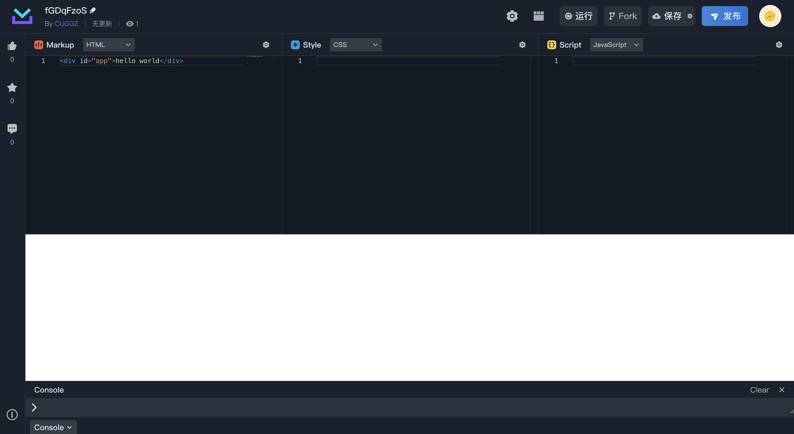

# 在线代码编辑器

## Codesandbox
CodeSandbox 是一个在线代码编辑器，主要用于创建 Web 应用项目，其提供了多种模块：

CodeSandbox 为前端开发提供了完整的代码编辑器体验和沙盒环境。其包含了很多实用功能：

+ Npm 支持：可以添加几乎任何 npm 上可用的包；
+ 支持 TypeScript、热更新、GitHub 导出、静态文件托管等；
+ 使用 Monaco 编辑器构建，Monaco 是为 VSCode 的提供支持的代码编辑器，有很多相似的体验；
+ 集成的 DevTools、linting、错误覆盖、测试框架 (Jest)等；
+ 强大的 CLI 可以直接将本地项目导入 CodeSandbox。

**在线地址：**[https://codesandbox.io/](https://codesandbox.io/)

## Codepen
CodePen 是一个在线的HTML、CSS 和 JavaScript 代码编辑器，能够编写代码并**即时预览效果**，可以利用它来构建和分享代码。CodePen 支持使用 Less、Sass、PostCSS 等来编写CSS。CodePen 不仅是一个在线编辑器，还是一个庞大的前端社区，上面有来自全球开发者分享的各种各样炫酷的效果，并且这些代码都是开源和共享的。

**在线地址：**[https://codepen.io/](https://codepen.io/)

## Stackblitz
Stackblitz 和 VSCode 非常像，使用简单可以一键创建 React、Vue、Vanilla、RxJS、TypeScript、Angular 等项目：

Stackblitz 具有以下特性：

+ 在浏览器中集成了一个 Dev Server，在离线的情况下仍然可以进行开发；
+ 除了支持前端项目外，还支持在浏览器中运行 Node.js 环境；
+ 支持连接 GIthub 仓库，可以直接将代码 push 到  Github 上，也可以拉取 Github 项目进行查看和编辑；
+ 所有应用程序都会自动部署在其服务器上。

**在线地址：**[https://stackblitz.com/](https://stackblitz.com/)

## JSFiddle
JSFiddle 是一个在线代码编辑器，允许用户在单个页面上编辑和运行 HTML、JavaScript 和 CSS 代码。JSFiddle 使用 CodeMirror 构建，其提供了多游标、语法高亮、语法验证（linter）、大括号匹配、自动缩进、自动完成、代码/文本折叠、搜索和替换以协助开发人员的操作。JSFiddle 被广泛用于共享简单的测试和演示。

**在线地址：**[http://jsfiddle.net/](http://jsfiddle.net/)

## JS Bin 
JS Bin 是一个开源的协同 web 开发调试工具。主要用于帮助测试 JavaScript 和 CSS 的代码片段，功能与 jsFiddle 类似。可以实时分享在 JS Bin 中输入的内容，在任何平台上的任何设备上查看 JS Bin 的输出，都是实时更新的。

**在线地址：**[https://jsbin.com/](https://jsbin.com/)

## 码上掘金
码上掘金是一个为广大开发者提供代码在线 Playground 的平台，具备轻量简单、易使用、现代标准、模块化、实时编辑，所见即所得等特性。内置了 ES Modules 支持，并且支持 React、Vue 等流行前端框架。

**在线地址：**[https://code.juejin.cn/](https://code.juejin.cn/)

> 更新: 2022-09-07 23:35:18  
> 原文: <https://www.yuque.com/cuggz/feplus/fqrtvo>