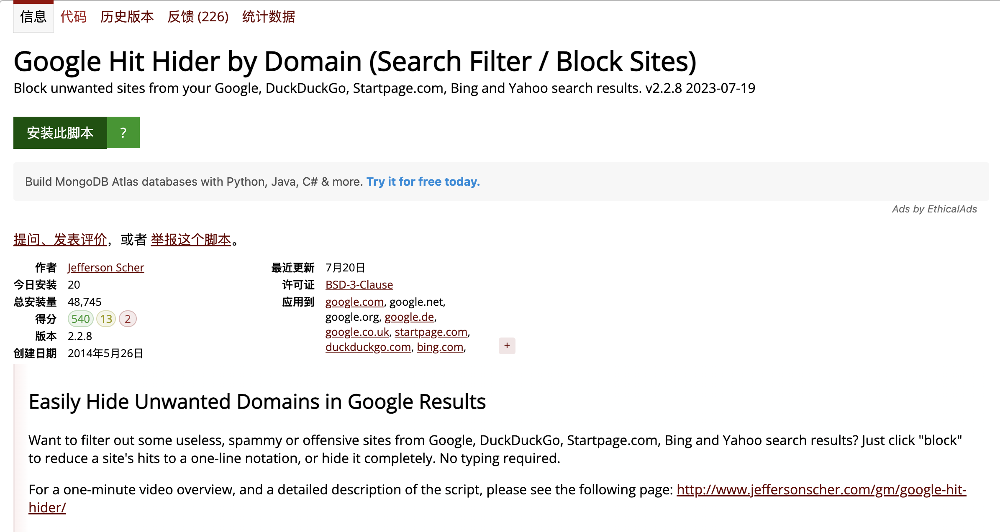
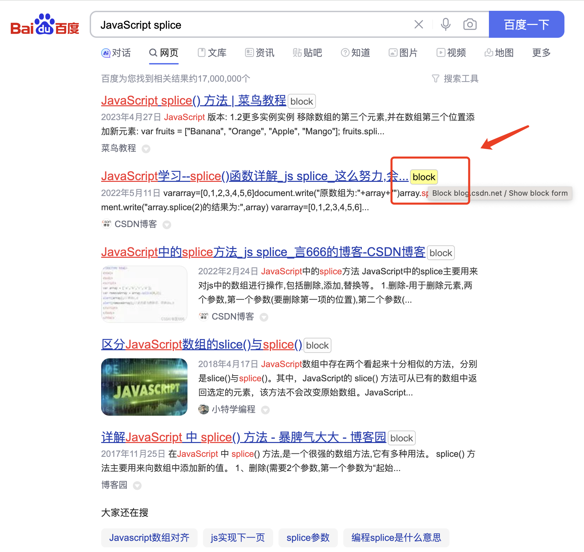
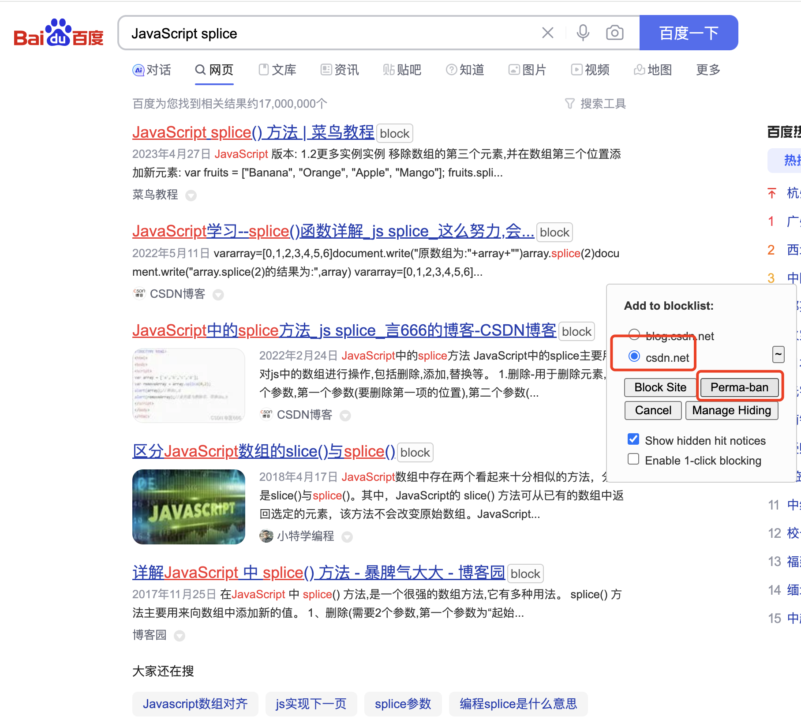
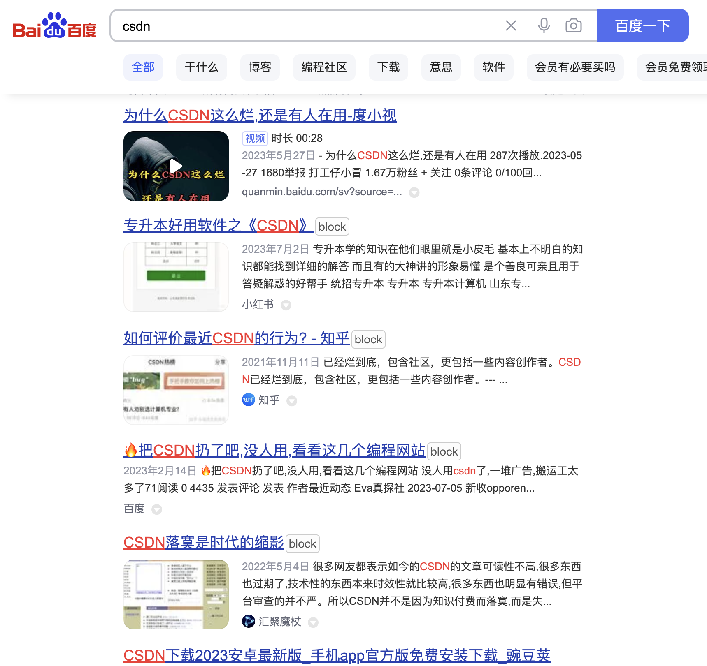
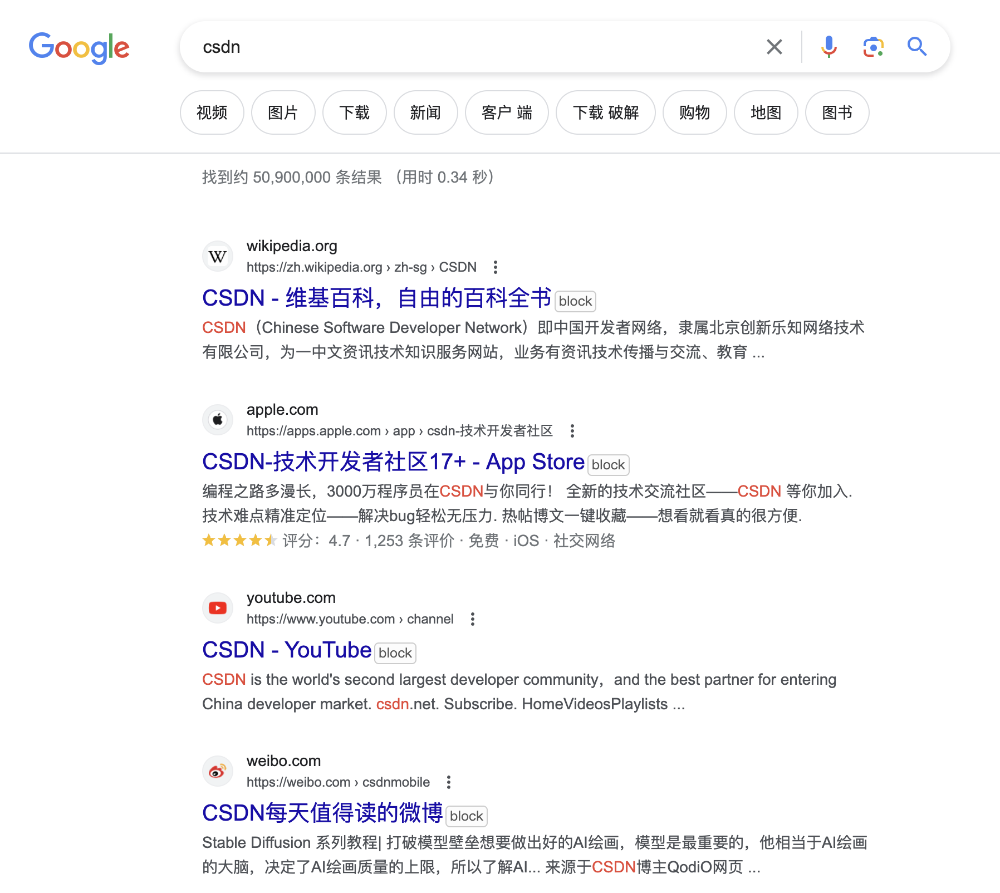
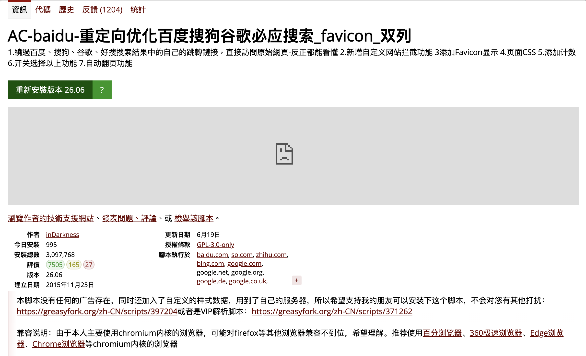
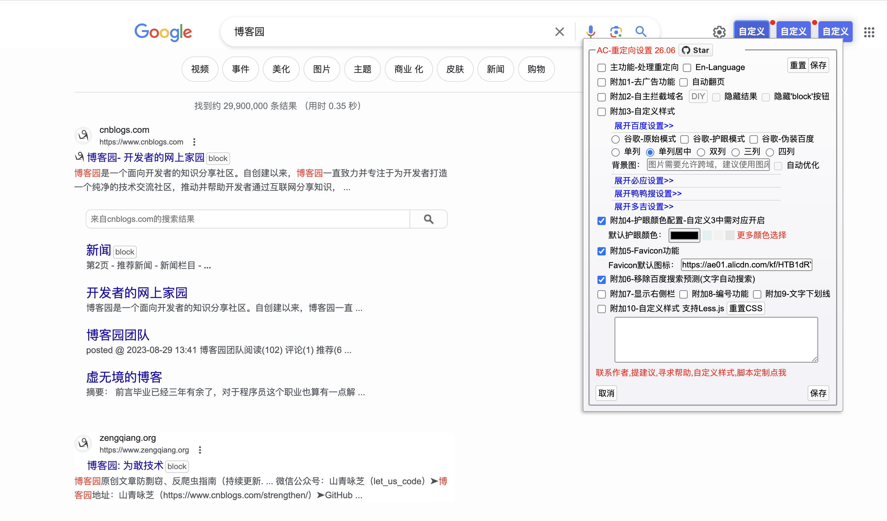
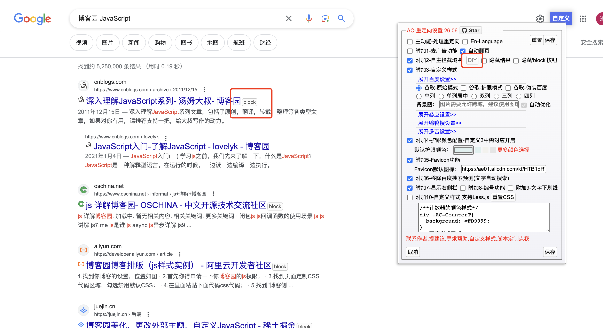
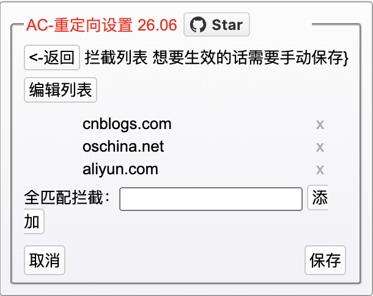
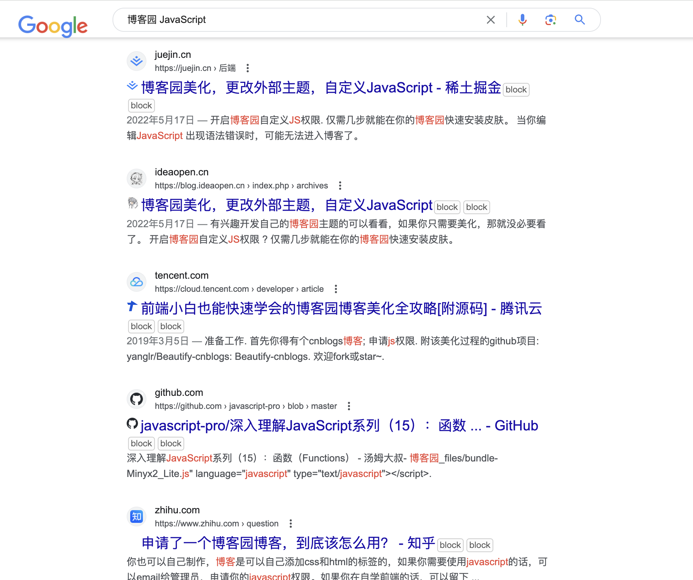

# 屏蔽 CSDN

在日常开发中，我们会经常使用百度、谷歌等搜索引擎来搜索问题。但是，在搜索结果中经常包含大量低质量的内容，比如，出自 CSDN、PHP 中文网、百度文档、博客园等网站的搜索结果，就包含大量的低质量、重复、错误的内容。

那能否在搜索结果中过滤掉出自这些网站的内容呢？当然是可以的，下面就来看看如何在搜索结果中过滤掉这些结果。

首先，推荐一个油猴插件：[**Google Hit Hider by Domain (Search Filter / Block Sites)**](https://greasyfork.org/zh-CN/scripts/1682-google-hit-hider-by-domain-search-filter-block-sites)

虽然这个插件名为 Google...,但是它适用于各种搜索引擎，包括百度。

只需要按照步骤安装，安装完成之后，在搜索引擎搜索后，每个结果后面会出现一个 `block` 的标志，如下所示：

点击需要屏蔽的网站的`block`标志，选择网址，然后点击 `Perma-ban` 按钮，就会将这个网站的所有搜索结果永久屏蔽掉了。例如，屏蔽 CSDN 的结果，要选择 `csdn.net`：

这样就搞定啦！再次搜索时，就没有了来自已经屏蔽网站的结果：

（这个搜索结果，是有点东西的哈哈哈）

注意，屏蔽之后，在其他搜索引擎也就搜索不到了，不需要在每个搜索引擎中屏蔽，简直不要太方便！

然后，推荐第二个插件：[**AC-baidu-重定向优化百度搜狗谷歌必应搜索\_favicon\_双列**](https://greasyfork.org/zh-TW/scripts/14178-ac-baidu-%E9%87%8D%E5%AE%9A%E5%90%91%E4%BC%98%E5%8C%96%E7%99%BE%E5%BA%A6%E6%90%9C%E7%8B%97%E8%B0%B7%E6%AD%8C%E5%BF%85%E5%BA%94%E6%90%9C%E7%B4%A2-favicon-%E5%8F%8C%E5%88%97)

该插件适用于 chromium 内核的浏览器，支持在360极速浏览器、Edge浏览器、Chrome浏览器等 chromium 内核的浏览器上使用。

点击安装，按照步骤安装完成之后，在搜索结果页面，点击右上角的“自定义”按钮：\

当添加这个插件之后，每条搜索结果也会出现一个 block 标志，点击即可把这个网站添加到屏蔽列表中。

当然，也可以在右侧的设置面板中点击 DIY 来自定输入要屏蔽的网站域名。这里会显示所有已屏蔽的网站的域名，可以进行删除。

需要注意，在设置面板的内容更改之后，需要**双击点击保存**按钮，才会生效。

完事之后，再搜索就不会这些屏蔽网站的内容了：

注意：这里每条记录后面出现了两个 block，是因为我安装了上述两个插件，如果只安装一个，就不会出现这个问题。

这个插件还有很多其他功能，可以自己去尝试一下：

* 去掉百度、搜狗、谷歌搜索结果的重定向，回归为网站的原始网址---附带有去除百度的广告 包括百度顶部和底部的垃圾广告-百家号
* 默认移除百度百家号的内容--应广大群众的需求
* 提供护眼模式，颜色自定义，夜晚不伤眼
* 支持自定义页面效果，如果你会css样式表的话，你可以自己优化整体的页面效果
* 添加百度、搜狗、谷歌搜索结果中Favicon显示效果，页面效果更加美观和实用
* 添加标记数量，标记当前的id，界面更好看
* 百度和谷歌、必应和搜狗搜索页面都可以设置为单列、双列模式以及多列模式，视野更大
* 请求是异步请求，并不会出现一个链接没有反馈回来，其余等待的情况，每个链接的请求都是独立的，互不影响，对于网络的影响几乎没有

这两个插件是类似的，因此可以选择其中一个使用。

> 更新: 2024-02-24 16:24:03  
> 原文: <https://www.yuque.com/cuggz/feplus/ty87q0vmgdnpagfn>