# 性能测试工具

## 1. Google PageSpeed Insights
Google PageSpeed Insights可以为网站生成性能报告，它在移动设备和桌面设备上都是免费的。并且还给出了影响页面加载速度的原因，并为这些问题提供了解决方案。网站速度按照 100 分进行划分，其中：

+ 大于90：较好；
+ 50-90：需要改进；
+ 小于50：较差

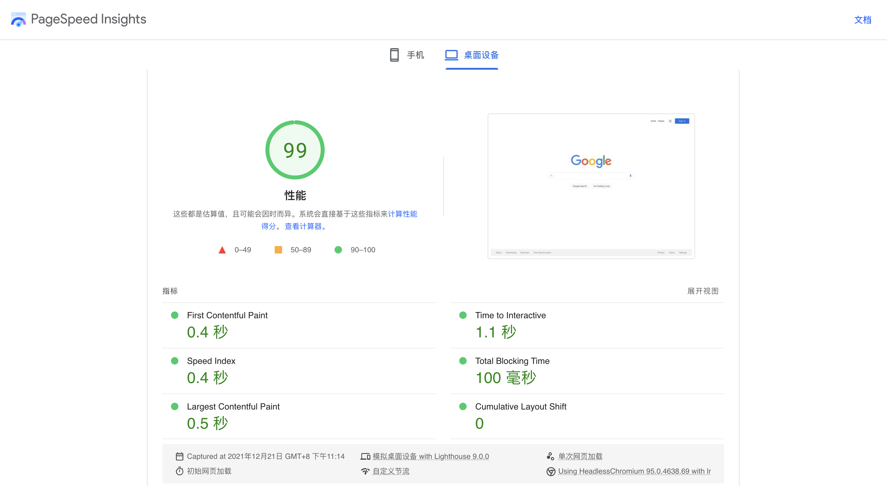

在线地址：[https://pagespeed.web.dev/](https://pagespeed.web.dev/)

## 2. Pingdom Website Speed Test
Pingdom Website Speed Test 可以全面分析影响页面Web速度的因素。此外，还可以查看网站在亚洲、欧洲等多个不同的地理位置的性能信息。  
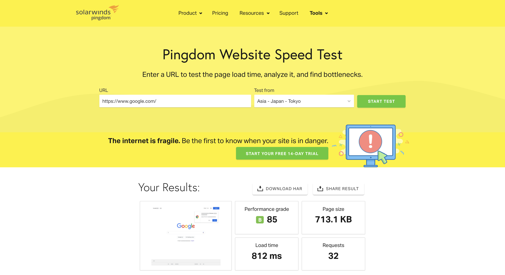

在线地址：[https://tools.pingdom.com/](https://tools.pingdom.com/)

## 3. WebPagetest
WebPagetest是 AOL 开发的一款在线的免费性能评测网站，从全球多个地点运行免费网站速度测试。可以运行简单的测试或执行高级测试，包括多步骤事务、视频捕获、内容阻塞等等。还将依据测试结果提供丰富的诊断信息，包括资源加载瀑布图，页面速度优化检查和改进建议，会给每一项内容一个最终的评级。

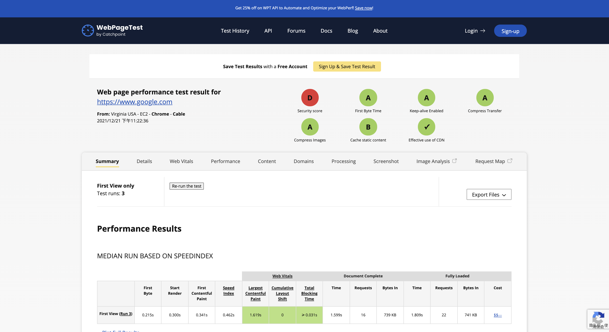

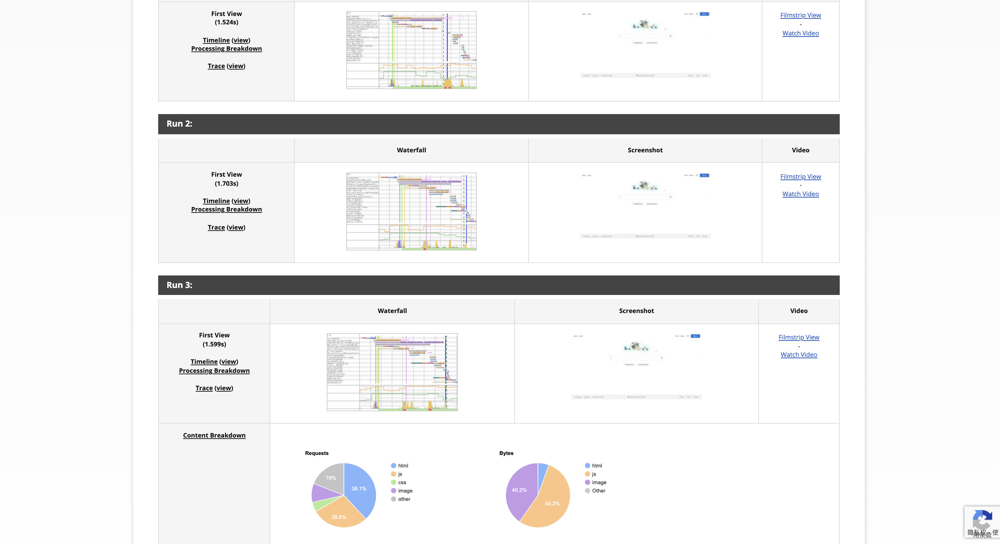

在线地址：[https://www.webpagetest.org/](https://www.webpagetest.org/)

## 4. GTmetrix
GTmetrix 是一个类似于 pingdom 的工具，可以快速轻松地测试网站速度。它主要有PageSpeed和YSlow两部分组成，并提供相应的得分数据，能够真实的反应出网站的性能，并且会提供可行性建议来帮助改善网站性能。

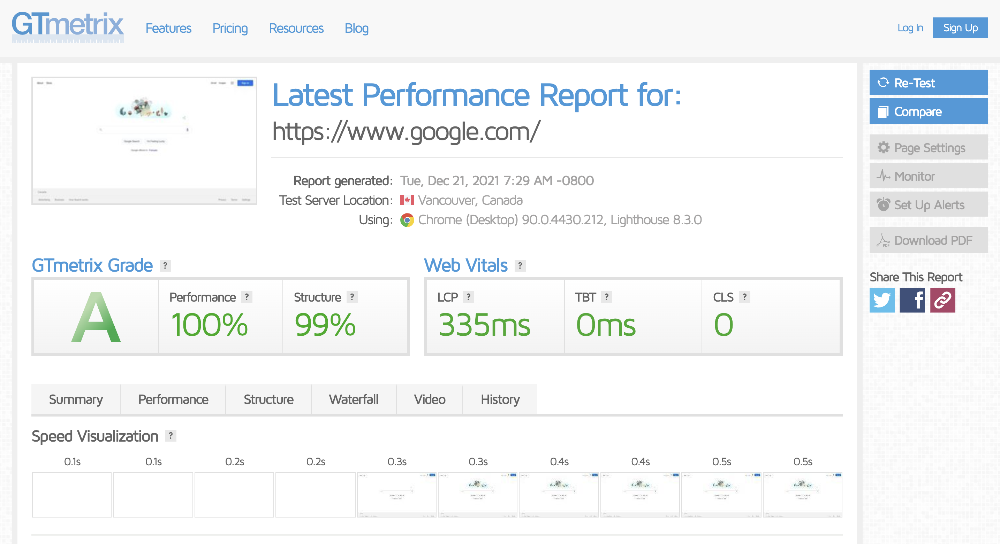

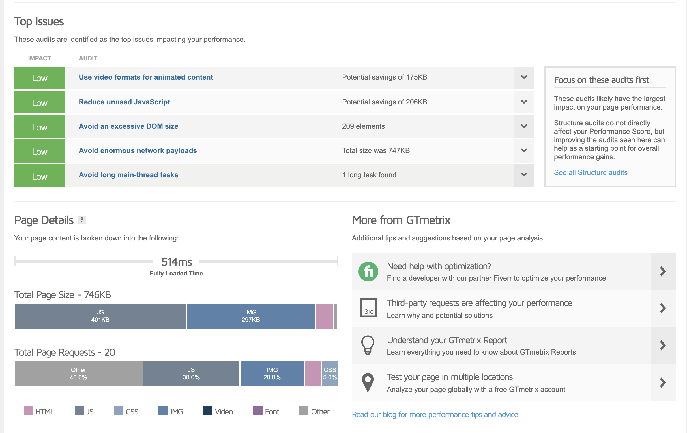

在线地址：[https://gtmetrix.com/](https://gtmetrix.com/)

## 5. Keycdn Tool
Keycdn Tool 是一个在全球 10 个不同地点的网站速度测试工具。它允许测试任何页面的性能。返回的结果将提供请求、内容大小和加载时间等详细信息。此外，还有一个完整的瀑布图，详细说明了每个资源的加载时间和 HTTP 头。

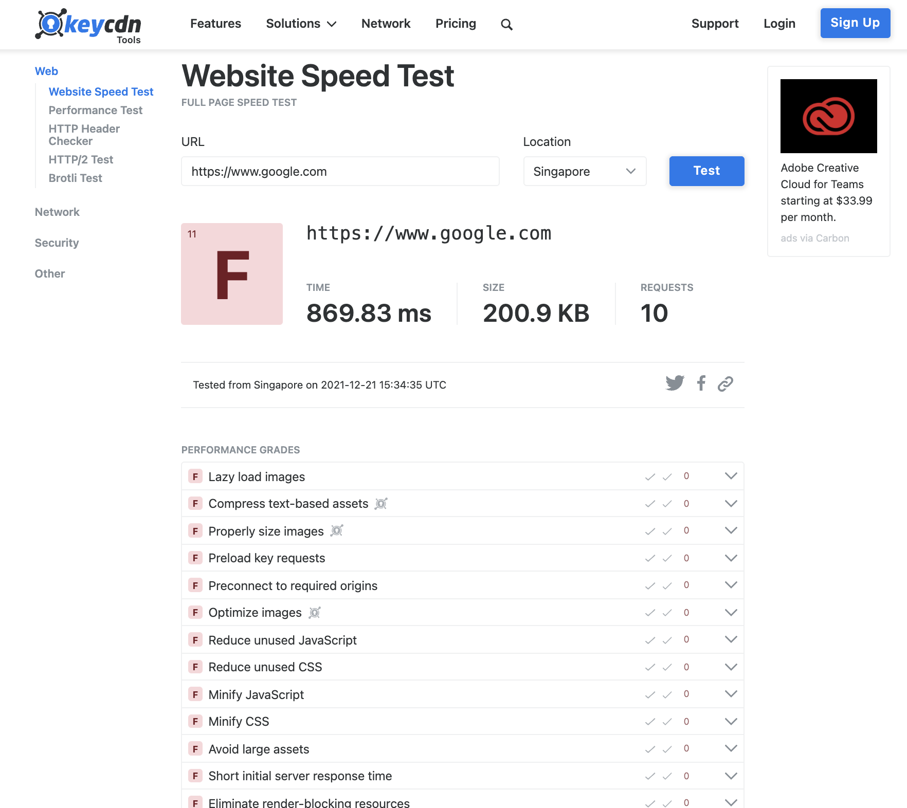

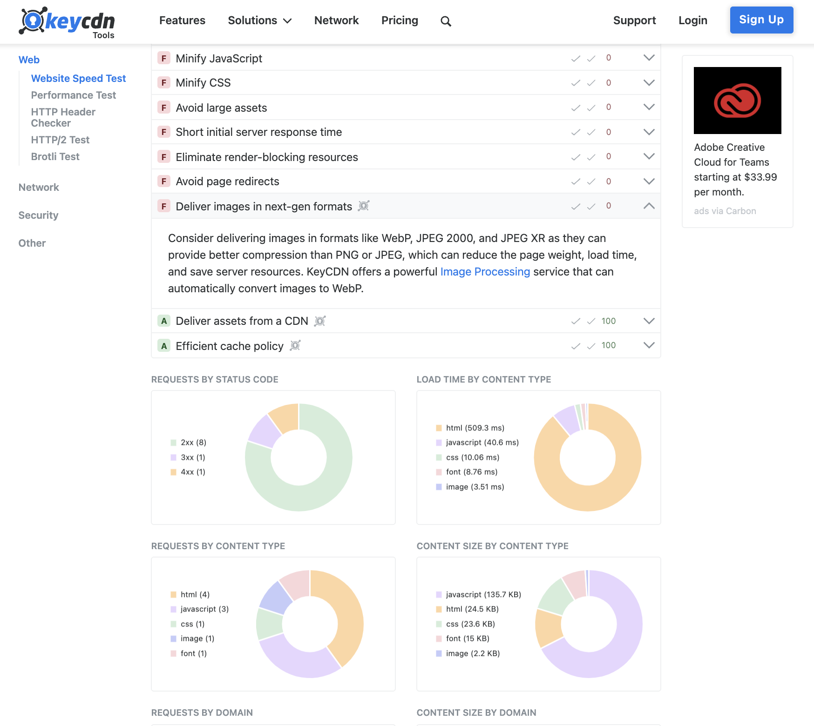

在线地址：[https://tools.keycdn.com/speed](https://tools.keycdn.com/speed)

## 6. GiftOfSpeed
GiftofSpeed是一款免费网站载入速度测试工具，可以在上面获得网站综合性能信息，它能够展示网站加载时间以及评估网站有哪些需要改进的地方，并给予一个客观的综合评分。

GiftofSpeed 的测试結果以瀑布流展示，可以很容易看到网站加载速度，每一项资源的的载入顺序、大小与响应时间的长短，方便了解网站的各项载入资源。此外，它还提供了载入时间最长的內部文件以及外部文件，从而分析出是由哪些因素影响了你网站的载入速度，就可以专门针对这些载入时间较长的元素进行优化，从而最大限度提升网站载入速度。

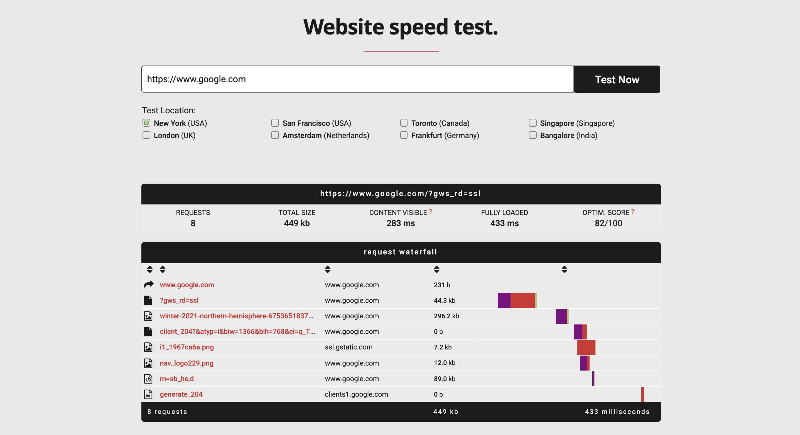

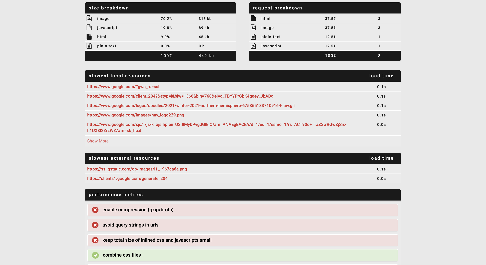

在线地址：[https://www.giftofspeed.com/](https://www.giftofspeed.com/)

## 7. Pagelocity
Pagelocity 是一个网站分析性能测试工具。这个工具也提供了追踪竞争对手的能力。代码检视图在类似工具中是独一无二的。如果想知道 TTFB 和图形化 DOM 元素等，都能通过这项工具获取到。

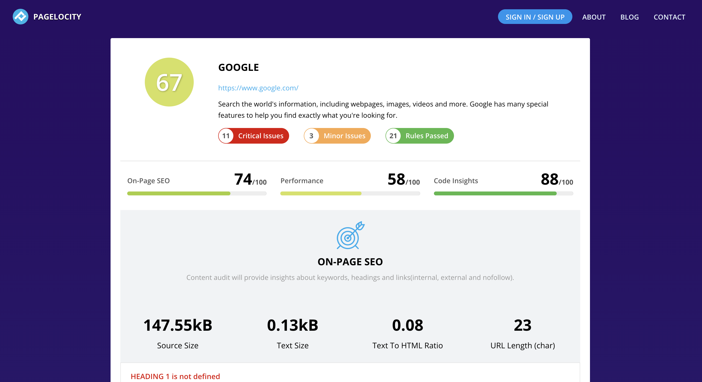

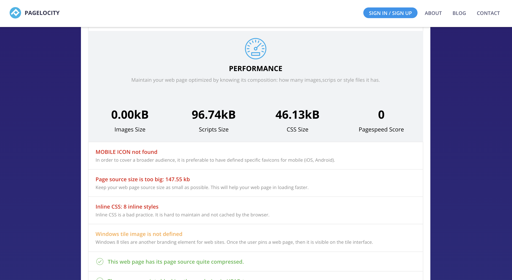

在线地址：[https://pagelocity.com/](https://pagelocity.com/)

## 8. Sucuri Loadtime Tester
Sucuri Load Time Tester 是一个网站分析性能测试工具，它用不同的颜色表示网速快慢，可以很直观地看出测试网站在不同国家的运行速度。绿色表示畅通，没有颜色的普通数字表示一般，黄色表示中等偏慢，红色表示缓慢。

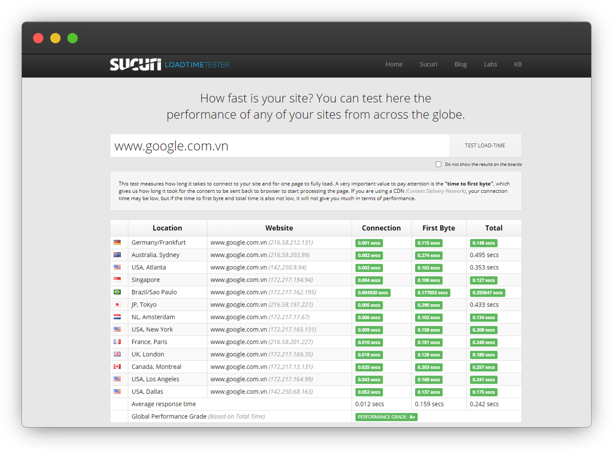

在线地址：[https://performance.sucuri.net/](https://performance.sucuri.net/)

## 9. GEEKFLARE
GEEKFLARE 是一套免费的性能测试工具，用于测试网站的 DNS、安全性、性能、网络和 SEO 等问题。

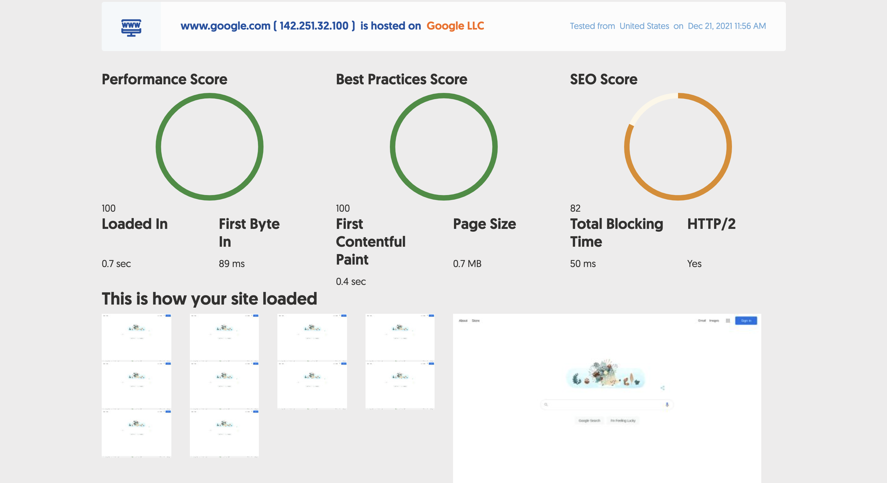

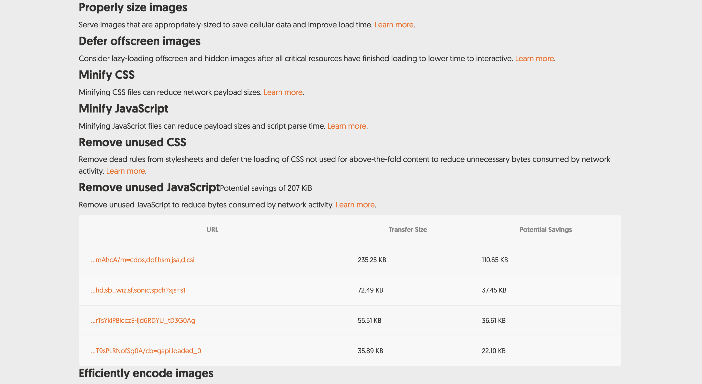

在线地址：[https://gf.dev/](https://gf.dev/)

## 10. Dotcom-monitor
Dotcom-monitor 是一款网站性能测试工具，它可以选择测试的地点、设备的类型、屏幕分辨率、网络情况等来测试不同情况下的网站速度。

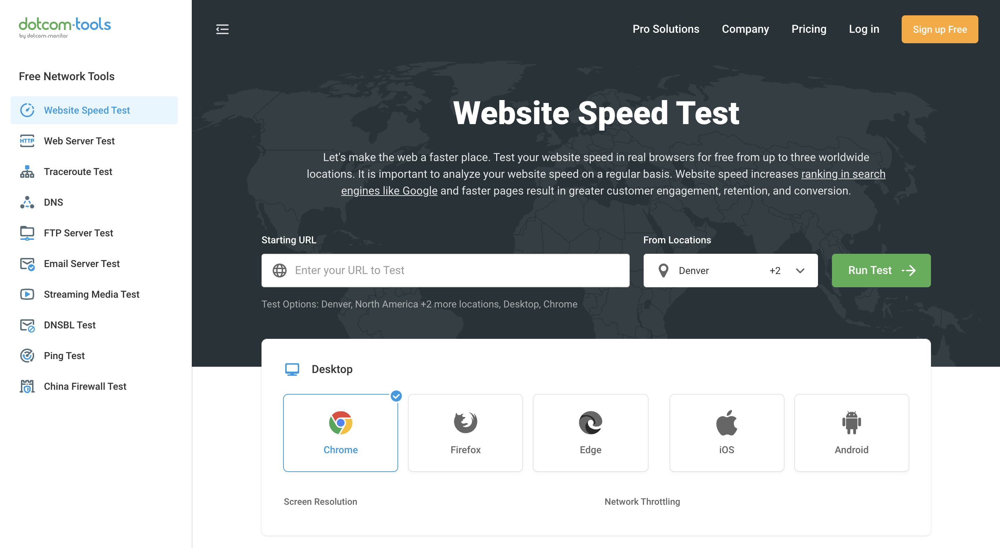

在线地址：[https://www.dotcom-tools.com/website-speed-test](https://www.dotcom-tools.com/website-speed-test)

## 11. Dareboost
DareBoost 是一个免费网站速度测试和网站分析工具。它提供超过 100 种不同的检查项目用以分析你的网站速度。可以测试桌面端与行动页面、Firefox 与 Chrome 和五个节点的速度差异。

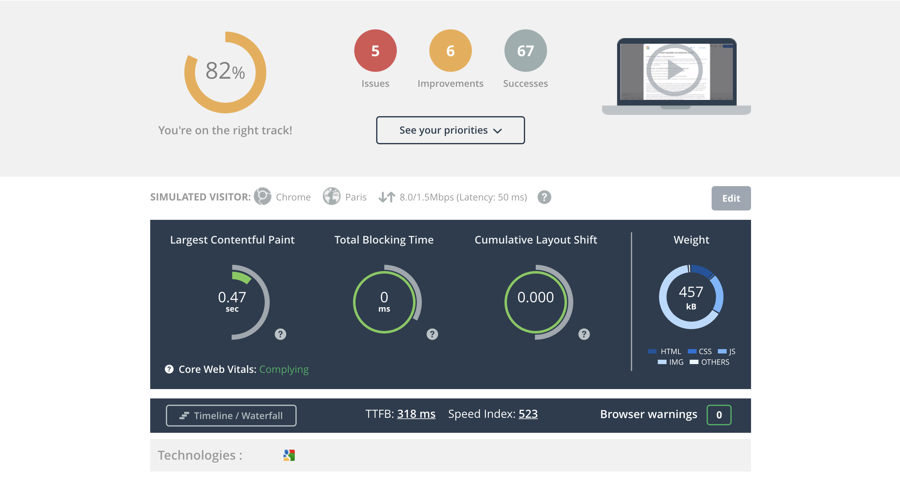

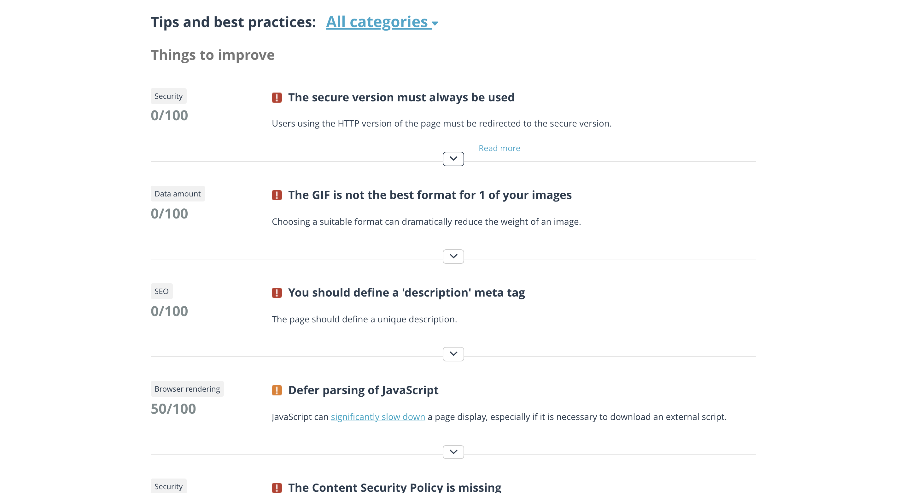

在线地址：[https://www.dareboost.com/en](https://www.dareboost.com/en)

> 更新: 2022-01-27 16:52:23  
> 原文: <https://www.yuque.com/cuggz/feplus/nngrm9>