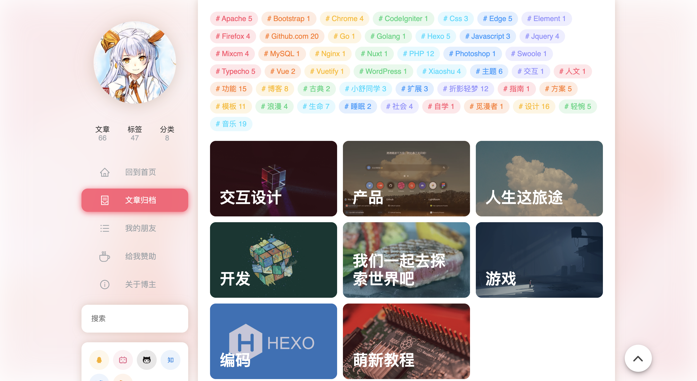
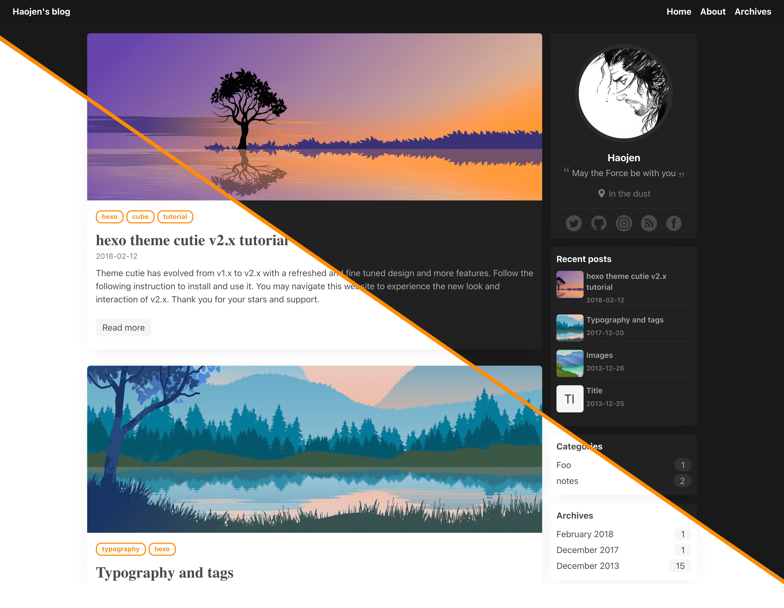
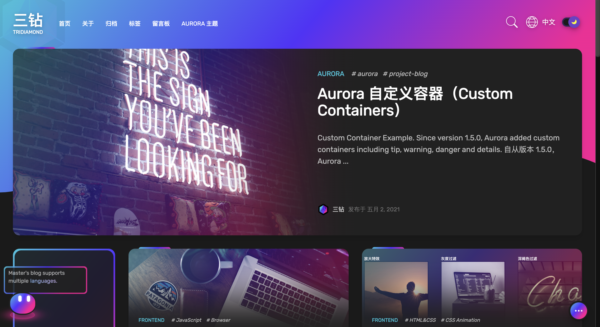
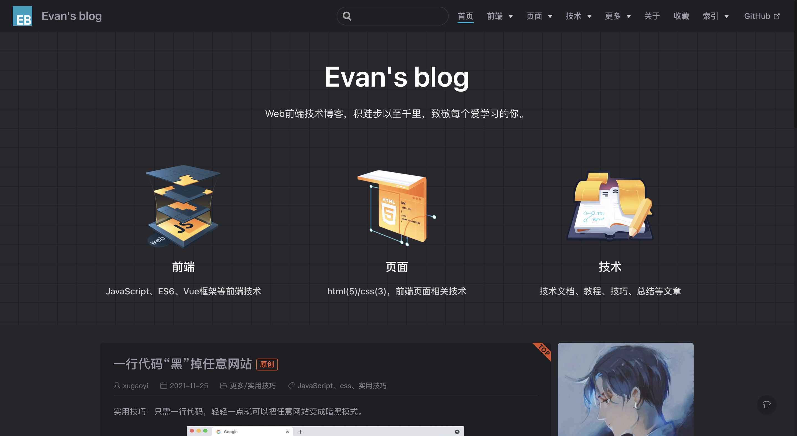
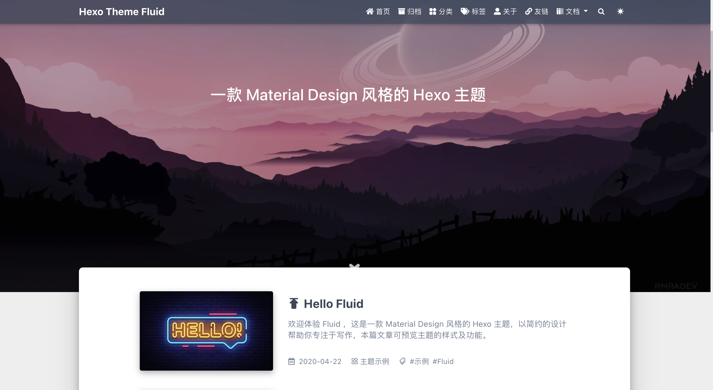
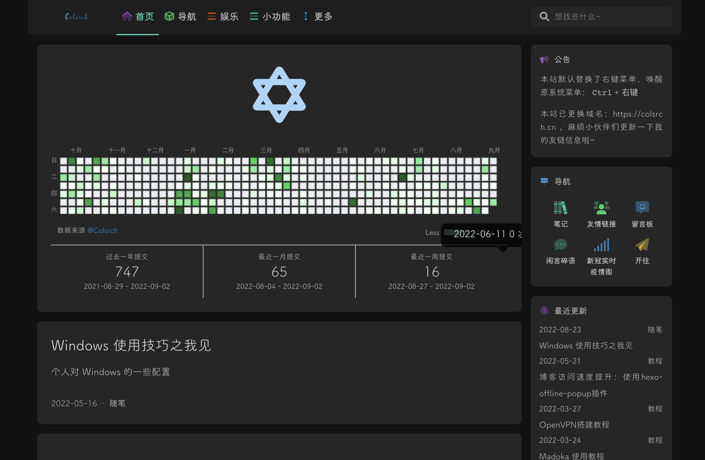

# 技术博客

## Aurora
Aurora 是一款基于 Vuepress 2 的博客主题，将本地 Markdown 文件解析成静态 html 页面，作为博客文章。搭配说说，时间轴，文章分类，评论，友情链接，相册，音乐播放器等特色功能，给你不一样的使用体验。

**Github：**[https://github.com/vuepress-aurora/vuepress-theme-aurora](https://github.com/vuepress-aurora/vuepress-theme-aurora)

## Nexmoe
一个简洁美观的博客系统，基于Hexo开发，其支持图片瀑布流、自定义主题颜色、内置/外置搜索、侧栏备案信息、网页访问统计、支持多款评论插件、内置多语言、图片懒加载、社交按钮等功能。

**Github：**[https://github.com/theme-nexmoe/hexo-theme-nexmoe](https://github.com/theme-nexmoe/hexo-theme-nexmoe)

## Claudia
Claudia是一个设计简洁且易于配置的博客系统，Lighthouse 评分90+，界面简洁，易于阅读。

**Github：**[https://github.com/Haojen/hexo-theme-Claudia](https://github.com/Haojen/hexo-theme-Claudia)

## Aurora
Aurora是使用极光颜色和UI元素的下一代主题。它给你未来的色彩和感觉。它是基于 Vue3 构建的，这就意味着它的性能和用户交互体验都比上一代要好得多。其支持很多实用功能，简单易用。

**Github：**[https://github.com/auroral-ui/hexo-theme-aurora](https://github.com/auroral-ui/hexo-theme-aurora)

## Vdoing
vuepress-theme-vdoing 是一款简洁高效的 VuePress 知识管理&博客主题，可以作为知识库也可以作为博客系统。其包含三种典型的知识管理形态：结构化、碎片化、体系化。轻松打造属于你自己的知识管理平台，以 Markdown 为中心的项目结构，内置自动化工具，以更少的配置完成更多的事。

**Github：**[https://github.com/xugaoyi/vuepress-theme-vdoing](https://github.com/xugaoyi/vuepress-theme-vdoing)

## Hope
vuepress-theme-hope 是一个具有强大功能的 vuepress 主题，基于 _VuePress2_， 带有 _Vite2_ / _Webpack5_ 和 _Vue3_ 的强大功能。支持文档和博客。其在 Vuepress 的基础上引入了很多实用的功能，并且对 Markdown 进行了增强，非常实用！

**Github：**[https://github.com/vuepress-theme-hope/vuepress-theme-hope](https://github.com/vuepress-theme-hope/vuepress-theme-hope)

## Fluid
Fluid 是一款 Material Design 风格的 Hexo 主题博客，其提供了详细的搭建教程。Fluid 支持页面组件懒加载、多种代码高亮方案、多语言配置、多款评论插件、网页访问统计、文章本地搜索、暗色模式、脚注语法、LaTeX 数学公式、mermaid 流程图等。

**Github：**[https://github.com/fluid-dev/hexo-theme-fluid](https://github.com/fluid-dev/hexo-theme-fluid)

## Fly
博客基于Hexo框架搭建，用到 hexo-theme-matery 主题,并在此基础之上做了很多修改，修复了一些bug，增加了一些新的特性和功能，其在原主题的基础上新增了许多实用的功能。

**Github：**[https://github.com/shw2018/hexo-blog-fly](https://github.com/shw2018/hexo-blog-fly)

## Volantis
Volantis 是一个功能丰富、高度模块化的 Hexo 博客主题。得益于其强大的模块化特性，可以轻松搭建一个极简风格的博客，也可以仿照官网搭建一个多人协作的、包含文档模块的大体量综合型博客。

**Github：**[https://github.com/volantis-x/hexo-theme-volantis](https://github.com/volantis-x/hexo-theme-volantis)

> 更新: 2022-09-11 23:41:12  
> 原文: <https://www.yuque.com/cuggz/feplus/cc1fxp>