# 画图工具

下常用的画图工具：

+ **常规画图：**Excalidraw、draw.io、语雀
+ **思维导图：**Xmind
+ **代码截图：**Carbon
+ **画图模板：**ProcessOn

## Excalidraw
Excalidraw 是一款轻量、开源的手绘风格电子白板和画图应用，可以快速画出漂亮的流程图、UML图甚至是图表。

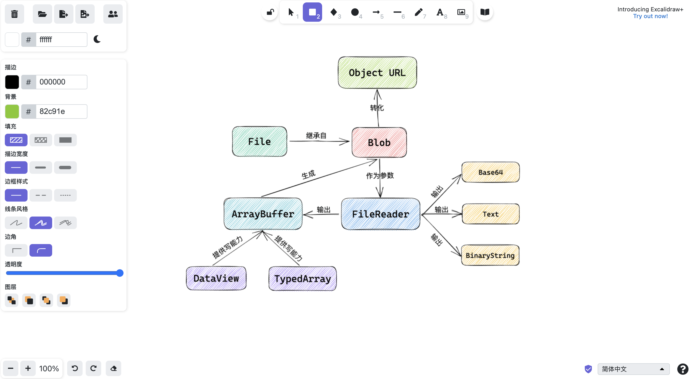

Excalidraw 提供了丰富的素材库，包含手绘风格的图标、图标等：

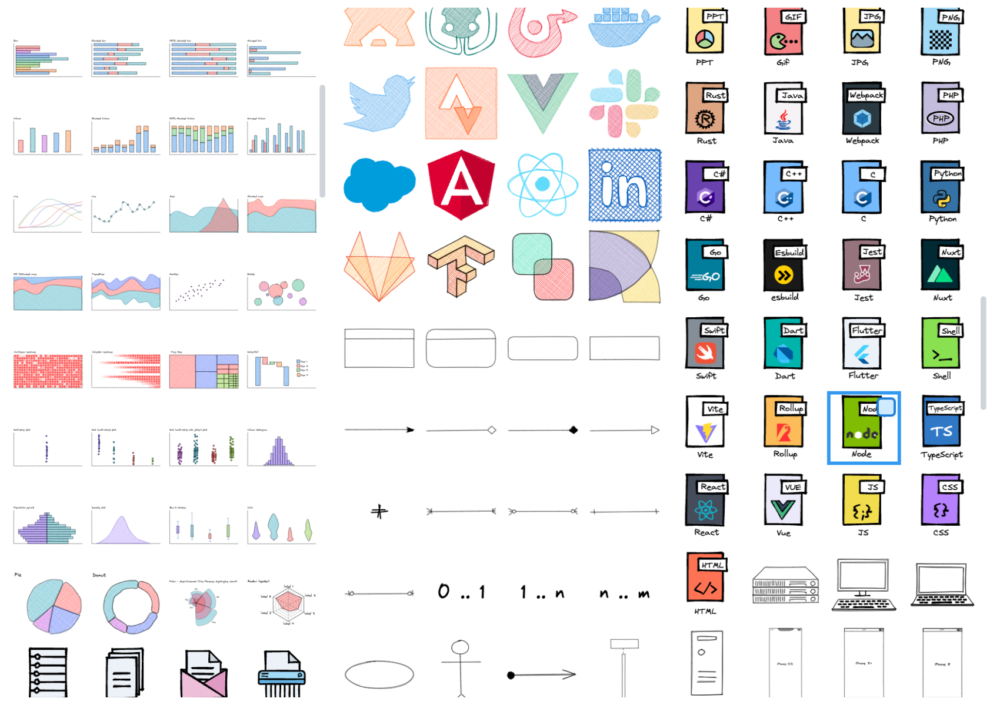

可以在模版市场来搜索需要的模板组件：

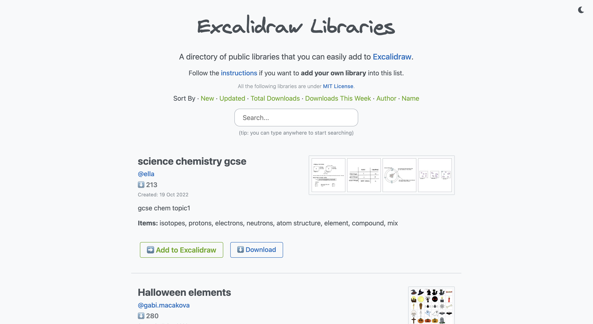

除此之外，Excalidraw 还有很多特点：

+ 界面简洁，模版众多，支持键盘快捷键，可以快速上手；
+ 免注册，支持切换为中文语言；
+ 内容安全，采用端到端加密，不会将内容上传到云端；
+ 支持导出图片、导出源文件、分享链接、实时协作、将内容保存到工作区。

**在线地址：**[https://excalidraw.com/](https://excalidraw.com/)

## Draw.io
draw.io 是一款免费的在线图表编辑工具，可以绘制流程图、UML、类图、组织结构图、泳道图、E-R图、思维导图等，堪称画图神器！

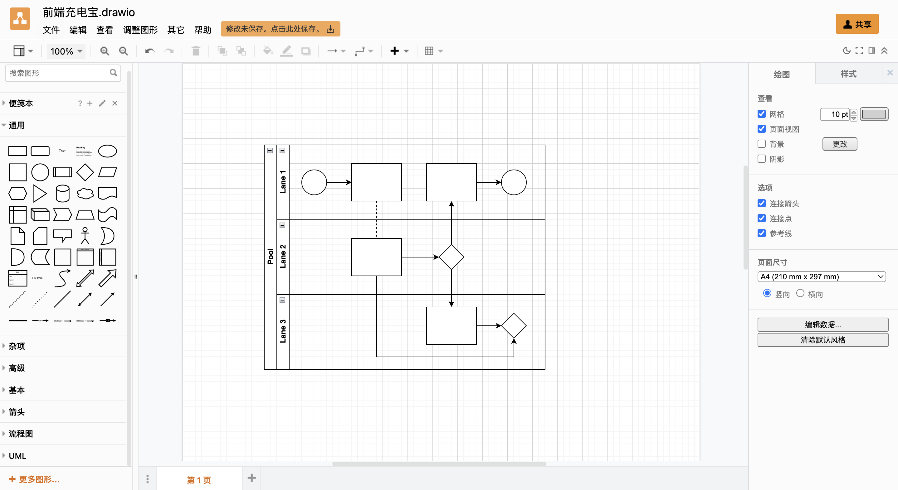

draw.io 提供了丰富的模版，支持商务、图表、cloud、工程、流程图、布局、地图、网络、软件、表格、UML、Venn等。还可以自定义模板。

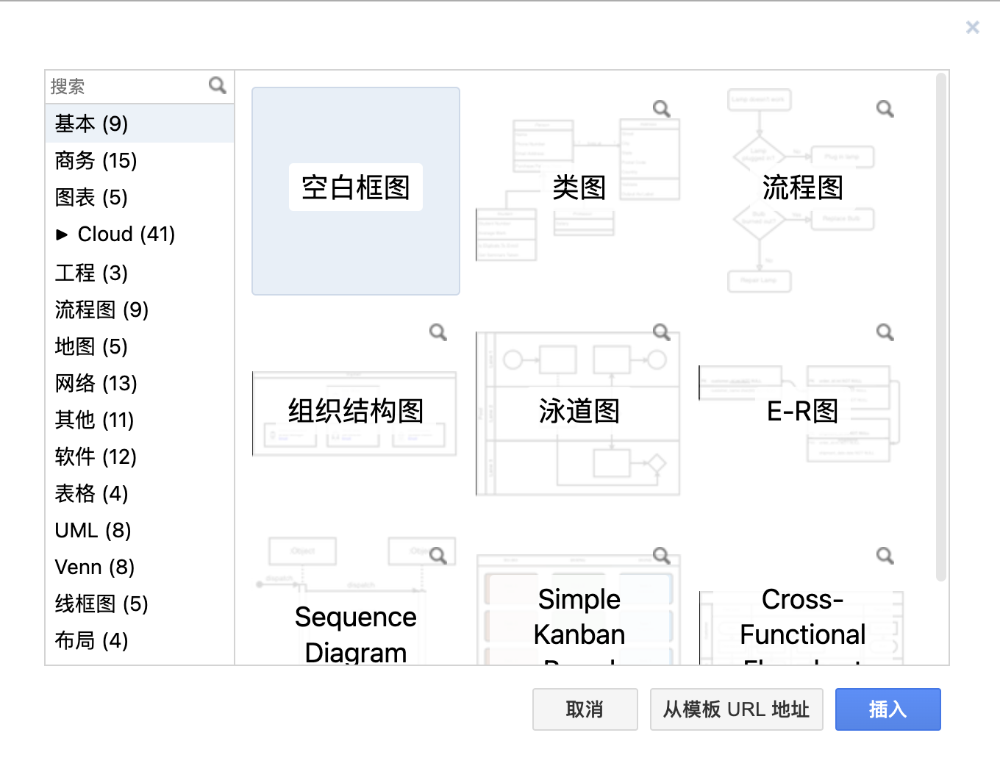

除此之外，Draw.io 还有很多特点：

+ 支持语言设置为中文；
+ 支持使用图层；
+ 支持设置手绘风格、自带多种图标，支持自定义图标；
+ 支持将图片导出为PNG、JEPG、SVG、PDF、HTML、XML等，支持导出高级设置，如调整DPI、宽高、缩放、背景等。

+ **在线地址：**https://app.diagrams.net/
+ **下载地址：**https://github.com/jgraph/drawio/releases

## 语雀
语雀是一款面向未来的文档和知识协同工具，可以用来记笔记，也可以用来画图。语雀画板支持基础图形、流程图、UML图、ER图、思维导图等。

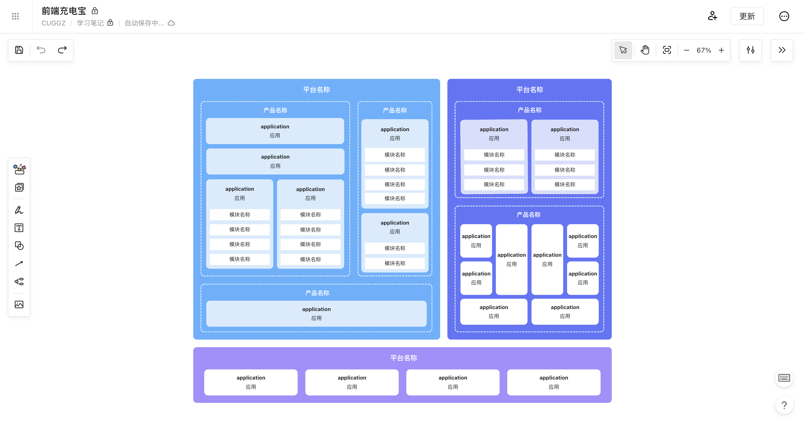

语雀画板还支持直接从 icofont 搜索、添加图标：

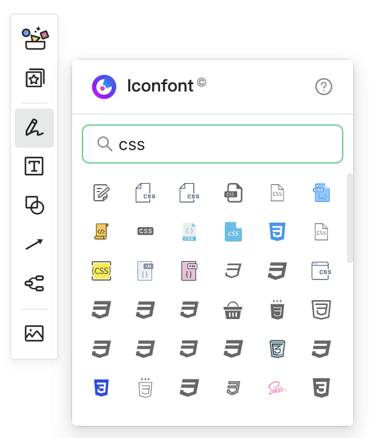

其还提供了一些常用图的模版：

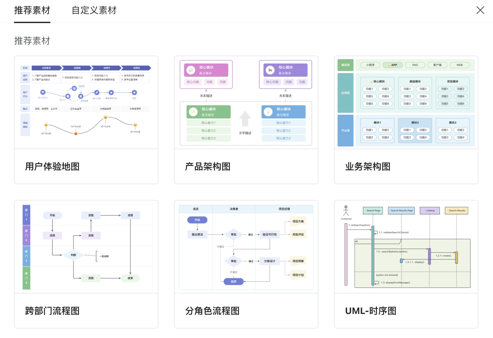

除此之外，语雀画板还有以下特点：

+ 支持团队协作绘图；
+ 保存版本，恢复历史版本。

+ **常用模板：**[https://www.yuque.com/danchun-eekrs/pbxiht](https://www.yuque.com/danchun-eekrs/pbxiht)
+ **在线地址：**[https://www.yuque.com/](https://www.yuque.com/)

## Xmind
XMind 是一个跨平台的思维导图软件，具有多种结构样式，除了普通的思维导图，还包括树形图、逻辑图、鱼骨图、时间轴、树状表格等等，不同的结构样式可以自由组合混用，同时支持一键更换结构样式。

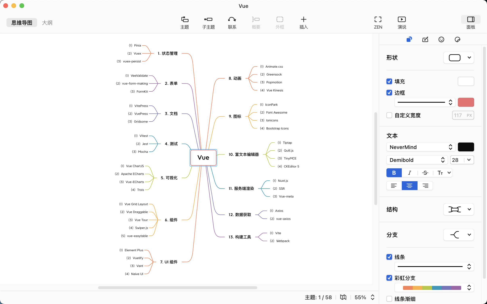

Xmind 提供了很多类型的思维导图，并支持设置多种主题风格：

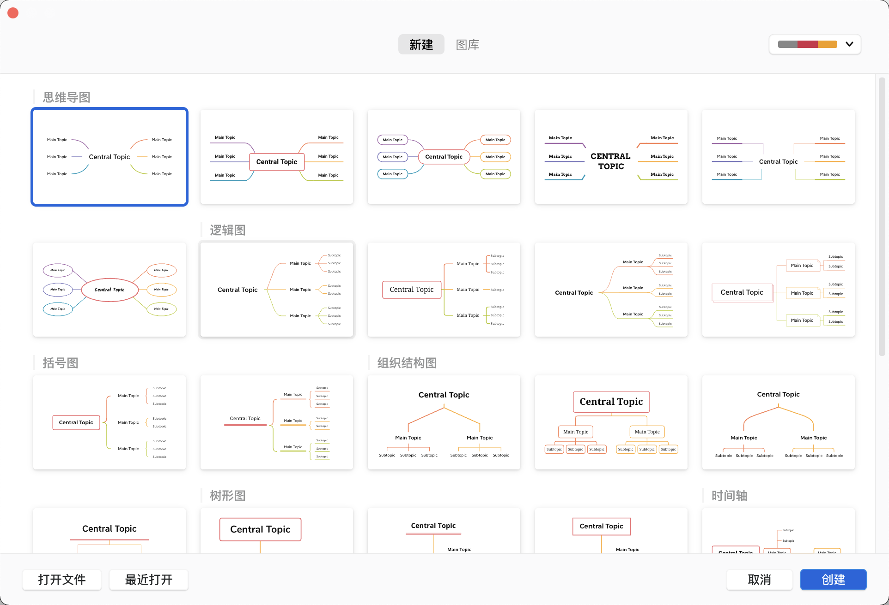

除此之外，Xmind 还有很多特点：

+ 可以灵活的定制节点外观、插入图标外，还有多种样式、主题色彩、贴图可以选择，主题颜色和样式同样支持自由组合；
+ 除了 XMind 自身的格式，还支持导入 FreeMind、MindManager 等软件的文件格式，支持导出PNG、SVG、PDF、Markdown、Word、Excel 等；
+ 支持进行动态演示。

**下载地址：**[https://xmind.app/download/](https://xmind.app/download/)

## Carbon
Carbon是开源免费的代码图片生成器，可以快速生成漂亮的代码图片。操作简单，直接将代码粘贴在代码区，设置想要的格式即可。

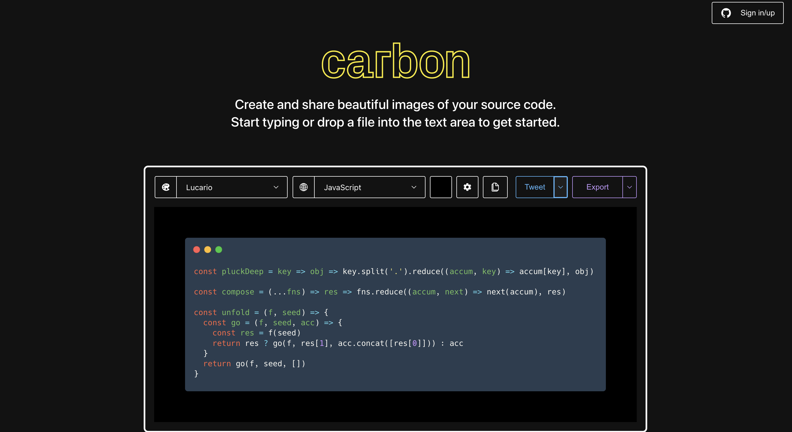

生成的代码图片非常适合用来分享：

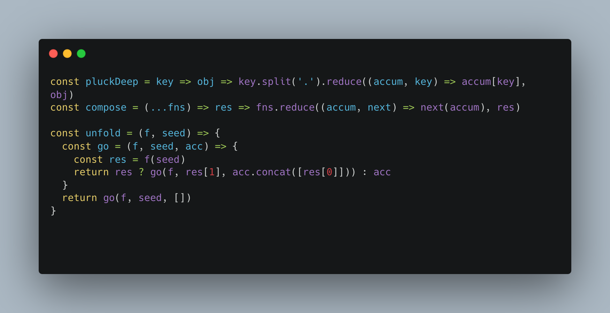

除此之外，Carbbon 还有很多特点：

+ 支持多种代码风格、支持自定义代码风格，支持主流的各种编程语言；
+ 支持设置代码的字体、行号、行数等文本格式；
+ 支持设置图片的边距、背景、颜色、阴影、大小等。

**在线地址：**[https://carbon.now.sh/](https://carbon.now.sh/)

## ProcessOn
ProcessOn 是一个在线协作绘图平台，支持在线制作思维导图、流程图、组织结构图、网络拓扑图、鱼骨图、UML图等。不过其免费版只支持添加 9 张图。所以这里主要推荐其丰富的模版市场，可以通过分类、关键字搜索来查找合适的模版：：

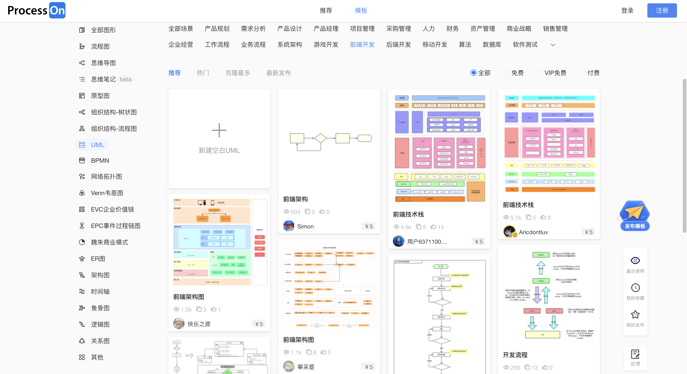

这些模版可以为我们提供一些绘图思路，可以根据这些图来绘制想要的图：

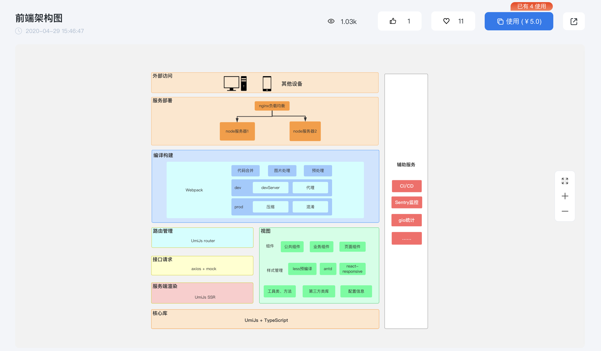

**在线地址：**[https://www.processon.com/diagrams/new#template](https://www.processon.com/diagrams/new#template)

> 更新: 2022-10-28 21:34:08  
> 原文: <https://www.yuque.com/cuggz/feplus/bhswnd>