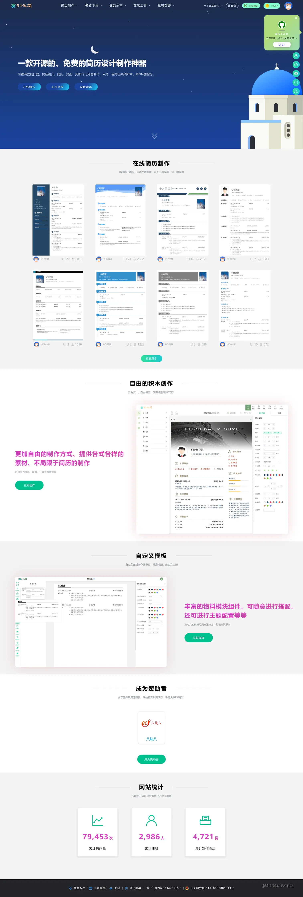
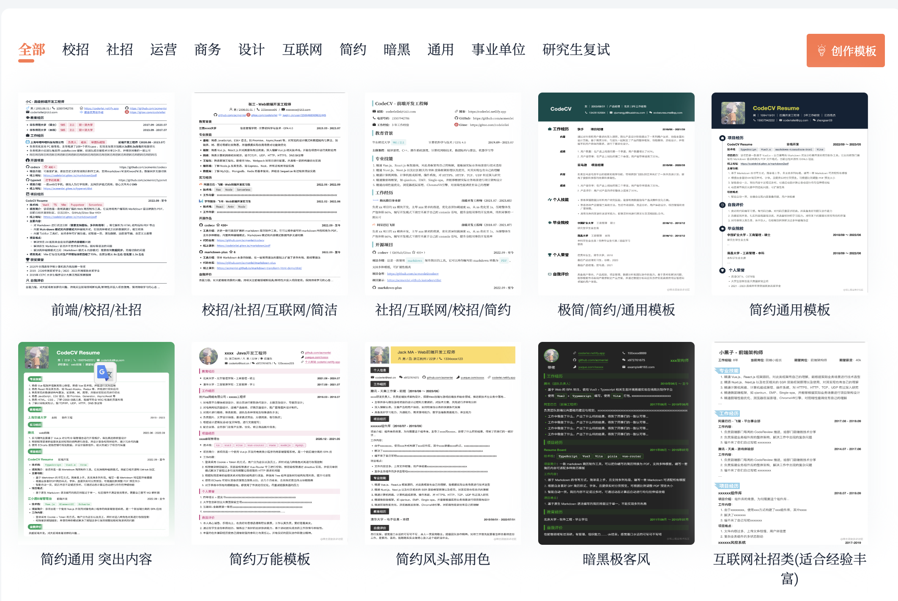
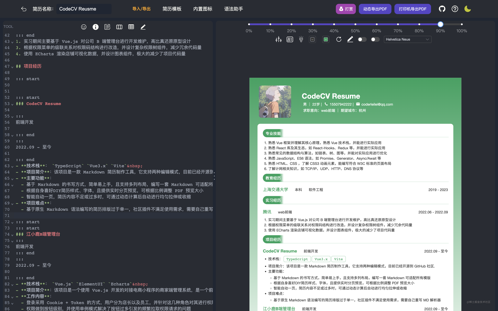
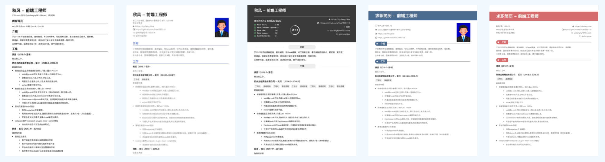
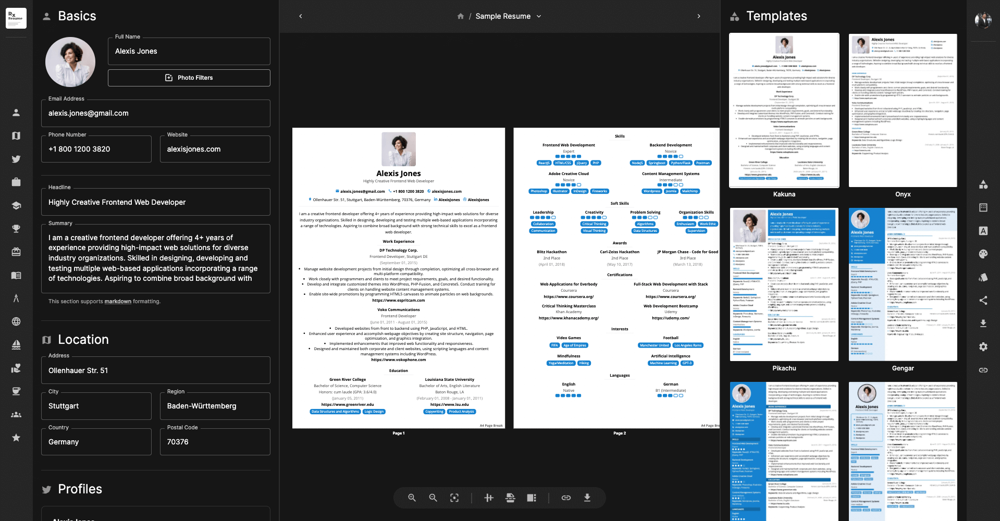
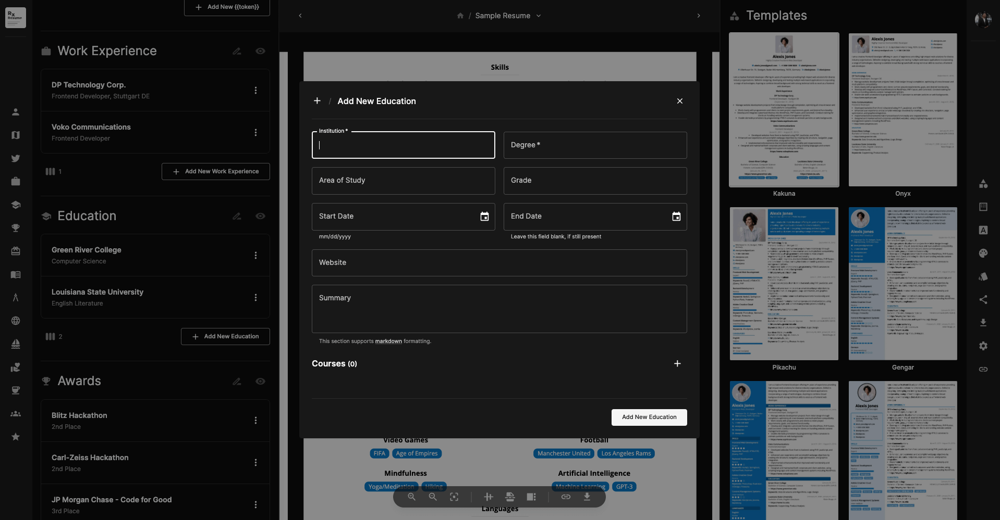
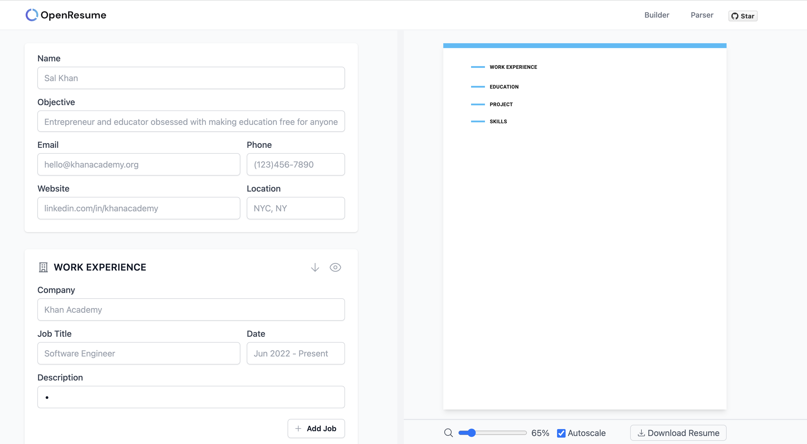
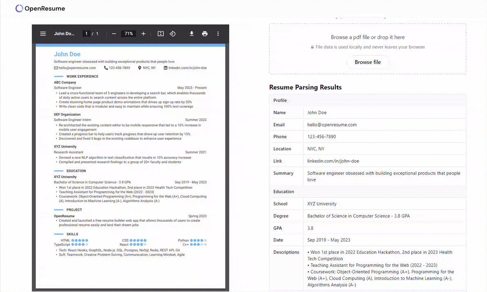
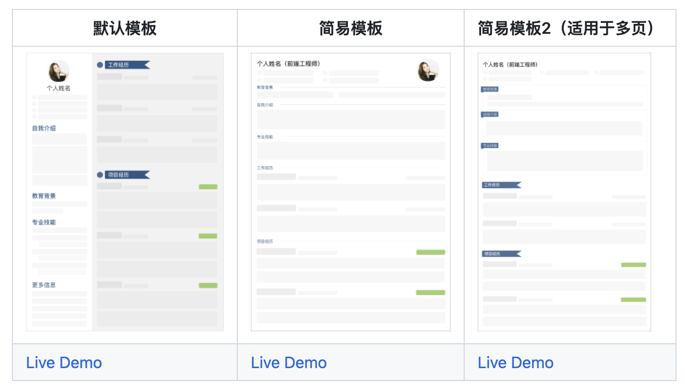
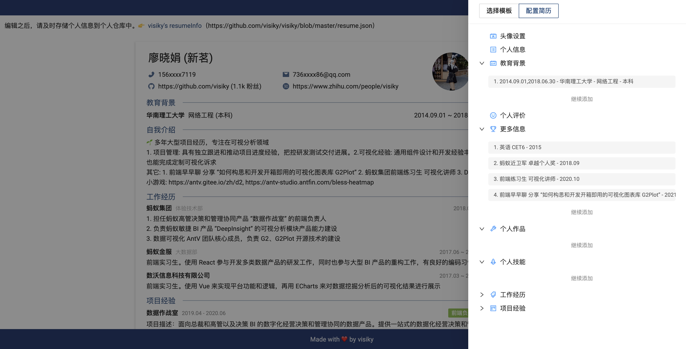

# 简历制作

本文来分享 5 款开源免费的简历制作神器，以最简单的方式来写好简历，只需专注内容本身而无需关注排版！

## 91化简
一款开源简历设计生成器，内置两款设计器，多种免费模板选择，还可以自定义模板、主题等等，支持导出PDF、JSON数据，除此之外，网站还提供有完整的后台管理系统，可以方便管理整个网站。项目基于Vue3 + TypeScript + Vite + Element-plus + pinia + nest.js + MongoDB 等技术栈实现。

91 化简的功能包括：

+  用户邮箱验证码登录注册、忘记密码、找回密码等功能
+  用户个人中心相关信息管理等功能
+  在线制作设计器（专注简历布局）
+  积木创作设计器（任意布局）
+  导出超高清PDF（支持复制、图标等）
+  支持在线以及导出JSON数据
+  支持评论
+  支持Word简历模板下载
+  支持PPT模板下载
+  支持保存草稿功能
+  积分简币体系
+  支持简历主题任意更改（字体、颜色、背景、间距等）
+  完整的后台管理系统，各种数据均可后台配置
+  网站数据统计（访问量、注册人数、简历制作数等）
+  完善的管理端系统，让网站变得可配置化

+ **在线体验：**[https://91huajian.cn](https://91huajian.cn)
+ **GitHub：**[https://github.com/Hacker233/resume-design](https://github.com/Hacker233/resume-design)

## **CodeCV Resume**
CodeCV 支持你使用 Markdown 语法来编写简历，可扩展性极高。且支持双编辑模式，Markdown模式 以及 内容模式 无缝切换，多种模板适配，编写一套简历内容可适配多个简历模板。

+ **在线体验：**[https://codeleilei.gitee.io/markdown2pdf](https://codeleilei.gitee.io/markdown2pdf/#/home)
+ **GitHub：**[https://github.com/acmenlei/codecv](https://github.com/acmenlei/codecv)

## 木及简历
木及简历，一款markdown的在线简历工具，其功能包括：

+ Markdown书写方式，简单易上手
+ 实时预览PDF并导出，导出效果 **「所见即所得」**
+ **智能一页**，自动识别，完美排版
+ 一份内容，轻松应用任意简历模板
+ 海量「极简」主题与模板
+ 远端存储，数据永不丢失
+ 可视化定位，「内容 - 视图」双向可寻迹
+ 证件照位置及大小可修改，打破传统模板约束
+ 支持导入导出Markdown，随时随地可编写

+ **在线体验：**[https://www.mujicv.com/](https://www.mujicv.com/)
+ **GitHub：**[https://github.com/hua1995116/react-resume-site](https://github.com/hua1995116/react-resume-site)

## Reactive Resume
Reactive Resume 是一个免费且开源的简历生成器，旨在使创建、更新和分享简历这些乏味的任务变得轻松。通过这个应用，可以创建多个简历，并通过一个链接进行分享，并可以打印为 PDF，而且没有广告，不会损害数据完整性和隐私。用户对简历中的内容有完全的控制权，包括外观、颜色、模板甚至是部分放置的布局。

+ **在线体验：**[https://rxresu.me/](https://rxresu.me/)
+ **GitHub：**[https://github.com/AmruthPillai/Reactive-Resume](https://github.com/AmruthPillai/Reactive-Resume)

## OpenResume
OpenResume 是一个功能强大的开源简历生成器和简历解析器。其具有以下特点：

+ 实时更新界面：当输入简历信息时，简历 PDF 将实时更新，因此可以轻松地查看最终输出结果。
+ 现代专业的简历设计：简历 PDF 采用现代化的专业设计，它会自动格式化字体、大小、边距和项目符号，以确保一致性并避免人为错误。
+ 注重隐私：该应用仅在浏览器本地运行，因此无需注册，也不会有任何数据离开浏览器。（应用仅在本地运行意味着即使断开互联网连接，它仍然可以正常工作。）
+ 从现有简历 PDF 导入：如果已经有一份现有的简历 PDF，可以直接导入它，这样可以在几秒钟内将简历设计更新为现代专业的设计。

+ **在线体验：**[https://www.open-resume.com/](https://www.open-resume.com/)
+ **GitHub：**[https://github.com/xitanggg/open-resume](https://github.com/xitanggg/open-resume)

## Resume Generator
在线简历生成器，内置 3 套模板，支持**自定义主题颜色**、**自定义模块标题**、**国际化(中/英)** 等。

+ **在线体验：**[https://visiky.github.io/resume](https://visiky.github.io/resume)
+ **GitHub：**[https://github.com/visiky/resume](https://github.com/visiky/resume)

> 更新: 2023-09-22 00:12:02  
> 原文: <https://www.yuque.com/cuggz/feplus/ggcq392nmvgek05z>