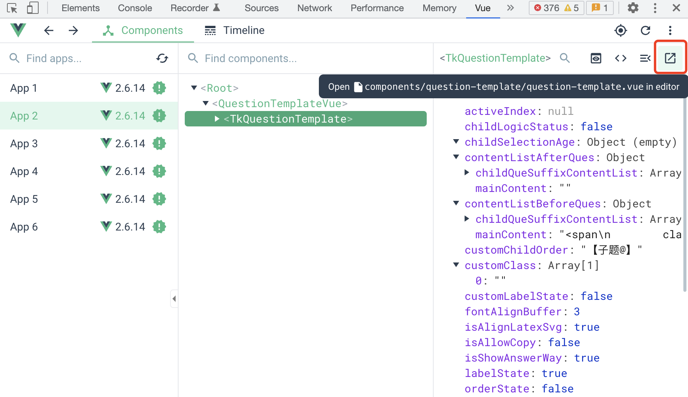
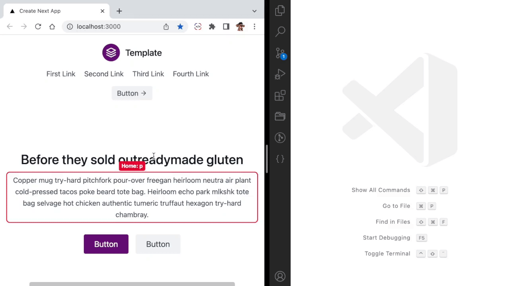
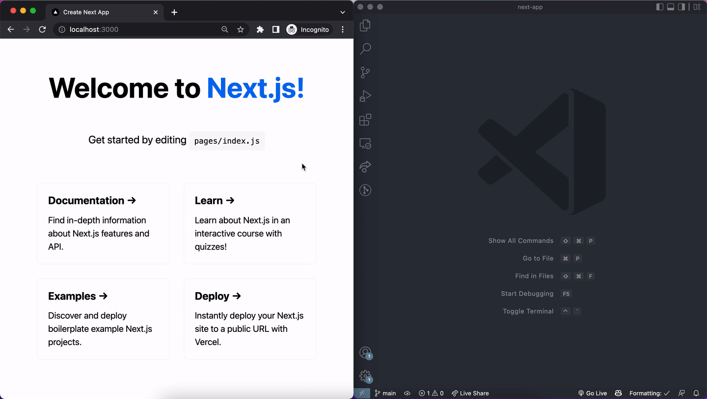
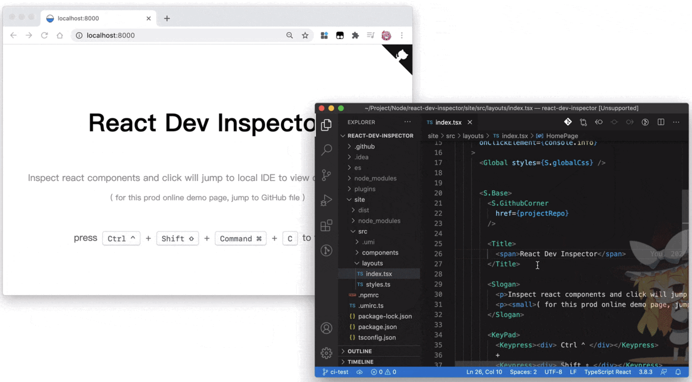
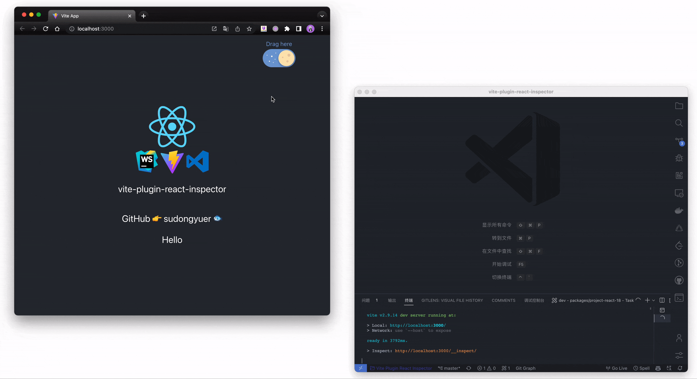
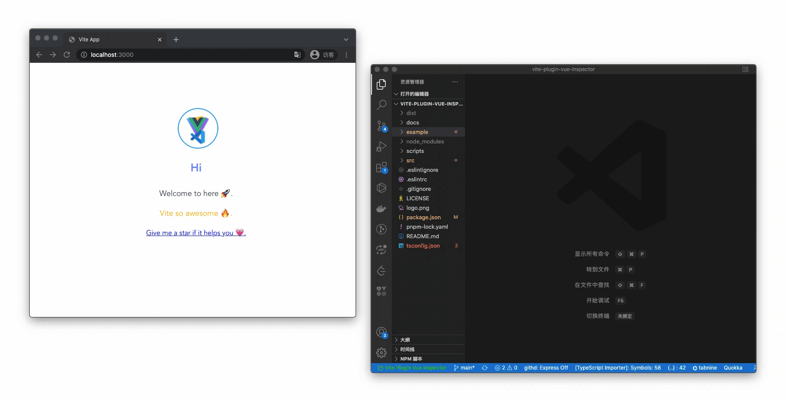

# 调试工具

在项目开发中，当页面上组件特别多或者刚接手一个项目时，可能需要花费一定时间去查找页面元素/组件对应的代码，下面来分享几个插件，通过这些插件，点击页面元素就可以直接跳转到 IDE 中对应的代码，提高开发效率！

## Vue Devtools

Vue 官方调试工具 Vue Devtools 是支持点击组件直接跳转到编辑器并打开对应代码的。只需要定位页面的组件，Devtools 就会识别对应的组件，点击选中组件，再点右上角的即可跳转到 IDE 中对应的组件。

## LocatorJS

使用 LocatorJS，在浏览器中单击 UI 组件就可以直接在 IDE 中打开其代码。可以通过浏览器插件（支持 Chrome 和 Firfox）或者在项目中安装依赖来引入 LocatorJS，其适用于 React、Preact、Solid、Vue 和 Svelte。

**Github：**<https://github.com/infi-pc/locatorjs>

## click-to-component

Option+单击浏览器中的 React 组件以就会立即在 VS Code 中打开源代码。适用于 Next.js、 Create React App 和 Vite 等。

**Github：**<https://github.com/ericclemmons/click-to-component>

## react-dev-inspector

只需单击一下即可直接从浏览器 React 组件跳转到本地 IDE 对用的代码。适用于几乎所有的 React 框架，例如 Vite、 Next.js、 Create React App、 Umi3、 Ice.js，或任何其他在内置中使用 `@babel/plugin-transform-react-jsx-source` 的 React 项目。该插件仅适用于 VS Code，但简单，无需任何其他配置。

**Github：**<https://github.com/zthxxx/react-dev-inspector>

## vite-plugin-react-inspector

这个 vite 插件允许用户通过简单的点击直接从浏览器 React 组件跳转到本地 IDE 代码。支持 React 16、17、18。这些开箱即用的功能只需要在 vite.config.ts 中添加这个插件即可。

**Github：**<https://github.com/sudongyuer/vite-plugin-react-inspector>

## vite-plugin-vue-inspector

一个 vite 插件，当点击浏览器的元素时，它提供了自动跳转到本地 IDE 的能力，支持 Vue2、Vue3、Nuxt3、SSR。

**Github：**<https://github.com/webfansplz/vite-plugin-vue-inspector>

> 更新: 2022-11-19 22:06:38  
> 原文: <https://www.yuque.com/cuggz/feplus/euycw1f8g430lgiv>