# DevTools 调试技巧（1）

### 1. Chrome DevTools功能简介

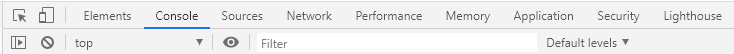

Chrome DevTools由以下九部分组成：

* **Element元素面板**：检查和调整页面，调式DOM，调试CSS
* **Network网络面板**：调试请求，了解页面静态资源分布以及网页性能的检测
* **Console控制台面**板：调试JavaScript。查看Console log日志、交互式代码调试
* **Sources源代码资源面板**：调试JavaScript页面源代码，进行断点调试代码
* **Application应用面板**：查看、调试客户端存储，如Cookie、LocalStorage、SessionStorage等
* **Performance性能面板**：查看网页的细节，细粒度对网页载入进行性能优化
* **Memory内存面板**： JavaScript CPU分析器，内存堆分析器
* **Security安全面板**： 查看网页安全及证书问题
* **LightHouse面板**：进行性能分析，给出优化建议

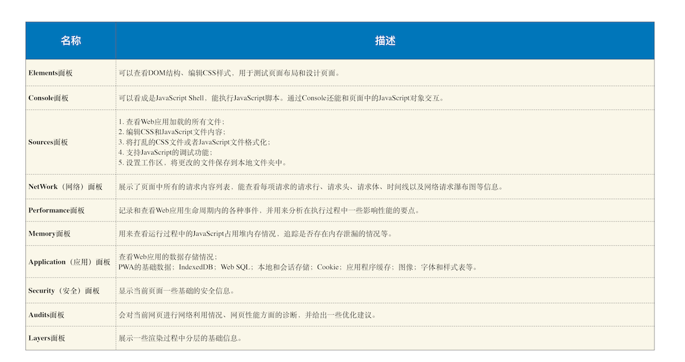

打开Chrome开发者工具**快捷键**：

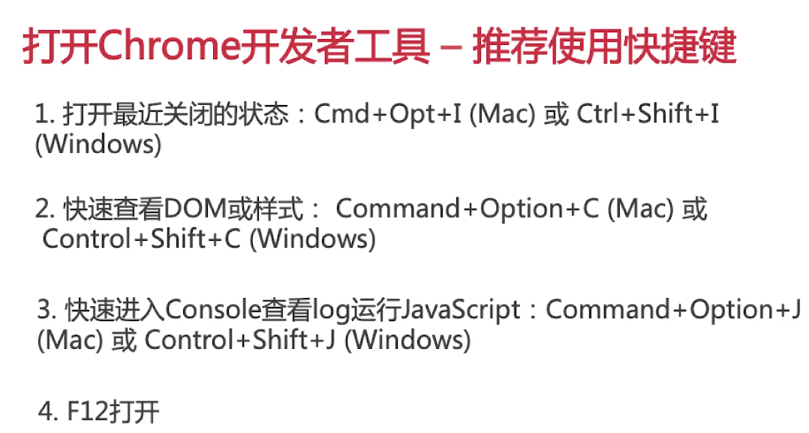

### 2. 使用Elements调试DOM

#### 2.1 查看编辑HTML和DOM

可以在页面中选中DOM，在DOM中反向定位到页面位置

可以对HTML和DOM进行编辑操作：

* 编辑内容
* 编辑属性
* 修改元素类型
* 调整DOM节点顺序
* 编辑HTML代码
* 删除、隐藏、增加、拷贝节点

#### 2.2 在Console中访问节点

我们也可以在`console`访问节点：

**（1）使用**<code>**document.querySelectorAll()**</code>**访问**

我们进入Element模块，点击ESC键即可。这个方法返回一个`NodeList`数组，数组中是所有的选中的标签

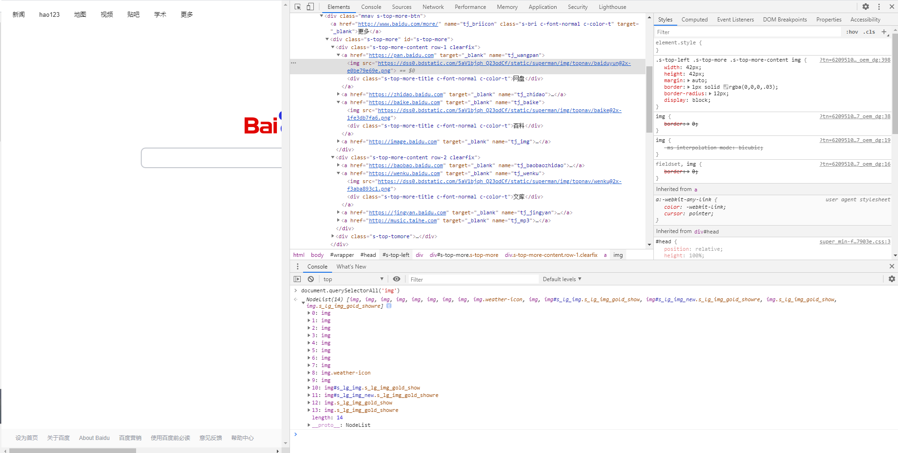

**（2）使用$0快速访问选中的元素**

当我们选中一个元素时，会显示下面这样的提示：

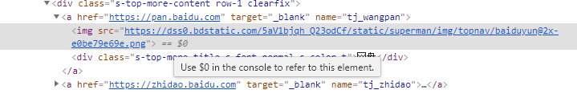

这也就是说，我们可以使用`$0`来访问该元素，这样就会显示出我们选中的元素：

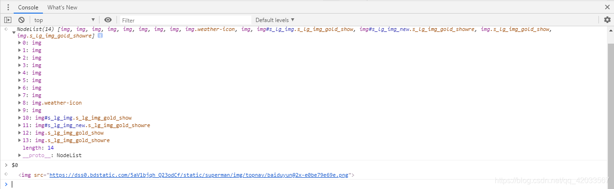

**（3）拷贝 JS Path 进行访问**

右键点击选中的元素，点击`Copy`，选择`Copy JS path`，即可复制该元素的路径，在`Console`中粘贴就会显示出对应的元素：

显示的结果：

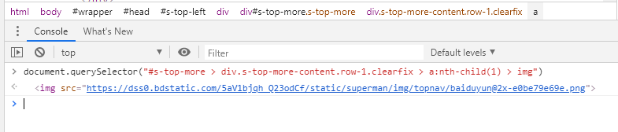

#### 2.3 在DOM中断点调试

我们可以在以下几种情况下进行断点调试：

**（1）属性修改时打断点**

我们将选中的a标签的href值进行修改：

步骤：`右键点击元素 => Break on =>attribute modifications` ，这样就给元素打上断点，复制该元素的JS path，并对其值进行修改，然后执行断点：

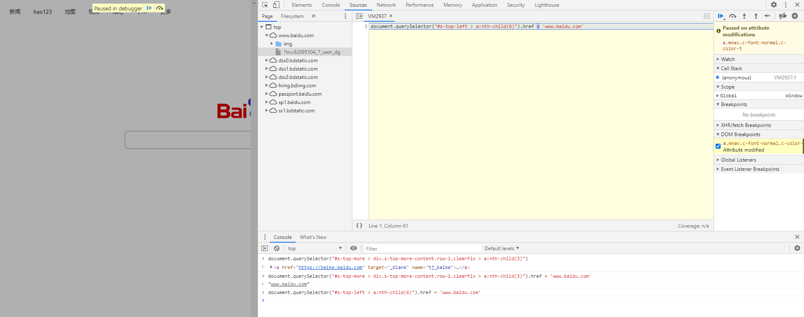

执行后：

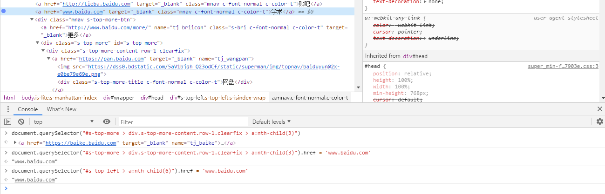

**（2）节点删除时打断点**

这个和上面的步骤类似，我们来删除一个a节点，需要使用其父元素的`removeChild`属性，断点设置为`Break on=> node removal`：

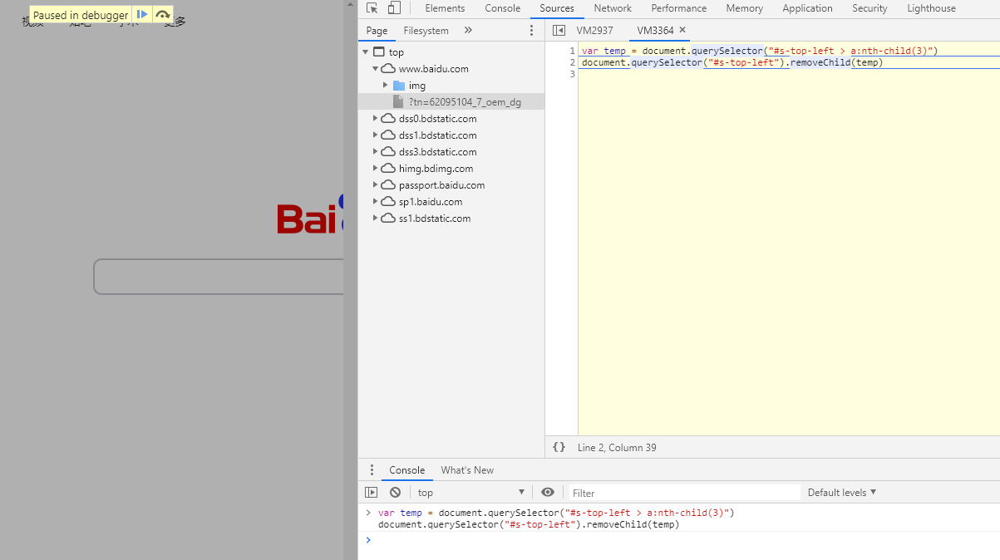

执行后（删除了左上角的“地图”标签）：

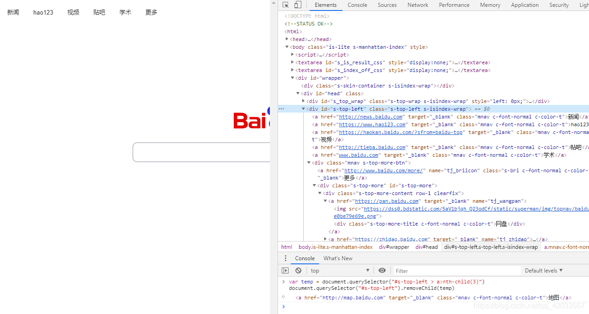

**（3）在子树修改时打断点**

这种方式，我们需要对父元素打断点，这次来删除左上角的“贴吧”标签，断点设置为`Break on=> subtree modifications`：

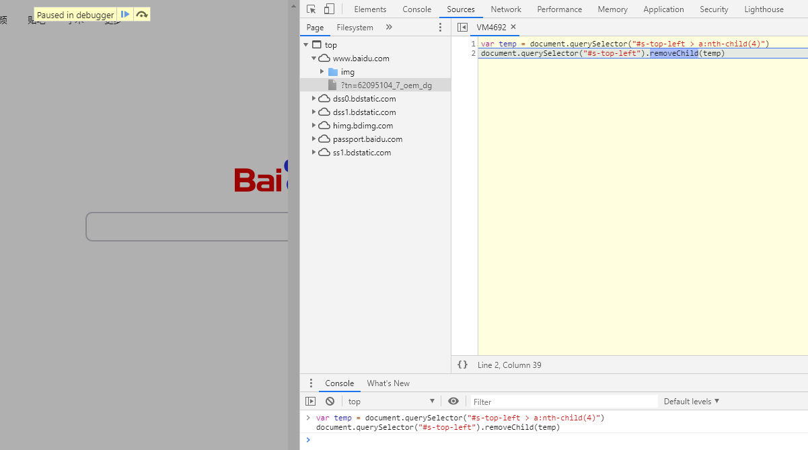

执行后：

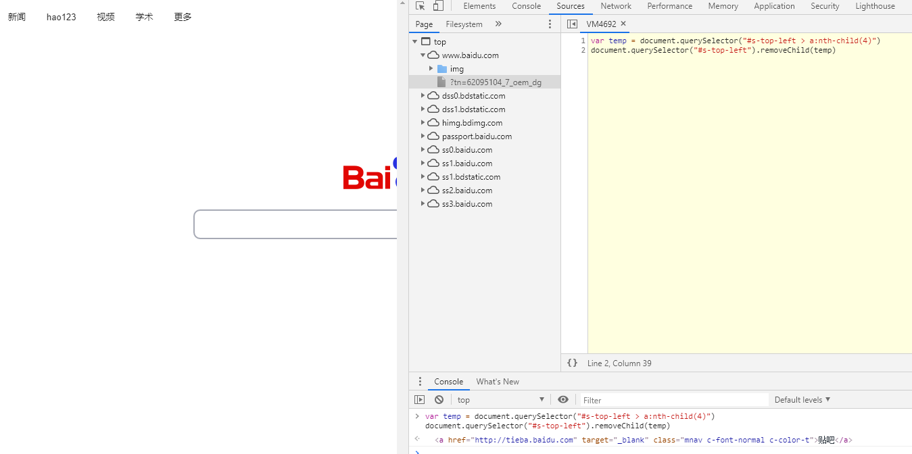

### 3. 调试样式及CSS

#### 3.1 查看和编辑CSS

查看一下百度输入框的样式：

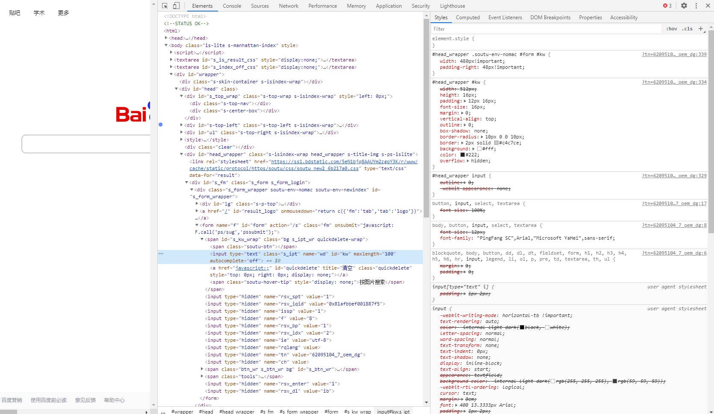

在这些样式中，从上到下，优先级依次降低。因为有些样式优先级较低，会被较高优先级的样式覆盖掉，所以会被划掉。我们可以对这些样式的属性或属性值进行修改，也可以划掉这个样式，使其隐藏。

可以通过`Filter`过滤需要的属性，过滤出来的属性会进行高亮显示：

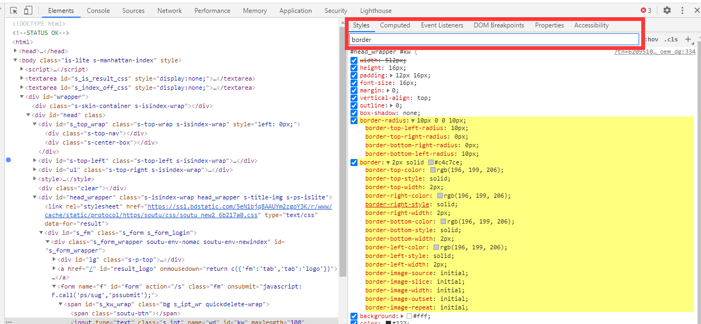

还可以实时查看该元素的盒模型：

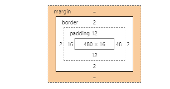

#### 3.2 在元素中动态添加类与伪类

可以通过点击右上角的`:hov`、`.cla`来动态的添加类与伪类，也可以对已有的类伪类进行查看：

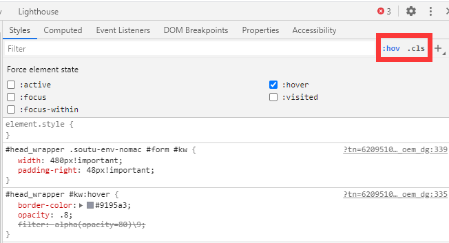

动态的添加类：

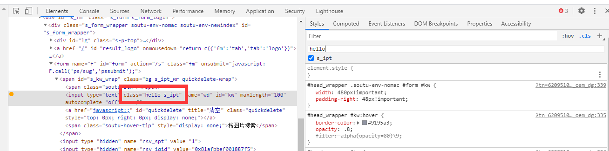

添加伪类需要勾选上面的伪类类型，在进行添加。

#### 3.3 快速调试CSS数值及颜色图形动画等

在右上角element.style右侧有三个点，鼠标移动上去就可以看到以下四个按钮：

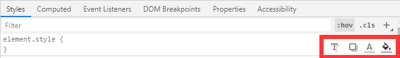

这四个按钮分别是：

* `text-shadow`：文字阴影
* `box-shadow`：盒子阴影
* `color`：文字颜色
* `background-color`：背景颜色

可以通过这四个按钮功能实现可视化的调节元素对应的样式。

（1）以`text-shadow`为例，可以通过调整数值来调整阴影的偏移位置以及模糊程度：

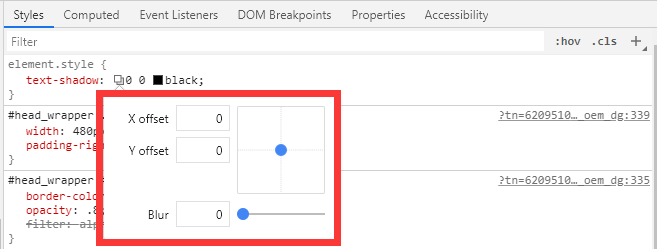

（2）**box-shadow：**

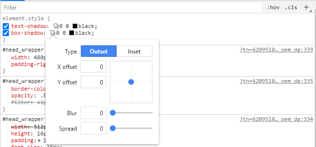

（3）**color：**

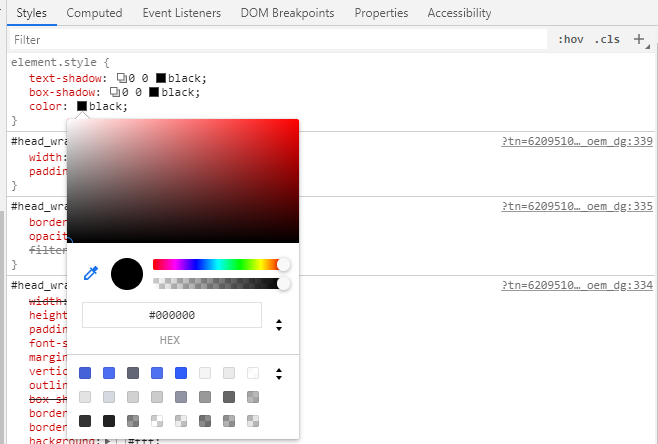

（4）**background-color**

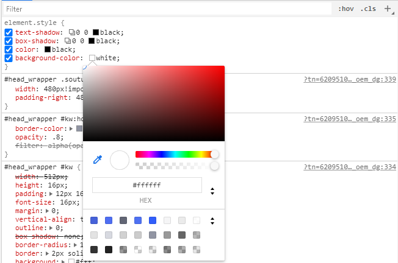

可以打开Animations来调试动画：

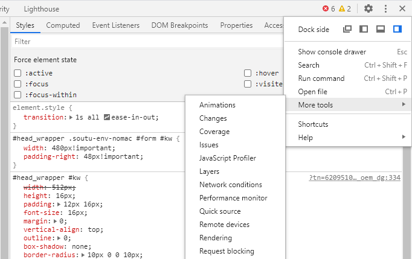

我们给百度的输入搜索框加了一个`:hover`之后高度变高的效果，这个工具就会录制这个动画的开始和离开，并显示在下方：

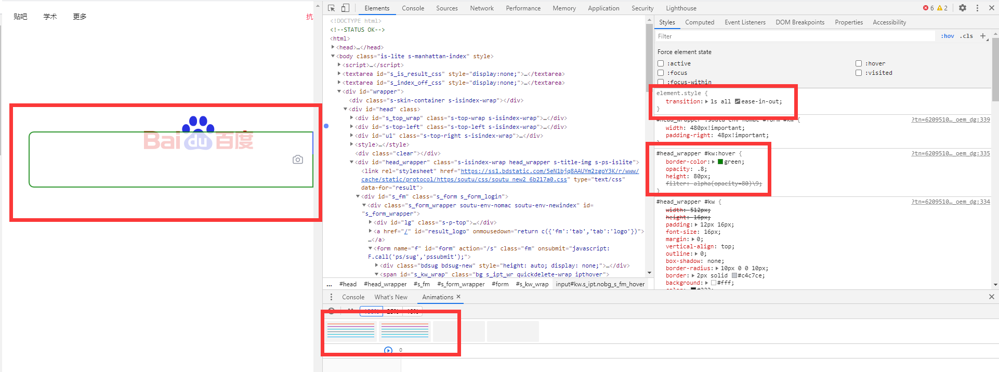

随便点击一个进去，就可以对动画的属性值进行调试：

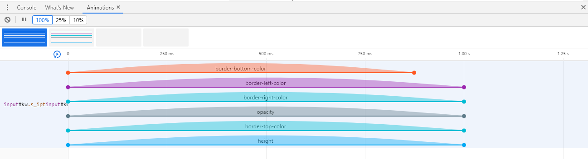

### 4. 使用 Console 和 Sources 调试 JavaScript

#### 4.1 Console面板简介及交互式命令

可以使用Console面板执行以下功能：

* 运行JavaScript代码，交互式编程
* 查看程序中打印的Log日志

（1）在Console中输入一些JavaScript代码，表达式，算法等来进行调试：

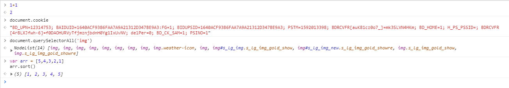

（2）查看程序中打印的Log日志：

在平时项目，可能使用console来打印后端传来的请求响应数据，来查看数据格式。还会查看一些代码的运行结果等等。

`console`提供了很多方法打印方法：

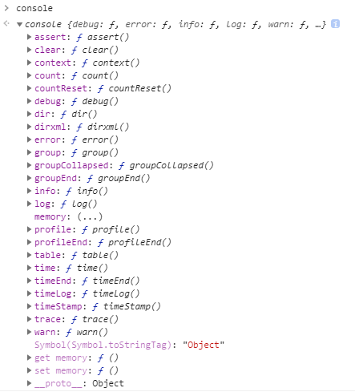

主要的调试方法有以下四种，其中`error`和`warn`方法有特定的图标和颜色标识：

* `console.log()`：打印普通信息
* `console.info()`：打印提示性信息
* `console.error()`：打印错误信息
* `console.warn()`：打印警示信息

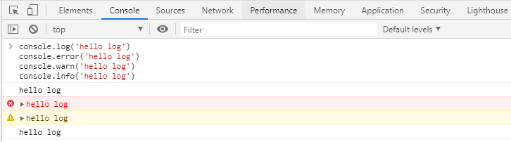

#### 4.2 调试JavaScript的基本流程及断点调试

对于JavaScript的调试主要有以下两种方式：

* 传统的`console.log`或者是`alert()`打印运行时信息进行调试
* JavaScript断点调试

**（1）使用debugger进行断点调试**

断点调试，在需要断点的位置设置一个`debugger`：

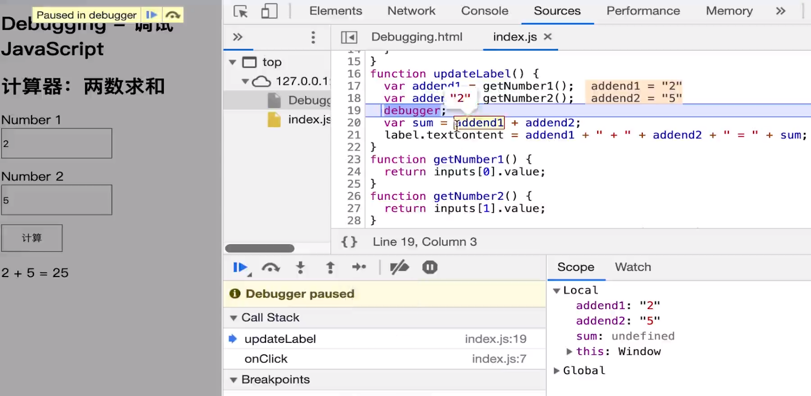代码下面有一行工具栏，可以进行单步的调试：

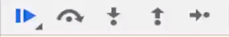

他们分别代表：

* Resume script execution：恢复脚本的执行
* Step over next function call：跳过下一个函数的执行
* Step into next function call：进入到下一个函数的执行
* Step out of current function：跳出当前函数
* Step（快捷键F9）：单步执行

**（2）使用事件监听进行断点调试**

除了使用`debugger`之外，还可以直接进行断点设置：

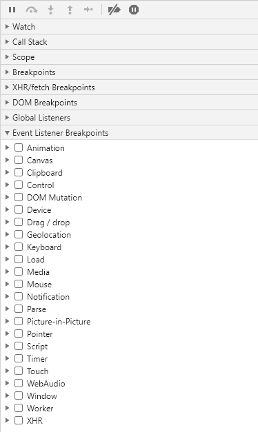

最下面这个是事件监听的事件，我们只要选中相应的事件，再在页面执行响应的事件，就可以进行断点调试。

**（3）在代码行上设置断点**

通常我们会在有问题的那几行代码设置断点，然后进行断点调试（可以同时设置多个断点）：

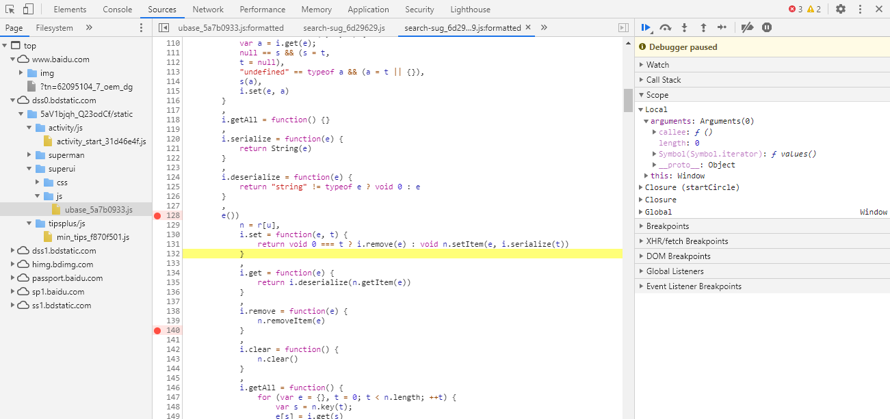

可以在Scope中查看相关变量的值。

#### 4.3 Sources源代码面板简介

Sources面板包含了该网站的静态资源：

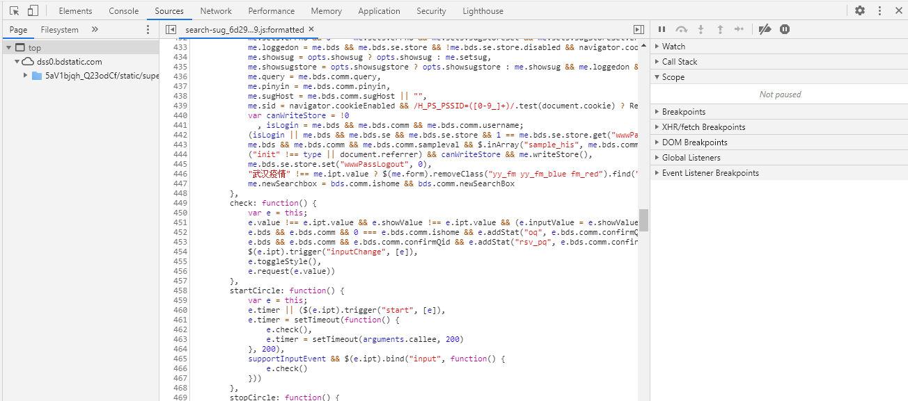

我们可以使用快捷键`Ctrl+P`来搜索相关的静态资源文件来查看，还可以使用快捷键`Ctrl+ Shift+P`来调出命令行，命名行中有所有命令的快捷键：

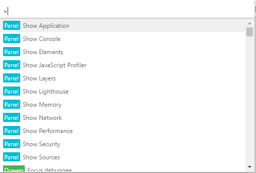

打开需要调试的文件，就可以在右侧进行编辑调试。

#### 4.4 使用Snippets来辅助Debugging

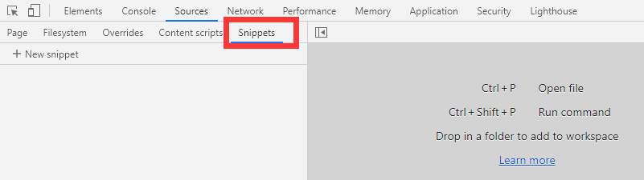

我们可以点击`New snippet`来添加一个代码片段来辅助调试，比如，可以引入JQuery来赋值调试：

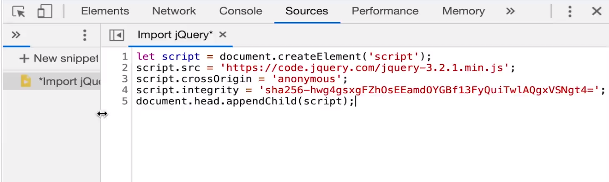

引入片段之后，右键点击该引入的文件，点击`run`，就可以使用JQuery对原来的样式、事件等进行调试了。

需要注意的是：新引入的代码片段不会对原有代码产生影响。

#### 4.5 使用DevTools作为代码编辑器

在Sources中有一个`Filesystem`，在里面可以添加本地文件进行编辑操作，相当于一个编辑器（这种方法是对本地源代码的编辑）：

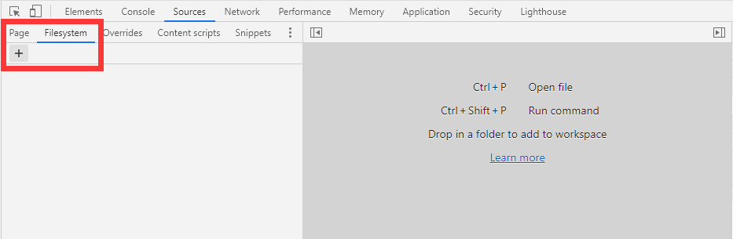

### 5. 调试网络

#### 5. 1 Network 面板简介

我们可以用Network面板来完成以下事情：

* 查看网页资源请求预览，查看资源分布
* 针对单一请求查看Request/Response或消耗时间等
* 分析网页性能优化，使用工具代理页面请求数据等

我们可以看到执行一个操作之后，所有的网络请求数据：

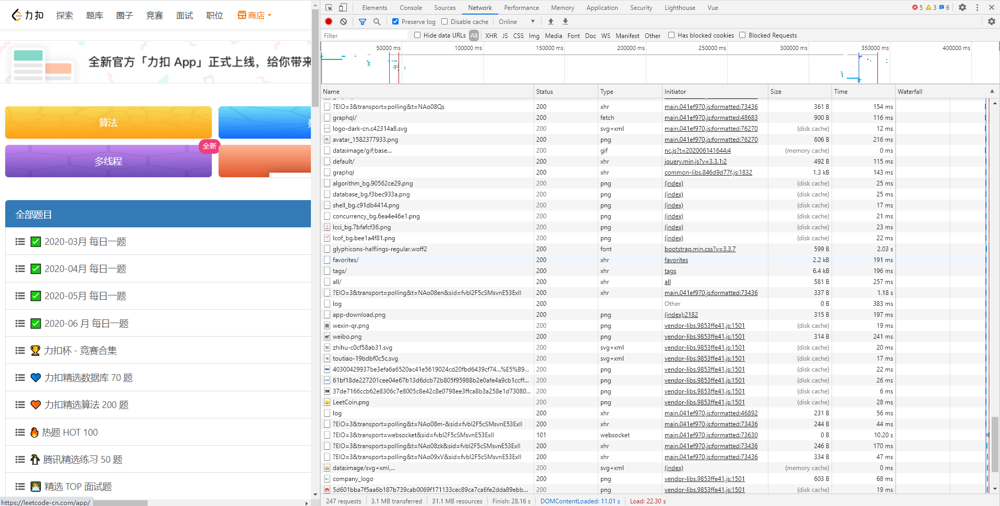

#### 5.2 使用Network查看网页查看站点网络

选择过滤，就可以对网络请求数据进行筛选，可以搜索数据名称，也可以根据类型进行筛选：

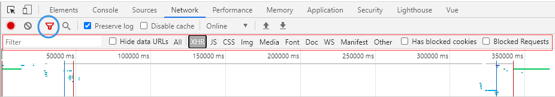

`All`是请求回来的所有数据，`XHR`是所有异步请求的数据。

点开`XHR`中的一条请求数据，就可以查看它的详细信息：

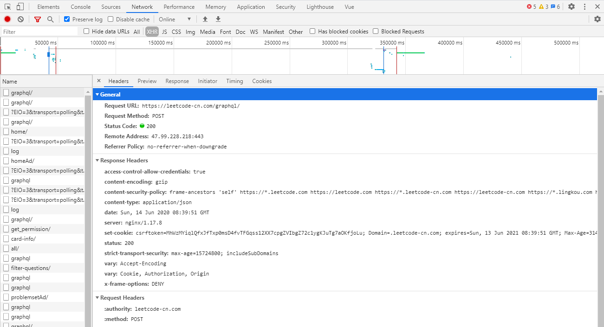

过滤按钮后面是search，过滤只能过滤请求数据，而`search`不仅可以搜索到请求数据还可以搜索数据的请求头和请求体，还可以进行正则匹配：

可以通过Preserve log可以记录上一个网页的请求，可以通过Disable cache禁用缓存：

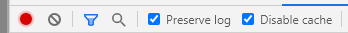

对于单一的请求，`Headers` 是请求头相关数据，`Preview`是对请求回来的数据进行预览，`Response`是请求回来的数据，`Timing`在心性能优化时会用到：

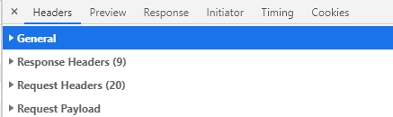

`timing`内容：

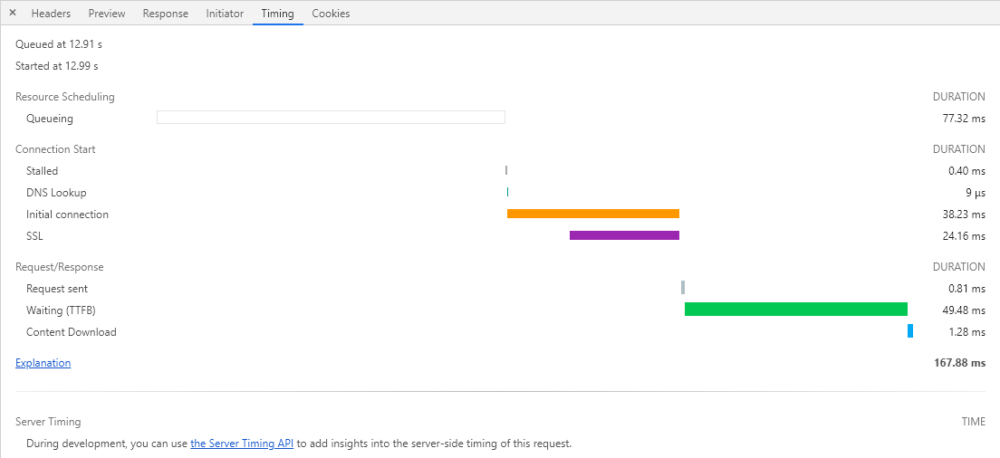

在请求的最下面，有对所有请求的统计信息:

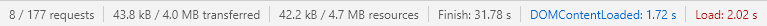

#### 5.3 使用Network Waterfall分析页面载入性能

对于请求数据，右侧会显示请求时间：

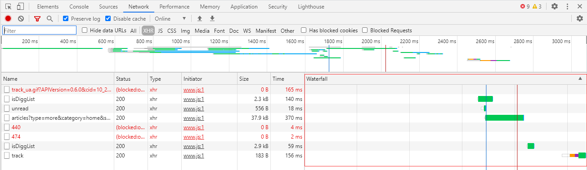

可以根据请求时间的长短，对项目做出相应的优化。如，有些JS、CSS文件可以合并、进行压缩等操作，对于图片可以懒加载等。

可以查看某个请求的具体请求时间，来确定是哪里耗时较多：

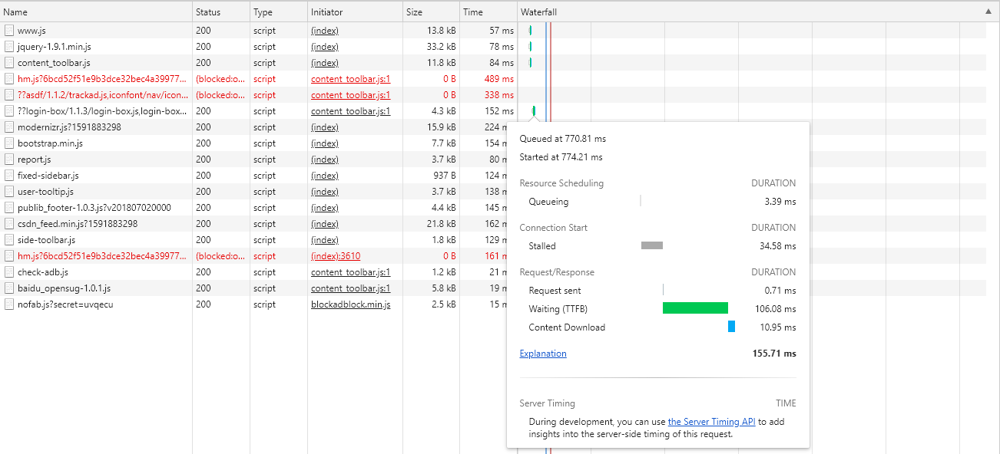

### 6. 客户端存储Application面板

#### 6.1 查看与调试Cookie

可以在Application面板查看Cookie：

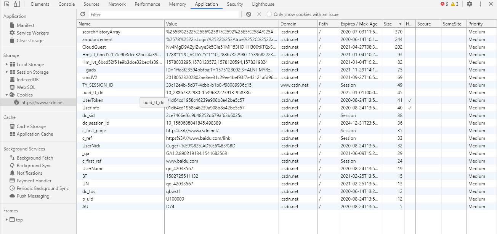

可以直接点击添加、删除、修改上面Cookie的属性值，还可以通过`document.cookie ='cookie名称 = cookie值'`来添加新的cookie：

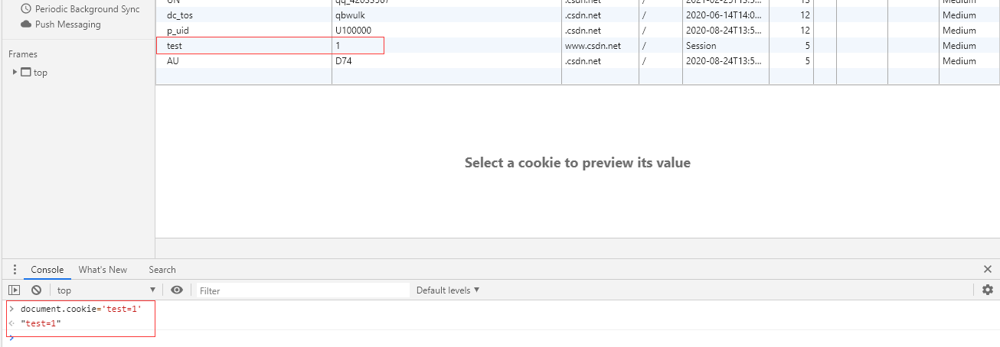

#### 6.2 查看与调试LocalStorage与SessionStorage

我们同样可以直接点击添加、删除、修改LocalStorage与SessionStorage的属性值:

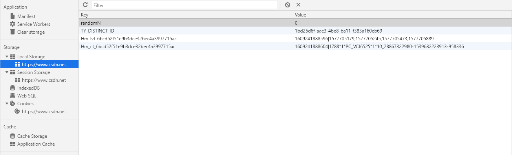

使用localStorage的API可以对其进行增删改查的操作（sessionStorage也有类似的操作）:

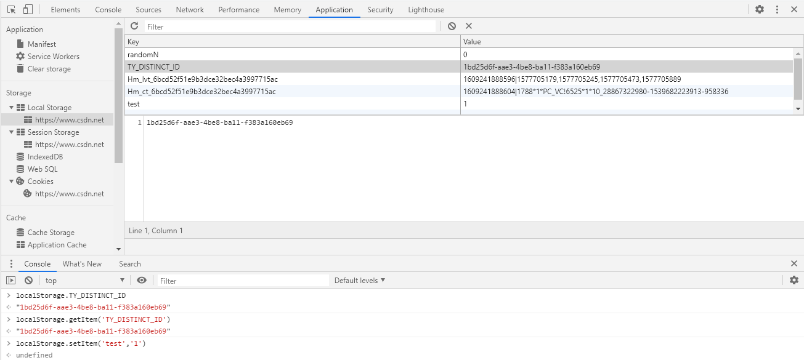

LocalStorage会永久存储在该站点的本地存储下，SessionStorage的本地存储会在一次会话或者登出、关闭浏览器等情况之后删除。

### 7. 调试移动设备、H5页面及远程调试

#### 7.1 移动端H5页面调试

点击如图所示的按钮，就可以切换为移动端显示，可以在上面的工具栏切换显示的设备，以及缩放的大小：

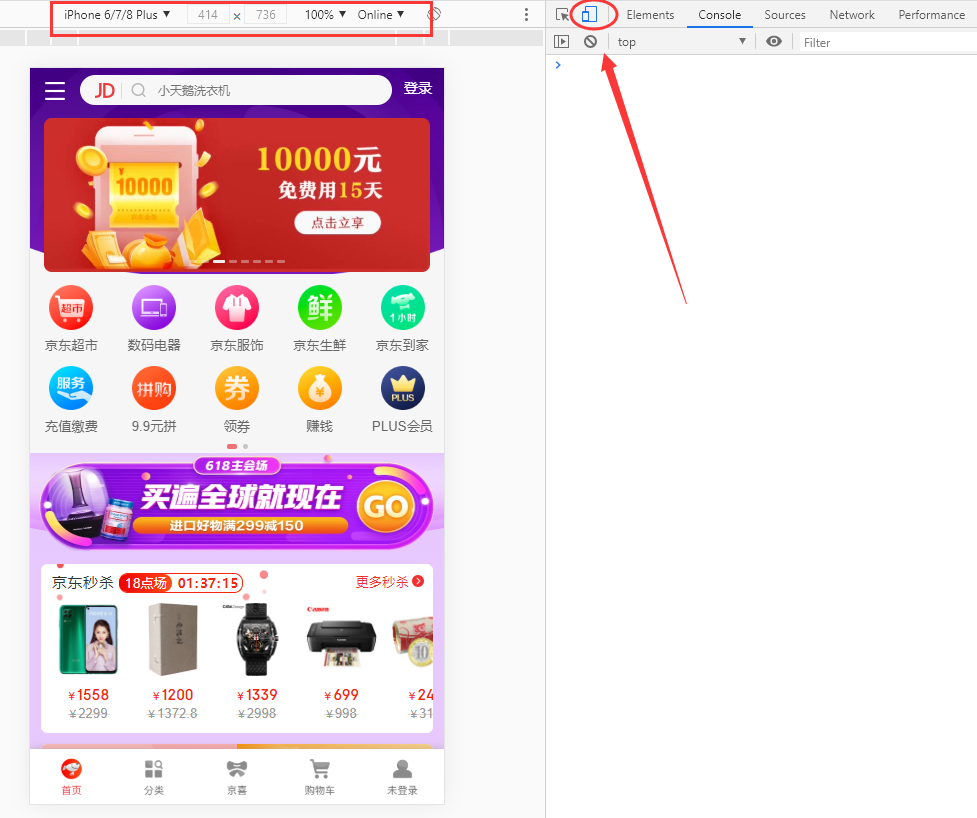

#### 7.2 使用Chrome DevTools 进行H5页面的开发

当针对移动设备进行开发时，会有一些诸如获取地理位置，角度、尺寸、方向等操作。我们使用快捷键`Ctrl+shift+p`调出菜单，然后搜索sensors，点击会出现Sensors面板：

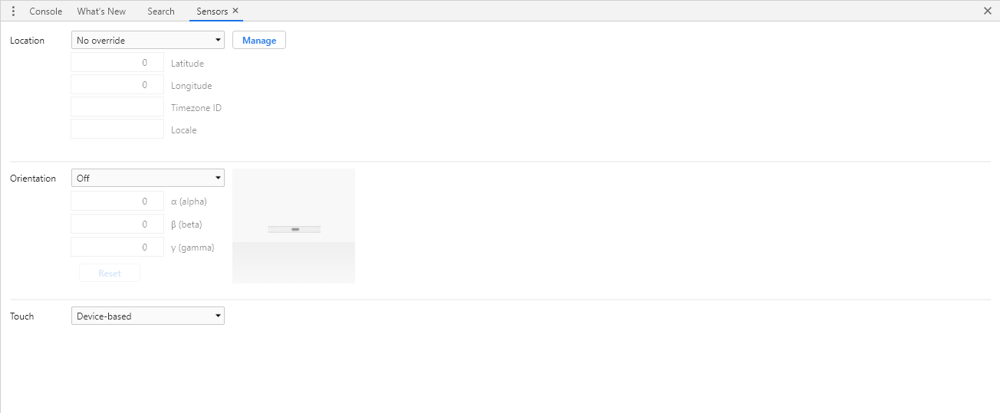

这三个选项分别是：

* Location：地理位置信息
* Orientation：设备的方向信息
* Touch：触摸信息

我们可以通过这些选项**更改地理位置信息**、**更改模拟设备的方向**、**更改触摸相关属性**。

还可以使用快捷键`Ctrl+shift+p`调出菜单，然后搜索`Network conditions`，点开会出现一个菜单：

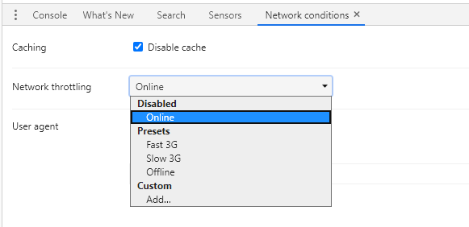

第一项是禁用缓存，第二项是模拟网络情况，第三项是模拟用户的`user-agent`，里面有很多选项可以选择：

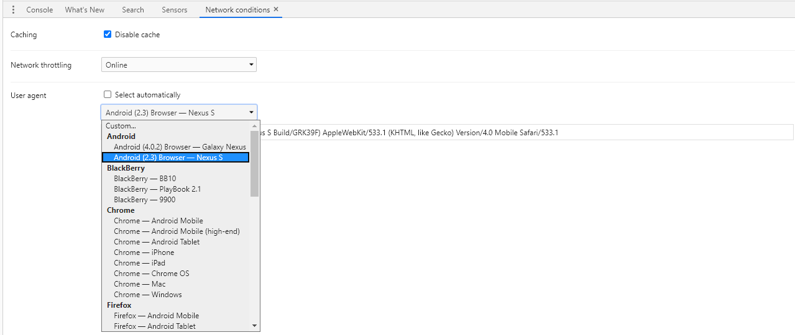

### 8. 在DevTools中集成Vue和React插件

我们可以在扩展程序中添加React和Vue的插件，安装之后，浏览器的右上角会显示相应的图标。如果该网站是使用Vue开发的，Vue的图标就会点亮，React也一样。

我们打开Vue官网，就可看到Vue的图标点亮了，说明该网站是使用Vue开发的（废话，Vue官网肯定用Vue开发的啦）：

添加之后，就可以在DevTools中看到Vue的选项，在里面查看组件、数据、Vuex等内容：

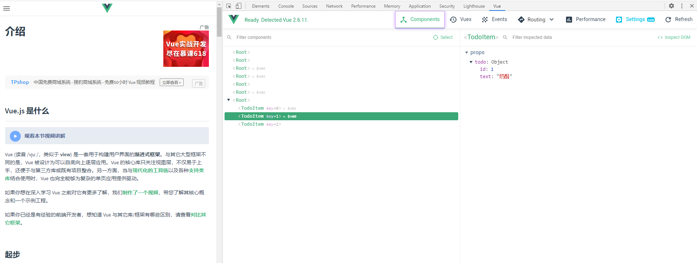

**最后的最后：**

Chrome DevTools开发者工具是前端开发中必不可少的工具，当然，学习这些理论基础是远远不够的，我们还需要根据实际的开发需要去使用不用的工具对代码进行调试，用的多了自然就知道怎么使用了。

“工欲善其事，必先利其器！”

> 更新: 2021-02-07 17:47:08  
> 原文: <https://www.yuque.com/cuggz/feplus/wh3ipr>