# Devtools 实用功能（1）

## 1. 保留日志

当我们刷新完页面之后，通常控制台的Console面板就会被清空。如果想保留控制台的日志，就可以在设置中勾选Preserve log选项以保留控制台中的日志。

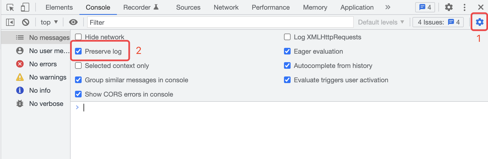

## 2. 代码覆盖率

我们可以打开设置，在`Experiments`中勾选`Record coverage while performance tracing`选项。

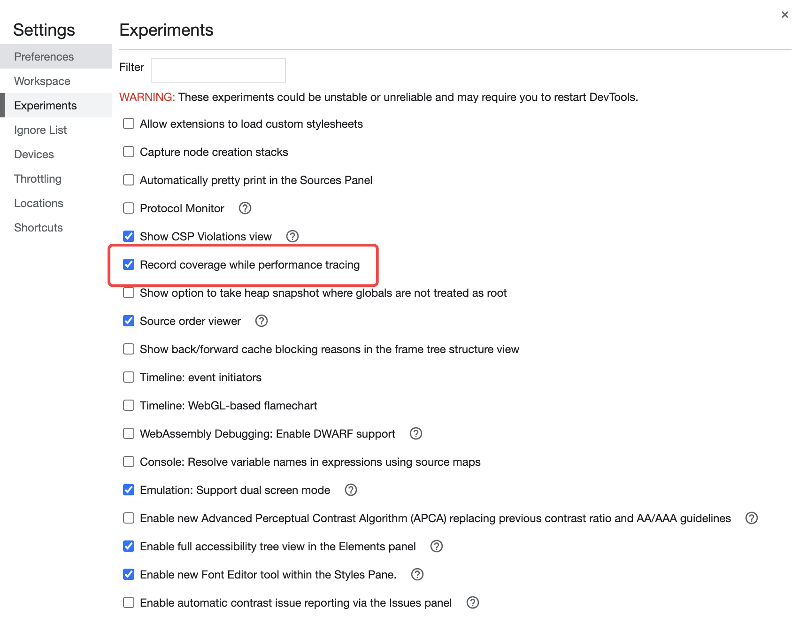

在面板下方的`Coverage`面板中点击红色按钮以记录页面的代码覆盖率：

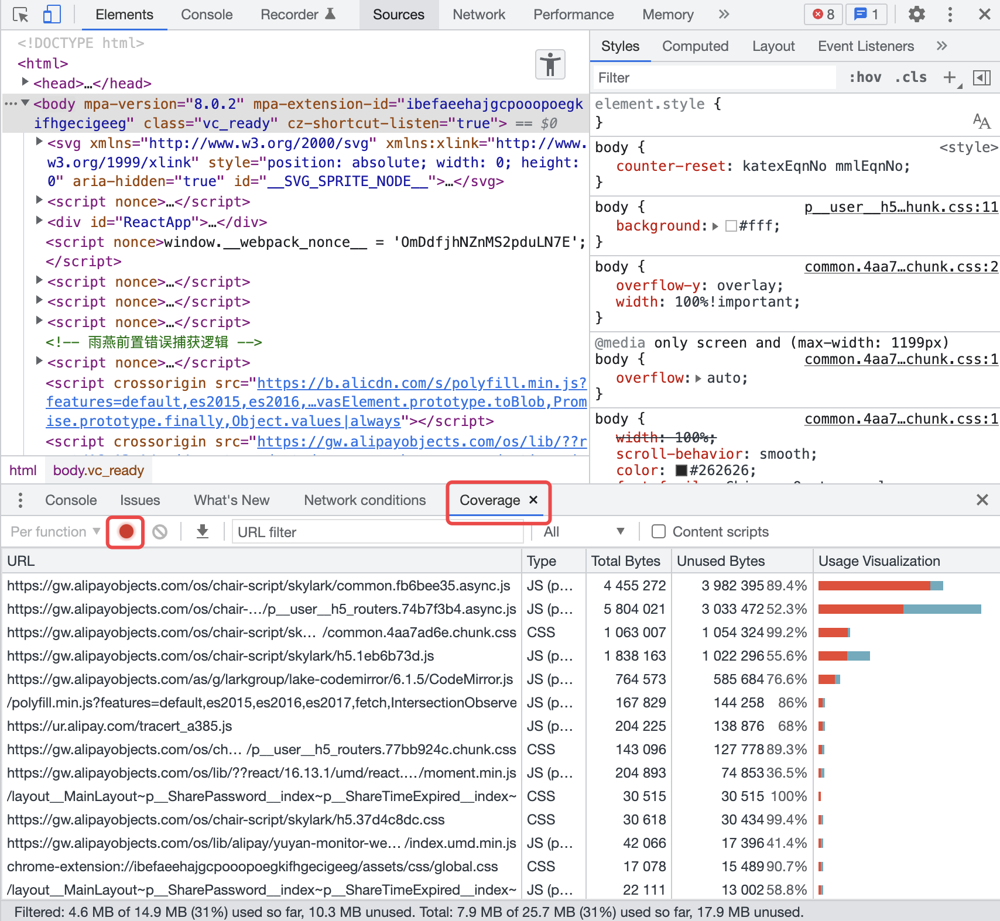

> 代码覆盖率使用动态分析法来收集代码运行时的覆盖率，让开发者知道有代码在页面上真正的使用。动态分析是指在应用运行状态下收集代码执行数据的过程，换句话说，覆盖率数据就是在代码执行过程中通过标记收集到的。

## 3. 显示重绘

在浏览器的开发者工具中可以通过开启显示重绘选项以查看页面在执行操作时哪些元素会发生重绘。

在控制台右上角三个点中的 `More tools` 选项中开启 `Rendering` 选项卡：

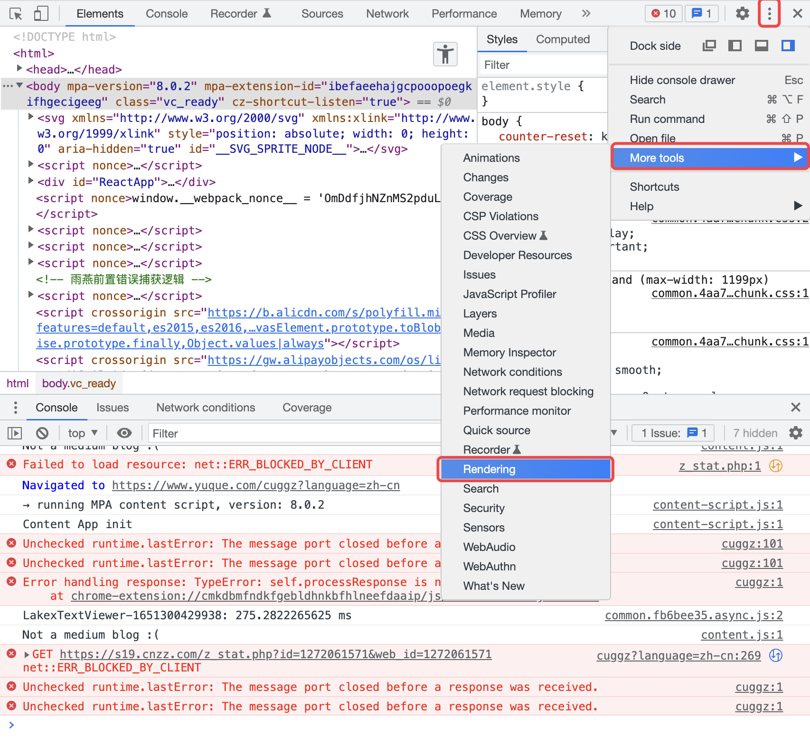

开启 Rendering（渲染）选项后，开启 `Paint flashing`：

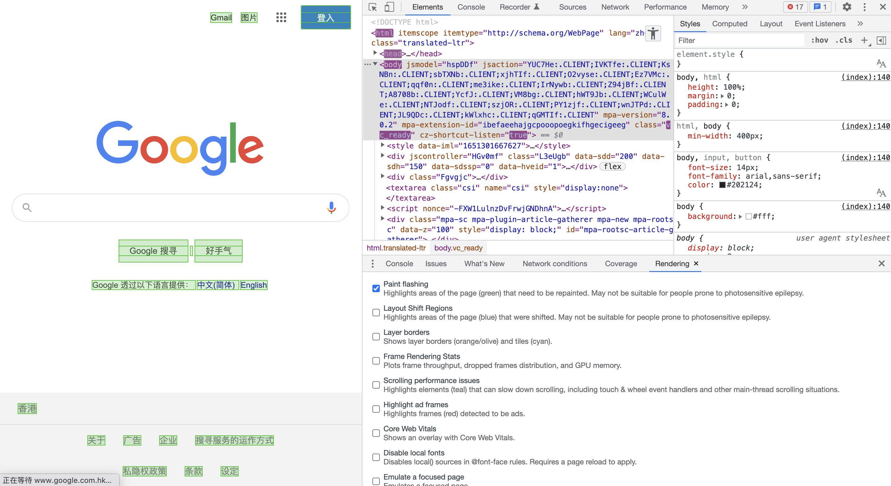

当刷新页面时，显示绿色的区域就是重新绘制区域。

## 4. 检查动画

Chrome 的开发者工具不仅可以调试样式，还可以调试动画，可以在控制台右上角三个点中的 `More tools` 选项中开启 `Animations` 选项卡：

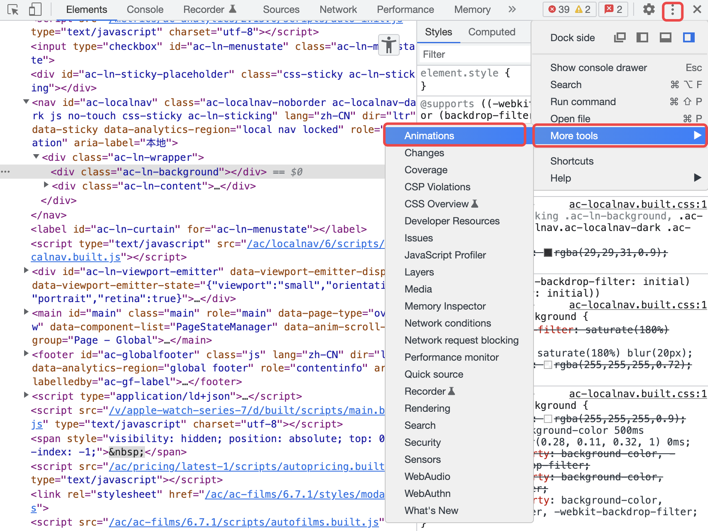

当页面的动画执行时，就会在时间轨道上查看所有的动画，点击其中一个动画可以懂得执行过程以及时间轴：

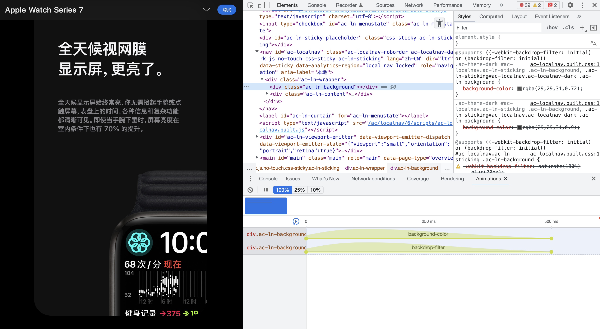

我们可以在时间轴上定位到任一时刻的动画帧，也可以拖动左右两端的圆点来修改动画的延迟和周期，修改之后可以在属性面板看到对应的 CSS 样式。

## 5. 截图

Chrome浏览器内置了截图功能，可以在浏览器开发者工具中使用 `Ctrl+Shift+P`（Windows）或者`Command+Shift+P`（Mac）快捷键打开搜索来查找`screenshot`：

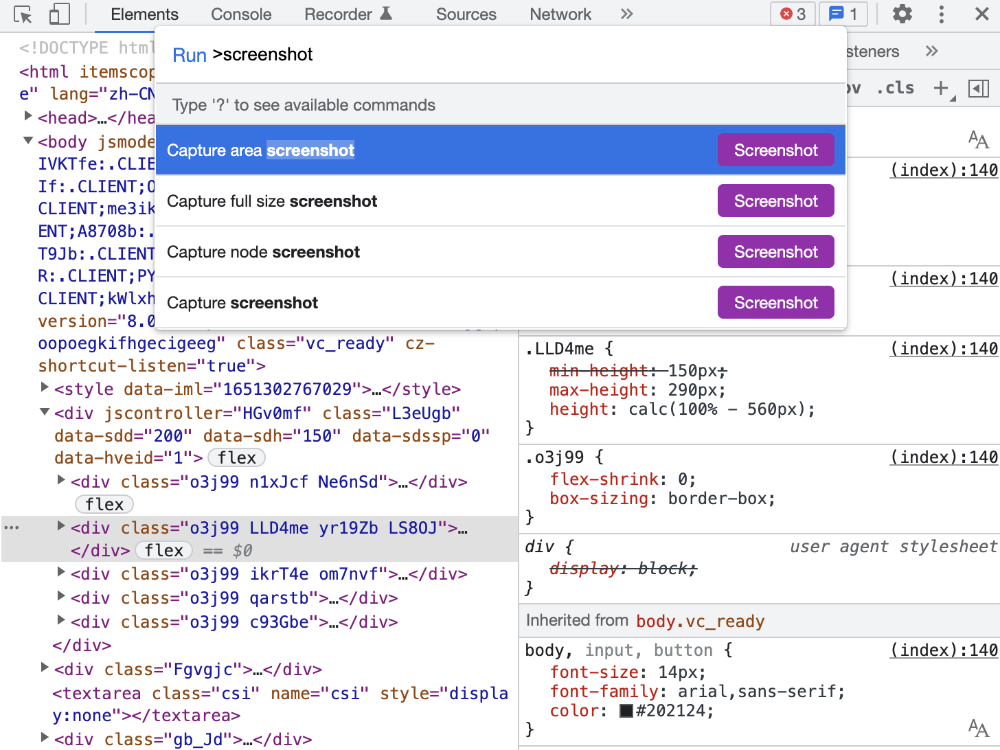\
这里有四个选项：

* 第一个：截取自选区域；
* 第二个：截取整个网页；
* 第三个：截取当前节点；
* 第四个：截取当前屏幕。

截图完成后自动下载到下载目录，打开浏览器的下载框或本机的下载目录即可看到图片。

## 6. Local Overrides

我们可以使用本地资源覆盖网页所使用的资源，比如可以使用本地 CSS 文件覆盖网页的css文件，修改样式。将本地的文件夹映射到网络，在Chrome开发者功能里面对CSS样式的修改都会直接改动本地文件，页面重新加载，使用的资源也是本地资源，达到持久化的效果。

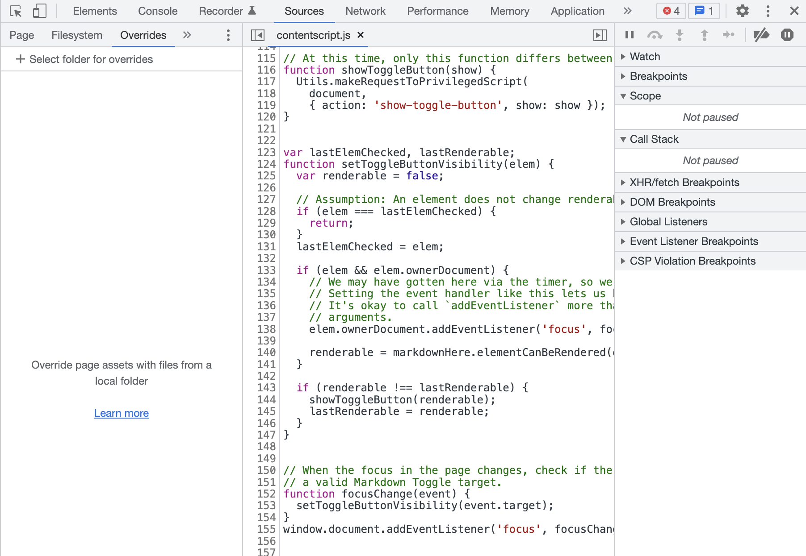

**详见：**<https://developer.chrome.com/blog/new-in-devtools-65/#overrides>

## 7. 全局搜索代码

Chrome浏览器为我们提供了全局搜索的概念，可以点击开发者工具右上角的三个点，点击Search选项，在Search面板中搜索所需关键字即可，点击搜索结果即可跳到对应文件的代码行：

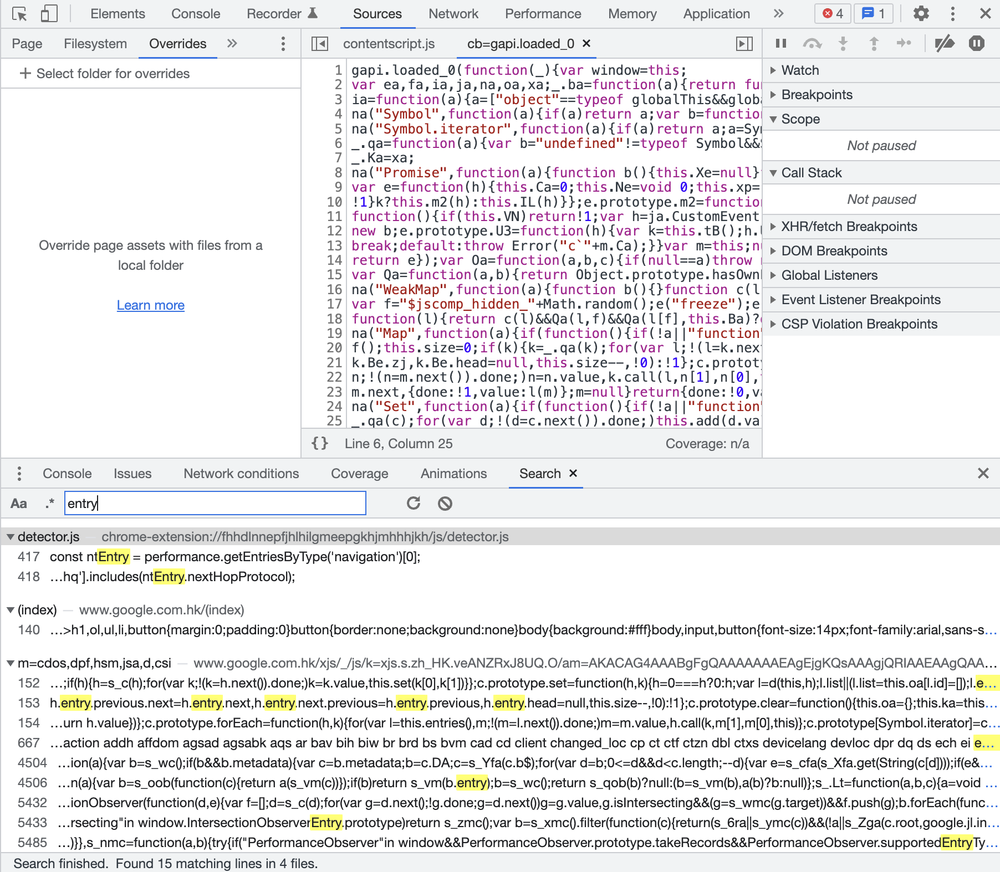

## 8. 事件监听器的断点

有时应用会在用户发生交互时出现问题，这时我们就可以添加事件监听器添加断点来捕获这些事件以检查交互时的问题。可以在`Source`面板右侧的`Event Listener Breakpoints`中勾选相应的事件：

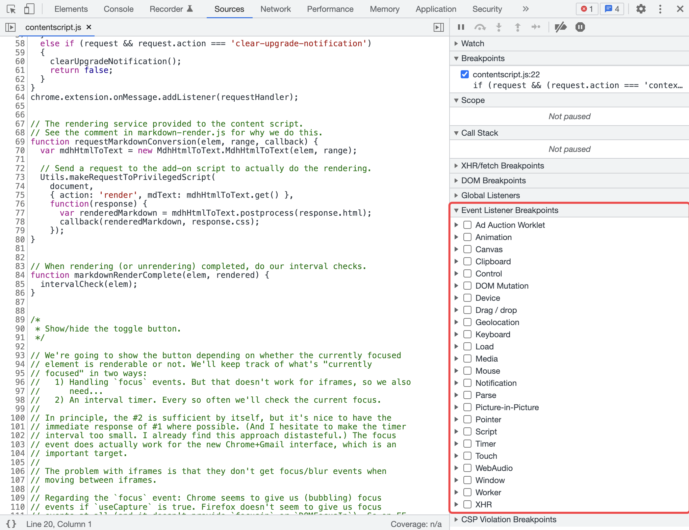

## 9. DOM 操作的断点

当页面的内容发生变化时，如果想要知道是哪些脚本影响了它，就可以给DOM设置断点。我们可以右键点击需要设置断点的DOM元素，在弹出的菜单中点击`Break on`以选择合适的断点。

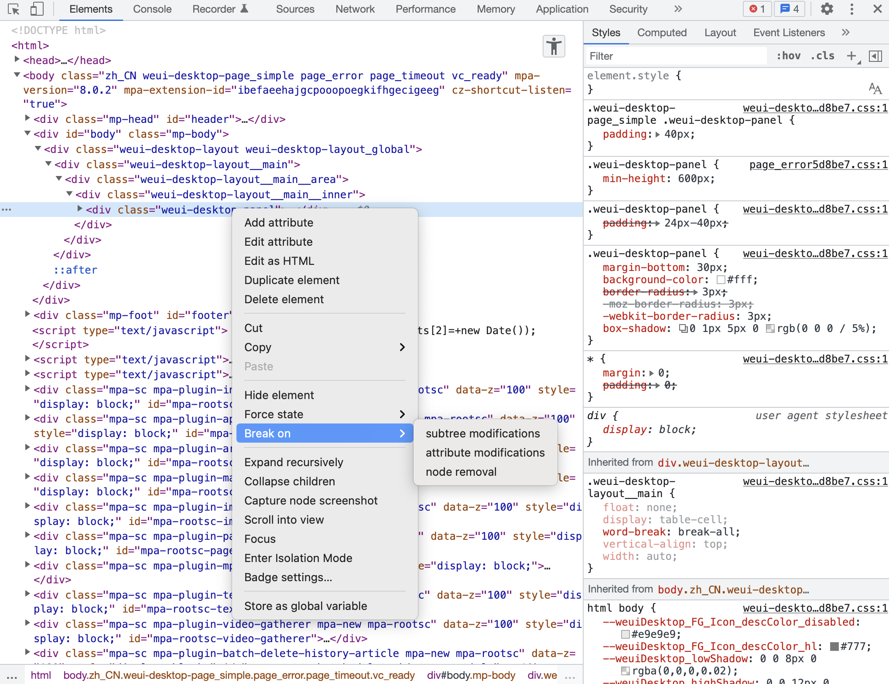\
可以看到，Break on中有三个选项：

* `Subtree Modifications`：子节点（内容、属性）修改通知，常用在子节点内容发生变化后，来定位源码；
* `Attributes Modifications`：当前节点的属性修改通知，常用在节点的 className 等属性被修改后，来定位源码了；
* `Node Removal`：当前节点移动时通知，常用在节点被移除时，定位源码。

## 10. 异步请求的断点

XHR breakpoints 可以用于异步请求的断点，点击加号即可添加断点规则，输入请求 的 URL 地址（片段），会在请求地址包含对应字符串的异步请求发出的位置自动停止：

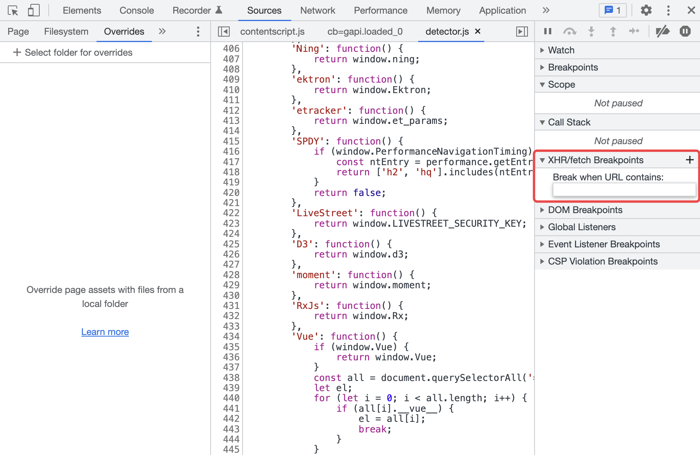

> 更新: 2022-11-10 00:34:18  
> 原文: <https://www.yuque.com/cuggz/feplus/eirlia>