# Devtools 实用功能（2）

Chrome DevTools 是前端开发人员最常用的工具之一，今天我们就来看 5  个 Chrome DevTools 中实用的实验性功能，开启这些隐藏功能，让你的Chrome更加强大！

> 本文中使用的 Chrome 浏览器版本：99.0.4844.74（正式版本） (arm64)
>

## 1. CSS Overview
在 Chrome 的管理面板中，开启CSS Overview面板之后，就可以查看当前网站的样式信息了，包括颜色信息、字体信息、媒体查询等。当我们需要优化页面的 CSS 时，这个功能就派上用场了。除此之外，还可以使用该功能方便地查看其他优秀网站的样式信息。

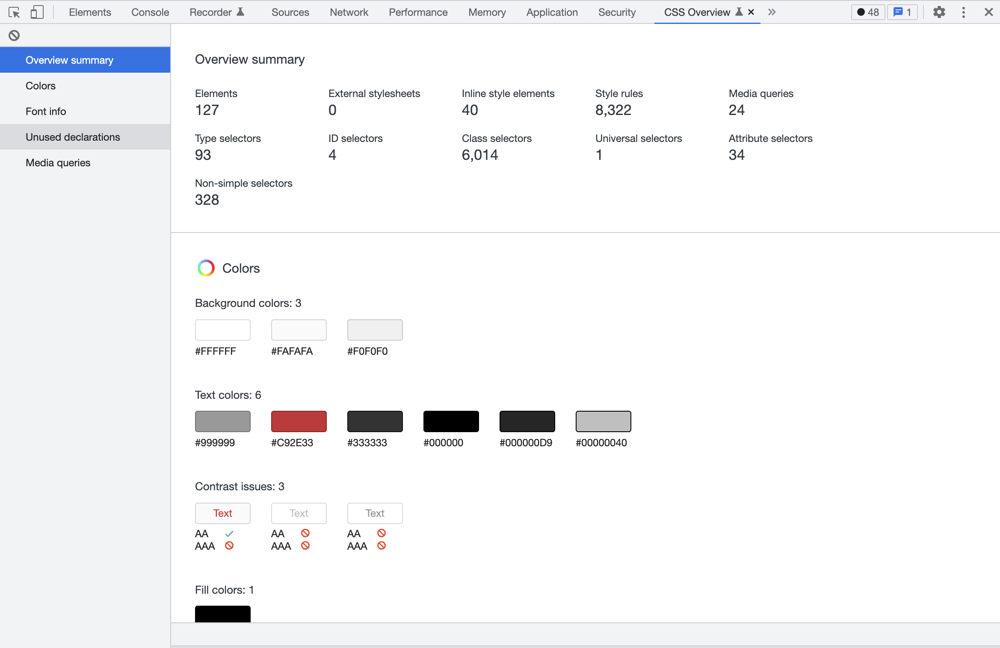

默认情况下，该面板是不开启的，可以通过以下步骤来开启此功能：

1. 在任意页面打开 Chrome 浏览器的 DevTools；
2. 单击**更多选项**      -> **More tools** -> **CSS Overview**。

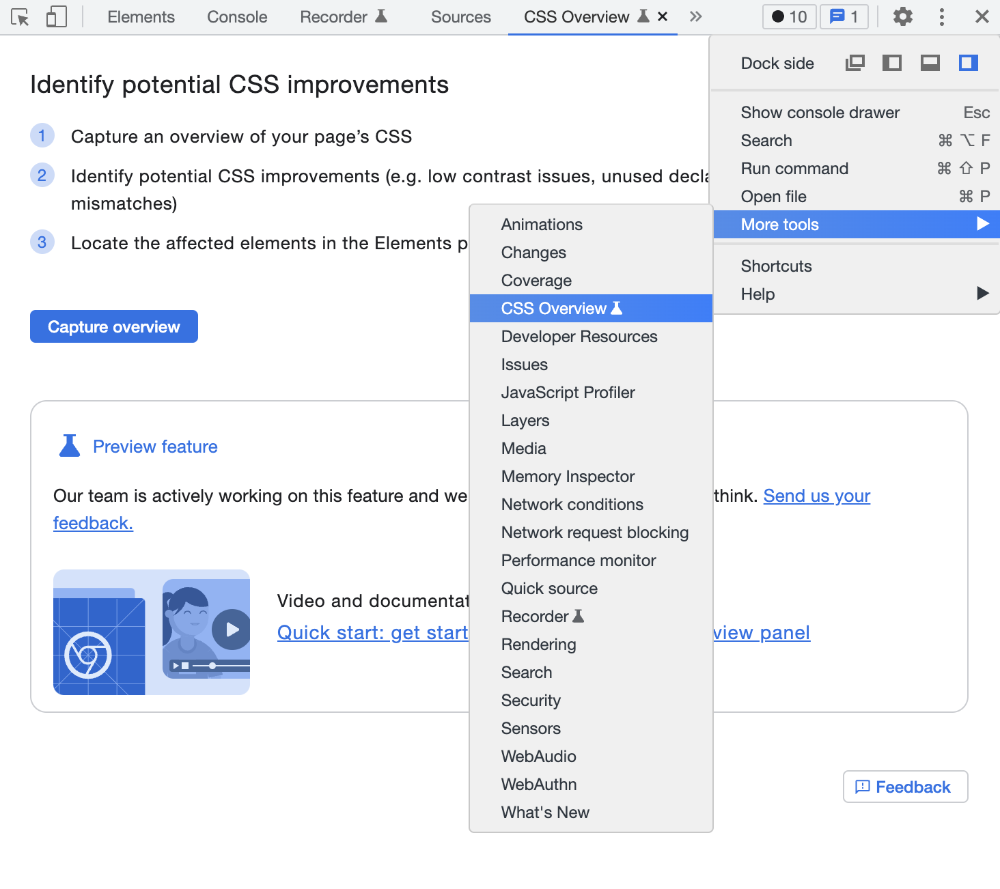

那该如何使用 CSS Overview 面板呢？很简单，只需要点击 **Capture overview** 按钮来生成页面的 CSS overview报告即可。如果想重新运行CSS Overview，只需点击左上角的**清除**图标，然后再点击 **Capture overview **按钮即可。

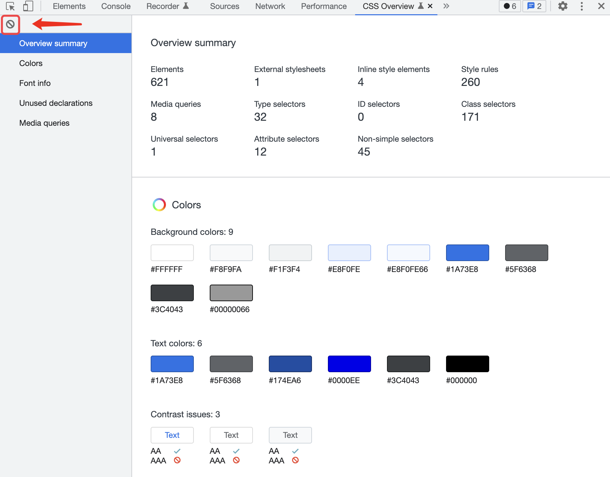

CSS Overview 报告主要由五部分组成：

（1）**Overview summary：**页面 CSS 的高级摘要

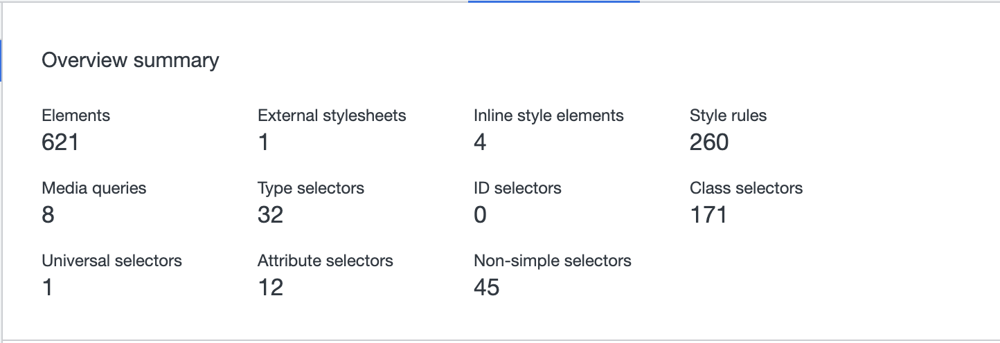

（2）**Colors：**页面中的所有颜色。颜色按背景颜色、文本颜色等用途分组。它还显示了具有低对比度问题的文本。

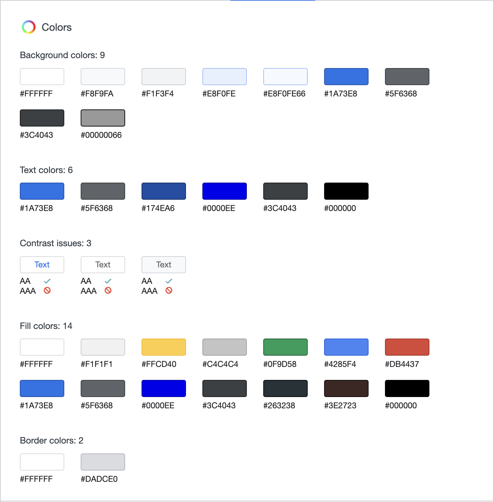

每种颜色都是可点击的。我们可以单击它以获取使用该颜色的元素列表。将鼠标悬停在列表中的元素上就可以突出显示页面中对应的元素。**单击列表中的元素就可以在“Elements**”面板中打开该元素。  
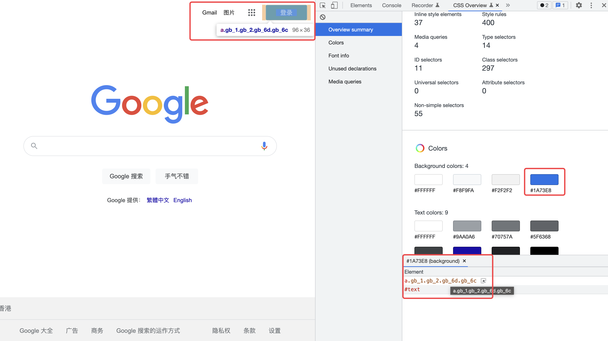

（3）**Font info：字体信息，**页面中的所有字体及其出现，按不同的字体大小、字体粗细和行高分组。与**颜色**部分类似，可以单击以查看受影响元素的列表。

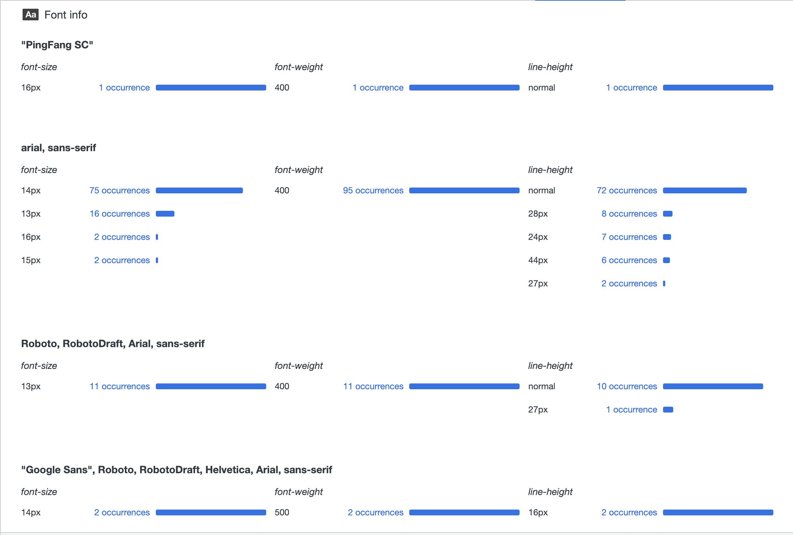

（4）**Unused declarations：**未使用的声明，包含所有无效的样式，按原因分组。

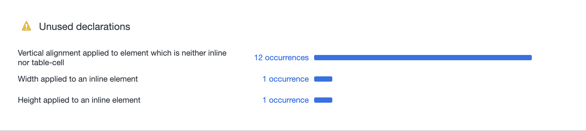

（5）**Media queries：**媒体查询，页面中定义的所有媒体查询，按出现次数最高的排序。单击可以查看受影响元素的列表。

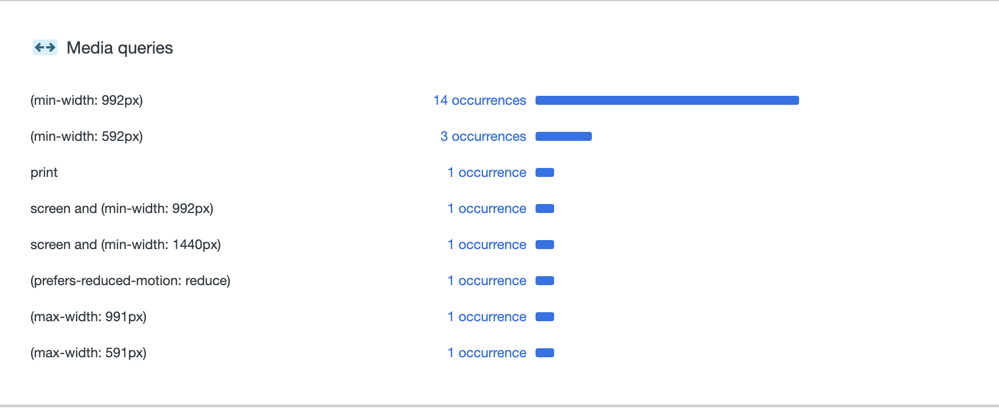

## 2. CSP 违规断点
**Chrome DevTools CSP 违规断点可以捕捉到与CSP违规有关的可能的异常，并在代码中指出这些异常。**

> CSP 即内容安全策略，它允许限制网站中的某些行为以提高安全性。例如，CSP 可用于禁止内联脚本或禁止eval，这两者都可以减少跨站脚本 (XSS)攻击的攻击面。
>
> 
>
> 一个特别新的 CSP 是可信类型 (TT)策略，它支持动态分析，可以系统地防止对网站的一大类注入攻击。为了实现这一点，TT 支持网站监管其 JavaScript 代码，只允许将某些类型的东西分配给 DOM 接收器，例如 innerHTML。
>
> 
>
> 网站可以通过包含特定的 HTTP 标头来激活内容安全策略。例如，标头content-security-policy: require-trusted-types-for 'script'; trusted-types default激活页面的 TT 策略。
>
> 
>
> 目前，调试 TT 违规的唯一方法是在 JS 异常上设置断点。由于强制 TT 违规将触发异常，因此此功能可能会很有用。但是，在现实的场景中，需要对 TT 违规进行更细粒度的控制。特别是，我们希望仅在 TT 违规（而不是其他异常）上中断，也在仅报告模式下中断，并区分不同类型的 TT 违规。
>

启用该功能将为应用程序增加一个额外的安全层，减少跨站脚本（XSS）等漏洞。

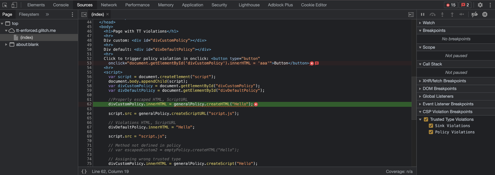

那该如何启用该功能呢？可以通过以下步骤来开启此功能：

1. 在任意页面打开 Chrome 浏览器的 DevTools；
2. 点击右上角**设置**图标 -> 选中左侧 **Experiments** -> 勾选 **Show CSP Violations view；**

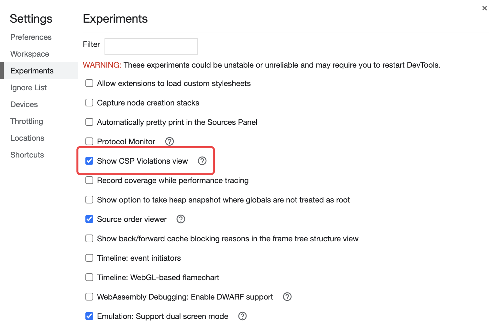

3. 重启浏览器的 DevTools；
4. 在 **CSP Violations Breakpoints **下选择** Trusted Type Violations** 即可。

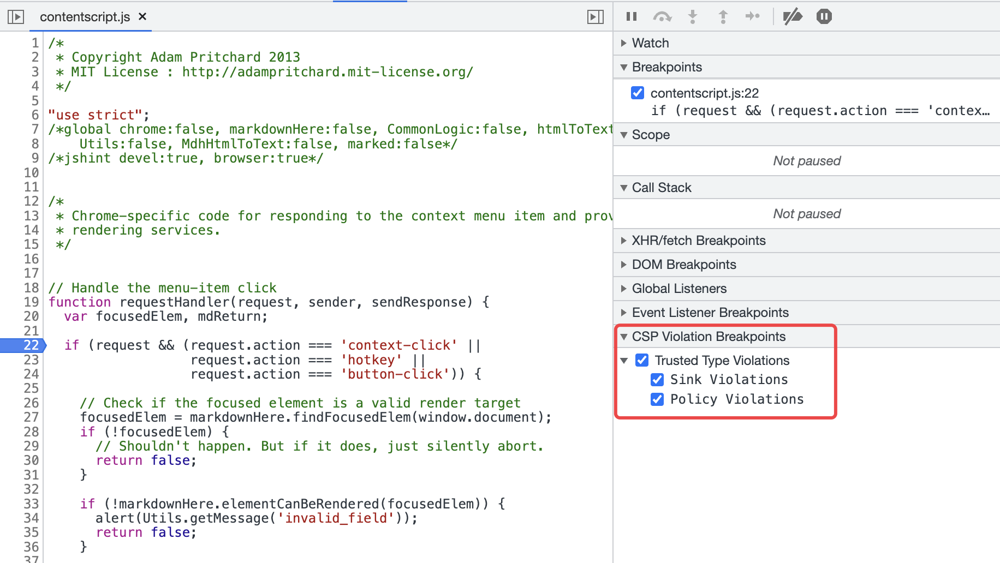

当遇到有安全问题的代码时，Chrome DevTools 甚至会显示如何修复改问题。

## 3. 新的字体编辑器工具
Chrome DevTools 提供了一个实验性的字体编辑器工具，可以用来改变字体设置。可以用它来改变**字体、大小、粗细、行高、字符间距**，并实时看到变化。

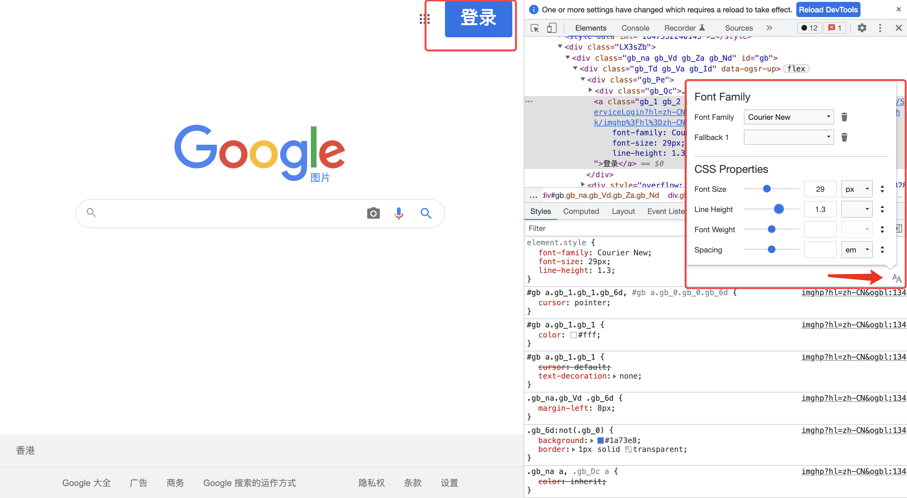

那该如何启用该功能呢？可以通过以下步骤来开启此功能：

1. 在任意页面打开 Chrome 浏览器的 DevTools；
2. 点击右上角**设置**图标 -> 选中左侧 **Experiments** -> 勾选 **Enable New Font Editor Tools within Styles Pane****；**

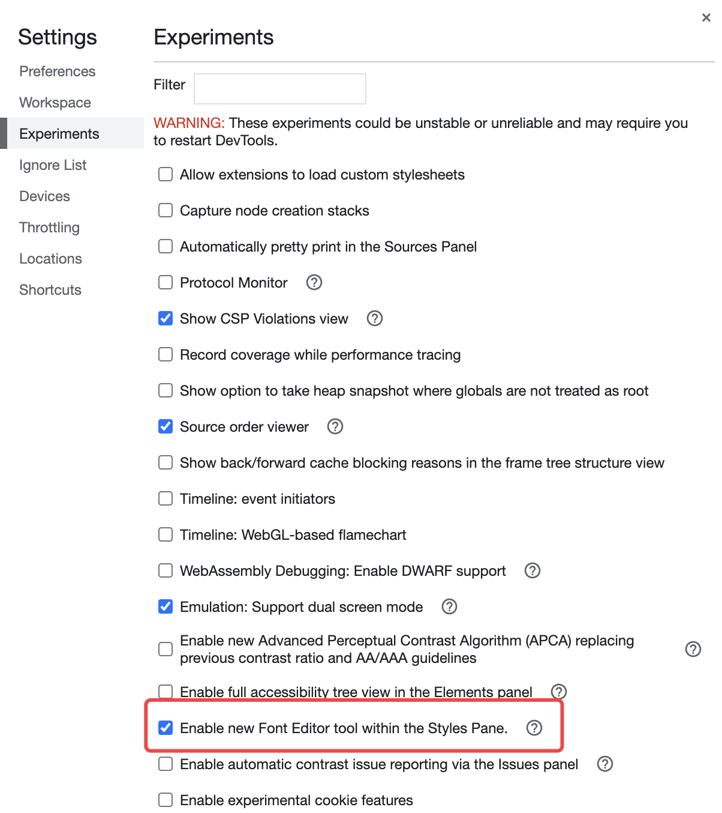

3. 重启浏览器的 DevTools；
4. 选择HTML元素，其中包括想改变的字体，点击字体图标即可。

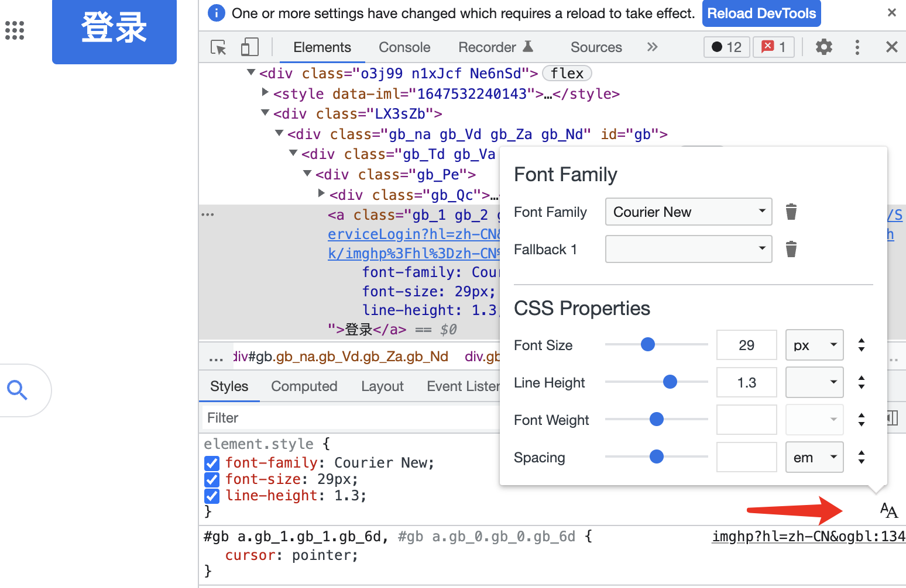

## 4. 双屏模式
通过启用双屏模式，可以在 Chrome DevTools 模拟器的双屏设备上调试你的 web 应用。这对于开发要适配折叠屏手机的应用是非常有用的。

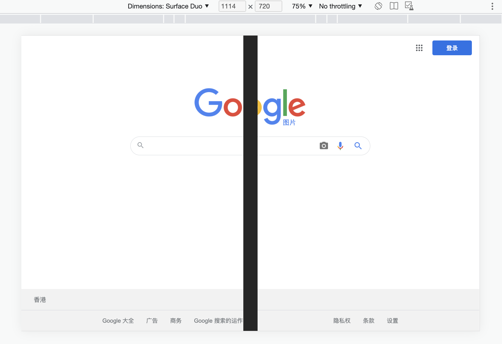

那该如何启用该功能呢？可以通过以下步骤来开启此功能：

1. 在任意页面打开 Chrome 浏览器的 DevTools；
2. 点击右上角**设置**图标 -> 选中左侧 **Experiments** -> 勾选 **Emulation: Support dual-screen mode；**

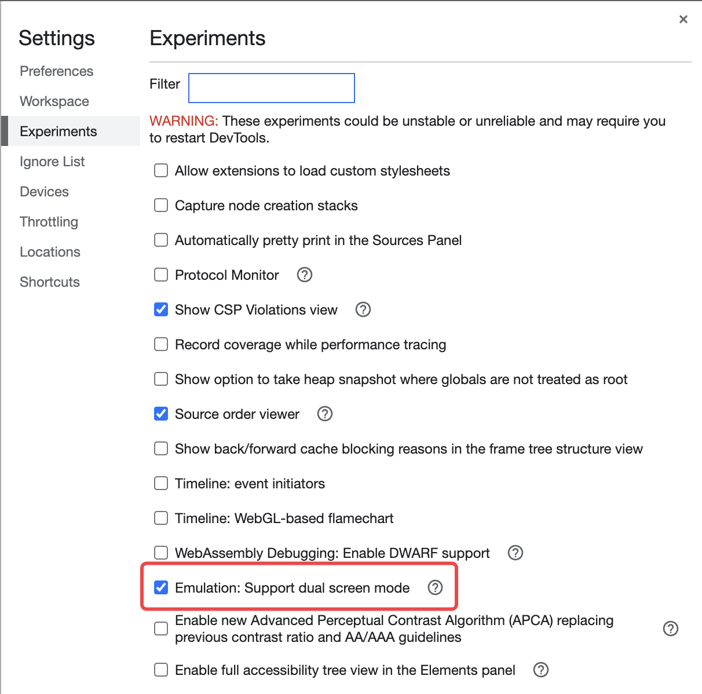

3. 重启浏览器的 DevTools；
4. ①切换到移动设备调试 -> ②选择一个双屏设备 -> ③点击上方的切换双屏模式。

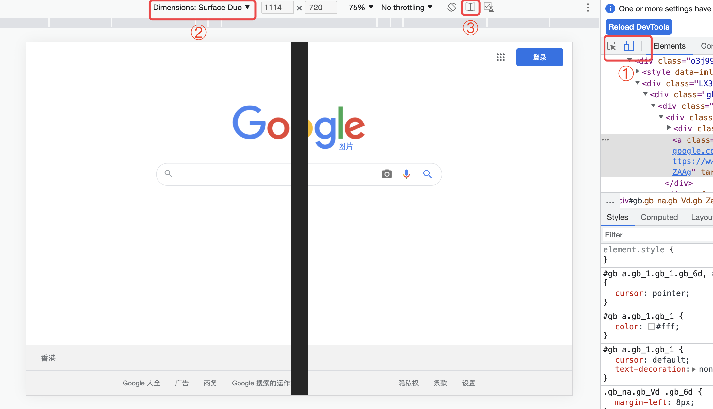

## 5. 完整的可访问性树视图
通过 Chrome DevTools Accessibility Tree，可以检查为每个DOM元素创建的可访问性对象。这项功能与 Elements 选项卡相似，但使用它可以深入探索应用的更多可访问性细节。

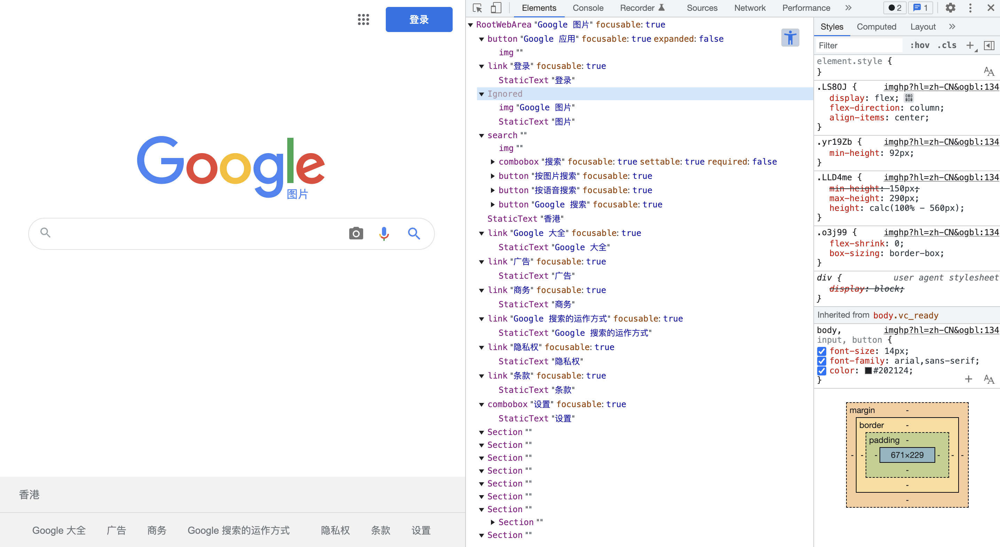  
那该如何启用该功能呢？可以通过以下步骤来开启此功能：

1. 在任意页面打开 Chrome 浏览器的 DevTools；
2. 点击右上角**设置**图标 -> 选中左侧 **Experiments** -> 勾选** Enable ****the Full accessibility tree view in the Elements pane**；

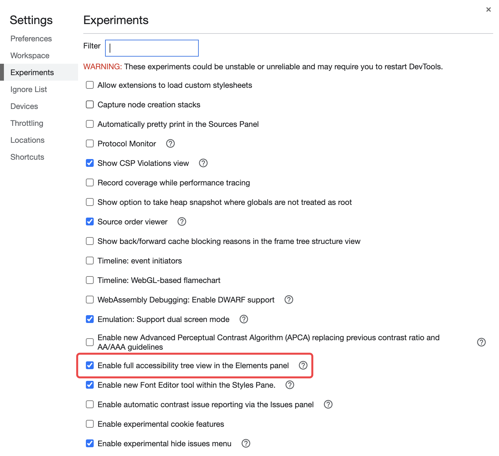

3. 重启浏览器的 DevTools；
4. 在Elements面板中点击右上角的无障碍按钮，将元素视图模式切换为无障碍树视图。

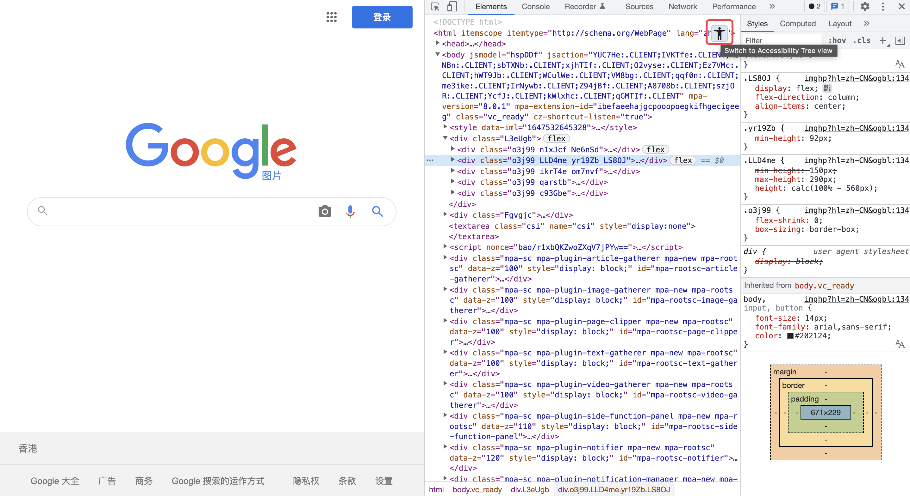

> 更新: 2022-11-10 00:34:33  
> 原文: <https://www.yuque.com/cuggz/feplus/rep3r1>