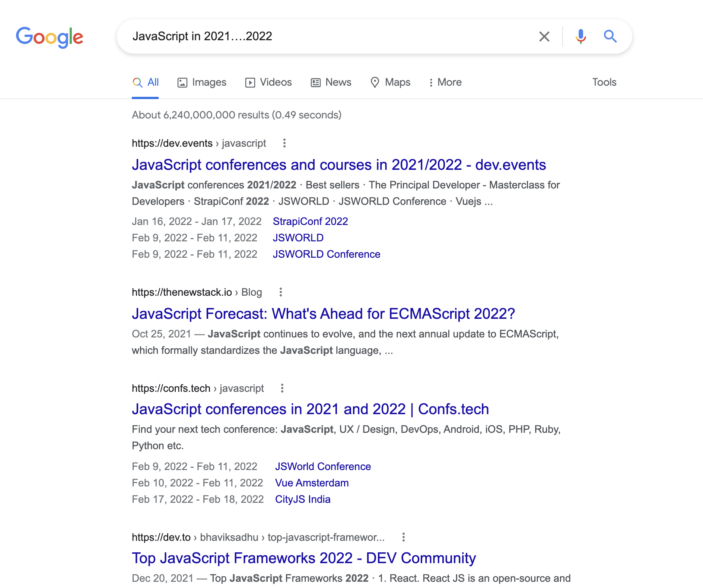
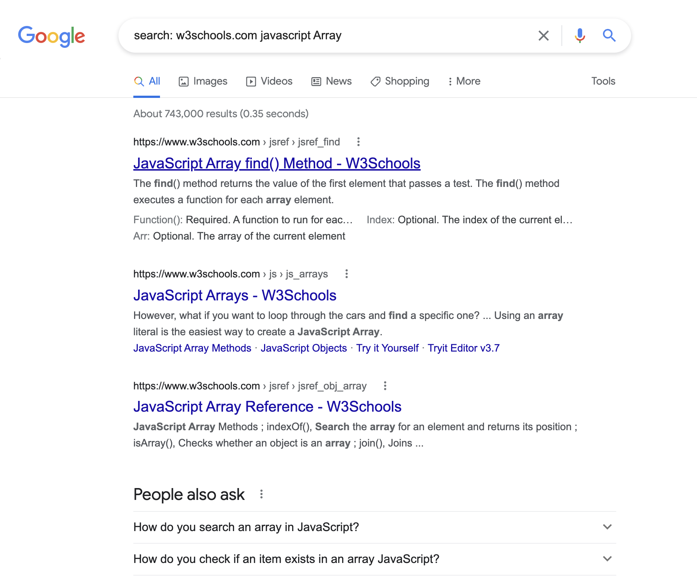
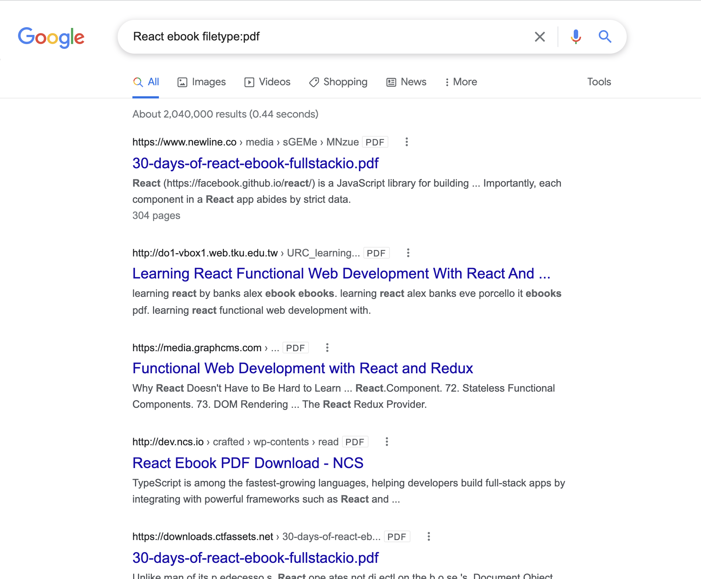
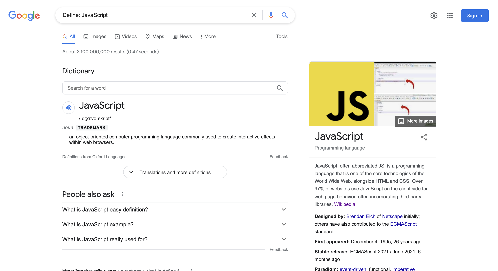
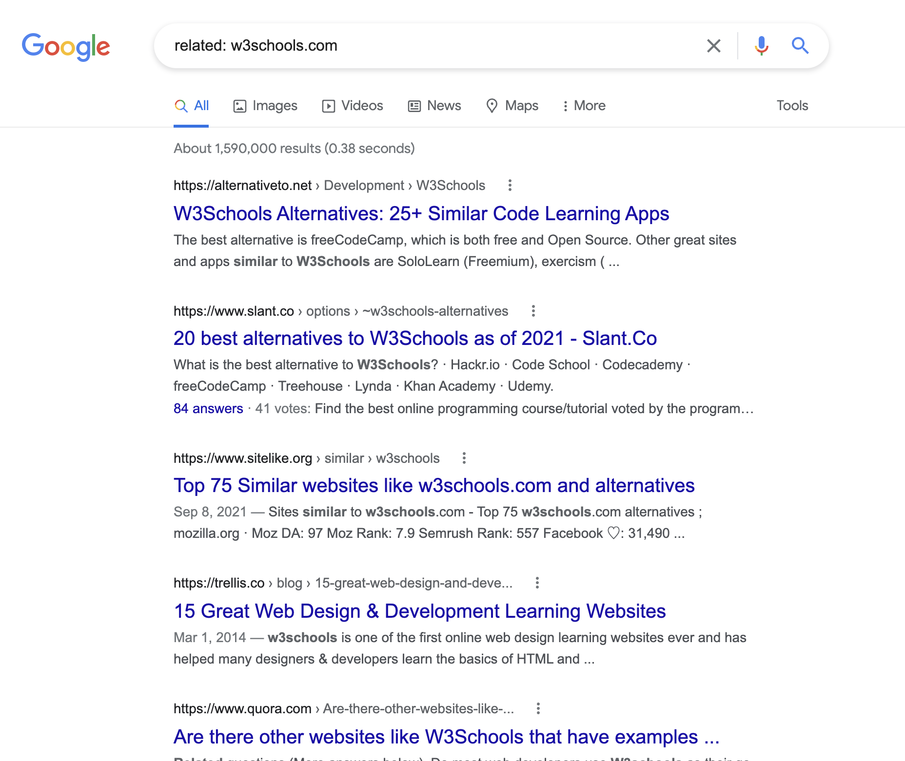

# Google 搜索技巧

作为一个程序员，日常工作离不开搜索引擎。那如何使用搜索引擎进行高效、精准的搜索就是一门学问了，今天来看看一些使用谷歌搜索的技巧！

### 1. 使用引号精确搜索（“”）
当我们搜索特定内容时，可以是用双引号包裹索引内容，以减少Google搜搜的猜测。这时，Google就会完全按照我们给出的搜索内容进行检索。检索结果中只显示包含确切内容的结果。

比如，搜索**learn JavaScript array**，那么搜索引擎就会按照任意顺序去搜索包含这三个词的内容：

而如果使用引号包裹内容，搜索的就是精准内容：

### 2. 使用连字符排除内容（-）
有时候，我们搜索的内容可能有多层含义，或者不想看到和某个信息相关的搜索，就可以使用连字符进行排除。

比如，搜索JavaScript，排除维基百科中的相关内容：

### 3. 使用星号填充内容（*）
可以使用星号来填充文本之间的空格，比如在搜索时，只记得其中一部分内容，另一部分忘记了，就可以这样用。

例如，我们忘记了Git中撤销commit命令的第二个单词，可以这样搜索：

这里就是用星号通配符来代替不确定内容，以让谷歌完成搜索工作。

### 4. 搜索指定范围（...）
可以使用...来搜索指定数字范围的内容，这些数字可以是年份、版本等。

比如，搜索：**JavaScript in 2021….2022**

### 5. 搜索指定站点内容（search:）
可以使用 **search：网站域名 搜索内容 **的形式来在指定网站内搜索内容。

比如，在W3C中搜索：**search: w3schools.com javascript Array**

### 6. 搜索指定文件类型内容（filetype）
可以使用filetype来获取确定文件类型的搜索结果。可以使用这种方式来搜索电子书、文档等类型的内容。

比如，搜索：**React ebook filetype:pdf**

可以看到，所有搜到的内容都是包含PDF的网页。

### 7.  查找多个关键字（AND）
如果我们查找的内容包含多个关键字，那么AND就派上用场了。

比如，搜索：**React AND CSS**

### 8. 查找其中一个关键字（OR）
可以使用OR来查询多个关键词中的一个。

比如，搜索：**React OR Vue**

### 9. 查询关键字的定义（Define）
可以使用Define关键词来查搜索关键词的定义。

比如，搜索：**Define: JavaScript**

### 10. 搜索相关内容（+）
如果我们想要搜索多个相关的关键词时，就可以使用加号来连接多个相关的关键词。

比如，搜索：**CSS style+React**

### 11. 查找相似网站（related）
可以使用related关键字来查询与指定站点相似的站点。

比如，搜索：**related: w3schools.com**

### 12. 搜索指定站点内容（site）
可以使用site关键字来搜索指定站点中的内容。

比如，搜索：**site: github.com React**

### 13. 搜索指定时间范围（before、after）
可以使用after来搜索指定时间之后的内容，使用before搜索指定时间之前的内容。

比如，搜索：**after: 2021 learn react**

> 更新: 2022-11-27 15:47:04  
> 原文: <https://www.yuque.com/cuggz/feplus/rp4bxx>