# Linux 命令

Linux 命令是在命令行上运行的程序。命令行是接受文本行并将其处理成计算机指令的界面。任何图形用户界面 (GUI) 都是命令行程序的抽象。通过 GUI 进行多步骤处理的任务可以通过在 CLI 中键入命令在几秒钟内完成。因此，学习基本的命令行有助于提升工作效率。

<font style="color:rgb(51, 51, 51);">相信很多小伙伴使用Mac做开发，由于Mac是基于unix的，所以Mac的多数命令与linux是通用的。所以，下面列举的多数命令是可以在Mac中使用的。</font>

## 一、文件管理

### 1. cat

cat 命令用于连接文件并打印到标准输出设备上。

```shell
cat index.html
```

使用 cat > filename c可以创建一个新文件：

```shell
cat > style.css
```

使用 cat filename1 filename2 >> filename3 可以连接两个文件（1 和 2）并将它们的输出内容存储在一个新文件3中。

```shell
cat filename1 filename2 >> filename3 
```

### 2. rmdir

rmdir 命令用于删除空的目录。

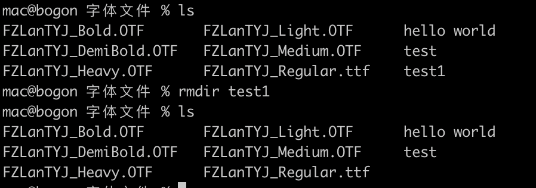

### 3. rm

rm 命令用于删除一个文件或者目录。

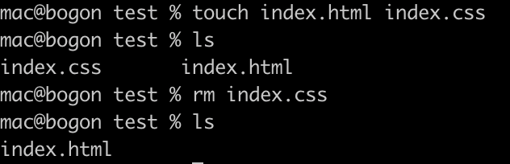

我们还可以使用 <font style="background-color:rgb(240, 239, 237);">rm -rf </font>命令来快速删除文件夹/目录及其内容。

***

注意：使用此命令需要非常小心，并仔细检查所在的目录。这个操作将删除所有内容并且无法撤消。

### 4. touch

touch 命令用于修改文件或者目录的时间属性，包括存取时间和更改时间。若文件不存在，系统会建立一个新的文件。

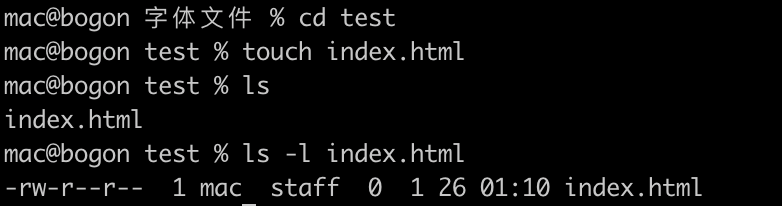

如果不添加任何参数，就会将文件的修改时间改为当前的系统时间。

### 5. cp

cp 命令主要用于复制文件或目录。使用该指令复制目录时，必须使用参数 -r 或者 -R 。

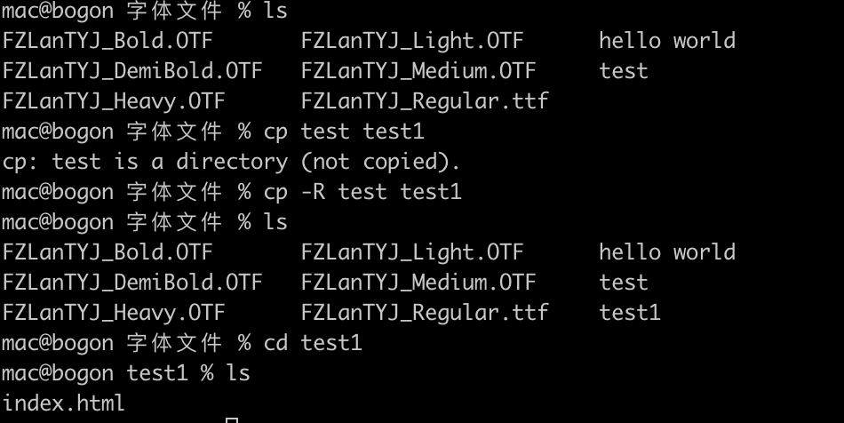

这里复制了test目录，并重命名为了test1，test1目录中也包含test目录中所有的内容。

### 6. mv

mv 命令用来为文件或目录改名（如果目录名称不存在）、或将文件或目录移入其它位置。

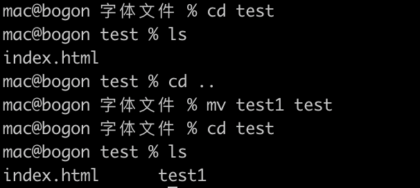

这里将 test1 文件移动到了 test 文件中。

### 7. locate

locate命令用于查找符合条件的文档，他会去保存文档和目录名称的数据库内，查找合乎范本样式条件的文档或目录。一般情况下，只需要输入 locate file\_name 即可查找指定文件。

## 二、磁盘管理

### 1. cd

cd 命令用于切换当前工作目录，需要与文件/目录名称一起使用：

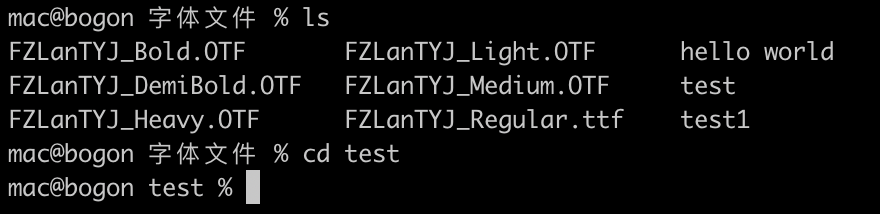

这里的目录/文件名称可以是一个绝对路径或者相对路径。若目录名称省略，则变换至使用者的 home 目录 (也就是刚 login 时所在的目录)。另外，<font style="background-color:rgb(236, 234, 230);">~</font> 表示为 home 目录， <font style="background-color:rgb(236, 234, 230);">.</font> 表示目前所在的目录， <font style="background-color:rgb(236, 234, 230);">..</font> 表示目前目录位置的上一层目录。

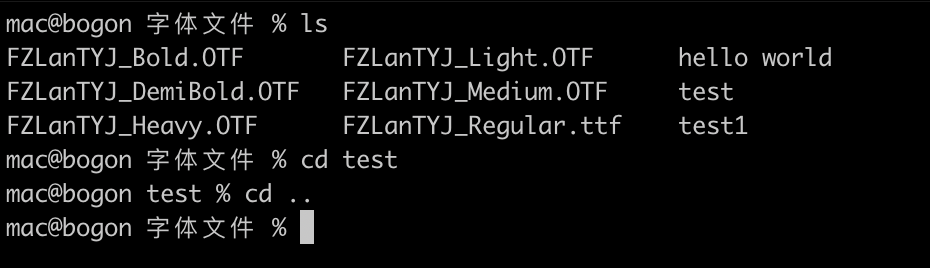

### 2. mkdir

mkdir 命令用来在当前位置（当前目录）新建一个文件夹。只需使用该命令加上需要新建文件夹的名称即可：

```shell
mkdir test
```

下面是创建的结果，使用ls命令就可以看到刚创建的名为test的文件夹：

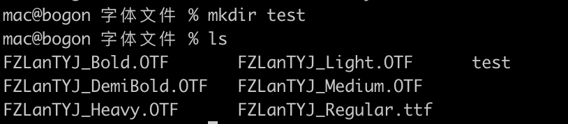

我们还可以同时创建多个文件夹，只需在多个文件夹之间添加空格即可。如果一个文件夹名称中包含空格，就需要使用双引号来写这个文件夹名字：

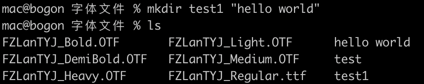

### 3. pwd

pwd 命令用来查看当前文件（文件夹）在文件系统中的绝对路径。

```shell
pwd

/Users/mac/Desktop/函数式编程
```

### 4. ls

ls 命令用来展示指定工作目录下之内容，会列出目前工作目录所含之文件及子目录。

```shell
# ls

FZLanTYJ_Bold.OTF	FZLanTYJ_Heavy.OTF	FZLanTYJ_Medium.OTF
FZLanTYJ_DemiBold.OTF	FZLanTYJ_Light.OTF	FZLanTYJ_Regular.ttf
```

我们还可以给ls命令添加参数，例如：

* ls -l
* ls -a

`ls -l`  命令会以长列表的形式来输出所有内容，使用该命令时，终端会输出所有文件的更多信息，比如权限、文件所有者、文件大小、日期等：

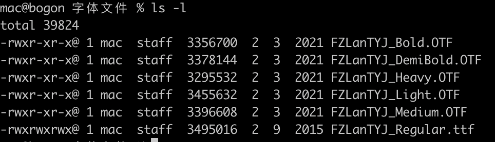

`ls -a `命令会列举出文件夹/目录中所有的文件，包括隐藏文件：

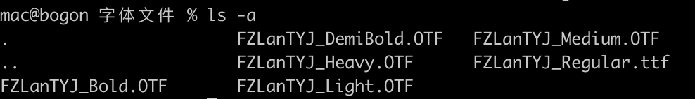

我们还可以将两个参数放在一起使用，输出的结果将是两个参数分别执行时的效果和：

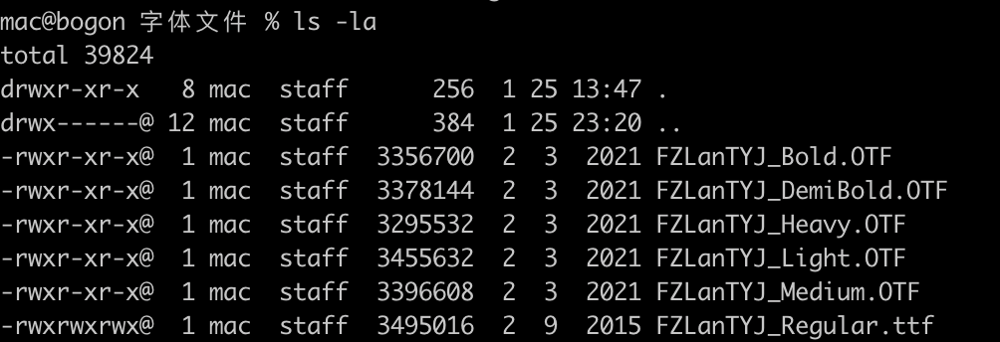

可以看到，输出的结果中包含了常规文件和隐藏文件的附加信息。

## 三、系统设置

### 1. clear

clear 命令用于清除屏幕。

### 2. uptime

在linux中，uptime命令用来显示我们的系统运行了多少时间、当前登录的用户数，操作系统在过去的1、5、15分钟内的平均负载。

```shell
uptime

22:52  up 10 days,  8:57, 2 users, load averages: 4.63 4.15 3.13
```

我们可以使用uptime来确定是服务器还是网络出了问题。例如如果网络应用程序运行，运行uptime来了解系统负载是否很高。如果负载不高，这个问题很有可能是由于网络引起的而非服务器。

可以使用 w 命令来代替 uptime。w 也提供关于当前系统登录用户和用户所进行工作的相关信息。

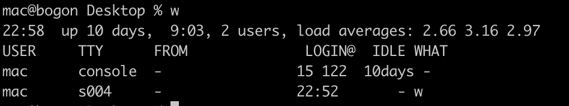

### 3. users

users 命令用来显示系统当前登录的用户。

```shell
users

mac
```

### 4. lsof

lsof 命令用于查看端口占用情况：

```shell
lsof -i:3000
```

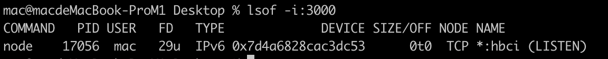

### 5. df

df 命令用于显示目前在 Linux 系统上的文件系统磁盘使用情况统计。

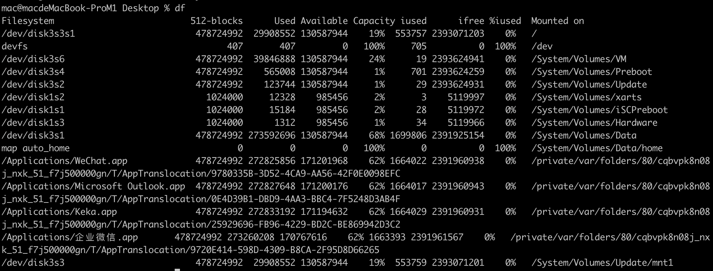

### 6. passwd

passwd 命令用来更改使用者的密码，需要根据提示输入一次旧密码和两次新密码。

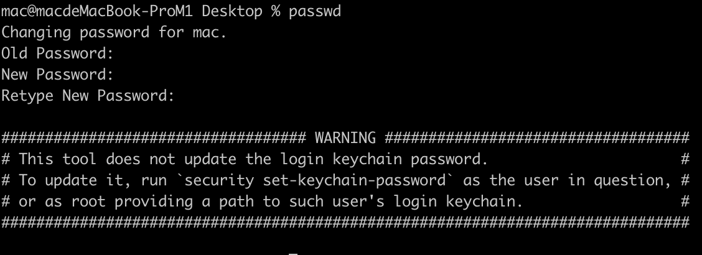

### 7. cal

cal 命令用于查看日历，默认只显示当前月份：

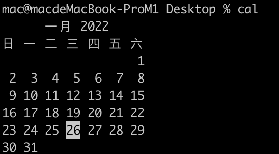

可以使用`cal -y 2022`命令来显示某一年的日历：

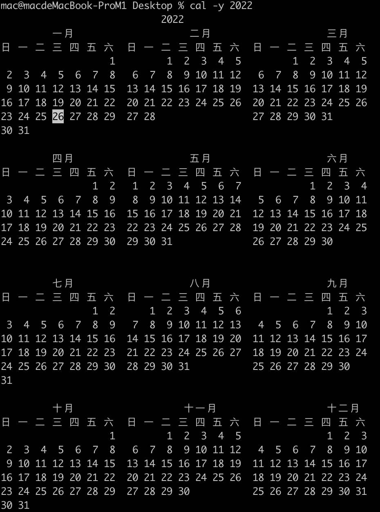

## 四、系统管理

### 1. date

date 命令用来查看当前系统的日期和时间，我们还可以格式化当前的时间：

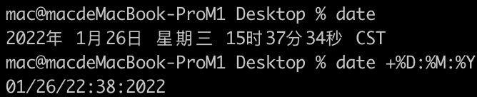

### 2. kill

kill 命令用于删除执行中的程序或工作。kill 可将指定的信息送至程序。预设的信息为 SIGTERM(15)，可将指定程序终止。若仍无法终止该程序，可使用 SIGKILL(9) 信息尝试强制删除程序。

```shell
kill -9 3000
```

### 3. ps

ps 命令用于显示当前进程的状态，类似于 windows 的任务管理器。

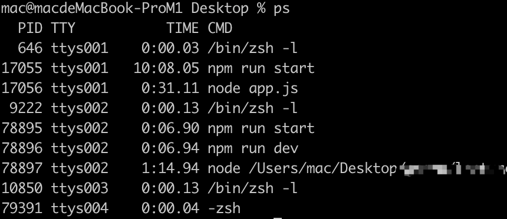

### 4. top

top 命令用于实时显示 process 的动态。

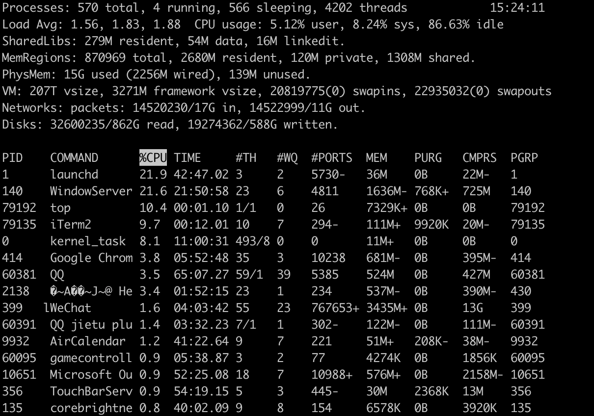

### 5. who

who 命令用来返回用户名、主机信息、日期、时间。

```shell
# who

mac      console  Jan 15 13:55
mac      ttys004  Jan 25 22:52
```

### 6. sudo

sudo 命令会以系统管理员的身份执行指令，也就是说，经由 sudo 所执行的指令就好像是 root 亲自执行的。

### 7. history

history 命令用来查看历史记录。它显示了在终端中所执行过的所有命令的历史。

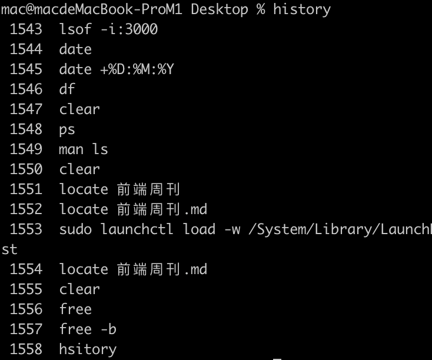

### 8. exit

exit 命令用于退出当前的shell。执行exit可使shell以指定的状态值退出。若不设置状态值参数，则shell以预设值退出。状态值0代表执行成功，其他值代表执行失败。exit也可用在script，离开正在执行的script，回到shell。

## 五、其他

### 1. ssh

ssh 命令用于连接基于 Linux 的远程主机。要使用 root 用户连接远程主机，需要使用以下命令：

```shell
ssh root@192.168.4.21
```

上面的命令将不支持 GUI，如果想使用 GUI 连接远程主机，需要使用下面的命令：

```shell
ssh -XY root@192.168.4.21
```

### 2. tar

tar 命令用于备份文件。tar 是用来建立，还原备份文件的工具程序，它可以加入，解开备份文件内的文件。\
**压缩文件：**

```shell
tar -czvf test.tar.gz a.c   //压缩 a.c文件为test.tar.gz a.c
```

**解压文件：**

```shell
# tar -xzvf test.tar.gz  a.c
```

### 3. grep

grep 命令用于查找文件里符合条件的字符串。如果发现某文件的内容符合所指定的范本样式，预设 grep 指令会把含有范本样式的那一列显示出来。若不指定任何文件名称，或是所给予的文件名为 <font style="background-color:rgb(236, 234, 230);">-</font>，则 grep 指令会从标准输入设备读取数据。

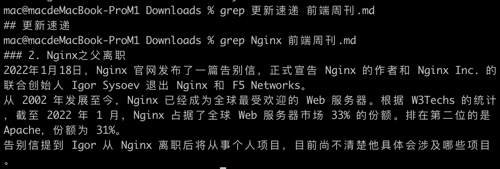

可以使用<font style="background-color:rgb(249, 249, 249);">-c</font>参数来计算重复的次数：

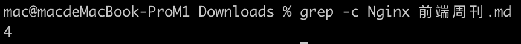

### 4. ping

ping 命令用于检测主机。执行 ping 指令会使用 ICMP 传输协议，发出要求回应的信息，若远端主机的网络功能没有问题，就会回应该信息，因而得知该主机运作正常。

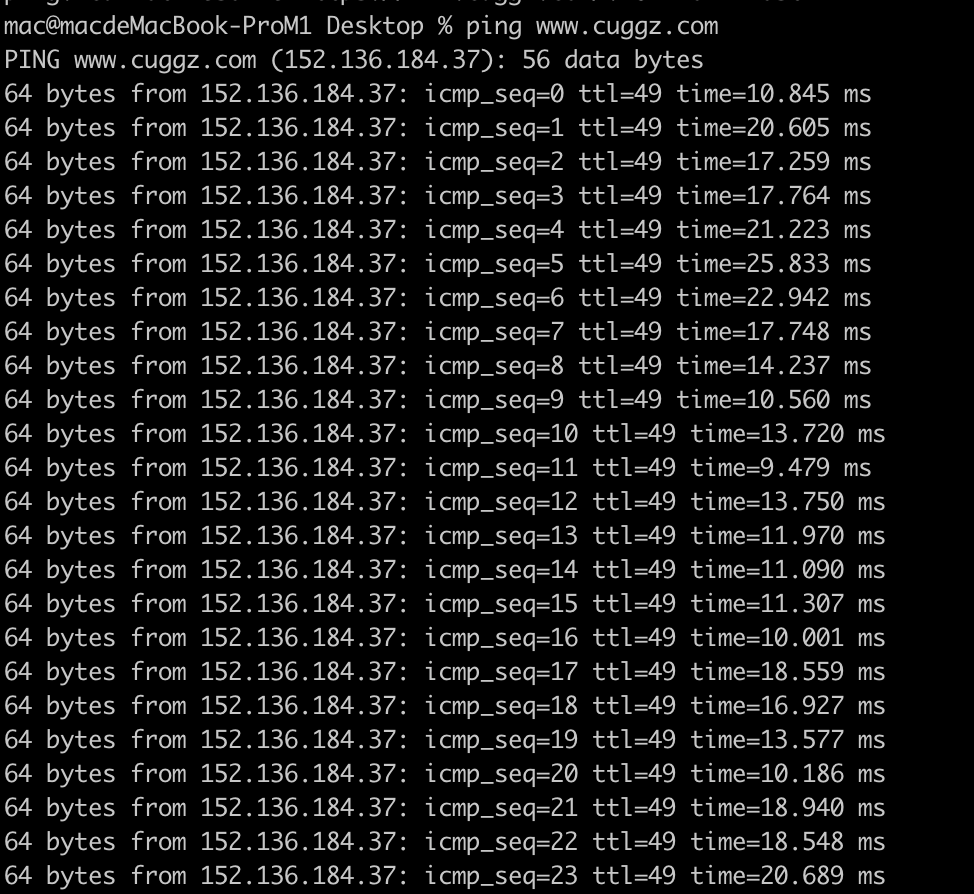

### 5. man

man命令用来查看Linux命令的使用手册，例如执行 man clear：

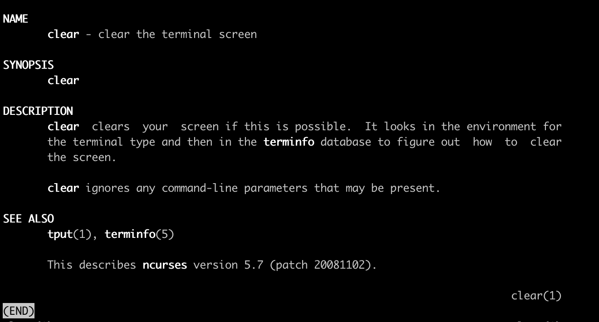

### 6. wc

<font style="color:rgb(51, 51, 51);">wc命令用于计算字数。利用wc指令我们可以计算文件的Byte数、字数、或是列数，若不指定文件名称、或是所给予的文件名为"-"，则wc指令会从标准输入设备读取数据。</font>


> 更新: 2022-08-09 18:17:46  
> 原文: <https://www.yuque.com/cuggz/feplus/osscu8>