# VS Code 快捷方式

Visual Studio Code 是目前最流行、最常用的代码编辑器之一，它是开源的并且可以免费使用。它还提供对多种语言和框架的支持。

注意，这些 Visual Studio Code 快捷方式取自于 VS Code 官方文档。如果某些快捷方式不起作用，可能是由于编辑器或文件格式中的快捷方式发生了变化，或者安装的扩展影响了该快捷方式。

## 一、快捷导航
### 1. 搜索文件
当需要搜索特定的文件，当项目很大时，就会耗费大量时间。即使已经知道文件在哪，使用这个快捷键也会很方便，可以轻松打开项目中的文件。

+ **Windows/Linux:** ctrl + P
+ **macOS:** command + P

### 2. 打开设置
Visual Studio Code 有许多功能和设置，可以根据需要进行更改。此快捷键可以在必要时轻松地打开设置。

+ **Windows/Linux**: ctrl + ,
+ **macOS**: command + ,

### 3. 切换侧边栏
很多时候，我们需要更多空间来放置需要处理的文件。因此，此快捷键可以方便地在显示或隐藏侧边栏。

+ **Windows/Linux**: ctrl + B
+ **macOS**: command + B

### 4. 导航选项卡
当打开了许多选项卡并且需要在它们之间进行切换时，就可以使用这个快捷键，它会显示选项卡列表并在它们之间导航，我们可以选择要打开的选项卡。

+ **Windows/Linux**: ctrl + shift + tab
+ **macOS**: control + shift + tab

### 5. 导航选项卡组
Visual Studio Code  提供了创建选项卡组功能。选项卡组允许我们将选项卡分组，每个选项卡组会占屏幕的一部分。使用该快捷键可以在不同的选项卡组进行切换。如果在快捷方式中选择的选项卡组大于当前打开的组数，此快捷键就会创建一个新组。

+ **Windows/Linux** : ctrl + 1或2或3
+ **macOS**：command + 1或2或3

### 6. 打开终端
在开发过程中，会经常使用终端。Visual Studio Code 允许我们在编辑器内打开终端窗口。这样就无需在编辑器和终端之间切换了，让我们可以专注于编辑器和代码。

+ **Windows/Linux**: ctrl + J
+ **macOS**: command + J

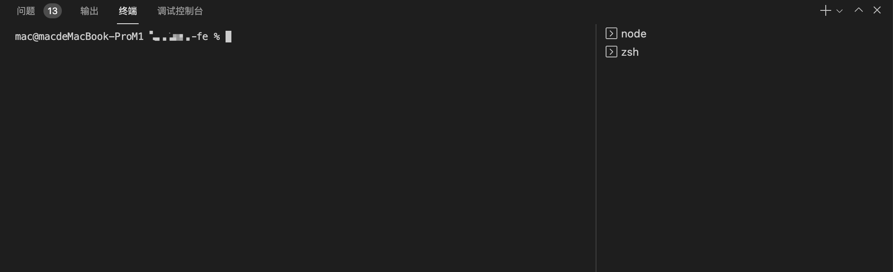

### 7. 打开命令面板
我们可以在 Visual Studio Code 中执行许多命令。使用这个快捷键可以轻松打开命令面板。命令面板允许搜索可以使用的命令并执行它们。

+ **Windows/Linux**: ctrl + shift + P
+ **macOS**: command + shift + P

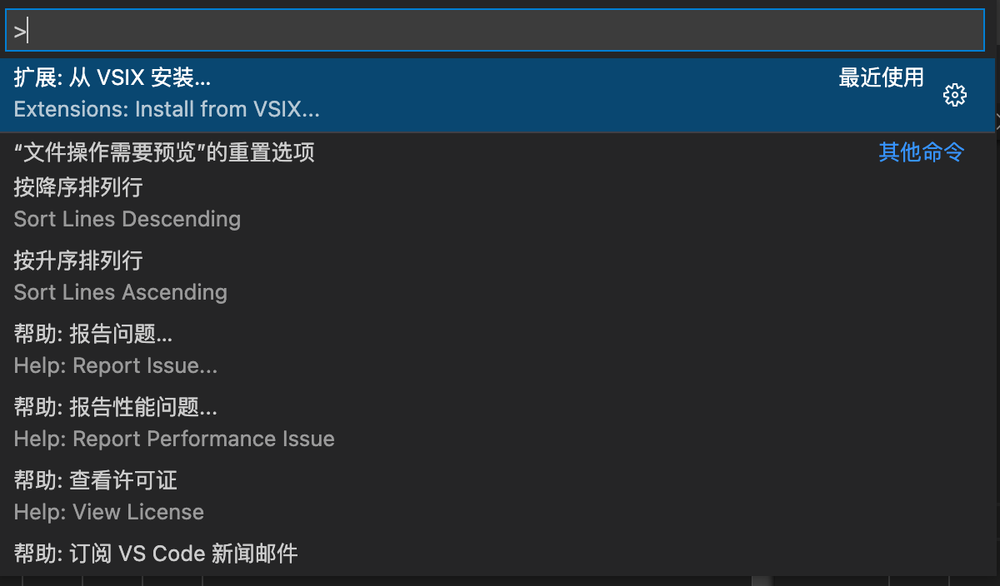

## 二、快捷选择
在开发过程中，经常需要在代码中进行选择，包括复制、剪切等操作。与其使用鼠标进行操作，不如使用键盘进行操作可以节省时间。这些快捷键专注于快速做出选择。

### 1. 选择当前行
可以使用这个快捷键来快速选择光标所在行的整行代码。

+ **Windows/Linux**: ctrl + L
+ **macOS**: command + L

### 2. 当前选择
使用此快捷键只需选中一次要查找的文本，就可以在文件中选中所有这个文本，这样就可以同时编辑这些文本了。

+ **Windows/Linux** : ctrl + shift + L
+ **macOS** : command + shift + L

### 3. 当前单词
此快捷键会执行与上面快捷键相同的操作，但无需选择任何内容。当光标放在一个词上时，按此快捷键就可以选择这个单词在当前文件中的所有的位置。

+ **Windows/Linux**: ctrl + F2
+ **macOS**: command + F2 + fn

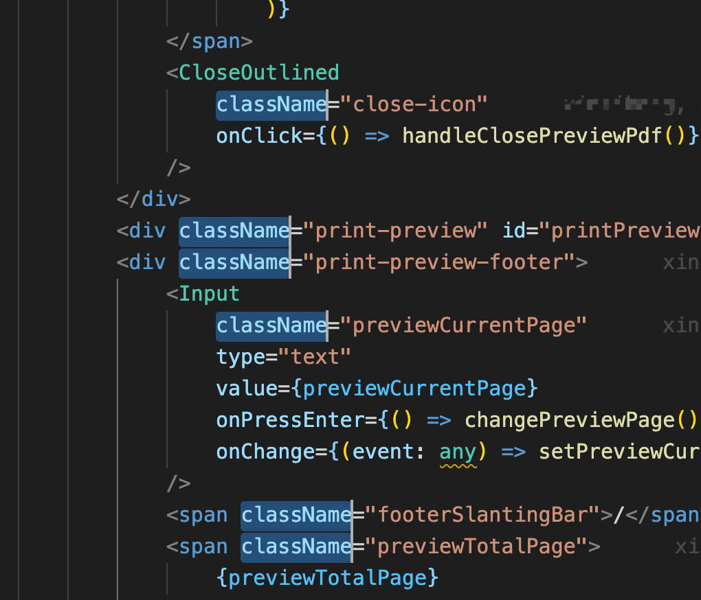

### 4. 选择直到单词的结尾
选择代码的某部分时，可以移动和扩展此快捷方式的选择。可以使用右箭头或左箭头朝想要的方向前进。

+ **Windows/Linux** : shift + alt + →或←
+ **macOS** : shift + option + →或←

### 5. 通过拖动鼠标选择多行代码
将光标拖过代码就会从头到尾选择每一行。但是也可以使用此快捷来选择部分代码行，但只能选择拖动的多行代码。

+ **Windows/Linux** : shift + alt + 拖动光标
+ **macOS** : shift + option + 拖动光标

### 6. 使用箭头键选择多行代码
使用该快捷键也可以执行上述操作，但无需使用鼠标，而是使用键盘上的箭头键。

+ **Windows/Linux** : ctrl + shift + alt + → 或 ← 或 ↓或↑
+ **macOS** : command + shift + option + → 或 ← 或 ↓或↑

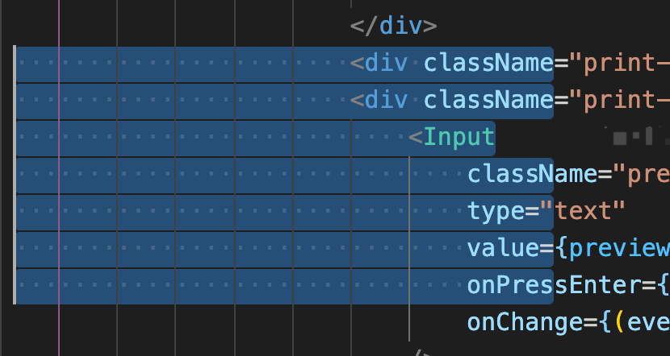

## 三、快捷查找
所有编辑器都具有查找功能，以便可以在当前文件或多个文件中查找某些单词，例如函数或变量名称、短语或代码块等。下面就来看看查找功能相关的快捷键。

### 1. 结果导航
可以使用此快捷键在文件中的查找结果之间进行移动。

+ **Windows/Linux**：F3
+ **macOS**：F3 + fn

### 2. 选择多个结果
如果想要修改多个搜索结果，就可以使用此快捷键在文件中选择查找结果中的多个内容，每次按下此键后都会选择一个结果，然后就会按搜索结果的顺序进行选中。

+ **Windows/Linux** : ctrl + D
+ **macOS** : command + D

### 3. 选择所有结果
如果想使用查找功能对所有查找结果进行修改，则此快捷键就可以选择所有查找结果。

+ **Windows/Linux**: alt + enter
+ **macOS**: option + enter

## 四、代码导航
随着文件或项目变得复杂，找到代码的某些部分就变得越来越困难。手动查找错误或转到某一行代码可能比较困难。下面这些快捷键就可以省去很多麻烦，让我们将更多时间投入到真正想做的事情上。

### 1. 跳转指定行
当遇到指定一行代码导致编译或运行时错误时，就可以使用该快捷键跳转到这一行代码，只需按下这个快捷键，输入代码行数，按下回车即可跳转到这行代码。当一个文件中代码特别多时，这个快捷键就非常有用。

+ **Windows/Linux**: ctrl + G
+ **macOS**: control + G

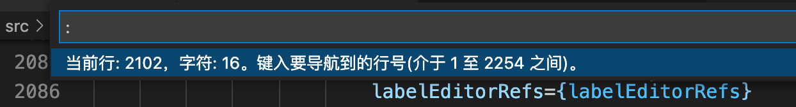

### 2. 转到匹配的括号
我们可能会需要查找匹配代码块的右括号。当文件很长时，就很困难了。使用此快捷键可以轻松找到当前块的右匹配括号。在 HTML 标签中，它可以移动到当前标签的末尾。

+ **Windows/Linux** : ctrl + shift + \
+ **macOS** : command + shift + \

### 3. 折叠/展开代码块
在包含大量代码的文件时，我们可以折叠（隐藏）当前不关注的某个代码块，以便可以专注于其他内容。此快捷键就是用来折叠或展开代码块的。单击代码块中的任意位置，然后按以下键即可。

+ **Windows/Linux** : ctrl + shift + [或]
+ **macOS** : command + option + [或]

### 4. 折叠/展开代码块和子代码块
如果代码块包含子代码块怎么办？使用上面的命令将会折叠父代码块，但当父代码块展开时，子代码块将保持不变。如果需要折叠和展开一个代码块及其子代码块，可以使用此快捷键来完成。

+ **Windows/Linux** : ctrl + K + [或]
+ **macOS** : command + K + [或]

### 4. 导航到错误和警告处
在代码中查找出现错误和警告的代码至关重要。此快捷键省去了滚动以找到确切问题的麻烦。它可以直接转到下一个错误或警告处。

+ **Windows/Linux**：F8
+ **macOS**：F8 + fn

## 五、移动光标
在很多情况下，可能需要有多个光标，每个光标位于文件中的不同位置。这些快捷键有助于更轻松地使用多个光标进行移动。

### 1. 特定位置插入额外光标
此键盘快捷键可以在文件中任何位置插入一个额外的光标。

+ **Windows/Linux** : alt + 鼠标点击位置
+ **macOS**：option + 鼠标点击位置

### 2. 上方或下方插入额外光标
插入光标的第二种方法是将其插入在当前光标位置的上方或下方。

+ **Windows/Linux** : ctrl + alt +↓或↑
+ **macOS** : command + option +↓或↑

### 3. 撤销光标插入
如果错误地插入了光标，或者不再需要在该位置插入光标怎么办？此快捷键可以撤消上次插入的光标。当插入多个光标时，这个快键键将非常有用，因为它可以将其他光标保持在原位并删除最后插入的光标。

+ **Windows/Linux** : ctrl + U
+ **macOS** : command + U

### 4. 在选中代码的末尾插入光标
使用该快捷键可以在选中代码的每一行的最后插入光标。

+ **Windows/Linux** : shift + alt + I
+ **macOS** : shift + option + I

## 六、快捷编码
### 1. 移动代码行或代码块
很多时候需要将一条行或多行代码从一个位置移动到另一个位置。此快捷键并不是复制或剪切并将代码粘贴到另一个位置，而是提供了一种更快的解决方案，只需将光标放在该代码行上。如果想移动多行代码，只需先选中需要移动的代码，再使用该快捷键即可。

+ **Windows/Linux** : alt +↓或↑
+ **macOS**：option +↓或↑

### 2. 复制代码行或代码块
如果需要复制一行或多行代码并将其粘贴到下方或上方怎么办？这个快捷键不必实际复制和粘贴这些代码，而是根据使用箭头选择的方向在其下方或上方复制该行。如果想复制多行代码，只需先选中需要复制的代码，再使用该快捷键即可。

+ **Windows/Linux** : shift + alt +↓或↑
+ **macOS** : shift + option +↓或↑

### 3. 代码缩进
当将代码从一个位置复制到另一个位置时，或者更改代码时，很多时候代码会出现错误的缩进。这个快捷键就可以根据需要缩进代码，也可以选择多行代码将它们一起移动。

+ **Windows/Linux** : ctrl + [或]
+ **macOS**：command + [或]

### 4. 切换代码注释
使用该快捷键可以注释或取消注释光标所在行代码。如果想要注释或取消注释多行代码，只需要先选中多行代码即可。

+ **Windows/Linux**: ctrl + /
+ **macOS**: command + /

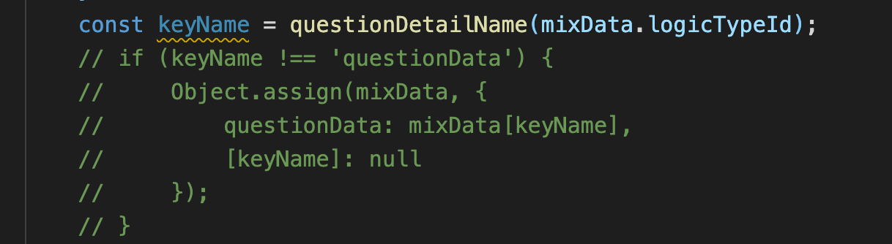

### 5. 切换代码块注释
与上面的快捷键不同，下面的快捷键会将选中的多行代码注释为单个注释。

+ **Windows/Linux** : shift + alt + A
+ **macOS** : shift + option + A

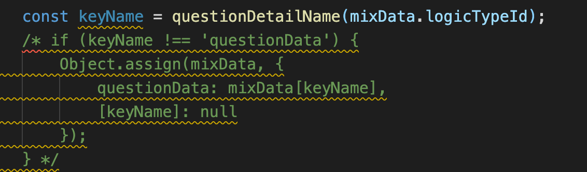

### 6. 代码格式
出于可读性的原因，保持代码指定的格式非常重要。Visual Studio Code 提供了两个用于代码格式化的快捷命令。

下面快捷键可以格式化整个文件中的代码：

+ **Windows/Linux** : ctrl + shift + F
+ **macOS** : option + shift + F

下面快捷键可以格式化已选中的代码：

+ **Windows/Linux** : ctrl + K，然后ctr l+ F
+ **macOS** : command + K，然后command + F

### 7. 快速修复错误
在很多情况下，如果出现一个常见或简单的错误，Visual Studio Code 可以直接修复它——例如缺少分号。如果快速修复可以使用，则此该快捷键可以快速修复错误或警告。

+ **Windows/Linux** : ctrl + .
+ **macOS** : command + .

### 8. 重命名
如果手动重命名多次使用的变量、函数或类就很容易出错。此快捷键提供了一种重命名任何符号的安全方法。

+ **Windows/Linux**：F2
+ **macOS**：F2 + fn

### 9. 删除空白
可以使用以下快捷键来删除多余的空行：

+ **Windows/Linux** : ctrl + K + X
+ **macOS** : command + K + X

注意：需要一直按着 ctrl 或 command 键，然后先按 K 键，再按 X 键。

### 10. 更改编程语言
默认情况下，Visual Studio Code 会检测正在处理的文件所用的编程语言。通常，它是通过检查文件的扩展名来完成的。但是，如果不支持文件的扩展名，就可能无法正确检测语言。因此，当需要更改文件的编程语言，可以使用此快捷键。

+ **Windows/Linux** : ctrl + K, 然后按M
+ **macOS** : command + K，然后按M

## 七、更好的编码
### 1. 转到定义
很多时候，我们需要了解正在使用的代码的定义是怎样的。比如调用一个函数时，想知道这个函数是如何定义的，就可以使用这个快捷键。

+ **Windows/Linux**：F12
+ **macOS**：F12 + fn

### 2. 查看定义
此快捷键可以在检查定义的地方打开定义。这样可以更轻松地查看定义，而无需切换到另一个文件或代码行。

+ **Windows/Linux** : alt + F12
+ **macOS** : option + F12 + fn

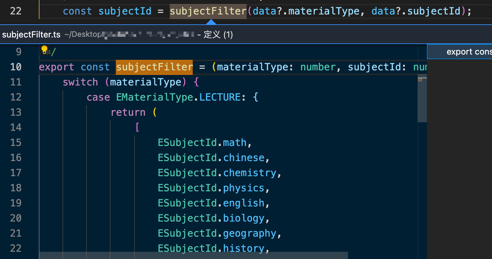

### 3. 切换建议
在编写代码时，VS Code 或者一些扩展会展示代码建议。此快捷键可以快速切换代码建议以查看或隐藏它们。

+ **Windows/Linux**: ctrl + I
+ **macOS** : command + I

VS Code 是目前最好用的代码编辑器之一。它提供了许多开箱即用的功能以及丰富的第三方扩展，在 VS Code 中使用快捷键可以使开发更加轻松，让我们可以专注于在更短的时间编写高质量的代码。本文介绍了一些实用的 Visual Studio Code 快捷键，希望能帮助你提高开发效率！

最后，附上在 Windows、Linux、macOS 系统中 VS Code 的快捷键：

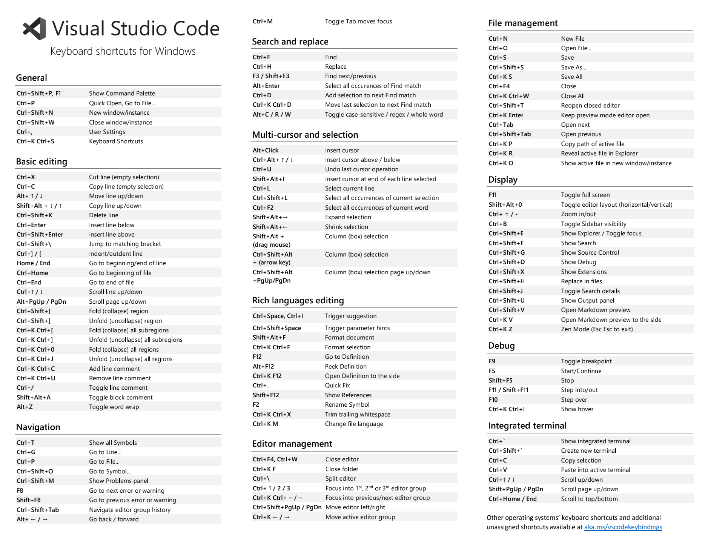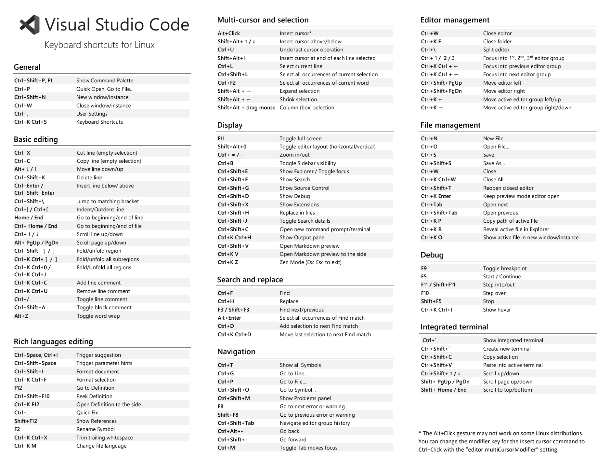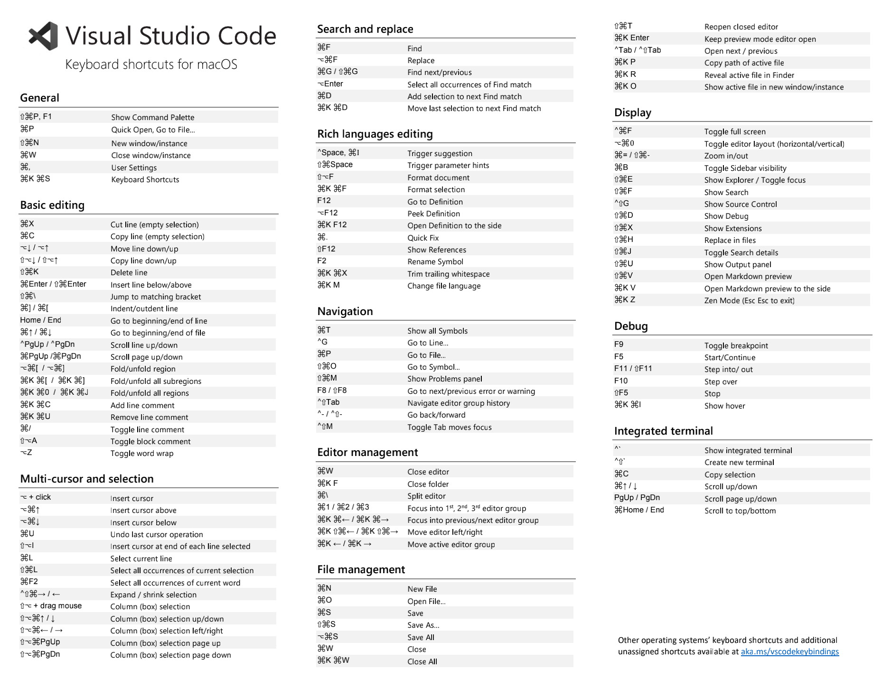

> 更新: 2024-06-12 16:42:25  
> 原文: <https://www.yuque.com/cuggz/feplus/swrd14>