# console 调试技巧

众所周知，浏览器的开发者工具为我们提供了强大的调试系统，可以用来查看DOM树结构、CSS样式调试、动画调试、JavaScript代码断点调试等。今天我们就来看看console调试的那些实用技巧。


如今，我们项目的开发通常会使用React、Vue等前端框架，前端调试也变得更加有难度，除了使用React Dev Tools，Vue Dev Tools等插件之外，我们使用最多的就是console.log()，当然多数情况下，console.log()就能满足我们的需求，但是当数据变得比较复杂时，console.log()就显得有些单一。其实console对象为我们提供了很多打印的方法，下面是console对象包含的方法（这里使用的是Chrome浏览器，版本为 95.0.4638.54（正式版本） (arm64)）：

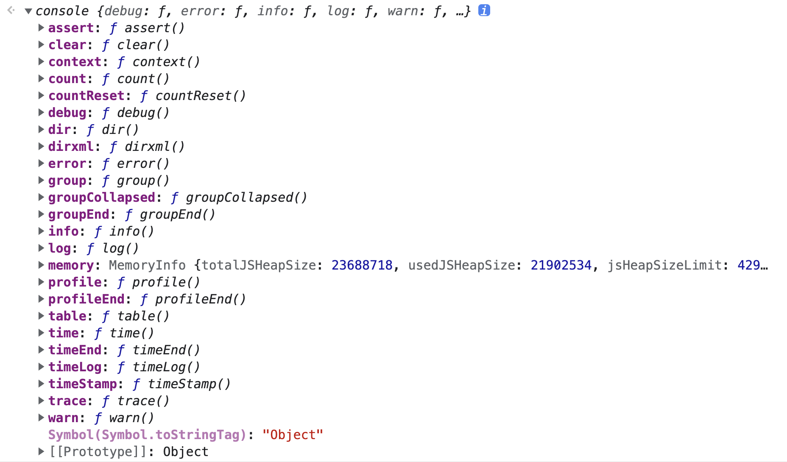

console 对象提供了浏览器控制台调试的接口，我们可以从任何全局对象中访问到它，如果你平时只是用console.log()来输出一些变量，那你可能没有用过console那些强大的功能。下面带你用console玩玩花式调试。

## 一、基本打印
### 1. console.log()
console.log()就是最基本、最常用的用法了。它可以用在JavaScript代码的任何地方，然后就可以浏览器的控制台中看到打印的信息。其基本使用方法如下：

```typescript
let name = "CUGGZ";
let age = 18;
console.log(name)                    // CUGGZ
console.log(`my name is: ${name}`)   // CUGGZ
console.log(name, age)               // CUGGZ 18
console.log("message:", name, age)   // message: CUGGZ 18
```

除此之外，console.log()还支持下面这种输出方式：

```typescript
let name = "CUGGZ";
let age = 18;
let height = 180;
console.log('Name: %s, Age: %d', name, age)     // Name: CUGGZ, Age: 18
console.log('Age: %d, Height: %d', age, height) // Age: 18, Height: 180
```

这里将后面的变量赋值给了前面的占位符的位置，他们是一一对应的。这种写法在复杂的输出时，能保证模板和数据分离，结构更加清晰。不过如果是简单的输出，就没必要这样写了。在console.log中，支持的占位符格式如下：

+ 字符串：%s
+ 整数：%d
+ 浮点数：%f
+ 对象：%o或%O
+ CSS样式：%c


可以看到，除了最基本的几种类型之外，它还支持定义CSS样式：

```typescript
let name = "CUGGZ";
console.log('My Name is %cCUGGZ', 'color: skyblue; font-size: 30px;') 
```

打印结果如下（好像并没有什么卵用）：

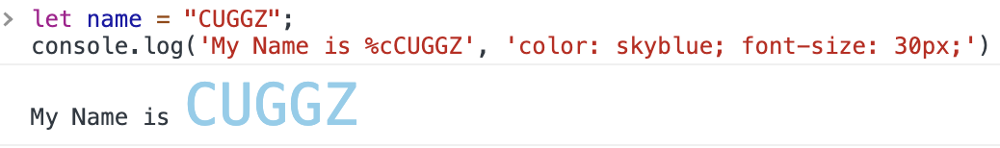

这个样式打印可能有用的地方就是打印图片，用来查看图片是否正确：

```typescript
console.log('%c ','background-image:url("http://iyeslogo.orbrand.com/150902Google/005.gif");background-size:120% 120%;background-repeat:no-repeat;background-position:center center;line-height:60px;padding:30px 120px;');
```

打印结果如下：

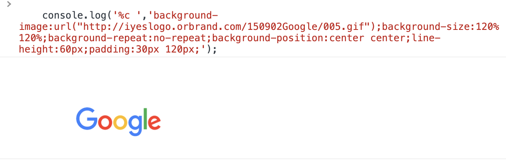

严格地说，console.log()并不支持打印图片，但是可以使用CSS的背景图来打印图片，不过并不能直接打印，因为是不支持设置图片的宽高属性，所以就需要使用line-heigh和padding来撑开图片，使其可以正常显示出来。


我们可以使用console.log()来打印字符画，就像知乎的这样：

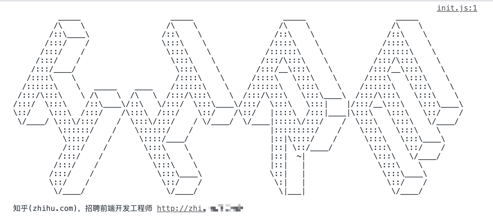

可以使用字符画在线生成工具，将生成的字符粘贴到console.log()即可。在线工具：[mg2txt](http://www.degraeve.com/img2txt.php)。我的头像生成效果如下，中间的就是生成的字符：


除此之外，可以看到，当占位符表示一个对象时，有两种写法：%c或者%C，那它们两个有什么区别呢？当我们指定的对象是普通的object对象时，它们两个是没有区别的，如果是DOM节点，那就有有区别了，来看下面的示例：

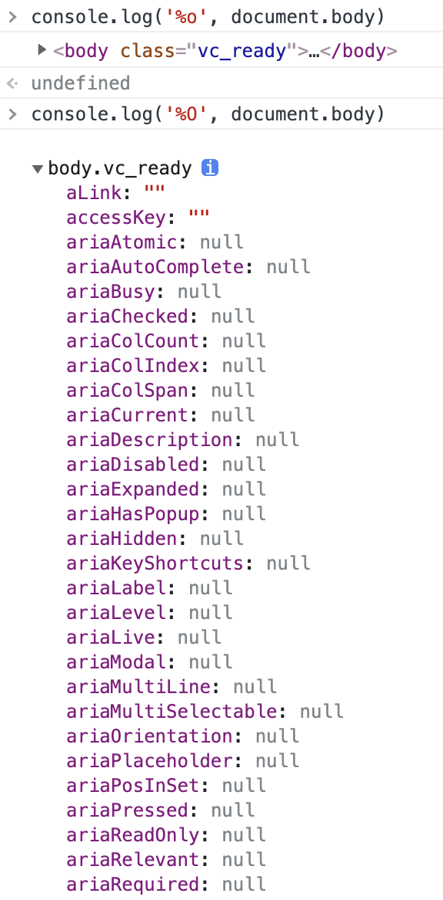

可以看到，使用 %o 打印的是DOM节点的内容，包含其子节点。而%O打印的是该DOM节点的对象属性，可以根据需求来选择性的打印。

### 2. console.warn()
console.warn() 方法用于在控制台输出警告信息。它的用法和console.log是完全一样的，只是显示的样式不太一样，信息最前面加一个黄色三角，表示警告：

```typescript
const app = ["facebook", "google", "twitter"];
console.warn(app);
```

打印样式如下：

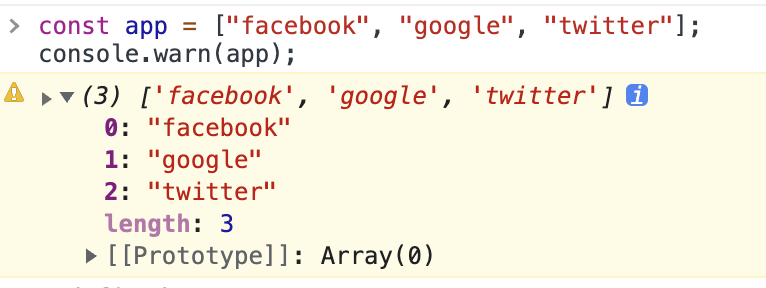

### 3. <font style="color:rgb(51, 51, 51);">console.error()</font>
console.error()可以用于在控制台输出错误信息。它和上面的两个方法的用法是一样的，只是显示样式不一样：

```typescript
const app = ["facebook", "google", "twitter"];
console.error(app);
```

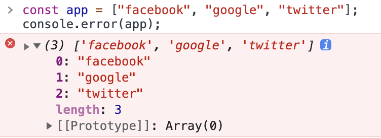

需要注意，console.exception() 是 console.error() 的别名，它们功能是相同的。


当然，console.error()还有一个console.log()不具备的功能，那就是打印函数的调用栈：

```typescript
function a() {
  b();
}
function b() {
  console.error("error");
}
function c() {
  a();
}
c();
```

打印结果如下：

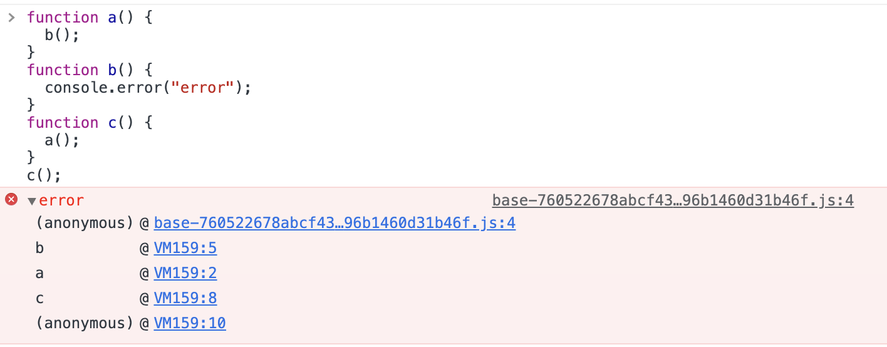

可以看到，这里打印出来了函数函数调用栈的信息：b→a→c。


console对象提供了专门的方法来打印函数的调用栈（console.trace()），这个下面会介绍到。

### 4. <font style="color:rgb(51, 51, 51);">console.info()</font>
console.info()可以用来打印资讯类说明信息，它和console.log()的用法一致，打印出来的效果也是一样的：

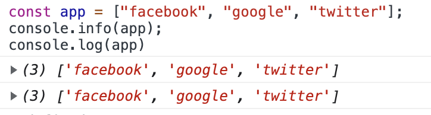

## 二、打印时间
### 1. console.time() & console.timeEnd()
如果我们想要获取一段代码的执行时间，就可以使用console对象的console.time() 和console.timeEnd()方法，来看下面的例子：

```typescript
console.time();

setTimeout(() => {
	console.timeEnd();
}, 1000);

// default: 1001.9140625 ms
```

它们都可以传递一个参数，该参数是一个字符串，用来标记唯一的计时器。如果页面只有一个计时器时，就不需要传这个参数 ，如果有多个计时器，就需要使用这个标签来标记每一个计时器：

```typescript
console.time("timer1");
console.time("timer2");

setTimeout(() => {
	console.timeEnd("timer1");
}, 1000);

setTimeout(() => {
	console.timeEnd("timer2");
}, 2000);

// timer1: 1004.666259765625 ms
// timer2: 2004.654052734375 ms
```

### 2. console.timeLog()
这里的console.timeLog()上面的console.timeEnd()类似，但是也有一定的差别。他们都需要使用console.time()来启动一个计时器。然后console.timeLog()就是打印计时器**当前的时间**，而console.timeEnd()是打印计时器，直到结束的时间。下面来看例子：

```typescript
console.time("timer");

setTimeout(() => {
    console.timeLog("timer")
		setTimeout(() => {
	    console.timeLog("timer");
    }, 2000);
}, 1000);

// timer: 1002.80224609375 ms
// timer: 3008.044189453125 ms
```

而使用console.timeEnd()时：

```typescript
console.time("timer");

setTimeout(() => {
  console.timeEnd("timer")
	setTimeout(() => {
	    console.timeLog("timer");
    }, 2000);
}, 1000);
```

打印结果如下：

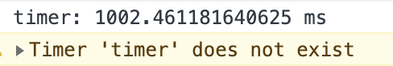

可以看到，它会终止当前的计时器，所以里面的timeLog就无法在找到timer计数器了。

所以两者的区别就在于，是否会终止当前的计时。

## 三、分组打印
### 1. console.group() & console.groupEnd()
这两个方法用于在控制台创建一个信息分组。 一个完整的信息分组以 console.group() 开始，console.groupEnd() 结束。来看下面的例子：

```typescript
console.group();
console.log('First Group');
console.group();
console.log('Second Group')
console.groupEnd();
console.groupEnd();
```

打印结果如下：

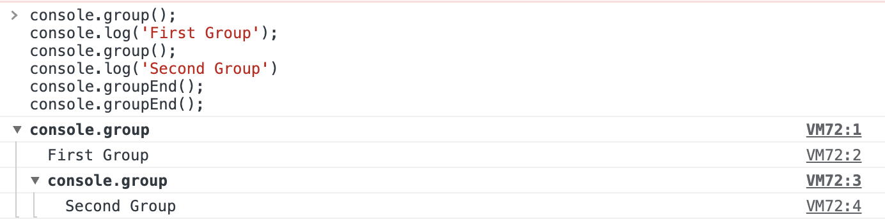

再来看一个复杂点的：

```typescript
console.group("Alphabet")
  console.log("A");
  console.log("B");
  console.log("C");
  console.group("Numbers");
    console.log("One");
    console.log("Two");
  console.groupEnd("Numbers");
console.groupEnd("Alphabet");
```

打印结果如下：

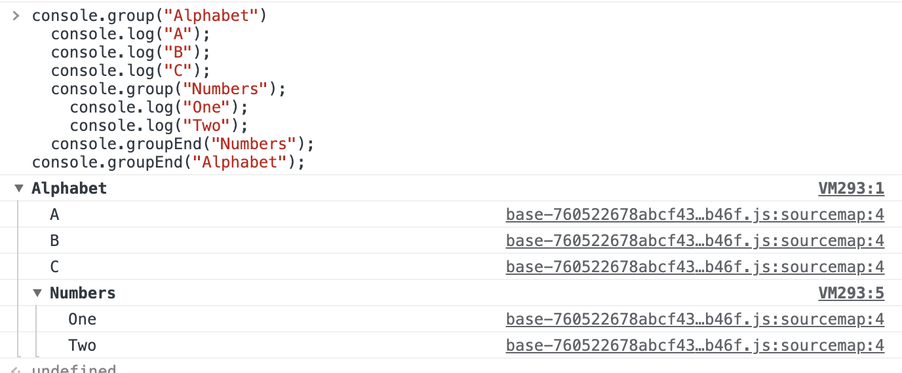

可以看到，这些分组是可以嵌套的。当前我们需要调试一大堆调试输出，就可以选择使用分组输出，

### 2. console.groupCollapsed()
console.groupCollapsed()方法类似于console.group()，它们都需要使用console.groupEnd()来结束分组。不同的是，该方法默认打印的信息是折叠展示的，而group()是默认展开的。来对上面的例子进行改写：

```typescript
console.groupCollapsed("Alphabet")
  console.log("A");
  console.log("B");
  console.log("C");
  console.groupCollapsed("Numbers");
    console.log("One");
    console.log("Two");
  console.groupEnd("Numbers");
console.groupEnd("Alphabet");
```

其打印结果如下：

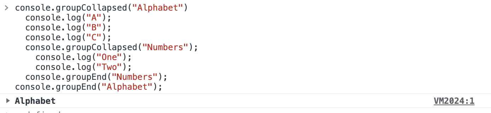

可以看到，和上面方法唯一的不同就是，打印的结果被折叠了，需要手动展开来看。

## 四、打印计次
### 1. console.count()
可以使用使用console.count()来获取当前执行的次数。来看下面的例子：

```typescript
for (i = 0; i < 5; i++) {
    console.count();
}

// 输出结果如下
default: 1
default: 2
default: 3
default: 4
default: 5
```

它也可以传一个参数来进行标记（如果为空，则为默认标签default）：

```typescript
for (i = 0; i < 5; i++) {
    console.count("hello");
}

// 输出结果如下
hello: 1
hello: 2
hello: 3
hello: 4
hello: 5
```

这个方法主要用于一些比较复杂的场景，有时候一个函数被多个地方调用，就可以使用这个方法来确定是否少调用或者重复调用了该方法。

### 2. console.countReset()
顾名思义，console.countReset()就是重置计算器，它会需要配合上面的console.count()方法使用。它有一个可选的参数label：

+ 如果提供了参数label，此函数会重置与label关联的计数，将count重置为0。
+ 如果省略了参数label，此函数会重置默认的计数器，将count重置为0。

```typescript
console.count(); 
console.count("a"); 
console.count("b"); 
console.count("a"); 
console.count("a"); 
console.count(); 
console.count(); 
  
console.countReset(); 
console.countReset("a"); 
console.countReset("b"); 
  
console.count(); 
console.count("a"); 
console.count("b");
```

打印结果如下：

```typescript
default:1
a:1
b:1
a:2
a:3
default:2
default:3
default:1
a:1
b:1
```

## 五、其他打印
### 1. console.table()
我们平时使用console.log较多，其实console对象还有很多属性可以使用，比如console.table()，使用它可以方便的打印数组对象的属性，打印结果是一个表格。console.table() 方法有两个参数，第一个参数是需要打印的对象，第二个参数是需要打印的表格的标题，这里就是数组对象的属性值。来看下面的例子：

```typescript
const users = [ 
   { 
      "first_name":"Harcourt",
      "last_name":"Huckerbe",
      "gender":"Male",
      "city":"Linchen",
      "birth_country":"China"
   },
   { 
      "first_name":"Allyn",
      "last_name":"McEttigen",
      "gender":"Male",
      "city":"Ambelókipoi",
      "birth_country":"Greece"
   },
   { 
      "first_name":"Sandor",
      "last_name":"Degg",
      "gender":"Male",
      "city":"Mthatha",
      "birth_country":"South Africa"
   }
]

console.table(users, ['first_name', 'last_name', 'city']);
```

打印结果如下：

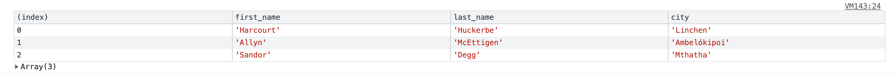

通过这种方式，可以更加清晰的看到数组对象中的指定属性。


除此之外，还可以使用console.table()来打印数组元素：

```typescript
const app = ["facebook", "google", "twitter"];
console.table(app);
```

打印结果如下：

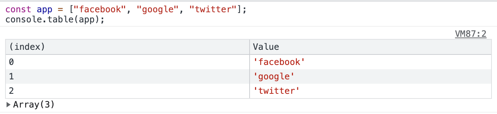

通过这种方式，我们可以更清晰的看到数组中的元素。


需要注意，console.table() 只能处理最多1000行，因此它可能不适合所有数据集。但是也能适用于多数场景了。

### 2. <font style="color:rgb(51, 51, 51);">console.clear()</font>
<font style="color:rgb(51, 51, 51);">console.clear() 顾名思义就是清除控制台的信息。当清空控制台之后，会打印一句：“Console was clered”:</font>

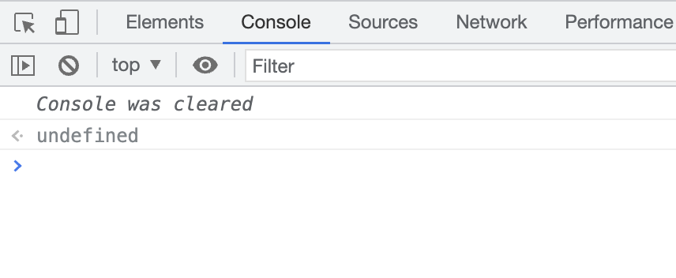

当然，我们完全可以使用控制台的清除键清除控制台：

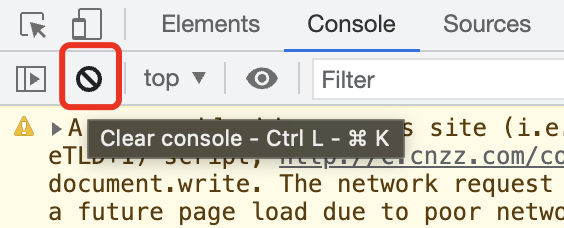

### 3. console.assert()
console.assert()方法用于语句断言，当断言为 false时，则在信息到控制台输出错误信息。它的语法如下：

```typescript
console.assert(expression, message)
```

它有两个参数：

+ expression: 条件语句，语句会被解析成 Boolean，且为 false 的时候会触发message语句输出；
+ message: 输出语句，可以是任意类型。

<font style="color:rgb(34, 34, 34);"></font>

该方法会在expression条件语句为false时，就会打印message信息。当在特定情况下才输出语句时，就可以使用console.assert()方法。


比如，当列表元素的子节点数量大于等于100时，打印错误信息：

```typescript
console.assert(list.childNodes.length < 100, "Node count is > 100");
```

其输出结果如下图所示：

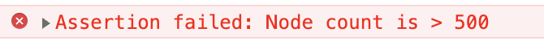

### 4. console.trace()
console.trace()方法可以用于打印当前执行的代码在堆栈中的调用路径。它和上面的console.error()的功一致，不过打印的样式就和console.log()是一样的了。来看下面的例子：

```typescript
function a() {
  b();
}
function b() {
  console.trace();
}
function c() {
  a();
}
c();
```

打印结果如下：

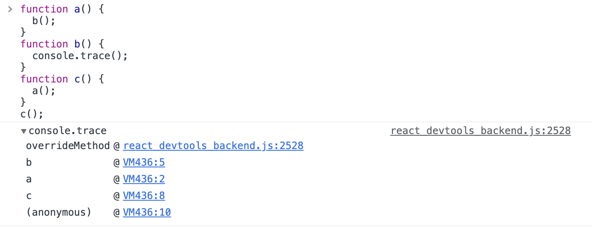

 可以看到，这里输出了调用栈的信息：b→a→c，这个堆栈信息是从调用位置开始的。

### 5. console.dir()
console.dir()方法可以在控制台中显示指定JavaScript对象的属性，并通过类似文件树样式的交互列表显示。它的语法如下：

```typescript
console.dir(object);
```

它的参数是一个对象，最终会打印出该对象所有的属性和属性值。


在多数情况下，使用consoledir()和使用console.log()的效果是一样的。但是当打印元素结构时，就会有很大的差异了，console.log()打印的是元素的DOM结构，而console.dir()打印的是元素的属性：

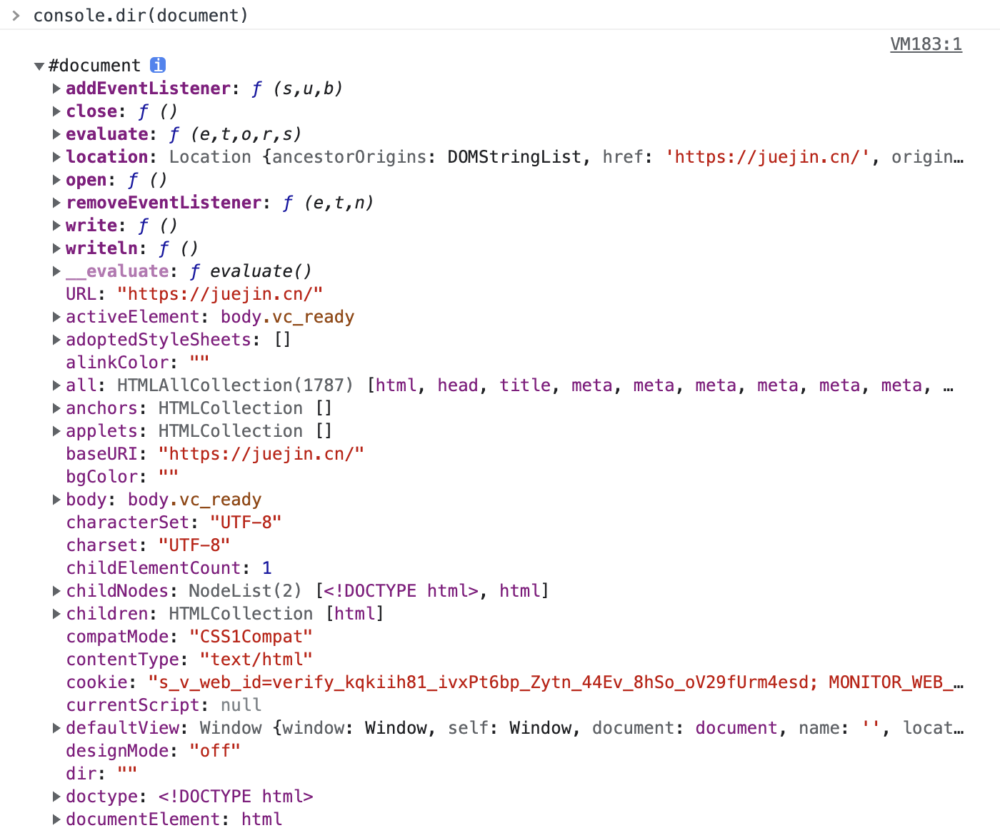

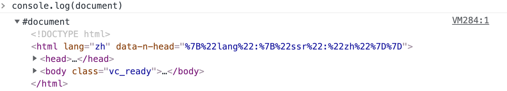

### 6. console.dirxml()
console.dirxml()方法用于显示一个明确的XML/HTML元素的包括所有后代元素的交互树。 如果无法作为一个element被显示，那么会以JavaScript对象的形式作为替代。 它的输出是一个继承的扩展的节点列表，可以让你看到子节点的内容。其语法如下：

```typescript
console.dirxml(object);
```

该方法会打印输出XML元素及其后代元素，对于XML和HTML元素调用console.log()和console.dirxml()是等价的。

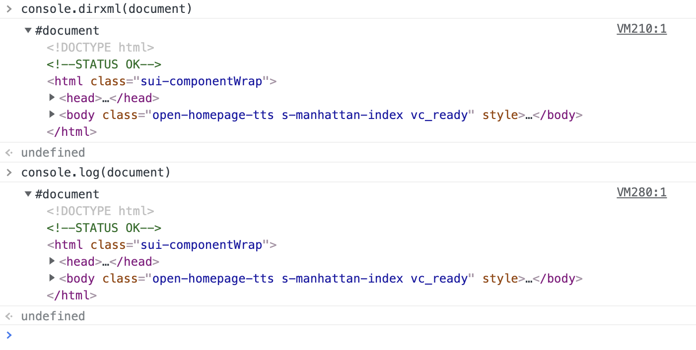

### 7. console.memory
console.memory是console对象的一个属性，而不是一个方法。它可以用来查看当前内存的使用情况，如果使用过多的console.log()会占用较多的内存，导致浏览器出现卡顿情况。

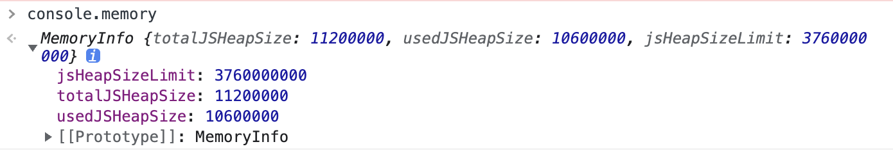


> 更新: 2022-01-27 17:01:29  
> 原文: <https://www.yuque.com/cuggz/feplus/hw0zzw>