# npm 使用技巧

今天总结了 npm 常用的一些命令分享给大家，希望对你有所帮助！

### 1. npm 基本概念

npm 全称为 Node Package Manager，是一个基于 Node.js 的包管理器，也是 Node.js 社区最流行、支持的第三方模块最多的包管理器。它的初衷就是让开发人员更容易分享和重用代码。npm 提供了命令行工具，其主要功能是管理Node.js包，包括安装、更新、删除、查看、搜索、发布等。

npm 最初只是Node.js 的包管理器，但随着前端技术的不断发展，它的定位变成了广义的包管理器，可以实现JavaScript、React、Vue、Gulp、移动开发等包管理，是目前最大、生态最为健全的包管理器。

npm 能解决 Node.js 在模块管理上的很多问题，其常见的应用场景如下：

* 从npm镜像服务器下载第三方模块；
* 从npm镜像服务器下载并安装命令行程序到本地；
* 自己发布模块到npm镜像服务器供他人使用。

npm 不需要单独安装，在安装 Node.js 时，就会连带着一起安装 npm 了。但是安装的 npm 不一定是最新的版本，可以使用以下命令来查看本地 npm 的版本：

```javascript
npm -v
```

这里的 -v 是 --version 的缩写，表示版本。如果想升级 npm 版本，可以使用以下命令：

```javascript
npm install npm@latest -g
```

这里@latest表示最新的版本，-g 是 --global 的缩写，表示全局安装。

除此之外，还可以使用help命令来查看npm帮助：

```javascript
npm 命令 --help
```

比如查看 install 的参数形式：

```javascript
npm install --help
```

其中--help可以简写为-h，上面命令的执行结果如下，可以看到install命令的很多形式：

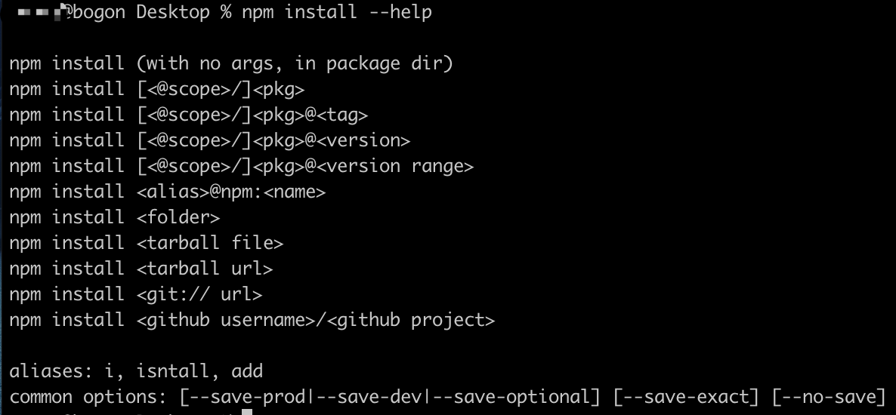

常见的npm命令：

| **命令** | **作用** |
| :---: | --- |
| npm -v | 查看 npm 版本。 |
| npm init | 初始化后会出现一个 package.json 配置文件。可以在后面加上 -y ，快速跳过问答式界面。 |
| npm install | 根据项目中的 package.json 文件自动下载项目所需的全部依赖。 |
| npm install 包名 --save-dev(npm install 包名 -D) | 安装的包只用于开发环境，不用于生产环境，会出现在 package.json 文件中的 devDependencies 属性中。 |
| npm install 包名 --save(npm install 包名 -S) | 安装的包需要发布到生产环境的，会出现在 package.json 文件中的 dependencies 属性中。 |
| npm list | 查看当前目录下已安装的 node 包。 |
| npm list -g | 查看全局已经安装过的 node 包。 |
| npm --help | 查看 npm 帮助命令。 |
| npm update 包名 | 更新指定包。 |
| npm uninstall 包名 | 卸载指定包。 |
| npm config list | 查看配置信息。 |
| npm 指定命令 --help | 查看指定命令的帮助。 |
| npm info 指定包名 | 查看远程 npm 上指定包的所有版本信息。 |
| npm config set registry https://registry.npm.taobao.org	 | 修改包下载源，这里修改为了淘宝镜像。 |
| npm root | 查看当前包的安装路径。 |
| npm root -g | 查看全局的包的安装路径。 |
| npm ls 包名 | 查看本地安装的指定包及版本信息，没有显示 empty。 |
| npm ls 包名 -g | 查看全局安装的指定包及版本信息，没有显示 empty。 |

说完这些概念，下面就来看看 npm 在使用时有哪些实用的技巧。

### 2. 初始化 package

凡是使用npm管理的项目，都需要初始化一个package.json文件。

可以使用以下命令来初始化一个包：

```javascript
npm init
```

当执行这个命令时，它会通过问答的形式来一步步进行设置。如果不需要修改默认的配置，直接一路回车即可。如果想跳过向导，快速生成一个package.json 文件，可以执行以下命令：

```javascript
npm init --yes
```

其中，--yes可以简写为-y。这时生成的package.json文件的配置项就是 npm 的默认配置。当然这个默认配置也是可以更改的，可以通过类似下面这样的形式来修改 npm 的默认配置：

```javascript
npm config set init.author.name YOUR_NAME  
npm config set init.author.email YOUR_EMAIL  
```

当执行以上命令之后，之后再执行 npm init 命令时，package.json 的作者姓名和邮箱都会初始化为我们设定的值。

### 2. 快速了解 package

当要使用一个包时，如果想要了解它是如何使用的，可以使用以下命令来打开这个包的主页，它会自动启动浏览器并打开这个页面，这里以React为例：

```javascript
npm home react
```

如果想要查看这个包现存的issue，或者<font style="color:rgb(33, 37, 41);">公开的roadmap，可以执行以下命令：</font>

```javascript
npm bugs react
```

如果想要查看这个包的代码地址，可以执行以下命令：

```javascript
npm repo react
```

如果想要查看这个包的详细信息，可以执行以下命令：

```javascript
npm info react
```

执行结果如下：

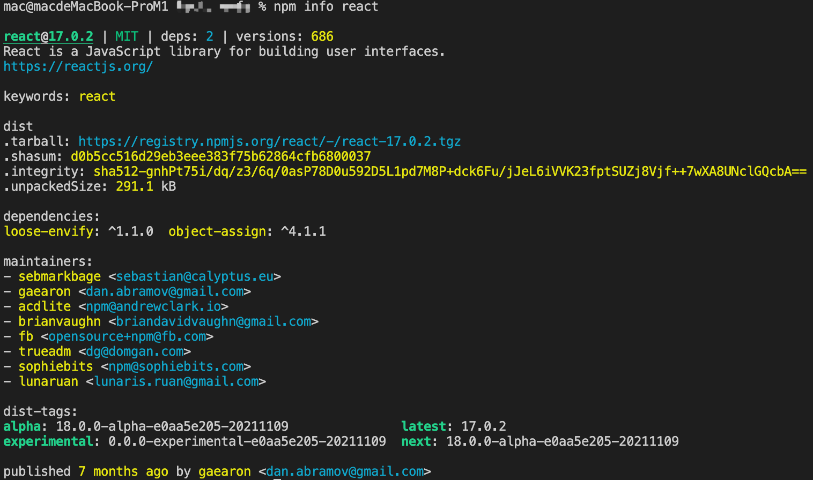

这里返回的是一个JavaScript对象，里面包含react模块的详细信息，可以通过info命令来获取这个对象的成员信息：

```typescript
npm info react description
```

执行结果如下：

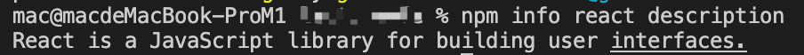

### 3. 安装依赖

可以使用npm install命令来安装需要的包，如果想把这个包自动添加到package.json中，可以执行以下命令，这里以安装React为例：

```javascript
npm install react --save
```

如果想要安装不同版本的包，可以这样：

```javascript
// 安装最新版本
npm install react@latest
// 安装指定版本
npm install react@16.8.0
// 安装指定区间版本
npm install react@">=16.8.0 <17.0.1"
```

当使用npm安装依赖时，分为本地安装（local）和全局安装（global），它俩的区别就是是否包含-g参数：

| **命令** | **简写** | **说明** |
| :---: | :---: | --- |
| 无 | 无 | 将模块安装到本地node\_modules目录下，但不保存在package.json中。 |
| --save | -S | 将模块安装到本地node\_modules目录下，同时保存到package.json中的dependencies配置项中，<font style="color:rgb(0, 0, 0);">在生产环境下这个包的依赖依然存在</font>。 |
| --sava-dev | -D | 将模块安装到本地node\_modules目录下，同时保存到package.json中的devDependencies配置项中，仅供开发时使用。 |
| --global | -g | 安装的模块为全局模块，如果命令行模块，会直接链接到环境变量中。 |

可以使用require关键字来引入本地安装的包。为了避免引用模块消失，保证依赖模块都会出现在package.json中，最好在npm install 时加上--save。

需要注意，在执行npm install命令时，npm 5 之前只会下载，不会保存依赖信息。如果需要保存，就需要加上 --save 选项， npm 5 以后就可以省略 --save 选项了，它会自动保存。

### 4. 锁定依赖

当使用--save来安装依赖时，npm 会把这个依赖保存起来，并添加^前缀，他表示，当再次执行 npm install 命令时，会自动安装这个包在此大版本下的最新版本。如果想要修改这个功能，可以执行以下命令：

```javascript
npm config set save-prefix='~'
```

执行完该命令之后，就会把^符号改为~符号。当再次安装新模块时，就从只允许小版本的升级变成了只允许补丁包的升级。

如果想要锁定当前的版本，可以执行以下命令：

```javascript
npm config set save-exact true
```

这样每次 npm install xxx --save 时就会锁定依赖的版本号，相当于加了 --save-exact 参数。建议线上的应用都采用这种锁定版本号的方式。

为了彻底的锁定依赖的版本，让应用在任何机器上都安装同样的版本，可以执行以下命令：

```javascript
npm shrinkwrap
```

执行这个命令之后，就会在项目的根目录产生一个npm-shrinkwrap.json配置文件，这里面包含了通过node\_modules 计算出的模块的依赖树及版本。只要目录下有 npm-shrinkwrap.json 则运行 npm install 时就会优先使用 npm-shrinkwrap.json 中的配置进行安装，没有则使用 package.json 进行安装。

### 5. 搜索依赖

npm 为我们提供了search 命令，用于搜索npm仓库，它搜索的参数可以是一个字符串，也可以是一个正则表达式：

```javascript
npm search react
```

搜索结果如下：

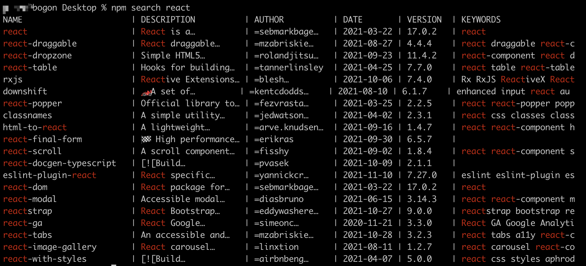

当然，我们也可以去node.js官网去找：<https://www.npmjs.com/>

想要找到一个合适的依赖包可能并不是一件容易的事。这时，可以使用网站<https://npms.io/>，这里将各个包的质量、受欢迎度、可维护性等指标做了量化。这些指标包括：是否使用了过时的依赖包、是否有代码检查配置、是否经过测试以及最近的版本是何时发布的等。

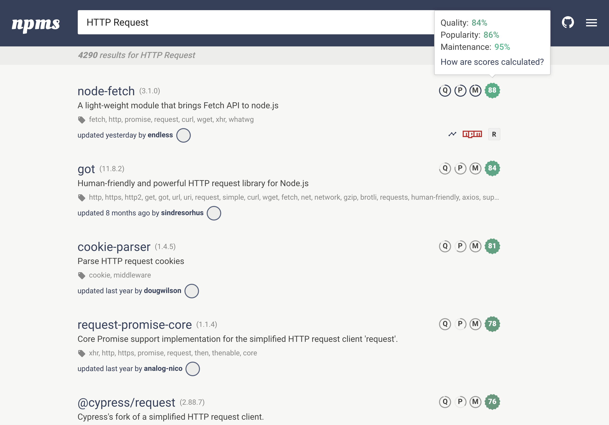

不过，更直接方法可能就是去搜索引擎看别人的推荐了~

### 6. 更新、卸载依赖

npm 为我们提供了更新依赖版本的命令：

```javascript
npm update [package name]
```

如果想要更新全局安装的模块，需要添加参数 -global：

```javascript
npm update -global [package name]
```

当执行这两个命令时，它会先到远程仓库查询最新版本，然后查询本地版本。如果本地版本不存在，或者远程版本较新，就会安装。

如果想要更新该依赖包在package.json中的版本，就需要使用-S或者--save参数。需要注意的是，从npm v2.6.1 开始，npm update只会更新顶层的模块，而不更新依赖的依赖模块，而之前的版本是递归更新的。如果想要这种效果，可以使用以下命令：

```javascript
npm --depth 9999 update
```

除了可以更新包之外，还可以删除指定的包：

```javascript
npm uninstall [package name]
```

如果想要删除全局的包，需要添加参数 -global：

```javascript
npm uninstall [package name] -global
```

### 7. 查找过时的包

npm 提供了一个命令来查看过时的依赖：

```javascript
npm outdated
```

在我的项目中执行该命令，输出结果如下：

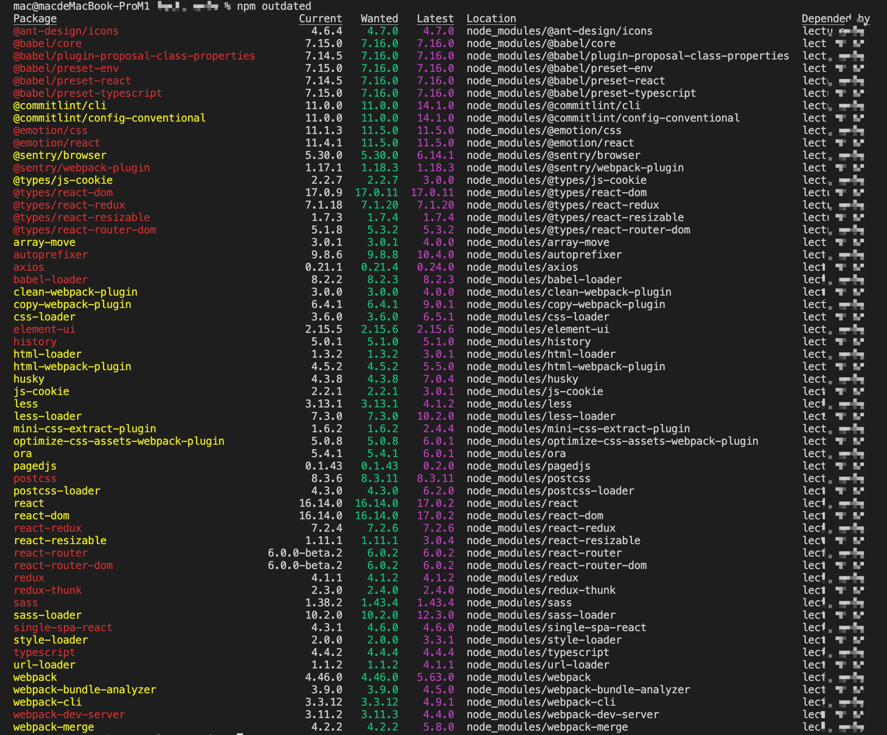

可以看到，这里列出了过时依赖的包名称、当前的版本、希望的版本、最新的版本、依赖在本地路径、依赖这个包的项目名称。

可以通过以下命令来检查npm包的最新版本：

```javascript
// 展示包的信息
npm view <package-name>  
npm v <package-name>
// 展示最新版本
npm v <package-name> version
// 展示所有版本
npm v <package-name> versions
```

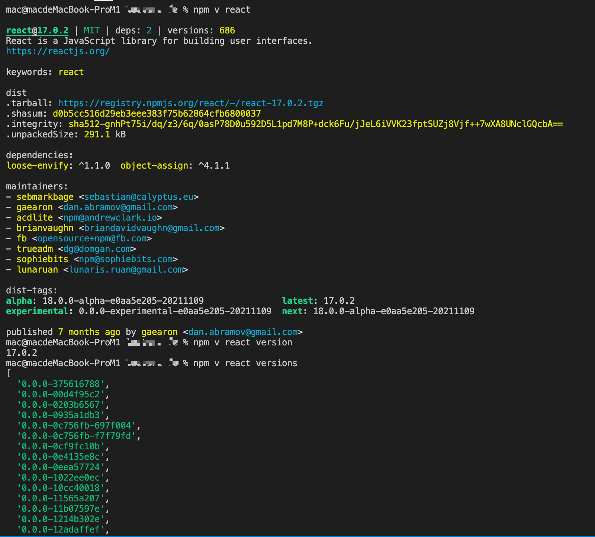

### 8. 执行脚本

npm 不仅可以用于管理模块，还可以用于执行脚本。在package.json文件中有一个scripts字段，可以用于定义脚本命令，功npm 使用。我们除了可以在package.json文件中查看有哪些命令，也可以使用以下命令来查看所有脚本命令：

```javascript
npm run
```

我的项目中执行该命令之后的结果如下：

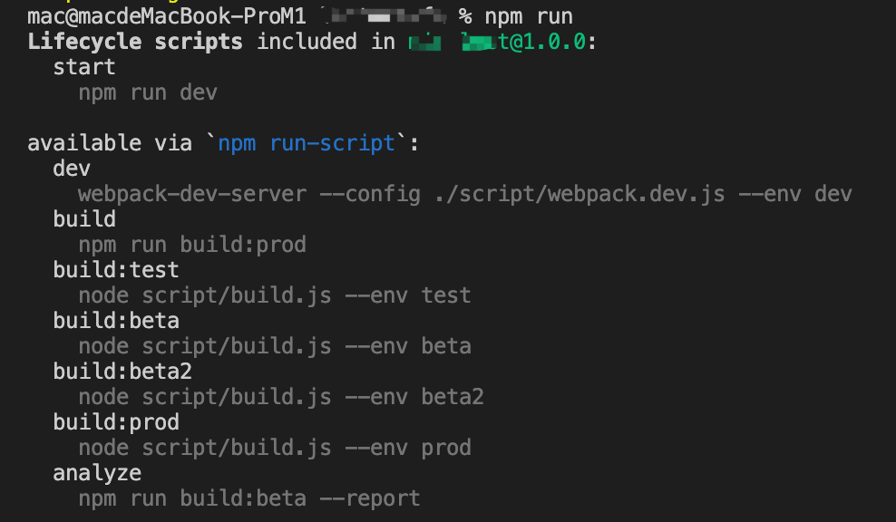

可以看到，这里定义了dev、build、build:test等命令，如果需要执行这些命令，只要这样执行即可：

```typescript
npm run dev
npm run build
```

这里不在多说，这或许是我们平时用的最多的命令了，可以根据实际开发情况，来定制自己的npm命令。

### 9. 安装可靠的依赖

可以使用 npm ci 命令来清理、安装依赖项。它通常用于CI/CD等自动化环境，使用它可以获得可靠的依赖。

```typescript
npm ci
```

当执行该命令时，它会先删除本地的node\_modules文件，因此它不需要去校验已下载文件版本与控制版本的关系，也不用校验是否存在最新版本的库，所以下载的速度相比npm install会更快。之后它会按照 package-lock.json 文件来安装确切版本的依赖项。并且不会将这个版本写入package.json或者package-lock.json文件。

使用该命令时，需要注意：

* 项目必需有 package-lock.json 或 npm-shrinkwrap.json 文件，如果没有，该命令将不起作用；
* npm ci 是 npm v6 中引入了的新命令，所以使用该命令时需要确保npm版本要>=5.7；
* npm ci 不能用来安装单个依赖，只能用来安装整个项目的依赖；
* npm ci 会安装 dependencies 和 devDependencies；
* 整个安装过程不会更新 package.json 或 package-lock.json 文件，整个安装过程是锁死的；
* 当package-lock.json中的依赖和package.json中不一致时，npm ci 会退出但不会修改package-lock.json文件。

### 10. 删除重复的包

我们可以通过运行npm dedupe命令来删除重复的依赖项。该命令通过删除重复包并在多个依赖包之间共享公共依赖项来简化整体的结构。它会产生一个扁平的、去重的树。

```javascript
npm dedupe
npm ddp
```

### 11. 扫描漏洞

可以运行 npm audit 命令来扫描项目，来查找所有依赖项中存在的漏洞：

```javascript
npm audit
```

来看我的项目扫描结果：

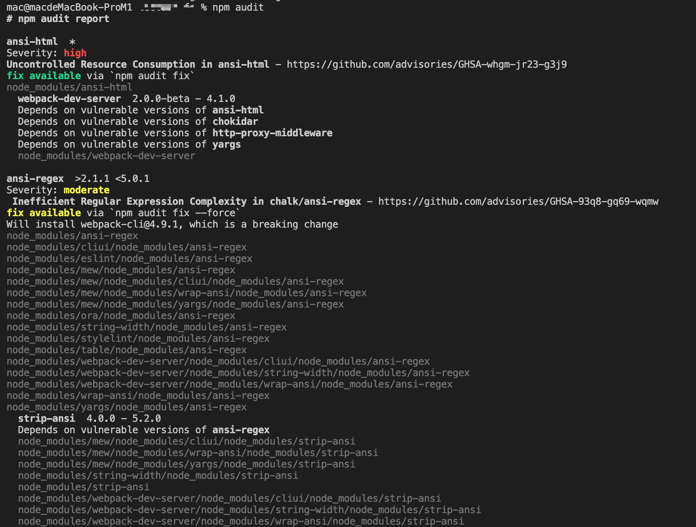

可以运行以下命令来自动安装所有易受攻击包的补丁版本：

```javascript
npm audit fix
```

### 12. 列举已安装的包

可以通过以下命令来获取整个项目的包信息：

```javascript
npm list
```

npm list命令以树型结构列出当前项目安装的所有模块，以及它们依赖的模块。

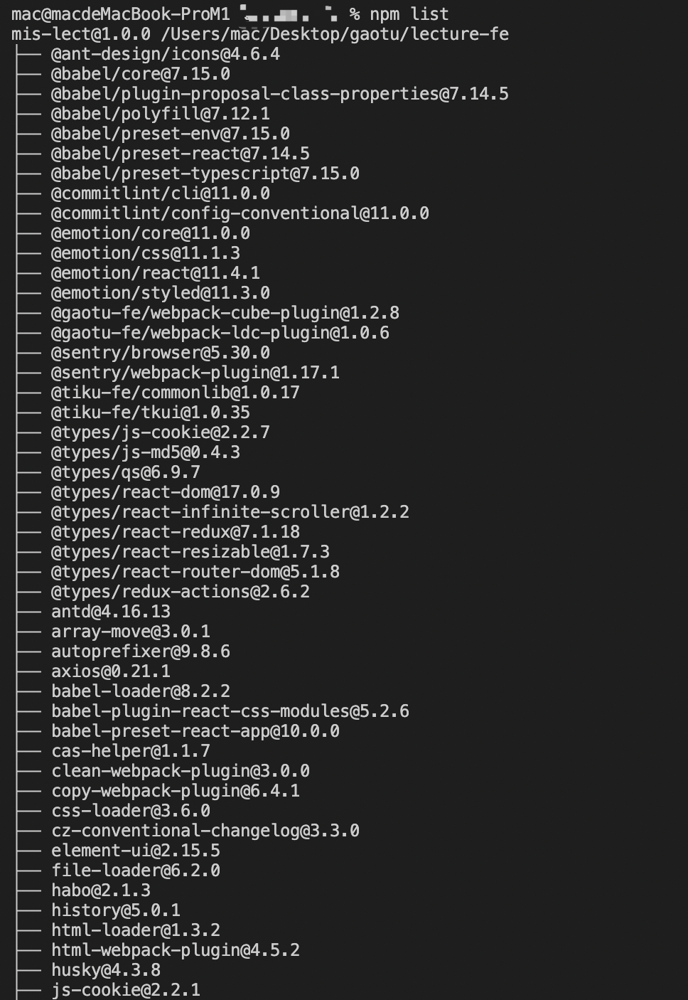

如果加上global参数，就会列出全局安装的模块：

```javascript
npm list -global
```

也可以查看指定包的依赖，比如在我现在做的项目下，执行以下命令：

```javascript
npm list react
```

还可以使用npm ls 命令来查看指定包的依赖信息：

```typescript
npm ls react
```

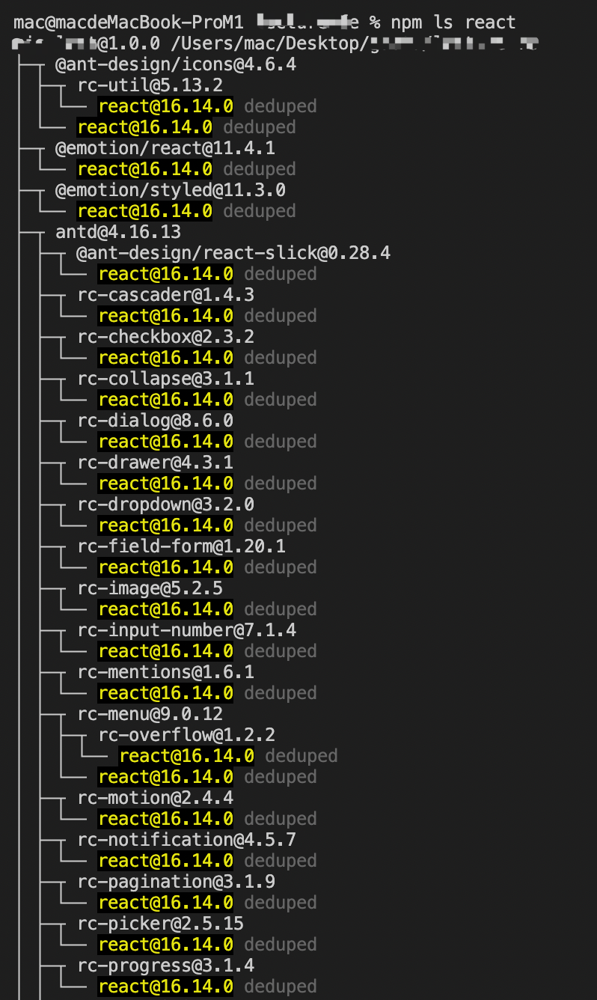

可以使用--depth参数来限制搜索的深度：

```typescript
npm ls --depth=1
```

### 13. 测试本地包

当我们在本地开发npm模块时，可以使用npm link命令来将本地的npm模块连接到对用的项目中去，便于对模块进行调试和测试。使用方式也很简单，在项目中执行以下命令：

```javascript
npm link
```

执行完该命令之后，就会为这个npm包创建到全局，路径是<code><font style="color:rgb(33, 37, 41);"> {prefix}/lib/node_modules/<package></font></code>，它是一个快捷方式。之后我们就可以使用以下命令来在需要这个模块的项目中链接这个包：

```javascript
npm link 模块名
```

这里的**模块名**就是依赖包的名称，也就是模块包的package.json文件中的name字段值。

如果不想继续使用了，执行以下命令来解除link即可：

```javascript
npm unlink 模块名
```

[此处为语雀卡片，点击链接查看](https://www.yuque.com/cuggz/feplus/gvgbgy#Xt0pd)


> 更新: 2024-01-22 22:01:44  
> 原文: <https://www.yuque.com/cuggz/feplus/gvgbgy>