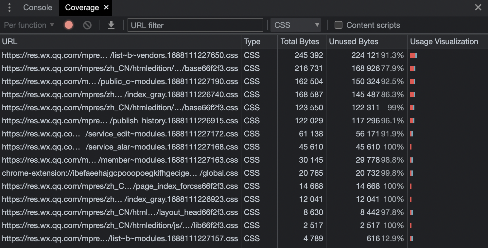
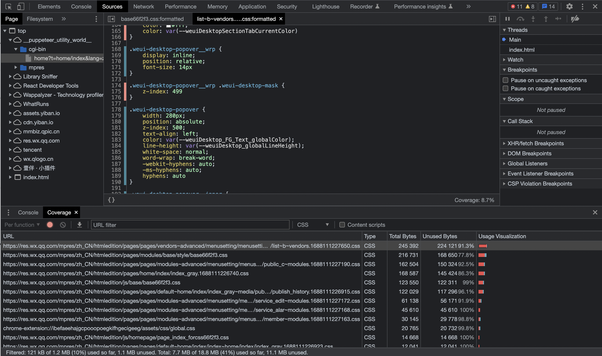

# 删除未使用的CSS代码

当构建前端应用时，随着项目的不断迭代，就可能出现一些 CSS 代码未使用的情况。这样的未使用代码就可能影响页面的性能。

那么，如何有效地删除未使用的 CSS 代码呢？本文将介绍一种强大的工具——PurgeCSS，它可以自动检测和删除未使用的 CSS 代码。无论是在 Vue、React 还是其他前端框架中，PurgeCSS 都能轻松集成并帮助优化项目。

接下来，让我们一起探索如何配置和使用 PurgeCSS，以及一些高级配置选项，帮助我们根据项目需求定制删除未使用的 CSS 代码的过程。

## 未使用的 CSS

使用 Chrome 浏览器的 Coverage 面板，就可以看到当前页面所有CSS 文件的使用情况（打开Coverage面板方式：Ctrl+Shift+P，搜索 Coverage）：



这里显示了每个文件的总大小、未使用的CSS 的大小、未使用的 CSS 所占比例。可以看到，文件中未使用的 CSS 占大多数。

点开一个文件，就可以看到这个文件中有哪些样式使用了（蓝色），有哪些样式未使用（红色）：



默认情况下，浏览器必须下载、解析和处理它遇到的所有外部样式表，然后才能将内容渲染到用户屏幕。每个外部样式表都必须从网络下载。这些额外的网络任务会显着增加用户在屏幕上看到任何内容之前必须等待的时间。

未使用的 CSS 还会减慢浏览器构建渲染树的速度。渲染树类似于 DOM 树，不同之处在于它还包含每个节点的样式。要构建渲染树，浏览器必须遍历整个 DOM 树，并检查哪些 CSS 规则适用于每个节点。未使用的 CSS 越多，浏览器可能需要花费更多的时间来计算每个节点的样式。

## PurgeCSS 是什么？

PurgeCSS 是一个用于删除未使用的 CSS 的工具。它对于优化应用通常很有用。当使用 Bulma、Bootstrap 或 Tailwind 等 CSS 框架时，就会有很多未使用的 CSS。这就是 PurgeCSS 的用武之地。它会分析内容和 CSS 文件，以确定哪些样式未使用，并将其删除。PurgeCSS 可以与最常见的 JavaScript 库/框架配合使用，例如 Vue.js、React、Gatsby 等。

虽然 PurgeCSS 并不是删除未使用的 CSS 的唯一工具，但它因其模块化、易用性和广泛的自定义选项而脱颖而出。 模块化使开发人员能够为特定用例和框架创建模块提取器。 提取器是读取文件内容并提取所使用的 CSS 选择器列表的函数。

PurgeCSS 提供了一个非常可靠的默认提取器，可以处理多种文件类型。 但是，默认情况下，PurgeCSS 会忽略包含 `@`、`:`和 `/` 等特殊字符的未使用 CSS 代码。因此，PurgeCSS 可能无法完全适配你正在使用的文件类型或 CSS 框架。

此外，PurgeCSS 还有很多配置项，可以根据需求自定义其行为。例如，PurgeCSS 包括针对 `fontFace`、`keyframes`、`extractors`、`CSS` 等选项。定制化可以改善 PurgeCSS 的性能和效率。PurgeCSS 很容易上手，并提供了详细的文档。截至撰写本文时，PurgeCSS 在 npm 上每周下载量超过 90 万次，[GitHub](https://github.com/FullHuman/purgecss) 上获得了 7.4k+ Star。

## PurgeCSS 是如何工作的？

PurgeCSS 适合在生产环境使用，可以分析内容和 CSS 并删除未使用的样式。在开发过程中运行 PurgeCSS 是没必要的，因为在开发过程中，可能会经常创建未使用的样式，这意味着每次都必须运行 PurgeCSS。

相反，可以仅针对生产构建运行它。 这样，就不必重新创建已删除的样式。 因此，当应用准备好投入生产时，可以运行 PurgeCSS 一次。 在开始将 PurgeCSS 与流行的库/框架一起使用之前，先来看一下它如何与普通 JavaScript 一起使用。 代码如下：

```javascript
(async () => {
  const purgecss = await new PurgeCSS().purge({
    content: ['index.html'],
    css: ['style.css'],
  });

  console.log(purgecss);
})();
```

这里将 `index.html` 指定为内容之一，将`style.css`指定为 CSS 之一，可以包含更多的内容和 CSS 文件，并且内容不限于 HTML 文件。上面的代码会返回已清除样式的数组。

除了 `content` 和 `css` 之外，还有更多配置项可以准确指定想要它做什么以及如何做。上面的例子可以用于任何普通 JavaScript 项目。 要使用 PurgeCSS，就需要有一个单独的 JavaScript 文件，其将运行一次以删除未使用的样式。

可以通过以下代码让清除的样式替换当前样式：

```javascript
const { PurgeCSS } = require('purgecss');
const fs = require('fs');

(async () => {
  const purgecss = await new PurgeCSS().purge({
    content: ['index.html'],
    css: ['style.css'],
  });

  fs.writeFileSync('style.css', purgecss[0].css);
})();
```

## 与JS库/框架结合使用

PurgeCSS 与流行的 JavaScript 库/框架是兼容的，如 React、Vue、Gatsby、Next.js、Nuxt.js 等。下面来看看如何将 PurgeCSS 与 React 和 Vue 一起使用。

### React + PurgeCSS

首先需要安装 PurgeCSS 及其依赖项：

```javascript
npm i --save-dev @fullhuman/postcss-purgecss
```

打开 App.js 文件并粘贴以下代码：

```javascript
import "./App.css";

function App() {
  return <div className="App"></div>;
}

export default App;
```

在上面的代码中，我们创建了一个名为 `App` 的函数组件，并返回了一个类名为 App 的 `div`。 `App.css` 保持不变，因此它包含以下未使用的 CSS 代码：

```css
.App {
  text-align: center;
}

.App-logo {
  height: 40vmin;
  pointer-events: none;
}

@media (prefers-reduced-motion: no-preference) {
  .App-logo {
    animation: App-logo-spin infinite 20s linear;
  }
}

.App-header {
  background-color: #282c34;
  min-height: 100vh;
  display: flex;
  flex-direction: column;
  align-items: center;
  justify-content: center;
  font-size: calc(10px + 2vmin);
  color: white;
}

.App-link {
  color: #61dafb;
}

@keyframes App-logo-spin {
  from {
    transform: rotate(0deg);
  }
  to {
    transform: rotate(360deg);
  }
}
```

打开 `package.json` 文件并在 `script` 下添加以下代码：

```css
"postbuild": "purgecss --css build/static/css/*.css --content build/index.html build/static/js/*.js --output build/static/css"
```

`post` 是一个前缀，可以添加到任何 npm 脚本中，并在运行主脚本时自动运行。在这个例子中，`postbuild` 在执行构建脚本后运行。 postbuild 执行的命令包含三个选项。

* `--css` 选项：指定 PurgeCSS 应处理的 CSS 文件，它可以是文件名数组或全局变量。
* `--content` 选项：指定 PurgeCSS 应分析哪些内容。
* `--output` 选项：指定应将纯化的 CSS 文件写入哪个目录。默认情况下，它将结果放置在控制台中。

本质上，`postbuild` 执行的命令执行以下操作：

1. 检查 `build/static/css` 中的每个 CSS 文件
2. 匹配文件中使用的选择器并删除任何未使用的 CSS
3. 在 `build/static/css` 中输出新的 CSS 文件

现在，只需要运行 `npm run build` 来运行 React 应用的构建。 要确认是否成功，可以打开 `build/static/css` 中的 CSS 文件。输出类似于下面的代码，仅包含使用的 CSS：

```css
body {
  -webkit-font-smoothing: antialiased;
  -moz-osx-font-smoothing: grayscale;
  font-family: -apple-system, BlinkMacSystemFont, Segoe UI, Roboto, Oxygen,
    Ubuntu, Cantarell, Fira Sans, Droid Sans, Helvetica Neue, sans-serif;
  margin: 0;
}
code {
  font-family: source-code-pro, Menlo, Monaco, Consolas, Courier New, monospace;
}
.App {
  text-align: center;
}
@-webkit-keyframes App-logo-spin {
  0% {
    -webkit-transform: rotate(0deg);
    transform: rotate(0deg);
  }
  to {
    -webkit-transform: rotate(1turn);
    transform: rotate(1turn);
  }
}
@keyframes App-logo-spin {
  0% {
    -webkit-transform: rotate(0deg);
    transform: rotate(0deg);
  }
  to {
    -webkit-transform: rotate(1turn);
    transform: rotate(1turn);
  }
}
```

### Vue + PurgeCSS

可以通过以下方式在 Vue 中安装 PurgeCSS：

```plain
vue add @fullhuman/purgecss
```

这将生成一个 `postcss.config.js` 文件，在这个文件中已经设置了适合 Vue 应用的PurgeCSS 配置。可以根据需要更改这些配置。

下面来更新一些应用的内容，看看 PurgeCSS 在 Vue 中的工作原理。转到 `HelloWorld.vue` 并用以下代码替换其中的代码：

```javascript
<template>
  <a href="#">Hello world</a>
</template>
<script>
export default {
  name: 'HelloWorld',
  props: {
    msg: String,
  },
};
</script>

<style scoped>
h3 {
  margin: 40px 0 0;
}
ul {
  list-style-type: none;
  padding: 0;
}
li {
  display: inline-block;
  margin: 0 10px;
}
a {
  color: #42b983;
}
span {
  color: red;
}
</style>
```

这里减少了内容并添加了一些未使用的样式。现在，在终端中运行 npm run build 来构建应用并查看最终构建的 CSS。最后，在 `dist/css` 目录中打开 CSS 文件，就可以找到只包含已使用样式的 CSS 输出：

```css
a[data-v-70cf4e96] {
  color: #42b983;
}

#app {
  font-family: Avenir, Helvetica, Arial, sans-serif;
  -webkit-font-smoothing: antialiased;
  -moz-osx-font-smoothing: grayscale;
  text-align: center;
  color: #2c3e50;
  margin-top: 60px;
}
```

## 高级配置选项

上面只看到了三个配置选项：c`ontent`、`css` 和 `outline`，下面来看看如何通过其他配置选项来自定义 PurgeCSS。

### keyframes 和 fontfaces

在 PurgeCSS v2.0 之前，默认删除未使用的字体和关键帧代码。 然而，当这些功能使用不当时，代码就会崩溃。未使用的字体和关键帧代码现在默认保持不变。 可以通过将 `keyframes` 和 `fontfaces` 选项设置为 `true` 来更改此默认行为：

```javascript
(async () => {
  const purgecss = await new PurgeCSS().purge({
    content: ['index.html'],
    css: ['style.css'],
    keyframes: true,
    fontFaces: true,
  });

  console.log(purgecss);
})();
```

也可以在 `purgecss.config.js` 配置文件中修改这些配置项：

```javascript
// purgecss.config.js
module.exports = {
  content: ['index.html'],
  css: ['style.css'],
  keyframes: true,
  fontFaces: true,
}


(async () => {
  const purgecss = await new PurgeCSS().purge('./purgecss.config.js');
  console.log(purgecss);
})();
```

### content 和 css

可以直接传入 `content` 和 `css` 的值，而无需链接一个文件：

```javascript
// purgecss.config.js
module.exports = {
  content: [
    {
      raw: '<html><body><p>Hello world</p></body></html>',
      extension: 'html',
    },
  ],
  css: [
    {
      raw: 'p { color: red }',
    },
  ],
};
```

### extractors

在极少数情况下，PurgeCSS 可能无法删除未使用的 CSS 或删除已使用的 CSS。 在这种情况下，必须使用自定义提取器。 PurgeCSS 依赖提取器来获取文件中使用的选择器列表。

有些软件包为特定扩展提供了提取器。 例如，`purgecss-from-js` 特定于 `.js` 扩展名。使用特定的提取器进行扩展可以提供最佳的准确性：

```javascript
// purgecss.config.js
import purgeJs from 'purgecss-from-js'
import purgeHtml from 'purgecss-from-html'

const options = {
  content: ['index.html'],
  css: ['style.css'],
  extractors: [
    {
      extractor: purgeJs,
      extensions: ['js']
    },
    {
      extractor: purgeHtml,
      extensions: ['html']
    }
  ]
}
export default options
```

### variables

默认情况下，不会删除未使用的 CSS 变量。 如果要删除它们，则必须在 `purgecss.config.js` 文件中将变量指定为 `true`：

```javascript
module.exports = {
    content: ['index.html'],
    css: ['style.css'],
    variables: true,
}
```

### safelist 和 comments

PurgeCSS 支持指定哪些选择器可以安全地保留在最终的 CSS 中。可以通过两种方式来完成此操作：PurgeCSS 的 `safelist` 选项或特殊的 CSS 特殊注释。 使用 `safelist`：

```javascript
module.exports = {
    content: ['index.html'],
    css: ['style.css'],
    safelist: ['random', 'button'],
}
```

在这种情况下，`.random`、`#random`、`button`、`.button` 和 `#button` 都将被忽略，不会被 PurgeCSS 删除。 其支持使用正则表达式：

```javascript
module.exports = {
    content: ['index.html'],
    css: ['style.css'],
    safelist: [/red$/, /^bg/],
}
```

在这种情况下，任何以 `red` 结尾（例如，`bg-red`、`btn-red`）或以 bg 开头（例如，`bg-blue`、`bg-red`）的选择器都不会被删除。 默认情况下，PurgeCSS 不会删除注释，仅删除旨在自定义 PurgeCSS 行为的特殊注释。

一组常见的特殊注释用于指定哪些选择器可以安全地保留在最终 CSS 中：

```javascript
/* purgecss start ignore */
h1 {
  color: pink;
  font-size: 2rem;
}
/* purgecss end ignore */
```


> 更新: 2023-07-17 16:01:00  
> 原文: <https://www.yuque.com/cuggz/feplus/zn4vueptb71q45yo>