# 3D 库

## Three.js
Three.js 是一个开源的 JavaScript 3D 图形库，用于创建和展示高性能、交互式的 3D 图形场景。它建立在 WebGL 技术之上，并提供了丰富的功能和工具，使开发者可以轻松地构建令人惊叹的 3D 可视化效果。

Three.js 提供了一套完整的工具和 API，用于创建和管理 3D 场景、几何体、纹理、光照、材质和相机等方面。它具有强大的渲染引擎，可以处理复杂的渲染任务，如阴影、透明度、反射和折射等效果。该库还支持动画、骨骼动画、粒子系统和物理模拟，可以实现流畅的动态效果和交互行为。它提供了丰富的控制器和用户交互工具，如旋转、缩放、平移和点击等操作。

Three.js 还支持加载和导入各种文件格式，如 OBJ、STL、FBX 和 glTF 等，以便使用外部工具创建和编辑 3D 模型。它还可以与音频、视频和其他 Web 技术进行集成，实现更丰富的应用场景。

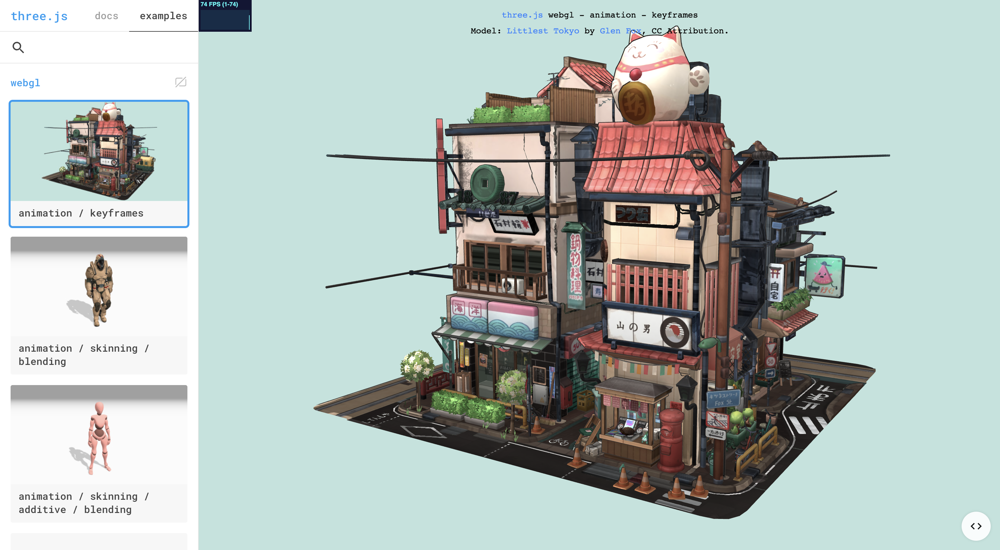

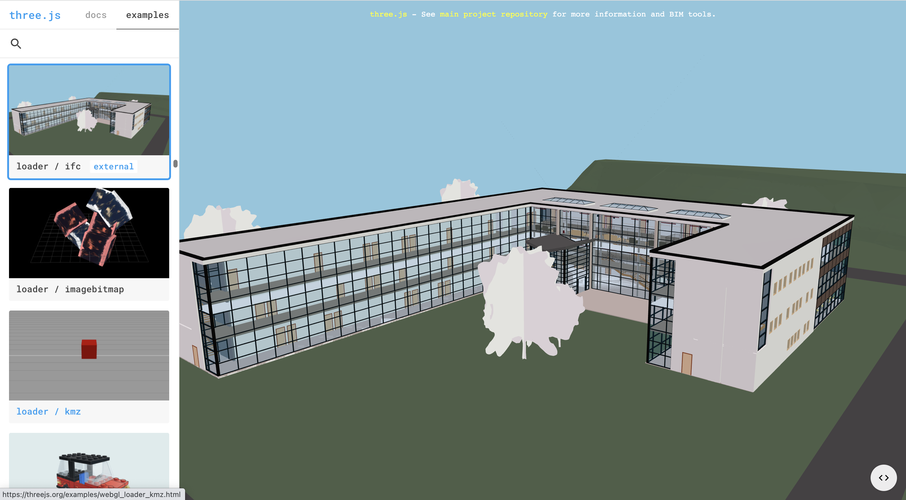

**Github：**[https://github.com/mrdoob/three.js](https://github.com/mrdoob/three.js)

## React-Three-Fiber
React-Three-Fiber 是一个用于在 React 应用程序中创建基于 Three.js 的 3D 图形和动画的库。它是在 Three.js 之上构建的，为开发者提供了一种简单且直观的方式来将 Three.js 嵌入到 React 组件中。

React-Three-Fiber 通过将 Three.js 的 API 封装为 React 组件的形式，使得在 React 中使用 Three.js 变得更加方便和可维护。通过使用类似于 React 的声明性语法和组件化的思想，开发者可以轻松地创建和管理复杂的 3D 场景、模型、动画和交互。该库提供了一组 React Hooks 和组件，以简化 Three.js 的使用和集成。开发者可以使用它来创建和控制 Three.js 中的几何体、纹理、相机、光照和材质，以及处理用户交互和动画效果等任务。

React-Three-Fiber 还引入了一种叫做 "Three.js Fiber" 的机制，用于基于 React 的渲染和更新优化。它使用了 React 的虚拟 DOM 引擎，提供了高效的渲染和更新机制，使得在 Three.js 场景中进行动态变化和交互性能更好。

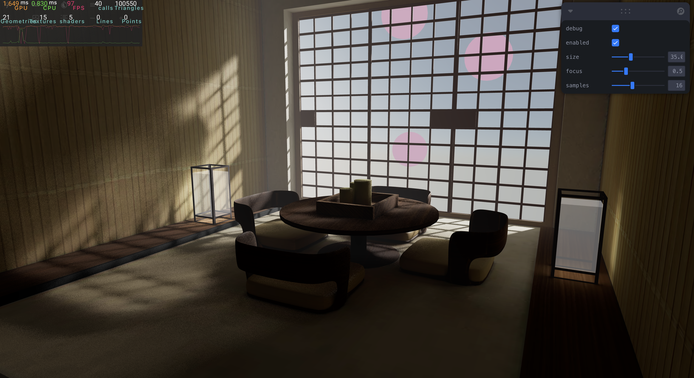

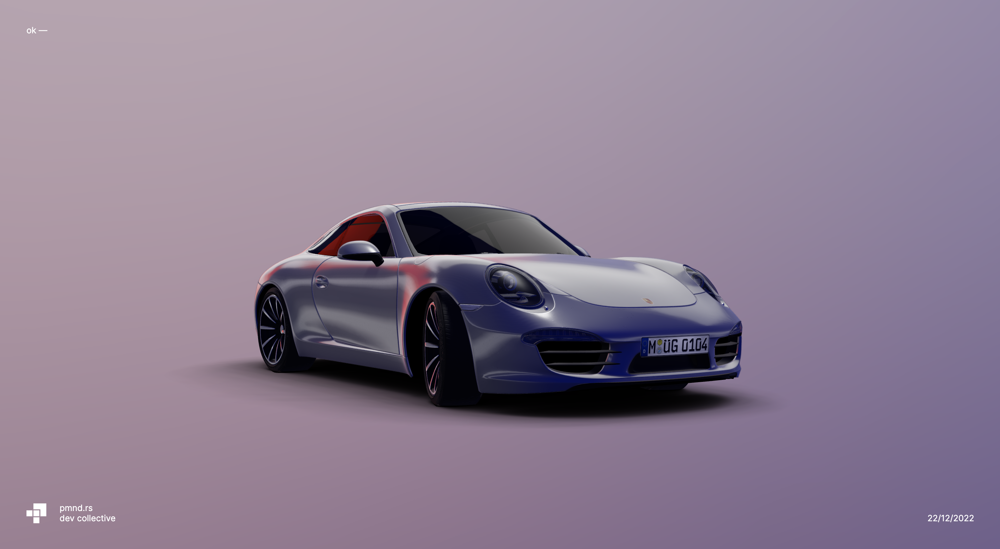

**Github：**[https://github.com/pmndrs/react-three-fiber](https://github.com/pmndrs/react-three-fiber)

## Babylon.js
Babylon.js 是一个功能强大的开源 JavaScript 框架，用于创建高性能的 3D 游戏和交互式应用。它建立在 WebGL 技术之上，并提供了丰富的功能和工具，使开发者能够轻松地构建令人惊叹的 3D 图形场景。它提供了一套完整的工具和 API，用于处理场景图、渲染、光照、材质、动画、碰撞检测和用户交互等方面。它具有强大的渲染引擎，支持使用高质量的材质、光照效果和纹理来创建逼真的视觉效果。

该框架还支持物理模拟和粒子系统，以实现真实的物理效果和特效。它还具有音频、骨骼动画、路径跟踪、精确碰撞检测等功能，为开发者提供了构建复杂游戏和应用程序所需的工具和功能。

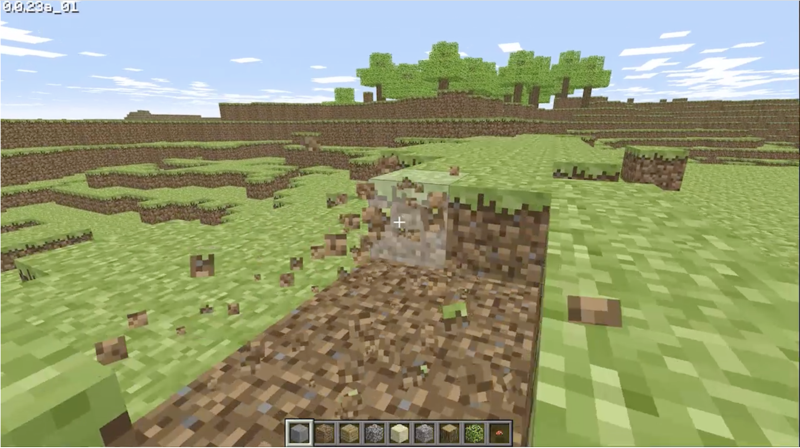

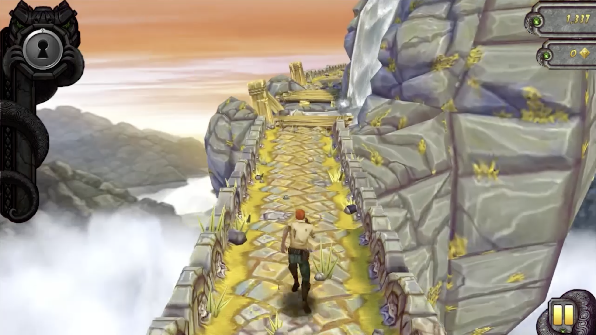

**Github：**[https://github.com/BabylonJS/Babylon.js](https://github.com/BabylonJS/Babylon.js)

## PlayCanvas
PlayCanvas 是一个基于 WebGL 技术的开源游戏引擎和开发平台。它提供了一个完整的游戏开发工具集，使开发者能够创建高性能、跨平台的 3D 游戏和应用程序。

PlayCanvas 基于 HTML5 和 JavaScript，并利用了现代浏览器所提供的强大图形渲染能力。通过 PlayCanvas，开发者可以轻松地构建逼真的 3D 场景、物理模拟、粒子效果以及复杂的游戏逻辑。

PlayCanvas 提供了一套易于学习和使用的编辑器，可用于创建和管理游戏场景、资源、动画和脚本。编辑器支持实时预览和调试，使开发过程更加直观和高效。

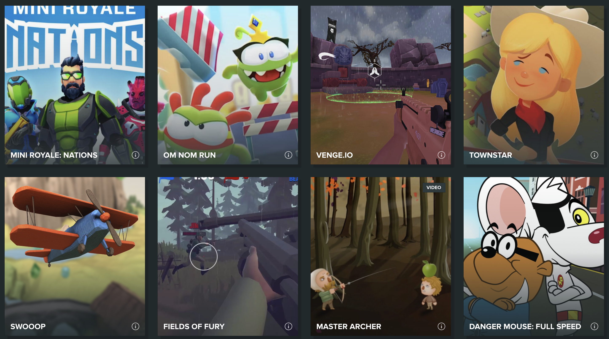

**Github：**[https://github.com/playcanvas/engine](https://github.com/playcanvas/engine)

## p5.js
p5.js 是一个基于 JavaScript 的创意编程库，它专注于可视化和交互式图形的创建。p5.js 的目标是使编程变得更加轻松和有趣，尤其适用于艺术家、设计师和初学者。它提供了一组简单易用的 API，用于绘制图形、处理用户输入、创建动画效果以及进行交互。它支持2D 和 3D 图形，并提供了丰富的功能和工具来实现各种创意项目，如绘画、动画、音频和视频处理等。

与其他 JavaScript 3D 库相比，p5.js 的重点更加广泛，不仅限于 3D 编程。它侧重于创意编程和可视化表达，提供了更简单、更友好的界面和 API，以促进创意和艺术的表达。

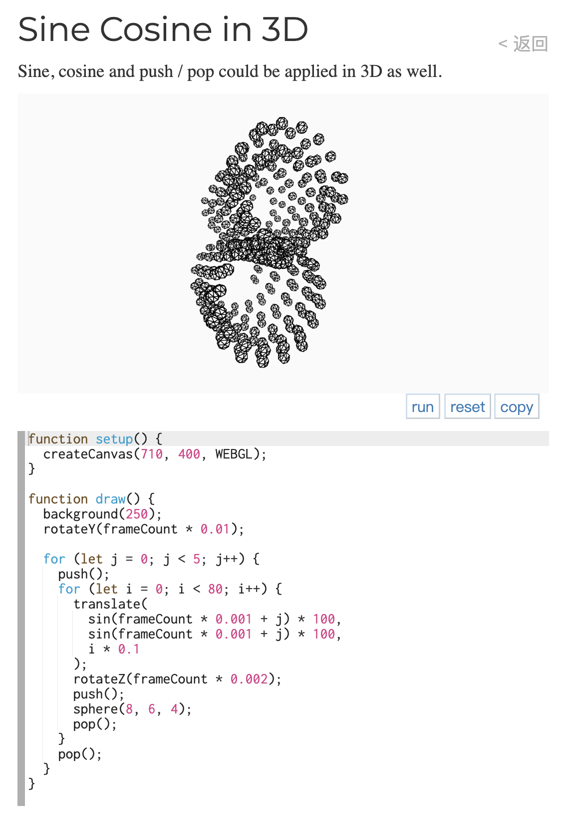

**Github：**[https://github.com/processing/p5.js](https://github.com/processing/p5.js)

## A-Frame
A-Frame 是一个用于构建虚拟现实（VR）和增强现实（AR）内容的开源 Web 框架。它基于 HTML，利用了 Web 技术（如 WebGL）来创建交互式的虚拟环境。

A-Frame 是由 Mozilla 开发的，它提供了一种简单且易于使用的方式来创建 3D 和 VR/AR 内容。开发者可以使用普通的 HTML 标签来定义场景、实体、相机、光照和其他元素，而无需编写复杂的代码。

A-Frame 建立在 Three.js 之上，提供了一个高级的抽象层，使得开发者可以轻松地创建和展示 3D 模型、场景和动画效果。同时，A-Frame 也与其他 Web 技术（如 DOM 事件、CSS3D 等）进行了集成，提供了丰富的交互和样式化功能。

A-Frame 支持各种类型的设备，包括桌面浏览器、移动设备和虚拟现实头戴显示器（如 Oculus Rift、HTC Vive 等）。它还提供了一系列的组件和工具，用于处理用户输入、设备控制和场景管理等任务。

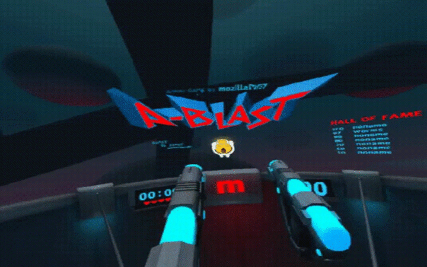

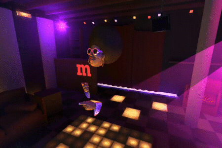

**Github：**[https://github.com/aframevr/aframe](https://github.com/aframevr/aframe)

## CesiumJS
CesiumJS 是一个用于在 Web 浏览器中创建 3D 地球和 2D 地图的 JavaScript 库，无需插件即可实现。它使用 WebGL 进行硬件加速图形渲染，并具有跨平台、跨浏览器的特性，专为动态数据可视化而优化。

CesiumJS 构建在开放格式之上，旨在提供强大的互操作性和扩展性，以适应海量数据集的需求。

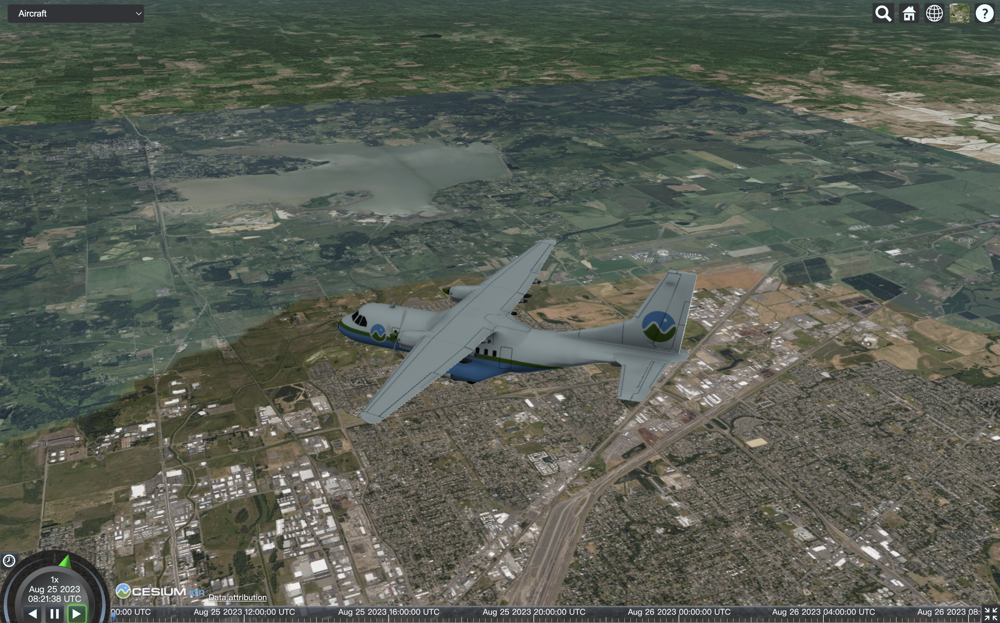

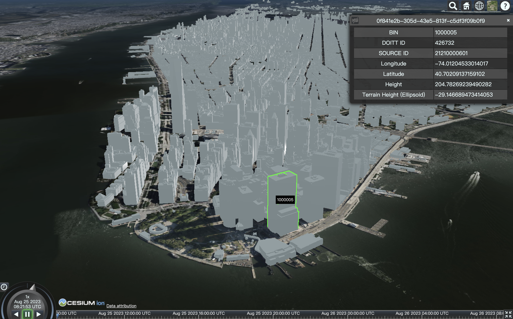

**Github：**[https://github.com/CesiumGS/cesium](https://github.com/CesiumGS/cesium)

## L7
L7 是由蚂蚁金服 AntV 数据可视化团队推出的基于 WebGL 的开源大规模地理空间数据可视分析开发框架。L7 中的 L 代表 Location，7 代表世界七大洲，寓意能为全球位置数据提供可视分析的能力。L7 以图形符号学为理论基础，将抽象复杂的空间数据转化成 2D、3D 符号，通过颜色、大小、体积、纹理等视觉变量实现丰富的可视化表达。

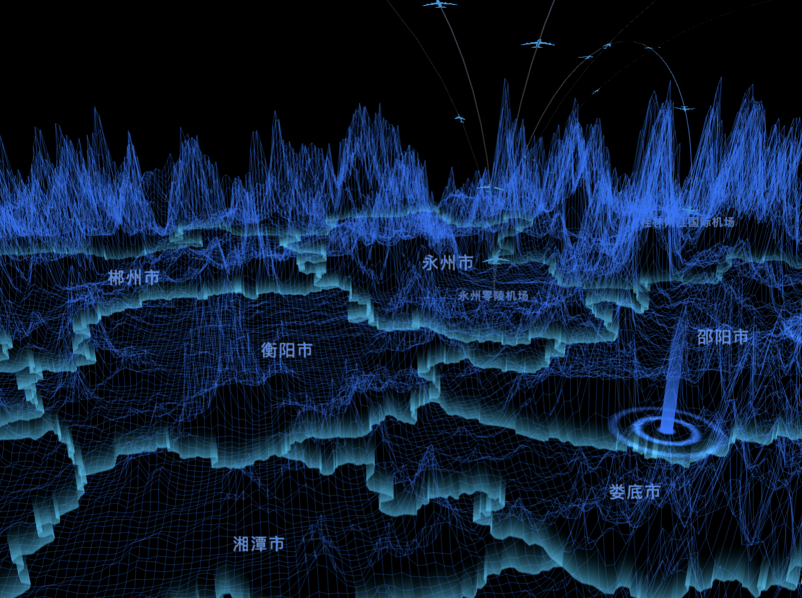

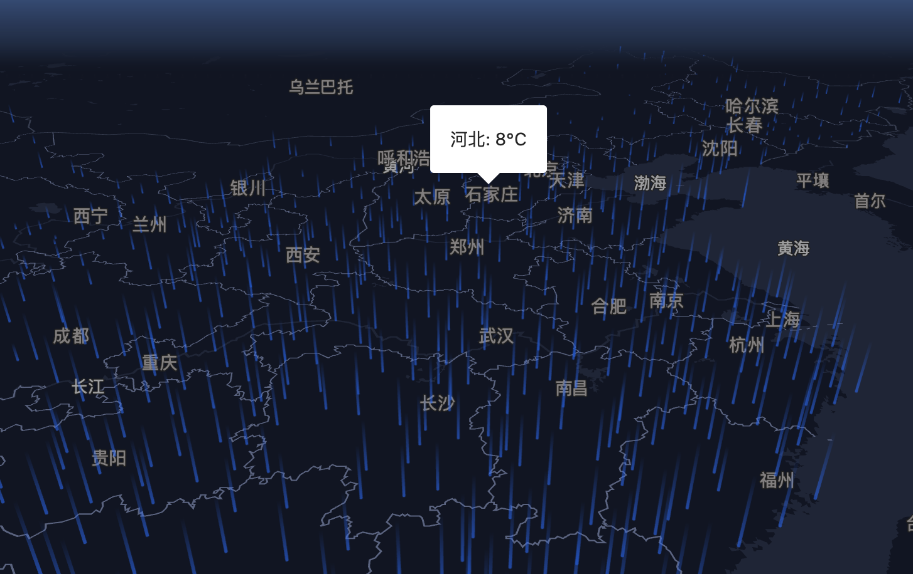

**Github：**[https://github.com/antvis/L7](https://github.com/antvis/L7)

## Vanta.js
Vanta.js 是一个基于 WebGL 技术的开源 JavaScript 库，用于创建令人惊叹的视觉效果和动态背景。它提供了一系列的精美且高度可定制的动画效果，可以让网页或应用的背景变得更生动。

Vanta.js 基于三维渲染引擎 Three.js，并结合了复杂的着色器和图形计算技术，可以在浏览器中实时渲染出各种效果，如烟雾、云彩、颗粒动画等。这些效果能够随着用户的交互而响应，给用户带来沉浸式的视觉体验。

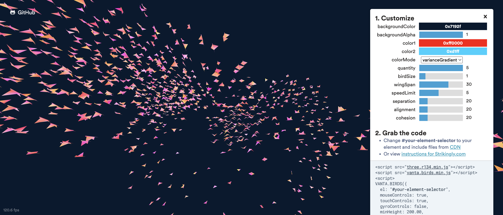

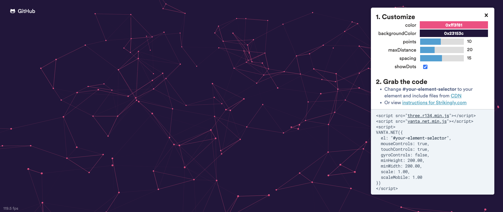

**Github：**[https://github.com/tengbao/vanta](https://github.com/tengbao/vanta)

## Zdog
Zdog是一个基于SVG的轻量级3D图形引擎，用于创建简单且动态的三维图形。它提供了一组简单易用的API，使得开发者无需掌握复杂的3D数学知识和技术即可轻松创建3D图形，并可以在浏览器中实现高性能的动画效果。

使用Zdog，你可以轻松地创建各种类型的简单3D图形，比如球体、立方体、锥体、棱柱等，还可以通过组合这些基本形状来创建更加复杂的图形。Zdog的API提供了各种配置选项，比如颜色、轮廓线、阴影等，使得开发者可以自由控制每个元素的外观和样式。

另外，Zdog还使用了一些先进的3D渲染技术，比如平面着色和射线追踪，提供了更加真实和逼真的3D渲染效果。此外，Zdog还支持添加事件监听器，使得开发者可以为图形添加交互功能，比如拖拽、缩放和旋转等。

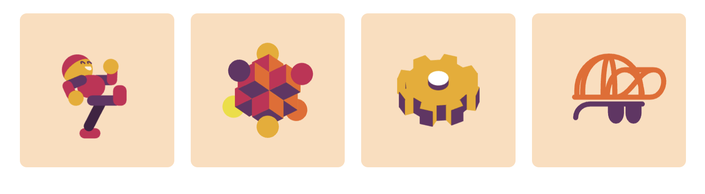

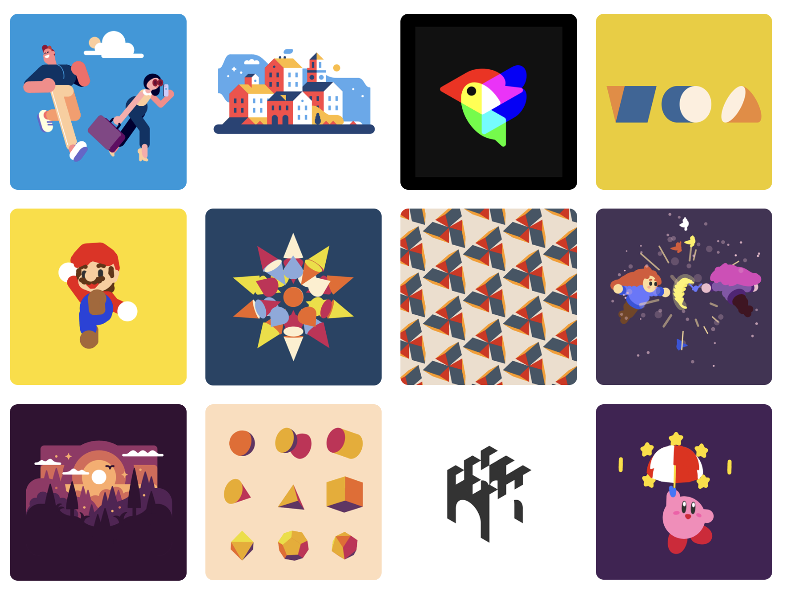

**Github：**[https://github.com/metafizzy/zdog](https://github.com/metafizzy/zdog)

> 更新: 2023-09-22 00:32:31  
> 原文: <https://www.yuque.com/cuggz/feplus/glk4nickrafgew8s>