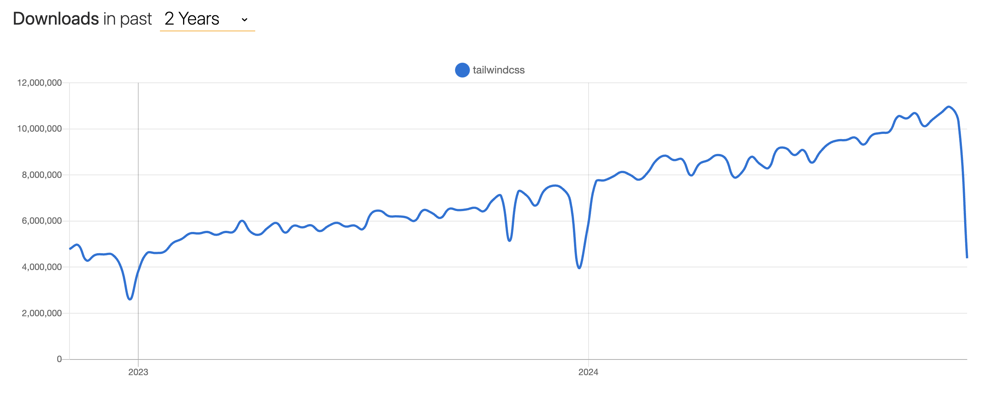
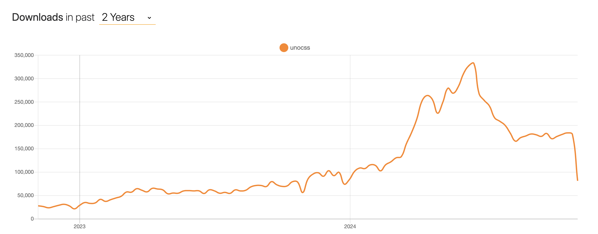
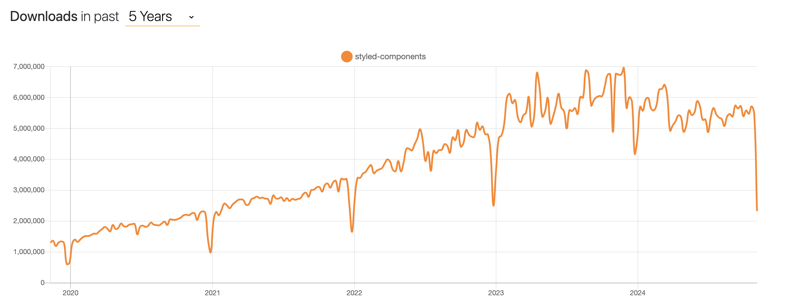
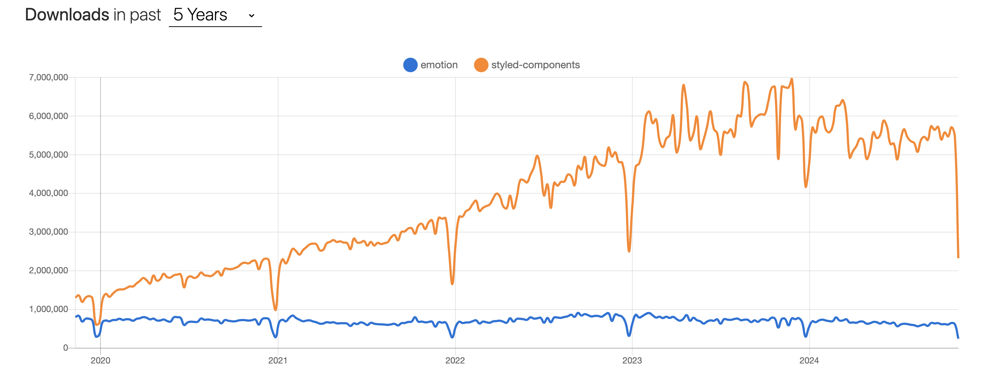
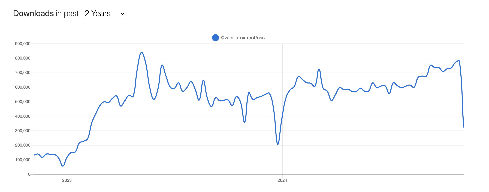
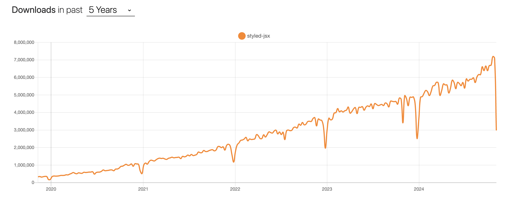
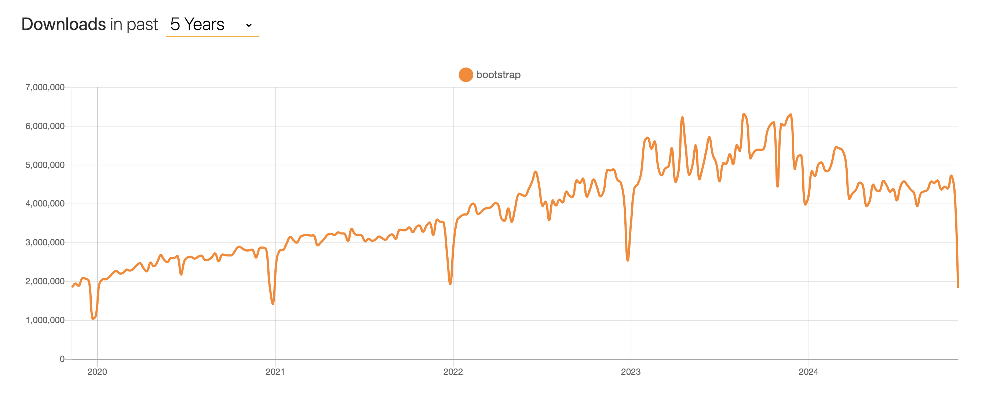

# CSS 框架

<font style="color:rgb(5, 7, 59);background-color:rgb(253, 253, 254);">在如今的前端世界，曾经非常火爆的 CSS 框架是否依然保持着昔日的辉煌？又有哪些新的 CSS 框架正在崭露头角，引领着前端开发的潮流呢？本文将带你一起探索目前最热门的 CSS 框架，看看它们都有哪些优缺点。</font>

## 实用优先
实用优先的 CSS 框架旨在通过提供一系列预定义的、可组合的样式类，使开发者能够以最少的自定义CSS来快速构建现代和响应式的用户界面。这里面最具代表性的就是 **Tailwind CSS** 和 **UnoCSS**。

### Tailwind CSS
Tailwind CSS 是目前最火的 CSS 框架，它强调的是原子级的 CSS 类，它将各种样式定义为独立的类，开发者可以轻松地组合和应用这些类来构建出所需的样式。这种设计理念使得Tailwind CSS能够提供一套定义好了的class类字典，开发者只需通过组合这些类来实现各种样式的设计，而无需自己编写大量的CSS代码。



Tailwind CSS 不仅内置了丰富的CSS类，还可以在配置文件（tailwind.config.js）中自定义主题，包括颜色、字体、间距等，以适应项目需求。它还提供响应式类，自动调整样式以适应不同屏幕尺寸，简化了响应式设计。

```html
<body class="bg-gray-100 p-4">
  <div class="bg-blue-500 text-white p-4 mb-4 sm:bg-green-500 md:bg-red-500 lg:bg-purple-500 xl:bg-orange-500">
    盒子颜色随屏幕大小而变化
  </div>
  <p class="text-gray-700 mb-4 sm:text-lg md:text-xl lg:text-2xl xl:text-3xl">
    文字大小随屏幕大小而变化
  </p>
</body>
```

不过，把所有样式直接写在 HTML 中可能导致代码变得冗长，类名字符串过长，降低代码的可读性，这也是部分开发者不喜欢 Tailwind CSS 的主要原因。 


**Github：**[https://github.com/tailwindlabs/tailwindcss](https://github.com/tailwindlabs/tailwindcss)

### UnoCSS
UnoCSS 是 **Anthony Fu**（Vue 和 Vite 的核心团队成员之一）开发是一个即时、按需的原子级 CSS 引擎，它专注于提供轻量化、高性能的 CSS 解决方案。UnoCSS 的设计理念是提供一个高性能且具灵活性的即时原子化 CSS 引擎，可以兼顾产物体积和开发性能。



UnoCSS 的主要特点：

+ **即时、按需**：UnoCSS 的加载和渲染速度非常快，可以立即进行使用，不需要预先编译。它通过静态分析和 PurgeCSS 算法在编译过程中自动推断和优化样式，并移除未使用的样式****。
+ **原子级 CSS**：使用原子级 CSS 样式的概念，每个类只包含一项或几项样式属性，可以在组件中灵活地组合和应用这些类，以实现细粒度的样式控制****。
+ **高性能**：UnoCSS 可以比 Tailwind CSS 的 JIT 引擎快 200 倍，几乎为零的开销意味着你可以将 UnoCSS 整合到你现有的项目中，作为一个增量解决方案与其他框架一同协作，而不需要担心性能损耗****。
+ **灵活性和可定制性**：UnoCSS 支持自定义工具类、变体、指令和图标，提供了更多的可选方案，并且兼容多种风格的原子类框架****。


**Github：**[https://github.com/unocss/unocss](https://github.com/unocss/unocss)

## CSS-in-JS
CSS-in-JS 是一种将 CSS 样式与 JavaScript 代码结合的方法，它允许在 JavaScript 组件中编写和管理 CSS 样式。虽然避免全局样式冲突，但也增加了运行时开销和包体积。

### Styled Components
Styled Components 是目前使用最多的 CSS-in-JS 库，专为 React 和 React Native 设计，不过最近出来很多新的  CSS-in-JS 库，Styled Components 的下载量开始走下坡路。Styled Components 允许开发者在 JavaScript 组件中直接编写 CSS 样式，从而实现样式与组件逻辑的紧密集成。通过使用标签模板字面量，Styled Components 提供了一种直观且灵活的方式来定义组件的样式。



Styled Components 的使用方式也非常简单：

```javascript
import React from 'react';
import styled from 'styled-components';

const Title = styled.h1`
  font-size: 1.5em;
  text-align: center;
  color: palevioletred;
`;

const Wrapper = styled.section`
  padding: 4em;
  background: papayawhip;
`;

function MyUI() {
  return (
    <Wrapper>
      <Title>Hello 前端充电宝!</Title>
    </Wrapper>
  );
}
```

Styled Components 虽然提供了组件化和动态样式的便利，但其性能开销、调试难度和代码冗余等问题导致部分开发者不喜欢使用它。


**Github：**[https://github.com/styled-components/styled-components](https://github.com/styled-components/styled-components)

### Emotion
Emotion 是一个流行的 CSS-in-JS 库，专为 React 设计。它允许开发者以 JavaScript 的方式编写 CSS 样式。Emotion 提供了一种灵活且强大的方式来管理组件的样式，支持动态样式、主题定制、自动前缀处理等功能。



使用方式和 Styled Components 大同小异：

```javascript
import styled from '@emotion/styled'

const Button = styled.button`
  padding: 32px;
  background-color: hotpink;
  font-size: 24px;
  border-radius: 4px;
  color: black;
  font-weight: bold;
  &:hover {
    color: white;
  }
`

render(<Button>This my button component.</Button>)
```

**Github：**[https://github.com/emotion-js/emotion](https://github.com/emotion-js/emotion)

### vanilla-extract
vanilla-extract 是一个创新性的 CSS-in-JS 库，它的目标是提供一种简单、高效且类型安全的方式来处理样式。相对于上面的两个库，vanilla-extract 的一个显著特点就是无运行时，样式在构建时处理，类似于Sass和Less，不会增加应用的运行时负担。



用法如下：

```javascript
// styles.css.ts
import { createTheme, style } from '@vanilla-extract/css';

export const [themeClass, vars] = createTheme({
  color: {
    brand: 'blue'
  },
  font: {
    body: 'arial'
  }
});

export const exampleStyle = style({
  backgroundColor: vars.color.brand,
  fontFamily: vars.font.body,
  color: 'white',
  padding: 10
});

// app.ts
import { themeClass, exampleStyle } from './styles.css.ts';

document.write(`
  <section class="${themeClass}">
    <h1 class="${exampleStyle}">Hello world!</h1>
  </section>
`);
```

**Github：**[https://github.com/vanilla-extract-css/vanilla-extract](https://github.com/vanilla-extract-css/vanilla-extract)

### styled-jsx
styled-jsx 是一个用于在 React 项目中编写 CSS 的库，特别设计用于与 JSX 一起使用。它是由 Vercel开发，旨在提供一种简单而直观的方式来编写组件级的样式，同时自动处理作用域和关键冲突问题。



使用方式如下：

```javascript
import React from 'react';

function MyComponent() {
  return (
    <div>
      <h1 className="title">Hello, World!</h1>
      <style jsx>{`
        .title {
          color: blue;
          font-size: 24px;
        }
      `}</style>
    </div>
  );
}

export default MyComponent;
```

## 通用框架
### **Bootstrap**
Bootstrap 是老牌 CSS 框架，最初是由Twitter的工程师开发，旨在解决内部项目中快速构建一致且响应式的用户界面的问题。



使用方式：

```javascript
<nav class="navbar navbar-expand-lg navbar-light bg-light">
  <a class="navbar-brand" href="#">Logo</a>
  <button class="navbar-toggler" type="button" data-toggle="collapse" data-target="#navbarNav" aria-controls="navbarNav" aria-expanded="false" aria-label="Toggle navigation">
    <span class="navbar-toggler-icon"></span>
  </button>
  <div class="collapse navbar-collapse" id="navbarNav">
    <ul class="navbar-nav">
      <li class="nav-item active">
        
      </li>
      <li class="nav-item">
        <a class="nav-link" href="#">Features</a>
      </li>
      <li class="nav-item">
        <a class="nav-link" href="#">Pricing</a>
      </li>
    </ul>
  </div>
</nav>
```

现在，使用 Bootstrap 的人数一直在减少，主要是因为开发者开始倾向于使用更轻量、更易于定制的CSS解决方案，如CSS-in-JS库和原子化的CSS框架，这些工具提供了更高的灵活性和集成度，以适应不断变化的设计趋势和性能要求。同时，开发者对于框架的特定集成和生态系统的需求也在增加，导致他们寻找更符合现代开发实践的替代品。


**Github：**[https://github.com/twbs/bootstrap](https://github.com/twbs/bootstrap)

---

今日话题：**你在日常开发中使用过哪些 CSS 框架？你觉得这些框架怎么样？**


> 更新: 2024-11-12 16:17:28  
> 原文: <https://www.yuque.com/cuggz/feplus/pxe8qa67exkoc4v8>