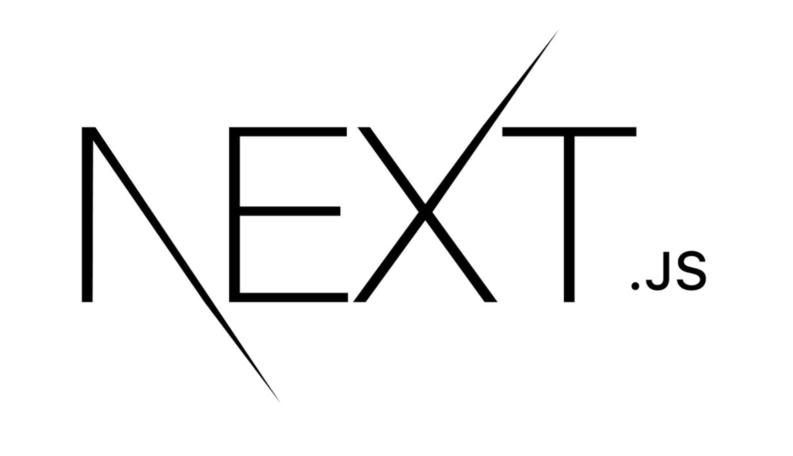
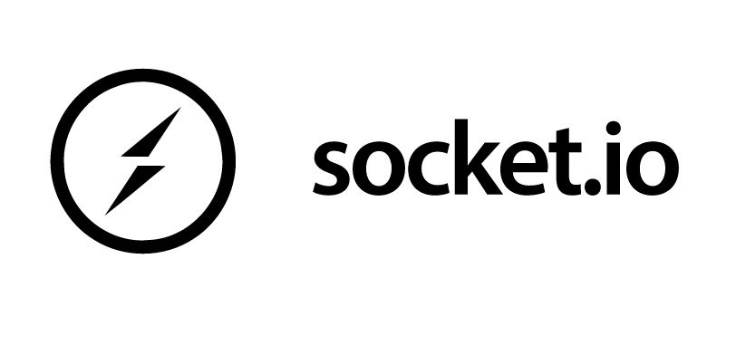
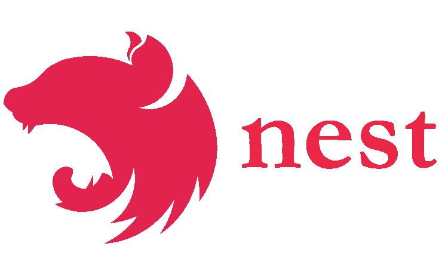
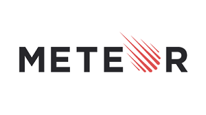
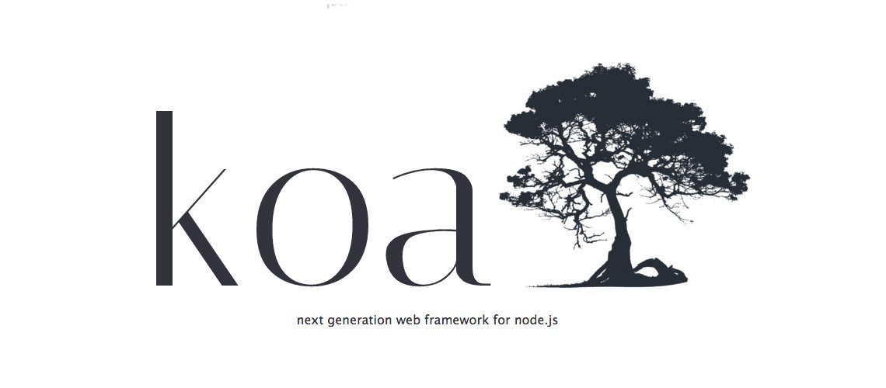

# Node.js 框架

Node.js 是最受欢迎的 JavaScript 运行时，今天就来看看有哪些热门、值得使用的Node.js框架。

## 1. Next.js
Next.js 是一个用于生产环境的 React 应用框架，使用它可以快速上手开发 React 应用，而不需要花很多时间和精力去折腾各种开发工具。所谓的用于生产环境，是指功能和稳定性足够，有大量的实际应用案例。常用于 React 服务端渲染应用。

实际上，Next.js 是一个全栈框架，它提供了生产环境所需的所有功能以及最佳的开发体验：包括静态及服务器端融合渲染、 支持 TypeScript、智能化打包、 路由预取等功能 无需任何配置。

**Next.js 的特点如下：**

+ **支持 TypeScript：**自动配置并编译 TypeScript；
+ **API 路由：**创建 API 端点（可选）以提供后端功能；
+ **内置支持 CSS：**使用 CSS 模块创建组件级的样式。内置对 Sass 的支持；
+ **代码拆分和打包：**采用由 Google Chrome 小组创建的、并经过优化的打包和拆分算法；
+ **零配置：**自动编译并打包。从一开始就为生产环境而优化；
+ **混合模式：** SSG 和 SSR：在一个项目中同时支持构建时预渲染页面（SSG）和请求时渲染页面（SSR）；
+ **增量静态生成：**在构建之后以增量的方式添加并更新静态预渲染的页面。

**Github（****⭐****️87k）：**[https://github.com/vercel/next.js](https://github.com/vercel/next.js)

## 2. Express.js
Express 是最受欢迎的、基于 MVC 的 Node.js 框架。它有许多与 Nodejs 同步的库和组件，以创建漂亮而强大的动态 Web 应用程序。ExpressJS 提供了所有HTTP实用方法、函数和中间件，可帮助开发人员编写健壮的 API。它适用于单页应用、多页应用、混合应用开发。

我们可以使用 **Express.js **更快地开发 Web 应用程序，因为它具有几乎现成的 API 生成基础。由于其强大的路由、模板、安全功能和错误处理规定，可以将其用于任何企业级或基于浏览器的应用程序。

**Express.js 的特点如下：**

+ 可以构建单页和多页 Web 应用程序；
+ 遵循 MVC 架构，使应用程序的实现变得容易；
+ 它支持 14+ 引擎模板和 HTTP 方法；
+ 高性能 ，使用异步编程相互独立地执行多个操作；
+ 超高的测试覆盖率有助于构建具有最大可测试性的应用程序；
+ 能够编写强大的 API 并注入重载包以帮助扩展框架的功能；
+ 更好的内容协商，通过向 URL 提供 HTTP 标头来帮助客户端和服务器之间更好地通信，从而为用户/客户端获取准确的信息；
+ 快速的服务器端编程包，该框架具有许多 Node.js 功能作为函数，并用很少的代码行加快了进程。

**GitHub（****⭐****️57.1k）：**[https://github.com/expressjs/express](https://github.com/expressjs/express)

## 3. Socket.io
Socket.io 用于构建实时应用程序并在 Web 客户端和服务器之间建立双向通信。使用此库框架，可以开发具有 websocket 开发要求的应用程序。例如，聊天应用程序会持续运行以获取实时更新，并刷新后台进程以获取更新或消息。它还以更少的代码行提供实时分析。

Socket.io 适合开发实时应用程序，如聊天室应用程序、视频会议应用程序、多人游戏等，这些应用程序需要服务器推送数据而无需客户端请求。

**Socket.io 的特点如下：**

+ 它支持自动重新连接；
+ 无缝地向 Web 应用程序添加实时功能；
+ 将消息编码为命名 JSON 或二进制事件；
+ 它确保无与伦比的编码速度和可靠性；
+ 使您能够开发即时消息传递和聊天应用程序，而无需处理复杂的编码。

**GitHub（****⭐****️55.8k）：**[https://github.com/socketio/socket.io](https://github.com/socketio/socket.io)

## 4. Nest.js
Nest (NestJS) 是一个用于构建高效、可扩展的 Node.js 服务器端应用程序的开发框架。它利用 JavaScript 的渐进增强的能力，使用并完全支持 TypeScript （仍然允许开发者使用纯 JavaScript 进行开发），并结合了 OOP （面向对象编程）、FP （函数式编程）和 FRP （函数响应式编程）。它还提供了一个命令行界面 (CLI)，可帮助开发人员将其他前端工具与其集成。

Nest 在常见的 Node.js 框架 (Express/Fastify) 之上提高了一个抽象级别，但仍然向开发者直接暴露了底层框架的 API。这使得开发者可以自由地使用适用于底层平台的无数的第三方模块。可以将此框架用于编写更简洁且可重用的应用程序代码，编写可扩展、可测试的应用程序，编写具有更高级别结构的代码，例如过滤器、管道、拦截器等。

**Nest.js 的特点如下：**

+ 使用 TypeScript 作为其原生编程语言；
+ 利用了许多编程范式，例如 FP、OOP 和 FRP，使其更具可扩展性；
+ 提供了一种模块化方法，其中库被安排在适当的模块中；
+ 使用了一些 Express 功能来简化开发过程；
+ 其简单易懂的命令行界面可帮助开发人员将其与不同工具无缝集成。

**GitHub（****⭐****️47.1k）：**[https://github.com/nestjs/nest](https://github.com/nestjs/nest)

## 5. Meteor.js
Meteor.js 是一个高度简单且用户友好的全栈 Node.js 框架，高度兼容 iOS、Android 或桌面。通过 Meteor.js 开发应用程序非常简单易用，同时具备服务大型项目的能力。使用 Meteor.js 最好的部分是，它可以与其他技术无缝集成，例如前端框架和数据库系统，如 React、Vue、Angular 和 MongoDB。此外，Meteor.js 在后端开发方面更接近 Node.js，开发人员可以更轻松地编写完整的网站，而无需使用多种编程语言。

Meteor.js 具有快速原型设计和生成跨平台（Android、iOS、Web）代码的能力。它也是最直接的学习框架之一，因为它不遵循任何严格的结构规则。因此，任何希望以最少的学习曲线为多个平台创建应用程序的初学者或中级开发人员都可以选择使用 Meteor.js。

**Meteor.js 的特点如下：**

+ 允许开发人员为任何平台（iOS、Android 和 Web）构建应用程序；
+ 它可以很容易地与 NoSQL 数据库集成，包括 MongoDB；
+ 轻量级且高度灵活的 Web 应用程序开发；
+ 可与 Angular、React 和 Vue 等前 3 大前端 Web 框架集成；
+ 拥有一个快速发展的社区，是全栈开发人员的理想选择；
+ 包含一组丰富的库，可帮助开发人员构建动态 Web 应用程序。

**GitHub（****⭐****️42.9k）：**[https://github.com/meteor/meteor](https://github.com/meteor/meteor)

## 6. Nuxt.js
Nuxt.js 是一个基于 Vue.js 的轻量级应用框架，可用来创建服务端渲染 (SSR) 应用，也可充当静态站点引擎生成静态站点应用，具有优雅的代码结构分层和热加载等特性。Nuxt 作为一个构建健壮应用程序的全栈框架，旨在显着改善全栈 Vue 开发的体验。

**Nuxt.js 的特点如下：**

+ 自动代码分层；
+ 服务端渲染；
+ 强大的路由功能，支持异步数据；
+ 静态文件服务；
+ ES6/ES7 语法支持；
+ 打包和压缩 JS 和 CSS；
+ HTML头部标签管理；
+ 本地开发支持热加载；
+ 集成ESLint；
+ 支持HTTP/2推送；
+ 支持各种样式预处理器： SASS、LESS、 Stylus等。

**GitHub（****⭐****️40.5k）：**[https://github.com/nuxt/nuxt.js](https://github.com/nuxt/nuxt.js)

## 7. Koa.js
Koa 被认为是对 Express 框架的扩展，因为它是由 Express 团队设计和开发的基于 MVC 的框架。创建 Koa 的主要目的是提供一个比 Express 更轻量级并且能够更高效地开发 Web 应用程序和 API 的框架。尽管与 Express 相比，它包含的库和组件更少，但 Koa.js 具有许多新功能，并且错误处理能力要好很多。

Koa 与 Express 非常相似，在编写代码时，仍然可以享受 Express 的灵活性和更多的自由度和更少的复杂性。这最大限度地减少了整个应用程序堆栈中的错误范围。 当性能是 Web 应用程序的关键需求时，Koa 可能是最好的选择之一。特别是对于大型项目，该框架可以与大型且经验丰富的开发团队一起构建广泛的应用程序。在某些情况下，Koa 已被证明是比 Express 更快的框架。  

**Koa.js 的特点如下：**

+ 包括许多新的和独有的功能；
+ 通过 async/await 关键字使代码保持干净；
+ 具有内置的错误回调功能，可防止网站或web应用程序崩溃
+ 它使用上下文对象，可以轻松地处理请求和响应对象。

**GitHub（****⭐****️32.7k）：**[https://github.com/koajs/koa](https://github.com/koajs/koa)

## 8. Sails.js
Sails.js 是一个Web 框架，可以轻松构建自定义的企业级 Node.js 应用程序。它的设计类似于 Ruby on Rails 等框架的 MVC 架构，但支持更现代、面向数据的 Web 应用程序和 API 开发风格。它特别适合构建聊天等实时功能。

Sails 是一个比 Express 更快的轻量级 NodeJS 框架。它与各种流行的后端和前端工具的集成使其成为最好的 Nodejs 框架之一。它提供了 ORM，允许它与任何数据库系统集成，例如 MySQL、MongoDB、PostgreSQL、Redis等。

**Sails.js 的特点如下：**

+ 100% 使用 JavaScript 编写，这使得它易于学习；
+ 支持自动生成 REST API；
+ 可以轻松地与 WebSockets 集成；
+ 其 ORM（对象关系映射）功能可帮助开发人员将 Web 框架与任何数据库管理系统集成；
+ 可以与任何前端技术集成；
+ 可以处理任何类型的 HTTP 请求；
+ 可重用的安全策略。

**GitHub（****⭐****️22.2k）：**[https://github.com/balderdashy/sails](https://github.com/balderdashy/sails)

## 9. Fastify
Fastify 是一个快速并且低开销的 web 框架，专为 Node.js 平台量身打造。Fastify 的设计灵感来自 Hapi 和 Express，致力于以最少的开销和强大的插件结构提供最佳的开发体验。据我们所知，它是这个领域里速度最快的 web 框架之一。

**Fastify 的特点如下：**

+ **高性能：** Fastify 是这一领域中最快的 web 框架之一，另外，取决于代码的复杂性，Fastify 最多可以处理每秒 3 万次的请求；
+ **可扩展：** Fastify 通过其提供的钩子（hook）、插件和装饰器（decorator）提供完整的可扩展性；
+ **基于 Schema：** 建议使用 JSON Schema 来做路由（route）验证及输出内容的序列化，Fastify 在内部将 schema 编译为高效的函数并执行；
+ **日志：** 日志是非常重要且代价高昂的。使用最好的日志记录程序来尽量消除这一成本，这就是 Pino；
+ **对开发人员友好：** 框架的使用很友好，帮助开发人员处理日常工作，并且不牺牲性能和安全性；
+ **支持 TypeScript：** 维护一个 TypeScript 类型声明文件，以便支持不断成长的 TypeScript 社区。

**GitHub（****⭐****️23.1k）：**[https://github.com/fastify/fastify](https://github.com/fastify/fastify)

## 10. Egg.js
Egg.js 为企业级框架和应用而生，希望由 Egg.js 孕育出更多上层框架，帮助开发团队和开发人员降低开发和维护成本。它继承了Koajs的高性能优点，同时又加入了一些约束与开发规范，来规避Koajs框架本身的开发自由度太高的问题。Egg 提供了一个更加强大的插件机制，让这些独立领域的功能模块可以更加容易编写。

Egg.js 是国内最热门的 node.js 框架之一，不同于 Exporess、Koa 等基础框架，Egg.js 在应用级的提炼封装，使其更贴近业务场景，更快上手。

Egg.js 的特点如下：

+ 提供基于 Egg 定制上层框架的能力；
+ 高度可扩展的插件机制；
+ 内置多进程管理；
+ 基于 Koa 开发，性能优异；
+ 框架稳定，测试覆盖率高；
+ 渐进式开发。

**GitHub（****⭐****️17.9k）：**[https://github.com/eggjs/egg](https://github.com/eggjs/egg)

> 更新: 2022-05-23 21:07:57  
> 原文: <https://www.yuque.com/cuggz/feplus/ubaun9>