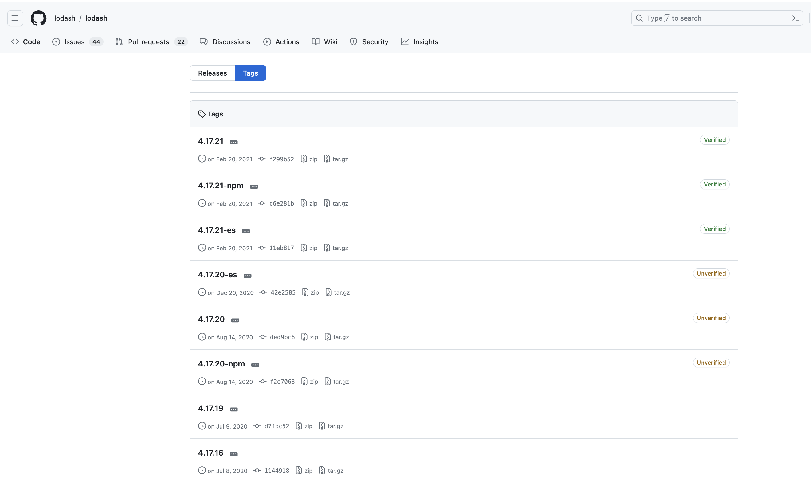
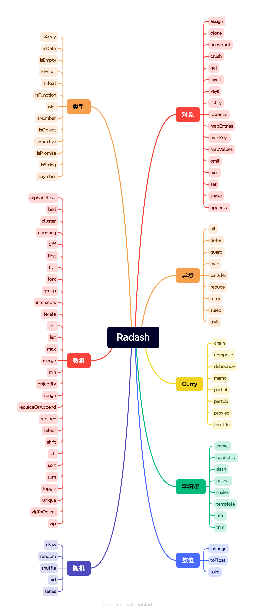

# Radash

相信许多前端开发者对Lodash都耳熟能详，作为 JavaScript 领域的一款常用实用工具库，它在前端开发中广受欢迎， npm 周下载量高达 5200 万。然而，时光荏苒，转眼已是 2024 年，Lodash 是否仍然值得使用呢？它的确为开发者带来了许多便利，但同样存在一些不容忽视的问题。本文将深入探讨 Lodash 的局限性，并推荐一个更为现代化、值得一试的 JavaScript 实用工具库 —— Radash。

## Lodash 的问题

Lodash 最初在 2009 年以 Underscore之名诞生，并在 2012 至 2013 年间经过一次分支（成为Lodash）后崛起。Lodash 的设计初衷是为了解决 2012 年前后 JavaScript 开发者面临的一系列难题。然而，时过境迁，那些问题在今天已不再是主要挑战。

随着可选链和空值合并的引入，许多 Lodash 函数变得多余。Lodash 的 `_.filter` 函数就是一个很好的例子。它曾经是一个很好的选择，可以遍历对象数组并根据属性过滤数组项，即使对象的属性不存在也不会出错。

```javascript
import _ from "lodash";

const users = [
  { user: "Poorna", age: 26, active: true },
  { user: "Widura", age: 28 },
  { user: "Binara", age: 24, active: true }
];

const filtered_users = _.filter(users, { active: true });

console.log(filtered_users);
// { 'user': 'Poorna', 'age': 26, 'active': true }
// { 'user': 'Binara', 'age': 24, 'active': true }
```

但现在，我们可以使用可选链操作符来完成这个任务。它更为简单，并且不需要导入任何第三方库。

```javascript
const users = [
  { user: "Poorna", age: 26, active: true },
  { user: "Widura", age: 28 },
  { user: "Binara", age: 24, active: true }
];

const filtered_users = users.filter(user => user?.active == true );

console.log(filtered_users);
// { 'user': 'Poorna', 'age': 26, 'active': true }
// { 'user': 'Binara', 'age': 24, 'active': true }
```

同样地，由于最新的 JavaScript 和 TypeScript 功能，像 `.get`、`.map` 和 `_.size` 这样的函数也变得多余了。并且，在性能方面，像可选链这样的特性远远超过了 Lodash 函数，可选链的性能几乎是 Lodash 的 `_.get` 函数的两倍。

Lodash 主要是用纯 JavaScript 编写的，并没有为 TypeScript 提供原生的支持。虽然社区提供了相应的 TypeScript 类型定义，但这些类型定义是基于 JavaScript 代码反向推断的，有时可能无法完全准确地描述 Lodash 的所有功能和使用场景。

另外，Lodash 在过去的 3 年里并没有发布新版本， 上一次版本发布还停留在 2021 年。而像 Radash 这样的新库则提供了持续的更新以解决现代编程中的问题：



## Radash：现代化实用工具库

Radash 是“新一代的 Lodash”，其目前在 GitHub 上拥有 **2.6k** Star，npm 周下载量 \*\*70k。\*\*它的特点如下：

* 一款零依赖的 JavaScript 实用工具库
* 采用 TypeScript 编写，类型已经预先打包
* 舍弃了 Lodash 中逐渐过时的函数
* 推出了众多前所未见但一直想要的新功能
* 源代码的维护以新手的可理解性为首要任务。在大多数情况下，如果想使用 Radash 的某个函数但不想安装它，可以直接从 GitHub 上复制它。

Radash 旨在提供强大的函数来解决 JavaScript 中的现代问题。此外，Radash 中的函数类型定义准确、测试充分、文档完善，且编写时以简洁性为首要考虑。最重要的是，这些函数能够解决现代 JavaScript 中的问题。

Radash 目前提供了 90+ 个实用函数：



下面来看几个 Radash 中很实用的函数。

### list()

`list()` 函数允许动态地生成具有特定项的列表，根据提供的参数进行灵活调整。它同样支持最少 1 个参数，最多 4 个输入参数。

```javascript
import { list } from 'radash';  
  
const myList = list(25, 100, i => i, 25);  
console.log(myList); // 输出: [25, 50, 75, 100]
```

在这个例子中，利用 `list()` 函数创建了一个列表。函数的第一个参数是起始值 25，第二个参数是结束值 100（注意，结束值是不包含在最终列表中的）。第三个参数是一个映射函数，这里我们简单地返回了每个元素本身（即没有进行任何转换）。最后一个参数是步长 25，意味着每次增加 25 来生成列表中的下一个值。

### <font style="color:rgb(5, 7, 59);">retry()</font><font style="color:rgb(5, 7, 59);"> </font>

<font style="color:rgb(5, 7, 59);"></font><code><font style="color:rgb(5, 7, 59);">retry()</font></code><font style="color:rgb(5, 7, 59);"> 函数用于重试失败的异步操作。它接受一个异步操作函数、一个重试次数以及一个延迟时间作为参数，并在操作失败时不断重试，直到操作成功或达到指定的最大重试次数。</font>

```javascript
import { retry } from 'radash';  
  
await retry({ times: 2, delay: 1000 }, api.articles.list);
```

<font style="color:rgb(5, 7, 59);">在这个例子中，</font><font style="color:rgb(5, 7, 59);">retry()</font><font style="color:rgb(5, 7, 59);"> </font><font style="color:rgb(5, 7, 59);">函数尝试执行</font><font style="color:rgb(5, 7, 59);"> </font><font style="color:rgb(5, 7, 59);">api.articles.list</font><font style="color:rgb(5, 7, 59);"> </font><font style="color:rgb(5, 7, 59);">异步操作，如果操作失败，它会等待 1000 毫秒（即 1 秒）后重试，最多重试 2 次。</font>

<font style="color:rgb(5, 7, 59);"></font>

<font style="color:rgb(5, 7, 59);">可以使用 </font><code><font style="color:rgb(5, 7, 59);">retry()</font></code><font style="color:rgb(5, 7, 59);"> 函数来替代传统的异步重试库，因为它提供了更加简洁和灵活的接口。结合 Radash 的其他功能，如 </font><code><font style="color:rgb(5, 7, 59);">tryit</font></code><font style="color:rgb(5, 7, 59);">、</font><code><font style="color:rgb(5, 7, 59);">parallel</font></code><font style="color:rgb(5, 7, 59);"> 等，可以轻松构建出高效且健壮的异步处理逻辑，以应对后端服务的各种不确定性。无论是处理网络请求、数据库操作还是其他异步任务，</font><code><font style="color:rgb(5, 7, 59);">retry()</font></code><font style="color:rgb(5, 7, 59);"> 函数都能提供强大的容错能力，确保应用程序的稳定性和可靠性。</font>

### <font style="color:rgb(5, 7, 59);">counting()</font><font style="color:rgb(5, 7, 59);"></font>

<code><font style="color:rgb(5, 7, 59);">counting()</font></code><font style="color:rgb(5, 7, 59);"> 函数用于统计类数组集合中各类元素的数量。它接收一个对象数组和一个回调函数，通过回调函数定义计数条件，并返回一个对象，其中包含了各类元素的数量。</font>

<font style="color:rgb(5, 7, 59);"></font>

<font style="color:rgb(5, 7, 59);">传统上，可能需要使用循环和多个条件判断来实现类似的统计功能，代码较为繁琐。而使用 </font><code><font style="color:rgb(5, 7, 59);">counting()</font></code><font style="color:rgb(5, 7, 59);"> 函数，可以极大地简化这一过程。</font>

```javascript
import { counting } from 'radash';  
  
const users = [  
  {name: 'Poorna', type: 'engineer'},  
  {name: 'Widura', type: 'manager'},  
  {name: 'Binara', type: 'engineer'},  
];  
  
const typeCounts = counting(users, user => user.type);  
console.log(typeCounts); // 输出: { engineer: 2, manager: 1 }
```

<font style="color:rgb(5, 7, 59);">在这个例子中，定义了一个 </font><code><font style="color:rgb(5, 7, 59);">users</font></code><font style="color:rgb(5, 7, 59);"> 数组，其中包含了不同角色的用户对象。通过调用 </font><code><font style="color:rgb(5, 7, 59);">counting()</font></code><font style="color:rgb(5, 7, 59);"> 函数，并传入 </font><code><font style="color:rgb(5, 7, 59);">users</font></code><font style="color:rgb(5, 7, 59);"> 数组和一个提取 </font><code><font style="color:rgb(5, 7, 59);">type</font></code><font style="color:rgb(5, 7, 59);"> 属性的回调函数，得到了一个 </font><code><font style="color:rgb(5, 7, 59);">typeCounts</font></code><font style="color:rgb(5, 7, 59);"> 对象，其中包含了每种类型的用户数量。</font>

### <font style="color:rgb(5, 7, 59);background-color:rgb(253, 253, 254);">类型化函数</font>

<font style="color:rgb(5, 7, 59);background-color:rgb(253, 253, 254);">Radash 中的类型化函数是一项非常出色的特性，它提供了一系列工具函数，如 </font><code><font style="color:rgb(5, 7, 59);background-color:rgb(253, 253, 254);">isArray()</font></code><font style="color:rgb(5, 7, 59);background-color:rgb(253, 253, 254);">、</font><code><font style="color:rgb(5, 7, 59);background-color:rgb(253, 253, 254);">isDate()</font></code><font style="color:rgb(5, 7, 59);background-color:rgb(253, 253, 254);">、</font><code><font style="color:rgb(5, 7, 59);background-color:rgb(253, 253, 254);">isFloat()</font></code><font style="color:rgb(5, 7, 59);background-color:rgb(253, 253, 254);">、</font><code><font style="color:rgb(5, 7, 59);background-color:rgb(253, 253, 254);">isInt()</font></code><font style="color:rgb(5, 7, 59);background-color:rgb(253, 253, 254);"> 等，用于检测变量的数据类型。这些函数极大地简化了在编程过程中验证和确保数据类型正确性的任务，使得代码更加健壮和可靠。通过使用这些函数，开发者可以更加自信地处理预期的数据类型，从而有效避免潜在的错误和异常。</font>

<font style="color:rgb(5, 7, 59);background-color:rgb(253, 253, 254);"></font>


> 更新: 2024-03-13 22:07:55  
> 原文: <https://www.yuque.com/cuggz/feplus/qol4qhmon1ethkh0>