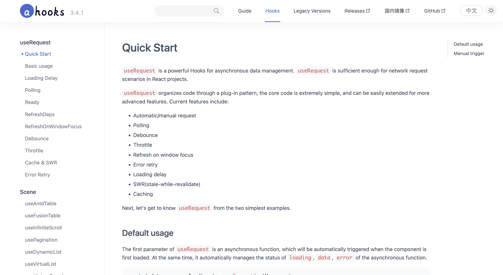
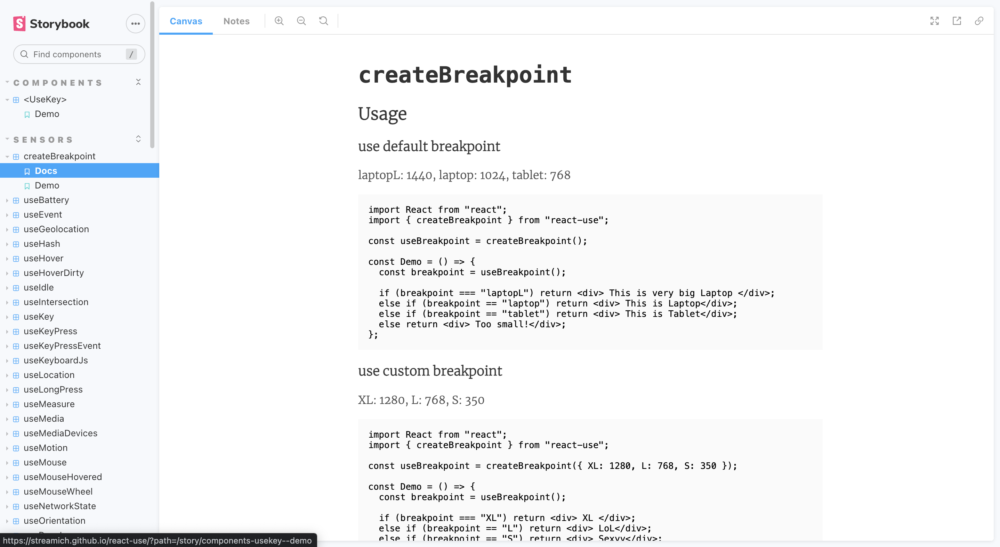
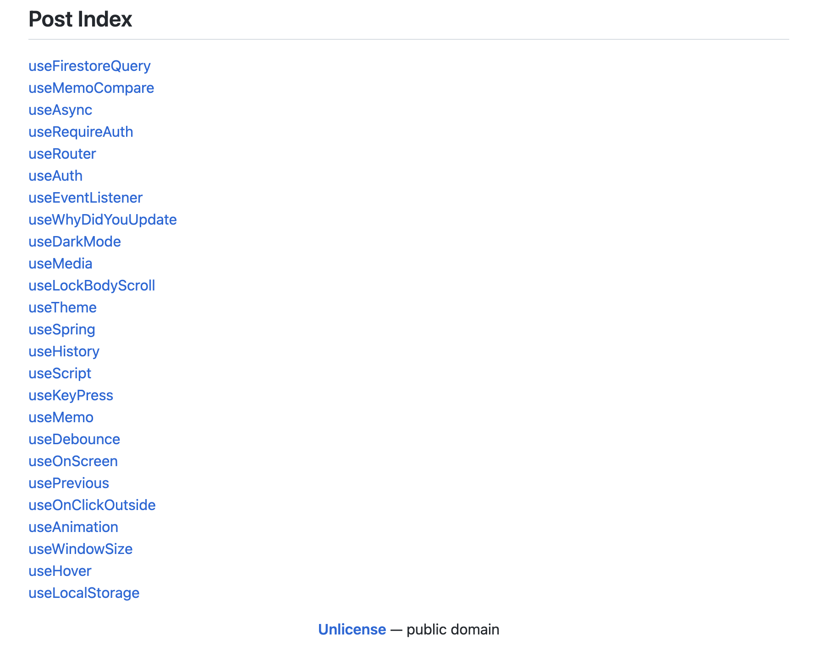
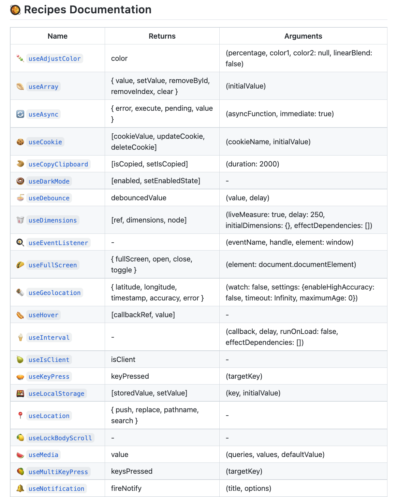
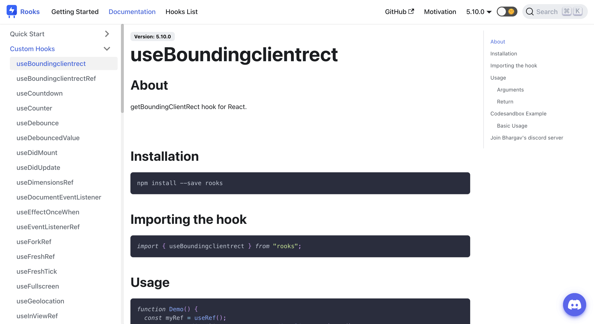
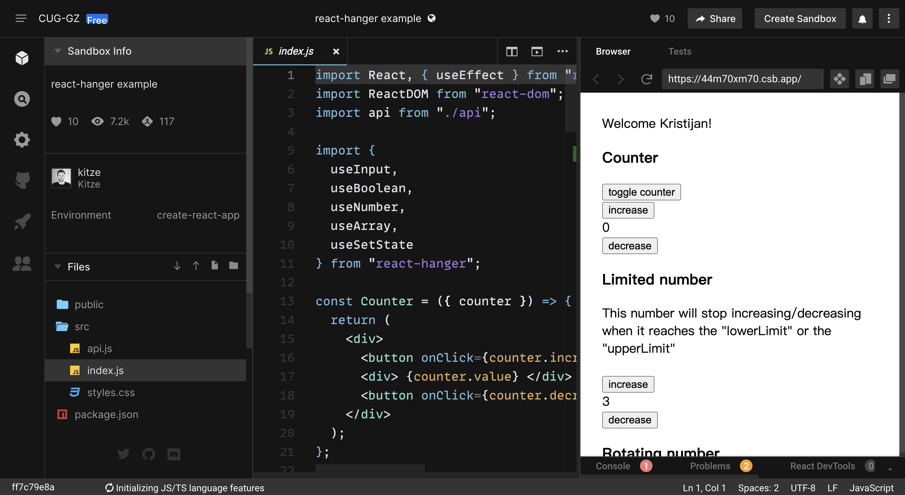
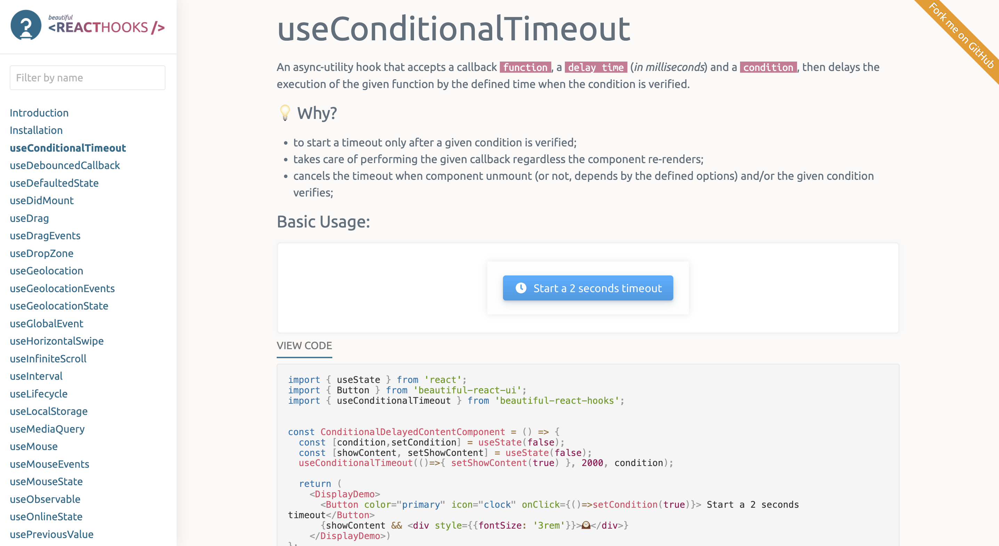
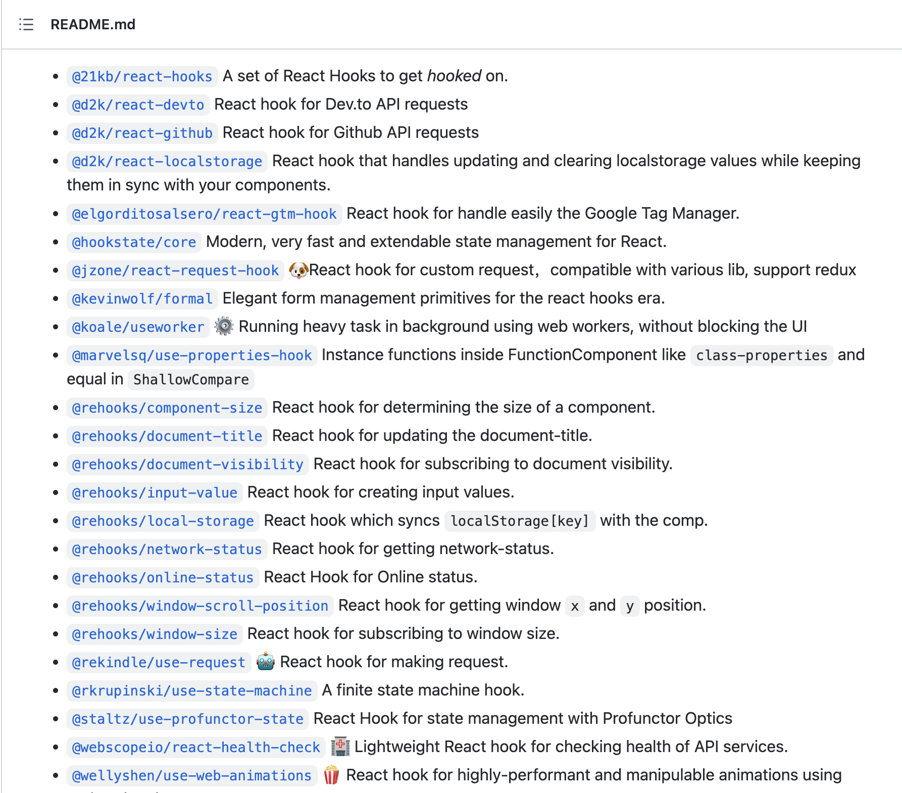
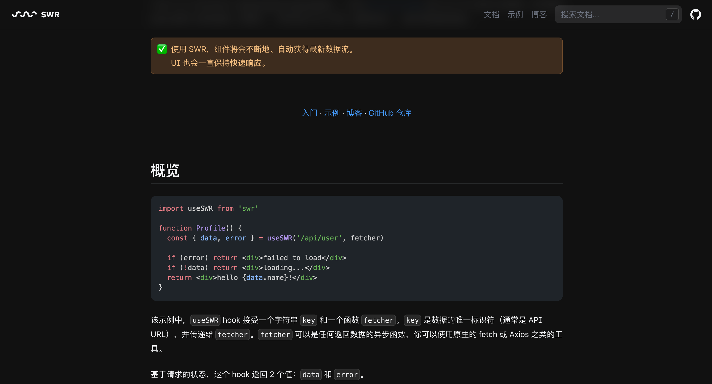
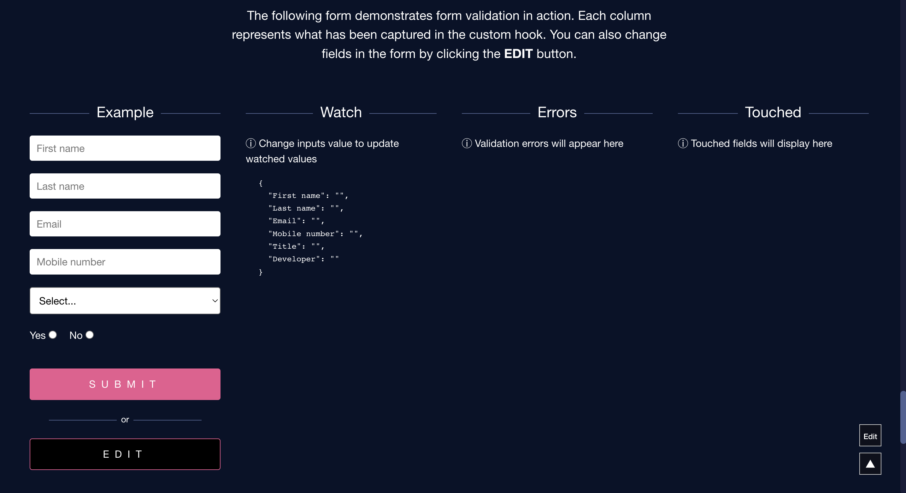

# React Hooks 库

##  1. Ahooks
ahooks 是一套由阿里巴巴开源的 React Hooks 库，封装了大量好用的 Hooks。其特点如下：

+ 易学易用；
+ 支持 SSR；
+ 对输入输出函数做了特殊处理，避免闭包问题；
+ 包含大量提炼自业务的高级 Hooks；
+ 包含丰富的基础 Hooks；
+ 使用 TypeScript 构建，提供完整的类型定义文件。

**Github：**[https://github.com/alibaba/hooks](https://github.com/alibaba/hooks)

## 2. React Use
React Use 是一个必不可少的 React Hooks 集合。其包含了传感器、用户界面、动画效果、副作用、生命周期、状态这六大类的Hooks。

**Github：**[https://github.com/streamich/react-use](https://github.com/streamich/react-use)

## 3. useHooks
useHooks 是一组易于理解的 React Hook集合。

**Github：**[https://github.com/uidotdev/usehooks](https://github.com/uidotdev/usehooks)

## 4. React Recipes
React Recipes 是一个包含流行的自定义 Hook 的 React Hooks 实用程序库。

**Github：**[https://github.com/craig1123/react-recipes](https://github.com/craig1123/react-recipes)

## 5. Rhooks
Rhooks 是一组基本的 React 自定义Hooks。

**Github：**[https://github.com/imbhargav5/rooks](https://github.com/imbhargav5/rooks)

## 6. React Hanger
React Hanger 是一组有用的Hooks。

**Github：**[https://github.com/kitze/react-hanger](https://github.com/kitze/react-hanger)

## 7. Beautiful React Hook
Beautiful React Hook 是一组漂亮的（希望有用的）React hooks 来加速你的组件和 hooks 开发。

**Github：**[https://github.com/antonioru/beautiful-react-hooks](https://github.com/antonioru/beautiful-react-hooks)

## 8. Awesome React Hooks 
Awesome React Hooks  是一个很棒的 React Hooks 资源集合，该集合包含React Hooks教程、视频、工具，Hooks列表。其中Hooks列表中包含了众多实用的自定义Hooks。

**Github：**[https://github.com/rehooks/awesome-react-hooks](https://github.com/rehooks/awesome-react-hooks)

## 9. SWR
SWR 是一个用于获取数据的 React Hooks 库。只需一个Hook，就可以显着简化项目中的数据获取逻辑。其特点如下：

+ 极速、轻量、可重用的数据请求；
+ 内置缓存和重复请求去除；
+ 实时体验；
+ 传输和协议不可知；
+ 支持 SSR / ISR / SSG；
+ 支持 TypeScript；
+ React Native。

**Github：**[https://github.com/vercel/swr](https://github.com/vercel/swr)

## 10. React Hook Form
React Hook Form 是一个用于表单状态管理和验证的 React Hooks (Web + React Native)。

**Github：**[https://github.com/react-hook-form/react-hook-form](https://github.com/react-hook-form/react-hook-form)

> 更新: 2022-06-25 23:48:08  
> 原文: <https://www.yuque.com/cuggz/feplus/ny2vkv>