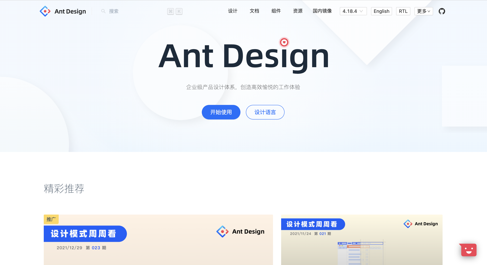
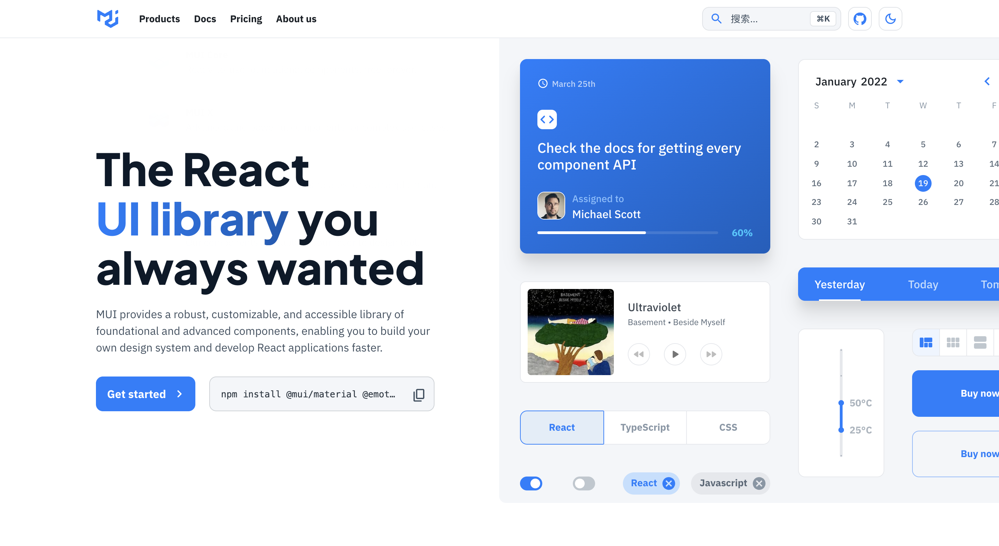
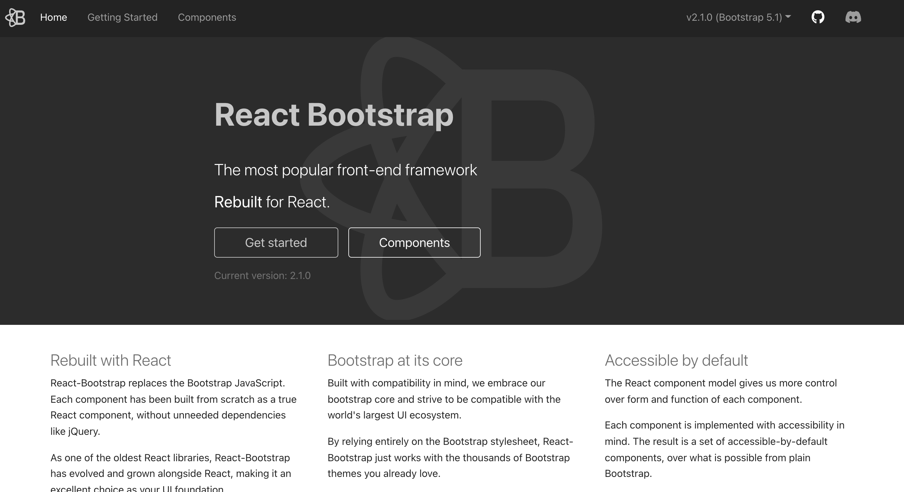
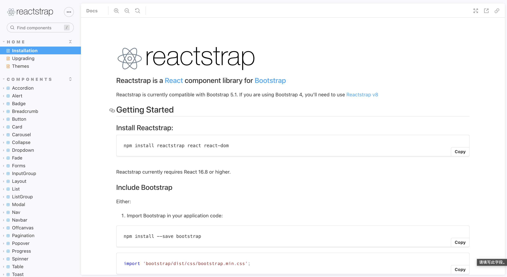
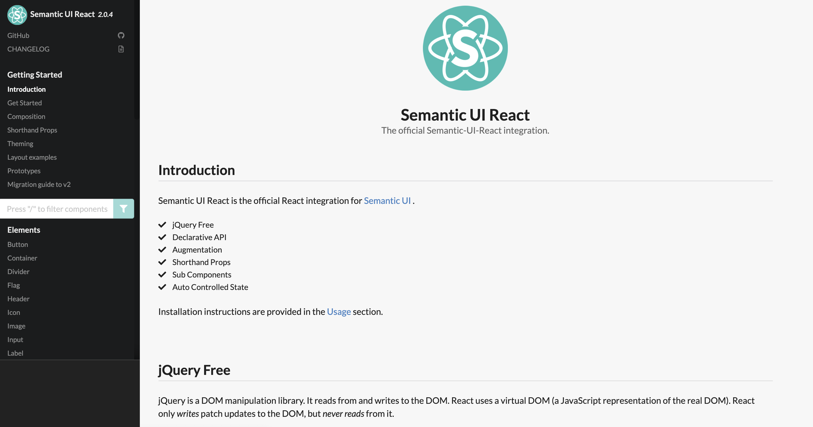
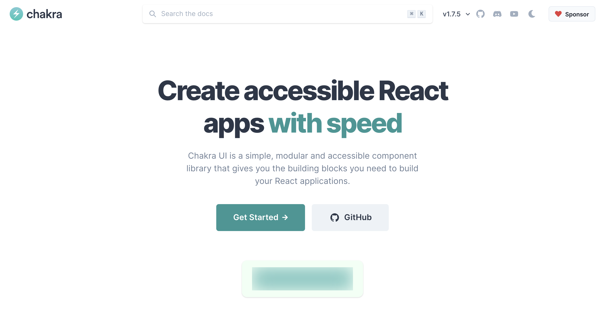
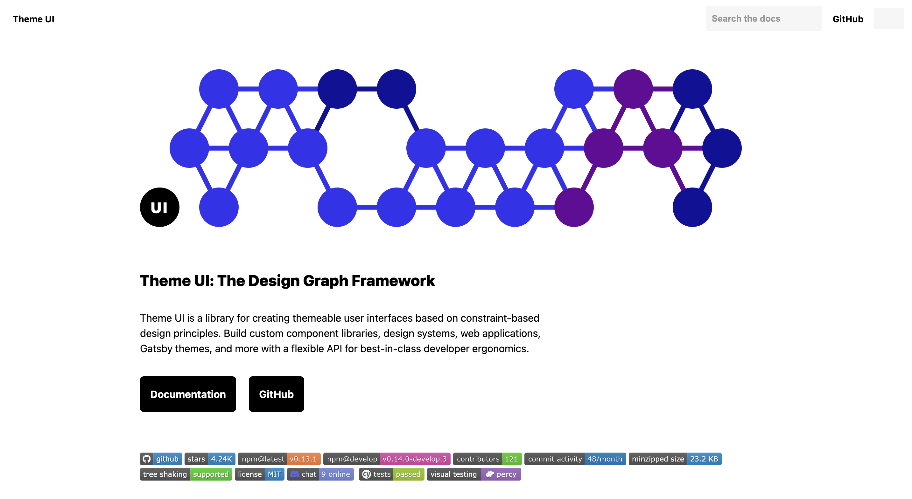
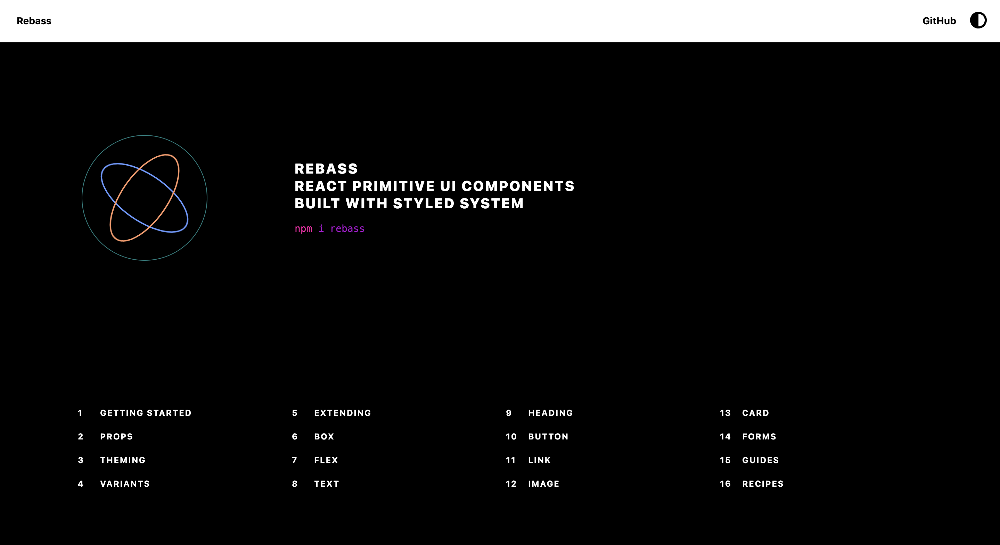
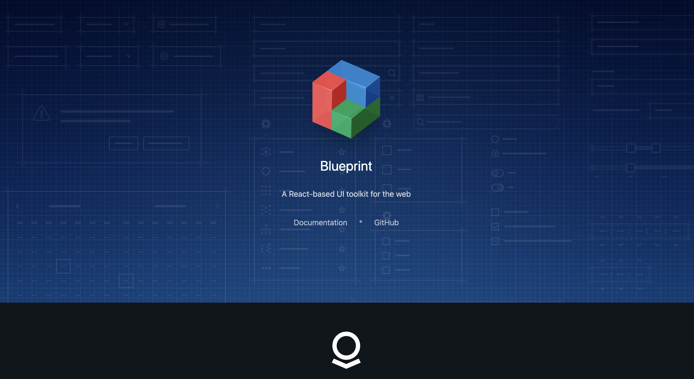

# React UI 组件库

根据 BuildWith 的统计，React 为全球1000 多万个网站的用户界面 (UI) 提供了支持。在做一些项目时，我们可能会选择使用一些成熟的UI组件库来实现。那为什么要使用组件库来处理 React 项目呢？主要有以下原因：

+ **对初学者友好：**UI 库由预构建的组件组成，例如按钮、表单等。因此，我们不必弄清楚如何从头开始创建元素。相反，可以在文档的帮助下专注于页面功能的实现；
+ **更快的原型制作：**使用现成的 React 组件供我们使用，可以快速创建多个功能原型，而无需在细节上花费太多时间。
+ **节省时间：**使用组件库不仅可以节省原型设计时间，还可以节省处理 React 细节的时间。使用组件库可以编写更少的代码，而不必编写所有样式。
+ **可定制的组件：**组件库提供的组件都可以进行不同程度的自定义，进行定制化。
+ **跨设备兼容性：**大多数预构建的 UI 组件默认情况下是移动响应的，这意味着您不必付出很多额外的努力来确保您的 React 项目可以在不同类型的设备上运行。

下面就来看看 GitHub 上流行的 React UI 库！

## 1. Ant Design
GitHub 上超过 269 k 个项目使用了 Ant Design 组件库，Ant Design of React 是一个基于 Ant Design 设计体系的 React UI 组件库，主要用于研发企业级中后台产品。

Ant Design 组件库主要有以下特性：

+ 🌈 提炼自企业级中后台产品的交互语言和视觉风格。
+ 📦 开箱即用的高质量 React 组件。
+ 🛡 使用 TypeScript 开发，提供完整的类型定义文件。
+ ⚙️ 全链路开发和设计工具体系。
+ 🌍 数十个国际化语言支持。
+ 🎨 深入每个细节的主题定制能力。

当然，Ant Design 也是有缺点的，其包的大小有1.2 MB，而其他 React 库通常为几百 KB。

Ant Design 提供了大量高质量的组件，非常适合快速构建整个 UI 框架，也可以只使用单个组件。该库基于 43.9% 的 TypeScript、31.3% 的 JavaScript、24.5% 的 Less 和 0.3% 的其他代码。

GitHub Star：77.1k

GitHub地址：[https://github.com/ant-design/ant-design](https://github.com/ant-design/ant-design)

官网地址：[https://ant.design/index-cn](https://ant.design/index-cn)

## 2. MUI
GitHub 上超过 781k 个项目使用了MUI，它是一个基于 Google 的 Material Design 的简单且可定制的 React 组件库。MUI 不仅是一个组件库，而是一个完整的设计系统。它具有一套完整的指南、设计原则和 UI 设计最佳实践系统。MUI 使用了 61.4% 的 JavaScript 和 38.6% 的 TypeScript 来构建。

由于 MUI 基于的 Material-UI 设计系统是由 Google 创建的，所以它也会在 Google 的一些平台上使用。因此，MUI 组件可以具有类似于 Google 的外观和感觉，这意味着 MUI 可以成为构建 Android 应用程序的绝佳选择。

GitHub Star：74.5k

GitHub 地址：[https://github.com/mui-org/material-ui](https://github.com/mui-org/material-ui)

官网地址：[https://mui.com/zh/](https://mui.com/zh/)

## 3. React Bootstrap
在 GitHub 上有大概 649k 个项目使用 React-Bootstrap，是比较古老的 React UI 组件库之一。它是使用 React 来重新构建了前端框架 Bootstrap。该库由完全响应并且可访问的现成的组件组成。所有设计元素都是高度可定制的。

React-Bootstrap 可以用于 UI 基础、网站和设计应用程序。该库使用 59.4% 的 JavaScript、38.3% 的 TypeScript 和 2.3% 的 SCSS 构建，最新版本可以与最新的 Bootstrap 5.1 版本兼容。我们可以 使用 React-Bootstrap 只导入需要使用的单个组件，这也有助于最大限度地减少代码总量。不过，React-Bootstrap 相对于其他组件库，组件会少一点。

GitHub Star：20.4k

GitHub 地址：[https://github.com/react-bootstrap/react-bootstrap](https://github.com/react-bootstrap/react-bootstrap)

官网地址：[https://react-bootstrap.github.io/](https://react-bootstrap.github.io/)

## 4. Reactstrap
在GitHub上有 250k 个项目使用了 Reactstrap。Reactstrap 组件元素响应迅速，设计简单，适用于各种项目。Reactstrap 使用 74.7% 的 JavaScript、24.9% 的 TypeScript 和 0.4% 的 Shell 构建。我们可以使用 Reactstrap 进行完整的 UI 开发或者使用单个组件开发。它提供了极大的灵活性和预构建的验证，非常适合快速构建具有出色用户体验的精美表单。由于 Reactstrap 是一个比较年轻的组件库，所以它的可用组件相对其他组件库来说会略少一点。

GitHub Star：10.2k

GitHub 地址：[https://github.com/reactstrap/reactstrap](https://github.com/reactstrap/reactstrap)

官网地址：[https://reactstrap.github.io/](https://reactstrap.github.io/)

## 5. Semantic UI React
Semantic UI React 被GitHub 上 136k 个项目使用，是一个用于移动端的响应式前端组件库。它是 Semantic UI 开发框架的官方 React 集成，以响应迅速、人性化的 HTML 代码而闻名。Semantic UI React 使用 99.9% 的 JavaScript 和 0.1% 的 TypeScript 构建。

GitHub Star：12.6k

GitHub 地址：[https://github.com/Semantic-Org/Semantic-UI-React](https://github.com/Semantic-Org/Semantic-UI-React)

官网地址：[https://react.semantic-ui.com/](https://react.semantic-ui.com/)

## 6. Chakra UI
Chakra UI 被 GitHub 上的 41.9k 个项目使用，提供了简单的、模块化的和可定制的 React 组件来支持应用程序和 Web 开发。所有元素也针对暗模式进行了优化，与其他一些 UI 组件库不同的，Chakra UI 完全兼容 WAI-ARIA 可访问性标准。Chakra UI 使用 97.5% 的 TypeScript、1.9% 的 JavaScript 和 0.6% 的其他代码构建。

简单是 Chakra UI 的一大特点。它非常关注开发过程，并承诺将花费更少的时间编写代码，而将更多的时间用于构建出色的用户体验。但是，其他 React UI 组件库相比，Chakra UI 相对较新，所以会缺乏一些功能和组件。因此，它更适合用于不需要大量组件或高级功能的中小型项目。

GitHub Star：23.4k

GitHub 地址：[https://github.com/chakra-ui/chakra-ui](https://github.com/chakra-ui/chakra-ui)

官网地址：[https://chakra-ui.com/](https://chakra-ui.com/)

## 7. Theme UI
Theme UI 被 GitHub 上 18.1k 个项目使用，它包含了 30 多个原始 UI 组件。Theme UI 的核心概念依赖基于约束的设计原则。Theme UI  使用 75.1% 的 TypeScript、24.1% 的 JavaScript 和 0.2% 的其他代码构建。由于快速的工作流程、真正易于使用的样式和主题功能以及对变化的支持，该组件库受到高度评价。Theme UI UI 还提供了一些实用功能，例如内置的深色模式和移动优先的响应式样式。

Theme UI React 组件库可以很容易地用于构建 Web 应用程序。但是因为它是一个很年轻的库，它还没有那么多的基础组件或者活跃的社区成员，并且默认情况下它不完全兼容可访问性标准。

GitHub Star：4.2k

GitHub 地址：[https://github.com/system-ui/theme-ui](https://github.com/system-ui/theme-ui)

官网地址：[https://theme-ui.com/](https://theme-ui.com/)

## 8. Rebass
Rebass 被 GitHub 上的 11k 个项目使用，它具有原始的 React UI 组件和用于进一步设计的简单系统。这些组件响应迅速、简约且灵活。最重要的是，它是一个非常轻量级的库，包大小只有 43 kb 。Rebass 100% 使用 JavaScript 开发。

我们可以使用 Rebass 创来建简约风格的系统并根据需要自定义组件。使用 Styled System 减少了在应用程序中编写自定义的 CSS 的需要，所以可以更快地构建项目。Rebass 是支持主题的，虽然没有预设主题，但它提供了足够的灵活性来供我们自定义主题。Rebass 与 Theme UI 完全兼容，因此可以根据需要将这两者结合使用。

GitHub Star：7.6k

GitHub 地址：[https://github.com/rebassjs/rebass](https://github.com/rebassjs/rebass)

官网地址：[https://rebassjs.org/](https://rebassjs.org/)

## 9. Blueprint
Blueprint 被 GitHub 上的 10.2k 个项目使用，其包含了 40 多个组件。主要是为复杂的数据密集型桌面应用来构建 React UI，因此它不是完全响应移动设备的。Blueprint 使用 88.4% 的 TypeScript、8.7% 的 SCSS、2.2% 的 JavaScript 和 0.7% 的其他代码构建。我们可以安装包含所有基本组件的 Blueprint 核心包，并根据需求来添加任何组件包。例如，Datetime、Icons 和 Table 包等。

Blueprint 不提供任何预构建的主题，只提供了默认的浅色主题和深色主题。不过，我们可以定制和构建个性化主题。如想使用现成的组件构建数据密集型桌面应用，Blueprint 可能是最适合的 React 组件库。它不太适合移动应用程序。

GitHub Star：18.5k

GitHub 地址：[https://github.com/palantir/blueprint](https://github.com/palantir/blueprint)

官网地址：[https://blueprintjs.com/](https://blueprintjs.com/)

> 更新: 2022-02-25 19:03:37  
> 原文: <https://www.yuque.com/cuggz/feplus/dmdsm4>