# React 图标库

## 1. Supercons
Supercons 为 React 开发人员提供了项目制作高质量de 图标集。它们还为图标设计人员和开发人员提供了一种轻松制作图标集的方法，这些图标集无需任何修改即可用于各种平台，如 Android、iOS、Windows、macOS 和 Linux。

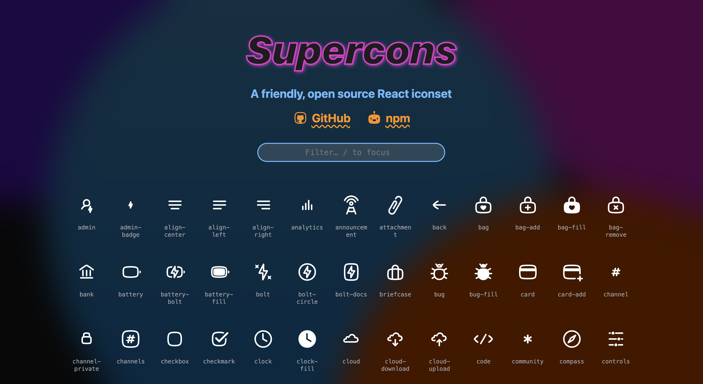

在线地址：[https://supercons.vercel.app/](https://supercons.vercel.app/)

## 2. React Icons
react-icons 提供了项目中常用的一些图标，它是一个图标集，可以使用 ES6 导入，只需要导入需要的图标即可。我们还可以对图标进行自定义颜色或大小。

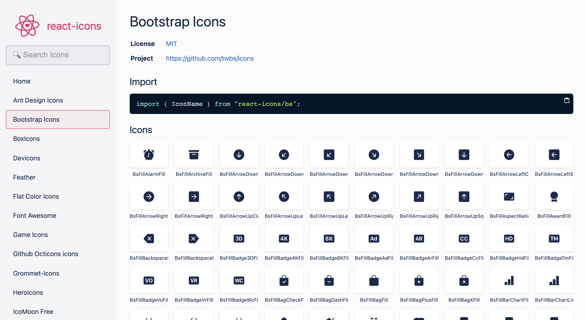

在线地址：[https://react-icons.github.io/react-icons](https://react-icons.github.io/react-icons)

## 3. React Native Vector Icons
这是一个适用于 React Native 矢量图标库，矢量图标的优点之一就是它们是可扩展的，也就是说这些图标将适用于任何设备或屏幕尺寸。因此，我们可以为多种设备设计网站。矢量图标也能够在不损失质量的情况下在高分辨率显示器上使用。该库也是一个图标集，包含多个图标库中的图标。

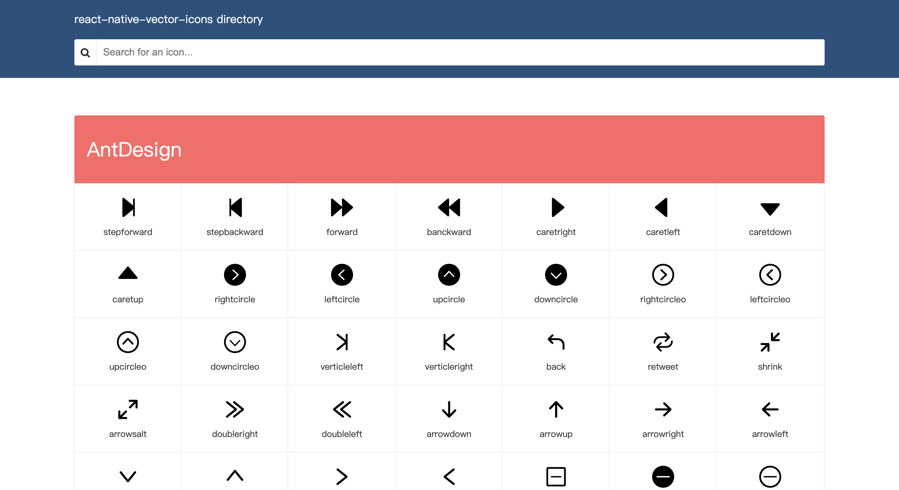

在线地址：[https://oblador.github.io/react-native-vector-icons/](https://oblador.github.io/react-native-vector-icons/)

## 4. Styled Icons
Styled Icons 包含了很多图标集，如 Font Awesome、Material Design、Octicons等，它们可以作为 React 样式组件使用。

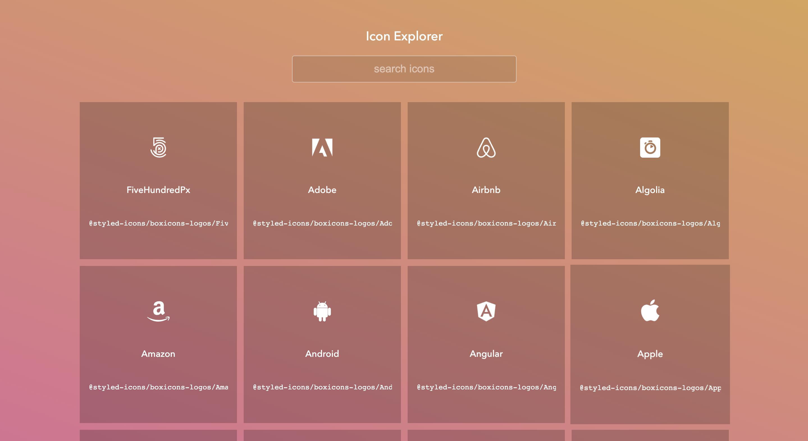

在线地址：[https://styled-icons.dev/](https://styled-icons.dev/)

## 5. React Feather Icons
Feather 是在 Apache License 2.0 下发布的一组简单的、轻量级的图标。它分为四大类：Feather Icons、Feather SVG、Feather CLI 和 Feather Webpack Plugin。React-Feather 库提供了很多组件，这些组件导入和使用起来也很方便，因为它预制了各种主题，开箱即用。

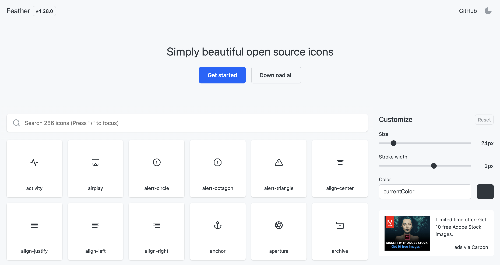

在线地址：[https://feathericons.com/](https://feathericons.com/)

## 6. IconPark
IconPark 提供超过 2400 个高质量图标，还提供了每个图标的含义和来源的描述，便于开发者使用。除此之外，该网站还可以自定义图标，这是与其他图标网站与众不同的地方。该图标库是字节跳动旗下的技术驱动图标样式的开源图标库。

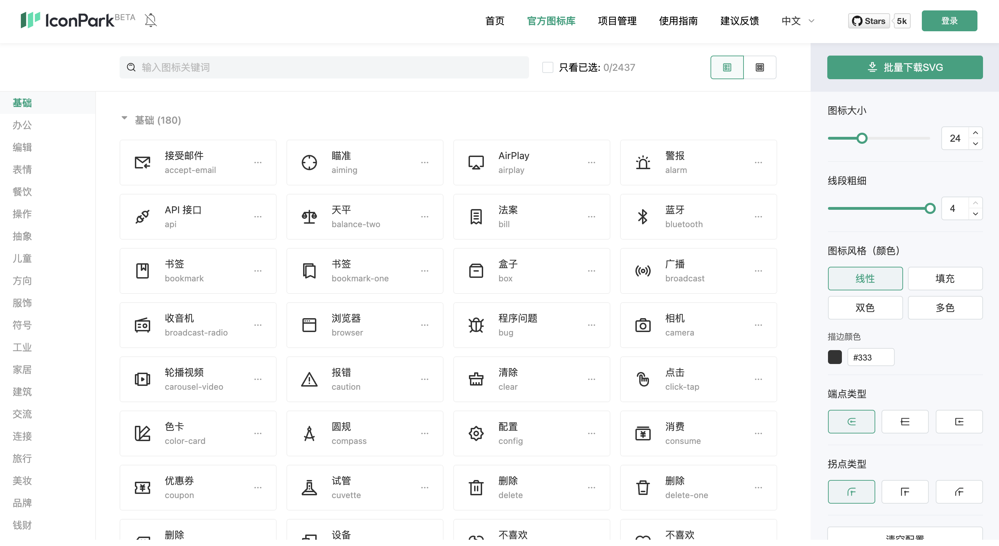

在线地址：[https://iconpark.oceanengine.com/home](https://iconpark.oceanengine.com/home)

## 7. React Social Icons
Grommet 图标集是一组使用 React 构建的 SVG 图标。该集合包括近 500 个可以使用 CSS 设置样式的图标。

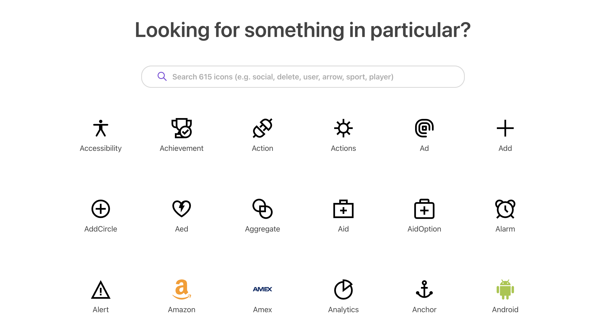

在线地址：[https://icons.grommet.io/](https://icons.grommet.io/)

## 8. React Svg Icons Kit
React Svg Icons Kit 是一个 svg 格式的图标集合。该工具包附带了一组用于这些图标的开箱即用的 React 组件，我们可以很容易的将它们添加到项目中。

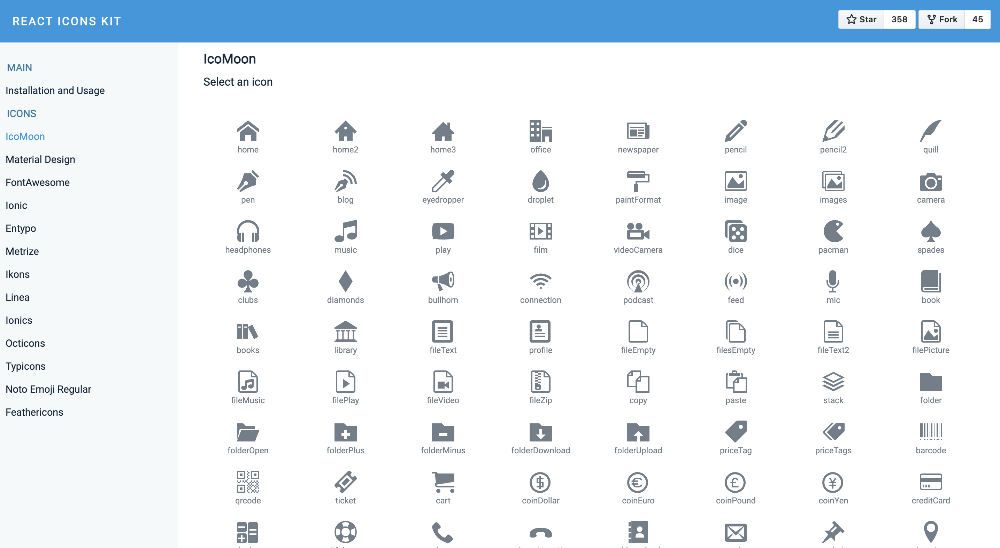

在线地址：[https://react-icons-kit.vercel.app/](https://react-icons-kit.vercel.app/)

## 9. Bootstrap Icons
React Bootstrap Icons 提供了300 多个流行的 Bootstrap 图标作为 React 组件，我们只需要将它们放在需要的位置即可。

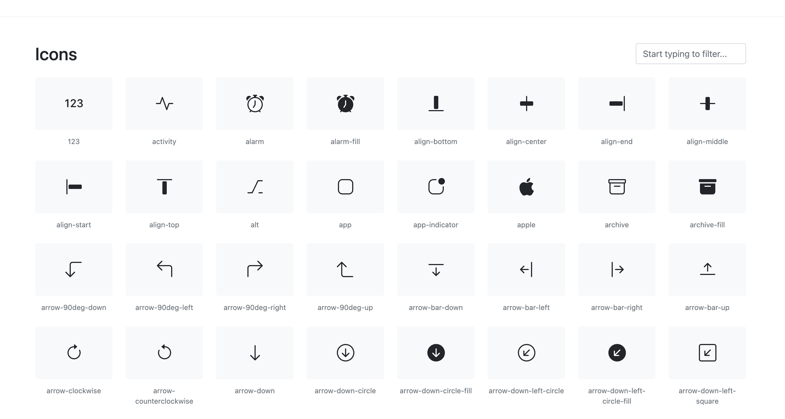

在线地址：[https://icons.getbootstrap.com/](https://icons.getbootstrap.com/)

## 10. Iconify for React
Iconify 是一个现代的开源 SVG 图标库，它提供了超过 40000 个图标，Iconify for React 为每个图标生成单独的文件，因此在编译应用程序时，只会捆绑在项目中使用的图标。

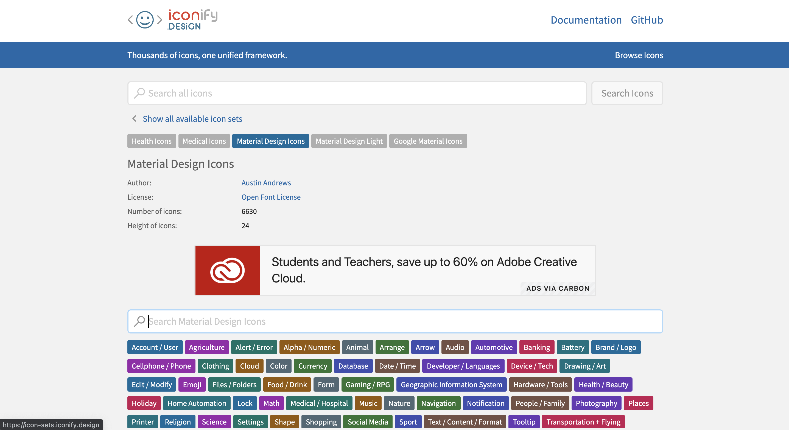

在线地址：[https://icon-sets.iconify.design/](https://icon-sets.iconify.design/mdi/)

## 11. React Unicons
React Unicon 为我们提供了两种不同的样式：SVG 和 EPS，这些矢量格式可以在多数场景下使用。

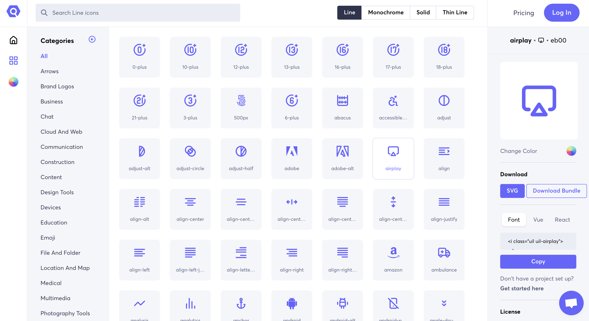

在线地址：[https://iconscout.com/unicons](https://iconscout.com/unicons)

## 12. React Geomicons
React Geomicons 是 Geomicons Open 的一个 React 图标组件，它是基于矢量的，因此开发人员能够创建可缩放的图标。我们还可以自定义图标的大小和颜色。

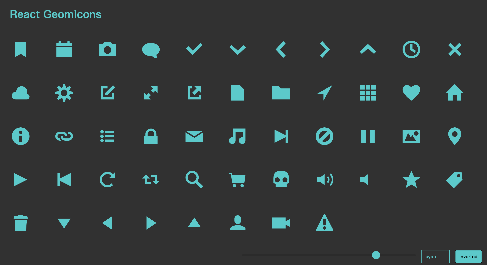

在线地址：[https://jxnblk.github.io/react-geomicons/](https://jxnblk.github.io/react-geomicons/)

## 13. React Evil Icons
React Evil Icons是一个 简单干净的 SVG 图标包，带有支持 Rails、Sprockets、Node.js、Gulp、Grunt 和 CDN 的代码。

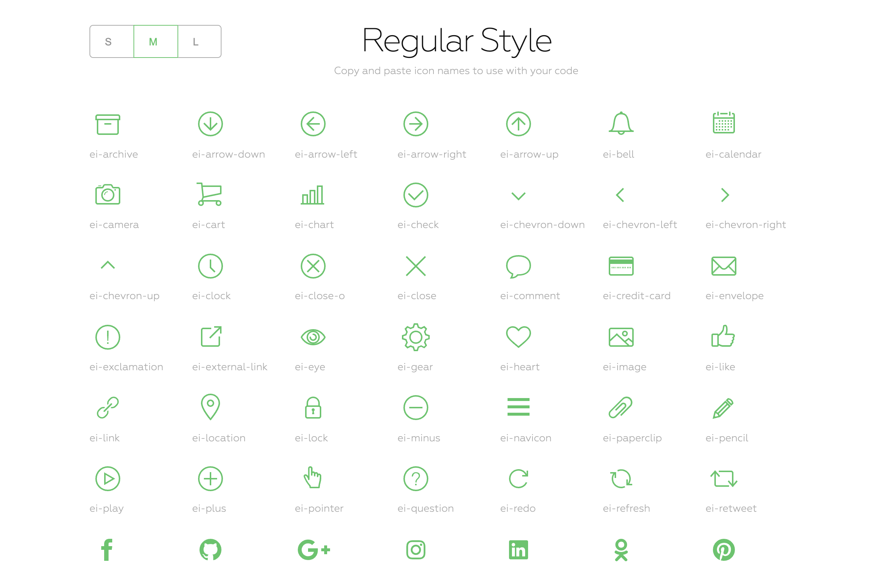

在线地址：[https://evil-icons.io/](https://evil-icons.io/)

## 14. React Bytesize Icons
React Bytesize Icons 允许开发人员在 React 项目中使用 SVG。这个库是一组 React 组件，它们主要应用于图标按钮、图标按钮 + 文字、图标列表、SVG 加载器。

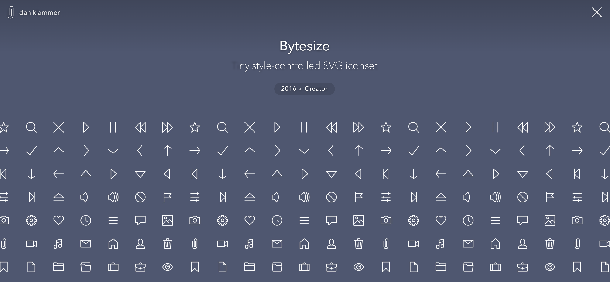

在线地址：[https://danklammer.com/bytesize-icons/](https://danklammer.com/bytesize-icons/)

## 15. React Material Icons
React Material Icons 图标是一个简单的 React 组件。它基于 react-shells 库，适用于 react 15.0 或更高版本。

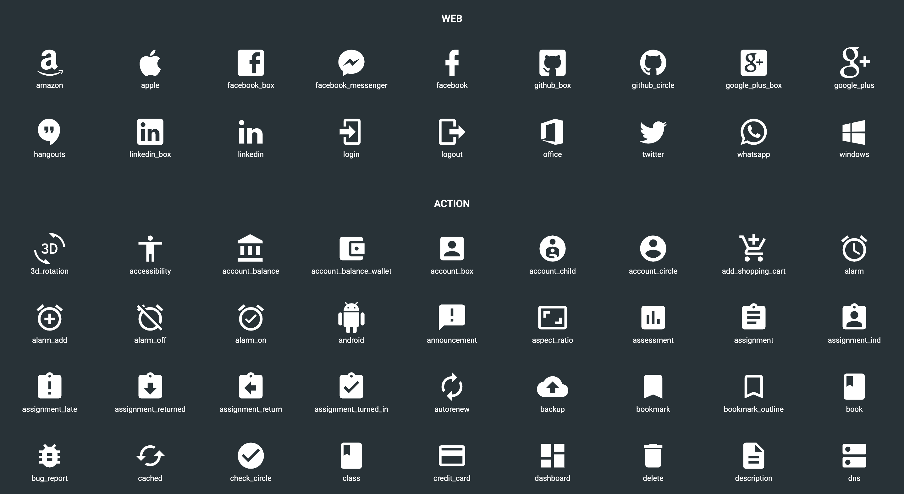

在线地址：[http://friktor.github.io/react-material-icons/](http://friktor.github.io/react-material-icons/)

  

> 更新: 2022-01-27 16:47:45  
> 原文: <https://www.yuque.com/cuggz/feplus/ugcmyn>