# React 库

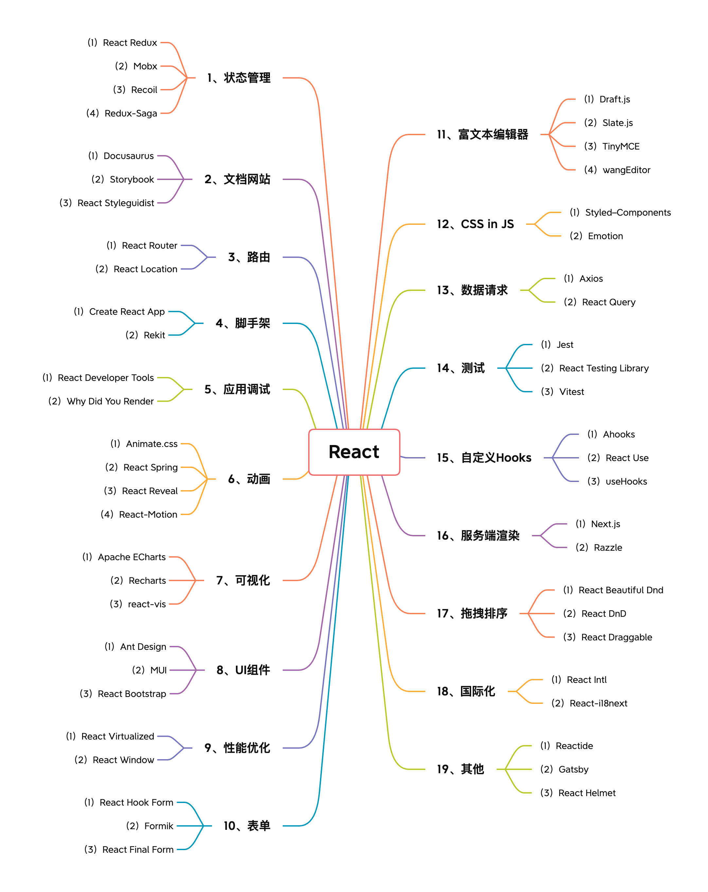

## 1、状态管理
### （1）React Redux
Redux 是 JavaScript 应用程序的状态容器，提供可预测的状态管理。React Redux 是 Redux 官方实现的 React 绑定。可以让你构建一致化的应用，运行于不同的环境（客户端、服务器、原生应用），并且易于测试。不仅于此，它还提供超爽的开发体验。

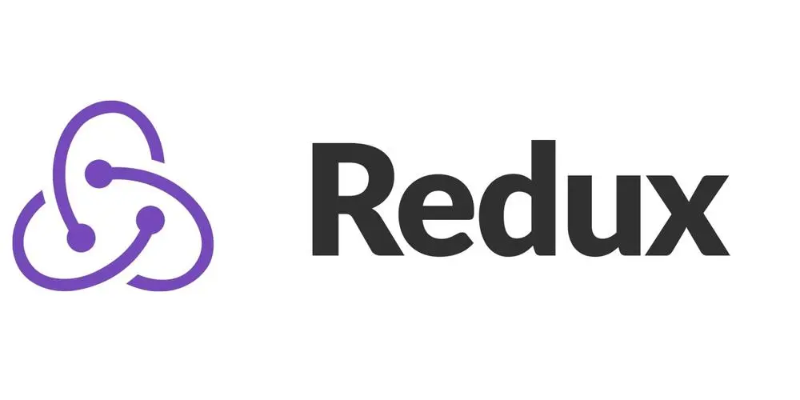

**Github：**[https://github.com/reduxjs/react-redux](https://github.com/reduxjs/react-redux)

### （2）Mobx
MobX 是一个身经百战的库，它通过运用透明的函数式响应编程使状态管理变得简单和可扩展。

**Github：**[https://github.com/mobxjs/mobx](https://github.com/mobxjs/mobx)

### （3）Recoil
Recoil 是一个用于 React 应用程序的实验性状态管理库。它提供了一些单独使用 React 难以实现的功能，同时兼容 React 的最新功能。

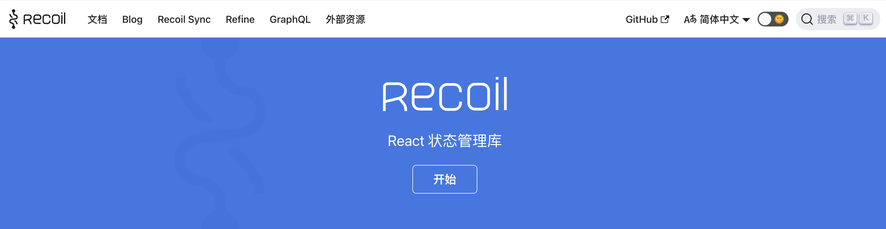

**Github：**[https://github.com/facebookexperimental/Recoil](https://github.com/facebookexperimental/Recoil)

### （4）Redux-Saga
redux-saga 是一个旨在使应用程序的副作用（即，数据获取等异步操作和访问浏览器缓存等不纯操作）更易于管理、执行更高效、易于测试以及更好地处理故障的库。

**Github：**[https://github.com/redux-saga/redux-saga](https://github.com/redux-saga/redux-saga)

## 2、文档网站
### （1）**Docusaurus**
Docusaurus 是由 facebook 开源的一个用于轻松构建、部署和维护开源项目网站的项目。使用 Docusaurus 可以让你**专注于内容**，并只需编写 Markdown 文件即可。

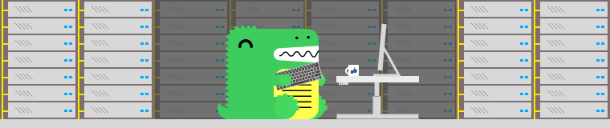

**Github：**[https://github.com/facebook/docusaurus](https://github.com/facebook/docusaurus)

### （2）Storybook
Storybook 是 UI 组件的开发环境，它允许开发者浏览组件库，查看每个组件的不同状态，以及交互地开发和测试组件。

**Github：**[https://github.com/storybookjs/storybook/](https://github.com/storybookjs/storybook/)

### （3）React Styleguidist
React Styleguidist是一个React设计规范生成器，一个本地组件开发环境，支持热重载，共享的设计规范。它会列出了组件propTypes，并基于Markdown文件显示可编辑的实时使用示例。

**Github：**[https://github.com/styleguidist/react-styleguidist](https://github.com/styleguidist/react-styleguidist)

## 3、路由
### （1）React Router
React Router 是完整的 React 路由解决方案。React Router 保持 UI 与 URL 同步。它拥有简单的 API 与强大的功能例如代码缓冲加载、动态路由匹配、以及建立正确的位置过渡处理。

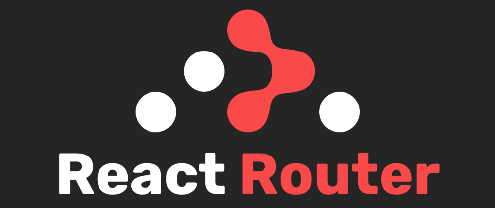

**Github：**[https://github.com/remix-run/react-router](https://github.com/remix-run/react-router)

### （2）React Location
React Location 是客户端 React 应用程序的路由器。它支持异步路由、深度集成的搜索参数 API、可选的 JSX 路由定义、用于路由加载器缓存的预打包简单缓存实现、带有外部缓存和存储的轻松集成等。

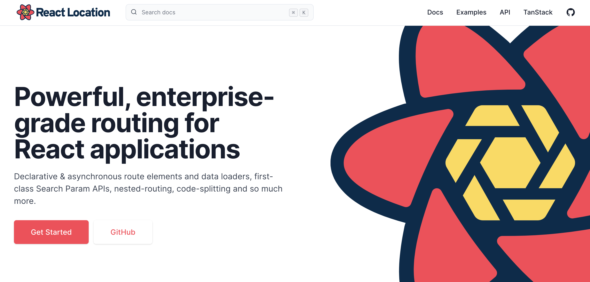

**Github：**[https://github.com/TanStack/location](https://github.com/TanStack/location)

## 4、脚手架
### （1）Create React App
Create React App 是一种官方支持的创建单页 React 应用程序的方式。它提供了一个没有配置的现代构建设置。

**Github：**[https://github.com/facebook/create-react-app](https://github.com/facebook/create-react-app)

### （2）Rekit
Rekit是开源的一个脚手架，用于使用 React、Redux 和 React-router 构建可扩展的 Web 应用程序。它可以帮助开发人员专注于业务逻辑，而不是处理大量的库、模式、配置等。

**Github：**[https://github.com/rekit/rekit](https://github.com/rekit/rekit)

## 5、应用调试
### （1）React Developer Tools
React Devtools 可以在 Chrome 和 Firefox 开发者工具审查 React 组件的浏览器扩展。可以用于检查React组件层次结构，在页面上显示React组件。

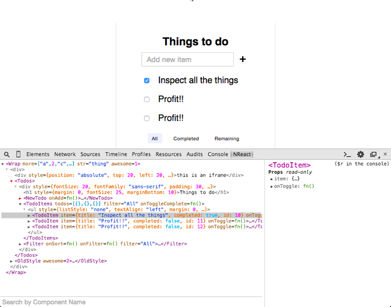

**安装地址：**[https://chrome.google.com/webstore/detail/react-developer-tools/fmkadmapgofadopljbjfkapdkoienihi?hl=zh-CN](https://chrome.google.com/webstore/detail/react-developer-tools/fmkadmapgofadopljbjfkapdkoienihi?hl=zh-CN)

### （2）Why Did You Render
Why Did You Render 是由 Welldone Software 开发的，可以在开发的时候就检测到一些不必要的渲染问题，告诉我们当前渲染是什么原因导致的。

**Github：**[https://github.com/welldone-software/why-did-you-render](https://github.com/welldone-software/why-did-you-render)

## 6、动画
### （1）Animate.css
animate.css 是一个使用CSS3的animation制作的动画效果的CSS集合，里面预设了很多种常用的动画，且使用非常简单。

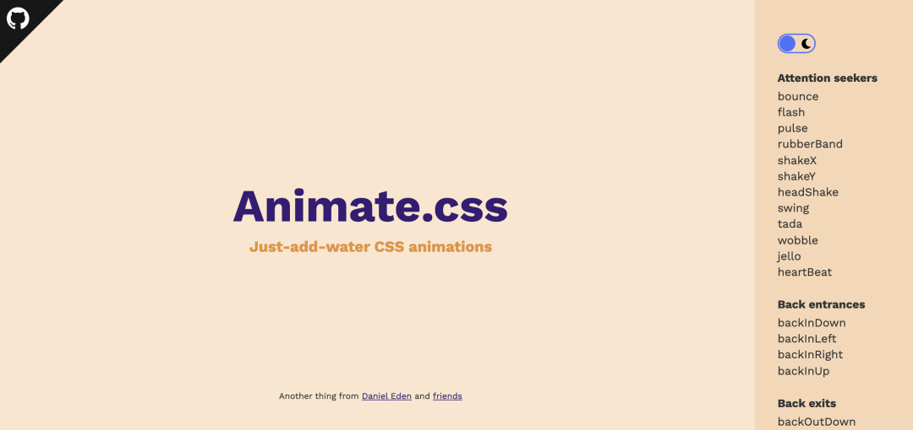

**GitHub：**[https://github.com/animate-css/animate.css](https://github.com/animate-css/animate.css)

### （2）React Spring
react-spring 是一个基于弹簧物理学的动画库，满足大多数与UI相关的动画需求，提供了足够灵活的工具，可以自信地将想法投射到不断变化的界面中。该库代表了一种现代动画方法。它继承了 animated 强大的插值和性能，以及 react-motion 的易用性。

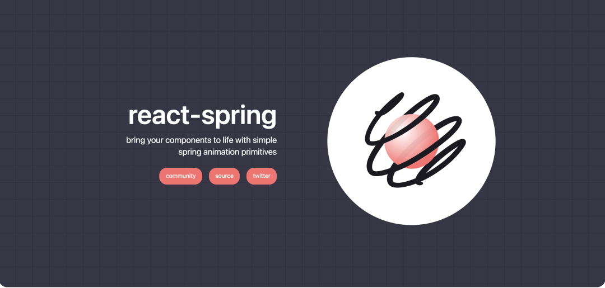

**GitHub：**[https://github.com/pmndrs/react-spring](https://github.com/pmndrs/react-spring)

### （3）React Reveal
React Reveal 是一个用于 React 的高性能动画库。它占用空间小，专门为 ES6 中的 React 编写。可用于创建各种炫酷的滚动效果显示。

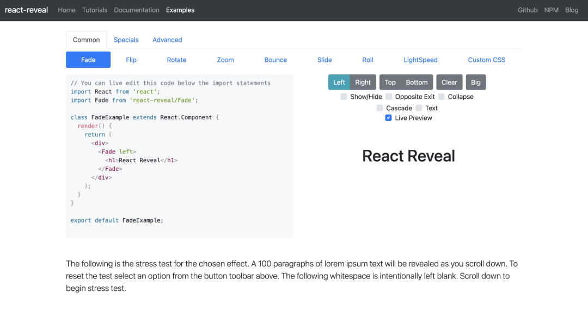

**GitHub：**[https://github.com/rnosov/react-reveal](https://github.com/rnosov/react-reveal)

### （4）React-Motion
React-Motion 是一个动画库，拥有一种更轻松的方法来创建和实现逼真的动画。它利用物理学来为 React 元素创建几乎自然的动画。

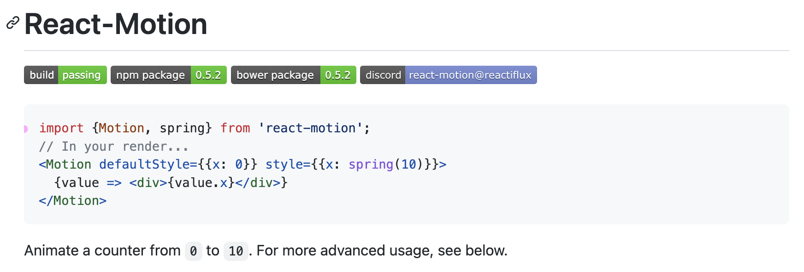

**Github：**[https://github.com/chenglou/react-motion](https://github.com/chenglou/react-motion)

## 7、可视化
### （1）Apache ECharts
Apache ECharts 是一款基于Javascript的数据可视化图表库，提供直观，生动，可交互，可个性化定制的数据可视化图表。它是用纯 JavaScript 编写的，基于zrender，是一个全新的轻量级画布库。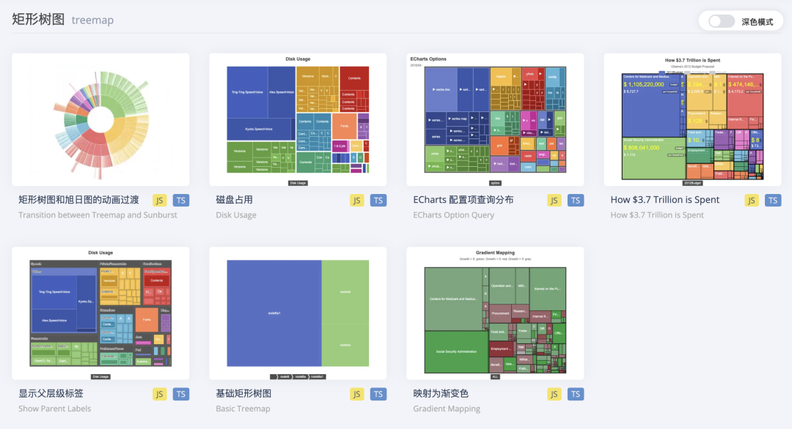

**GitHub：**[https://github.com/apache/echarts](https://github.com/apache/echarts)

### （2）Recharts
Recharts 是一个用React和D3构建的、重新定义的图表库。该库的主要目的是在 React 应用程序中轻松编写图表。

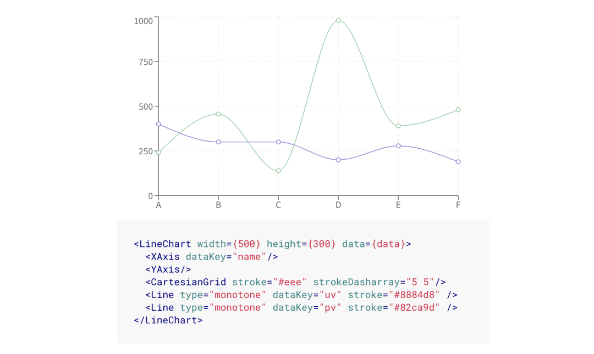

**GitHub：**[https://github.com/recharts/recharts](https://github.com/recharts/recharts)

### （3）react-vis
react-vis 是一组用于呈现常见数据可视化图表的 react 组件，例如折线图/面积图/条形图、热图、散点图、等高线图、六边形热图、饼图和圆环图、旭日形图、雷达图、平行坐标和树形图。

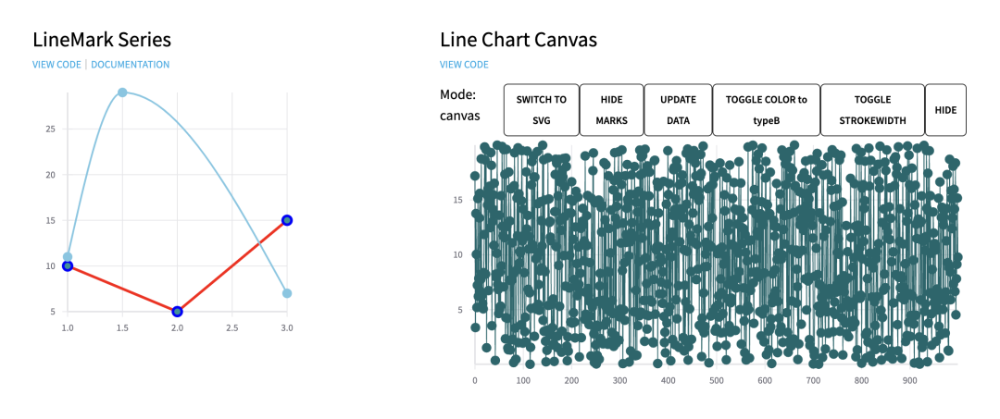

**GitHub：**[https://github.com/uber/react-vis](https://github.com/uber/react-vis)

## 8、UI组件
### （1）Ant Design
GitHub 上超过 269 k 个项目使用了 Ant Design 组件库，Ant Design of React 是一个基于 Ant Design 设计体系的 React UI 组件库，主要用于研发企业级中后台产品。Ant Design 提供了大量高质量的组件，非常适合快速构建整个 UI 框架，也可以只使用单个组件。

**GitHub**：[https://github.com/ant-design/ant-design](https://github.com/ant-design/ant-design)

### （2）MUI
MUI 是一个基于 Google 的 Material Design 的简单且可定制的 React 组件库。MUI 不仅是一个组件库，而是一个完整的设计系统。它具有一套完整的指南、设计原则和 UI 设计最佳实践系统。

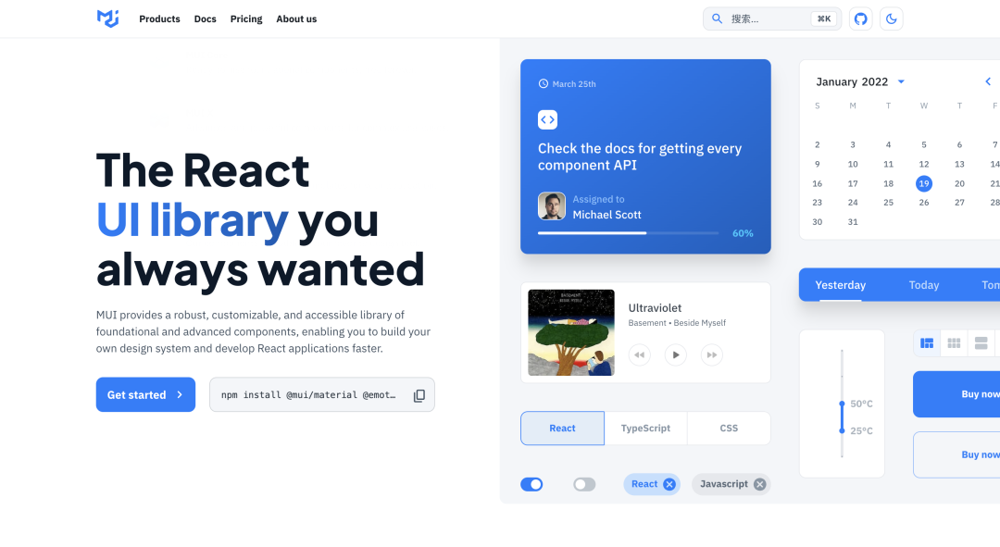

**GitHub**：[https://github.com/mui-org/material-ui](https://github.com/mui-org/material-ui)

### （3）React Bootstrap
React-Bootstrap，是比较古老的 React UI 组件库之一。它是使用 React 来重新构建了前端框架 Bootstrap。该库由完全响应并且可访问的现成的组件组成。所有设计元素都是高度可定制的。

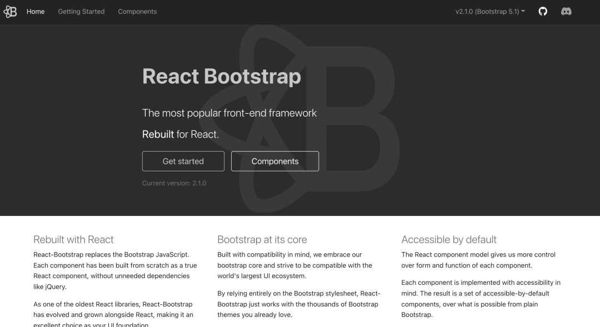

**GitHub**：[https://github.com/react-bootstrap/react-bootstrap](https://github.com/react-bootstrap/react-bootstrap)

## 9、性能优化
### （1）React Virtualized
React Virtualized 是一个以高效渲染大型列表和表格数据的响应式组件，可以用来解决长列表渲染问题。

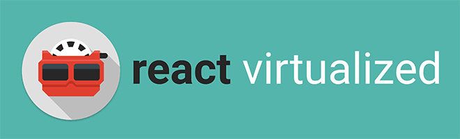

**Github：**[https://github.com/bvaughn/react-virtualized](https://github.com/bvaughn/react-virtualized)

### （2）React Window
React Window 是用于高效渲染大型列表和表格数据的 React 组件。通过仅渲染大型数据集的一部分（刚好足以填充满视口）来工作。

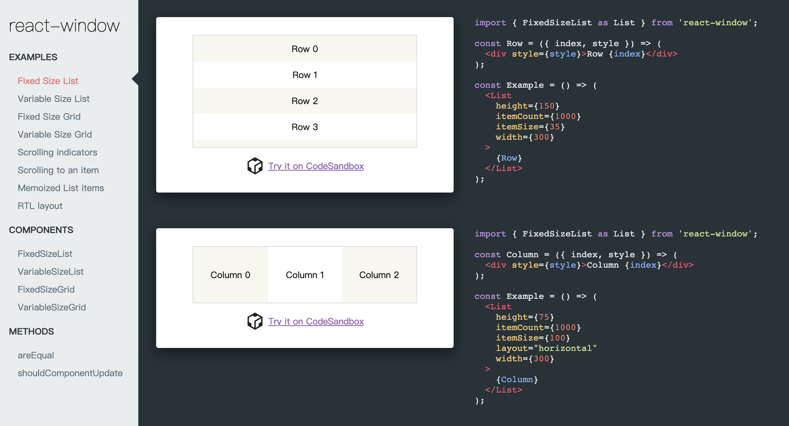

**Github：**[https://github.com/bvaughn/react-window](https://github.com/bvaughn/react-window)

## 10、表单
### （1）React Hook Form
React Hook Form 是一个高性能、灵活、易拓展、易于使用的表单校验库，用于 React Web 和 React Native 的表单验证。

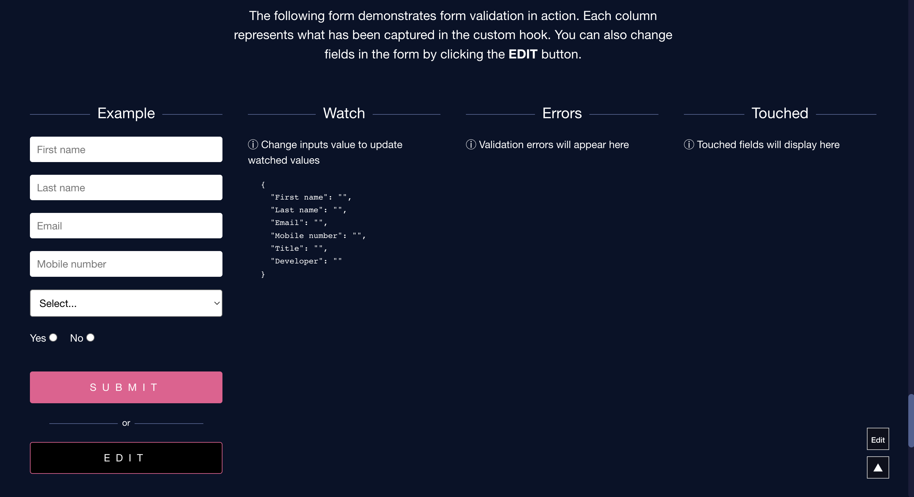

**GitHub**：[https://github.com/react-hook-form/react-hook-form](https://github.com/react-hook-form/react-hook-form)

### （2）Formik
Formik是一个可以在React中构建表单的组件。它旨在轻松管理具有复杂验证的表单，支持同步和异步表单级和字段级验证。

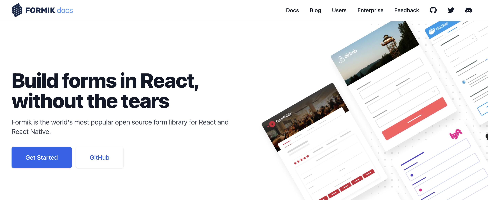

**GitHub**：[https://github.com/jaredpalmer/formik](https://github.com/jaredpalmer/formik)

### （3）React Final Form
React Final Form 是Final Form 的一个精简 React 包装器，它是一个基于订阅的表单状态管理库，使用观察者模式，因此只有需要更新的组件会随着表单状态的变化而重新渲染。

**GitHub**：[https://github.com/final-form/react-final-form](https://github.com/final-form/react-final-form)

## 11、富文本编辑器
### （1）Draft.js
Draft.js 是 Facebook 的一个开源项目，是 React 项目首选的富文本编辑器框架。这是一个健壮、可扩展和可定制的框架。Draft.js 遵循与 React 中的受控组件相同的范例，并提供了一个 Editor 呈现富文本输入的组件。它还公开了一个EditorStateAPI 来处理/存储Editor组件中的状态更新。

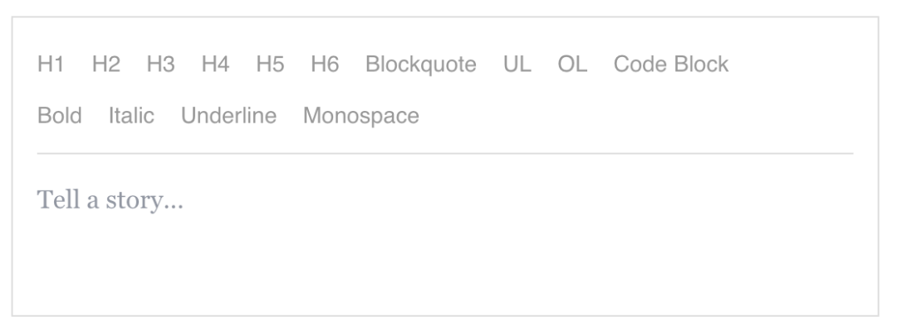

**GitHub：**[https://github.com/facebook/draft-js](https://github.com/facebook/draft-js)

### （2）Slate.js
Slate.js 是受 Draft.js 启发的富文本编辑器。它是一个可深度定制的富编辑器框架，专用于 React。与 Draft.js 类似，它具有良好的 API、强大的插件基础设施以及与 React 的深度连接。此外，插件生态系统比 Draft.js 小一些，但它的插件质量会更好。

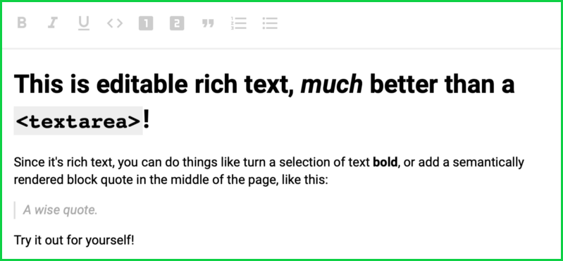

**GitHub：**[https://github.com/ianstormtaylor/slate](https://github.com/ianstormtaylor/slate)

### （3）TinyMCE
TinyMCE 是一个热门的富文本编辑器。它的目标是帮助其他开发人员构建精美的 Web 内容解决方案。它易于集成，可以部署在基于云的、自托管或混合环境中。该设置使得合并诸如 Angular、React 和 Vue 等框架成为可能。它还可以使用 50 多个插件进行扩展，每个插件都有 100 多个自定义选项。

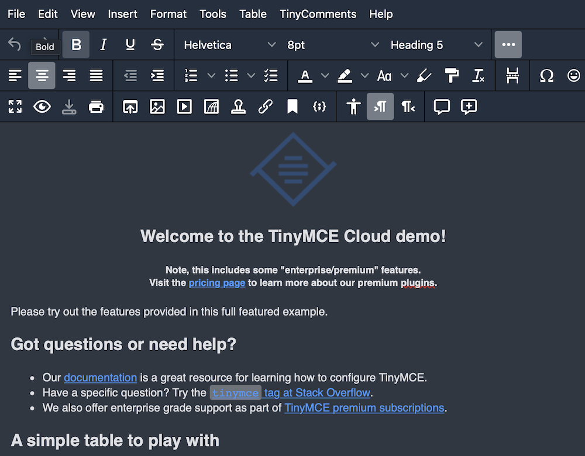

**GitHub：**[https://github.com/tinymce/tinymce](https://github.com/tinymce/tinymce)

### （4）wangEditor
wangEditor 是一个使用Typescript 开发的 Web 富文本编辑器， 轻量、简洁、易用、开源免费。它兼容常见的 PC 浏览器：Chrome，Firefox，Safar，Edge，QQ 浏览器，IE11。

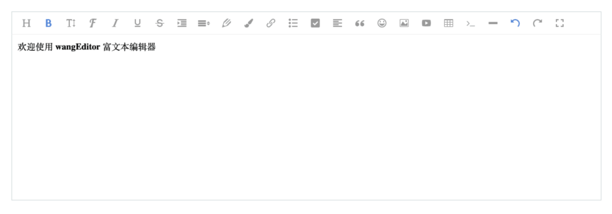

**GitHub：**[https://github.com/wangeditor-team/wangEditor/](https://github.com/wangeditor-team/wangEditor/)

## 12、CSS in JS
### （1）Styled–Components
styled-components 可以在 JavaScript 代码中使用 CSS 来设置 React 组件的样式。通过这个库可以自定义组件的样式，它会将给定的样式包装成一个组件，可以直接使用这个组件，也不需要组件和样式之间的映射，即创建后就是一个正常的React 组件。

**Github：**[https://github.com/styled-components/styled-components](https://github.com/styled-components/styled-components)

### （2）Emotion
Emotion 是一个高性能且灵活的 CSS-in-JS 库。基于许多其他 CSS-in-JS 库，它允许开发人员使用字符串或对象样式快速设置应用样式。

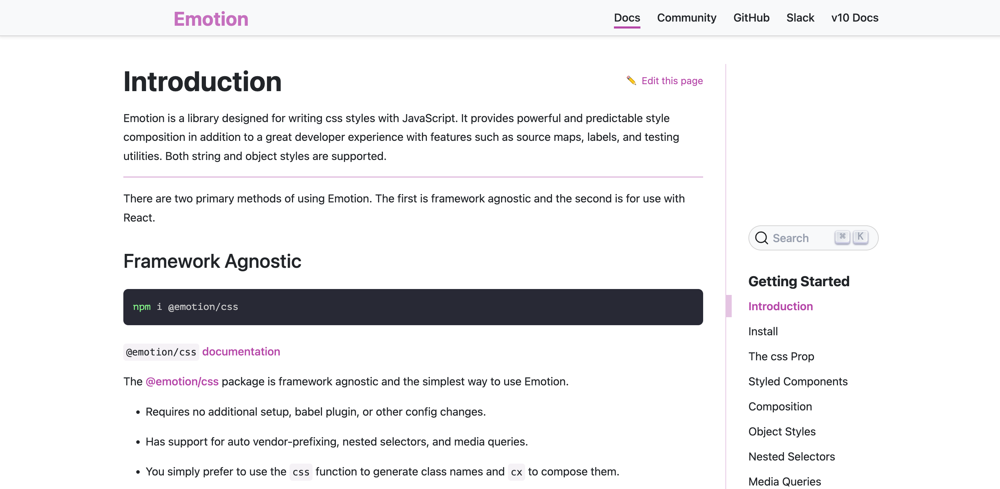

**Github：**[https://github.com/emotion-js/emotion](https://github.com/emotion-js/emotion)

## 13、数据请求
### （1）Axios
Axios 是一个基于 promise 网络请求库，作用于node.js 和浏览器中。 它是 isomorphic 的(即同一套代码可以运行在浏览器和node.js中)。在服务端它使用原生 node.js http 模块，而在客户端 (浏览端) 则使用 XMLHttpRequests。

**Github：**[https://github.com/axios/axios](https://github.com/axios/axios)

### （2）React Query
React Query 是一个适用于react hooks的请求库，它可以为任何类型的异步数据提供React状态管理功能，使React中的获取、缓存、同步和更新服务器数据变得轻而易举。

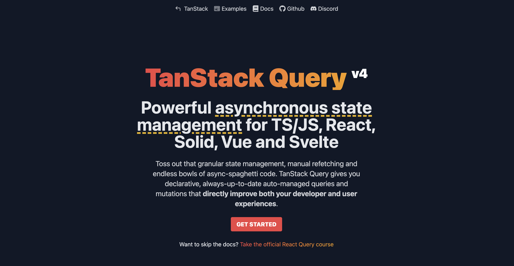

**Github：**[https://github.com/tanstack/query](https://github.com/tanstack/query)

## 14、测试
### （1）Jest
Jest 是由 Facebook 开发的 JavaScript 测试框架。它应该是测试 React 的首选，因为它是由 React 的发明者创建的，并且得到了 React 社区的支持和开发。它还支持 Babel、TypeScript、Node、Angular 和 Vue 以及其他 JS 框架。

**Github：**[https://github.com/facebook/jest](https://github.com/facebook/jest)

### （2）React Testing Library
React Testing Library 基于DOM Testing Library的基础上添加一些API，主要用于测试React组件。该库在使用过程并不关注组件的内部实现，而是更关注测试。该库基于react-dom和react-dom/test-utils，是以上两者的轻量实现。

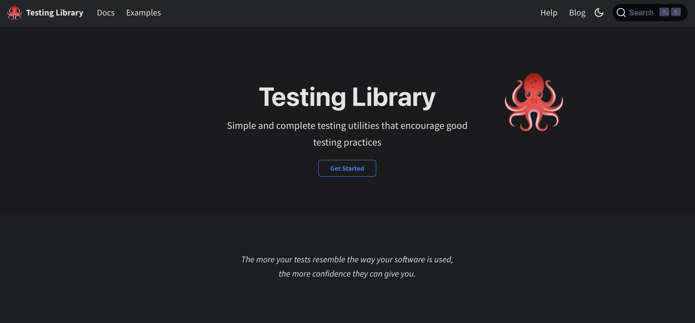

**Github：**[https://github.com/testing-library/react-testing-library](https://github.com/testing-library/react-testing-library)

### （3）Vitest
Vitest 是一个由 Vite 提供支持的极速单元测试框架。其和 Vite 的配置、转换器、解析器和插件保持一致、开箱即用的 TypeScript / JSX 支持、支持 Smart 和 instant watch 模式，如同用于测试的 HMR、内置 Tinyspy 用于模拟、打标和监察等。

**Github：**[https://github.com/vitest-dev/vitest](https://github.com/vitest-dev/vitest)

## 15、自定义Hooks
### （1）Ahooks
ahooks 是一套由阿里巴巴开源的 React Hooks 库，封装了大量好用的 Hooks。

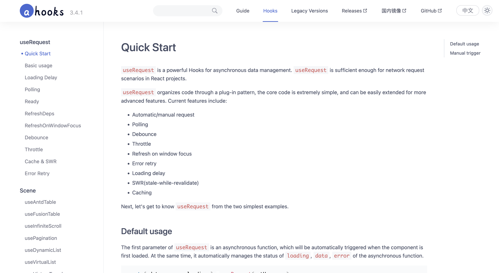

**Github：**[https://github.com/alibaba/hooks](https://github.com/alibaba/hooks)

### （3）React Use
React Use 是一个必不可少的 React Hooks 集合。其包含了传感器、用户界面、动画效果、副作用、生命周期、状态这六大类的Hooks。

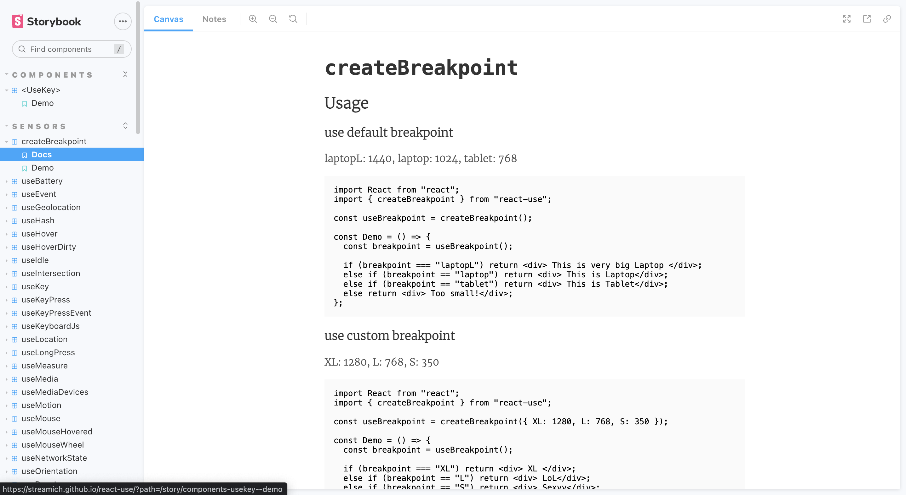

**Github：**[https://github.com/streamich/react-use](https://github.com/streamich/react-use)

### （3）useHooks
useHooks 是一组易于理解的 React Hook集合。

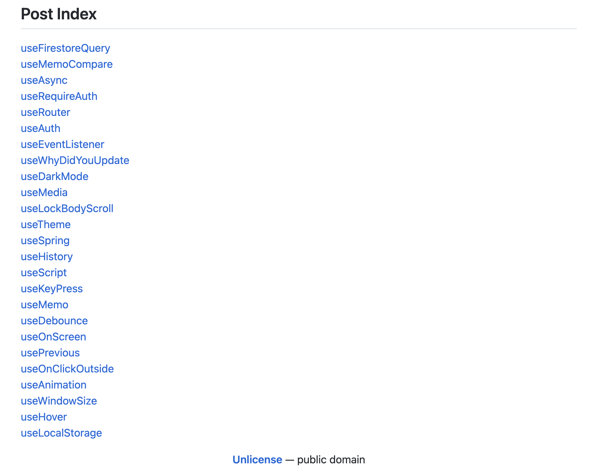

**Github：**[https://github.com/uidotdev/usehooks](https://github.com/uidotdev/usehooks)

## 16、服务端渲染
### （1）Next.js
Next.js 是一个用于服务器渲染的通用 JavaScript Web 应用程序的小型框架，该框架基于 React、Webpack 和 Babel 构建，为该网站提供了强大的支持。

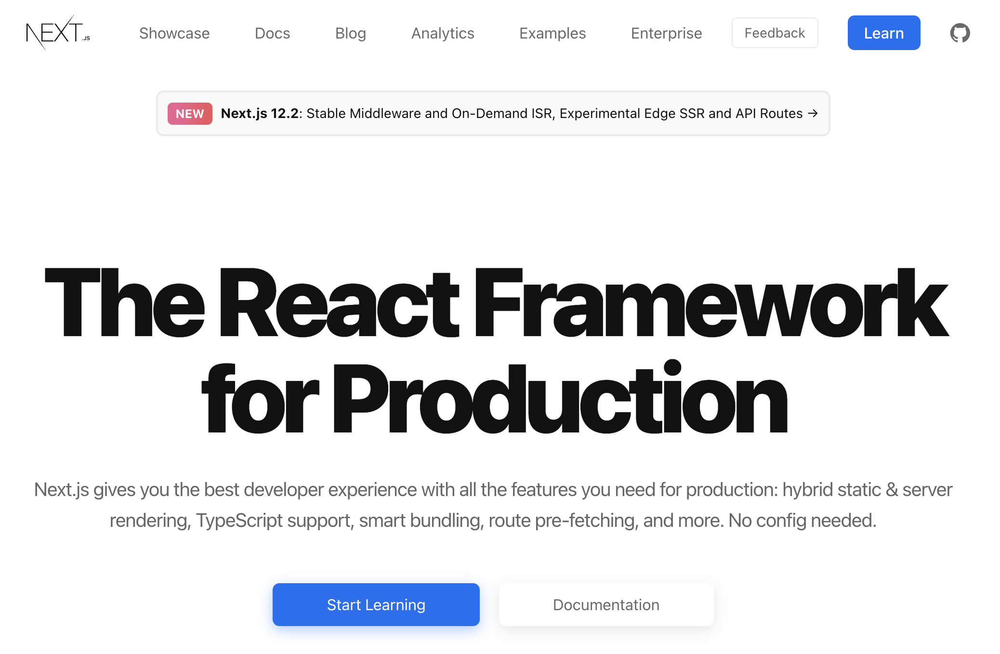

**Github：**[https://github.com/vercel/next.js](https://github.com/vercel/next.js)

### （2）Razzle
Razzle是类似于next.js的简单服务端框架，用于在服务端渲染 React 应用程序。比较方便的一点是无需配置。通过将一般的JavaScript应用抽象成单个的依赖，然后将框架，路由和数据提取出来。同时，Razzle 支持可插拔渲染。

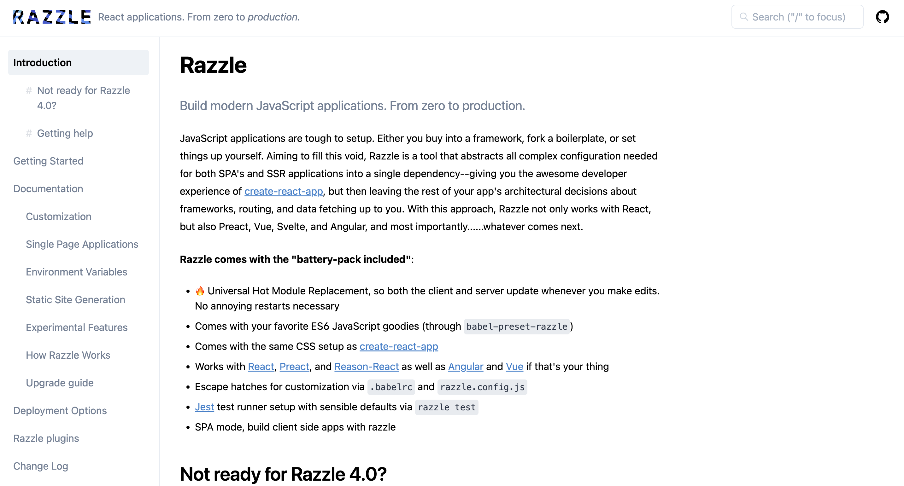

**Github：**[https://github.com/jaredpalmer/razzle](https://github.com/jaredpalmer/razzle)

## 17、拖拽排序
### （1）React Beautiful Dnd
react-beautiful-dnd 是一款美观且简单易用的 React 列表拖拽库。其动画效果自然，性能优秀，简洁而强大的 API，易于上手，与标准浏览器的互动性非常好。  

**Github：**[https://github.com/atlassian/react-beautiful-dnd](https://github.com/atlassian/react-beautiful-dnd)

### （2）React DnD
React DnD是 React 和 Redux 核心作者 Dan Abramov 创造的一组React 高阶组件，可帮助我们构建复杂的拖放界面，同时保持组件解耦。它可以在应用程序的不同部分之间通过拖动传输数据，并且组件会更改其外观和应用状态以响应拖放事件。

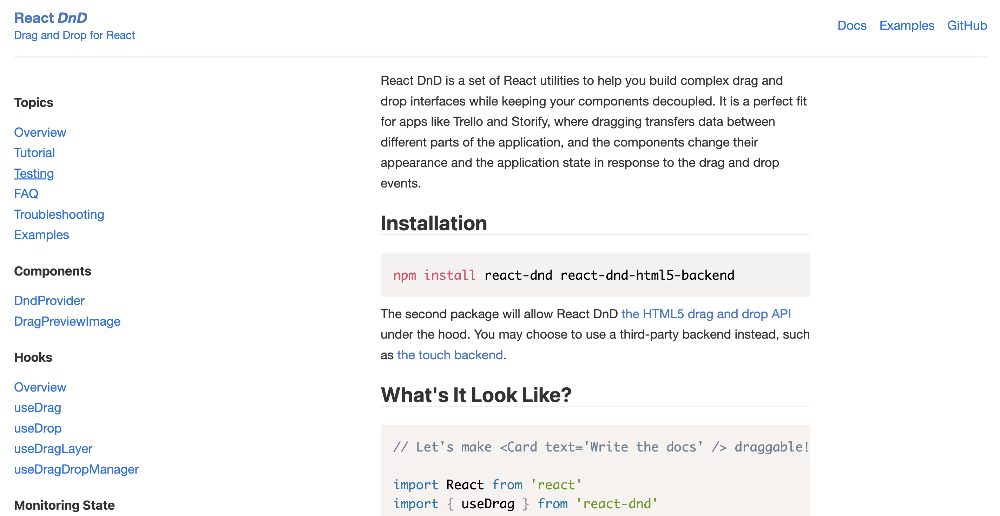

**Github：**[https://github.com/react-dnd/react-dnd](https://github.com/react-dnd/react-dnd)

### （3）**React Draggable**
React-Draggable 库简单易用，将 CSS 中的 transform 应用于 React 组件，允许我们在 UI 中拖动组件。它有不同的 props 可以让你改变组件的行为，是创建直观、用户友好界面的绝佳选择。

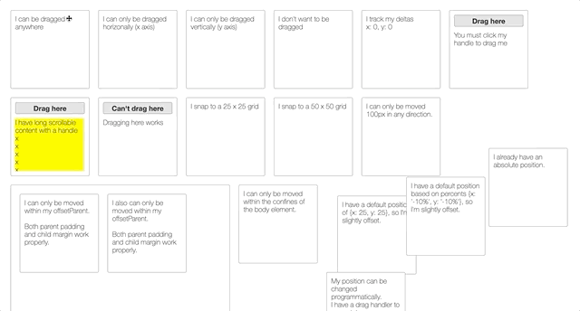

**Github：**[https://github.com/react-grid-layout/react-draggable](https://github.com/react-grid-layout/react-draggable)

## 18、国际化
### （1）React Intl
React Intl 提供了一个 React 组件和用于国际化 React Web 应用的 Mixin。它提供一个格式化日期、数字、字符串消息的描述方式。

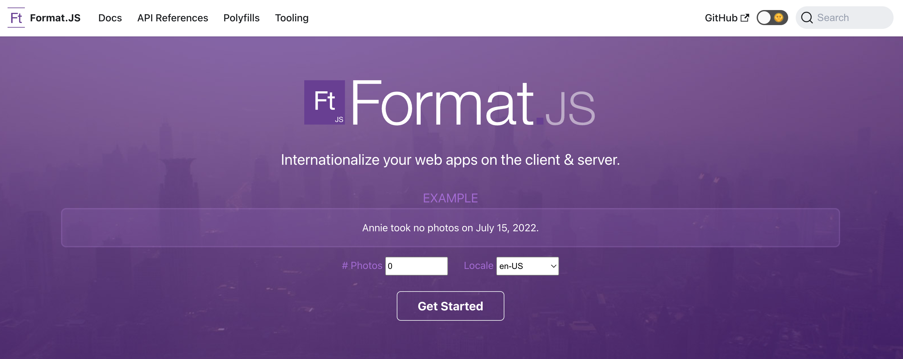

**Github：**[https://github.com/formatjs/formatjs](https://github.com/formatjs/formatjs)

### （2）React-i18next
react-i18next 是基于 i18next 的一款强大的国际化框架，可以用于 react 和 react-native 应用，是目前非常主流的国际化解决方案。

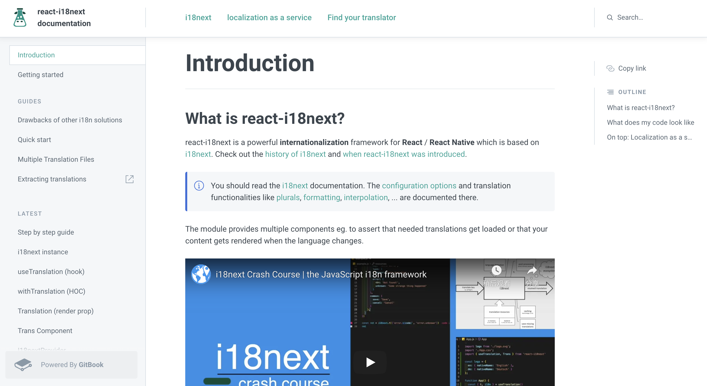

**Github：**[https://github.com/i18next/react-i18next](https://github.com/i18next/react-i18next)

## 19、其他
### （1）Reactide
Reactide 是首个用于 React Web 应用开发的专用 IDE 。它是一个跨平台的桌面应用程序，提供了一个自定义模拟器，不需要构建工具和服务器配置，开箱即用。 Reactide 将开发带回到打开单个文件的日子，立即在浏览器中呈现项目。 使用 Reactide，开发人员可以使用单个 React JSX 文件实现相同的简单性，同时利用 React 的强大功能。

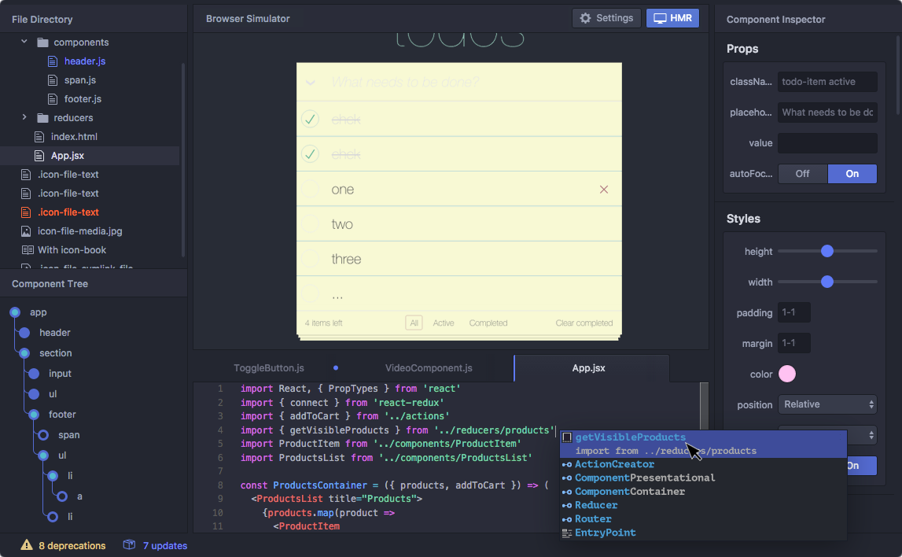

**Github：**[https://github.com/reactide/reactide](https://github.com/reactide/reactide)

### （2）Gatsby
Gatsby 是基于 React 构建的静态站点生成器，拥有丰富的插件生态，其主要目标之一是交付访问速度快速的网页，它通过利用良好的缓存、静态页面生成和基于边缘的 CDN 数据源来实现这一目标。

**Github：**[https://github.com/gatsbyjs/gatsby](https://github.com/gatsbyjs/gatsby)

### （3）React Helmet
React Helmet是一个HTML文档head管理工具，管理对文档头的所有更改。Helmet采用纯 HTML 标签并输出纯 HTML 标签。它非常简单，而且对 React 初学者友好。

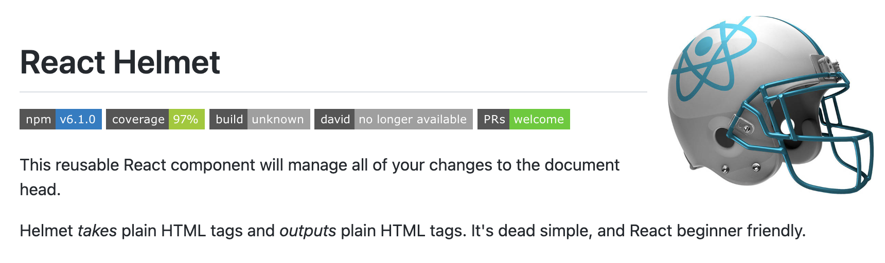

**Github：**[https://github.com/nfl/react-helmet](https://github.com/nfl/react-helmet)

  
  

> 更新: 2022-08-08 19:42:37  
> 原文: <https://www.yuque.com/cuggz/feplus/mxnsm1>