# React 生态系统

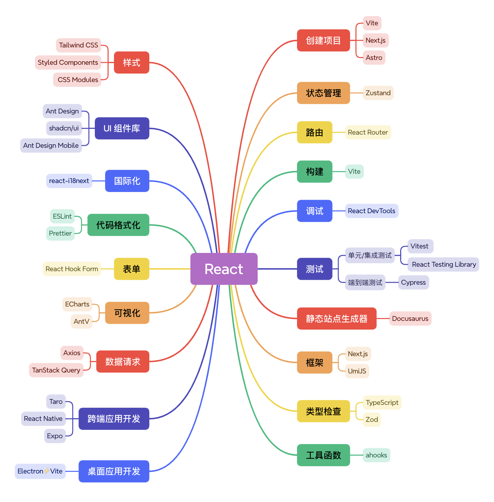

## 创建项目：Vite / Next.js / Astro

* Vite：适用于**客户端渲染**的 React 应用。
* Next.js：适用于**服务端渲染**的 React 应用。
* Astro：适用于**静态生成**的 React 应用。

### Vite

Vite 是一款现代的JavaScript构建工具，旨在简化前端开发流程，实现快速的开发体验和热更新功能。作为 create-react-app（CRA）的理想替代方案， Vite 的设计理念是不在功能层面对React产生干扰，让开发者能够更专注于 React 本身，而非框架的限制。

Vite 主要针对单页面应用和客户端渲染进行了优化，因此，对于客户端渲染的项目来说，使用 Vite 创建新项目是更为合适的选择。

### Next.js

Next.js 是一个成熟度很高的 React 框架，也是 React 官方推荐的创建新的 React 项目的首选方式。Next.js 凭借其丰富的内置功能（如基于文件的路由）为 React 开发提供了强大的支持。

Next.js 将服务端渲染（SSR）作为其主要的渲染技术，因此，对于服务端渲染的项目来说，使用 Next.js 创建新项目是更为合适的选择。

### Astro

Astro 是一个多功能的 Web 框架，专为构建快速、以内容为中心的静态网站而设计。它通过服务器优先的API设计和默认零JavaScript运行时开销，提供了出色的性能。其主要特性如下：

* **以内容为中心**：专为展示丰富的内容而设计\*\*\*\*。
* **服务器优先**：在服务器上渲染HTML，提高运行速度\*\*\*\*。
* **默认零JS**：减少客户端资源消耗，加快加载速度。
* **可定制**：提供Tailwind、MDX等超过100个集成选项\*\*\*\*。
* **框架无关**：支持React、Preact、Svelte等多种框架。

**使用场景**：Astro 非常适合构建博客、营销网站、电子商务网站、文档网站、个人作品集、着陆页和社区网站等，特别是那些需要快速加载和良好SEO优化的场景。

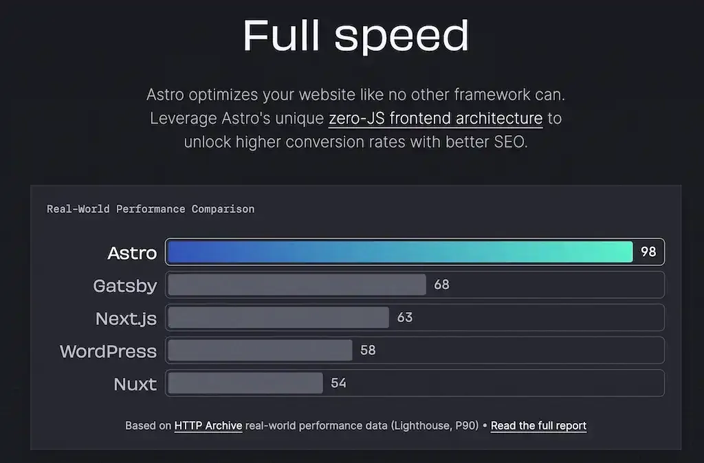

**Github：**<https://github.com/withastro/astro>

## 状态管理：Zustand

Zustand 是一个现代 React 状态管理库，旨在简化状态管理，提供简洁、可扩展和高效的状态管理解决方案。这两年 Zustand 增长速度很快，越来越多的开发者选择使用 Zustand 作为其首选的 React 状态管理工具

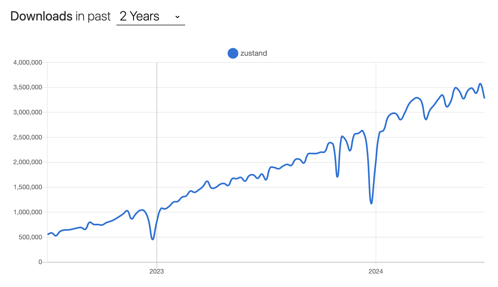

**GitHub：**<https://github.com/pmndrs/zustand>

## 路由：React Router

React Router 是一个用于构建单页面应用(SPA)的流行 JavaScript 路由库，也是官方推荐的路由库。

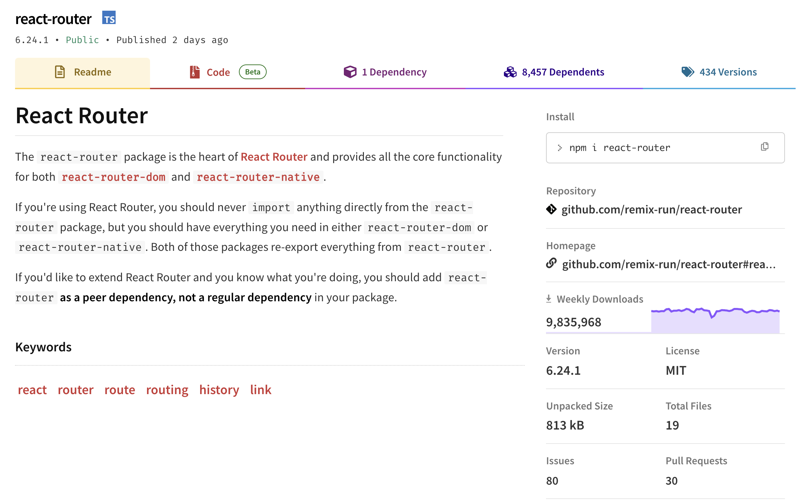

**Github：**<https://github.com/remix-run/react-router>

## 构建：Vite

Vite 是一个轻量级的、速度极快的下一代前端构建工具，对 Vue SFC 提供第一优先级支持。它最初是为 Vue 3 项目而创建的，但也可以用于其他框架，如 React、Svelte、Preact 等，目前已被多个前端框架作为默认的构建工具。

**Github**：<https://github.com/vitejs/vite>

## 调试：React DevTools

React DevTools 是一个用于检查和分析React应用程序的浏览器扩展。它允许开发者深入了解React组件树的结构和状态，以及组件之间的交互。

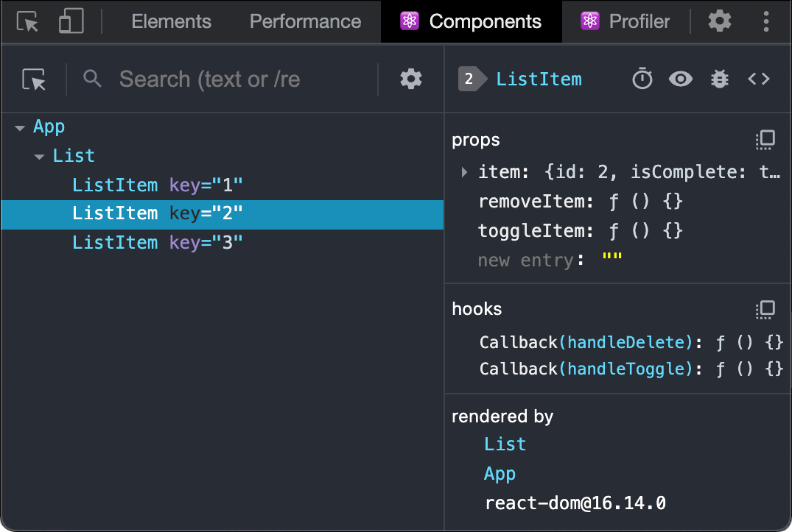

## 测试：Vitest / React Testing Library / Cypress

在 React 项目中，推荐使用以下框架进行测试：

* 单元/集成测试：Vitest + React Testing Library
* 端到端测试（E2E）：Cypress

### 单元/集成测试

Vitest 是一个基于 Vite 的下一代测试框架，旨在提供快速、高效的单元测试体验。它支持多种测试运行器、测试框架和覆盖率报告工具，可以为组件提供即时响应的测试反馈。值得一提的是，Vitest 仅用了两年时间，每周下载量就达到了 500w+。

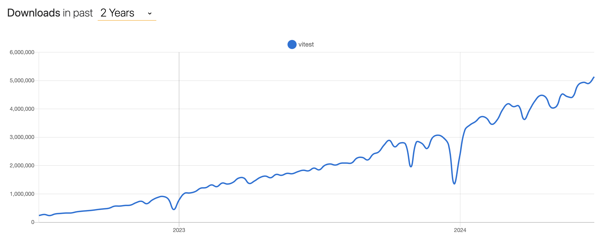

**Github：**<https://github.com/vitest-dev/vitest>

React Testing Library 是一个专门为 React 设计的测试库，它提供了一套用于测试React组件的API。它遵循“以用户为中心”的测试理念，专注于测试组件的功能和交互，而不是内部实现细节。

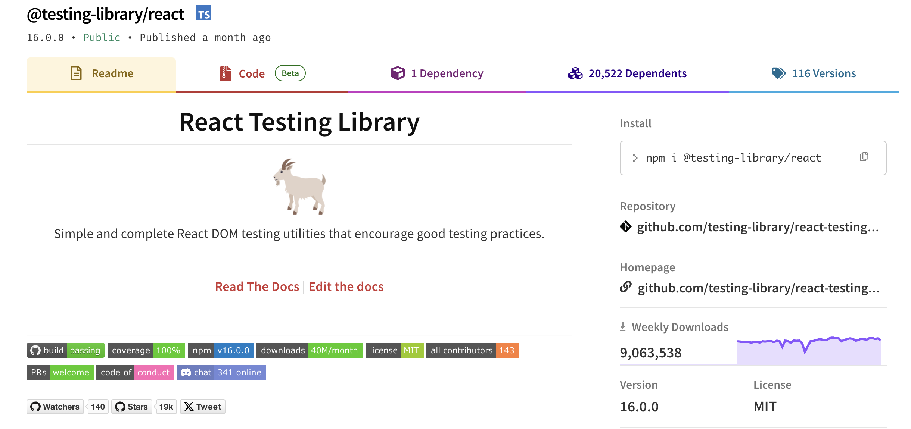

**Github：**<https://github.com/testing-library/react-testing-library>

Vitest 和 React Testing Library 的结合使用，可以实现对 React 组件的单元测试和集成测试。使用 Vitest 作为测试运行器，结合 React Testing Library 的测试方法，可以构建高效的测试流程。通过自动化的测试执行和结果验证，可以显著提高测试的效率和准确性。

> 单元测试可以针对组件的单个函数或模块进行测试，而集成测试则可以验证组件之间的交互和整个应用的行为。

### 端到端测试

Cypress 是一个用于编写端到端测试的开源 JavaScript 测试框架，专注于提供简单易用、可靠稳定的测试环境，用于测试Web应用。在 Vue 项目中，推荐其用于 E2E 测试，也可以通过 Cypress 组件测试运行器来给 Vue SFC 作单文件组件测试。

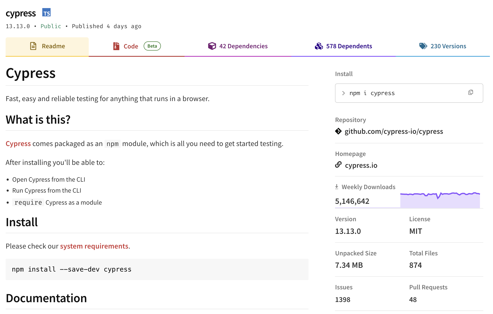

**Github：**<https://github.com/cypress-io/cypress>

## 静态站点生成器：Docusaurus

Docusaurus是 Facebook 开源的一个静态站点生成器，旨在帮助用户快速构建美观、易于维护的文档站点。它提供了一套全面的工具和功能，使用户能够专注于编写内容，而无需花费大量时间和精力来构建和设计网站。

**GitHub：**<https://github.com/facebook/docusaurus>

## 框架：Next.js / UmiJS

如果要做 SSR，Next.js 是非常好的选择，而如果只做 CSR，Umi 会是更好的选择：

* **客户端渲染**：Next.js
* **服务端渲染**：UmiJS

### Next.js

Next.js是一个轻量级的框架，用于构建React应用程序，它提供了许多增强功能，如服务器渲染、静态生成、路由等，以简化开发流程并提高性能和开发体验。Next.js的核心目标是通过使用React的服务端渲染功能，自动将JS代码编译成DOM元素，从而简化SSR的开发过程，并提升应用程序的性能。

目前，Next.js 的下载量在所有前端框架中排第二，仅次于 React。

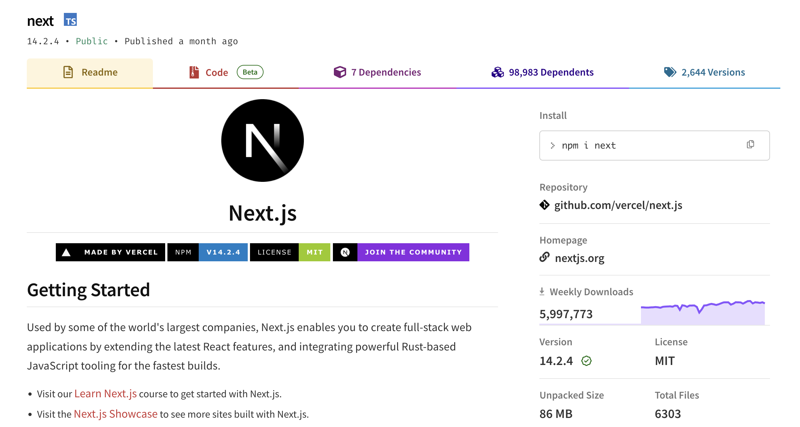

**Github：**<https://github.com/vercel/next.js>

### UmiJS

UmiJS 是蚂蚁集团开源的一个可扩展的企业级 React 应用框架，Umi 以路由为基础，同时支持配置式路由和约定式路由，保证路由的功能完备，并以此进行功能扩展。然后配以生命周期完善的插件体系，覆盖从源码到构建产物的每个生命周期，支持各种功能扩展和业务需求。

相比于 Next.js，Umi 的扩展性会更好；并且 Umi 做了很多更贴地气的功能，比如配置式路由、补丁方案、Antd 的接入、微前端、国际化、权限等。

**Github：**<https://github.com/umijs/umi>

## 类型检查：TypeScript / Zod

### TypeScript

TypeScript 是 JavaScript 的一个超集，添加了静态类型检查和一些其他的语言特性。现代前端项目基本标配 TypeScript，目前 TypeScript 的周下载量高达 5200 万。

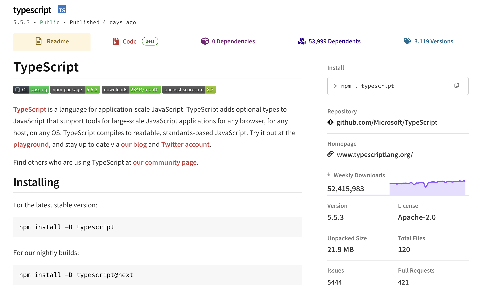

React 官方文档中提供了在 Vue 中使用 TypeScript 的指南：<https://zh-hans.react.dev/learn/typescript>

### Zod

Zod 是一个基于 TypeScript 的模式验证库，提供简洁的 API 和编译时类型安全，用于在运行时验证 JavaScript 或 TypeScript 应用中的输入数据。它支持模式继承、自定义错误信息、异步验证，并能与 TypeScript 紧密集成，适用于需要严格数据验证的各种场景。

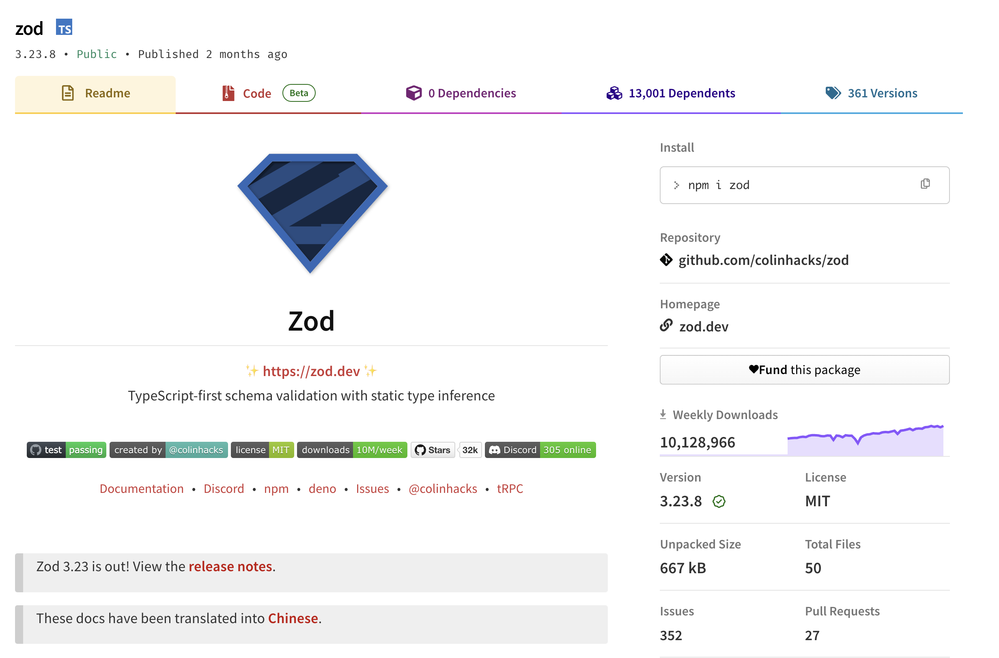

**Github：**<https://github.com/colinhacks/zod>

## 工具函数：ahooks

ahooks 是一个由阿里巴巴团队开发的 React Hooks 库，提供了一系列高效、易用的钩子函数，如数据请求、状态管理、性能优化等，旨在简化 React 应用开发，减少样板代码，并支持 TypeScript，适合用于构建复杂和高效的前端应用。

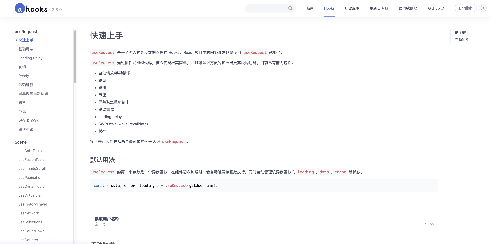

**Github：**<https://github.com/alibaba/hooks>

## 国际化：react-i18next

react-i18next 是一个用于 React 应用的国际化（i18n）解决方案。它基于i18next库，为React和React Native应用提供了一种简单且灵活的方式来实现多语言支持。

通过提供`useTranslation` Hook和`withTranslation`高阶组件，react-i18next 使得在React组件中使用翻译变得非常简单。

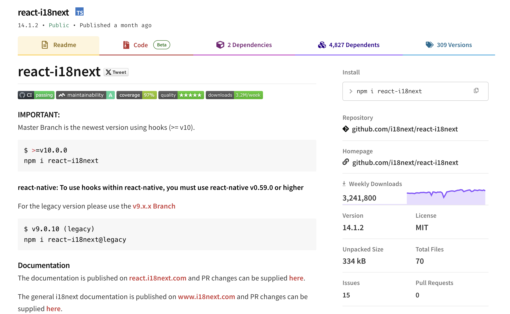

**Github：**<https://github.com/i18next/react-i18next>

## 样式：Tailwind CSS / Styled Components / CSS Modules

* CSS-in-CSS：CSS Modules
* CSS-in-JS：Styled Components
* 实用优先：Tailwind CSS

### CSS Modules

CSS Modules 是一种 CSS 文件组织技术，它通过局部作用域封装和自动命名类名来避免样式冲突，并提高组件的可维护性。它易于维护和组合，且与现代前端构建工具和框架兼容，使得在大型应用和组件库开发中管理样式变得更加安全和高效。

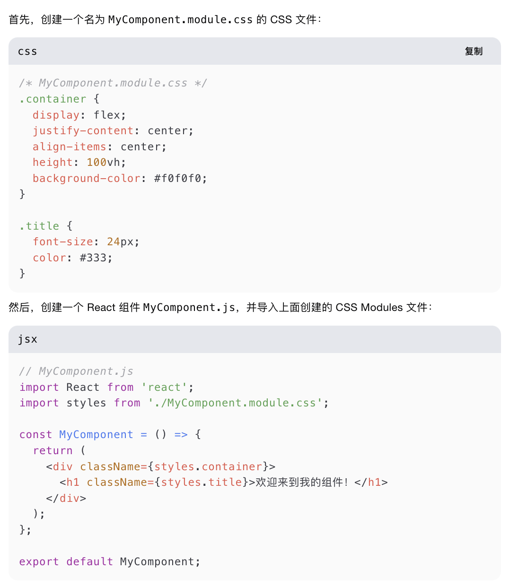

### Styled Components

Styled Components 是一个用于 React 的 CSS-in-JS 库，它通过标记模板字面量提供了一种声明式方式来编写组件级的样式，支持动态样式、主题、服务器端渲染，并与 TypeScript 兼容，使得样式编写更直观、组件更易于维护，同时避免了全局样式冲突。

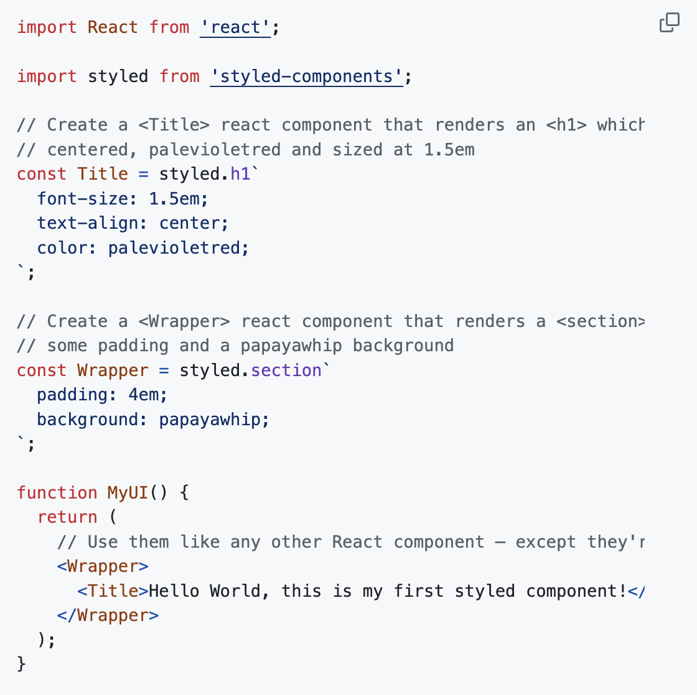

**Github：**<https://github.com/styled-components/styled-components>

### Tailwind CSS

Tailwind CSS 是一个实用工具类优先的 CSS 框架，它提供了一系列预定义的、高度可定制的工具类，使开发者能够快速构建响应式和一致性用户界面，而无需编写传统的 CSS。

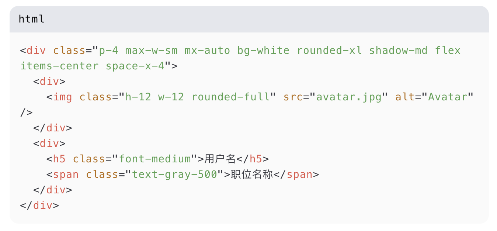

**Github：**<https://github.com/tailwindlabs/tailwindcss>

## UI 组件库：Ant Design / shadcn-ui  /Ant Design Mobile

* Web 端：Ant Design、shadcn/ui
* 移动端：Ant Design Mobile

### Ant Design

Ant Design 是一个基于 React 的企业级 UI 组件库，由蚂蚁金服体验技术部开发。它提供了一系列高质量的 React 组件，帮助开发者快速构建美观、易用的界面和应用。

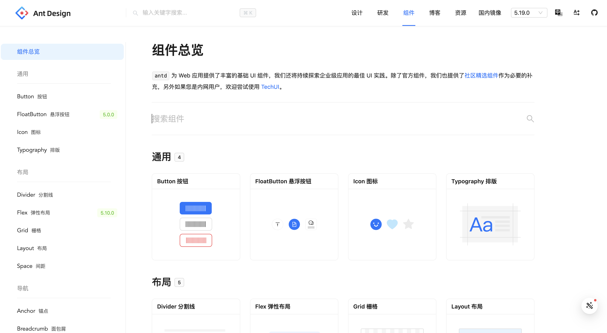

**Github：**<https://github.com/ant-design/ant-design>

### \*\*shadcn/ui \*\*

shadcn/ui 是一个基于React的现代UI组件库，它提供了丰富的可复用组件集合，允许开发者通过简单的复制和粘贴操作将组件集成到 Web 应用中。

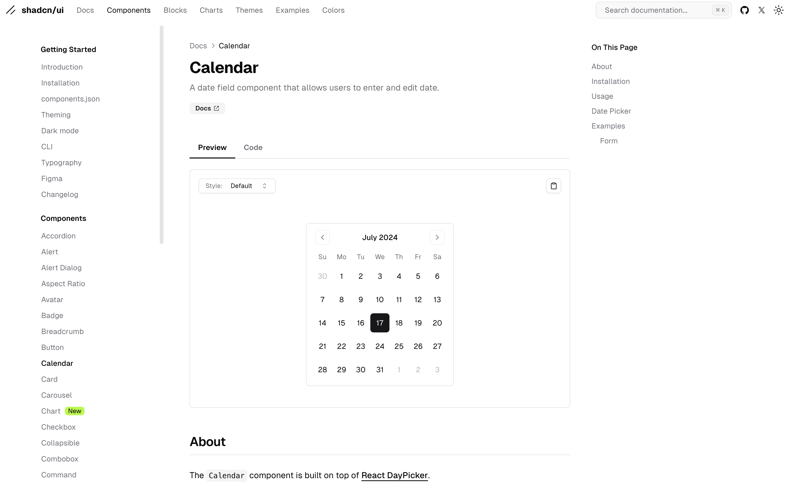

**Github：**<https://github.com/shadcn-ui/ui>

### Ant Design Mobile

Ant Design Mobile 是由蚂蚁金服体验技术部开发的一套移动端 UI 组件库，专为移动应用设计。这些组件遵循 Ant Design 的设计语言和开发模式，确保了在移动端应用中的一致性和用户体验。

**Github：**<https://github.com/ant-design/ant-design-mobile>

## 桌面应用开发：Electron⚡️Vite

Electron⚡️Vite 致力于提供 Electron 与 Vite 结合的最佳社区实践方案！它使得基于 Vite 开发的 Electron 工程变得十分简单！

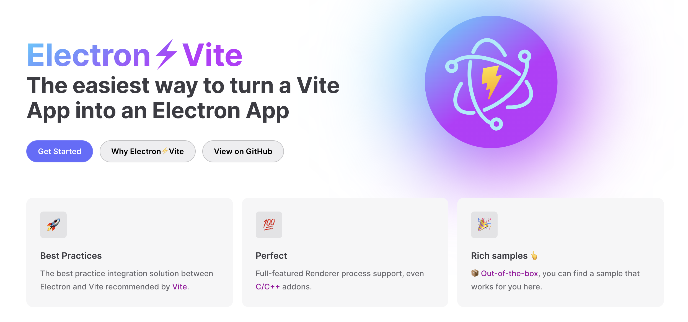

**Github：**<https://github.com/electron-vite/electron-vite-react>

## 跨端应用开发：Taro / React Native / Expo

### Taro

Taro 是一个由京东凹凸实验室开发的跨平台多端统一开发框架，支持使用 React/Vue/Nerv 等框架来开发微信/京东/百度/支付宝/字节跳动/ QQ 小程序/H5/React Native 等应用。

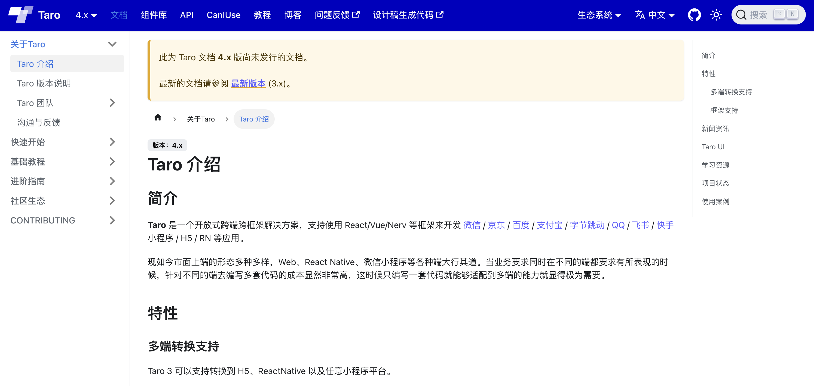

**Github：**<https://github.com/NervJS/taro>

### React Native

React Native 是 Facebook 开发的一个跨平台框架，允许使用 JavaScript 和 React 技术栈来构建高性能的原生移动应用。它支持一次编写代码，然后编译到 iOS 和 Android 平台，提供接近原生应用的性能和访问设备原生功能的能力。

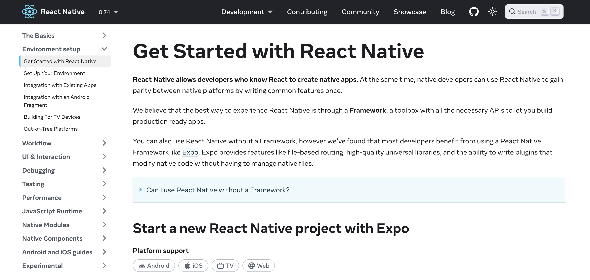

**Github：**<https://github.com/facebook/react-native>

### Expo

Expo是一个基于 React Native 的框架，专为构建可以在Android、iOS和Web上运行的统一原生应用程序而设计。它基于 React Native，但提供了更多的上层封装和扩展功能，使得开发者能够更轻松地构建和扩展跨平台应用。Expo 是目前 React Native 官方推荐的创建 React Native 项目的方式。

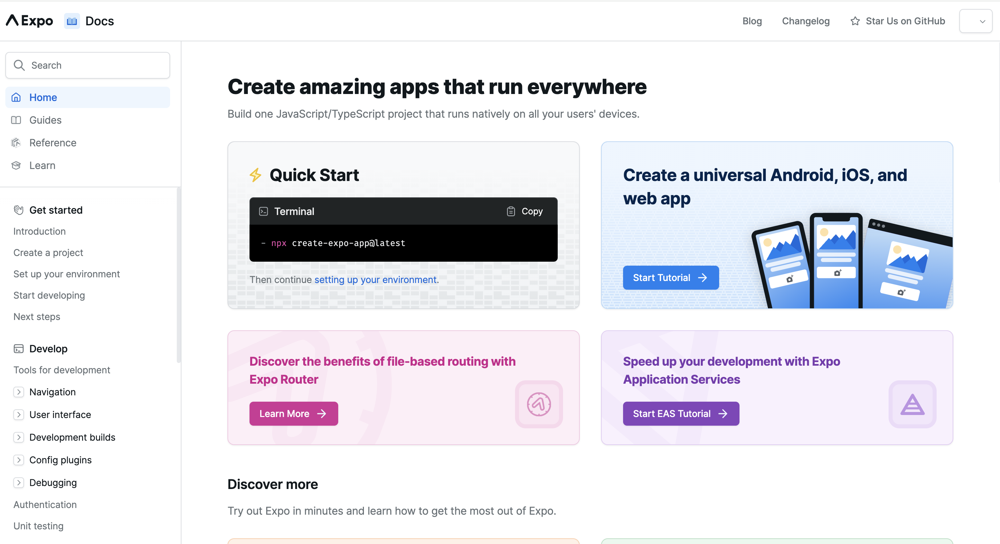

**Github：**<https://github.com/expo/expo>

## 数据请求：Axios / TanStack Query

### Axios

Axios 是一个灵活且基于 Promise 的 HTTP 客户端，广泛用于浏览器和 Node.js 环境中进行异步的 HTTP 请求，支持请求/响应拦截、数据转换、取消请求等功能，简化了前端数据交互的复杂性。Axios 目前每个月有超过 2 亿次下载，是目前使用最多的数据请求工具库。

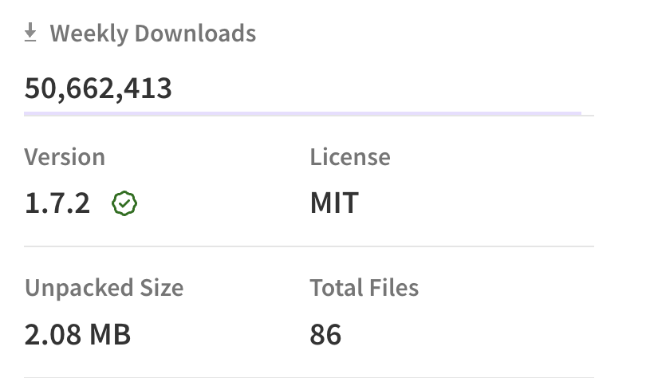

**Github：**<https://github.com/axios/axios>

### TanStack Query

TanStack Query，也就是 React Query，它是一个用于 React 应用的数据获取和状态管理库，它通过自动缓存、查询重发、取消请求等功能，简化了从服务器获取和管理数据的过程，提供了一种高效且易于使用的 API 来处理异步数据。

可以将 React Query 与 Axios 结合使用。React Query 本身是一个数据获取和状态管理库，并不直接执行 HTTP 请求，而是可以与任何数据获取库一起工作，包括 Axios。通过将 Axios 作为数据获取函数传递给 React Query 的 `useQuery` 或 `useMutation` 等 Hooks，可以利用 Axios 发送 HTTP 请求，并由 React Query 处理数据的缓存和状态更新。

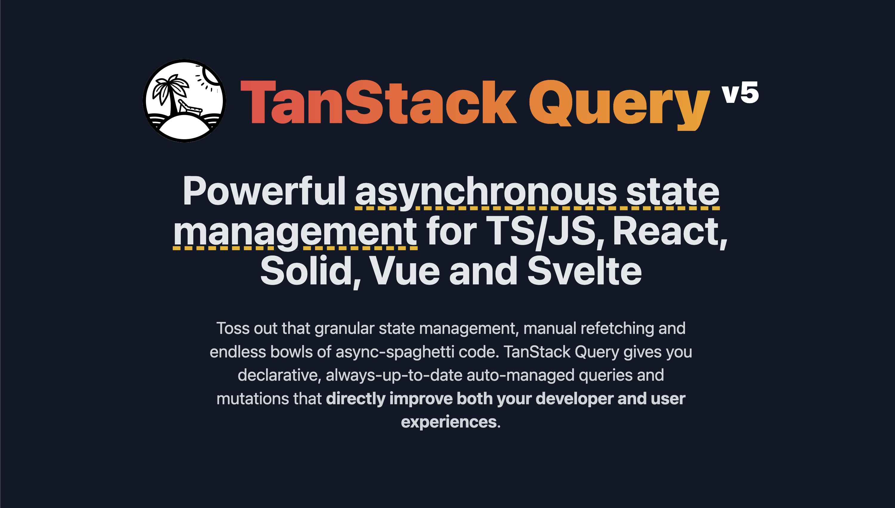

**Github：**<https://github.com/tanstack/query>

## 可视化：ECharts / AntV

### ECharts

ECharts 是一个基于 JavaScript 的开源数据可视化图表库，最初由百度团队开发并于2018年捐赠给 Apache 基金会。它提供了直观、生动、可交互、可个性化定制的数据可视化图表，广泛应用于Web开发中，支持多种图表类型和丰富的配置选项。

**Github：**<https://github.com/apache/echarts>

### AntV

AntV 是由蚂蚁金服推出的数据可视化解决方案，它包括了一系列的可视化库和工具，用于帮助开发者和数据分析师快速构建高质量的数据可视化应用。AntV 的目标是提供一套简单、专业、可扩展的可视化工具集，以满足不同场景下的数据可视化需求。

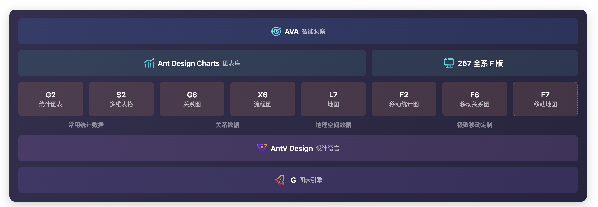

**Github：**<https://github.com/antvis>

## 表单：React Hook Form

React Hook Form 是一个用于 React 应用的表单处理库，它通过 React Hooks 提供了简单直观的 API 来管理表单状态、进行验证和处理提交，非常适合需要快速开发和高度定制表单的场景。

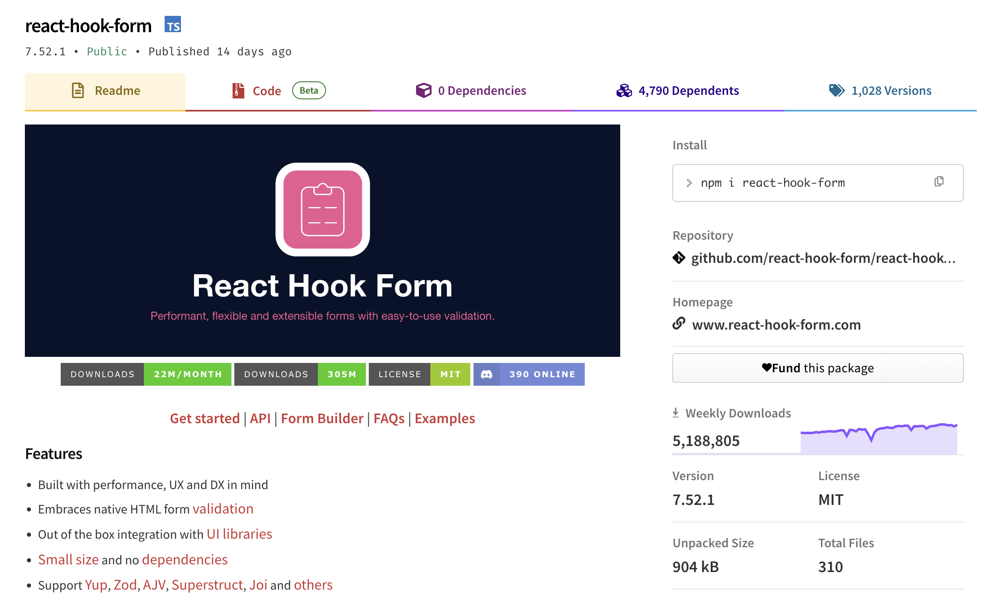

**Github：**<https://github.com/react-hook-form/react-hook-form>

## 代码格式化：ESLint / Prettier

### ESLint

ESLint 是一个 JavaScript 代码检查工具，它可以帮助开发者发现代码中的问题，保证代码质量。它基于插件化的架构，允许开发者自定义规则和配置，以适应不同的项目需求。

推荐使用以下 ESLint 规则集：

* **eslint-plugin-react：**<https://www.npmjs.com/package/eslint-plugin-react>
* **eslint-plugin-react-hooks：**<https://www.npmjs.com/package/eslint-plugin-react-hooks>
* **eslint-config-react-app：**<https://www.npmjs.com/package/eslint-config-react-app>

### Prettier

Prettier 是一个**代码格式化工具**，它通过解析代码并使用自己的规则重新打印代码，从而实现风格一致。它支持多种编程语言，包括JavaScript、TypeScript、CSS、HTML等，并且可以与大多数编辑器集成。

**Github：**<https://github.com/prettier/prettier>

> 更新: 2024-11-30 15:19:37  
> 原文: <https://www.yuque.com/cuggz/feplus/bwcfv08rwky6ghyn>