# Uniapp 生态系统

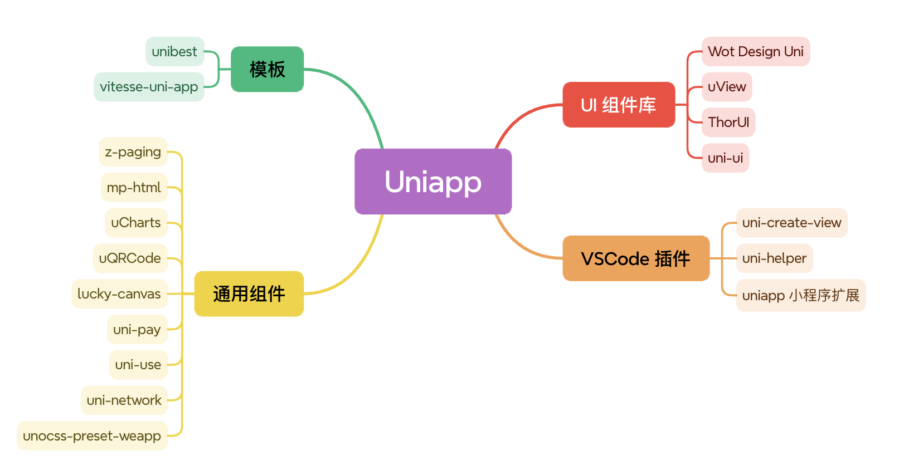

## 模板
### unibest
unibest 是一个 uniapp 开发模板，由 uniapp + Vue3 + Ts + Vite5 + UnoCss + wot-ui + z-paging 构成，使用了最新的前端技术栈，无需依靠 HBuilderX，通过命令行方式运行 web、小程序 和 App。unibest 内置了约定式路由、layout布局、请求封装、请求拦截、登录拦截、UnoCSS、i18n多语言等基础功能，提供了 代码提示、自动格式化、统一配置、代码片段等辅助功能，让你编写 uniapp 拥有 best 体验 。

**Github：**[https://github.com/codercup/unibest](https://github.com/codercup/unibest)

### vitesse-uni-app
由 Vite & uni-app 驱动的跨端快速启动模板，背靠 Uni Helper 团队，告别 HBuilderX ，拥抱现代前端开发。

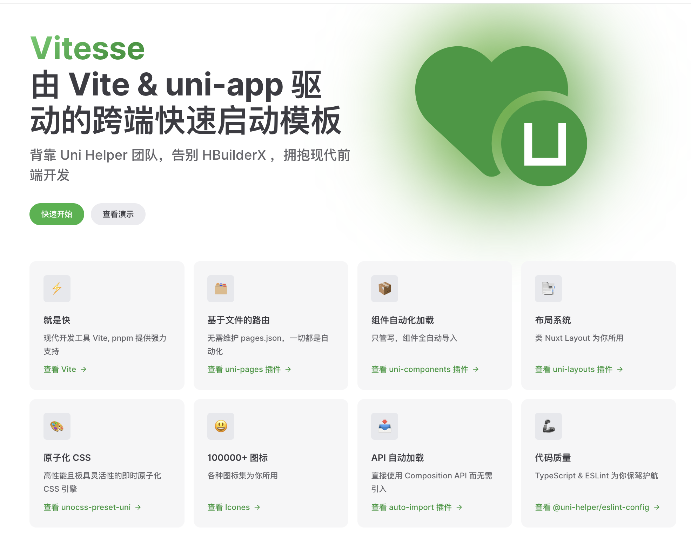

**Github：**[https://github.com/uni-helper/vitesse-uni-app](https://github.com/uni-helper/vitesse-uni-app)

## UI 组件库
### Wot Design Uni
wot-design-uni 组件库基于 vue3+Typescript 构建，参照 wot design 的设计规范进行开发，提供70+高质量组件，支持暗黑模式、国际化和自定义主题，旨在给开发者提供统一的UI交互，同时提高研发的开发效率。

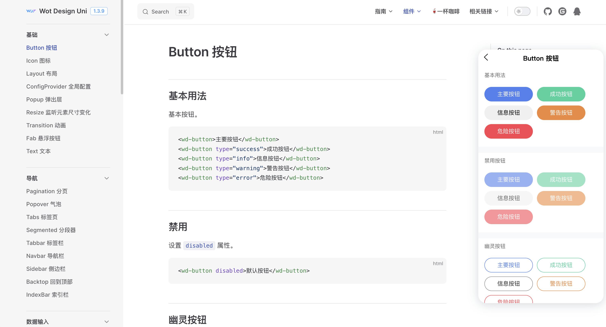

**Github：**[https://github.com/Moonofweisheng/wot-design-uni](https://github.com/Moonofweisheng/wot-design-uni)

### uView
uView是uni-app生态专用的UI框架。自发布以来，uView以其全面的组件和便捷的工具赢得了广泛的认可，被认为是uni-app生态最优秀的UI框架之一。

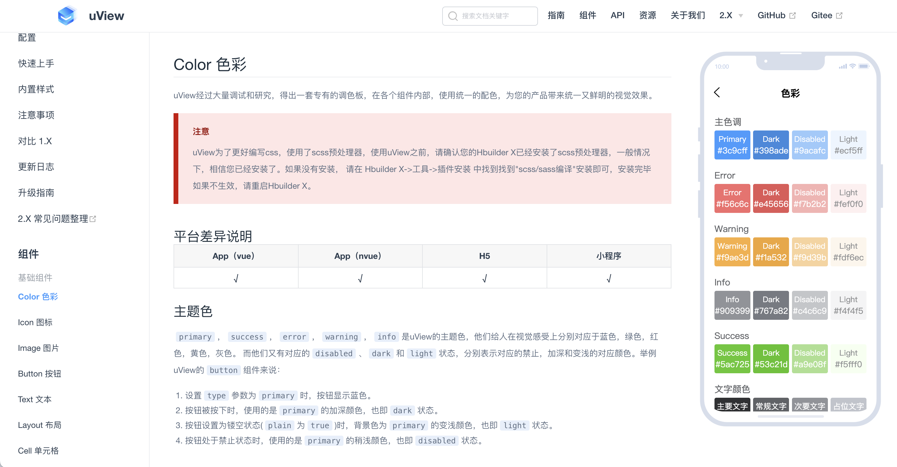

**Github：**[https://github.com/umicro/uView2.0](https://github.com/umicro/uView2.0)

### ThorUI
ThorUI 轻量、简洁、全面的移动端组件库。能大幅提升开发效率，包含uniapp与微信小程序原生版本组件库！

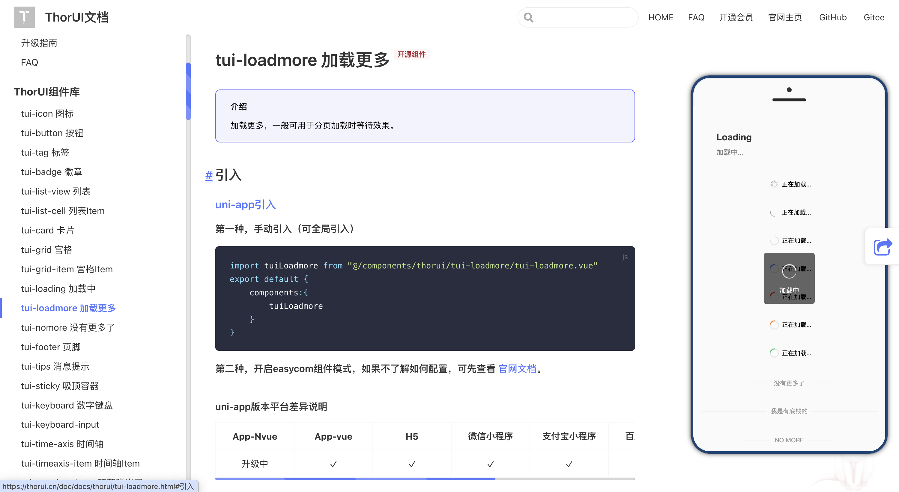

**Github：**[https://github.com/dingyong0214/ThorUI-uniapp](https://github.com/dingyong0214/ThorUI-uniapp)

### uni-ui
uni-ui 是 DCloud 提供的一个跨端ui库，它是基于vue组件的、flex布局的、无dom的跨全端高性能 UI 框架。

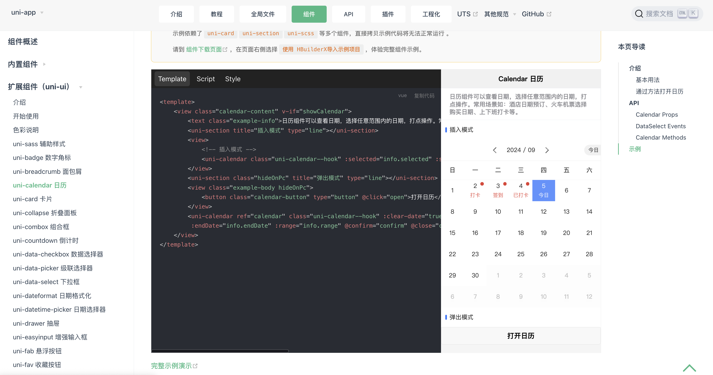

**Github：**[https://github.com/dcloudio/uni-ui](https://github.com/dcloudio/uni-ui)

## 通用组件
### z-paging
z-paging 是一个uni-app 分页组件，支持自定义下拉刷新、上拉加载更多、虚拟列表、下拉进入二楼、自动管理空数据图、无闪动聊天分页、本地分页、国际化等100+项配置。

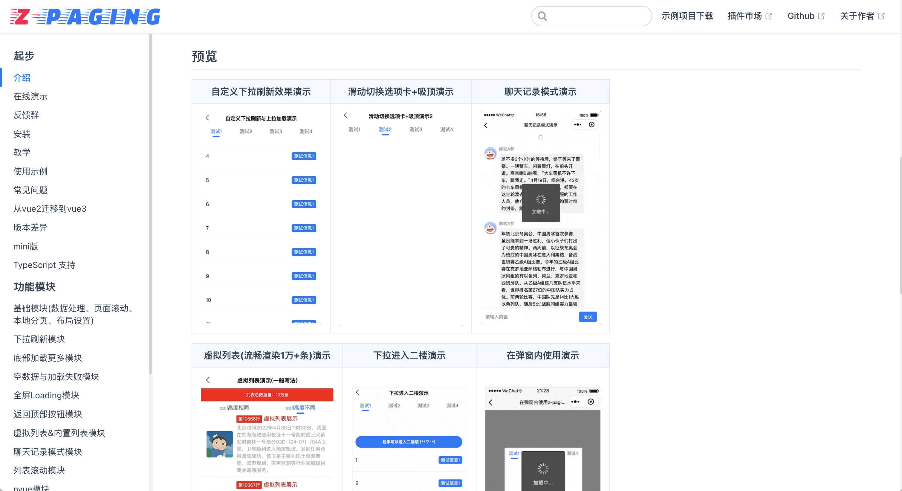

**Github：**[https://github.com/SmileZXLee/uni-z-paging](https://github.com/SmileZXLee/uni-z-paging)

### mp-html
一个强大的小程序富文本组件，支持渲染和编辑 html，支持在微信、QQ、百度、支付宝、头条和 uni-app 平台使用。

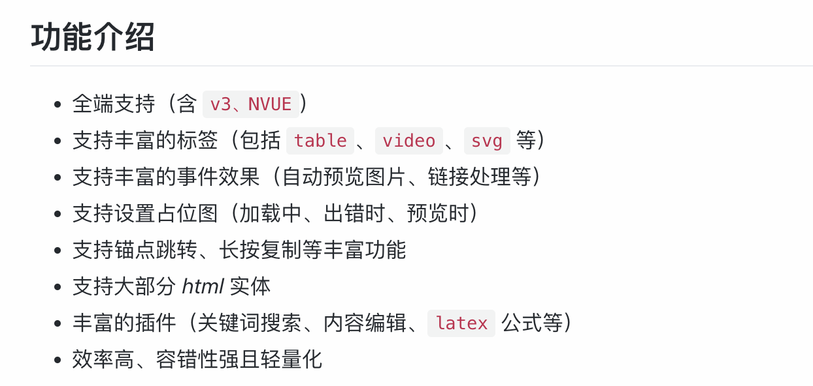

**Github：**[https://github.com/jin-yufeng/mp-html](https://github.com/jin-yufeng/mp-html)

### uCharts
uCharts 是一款基于canvas API开发的适用于所有前端应用的图表库，开发者编写一套代码，可运行到 Web、iOS、Android（基于 uni-app / taro ）、以及各种小程序、快应用等更多支持 canvas API 的平台，uniapp可视化首选组件。

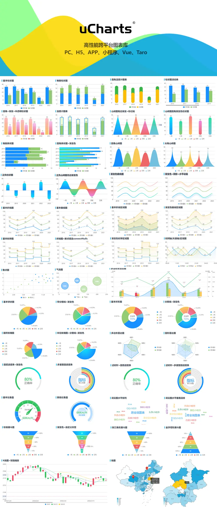

**Gitee：**[https://gitee.com/uCharts/uCharts](https://gitee.com/uCharts/uCharts)

### uQRCode
uQRCode是一款基于Javascript环境开发的二维码生成插件，适用所有Javascript运行环境的前端应用和Node.js。

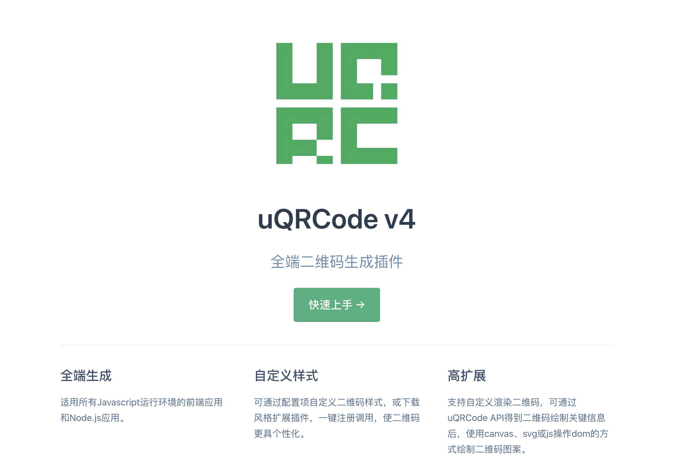

**Github：**[https://github.com/Sansnn/uQRCode](https://github.com/Sansnn/uQRCode)

### lucky-canvas
基于 TS + Canvas 开发的【大转盘 / 九宫格 / 老虎机】抽奖插件，一套源码适配多端框架 JS / Vue / React / Taro / UniApp / 微信小程序等，奖品 / 文字 / 图片 / 颜色 / 按钮均可配置，支持同步 / 异步抽奖，概率前 / 后端可控，自动根据 dpr 调整清晰度适配移动端。

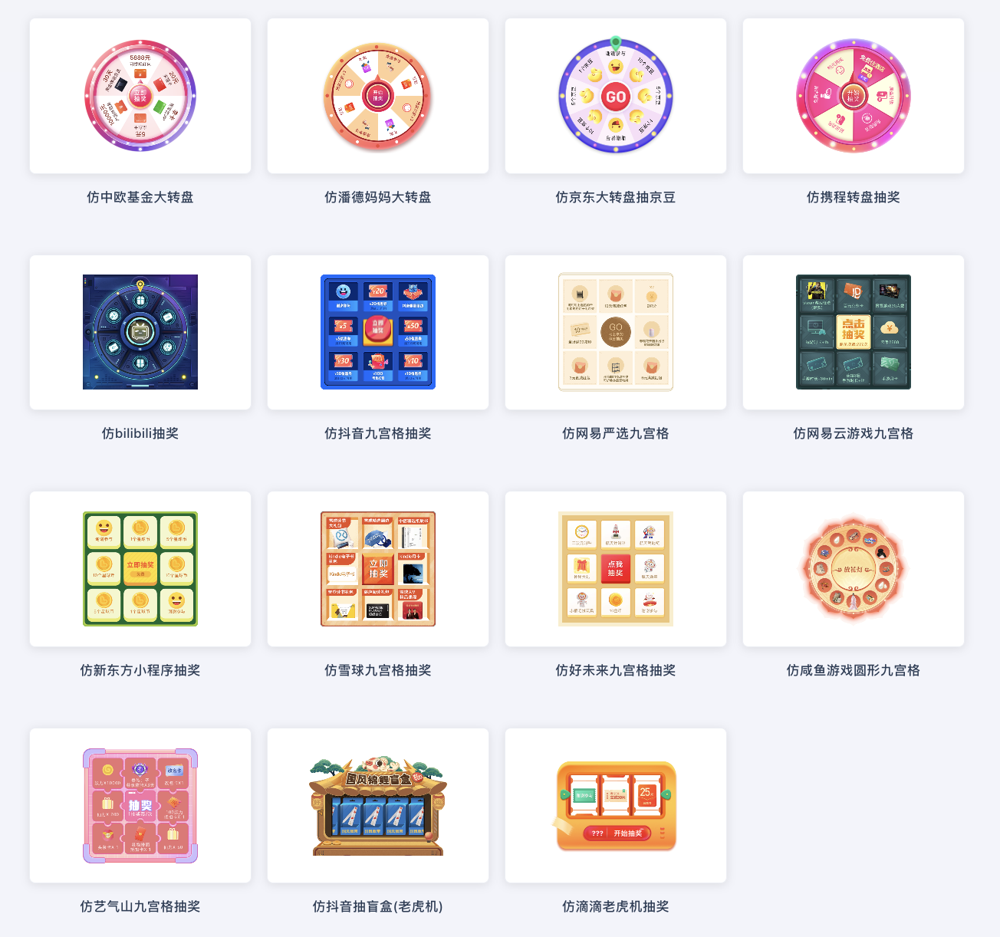

**Github：**[https://github.com/buuing/lucky-canvas](https://github.com/buuing/lucky-canvas)

### uni-pay
更简单的支付接口调用方式、拉齐不同支付平台。

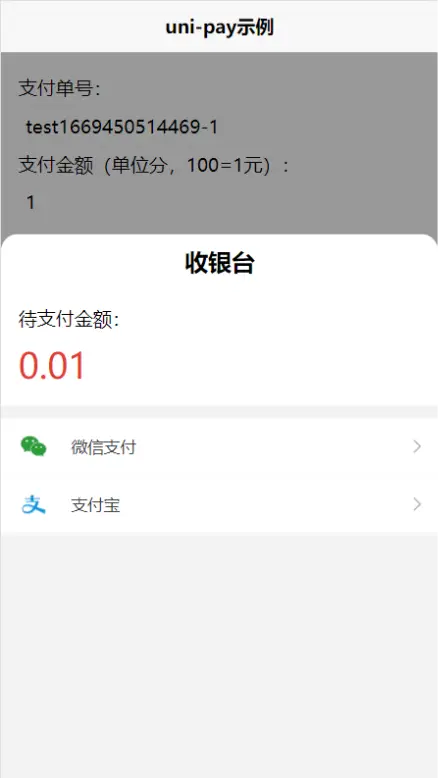

[https://gitcode.net/dcloud/uni-pay.git](https://gitcode.net/dcloud/uni-pay.git)

### uni-use
uni-app (vue3) 组合式工具集，类似于 Vueuse。

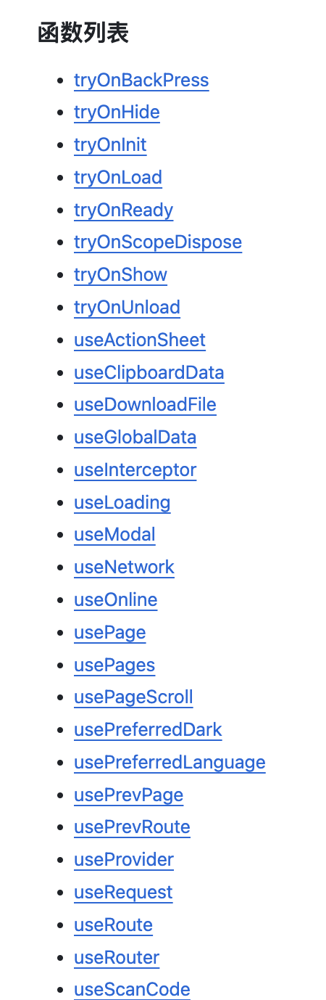

**Github：**[https://github.com/unocss-applet/unocss-applet](https://github.com/unocss-applet/unocss-applet)

### uni-network
为 uni-app 打造的基于 Promise 的 HTTP 客户端。

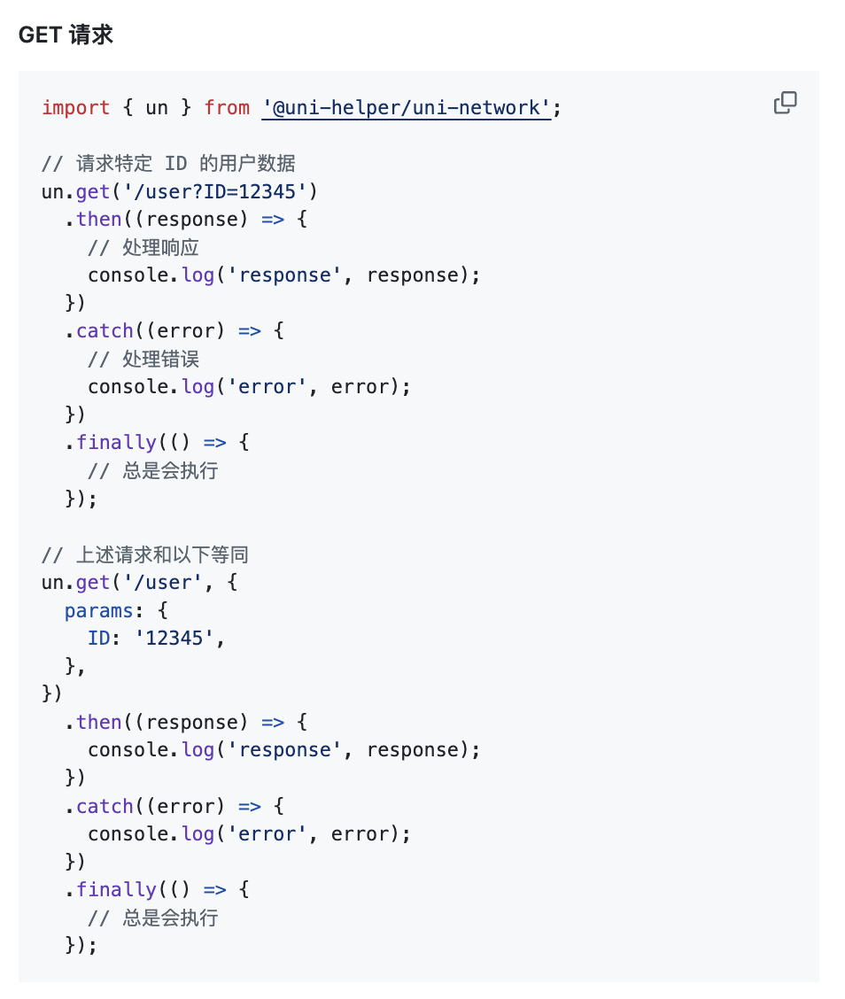

**Github：**[https://github.com/uni-helper/uni-network](https://github.com/uni-helper/uni-network)

### unocss-preset-weapp
unocss 小程序预设，在 taro uniapp 原生小程序中使用 unocss。

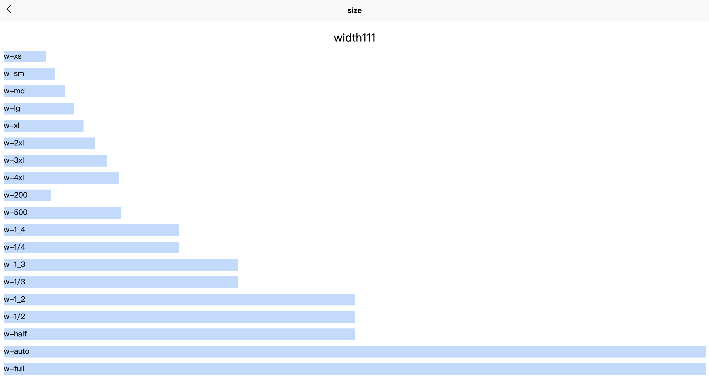

**Github：**[https://github.com/MellowCo/unocss-preset-weapp](https://github.com/MellowCo/unocss-preset-weapp)

## VSCode 插件
### **uni-create-view**
快速创建 uniapp 视图与组件，在 VS Code 右键目录文件夹快速创建页面与组建，创建视图页面时将自动添加 `pages.json` 中。

**Github：**[https://github.com/uni-helper/uni-create-view](https://github.com/uni-helper/uni-create-view)

### **uni-helper**
增强 uni-app 系列产品在 VSCode 内的体验。

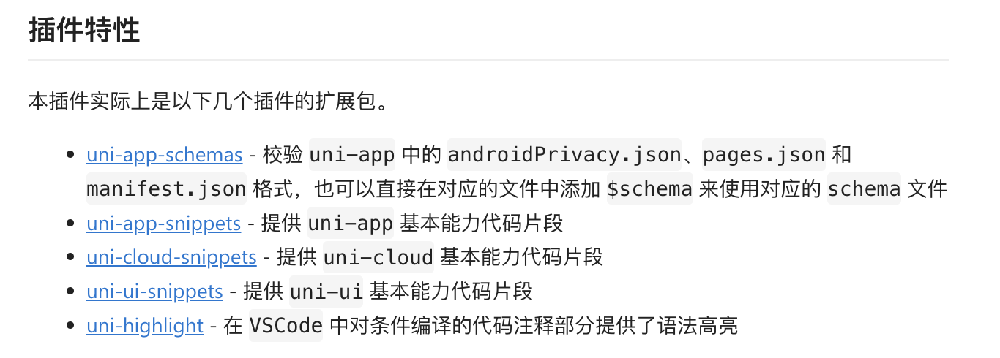

**Github：**[https://github.com/uni-helper/uni-helper-vscode.git](https://github.com/uni-helper/uni-helper-vscode.git)

### **uniapp 小程序扩展**
一个灵活、好用、持续维护的 uniapp 小程序拓展，自动提示标签可用属性，鼠标悬浮查询属性文档，支持 uview 的组件提示。

**Github：**[https://github.com/EvStorM/uniapp-vscode.git](https://github.com/EvStorM/uniapp-vscode.git)

> 更新: 2024-11-30 15:18:09  
> 原文: <https://www.yuque.com/cuggz/feplus/yrtb7vluhf97aky8>