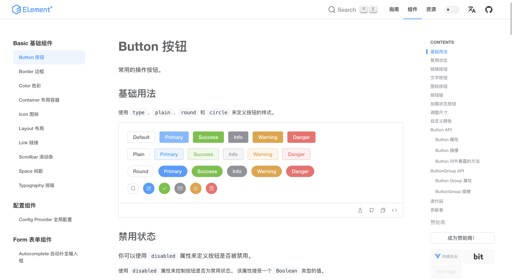
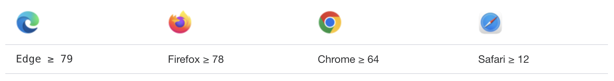
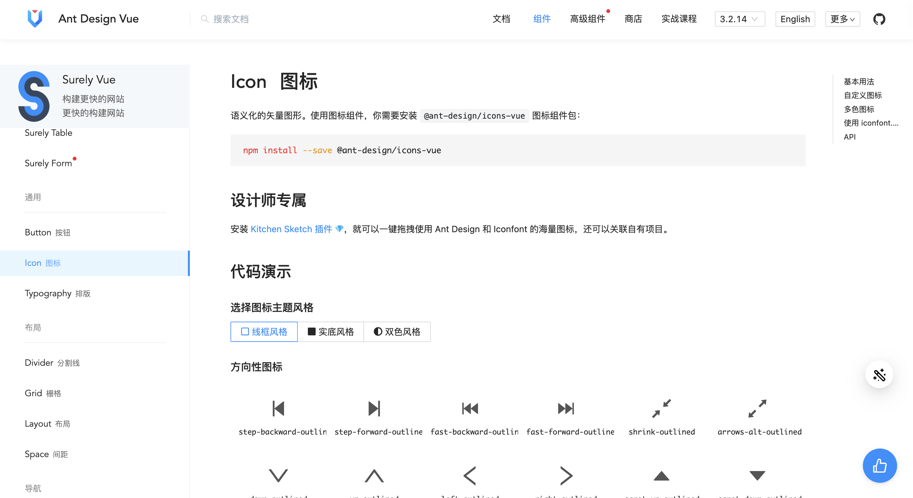
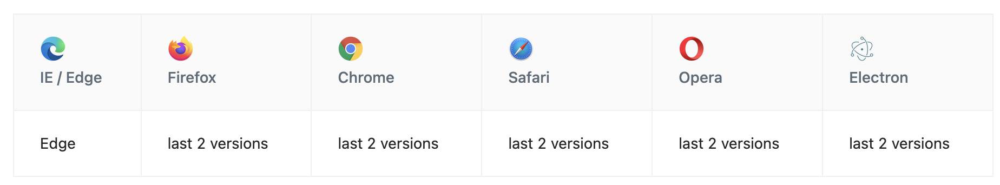
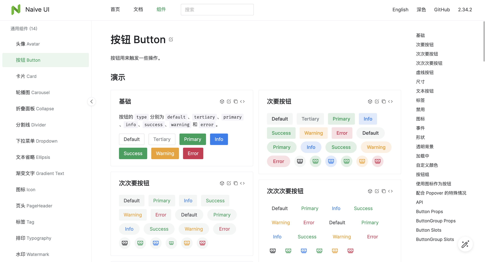
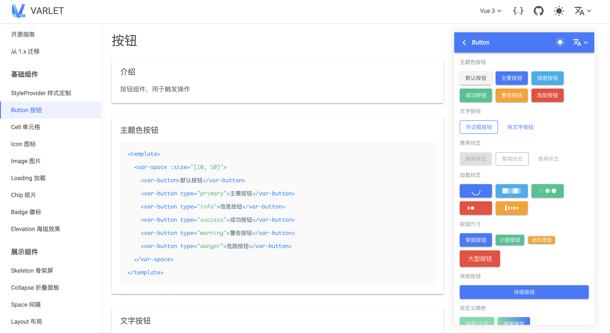
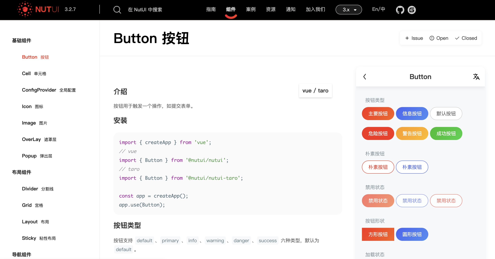
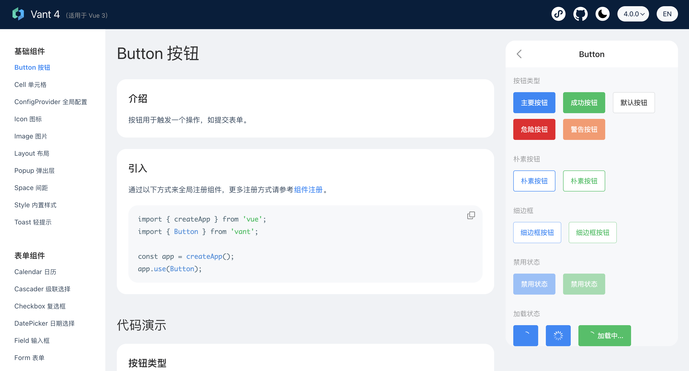
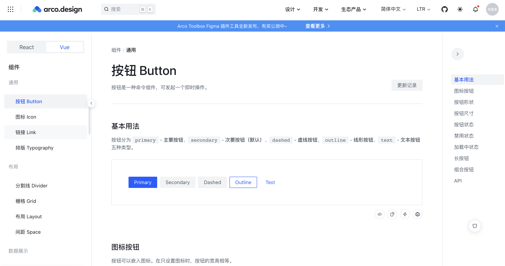

# Vue 3 UI 组件库

## Element Plus
Element Plus 是一套由饿了么开源出品的为开发者、设计师和产品经理准备的基于 Vue 3.0 的组件库。Element Plus 使用 TypeScript + Composition API 进行了重构，提供完整的类型定义文件，使用 Vue 3.0 Composition API 降低耦合、简化逻辑，使用 Lerna 维护和管理项目，完善了 52 种国际化语言支持，支持了黑暗模式。

由于 Vue 3 不再支持 IE11，Element Plus 也不再支持 IE 浏览器，其环境支持情况如下：

+ **Github：**[https://github.com/element-plus/element-plus](https://github.com/element-plus/element-plus)
+ **官方文档：**[https://element-plus.org/zh-CN/](https://element-plus.org/zh-CN/)

## Ant Design Vue
Ant Design of Vue 是 Ant Design 的 Vue 实现，开发和服务于企业级后台产品。其具有以下特性：

+ 提炼自企业级中后台产品的交互语言和视觉风格。
+ 开箱即用的高质量 Vue 组件。
+ 共享 Ant Design of React 设计工具体系。

Ant Design Vue 支持服务端渲染，支持在 Electron 中使用，其环境支持情况如下：

+ **Github：**[https://github.com/vueComponent/ant-design-vue](https://github.com/vueComponent/ant-design-vue)
+ **官方文档：**[https://antdv.com/components/overview](https://antdv.com/components/overview)

## Naive UI
Naive UI 是一款由图森未来开源，基于 Vue 3.0/TypeScript 技栈开发的 UI 组件库。其具有以下特点：

+ 组件丰富完整，超过70个常用业务组件，支持按需引入；
+ 官方提供主题编辑器，不用繁琐的 less、sass、css 变量，也不用 webpack 的 loaders，使用的是由 TypeScript 构建的先进的类型安全主题系统；
+ 运行快小巧轻量，专门针对样式优化，所有组件都可以 treeshaking，不需要导入任何 CSS 就能让组件正常工作。

+ **Github：**[https://github.com/tusen-ai/naive-ui](https://github.com/tusen-ai/naive-ui)
+ **官方文档：**[https://www.naiveui.com/](https://www.naiveui.com/)

## VARLET
Varlet 是一个基于 Vue3 开发的 Material 风格移动端组件库，全面拥抱 Vue3 生态，由社区团队维护。其支持 Typescript、按需引入、暗黑模式、主题定制、国际化，并提供 VS Code 插件保障良好的开发体验。

+ **Github：**[https://github.com/varletjs/varlet](https://github.com/varletjs/varlet)
+ **官方文档：**[https://varlet.gitee.io/varlet-ui/#/zh-CN/index](https://varlet.gitee.io/varlet-ui/#/zh-CN/index)

## NutUI
NutUI 是一套由京东出品的移动端 Vue2、Vue3 组件库，支持一套代码生成 H5 和小程序。其具有以下特点：

+ 70+ 高质量组件，覆盖移动端主流场景
+ 支持按需引用
+ 支持 TypeScript
+ 支持服务端渲染
+ 支持组件级别定制主题，内置 700+ 个变量
+ 国际化支持，已支持英文，印尼语和繁体中文
+ 单元测试覆盖率超过 80%，保障稳定性
+ 提供 Sketch 设计资源

+ **Github：**[https://github.com/jdf2e/nutui](https://github.com/jdf2e/nutui)
+ **官方文档：**[https://nutui.jd.com/#/](https://nutui.jd.com/#/)

## Vant
Vant 是一套由有赞出品的轻量、可靠的移动端组件库。目前 Vant 官方提供了 Vue 2 版本、Vue 3 版本和微信小程序版本。其具有以下特点：

+ 性能极佳，组件平均体积小于 1KB（min+gzip）
+ 70+ 个高质量组件，覆盖移动端主流场景
+ 零外部依赖，不依赖三方 npm 包
+ 使用 TypeScript 编写，提供完整的类型定义
+ 单元测试覆盖率超过 90%，提供稳定性保障
+ 提供 Sketch 和 Axure 设计资源
+ 支持主题定制，内置 700+ 个主题变量
+ 支持按需引入和 Tree Shaking
+ 支持深色模式
+ 支持 Nuxt 3
+ 支持服务器端渲染
+ 支持国际化，内置 20+ 种语言包

+ **Github：**[https://github.com/youzan/vant](https://github.com/youzan/vant)
+ **官方文档：**[https://vant-ui.github.io/vant/](https://vant-ui.github.io/vant/)

## Arco Design
Arco Design 是一套由字节跳动出品的基于 [Arco Design](https://arco.design/) 的 Vue UI 组件库。提供了 60 多个开箱即用的高质量组件, 可以覆盖绝大部分业务场景。

**Github：**[https://github.com/arco-design/arco-design-vue](https://github.com/arco-design/arco-design-vue)

> 更新: 2023-01-02 20:00:38  
> 原文: <https://www.yuque.com/cuggz/feplus/xzt70ks5seafbpui>