# Vue UI 组件库

Vue.js 是一个渐进式 javascript 框架，用于构建 UIS（用户界面）和 SPA（单页应用程序）。UI 组件库的出现提高了我们的开发效率，增强了应用的整体外观、感觉、交互性和可访问性，下面就来看看有哪些适用于 Vue 的 UI 组件库。

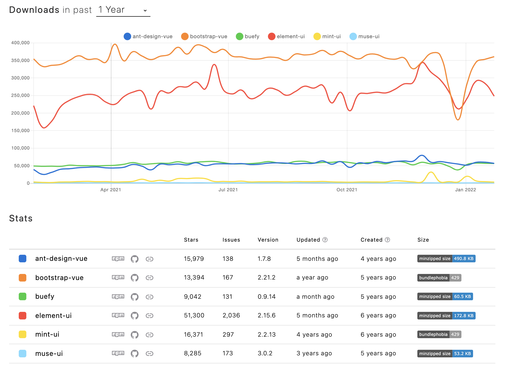

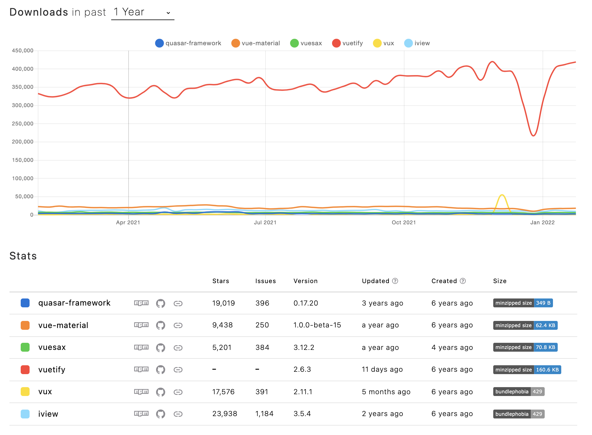

## 1. Element UI
Element UI 是一套为开发者、设计师和产品经理准备的基于 Vue 2.0 的桌面端组件库。它是一个用于 Web 的 UI 组件库 ，除了 Vue 之外，它还具有React 和 Angular的版本。

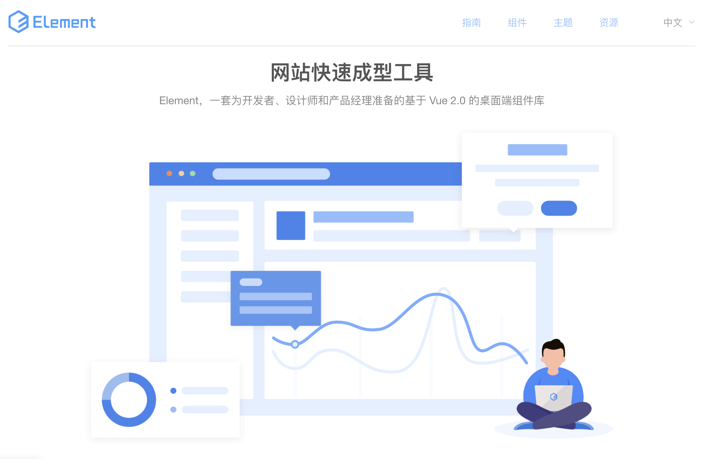

Element UI 的特性：

**（1）一致性 Consistency**

+ **与现实生活一致：**与现实生活的流程、逻辑保持一致，遵循用户习惯的语言和概念；
+ **在界面中一致：**所有的元素和结构需保持一致，比如：设计样式、图标和文本、元素的位置等。

**（2）反馈 Feedback**

+ **控制反馈：**通过界面样式和交互动效让用户可以清晰的感知自己的操作；
+ **页面反馈：**操作后，通过页面元素的变化清晰地展现当前状态。

**（3）效率 Efficiency**

+ **简化流程：**设计简洁直观的操作流程；
+ **清晰明确：**语言表达清晰且表意明确，让用户快速理解进而作出决策；
+ **帮助用户识别：**界面简单直白，让用户快速识别而非回忆，减少用户记忆负担。

**（4）可控 Controllability**

+ **用户决策：**根据场景可给予用户操作建议或安全提示，但不能代替用户进行决策；
+ **结果可控：**用户可以自由的进行操作，包括撤销、回退和终止当前操作等。

**GitHub（star：51.6k）**：[https://github.com/ElemeFE/element](https://github.com/ElemeFE/element)

## 2. Ant Design of Vue
Ant Design Vue 是使用 Vue 实现的遵循 Ant Design 设计规范的高质量 UI 组件库，用于开发和服务于企业级中后台产品。

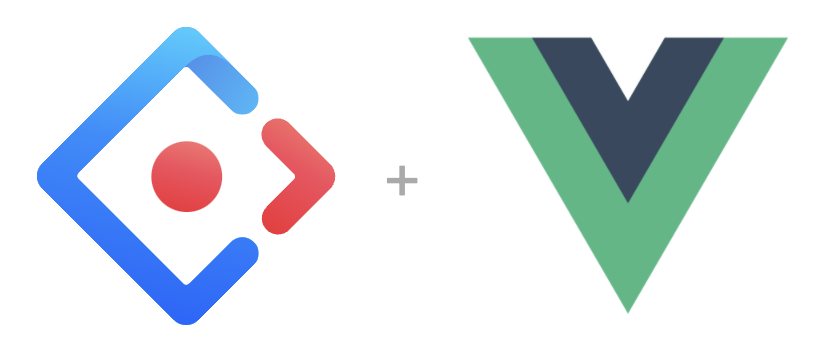

Ant Design of Vue 的特性：

+ 提炼自企业级中后台产品的交互语言和视觉风格。
+ 开箱即用的高质量 Vue 组件。
+ 共享 Ant Design of React 设计工具体系。

**GitHub（star：16k）**：[https://github.com/vueComponent/ant-design-vue/](https://github.com/vueComponent/ant-design-vue/)

## 3. Vue Material
vue-material是一个建立在谷歌的Material Design基础上的轻量级框架，是一个实现Google像素材料设计的Vue组件库，它提供了适合所有现代Web浏览器的内置动态主题的组件，它的API也简单明了。

Vue Material 是一个轻量级的框架， 建立在谷歌的 Material Design 基础上。 设计强大的和美观的web应用并适用于不同的屏幕。

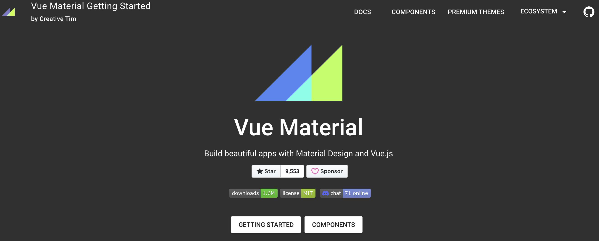

**GitHub（star：9.6k）：**[https://github.com/vuematerial/vue-material](https://github.com/vuematerial/vue-material)

## 4. BootStrap Vue
采用 BootstrapVue 构建响应式、移动优先、ARIA项目（Accessible Rich Internet Application，可访问的富媒体应用，即无障碍友好应用)，基于 Vue.js 和世界全球最受欢迎的 CSS 前端框架 — Bootstrap v4。

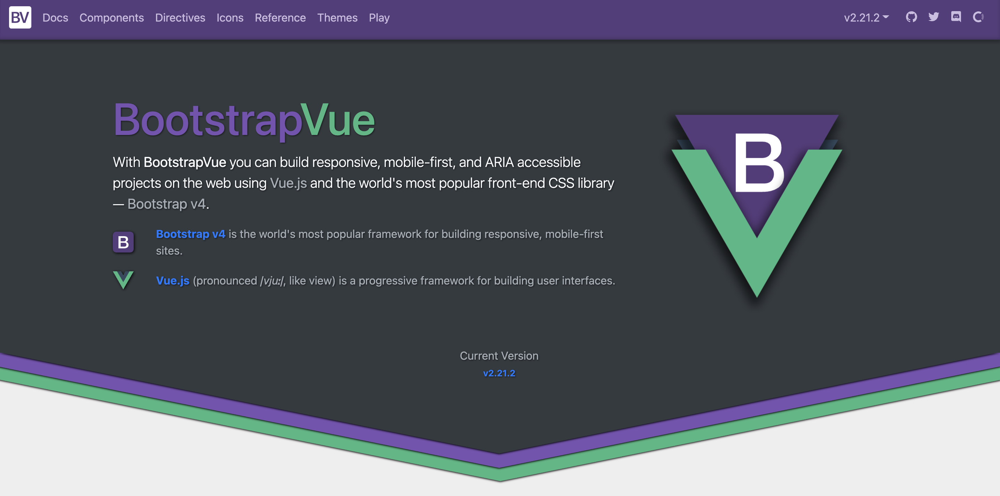

BootstrapVue 拥有40多个可用插件和80多个自定义UI组件、指令以及300多个图标，全面兼容并符合 Bootstrap v4.4组件和网格系统规范，基于 Vue.js v2.6, 并具备广泛和自动的 WAI-ARIA 可访问性友好支持。

**GitHub（star：13.7k）**：[https://github.com/bootstrap-vue/bootstrap-vue](https://github.com/bootstrap-vue/bootstrap-vue)

## 5. Vuetify
Vuetify 是一个基于 Vue.js 精心打造 UI 组件库，整套 UI 设计为 Material 风格。能够让没有任何设计技能的开发者创造出时尚的 Material 风格界面。

> Material Design 是 Google 推出的设计语言，颜色鲜艳、动画效果突出，旨在为手机、平板电脑、台式机和“其他平台”提供更一致、更广泛的“外观和感觉”。
>

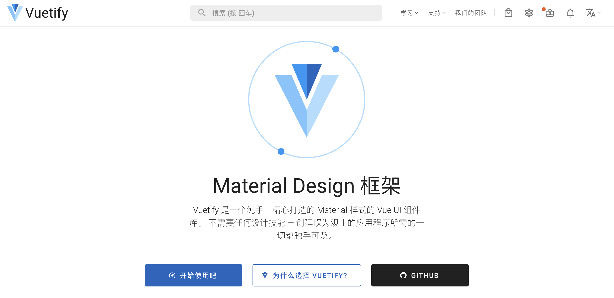

Vuetify 的特性：

+ 所有组件遵从 Material Design 设计规范，UI 体验优秀，能够媲美苹果但又完全不同的设计采用移动优先的设计；
+ 无论在手机、平板或 PC 电脑上都有完美的适配；
+ 极其丰富详细的上手文档和免费的视频教程，社区活跃，全职团队维护，长期提供支持，每周发版；
+ 支持主题定制，提供无障碍（面向缺陷人群的访问）支持。支持树摇优化，能大大减少打包体积。

**GitHub（star：33.4k）**：[https://github.com/vuetifyjs/vuetify](https://github.com/vuetifyjs/vuetify)

## 6. Vux
VUX 是基于 WeUI 和 Vue(2.x) 开发的移动端UI组件库，主要服务于微信页面。基于webpack + vue-loader + vux可以快速开发移动端页面，配合 vux-loader 方便在WeUI的基础上定制需要的样式。vux-loader 保证了组件按需使用，因此不用担心最终打包了整个vux的组件库代码。

VUX并不完全依赖于WeUI，VUX 在 WeUI 的基础上扩展了多个常用组件，但是尽量保持整体UI样式接近WeUI的设计规范。

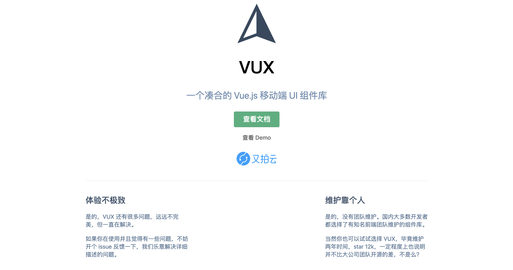

不过，官网首页也列出了这个组件库的缺点：体验不极致、维护靠个人，选择时需要谨慎。

****

**GitHub（star：18k）**：[https://github.com/airyland/vux](https://github.com/airyland/vux)

## 7. View UI
View UI，即原先的 iView，是一套基于 Vue.js 的开源 UI 组件库，主要服务于 PC 界面的中后台产品。

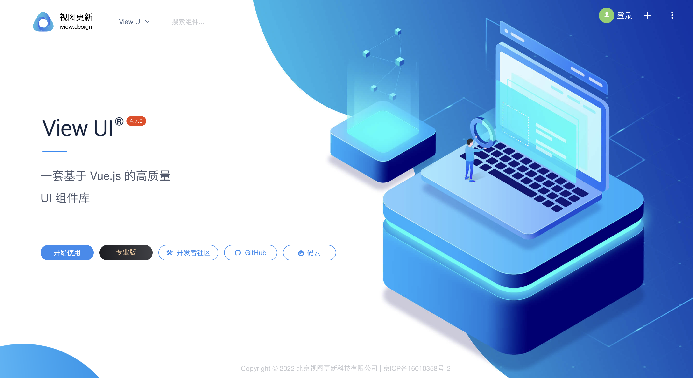

View UI 的特性：

+ 丰富的组件和功能，满足绝大部分网站场景；
+ 提供开箱即用的 Admin 系统 和 高阶组件库，极大程度节省开发成本；
+ 提供专业、优质的一对一技术支持；
+ 友好的 API ，自由灵活地使用空间；
+ 细致、漂亮的 UI；
+ 事无巨细的文档；
+ 可自定义主题。

**GitHub（star：2.5k）**：[https://github.com/view-design/ViewUI](https://github.com/view-design/ViewUI)

## 8. Mint UI
Mint-UI 包含丰富的 CSS 和 JS 组件，能够满足日常的移动端开发需要。通过它，可以快速构建出风格统一的页面，提升开发效率。它可以实现真正意义上的按需加载组件。可以只加载声明过的组件及其样式文件，无需再纠结文件体积过大。  
  
考虑到移动端的性能门槛，Mint UI 采用 CSS3 处理各种动效，避免浏览器进行不必要的重绘和重排，从而使用户获得流畅顺滑的体验。  
  
依托 Vue.js 高效的组件化方案，Mint UI 做到了轻量化。即使全部引入，压缩后的文件体积也仅有 100kb+。

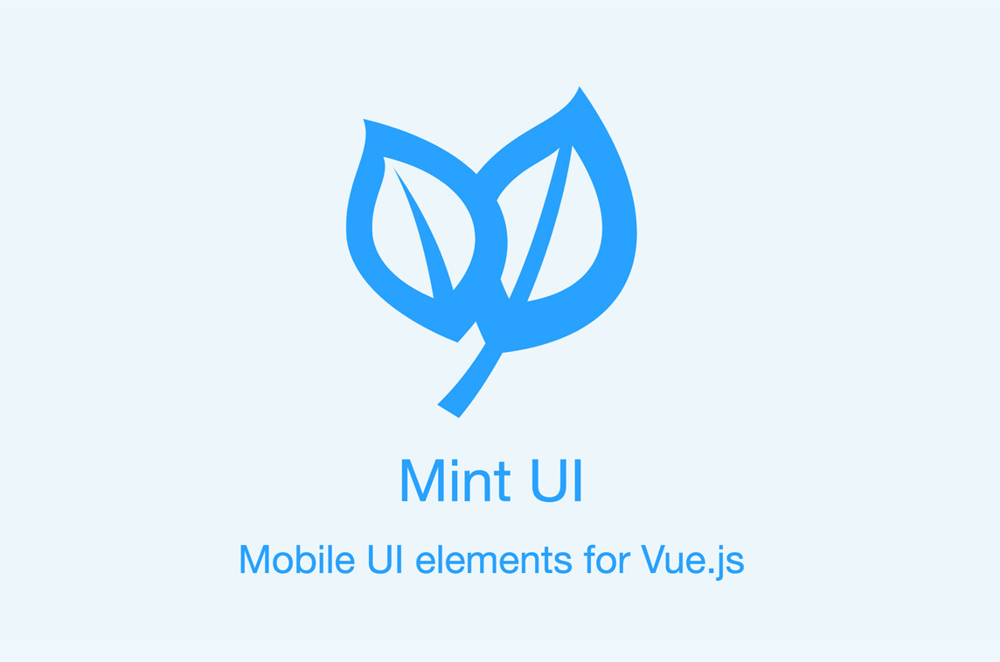

**GitHub（star：16.4k）**：[https://github.com/ElemeFE/mint-ui](https://github.com/ElemeFE/mint-ui)

## 9. Muse-UI
 Muse-UI 是一个基于 Vue 2.0 优雅的 Material Design UI 开源组件库，主要用于移动端和一些对浏览器兼容性要求不高的桌面端应用。

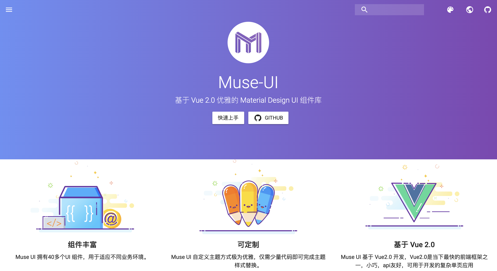

Museui 的特性

+ **组件丰富**：Muse UI 拥有40多个UI 组件，用于适应不同业务环境。
+ **可定制**：Muse UI 自定义主题方式极为优雅，仅需少量代码即可完成主题样式替换。
+ **基于 Vue 2.0**：Muse UI 基于 Vue2.0 开发，Vue2.0是当下最快的前端框架之一，小巧，api友好，可用于开发的复杂单页应用

**GitHub（star：8.3k）**：[https://github.com/museui/muse-ui](https://github.com/museui/muse-ui)

## 10. Buefy
Buefy 基于 Bulma 和 Vue.js 的轻量级UI组件，它提供了即装即用的轻量级组件。

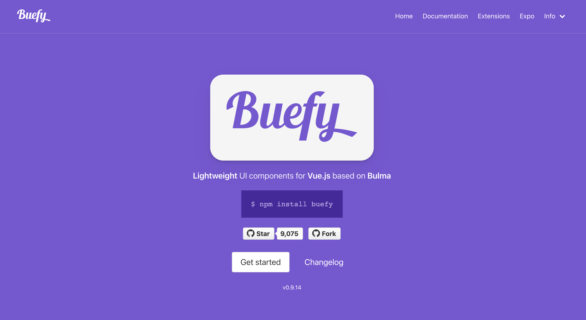

Buefy 的特性：

+ 轻松保留当前的布尔玛主题/变量；
+ 支持Material Design图标和FontAwesome；
+ 非常轻巧，除了Vue＆Bulma之外没有任何内部依赖性；
+ 语义代码输出；
+ 遵循布尔玛设计和一些Material Design UX；
+ 专注于可用性和性能，而无需过度动画；

**GitHub（star：9k）**：[https://github.com/buefy/buefy](https://github.com/buefy/buefy)

## 11. Quasar
Quasar 包括用 Vue 构建的几十个 Vue.js 组件组成，为响应式 Web 应用程序和混合移动应用程序提供的丰富功能选项。组件是作为 Web 组件编写的，所以它们嵌入了 HTML，CSS 和 Javascript 代码，只需在页面和布局模板中标注一个 HTML 标记即可使用。

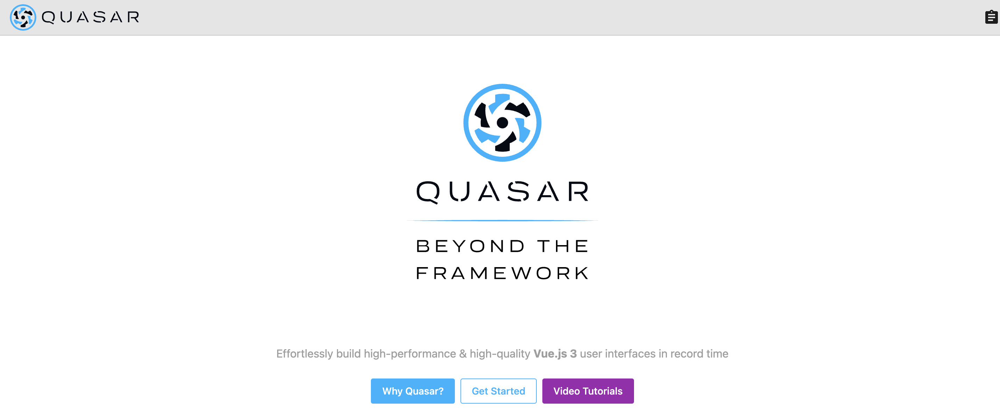

Quasar 的特性：

+ 开箱即用的提供给**网站**和**应用程序**的最先进的UI（遵循《Material指南》）；
+ 开箱即用的对桌面和**移动浏览器**（包括iOS Safari！）的最佳支持；
+ 通过与自己的CLI紧密集成，对每种构建模式（SPA、SSR、PWA、移动应用程序、桌面应用程序和浏览器扩展）提供了一流的支持，并提供了最佳的开发人员体验；
+ 易于自定义（CSS）和可扩展（JS）；
+ 自动tree shaking。

**GitHub（star：20.4k）**：[https://github.com/quasarframework/quasar](https://github.com/quasarframework/quasar)

## 12. Vuesax
Vuesax是基于Vue.js的组件框架,从零开始设计，可以逐步采用。Vuesax致力于促进应用程序的开发，在不删除必要功能的情况下改进其设计。“我们希望所有组件具有独立的颜色，形状和设计，以实现我们前端喜欢的自由设计，同时又不损失创作和生产的速度。”

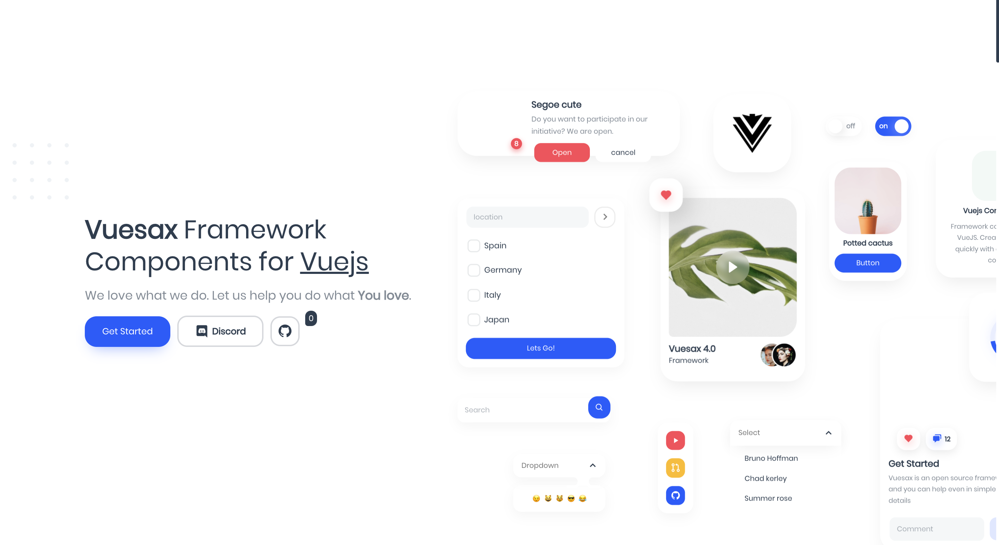

**GitHub（star：5.3k）**：[https://github.com/lusaxweb/vuesax](https://github.com/lusaxweb/vuesax)

> 更新: 2022-08-09 18:14:26  
> 原文: <https://www.yuque.com/cuggz/feplus/brbaqp>