# Vue 生态系统

经过多年的不断演进，Vue 已经构建了一个极为丰富且强大的生态系统，本文就来盘点2024 年 Vue 开发最能打的技术栈组合！

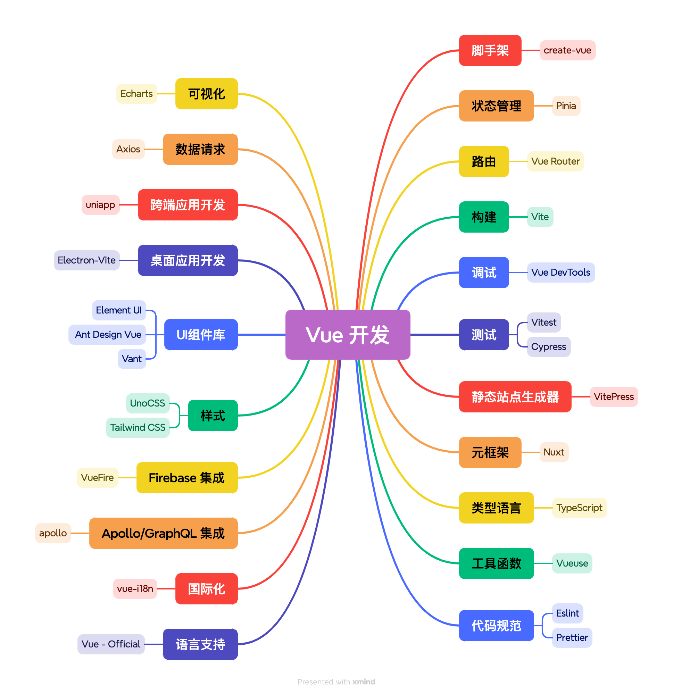

## 脚手架：create-vue
create-vue 是 Vue.js 官方推出的一个快速启动 Vue.js 项目的脚手架工具。它基于 Vite，为开发者提供了一种快速、便捷的方式来创建 Vue 项目模板，降低了项目的入门门槛。

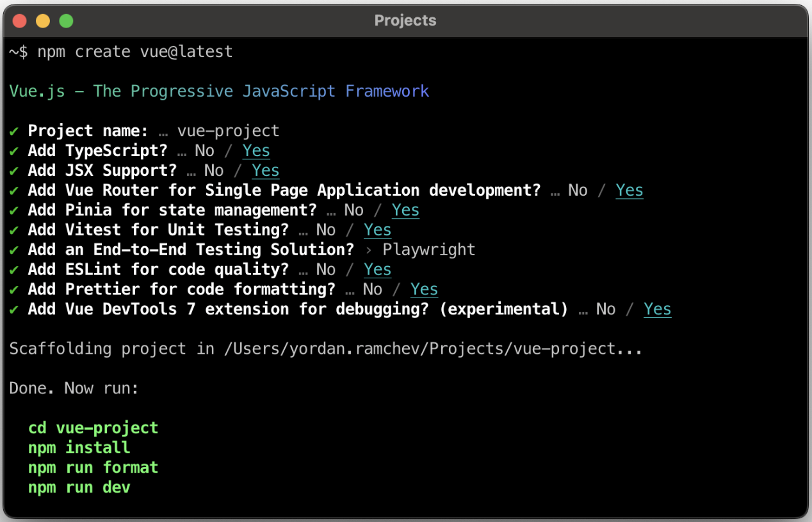

**Github**：[https://github.com/vuejs/create-vue](https://github.com/vuejs/create-vue)

## 状态管理：Pinia
Pinia 是一个专为 Vue.js 设计的新一代状态管理库，它提供了更简单、更灵活的 API，并且完全支持 Vue 3。Pinia 的设计旨在提供一种直观的方式来管理 Vue.js 应用程序中的状态，使得状态管理变得更加简单和高效。

Pinia 的特点如下：

+ **简洁的 API**：Pinia 相比 Vuex 提供了更加简单的 API，移除了 Vuex 中的 mutation，所有状态变更都在 actions 中处理，这使得状态管理更加直观和统一。
+ **组合式 API 风格**：Pinia 完全兼容 Vue 3 的组合式 API，允许开发者以更加声明式的方式管理状态，这有助于提高代码的可读性和可维护性。
+ **模块化**：Pinia 抛弃了 Vuex 中的 modules 概念，每个 store 都是一个独立的模块，这使得状态管理更加清晰和灵活。
+ **TypeScript 支持**：Pinia 提供了良好的 TypeScript 支持，允许开发者在开发过程中获得更好的类型推断和静态类型检查，从而减少运行时错误。
+ **插件系统**：Pinia 提供了插件系统，用于扩展和增强其功能。通过插件，开发者可以添加中间件、持久化存储、调试工具等来满足特定的需求。

**Github**：[https://github.com/vuejs/pinia](https://github.com/vuejs/pinia)

## 路由：Vue Router
Vue Router 是 Vue.js 官方的路由管理器。Vue Router 通过简单的 API 实现组件（和视图）的映射，使得构建单页应用变得简单快捷。

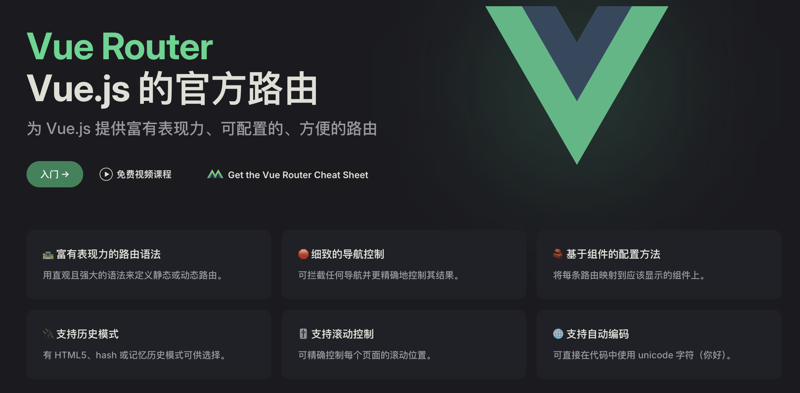

**Github**：[https://github.com/vuejs/router](https://github.com/vuejs/router)

## 构建：Vite
Vite 是一个轻量级的、速度极快的下一代前端构建工具，对 Vue SFC 提供第一优先级支持。它最初是为 Vue 3 项目而创建的，但也可以用于其他框架，如 React、Svelte、Preact 等，目前已被多个前端框架作为默认的构建工具。

**Github**：[https://github.com/vitejs/vite](https://github.com/vitejs/vite)

## 调试：Vue DevTools
Vue DevTools 是一款旨在提升 Vue 开发者体验的工具，它能够显著提升你在使用 Vue 应用时的生产力和调试能力。其可以通过 Vite 插件、浏览器扩展、独立应用的形式来使用。

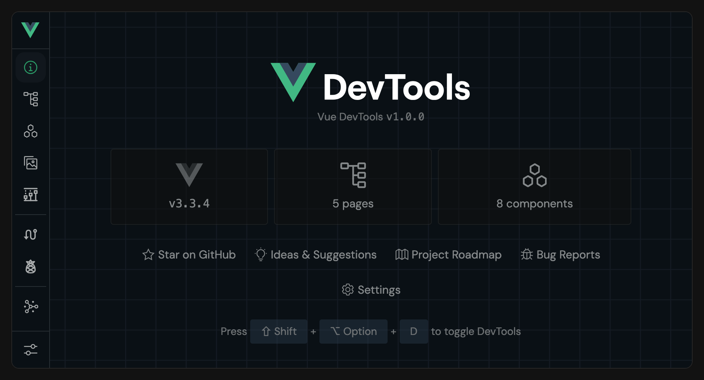

Vue DevTools 的特点如下：

+ **实时编辑属性**：Vue DevTools 允许你直接实时编辑属性，并立即看到更改的反映。这一特性特别适用于快速测试更改，而无需重启应用程序或手动更新代码。
+ **时间旅行调试**：最强大的特性之一是其进行时间旅行调试的能力。这意味着你可以检查在任何时间点你的 store 的状态，从而帮助你追踪并理解应用程序状态随时间的变化情况。
+ **Vue Router 集成**：查看路由列表及其详细信息。
+ **Pinia 集成**：Vue DevTools 集成了 Pinia，这是 Vue.js 的状态管理库。它允许集中查看和跟踪应用中的所有自定义事件，包括事件的源组件、名称、大小和每个事件的负载。

**Github：**[https://github.com/vuejs/devtools-next](https://github.com/vuejs/devtools-next)

## 测试：Vitest / Cypress
在 Vue 项目中，推荐使用以下框架进行测试：

+ 单元测试：Vitest
+ 组件测试：Vitest 和 Cypress
+ 端到端测试（E2E）：Cypress

### Vitest
Vitest 是一个基于 Vite 的下一代测试框架，旨在提供快速、高效的单元测试体验。它支持多种测试运行器、测试框架和覆盖率报告工具，可以为组件提供即时响应的测试反馈。值得一提的是，Vitest 仅用了两年时间，每周下载量就达到了 500w+。在 Vue 项目中，推荐使用 Vitest 进行单元测试和组件测试。

**Github：**[https://github.com/vitest-dev/vitest](https://github.com/vitest-dev/vitest)

### Cypress
Cypress 是一个用于编写端到端测试的开源 JavaScript 测试框架，专注于提供简单易用、可靠稳定的测试环境，用于测试Web应用。在 Vue 项目中，推荐其用于 E2E 测试，也可以通过 Cypress 组件测试运行器来给 Vue SFC 作单文件组件测试。

**Github：**[https://github.com/cypress-io/cypress](https://github.com/cypress-io/cypress)

Vue 官方文档中提供了一份在 Vue 中进行测试的指南：[https://cn.vuejs.org/guide/scaling-up/testing.html](https://cn.vuejs.org/guide/scaling-up/testing.html)

## 静态站点生成器：VitePress
VitePress 是基于 Vite 和 Vue 构建的现代化静态站点生成器，是 VuePress 的继承者和现代替代品。它专为构建快速、以内容为中心的网站而生，能够轻松地将使用 Markdown 格式撰写的源文件内容转化为静态 HTML 页面，支持部署到任何平台。

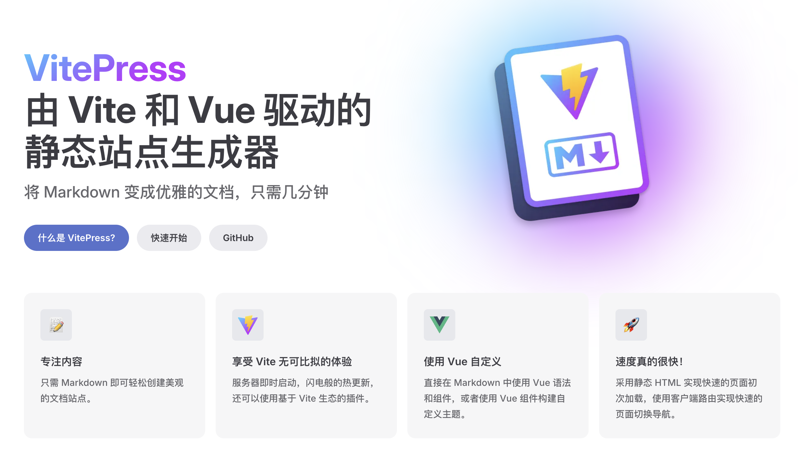

**Github**：[https://github.com/vuejs/vitepress](https://github.com/vuejs/vitepress)

## 元框架：Nuxt
Nuxt 是一个开源的服务端渲染（SSR）框架，建立在 Vue.js 之上，专注于提供一套完整的前端开发解决方案，旨在帮助开发者构建高性能、可扩展的Web应用。Nuxt 通过抽象出管理异步数据、中间件和路由等复杂配置，极大地简化了开发流程。

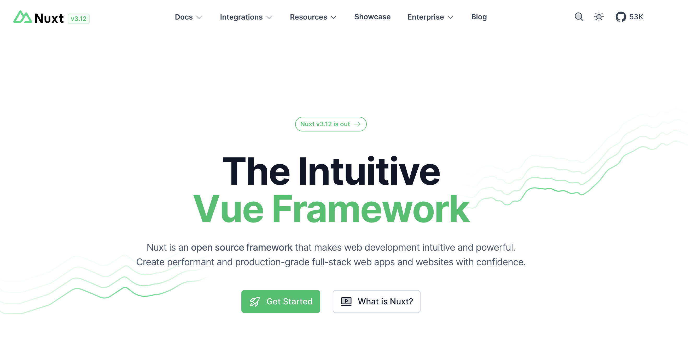

**Github**：[https://github.com/nuxt/nuxt](https://github.com/nuxt/nuxt)

## 类型语言：TypeScript
TypeScript 是 JavaScript 的一个超集，添加了静态类型检查和一些其他的语言特性。现代前端项目基本标配 TypeScript，目前 TypeScript 的周下载量高达 5200 万。

Vue 官方文档中提供了一份在 Vue 中使用 TypeScript 的指南：[https://cn.vuejs.org/guide/typescript/overview.html](https://cn.vuejs.org/guide/typescript/overview.html)

## 工具函数：Vueuse
VueUse 是基于 Composition API 的实用函数集合，适用于 Vue 3 和 Vue 2，包含 200+ 实用函数（类似于Hooks）。

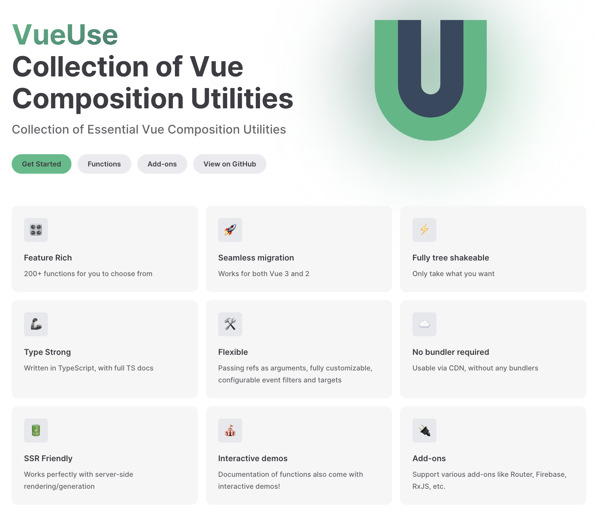

**Github**：[https://github.com/vueuse/vueuse](https://github.com/vueuse/vueuse)

## 代码格式化：Eslint / Prettier
### ESLint
ESLint 是一个 JavaScript 代码检查工具，它可以帮助开发者发现代码中的问题，保证代码质量。它基于插件化的架构，允许开发者自定义规则和配置，以适应不同的项目需求。

eslint-plugin-vue 是 Vue 官方维护的 ESLint 插件，专门用于对 Vue.js 组件进行静态代码分析。该插件提供了一系列的校验规则，用于检查 Vue 项目中的代码风格、语法错误以及潜在的逻辑问题。

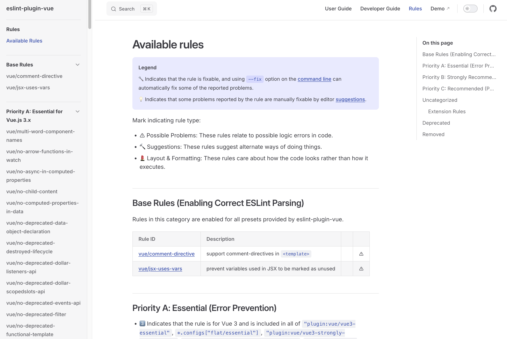

**Github：**[https://github.com/vuejs/eslint-plugin-vue](https://github.com/vuejs/eslint-plugin-vue)

### Prettier
Prettier 是一个**代码格式化工具**，它通过解析代码并使用自己的规则重新打印代码，从而实现风格一致。它支持多种编程语言，包括JavaScript、TypeScript、CSS、HTML等，并且可以与大多数编辑器集成。

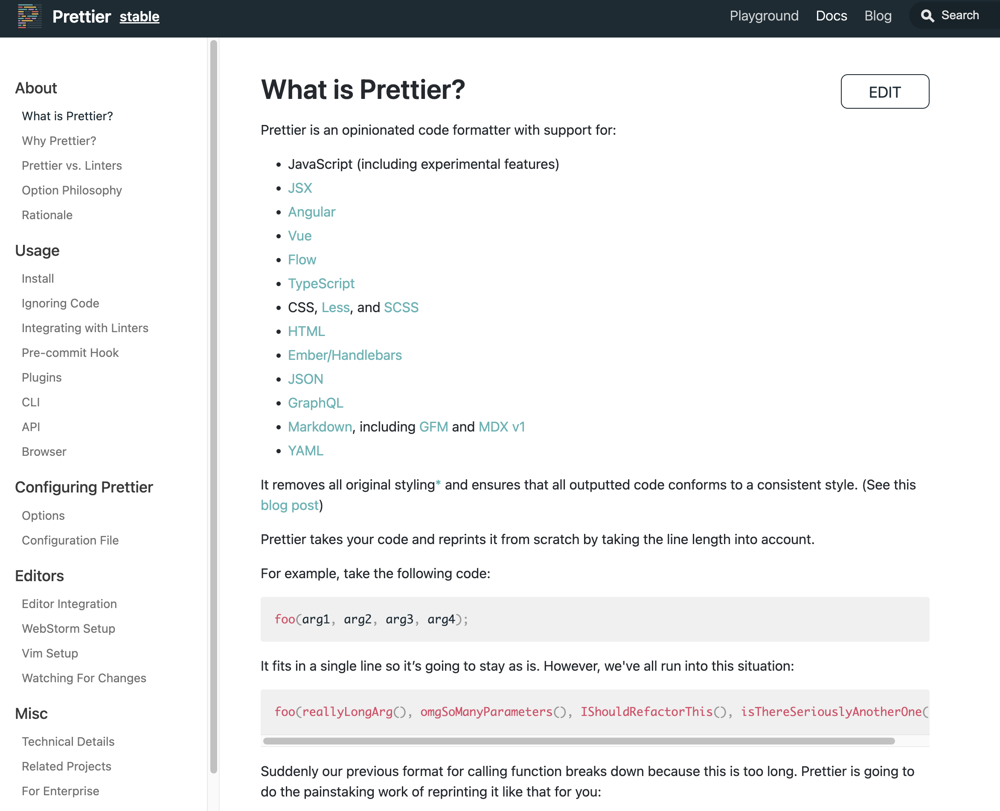

**Github：**[https://github.com/prettier/prettier](https://github.com/prettier/prettier)

## 语言支持：Vue - Official
Vue - Official 是 Vue 官方提供的 VS Code 插件，它为 Vue SFC 提供了开箱即用的格式化功能。其原名为 Volar，于近期改名。

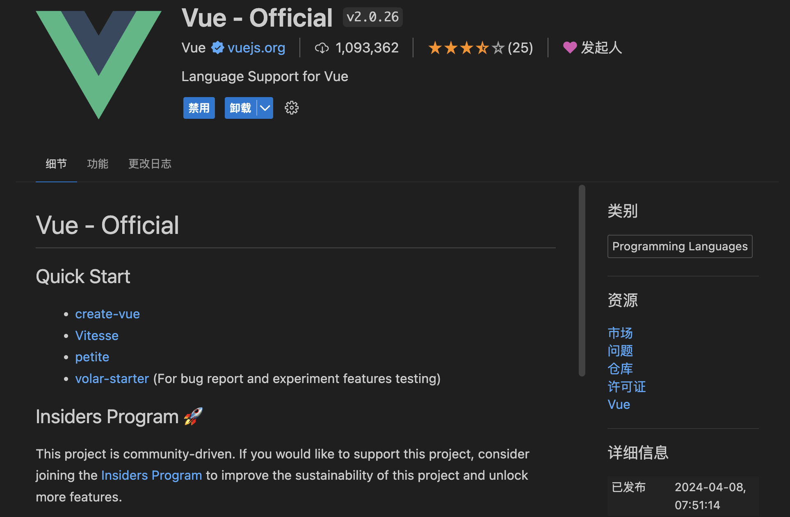

## 国际化：vue-i18n
Vue I18n 是 Vue.js 的国际化插件，全称为 internationalization，缩写为 i18n。这个插件可以轻松地将本地化功能集成到 Vue.js 应用中，实现前端界面的国际化。

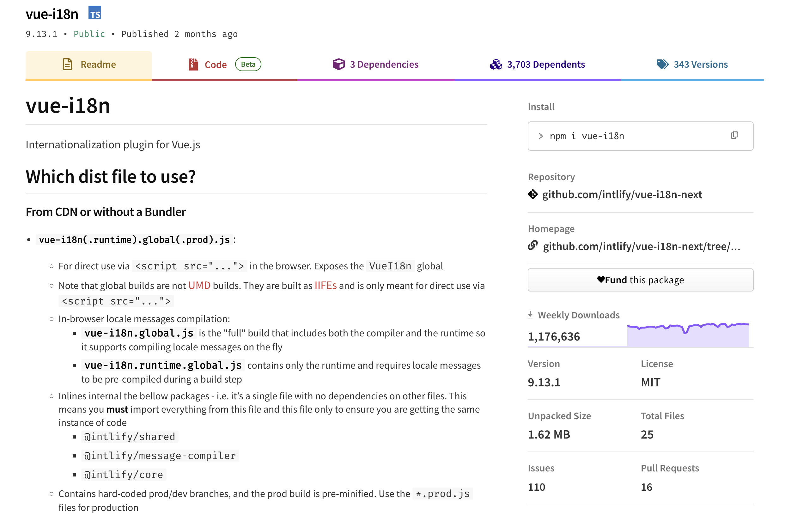

**Github：**[https://github.com/intlify/vue-i18n](https://github.com/intlify/vue-i18n)

## Apollo/GraphQL 集成：apollo
Apollo 是一个用于 Vue.js 应用的集成解决方案，它允许开发者通过声明式查询的方式在 Vue 组件中使用 GraphQL，实现数据的自动更新和高效管理。

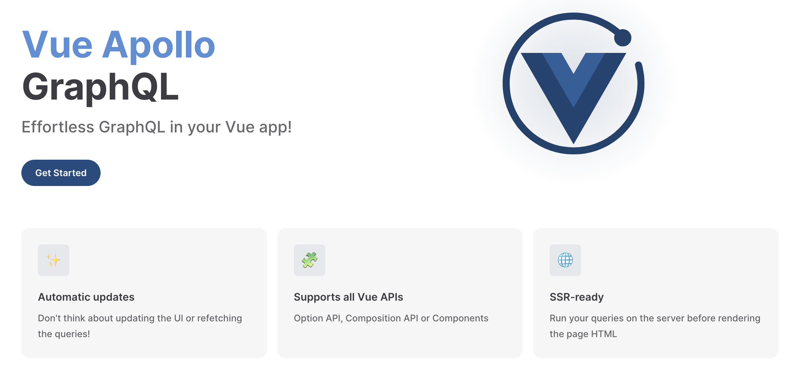

**Github：**[https://github.com/vuejs/apollo](https://github.com/vuejs/apollo)

## Firebase 集成：**VueFire**
VueFire 是 Vue 的一个官方插件，它简化了 Vue 应用与 Firebase 的集成。Firebase 是 Google 提供的一个全栈式开发平台，包括实时云数据库、身份验证、存储和托管等服务。VueFire 通过提供一组简单易用的API，使得在 Vue 应用中集成 Firebase 变得更加简单和高效

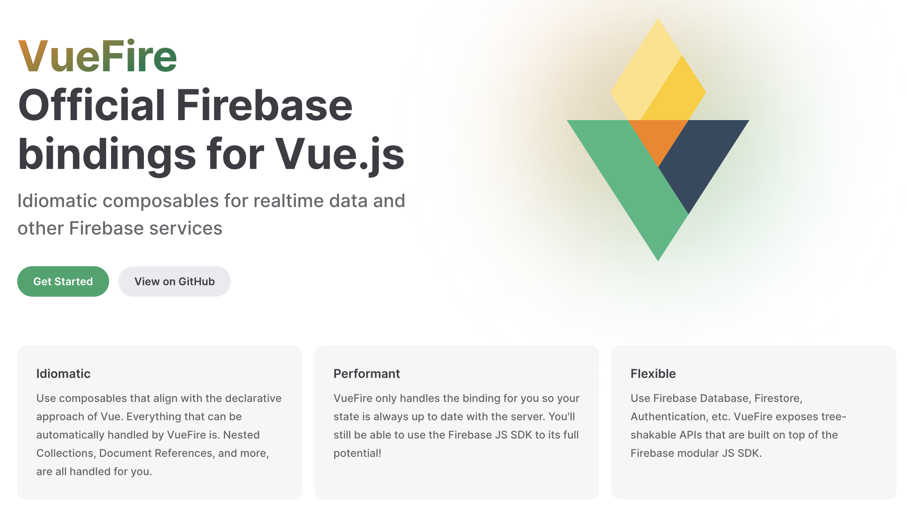

**Github**：[https://github.com/vuejs/vuefire](https://github.com/vuejs/vuefire)

## 样式：UnoCSS / Tailwind CSS
### UnoCSS
UnoCSS 是一个由 Antfu 开发的 CSS 框架，旨在提供最小、最高效的样式解决方案，适用于任何现代 Web 项目。其核心特点是即时、按需生成 CSS 样式，通过原子化设计将 CSS 样式拆分为最基本的元素，并仅在需要时生成相应的 CSS 规则，从而显著减少加载时间和生成的 CSS 文件大小。

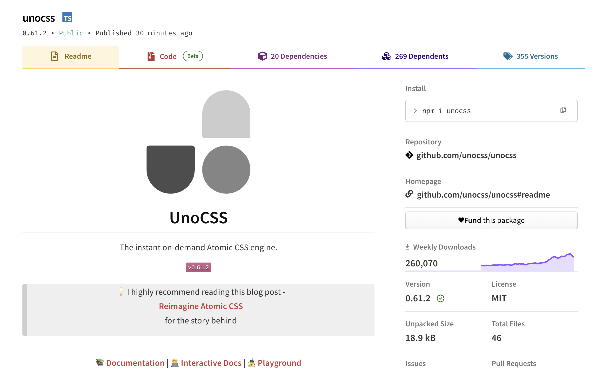

**Github：**[https://github.com/unocss/unocss](https://github.com/unocss/unocss)

### Tailwind CSS
Tailwind CSS 是一个实用程序优先的 CSS 框架，它提供了一组原子级别的CSS类，鼓励开发者直接控制CSS类来构建界面。Tailwind CSS 通过组合这些类可以快速构建界面，适合喜欢直接控制样式的开发者。

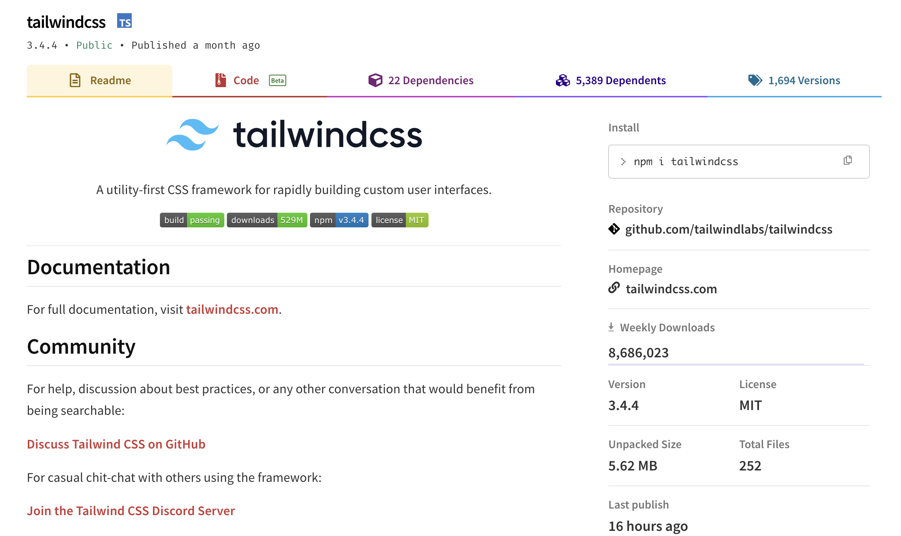

**Github：**[https://github.com/tailwindlabs/tailwindcss](https://github.com/tailwindlabs/tailwindcss)

## UI组件库：Element UI / Ant Design Vue / Vant
国内使用比较多的组件库：

+ **Vue 2**：Element UI
+ **Vue 3**：Element Plus
+ **Vue 2 & Vue 3**： Ant Design Vue
+ **移动端、小程序**：Vant

## 桌面应用开发：Electron-Vite
Electron-Vite 是一个与 Vite 集成的 Electron 构建工具，旨在提供更快、更精简的开发体验。它允许开发者使用 Vite 打包代码，并处理 Electron 的独特环境，包括 Node.js 和浏览器环境。

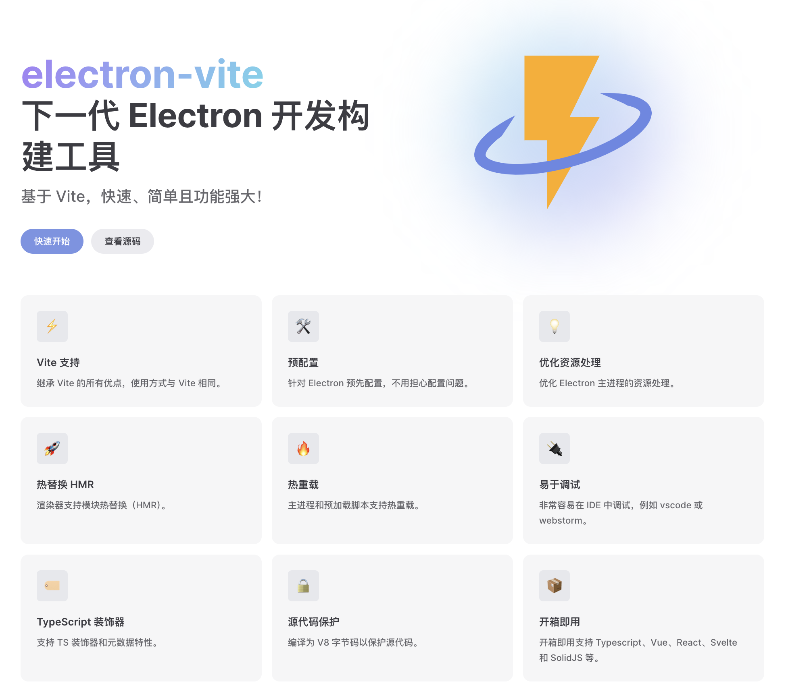

**Github：**[https://github.com/alex8088/electron-vite](https://github.com/alex8088/electron-vite)

## 跨端应用开发：uniapp
uni-app是一个基于Vue.js开发的跨平台应用开发框架。它允许开发者使用一套代码同时构建iOS、Android、H5、小程序等多个平台的应用，极大地提高了开发效率并降低了开发成本。

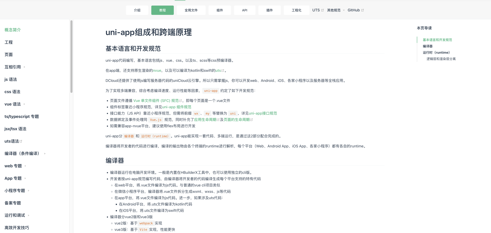

## 数据请求：Axios
Axios是一个基于Promise的网络请求库，它可以在Node.js和浏览器中运行，它提供了一种简单而直观的方式来发送各种HTTP请求，如GET、POST、PUT、DELETE等，并且易于对请求和响应进行拦截处理。

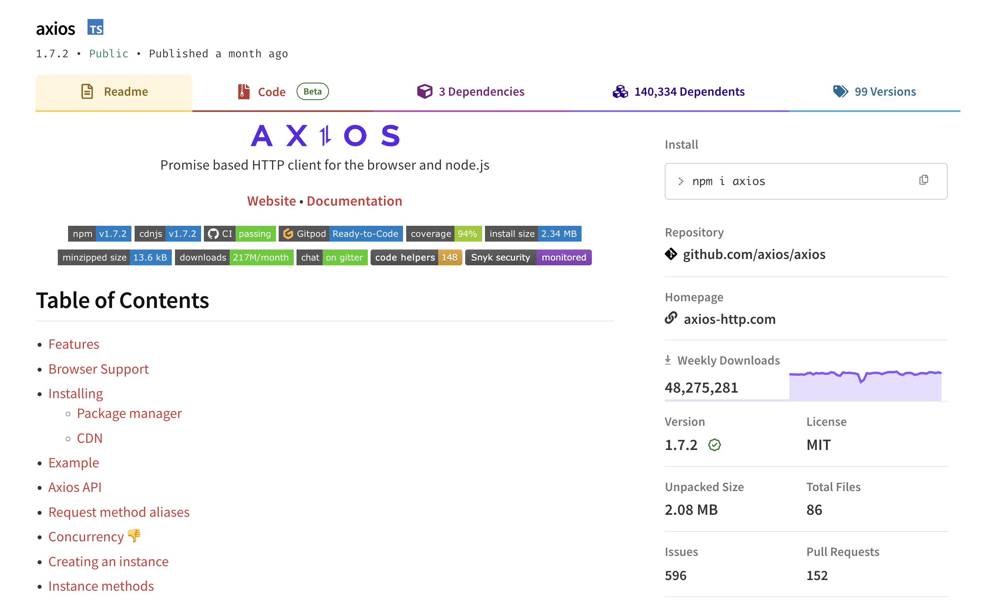

**Github：**[https://github.com/axios/axios](https://github.com/axios/axios)

## 可视化：Echarts
ECharts 是一个基于JavaScript的开源数据可视化图表库，最初由百度团队开发并于2018年捐赠给 Apache 基金会。它提供了直观、生动、可交互、可个性化定制的数据可视化图表，广泛应用于Web开发中，支持多种图表类型和丰富的配置选项。

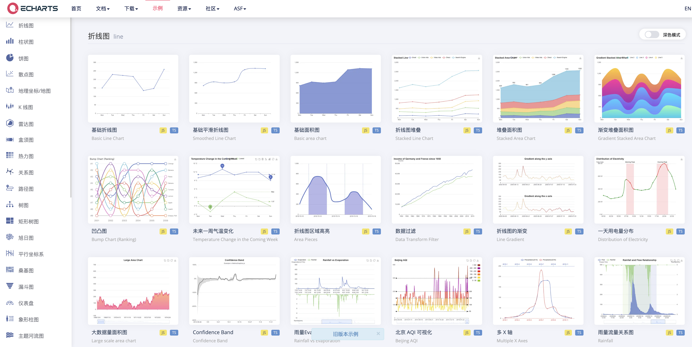

**Github：**[https://github.com/apache/echarts](https://github.com/apache/echarts)

> 更新: 2024-07-08 14:34:45  
> 原文: <https://www.yuque.com/cuggz/feplus/um7lku9cwdic1ycm>