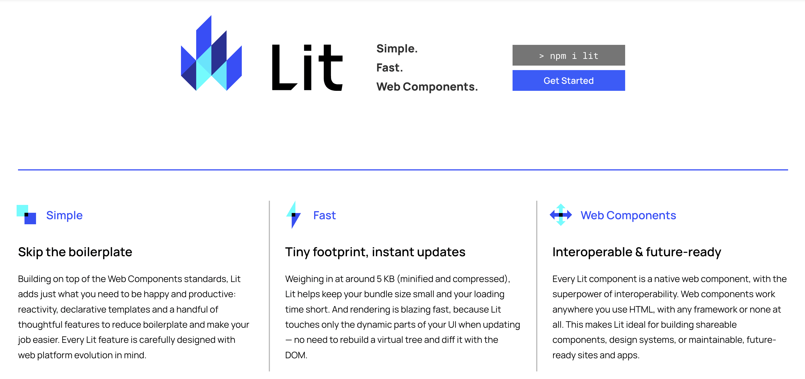
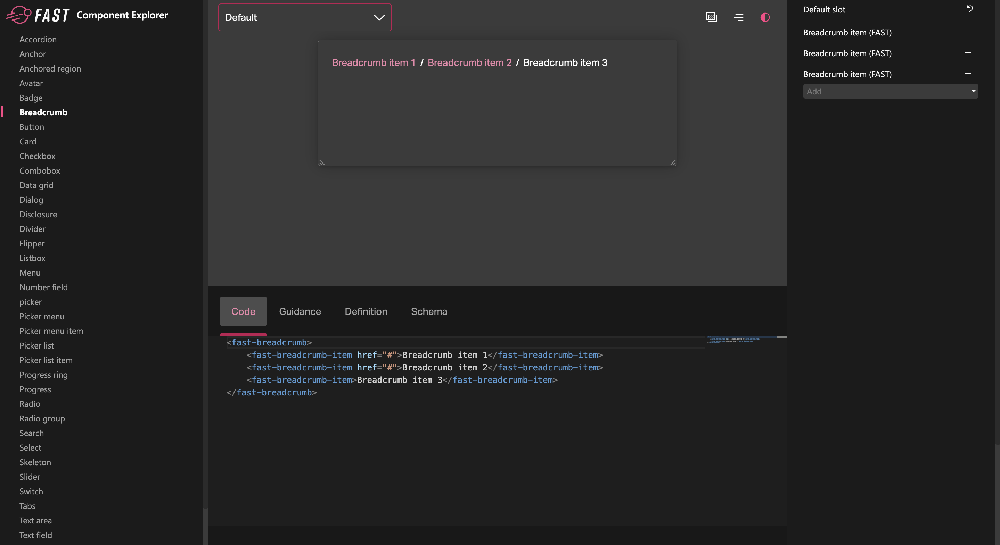
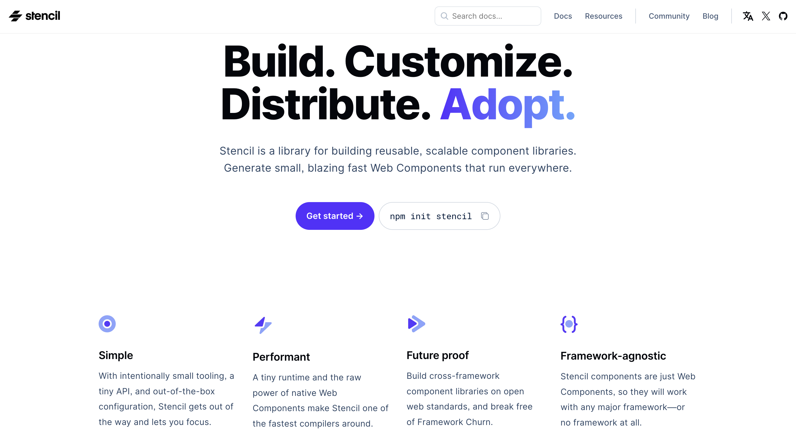
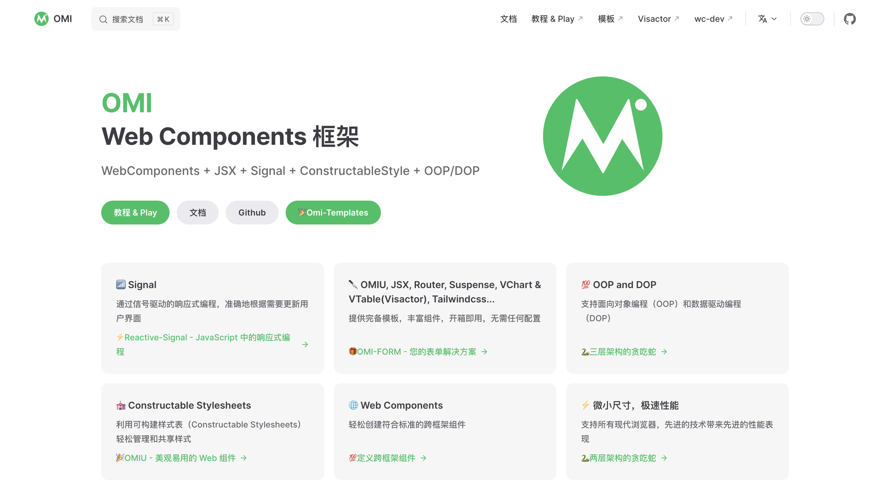
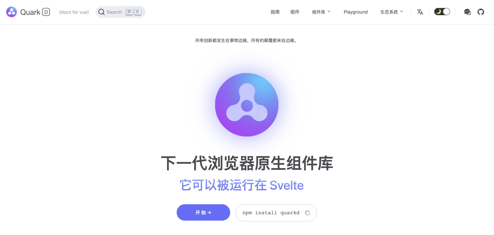
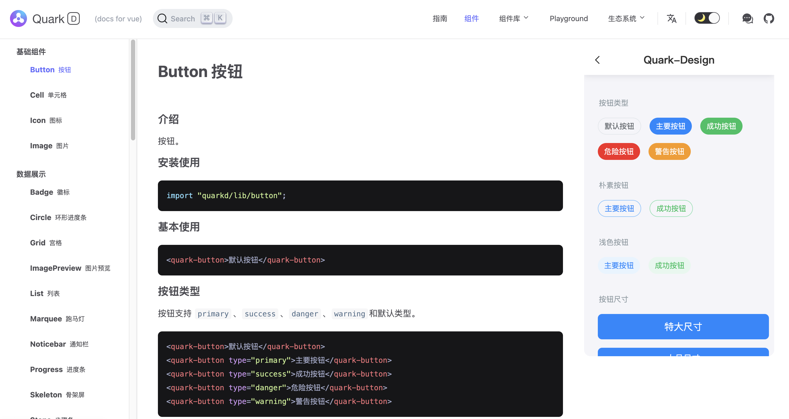
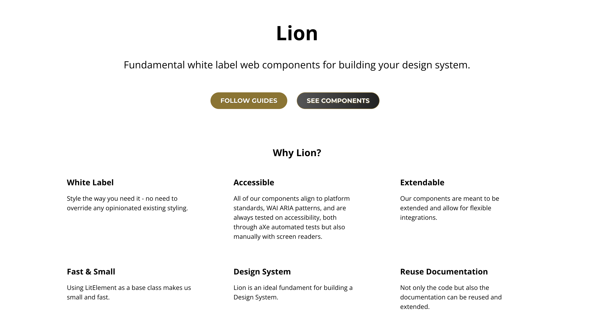
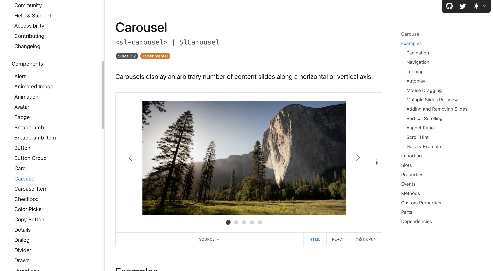
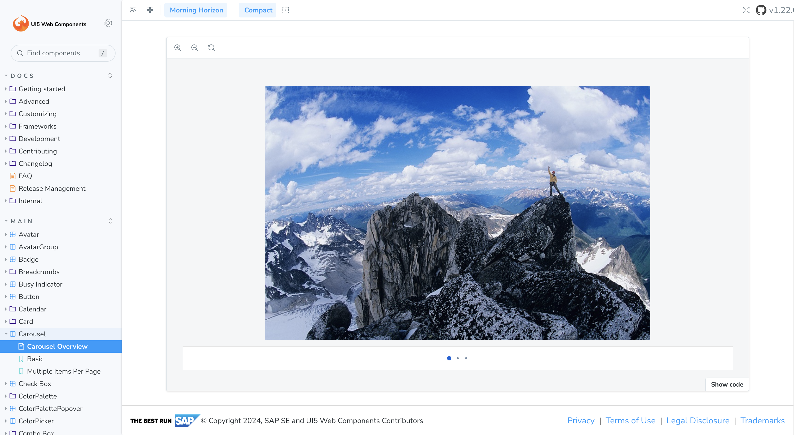
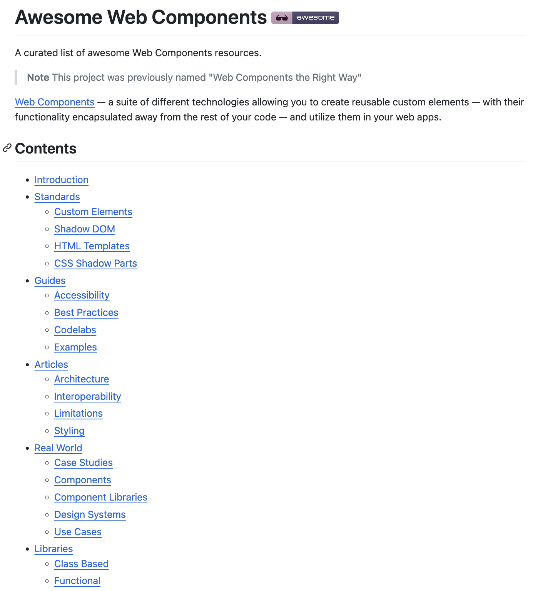

# Web Components

Web Components 是一种用于构建可复用用户界面组件的技术，它允许开发者创建自定义的HTML标签，并将其封装为包含逻辑和样式的独立组件，从而在任何Web应用中重复使用。Web Components主要包含custom elements（自定义元素）、shadow DOM（影子DOM）和HTML templates（HTML模板）三个部分，分别用于注册自定义元素、提供shadow-dom接口以及通过template和slot编写自定义元素的结构模板。本文就来分享九个值得学习的 Web Components 开源项目，带你走进 Web Components 的世界！

## Lit
Lit 是一个基于 Web Components 标准的 JavaScript 库，它提供了一系列的工具和 API ，使得创建高性能、动态、可重用的 Web 组件变得更加容易。Lit 的特点包括：

+ **轻量级**：Lit 的代码库非常小巧，压缩后只有不到 10KB，这使得它使用起来非常方便，加载速度也很快。
+ **编程简洁**：Lit 提供了一组简单的 API，并且支持使用 JavaScript 模板字符串进行 HTML 的快速构建，降低组件编写的难度。
+ **可扩展性强**：Lit 不仅支持原生的 Web Components 标准 API，还提供了一些自定义的组件 API，可以更加方便地实现高级功能。
+ **生态丰富**：Lit 社区活跃，提供了许多常用的外部库和组件，可以帮助开发者快速搭建复杂的应用程序。

**Github：**[https://github.com/lit/lit](https://github.com/lit/lit)

## Fast Element
Fast Element 是一个基于 Web Components 标准的开源 UI 库，由 Microsoft 出品。Fast Element 旨在提供高性能、可维护和易扩展的 Web Components，以便构建现代化 Web 应用程序。Fast Element 的特点包括：

+ **简单易用**：提供了一组简单的 API，可以使用 TypeScript 进行开发，并且支持使用 CSS 样式进行个性化定制，使得组件开发更加容易。
+ **可复用性强**：提供了一些通用的组件，如按钮、文本框等，这些组件可以直接调用或集成到其他组件中，降低了开发和维护成本。
+ **样式定制灵活**：支持使用 CSS 变量进行主题定制，也支持使用 LESS 或者 Sass 进行样式的编写和管理，开发者可以根据自身需求自由定制样式。
+ **支持无障碍访问**：提供了高度可访问的 UI 组件，符合 W3C 的 Web Content Accessibility Guidelines (WCAG) 标准，在无障碍环境下使用也非常友好。

**Github：**[https://github.com/Microsoft/fast](https://github.com/Microsoft/fast)

## Stencil 
Stencil是一个开源的使用TypeScript、JSX和CSS来创建符合标准的Web Components的编译器。它结合了最流行框架的最佳概念，提供便捷的API和关键功能，如预渲染和对象作为属性，使编写快速、强大的组件变得更加简单。Stencil还可以生成特定于框架的包装器，以便与流行的框架直接集成使用，并提供优化的开发体验，包括实时重载和一个小型开发服务器。

**Github：**[https://github.com/ionic-team/stencil](https://github.com/ionic-team/stencil)

## omi
omi 是腾讯出品的 Web Components 框架，内置 JSX 和信号 signal/Signal。其具有以下特点：

+ **信号驱动的响应式编程**：OMI框架采用信号驱动的响应式编程方式，确保用户界面能够准确地根据需要进行更新。这种编程方式有助于减少不必要的渲染和计算，提高应用的性能和用户体验。
+ **完备的模板和组件**：OMI框架提供了丰富的模板和组件，包括OMIU、JSX、Router、Suspense、VChart和VTable（Visactor）等。这些组件和模板都是开箱即用的，无需进行任何配置，可以大大简化开发过程，提高开发效率。
+ **面向对象编程（OOP）和数据驱动编程（DOP）**：OMI框架同时支持面向对象编程（OOP）和数据驱动编程（DOP）两种编程方式。这意味着开发者可以根据项目需求选择最适合的编程方式，灵活应对不同的开发场景。
+ **可构建样式表（Constructable Stylesheets）**：OMI框架支持可构建样式表（Constructable Stylesheets），这使得样式的管理和共享变得更加轻松。通过可构建样式表，开发者可以更加高效地管理和维护应用的样式。
+ **Web Components支持**：OMI框架支持Web Components，这意味着开发者可以轻松地创建符合标准的跨框架组件。这有助于提高组件的复用性和可维护性，降低开发成本。
+ **微小尺寸和极速性能**：OMI框架具有微小的尺寸和极速的性能，支持所有现代浏览器。这得益于框架采用了先进的技术和优化手段，使得应用能够在保持高性能的同时保持较小的体积。

**Github：**[https://github.com/Tencent/omi](https://github.com/Tencent/omi)

## Quark Design
Quark Design 是哈啰出品的面向 C 端的下一代前端组件库，它可以在任意框架或无框架中使用，支撑哈啰几乎所有 C 端 H5 项目，包括交易，支付，两轮，商城等。这是一个设计轻盈优雅的企业级 UI 组件库，可以满足所有日常使用的基础组件需求。

Quark design 是一种全新的组件库，底层基于Web Components，不同于传统组件框架（如Antd, Vant），需要浏览器中需要做大量前置工作。Quarkd则将这些工作放到构建应用程序的编译时来处理。组件的数据更新响应由浏览器自身API处理，更简单，更高效！

**Github：**[https://github.com/hellof2e/quark-design](https://github.com/hellof2e/quark-design)

## Lion
Lion 是一套基于 Web Components 的组件库，具备高性能、高可访问性和灵活性。作为一个无偏见、可定制的白标层，Lion 提供了丰富的组件基础，允许开发者轻松扩展和构建自己的组件层。

+ 在性能方面，Lion 专注于在所有主流浏览器中实现卓越的性能，同时保持极低的依赖项数量，确保高效的运行和加载速度。
+ 在可访问性方面，Lion 致力于符合 WCAG 2.2 AA 标准，通过创建无障碍的组件，确保所有人都能够轻松使用和访问。
+ 在灵活性方面，Lion 提供了基于 Web 组件和 JavaScript 类的解决方案，这些方案可以根据具体需求进行使用、采纳和扩展，满足各种场景下的需求。
+ Lion 还采用了现代代码的分发方式，以纯 es 模块的形式提供，便于集成和使用。同时，它还以最合适的形式公开函数、类和 Web 组件，方便开发者根据需求选择和使用。

**Github：**[https://github.com/ing-bank/lion](https://github.com/ing-bank/lion)

## Shoelace
Shoelace 是一个具有前瞻性的基于 Web Components 的 UI 组件库。它具有以下特点：

+ 兼容所有框架
+ 兼容CDN
+ 可通过CSS完全自定义
+ 包含深色主题
+ 以无障碍性为设计核心
+ 提供一流的React支持
+ 内置本地化功能 

**Github：**[https://github.com/shoelace-style/shoelace](https://github.com/shoelace-style/shoelace)

## UI5 Web Components
UI5 Web Components 是 SAP UI5 框架的一部分，它是一个开源的 Web 组件库，用于构建现代的 Web 应用。UI5 Web Components 提供了一系列的可复用的 UI 组件，如按钮、输入框、表格等，这些组件都是基于 Web 标准的自定义元素和 Shadow DOM 技术实现的。这意味着可以在任何支持这些 Web 标准的环境中使用这些组件，如 Angular、React、Vue 等。

**Github：**[https://github.com/SAP/ui5-webcomponents](https://github.com/SAP/ui5-webcomponents)

## Awesome Web Components
一系列 Web Components 学习资源，包含文章、案例、框架、库、生态系统、图书等。

**Github：**[https://github.com/web-padawan/awesome-web-components](https://github.com/web-padawan/awesome-web-components)

> 更新: 2024-02-24 16:19:30  
> 原文: <https://www.yuque.com/cuggz/feplus/mo581cssqbndtqve>