# 中后台管理模版

## Vue Element Admin
vue-element-admin 是一个后台前端解决方案，它基于 vue 和 element-ui实现。它使用了最新的前端技术栈，内置了 i18n 国际化解决方案，动态路由，权限验证，提炼了典型的业务模型，提供了丰富的功能组件，它可以帮助你快速搭建企业级中后台产品原型。

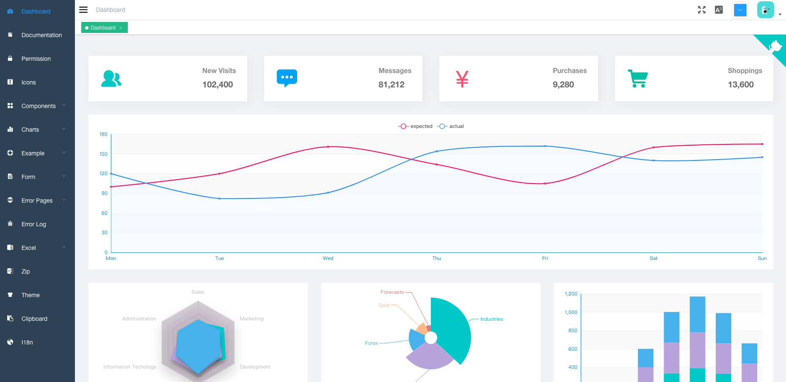

**Github（****⭐****️77.5k）：**[https://github.com/PanJiaChen/vue-element-admin](https://github.com/PanJiaChen/vue-element-admin)

## Ant Design Pro
Ant Design Pro 是基于 Ant Design 和 umi 的封装的一整套企业级中后台前端/设计解决方案，致力于在设计规范和基础组件的基础上，继续向上构建，提炼出典型模板/业务组件/配套设计资源，进一步提升企业级中后台产品设计研发过程中的用户和设计者的体验。

Ant Design Pro 的特点如下：

+ **TypeScript**: 应用程序级 JavaScript 的语言
+ **区块**: 通过区块模板快速构建页面
+ **优雅美观**：基于 Ant Design 体系精心设计
+ **常见设计模式**：提炼自中后台应用的典型页面和场景
+ **最新技术栈**：使用 React/umi/dva/antd 等前端前沿技术开发
+ **响应式**：针对不同屏幕大小设计
+ **主题**：可配置的主题满足多样化的品牌诉求
+ **国际化**：内建业界通用的国际化方案
+ **最佳实践**：良好的工程实践助您持续产出高质量代码
+ **Mock 数据**：实用的本地数据调试方案
+ **UI 测试**：自动化测试保障前端产品质量

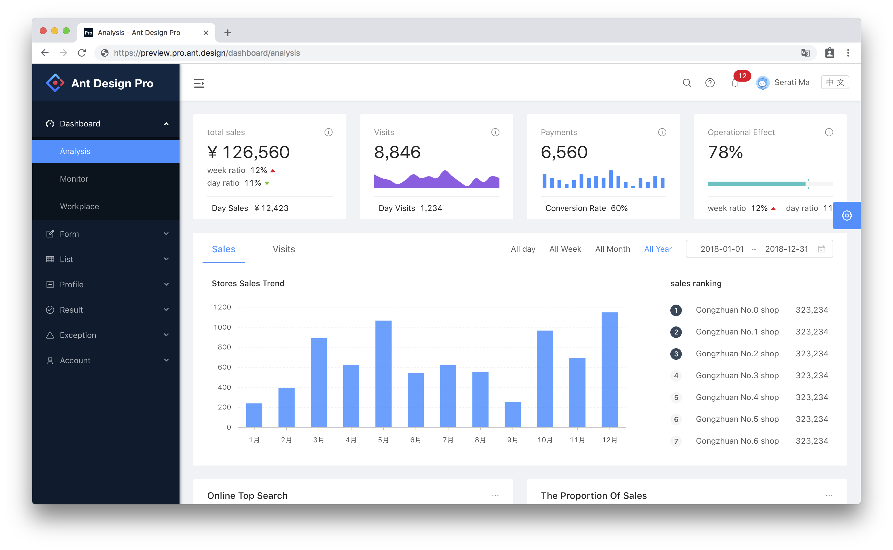

**Github（****⭐****️32.5k）：**[https://github.com/ant-design/ant-design-pro](https://github.com/ant-design/ant-design-pro)

## React Admin
React Admin 是基于React17.x、Ant Design4.x、Material Design在REST/GraphQL API之上构建在浏览器中运行的管理应用程序的一款前端框架。

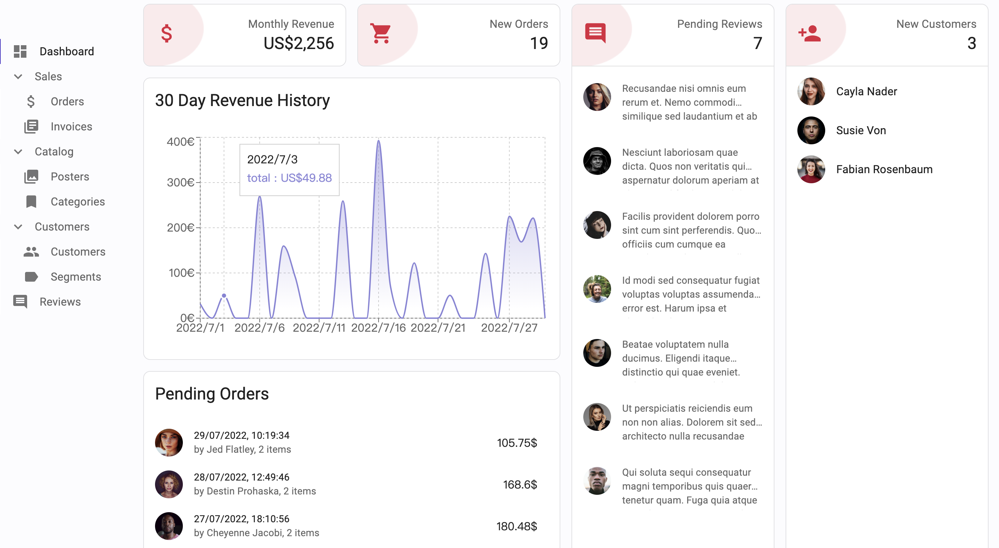

**Github（****⭐****️20.2k）：**[https://github.com/marmelab/react-admin](https://github.com/marmelab/react-admin)

## iView Admin
iView-admin是iView生态中的成员之一，是一套采用前后端分离开发模式，基于Vue的后台管理系统前端解决方案。其内置了开发后台管理系统常用的逻辑功能，和开箱即用的业务组件，旨在让开发者能够以最小的成本开发后台管理系统，降低开发量。

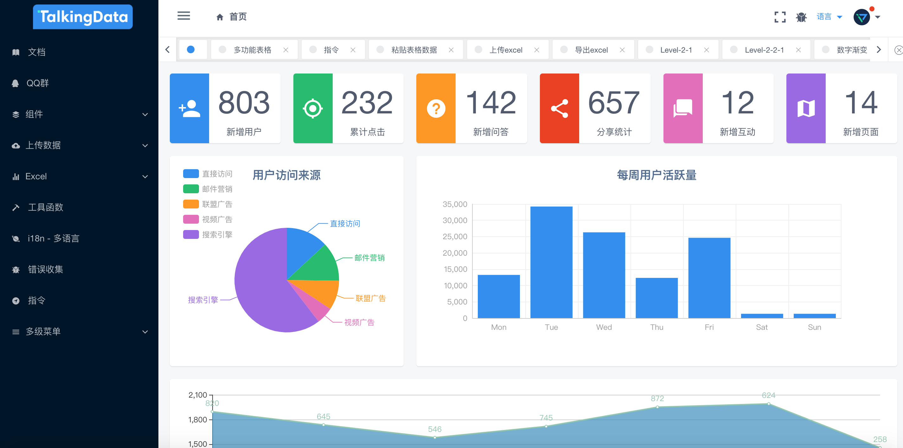

**Github（****⭐****️16.1k）：**[https://github.com/iview/iview-admin](https://github.com/iview/iview-admin)

## Vue Manage System
Vue Manage System 是一个后台管理系统解决方案。它作为一套多功能的后台框架模板，适用于绝大部分的后台管理系统（Web Management System）开发。基于 Vue3 + pinia，引用 Element Plus 组件库，方便开发快速简洁好看的组件。分离颜色样式，支持手动切换主题色，而且很方便使用自定义主题色。

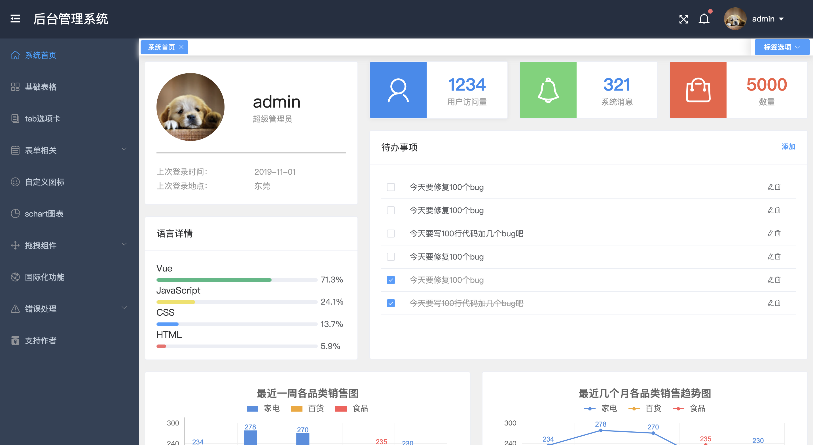

**Github（****⭐****️15.4k）：**[https://github.com/lin-xin/vue-manage-system](https://github.com/lin-xin/vue-manage-system)

## Vue vben admin
Vue Vben Admin 是一个免费开源的中后台模版。使用了最新的vue3,vite2,TypeScript等主流技术开发，开箱即用的中后台前端解决方案。其特点如下：

+ **最新技术栈**：使用 Vue3/vite2 等前端前沿技术开发
+ **TypeScript**: 应用程序级 JavaScript 的语言
+ **主题**：可配置的主题
+ **国际化**：内置完善的国际化方案
+ **Mock 数据** 内置 Mock 数据方案
+ **权限** 内置完善的动态路由权限生成方案
+ **组件** 二次封装了多个常用的组件

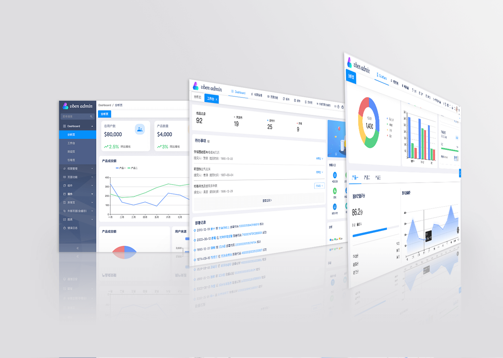

**Github（****⭐****️13k）：**[https://github.com/vbenjs/vue-vben-admin](https://github.com/vbenjs/vue-vben-admin)

## Vue Admin  Better
vue-admin-better 是一个基于 vue3+element-plus 的中后台前端框架。其特点如下：

+ 40+高质量单页
+ RBAC 模型 + JWT 权限控制
+ 10 万+ 项目实际应用
+ 良好的类型定义
+ 开源版本支持免费商用
+ 跨平台 PC、手机端、平板
+ 后端路由动态渲染

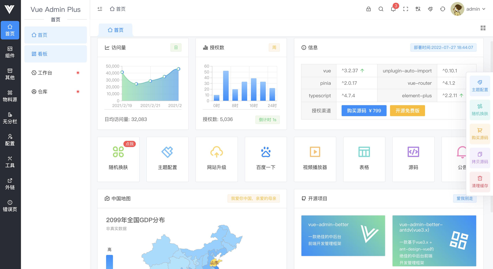

**Github（****⭐****️12.6k）：**[https://github.com/chuzhixin/vue-admin-better](https://github.com/chuzhixin/vue-admin-better)

## D2Admin
D2Admin 是一个完全开源免费的企业中后台产品前端集成方案，使用最新的前端技术栈，小于 60kb 的本地首屏 js 加载，已经做好大部分项目前期准备工作，并且带有大量示例代码，助力管理系统敏捷开发。

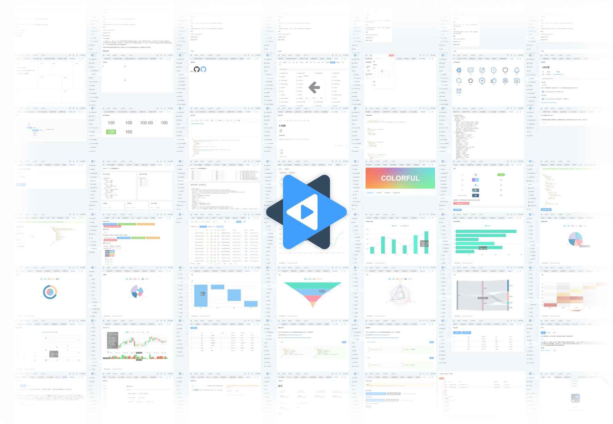

**Github（****⭐****️11.6k）：**[https://github.com/d2-projects/d2-admin](https://github.com/d2-projects/d2-admin)

## AntD Admin
AntD Admin 是一套优秀的中后台前端解决方案。其特征如下：

+ 国际化，源码中抽离翻译字段，按需加载语言包
+ 动态权限，不同权限对应不同菜单
+ 优雅美观，Ant Design 设计体系
+ Mock 数据，本地数据调试

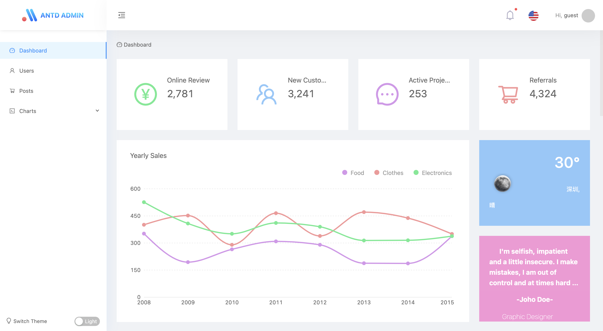

**Github（****⭐****️9k）：**[https://github.com/zuiidea/antd-admin](https://github.com/zuiidea/antd-admin)

## Vuestic Admin
Vuestic Admin 是一套免费且美观的 Vue.js （3.x）管理模板，使用 Vuestic UI 构建，包含 44 多个自定义 UI 组件。

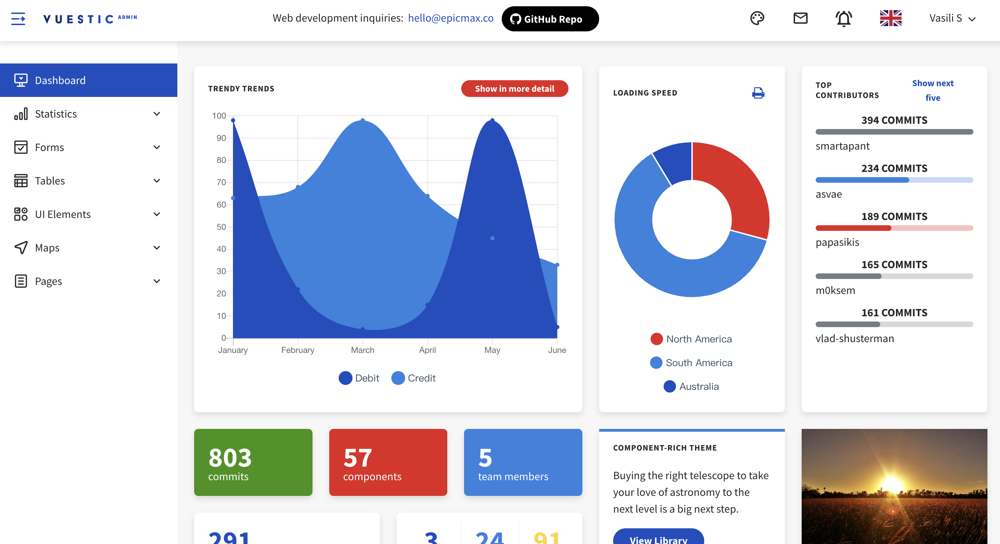

**Github（****⭐****️8.8k）：**[https://github.com/epicmaxco/vuestic-admin](https://github.com/epicmaxco/vuestic-admin)

## Vue Pure Admin
vue-pure-admin 是一个免费开源的中后台模版。使用了最新的vue3 vite2 Element-Plus TypeScript等主流技术开发，开箱即用的中后台前端解决方案。

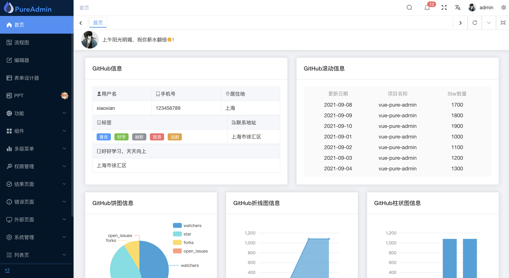

**Github（****⭐****️3.2k）：**[https://github.com/xiaoxian521/vue-pure-admin](https://github.com/xiaoxian521/vue-pure-admin)

## Vue Antd Admin
Vue Antd Admin 是 Ant Design Pro 的 Vue 实现版本，是一个开箱即用的中后台前端/设计解决方案。

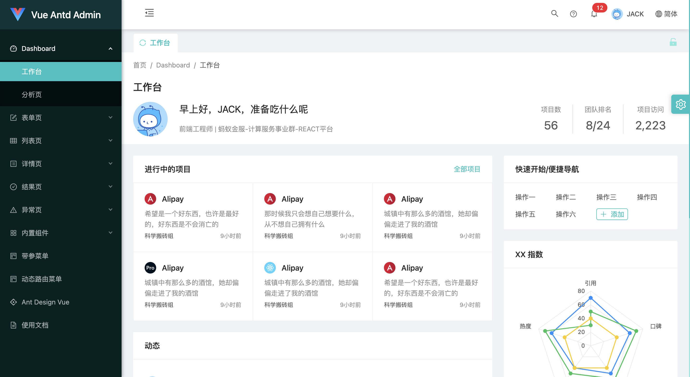

**Github（****⭐****️3.1k）：**[https://github.com/iczer/vue-antd-admin](https://github.com/iczer/vue-antd-admin)

## Geeker Admin
Geeker Admin 是基于 Vue3.2、TypeScript、Vite2、Pinia、Element-Plus 开源的一套后台管理模板。

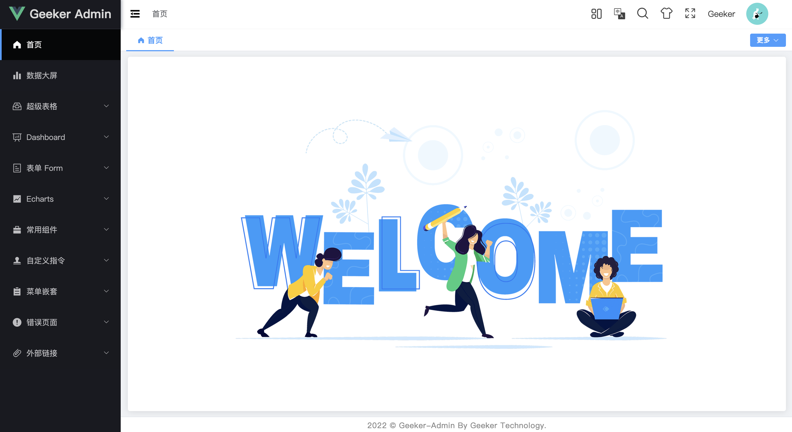

**Github（****⭐****️1.8k）：**[https://github.com/HalseySpicy/Geeker-Admin](https://github.com/HalseySpicy/Geeker-Admin)

## Soybean Admin
Soybean Admin 是一个基于 Vue3、Vite3、TypeScript、Naive UI和UnoCSS 的清新优雅的中后台模版，它使用了最新的前端技术栈，内置丰富的主题配置，有着极高的代码规范，基于mock实现的动态权限路由，开箱即用的中后台前端解决方案。

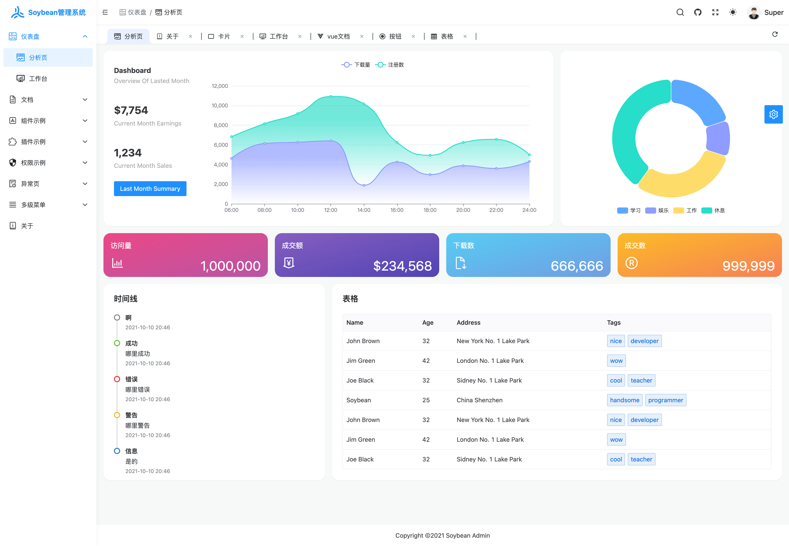

**Github（****⭐****️1.2k）：**[https://github.com/honghuangdc/soybean-admin](https://github.com/honghuangdc/soybean-admin)

## Vue Admin Box
vue-admin-box是一个免费并且开源的中后台管理系统模板。使用最新版本的vue3+vite+element-plus开发而成，目的是为了解决通用型的业务中后台系统复杂的配置。

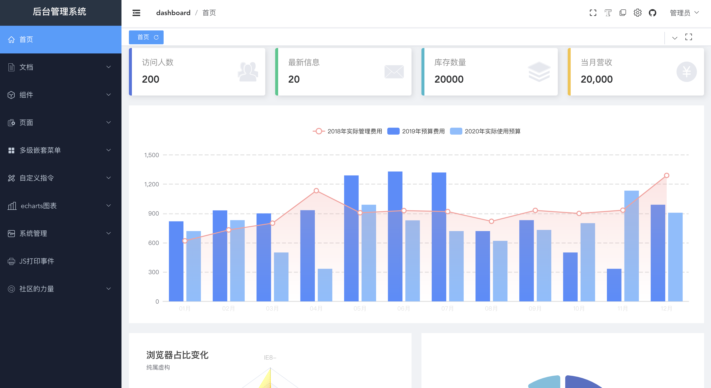

**Github（****⭐****️880）：**[https://github.com/cmdparkour/vue-admin-box](https://github.com/cmdparkour/vue-admin-box)

## Vue3.0 Template Admin
vue3.0-template-admin 是基于 vue3+ElementPlus+Typescript+Vite 搭建一套通用的后台管理模板；并基于常见业务场景，抽象出常见功能组件；包括动态菜单，菜单权限、登录、主题切换、国际化、个人中心、表单页、列表页、复制文本、二维码分享等。

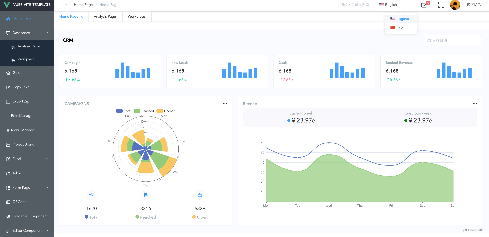

**Github（****⭐****️760）：**[https://github.com/GeekQiaQia/vue3.0-template-admin](https://github.com/GeekQiaQia/vue3.0-template-admin)

> 更新: 2022-08-07 01:16:15  
> 原文: <https://www.yuque.com/cuggz/feplus/gzam6g>