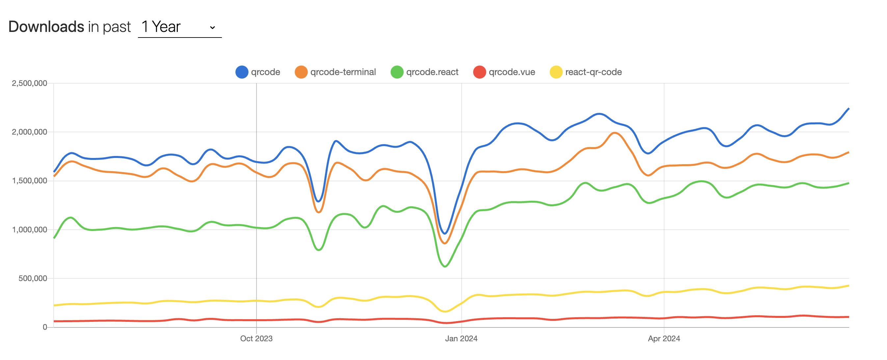
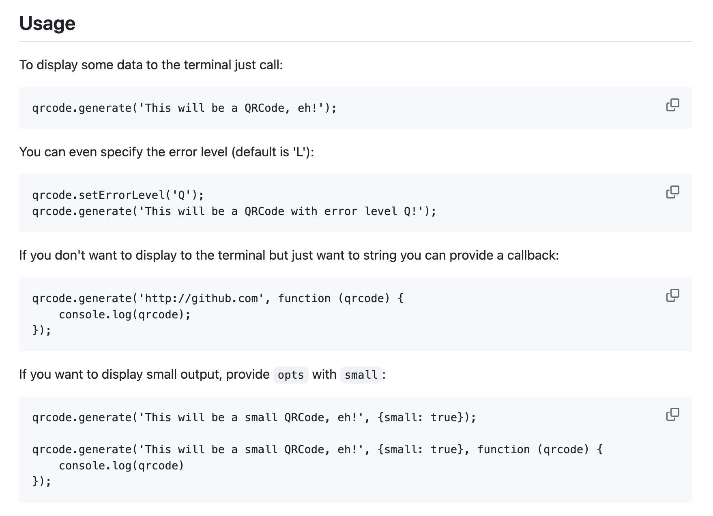
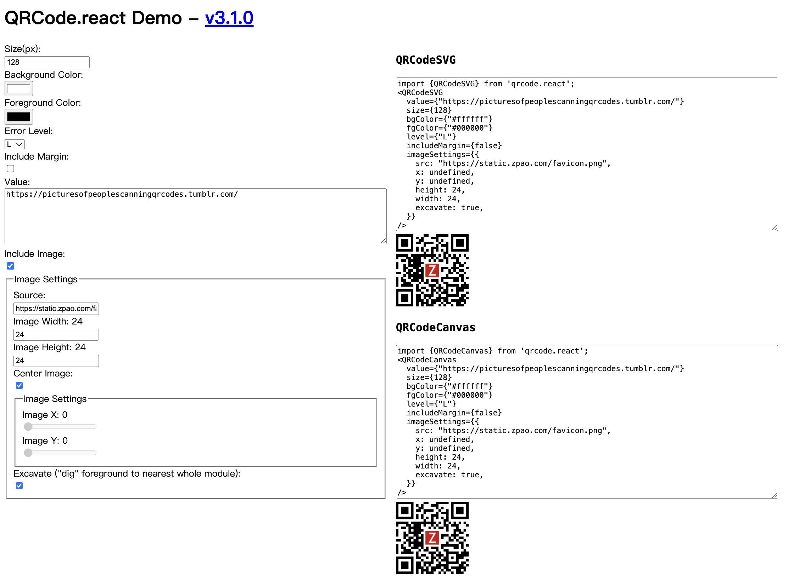
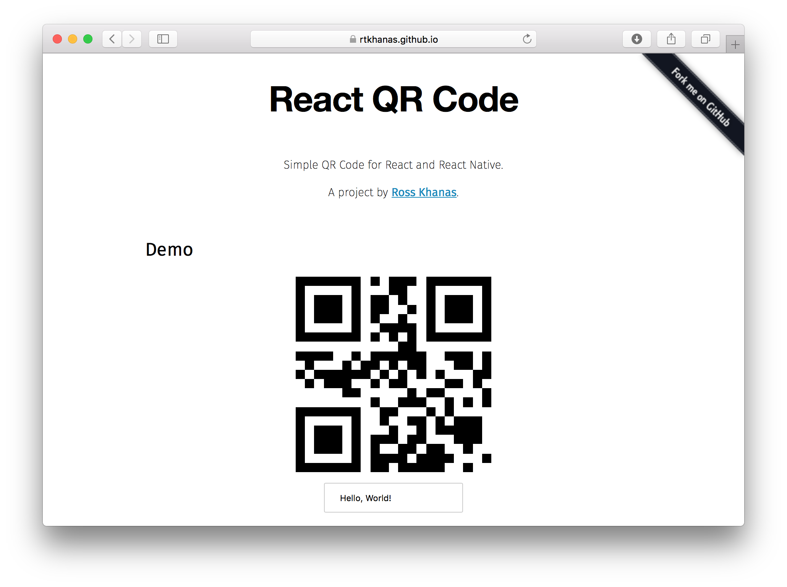

# 二维码

## node-qrcode
node-qrcode是一个用于生成二维码的Node.js库，它支持多种数据格式，并且可以将生成的二维码导出为各种图像格式，如PNG、JPEG、SVG和Data URI，**其适用于服务端和客户端**。

node-qrcode 的特点如下：

+ **跨平台支持**：既可以在服务端运行，也可以在客户端上运行。
+ **命令行工具**：它还提供了一个命令行实用程序，方便用户直接从命令行生成二维码。
+ **保存二维码为图像**：生成的二维码可以保存为PNG、JPEG、SVG等图像格式。
+ **多种编码模式支持**：支持数值、字母数字、汉字（Kanji）和字节模式。
+ **混合模式支持**：允许在同一个二维码中混合使用不同的编码模式。
+ **字符集支持**：支持中文、西里尔文、希腊文和日文字符，以及多字节字符（如表情符号😄）。
+ **自动优化**：自动生成优化的数据段，以实现最佳的数据压缩和最小的QR码尺寸。
+ **应用无关的可读性**：QR码本质上是应用无关的，这意味着它们可以在任何设备或应用上被扫描和识别。

**Github：**[https://github.com/soldair/node-qrcode](https://github.com/soldair/node-qrcode)

## qrcode-terminal
qrcode-terminal 是一个 Node.js 库，用于在终端中生成二维码。

qrcode-terminal 的特点如下：

+ **纯 JavaScript 实现**：qrcode-terminal 完全使用 JavaScript 编写，无需依赖其他库或工具。
+ **适配终端环境**：该库能够检测当前的终端环境，并根据终端的类型和特性调整 QR 码的显示方式。
+ **支持多种 QR 码编码**：qrcode-terminal 支持多种 QR 码编码方式，包括文本、URL、JSON 等。
+ **可配置**：用户可以根据自己的需求配置 QR 码的大小、颜色等属性。
+ **简单易用**：qrcode-terminal 的 API 设计简单明了，易于上手和使用。
+ **跨平台**：该库支持在 Unix/Linux、Windows 和 macOS 等多种操作系统上运行。

**Github：**[https://github.com/gtanner/qrcode-terminal](https://github.com/gtanner/qrcode-terminal)

## qrcode.react
qrcode.react 是一个基于React的库，专门用于在React应用程序中生成二维码。

**Github：**[https://github.com/zpao/qrcode.react](https://github.com/zpao/qrcode.react)

## react-qr-code
react-qr-code 是一个基于 React 的库，用于在 React 和 React Native 组件中生成二维码。

Github：[https://github.com/rosskhanas/react-qr-code](https://github.com/rosskhanas/react-qr-code)

## qrcode.vue
qrcode.vue 是一个 Vue.js 组件库，用于在 Vue 2 和 Vue 3 项目中轻松生成二维码。

**Github：**[https://github.com/scopewu/qrcode.vue](https://github.com/scopewu/qrcode.vue)

> 更新: 2024-11-30 15:16:37  
> 原文: <https://www.yuque.com/cuggz/feplus/mlg4bevlqn0o0k5y>