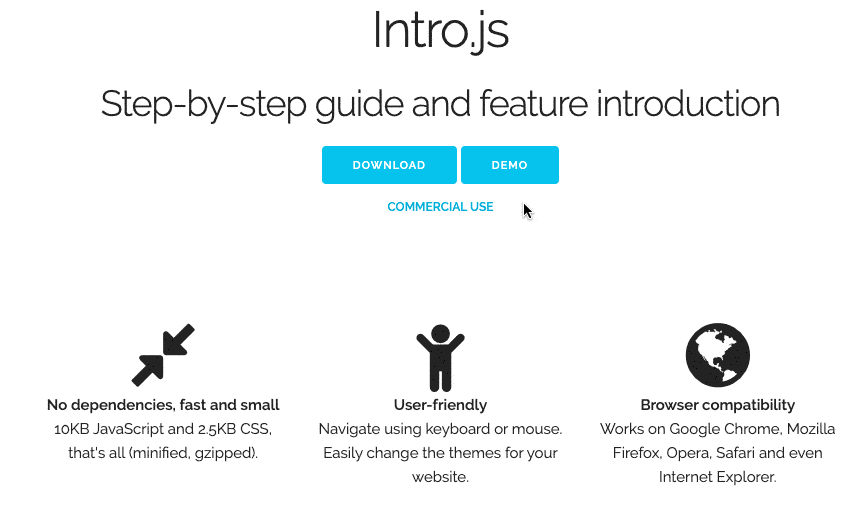
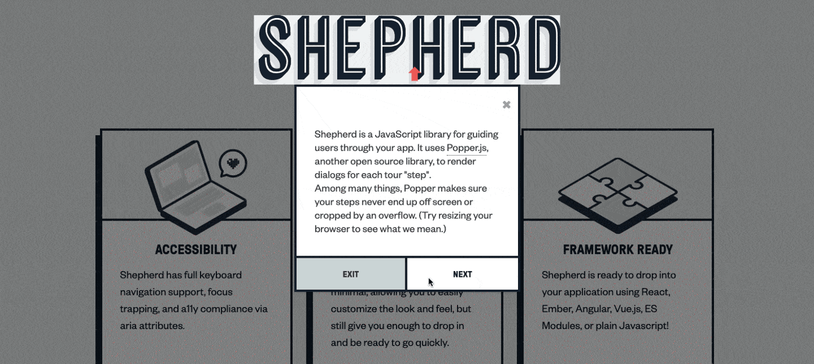
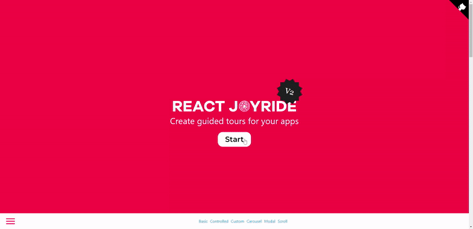
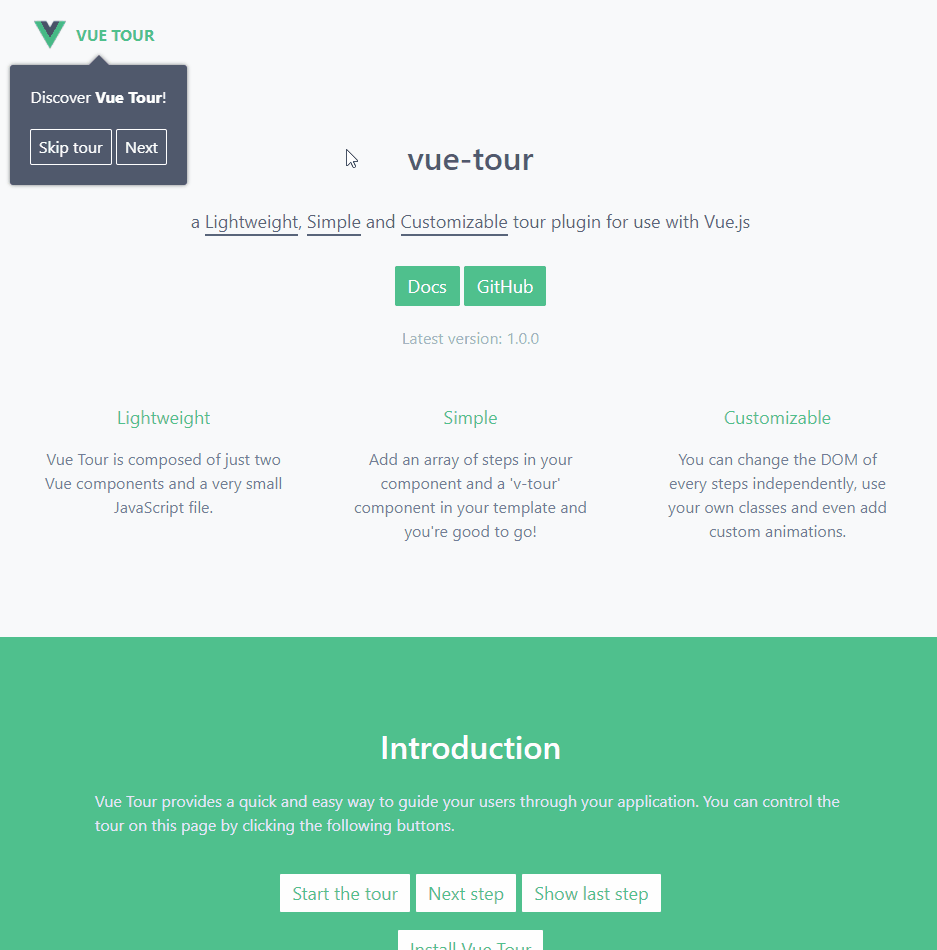
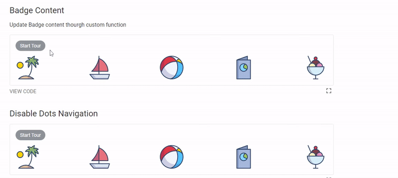

# 产品引导

在产品发布新版本或者有新功能上线时，经常需要新手引导功能来引导用户了解应用。下面就来分享几个开箱即用的新手引导组件库，帮你快速实现新手引导功能！

## Intro.js
Intro.js 是一个使用广泛的产品引导库，它在 Github 上拥有 21.6k Star。其具有以下特点：

+ **无依赖**：它不需要任何其他依赖。
+ **小而快**：库文件较小使得引导过程流畅直观。JavaScript 文件的整体大小为 10KB，CSS 为 2.5KB。
+ **用户友好**：提供可以根据喜好选择的各种主题。
+ **浏览器兼容性**：适用于所有主流浏览器，如 Google Chrome、Mozilla Firefox、Opera、Safari 等 。
+ **文档完善**：文档包含要介绍的每个元素的样本和示例。



可以通过以下命令来安装 Intro.js：

```javascript
npm install intro.js - save
```

安装完成后，只需三个简单的步骤即可将其添加到项目中：

1. 将 JavaScript 和 CSS 文件（intro.js 和 introjs.css）添加到项目中。
2. 将 data-intro 和 data-step 属性添加到相关的 HTML 元素。这将为特定元素启用 intro.js。
3. 调用以下 JavaScript 函数：

```javascript
introJs().start();
```

可以使用以下附加参数在特定元素或类上调用 Intro.js：

```javascript
introJs(".introduction-farm").start();
```

**Github：**[https://github.com/usablica/intro.js](https://github.com/usablica/intro.js)

## shepherd
Shepherd 在 Github 上拥有 10.7k GitHub Star。它支持在多个前端框架中开箱即用，包括 React、Vue、Angular 等。其具有以下特点：

+ **辅助功能**：提供键盘导航支持，遵循 a11y 规范，还可以使用 JavaScript 启用 DOM 元素内的焦点捕获。
+ **高度可定制**：允许在不影响性能的情况下更改外观。
+ **框架支持**：随时融入项目的前端框架。
+ **文档完善**：文档涵盖安装和自定义，包括项目的主题和样式。



可以使用以下命令来安装 shepherd.js：

```javascript
npm install shepherd.js -save
npm install react-shepherd --save
npm install vue-shepherd --save
npm install angular-shepherd --save
```

安装完成之后，可以按如下方式来使用 shepherd（以 React 为例）：

```javascript
import React, { Component, useContext } from 'react'
import { ShepherdTour, ShepherdTourContext } from 'react-shepherd'
import newSteps from './steps'

const tourOptions = {
  defaultStepOptions: {
    cancelIcon: {
      enabled: true
    }
  },
  useModalOverlay: true
};

function Button() {
  const tour = useContext(ShepherdTourContext);

  return (
    <button className="button dark" onClick={tour.start}>
      Start Tour
    </button>
  );
}

class App extends Component {
  render() {
    return (
      <div>
        <ShepherdTour steps={newSteps} tourOptions={tourOptions}>
          <Button />
        </ShepherdTour>
      </div>
    );
  }
}
```

+ **shepherd：**[https://github.com/shipshapecode/shepherd](https://github.com/shipshapecode/shepherd)
+ **react-shepherd：**[https://github.com/shipshapecode/react-shepherd](https://github.com/shipshapecode/react-shepherd)
+ **vue-shepherd**：[https://github.com/shipshapecode/vue-shepherd](https://github.com/shipshapecode/vue-shepherd)
+ **angular-shepherd：**[https://github.com/shipshapecode/angular-shepherd](https://github.com/shipshapecode/angular-shepherd)

## React Joyride
React Joyride 在 GitHub 上拥有超过 5.1k Star，在 React 项目中开箱即用，用于向现有用户介绍新功能。其具有以下特点：

+ 易于使用
+ 高度可定制
+ 文档完善
+ 积极维护



可以使用以下命令来安装 react-joyride：

```javascript
npm i react-joyride
```

可以通过以下方式来在 React 中使用 react-joyride：

```javascript
import Joyride from 'react-joyride';

export class App extends React.Component {
  state = {
    steps: [
      {
        target: '.my-first-step',
        content: 'This is my awesome feature!',
      },
      {
        target: '.my-other-step',
        content: 'This another awesome feature!',
      },
      ...
    ]
  };

  render () {
    const { steps } = this.state;

    return (
      <div className="app">
        <Joyride
          steps={steps}
          ...
        />
        ...
      </div>
    );
  }
}
```

**Github：**[https://github.com/gilbarbara/react-joyride](https://github.com/gilbarbara/react-joyride)

## Vue Tour
Vue Tour 是一个轻巧、简单且可自定义的新手指引插件，可以与 Vue.js 一起使用。它提供了一种快速简便的方法来指导用户使用应用。它在 Github 上拥有 2.1 k Star。



可以通过以下命令来安装 Vue Tour：

```javascript
npm install vue-tour
```

然后在应用入口导入插件（如果使用 vue-cli 搭建项目，通常是 main.js），并在 Vue 中注册它。可以添加默认提供的样式或根据自己的喜好自定义它们。

```javascript
import Vue from 'vue'
import App from './App.vue'
import VueTour from 'vue-tour'

require('vue-tour/dist/vue-tour.css')

Vue.use(VueTour)

new Vue({
  render: h => h(App)
}).$mount('#app')
```

最后将 v-tour 组件放入模板中的任何位置（通常在 App.vue 中），并向其传递一系列步骤。 每个步骤的 target 属性可以将应用的任何组件中的 DOM 元素作为 target（只要在相关步骤弹出时它存在于 DOM 中）。

```javascript
<template>
  <div>
    <div id="v-step-0">A DOM element on your page. The first step will pop on this element because its ID is 'v-step-0'.</div>
    <div class="v-step-1">A DOM element on your page. The second step will pop on this element because its ID is 'v-step-1'.</div>
    <div data-v-step="2">A DOM element on your page. The third and final step will pop on this element because its ID is 'v-step-2'.</div>

    <v-tour name="myTour" :steps="steps"></v-tour>
  </div>
</template>

<script>
  export default {
    name: 'my-tour',
    data () {
      return {
        steps: [
          {
            target: '#v-step-0',  // We're using document.querySelector() under the hood
            header: {
              title: 'Get Started',
            },
            content: `Discover <strong>Vue Tour</strong>!`
          },
          {
            target: '.v-step-1',
            content: 'An awesome plugin made with Vue.js!'
          },
          {
            target: '[data-v-step="2"]',
            content: 'Try it, you\'ll love it!<br>You can put HTML in the steps and completely customize the DOM to suit your needs.',
            params: {
              placement: 'top' // Any valid Popper.js placement. See https://popper.js.org/popper-documentation.html#Popper.placements
            }
          }
        ]
      }
    },
    mounted: function () {
      this.$tours['myTour'].start()
    }
  }
</script>
```

**Github：**[https://github.com/pulsardev/vue-tour](https://github.com/pulsardev/vue-tour)

## Reactour
Reactour 是一个用于创建 React 应用导览的流行库。在 GitHub 上拥有 3.2K Star，它提供了一种简单的方式来引导用户浏览网站和应用。



可以通过以下命令来安装 reactour：

```javascript
npm i -S @reactour/tour
```

安装完成之后，在应用的根组件添加 TourProvider，传递元素的步骤以在浏览期间突出显示：

```javascript
import { TourProvider } from '@reactour/tour'

ReactDOM.render(
  <TourProvider steps={steps}>
    <App />
  </TourProvider>,
  document.getElementById('root')
)

const steps = [
  {
    selector: '.first-step',
    content: 'This is my first Step',
  },
  // ...
]
```

然后在应用树中的某个地方，使用 useTour hook 来控制 Tour：

```javascript
import { useTour } from '@reactour/tour'

function App() {
  const { setIsOpen } = useTour()
  return (
    <>
      <p className="first-step">
        Lorem ipsum dolor sit amet, consectetur adipiscing elit. Praesent at
        finibus nulla, quis varius justo. Vestibulum lorem lorem, viverra porta
        metus nec, porta luctus orci
      </p>
      <button onClick={() => setIsOpen(true)}>Open Tour</button>
    </>
  )
}
```

**Github：**[https://github.com/elrumordelaluz/reactour](https://github.com/elrumordelaluz/reactour)


> 更新: 2022-11-27 15:38:22  
> 原文: <https://www.yuque.com/cuggz/feplus/nw8092wu6v865ita>