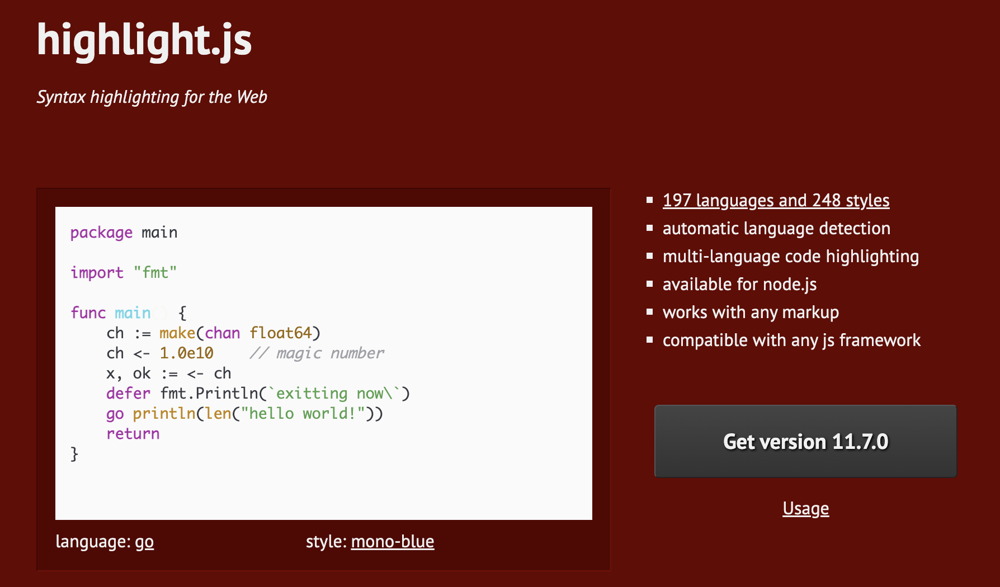
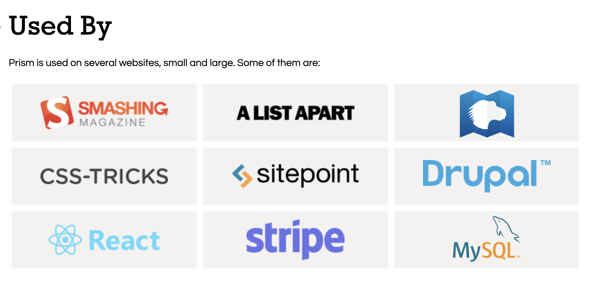
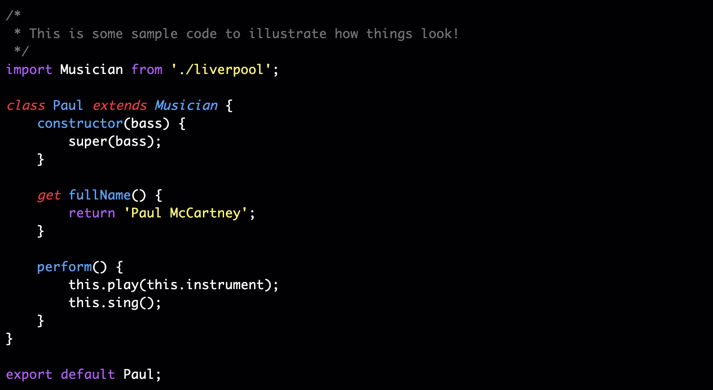

# 代码高亮

在日常开发中，一些应用需要在页面上显示代码，这时就需要用到代码语法高亮。代码语法高亮使代码更易于阅读、编写和调试。通过直观地区分不同的程序元素，例如关键字、注释和字符串，语法高亮可以帮助开发人员快速理解代码的结构和逻辑。本文就来分享 3 个代码语法高亮库，并探讨它们的功能和特点。

## Highlight.js

Highlight.js 是一个用 JavaScript 编写的语法高亮库。它可以在浏览器和服务端上使用。它可以与几乎任何标记语言一起使用，不依赖于其他框架，并且具有自动语言检测的功能。它是 Web 开发人员使用最广泛、维护最积极的语法高亮库。

Highlight.js 支持 190 多种编程语言，并且可以选择添加第三方语言定义以支持更多语言。 它可以定制超过 240 种颜色主题，以满足风格偏好。它的工作原理是扫描网页中 `<pre><code>` 标签内标记的代码块或在 `class` 属性中显式定义的语言，并对它们应用语法高亮。该库还允许开发人员确定哪些代码块应该手动应用语法突出显示以及应该使用什么颜色主题，从而提供了更大的灵活性。

虽然 Highlight.js 因其许多优点而成为众多项目普遍青睐的库，但它也具有一些局限性：

* 相对较大的尺寸会增加应用的页面加载时间
* 对现代 JavaScript 框架的支持有限

**Github：**<https://github.com/highlightjs/highlight.js>

## Prism

Prism 是一个轻量级且功能强大的语法高亮库。它用于在网页上实现代码块的语法高亮显示，并具有以下特点：

* **广泛支持的语言**：Prism 支持多种编程语言，包括常见的 C、Java、Python、JavaScript 等，以及其他一些较为特殊的语言。
* **易于使用**：Prism 的使用非常简单，只需要添加相应的 CSS 和 JavaScript 文件，并对代码块进行标记即可实现语法高亮效果。
* **丰富的样式主题**：Prism 提供了多个内置的样式主题，可以轻松地设置代码块的外观，同时也支持自定义样式。
* **插件扩展性**：Prism 支持插件机制，可以通过添加插件扩展库的功能，例如行号显示、复制代码等。
* **轻量级和快速**：Prism 的代码库很小并且高效，加载和渲染速度较快，适用于在网页上显示大量的代码块。

**Github：**<https://github.com/PrismJS/prism>

## Rainbow

Rainbow 是一个用 Javascript 编写的代码语法高亮库。它被设计为轻量级（~2.5kb）、易于使用且可扩展，完全可以通过 CSS 进行主题化。

Rainbow 目前支持的语言包括 C、C#、Coffeescript、CSS、D、Go、Haskell、HTML、Java、JavaScript、JSON、Lua、PHP、Python、R、Ruby、Scheme、Shell、Smalltalk。

**Github：**<https://github.com/ccampbell/rainbow>

> 更新: 2023-09-22 00:09:17  
> 原文: <https://www.yuque.com/cuggz/feplus/qgxh0dgw96uogcp1>