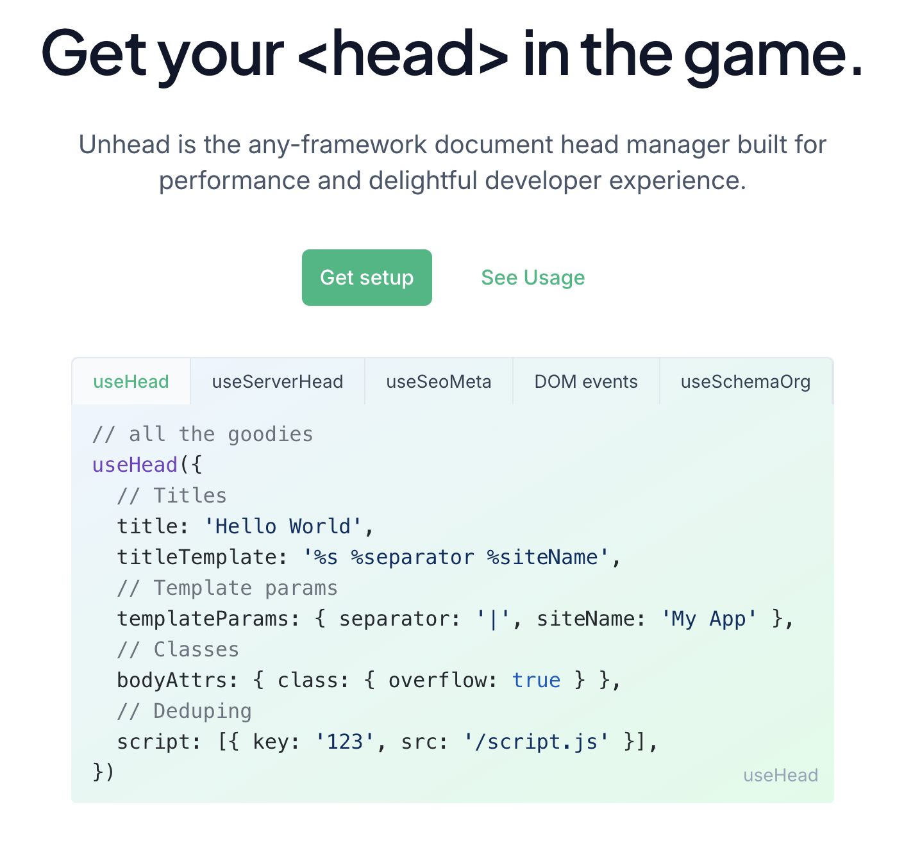

# 元数据

单页应用（SPA）以其出色的用户体验和流畅的页面切换效果在现代Web开发中备受青睐。然而，与传统的多页应用相比，SPA在页面结构和资源管理上存在一些独特的挑战。其中一个常见的问题是如何在SPA中高效地管理页面的 `<head>` 标签，包括动态设置页面标题、元信息、样式表链接等。本文就来看看如何在 Vue 和 React 项目中更加简单、高效的管理 `<head>` 标签！

## 前言

React 和 Vue 主要被用于构建单页应用。在单页应用中，所有页面或视图实际上都是在一个单一的HTML页面上动态渲染的，而不是像传统多页应用那样通过服务器加载不同的HTML页面。因此，不能简单地在每个HTML页面上静态地设置`<head>`标签，因为这些标签是共享的，且需要动态地根据当前显示的页面或视图进行更新。

目前，Vue 和 React 等前端框架都是不支持的为每个页面添加 `<head>` 标签的，需要借助第三方工具库来动态地管理单页应用中的`<head>`标签。这些库允许在组件级别定义和更新<head>标签的内容，当组件挂载、更新或卸载时，它们会相应地修改DOM中的`<head>`标签。

> 注意：在即将到来的 React 19 中，将默认支持在页面中添加 `<head>` 标签。

那什么场景下需要在应用中动态管理 `<head>` 标签呢？

* **SEO优化**：搜索引擎优化（SEO）要求每个页面或视图都有独特的标题（`<title>`）和描述（`<meta name="description">`）。当用户在SPA中导航到不同的页面或视图时，可能需要动态地更新这些标签以反映当前页面的内容。
* **社交媒体分享**：当用户分享 SPA 页面到社交媒体平台时，平台通常会从页面的<head>标签中提取标题、描述和图片等信息来生成分享卡片。因此，可能需要为每个页面或视图设置不同的社交媒体元数据（如`<meta property="og:title">`、`<meta property="og:description">`和`<meta property="og:image">`），以便在分享时显示正确的信息。
* **CSS样式和链接**：在SPA中，可能需要根据当前页面或视图的需求动态地加载不同的CSS样式表或样式链接。通过在<head>中添加或删除`<link rel="stylesheet">`标签，可以实现这一点。
* **JavaScript脚本**：与CSS类似，可能需要根据当前页面或视图的需求动态地加载不同的JavaScript脚本。通过在<head>中添加或删除`<script>`标签，可以控制哪些脚本在当前页面或视图中可用。
* **其他元数据**：除了上述常见的元数据外，还有其他一些情况可能需要动态管理`<head>`标签。例如，可能需要为不同的页面或视图设置不同的字符集（`<meta charset="UTF-8">`）、视口设置（`<meta name="viewport">`）或移动应用图标（`<link rel="apple-touch-icon">`）。
* **多语言支持**：在国际化（i18n）和多语言支持的场景中，可能需要根据用户选择的语言动态地更新页面的标题、描述和其他元数据。
* **A/B测试**：在进行A/B测试时，可能需要为不同的用户组或流量来源显示不同的页面标题、描述或样式。通过动态管理<head>标签，可以轻松地实现这一点。
* **跟踪和分析**：在某些情况下，可能需要在`<head>`标签中添加特定的跟踪代码或分析脚本（如Google Analytics的跟踪代码），以便收集有关用户行为和其他关键指标的数据。

## Unhead

Unhead 是 unjs 工具集中的一个工具，用于管理网站 `<head>` 部分的库，它同时支持服务端渲染（SSR）和客户端渲染（CSR）。为了提升模块化和灵活性，Unhead 被拆分为多个独立的包，使开发者能够按需选择和使用所需的组件。核心包不依赖于任何特定框架，因此可以在任何环境中无缝运行。

此外，为了增强在特定框架下的使用体验，Unhead 还提供了框架专用包。这些包简化了与框架的集成，使开发者能够更高效地利用 Unhead 的功能。



**官网：**<https://unhead.unjs.io/>

## React Helmet

React Helmet 是一个在创建 React 应用时用来管理HTML文档`<head>`部分的插件。它允许向 HTML 文档添加额外的元素，如`title`、`meta`、`link`、`script`等，可以将Helmet看作是一个放置于组件树顶部的特殊组件，用来管理页面头部。

React Helmet的特点包括：

* 支持所有有效的 `<head>` 标签：`title`、`base`、`meta`、`link`、`script`、`noscript` 和 `style` 标签。
* 支持 body、html 和 title 标签的属性。
* 支持服务端渲染。
* 嵌套的组件会覆盖重复的 `<head>` 变更。
* 当在相同组件中指定时，重复的 `<head>` 变更会被保留（支持像 "apple-touch-icon" 这样的标签）。
* 提供用于跟踪 DOM 变更的回调函数。

```javascript
import React from "react";
import {Helmet} from "react-helmet";

class Application extends React.Component {
  render () {
    return (
        <div className="application">
            <Helmet>
                <meta charSet="utf-8" />
                <title>My Title</title>
                <link rel="canonical" href="http://mysite.com/example" />
            </Helmet>
            ...
        </div>
    );
  }
};
```

**Github：**<https://github.com/nfl/react-helmet>

## react-helmet-async

这个库是基于 React Helmet 的一个改进版本。`<Helmet>` 的使用方式保持不变，但为了实现更好的状态管理，现在服务器和客户端都需要使用 `<HelmetProvider>` 来封装每个请求的状态。

React Helmet 原本依赖于 react-side-effect，但考虑到它并不是线程安全的，如果在服务端进行任何异步操作，需要一个能够按请求封装数据的解决方案。这个库正是为了满足这一需求而设计的，它确保了状态的安全性并提高了性能。

```javascript
import React from 'react';
import ReactDOM from 'react-dom';
import { Helmet, HelmetProvider } from 'react-helmet-async';

const app = (
  <HelmetProvider>
    <App>
      <Helmet>
        <title>Hello World</title>
        <link rel="canonical" href="https://www.tacobell.com/" />
      </Helmet>
      <h1>Hello World</h1>
    </App>
  </HelmetProvider>
);

ReactDOM.hydrate(
  app,
  document.getElementById(‘app’)
);
```

**Github：**<https://github.com/staylor/react-helmet-async>

##


> 更新: 2024-06-07 17:23:02  
> 原文: <https://www.yuque.com/cuggz/feplus/ynigvcr5oad0rzv7>