# 前端代码规范

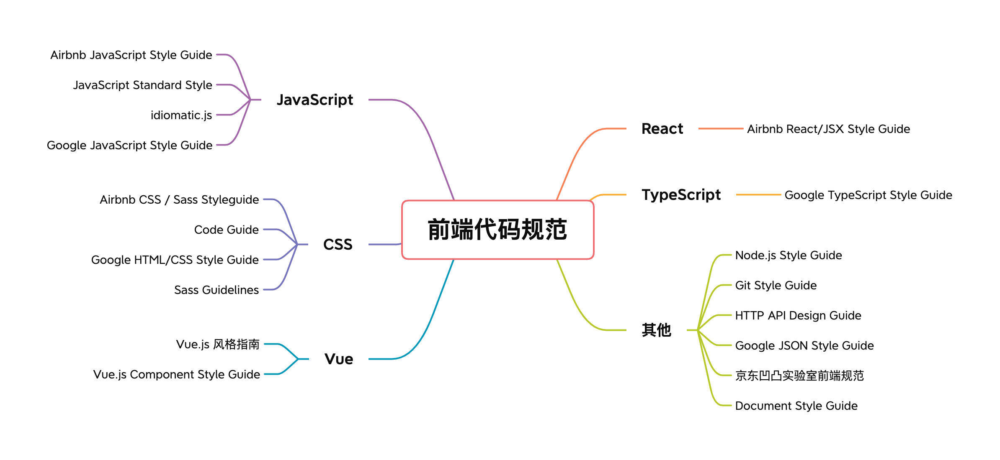

## 1. JavaScript

### （1）Airbnb JavaScript Style Guide

Airbnb JavaScript Style Guide 是由 Airbnb 开源的 JavaScript 代码风格指南。主要是为编写 JavaScript 代码提供规范的风格，方便开发者理解、阅读代码。

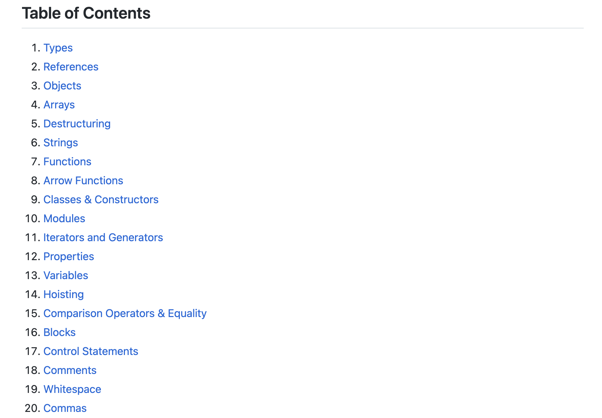

**Github（英文）：**<https://github.com/airbnb/javascript>

**Github（中文）：**<https://github.com/sivan/javascript-style-guide>

### （2）JavaScript Standard Style

JavaScript 标准风格，无需管理 `.eslintrc`,`.jshintrc`, 或 .`jscsrc` 文件即可运行，真正做到开箱即用。本规范特点之一是简洁。谁也不想为每个项目维护一份有成百上千行语句的代码风格配置文件，有此规范就够了。

**Github：**<https://github.com/standard/standard>

### （3）idiomatic.js

编写具备一致风格、通俗易懂 JavaScript 的规则，提供了中文版。

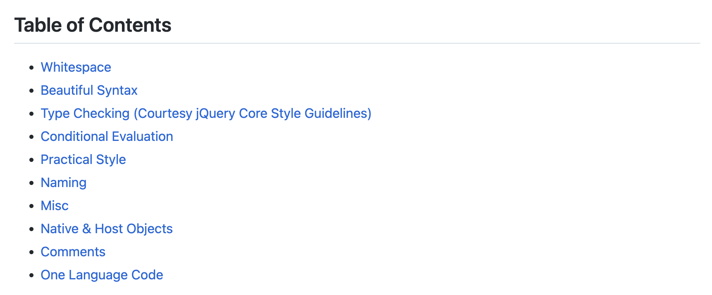

**Github：**<https://github.com/rwaldron/idiomatic.js>

### （4）Google JavaScript Style Guide

谷歌 JavaScript 风格指南。

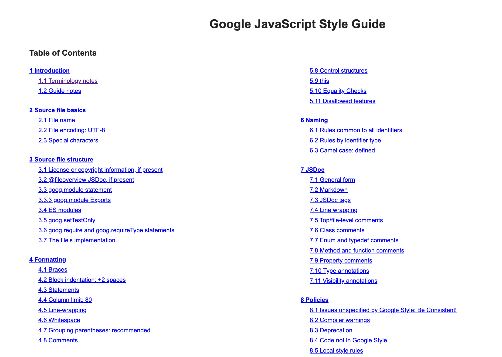

**Github：**<https://google.github.io/styleguide/jsguide.html#terminology-notes>

## 2. CSS

### （1）Airbnb CSS / Sass Styleguide

用更合理的方式编写 CSS 和 Sass。

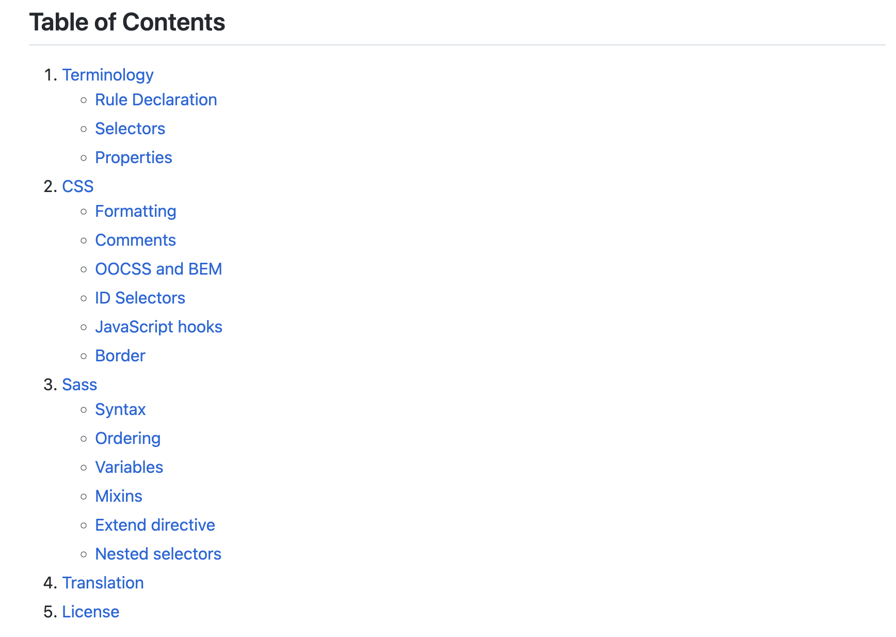

**Github：**<https://github.com/airbnb/css>

### （2）Code Guide

开发灵活，稳定，可持续 HTML 和 CSS 代码的规范，提供了中文版。

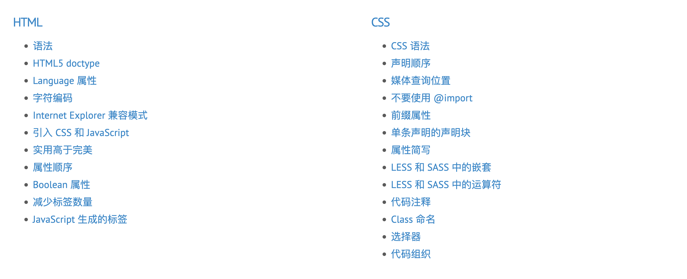

**Github：**<https://github.com/mdo/code-guide>

### （3）Google HTML/CSS Style Guide

谷歌 HTML/CSS 风格指南，旨在改善协作和代码质量。

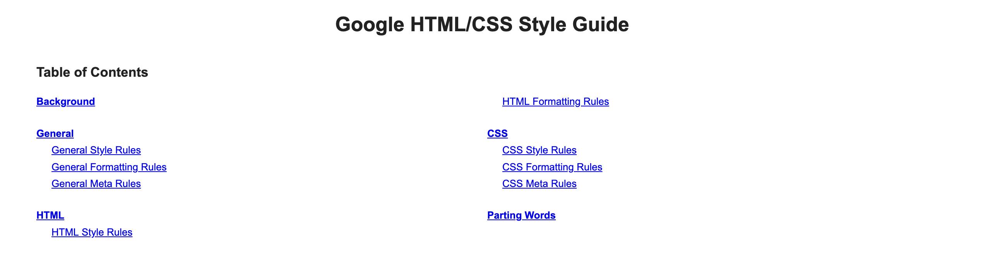

**地址：**<https://google.github.io/styleguide/htmlcssguide.html>

### （4）Sass Guidelines

编写健全、可维护和可扩展的 Sass 的指南。

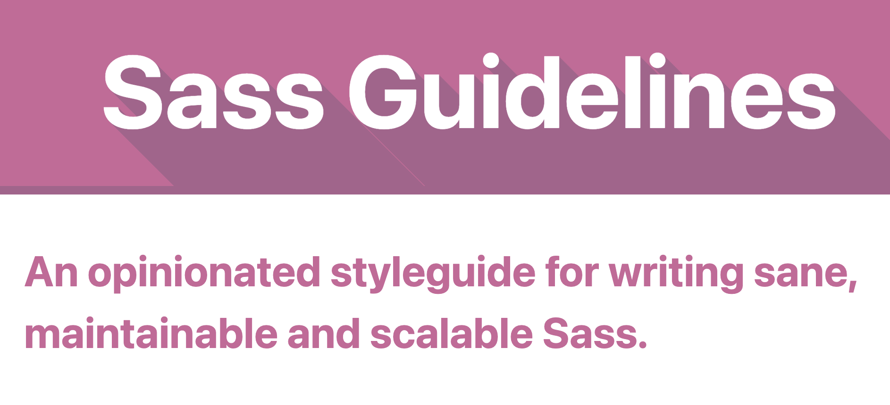

**Github：**<https://github.com/KittyGiraudel/sass-guidelines>

## 3. Vue

### （1）Vue.js 风格指南

这是 Vue 官方提供的 Vue（2.x）特有代码的风格指南。

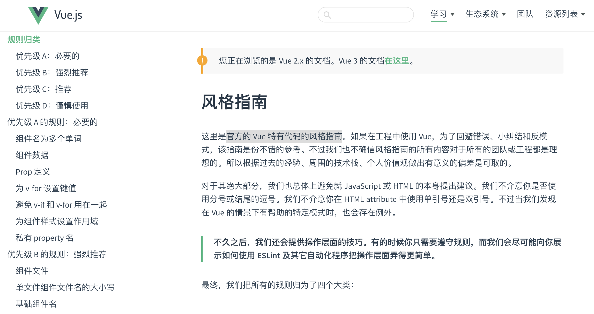

**Github：**<https://v2.cn.vuejs.org/v2/style-guide/>

### （2）Vue.js Component Style Guide

本规范提供了一种统一的编码规范来编写 Vue.js 代码，提供了中文版。

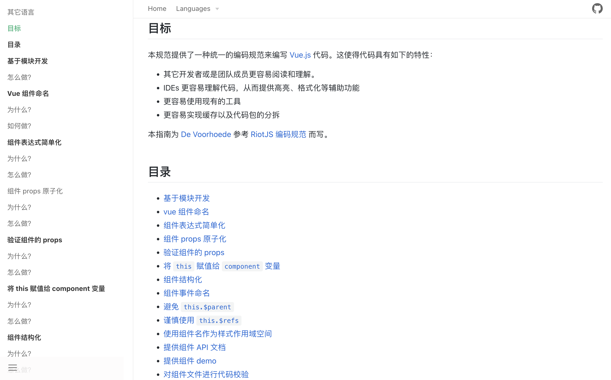

**Github：**<https://github.com/pablohpsilva/vuejs-component-style-guide>

## 4. React

### （1）Airbnb React/JSX Style Guide

Airbnb React/JSX 风格指南，基于 JavaScript 当前流行的标准。

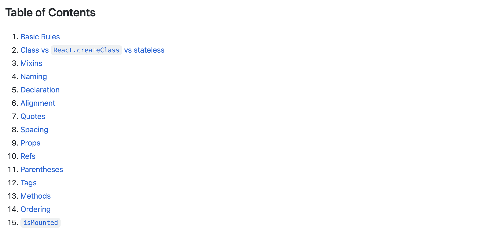

**Github：**<https://github.com/airbnb/javascript/tree/master/react>

## 5. TypeScript

### （1）Google TypeScript Style Guide

谷歌 TypeScript 风格指南。

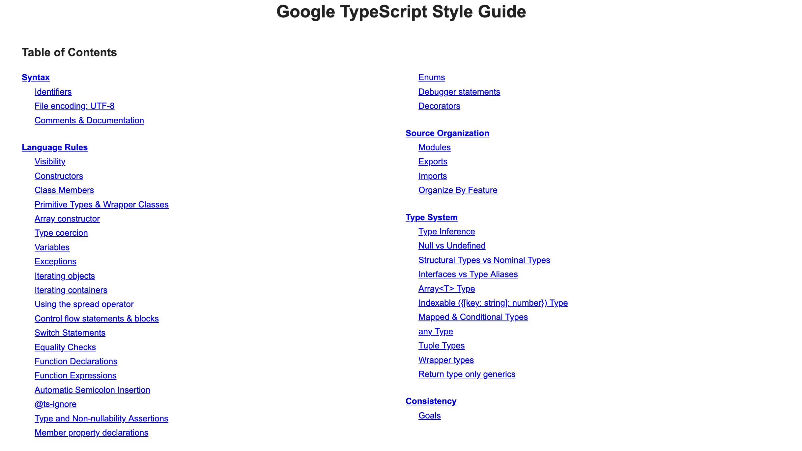

**地址：**<https://google.github.io/styleguide/tsguide.html>

## 6. 其他

### （1）Node.js Style Guide

Node.js Style Guide是编写一致且美观的 node.js 代码的指南。

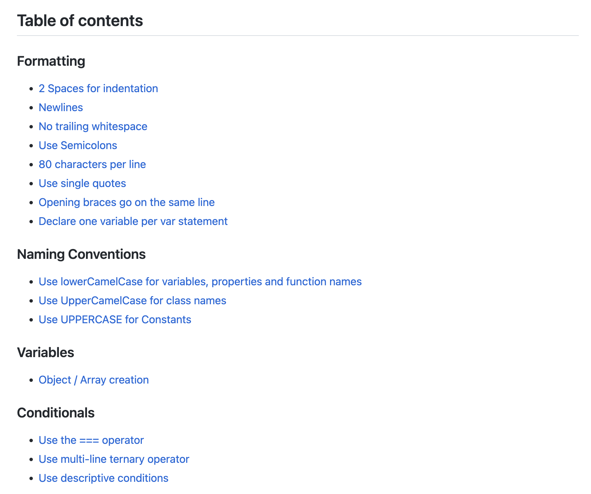

**Github：**<https://github.com/felixge/node-style-guide>

### （2）Git Style Guide

Git 风格指南，这份风格指南受到 [How to Get Your Change Into the Linux Kernel](https://www.kernel.org/doc/Documentation/SubmittingPatches)，[git man pages](http://git-scm.com/doc) 和大量社区通用实践的启发，提供了中文版。

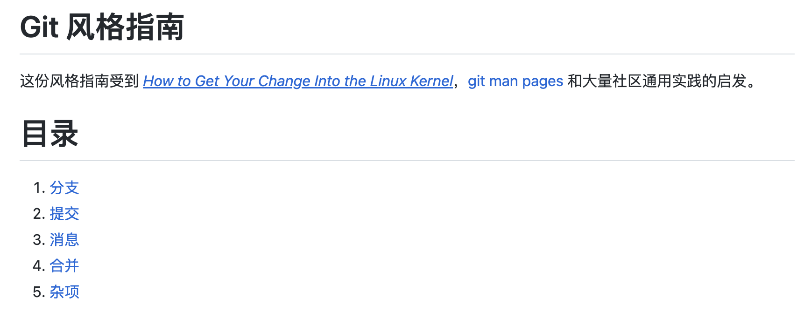

**Github：**<https://github.com/agis/git-style-guide>

### （3）HTTP API Design Guide

本指南描述了一组 HTTP+JSON API 设计实践。它的目标是一致性和专注于业务逻辑，同时避免设计轮子。提供了中文版。

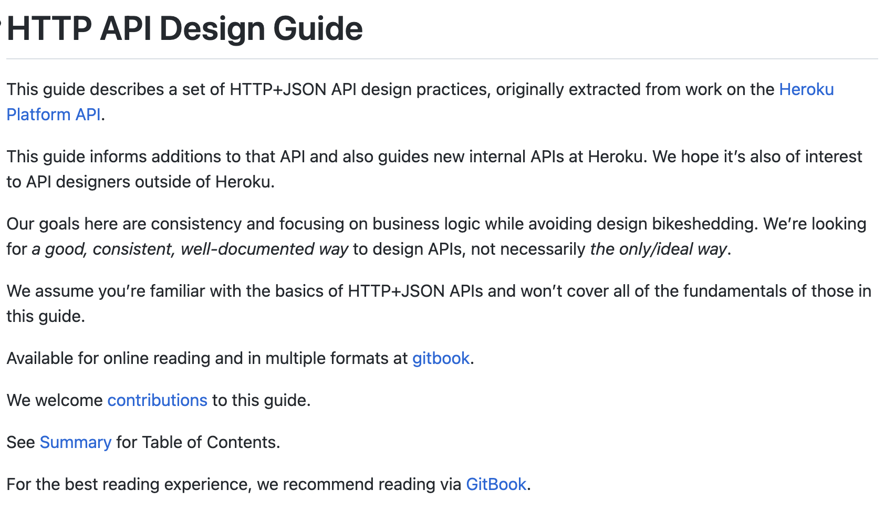

**Github：**<https://github.com/interagent/http-api-design>

### （4）Google JSON Style Guide

谷歌 JSON 风格指南。

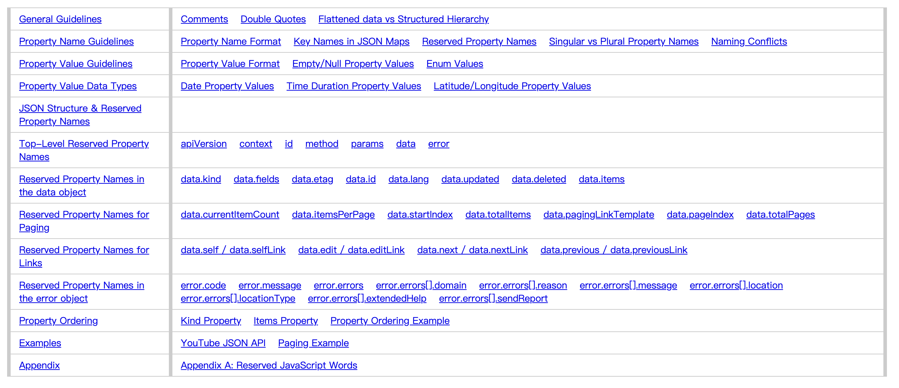

**地址：**<https://google.github.io/styleguide/jsoncstyleguide.xml>

### （5）京东凹凸实验室前端规范

由凹凸实验室整理，基于 [W3C](http://www.w3.org/)、[苹果开发者](https://developer.apple.com/) 等官方文档，并结合团队日常业务需求以及团队在日常开发过程中总结提炼出的经验而制定。

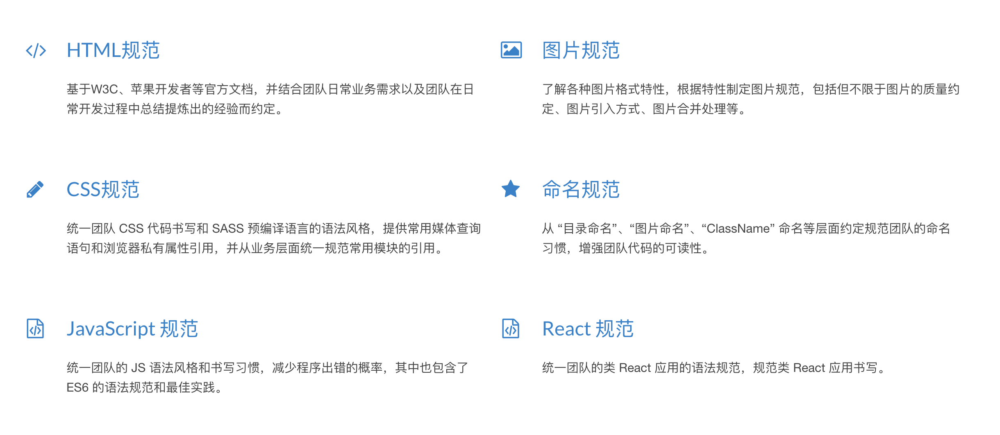

**Github：**<https://github.com/o2team/guide>

### （6）Document Style Guide

阮一峰开源的中文技术文档的写作规范。

**Github：**<https://github.com/ruanyf/document-style-guide>

> 更新: 2022-08-29 10:43:13  
> 原文: <https://www.yuque.com/cuggz/feplus/xbnk5g>