# 前端启动模板

在启动一个新的前端项目时，利用框架自带的脚手架进行初始化是最常见做法，但随后往往需要进行一系列的配置。随着时间积累，社区已经出现了很多预配置模板，这些模板不仅集成了常用的配置，还融入了最佳实践，使开发者只需简单下载即可投入开发。本文就来分享一些前端社区中热门的前端模板，助力更高效地启动新项目！\
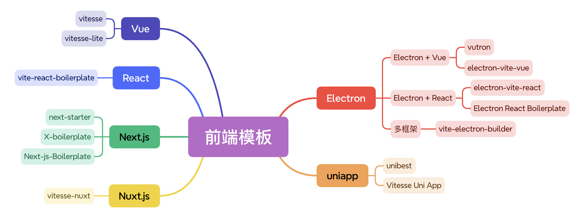

## Vue

### vitesse

Vite、Vue 团队成员 Antfu 推出的 Vue 3 + Vite 模板。

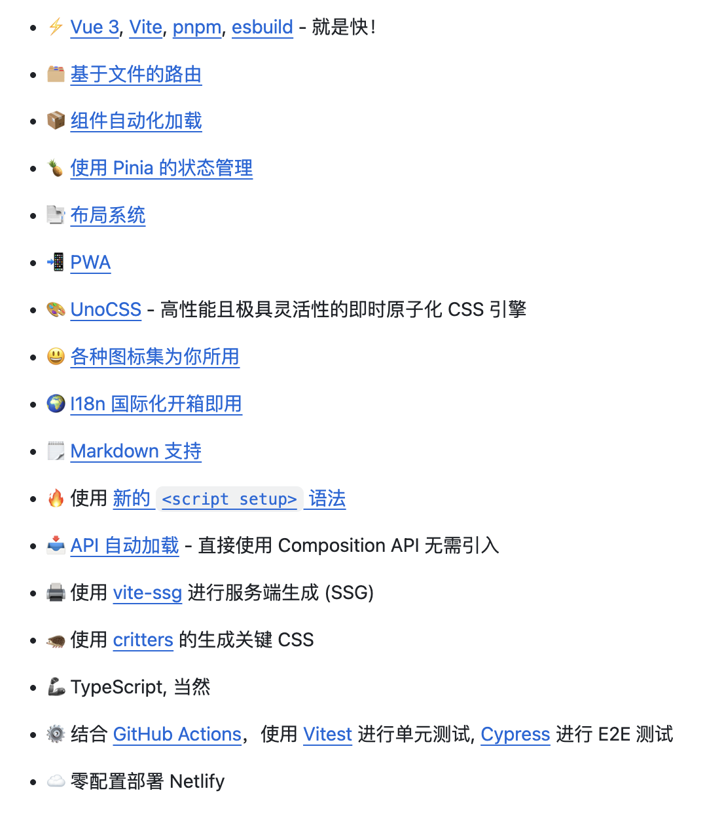

**Github：**<https://github.com/antfu-collective/vitesse>

### vitesse-lite

vitesse 的轻量版。

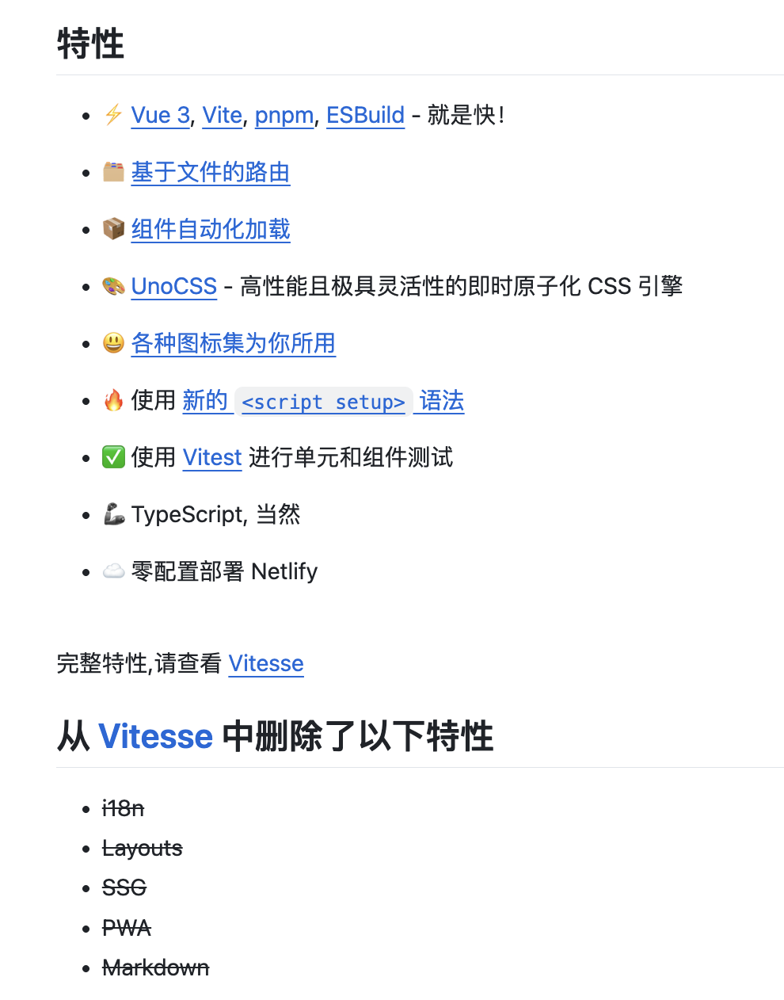

**Github：**<https://github.com/antfu-collective/vitesse-lite>

## React

### vite-react-boilerplate

适用于 Vite + React 的生产级可扩展入门模板。

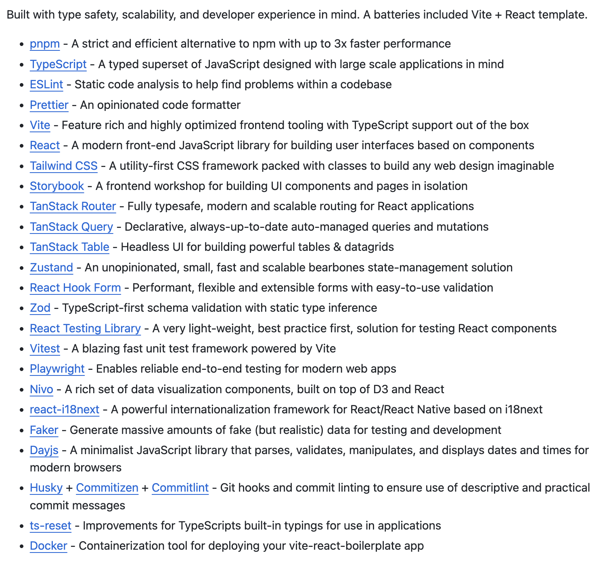

**Github：**<https://github.com/RicardoValdovinos/vite-react-boilerplate>

## Next.js

### Next-js-Boilerplate

为 Next.js 提供的模板和启动器，优先考虑开发者体验：Next.js、TypeScript、ESLint、Prettier、Husky、Lint-Staged、Vitest、测试库、Playwright、Commitlint、VSCode、Tailwind CSS、Storybook、多语言（i18n）等。

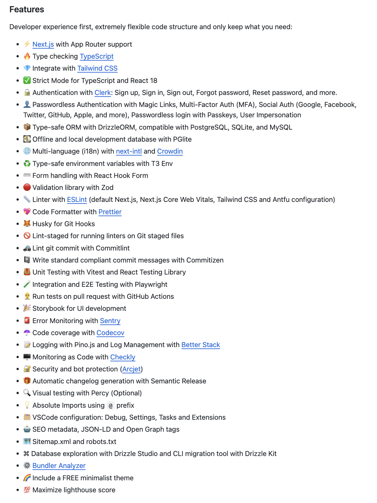

**Github：**<https://github.com/ixartz/Next-js-Boilerplate>

### next-starter

一个 Next.js 启动模板，内置了TypeScript、Tailwind CSS、Next-auth、Eslint、Stripe 等功能。

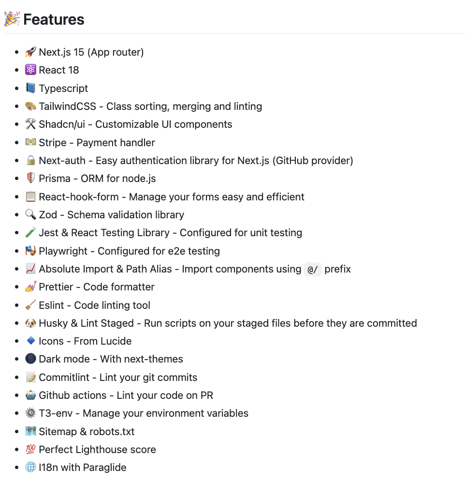

**Github：**<https://github.com/Skolaczk/next-starter>

### X-boilerplate

X-boilerplate 是一个启动模板，为 Nextjs 项目提供了配置和最佳实践。

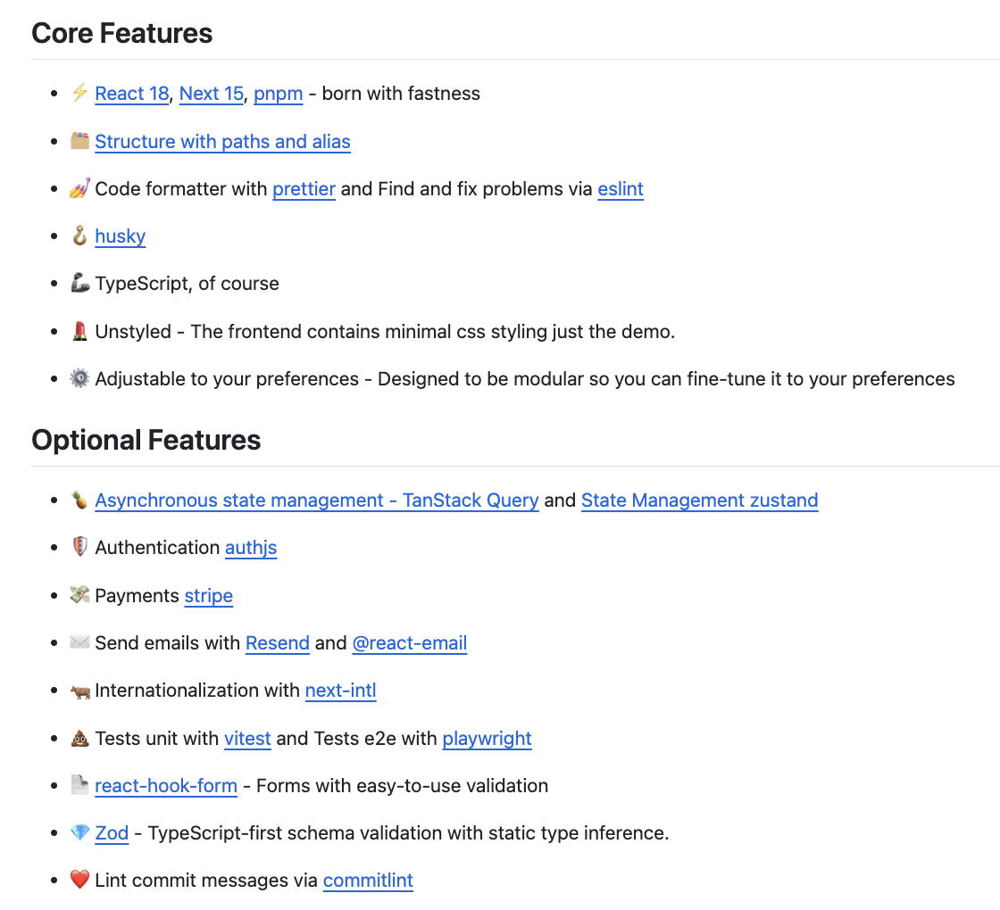

**Github：**<https://github.com/wootsbot/X-boilerplate>

## Nuxt.js

### vitesse-nuxt

vitesse 的 Nuxt.js 版。

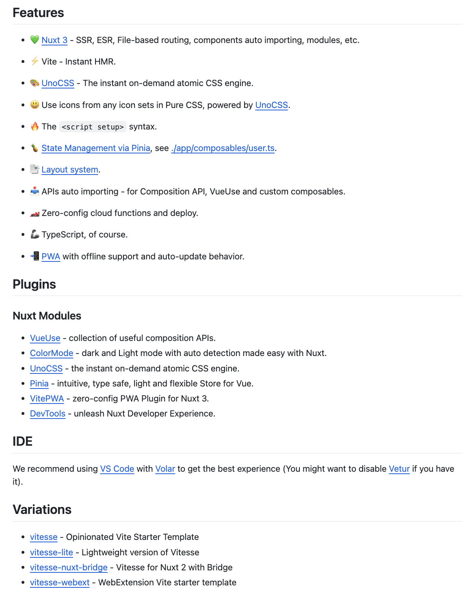

**Github：**<https://github.com/antfu/vitesse-nuxt>

## Electron

### vutron

Vutron 是一个快速启动模板，它预先配置了 Vite、Electron、Vue 3、Vuetify 和 TypeScript 等，旨在简化Electron跨平台桌面应用程序的开发过程。

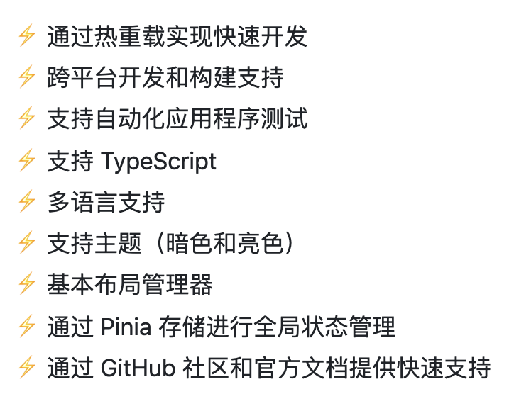

**Github：**<https://github.com/jooy2/vutron>

### electron-vite-vue

简单的 Electron + Vue + Vite 模板。

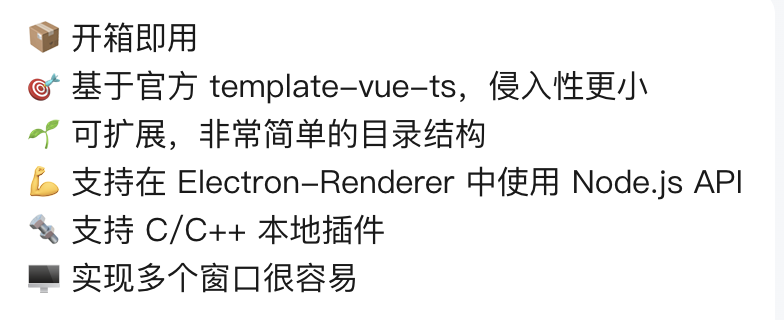

**Github：**<https://github.com/electron-vite/electron-vite-vue>

### Electron React Boilerplate

一个集成 Electron、React、React Router、Webpack 等技术的跨平台桌面应用开发模板。

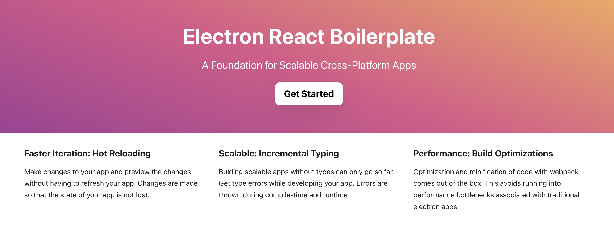

**Github：**<https://github.com/electron-react-boilerplate/electron-react-boilerplate>

### electron-vite-react

简单的 Electron + React + Vite 模板。

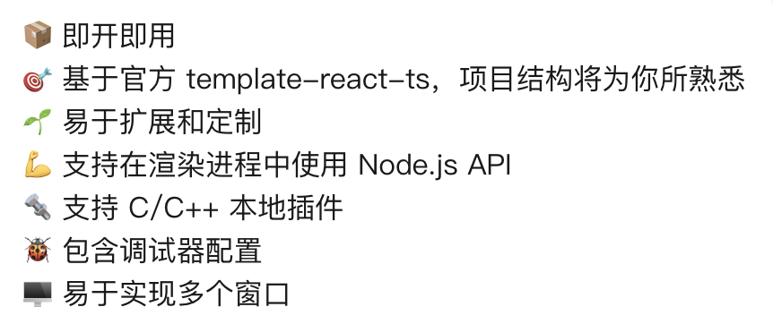

**Github：**<https://github.com/electron-vite/electron-vite-react>

### vite-electron-builder

基于 Vite 的 Electron 应用的安全模板，支持 TypeScript + Vue/React/Angular/Svelte/Vanilla。

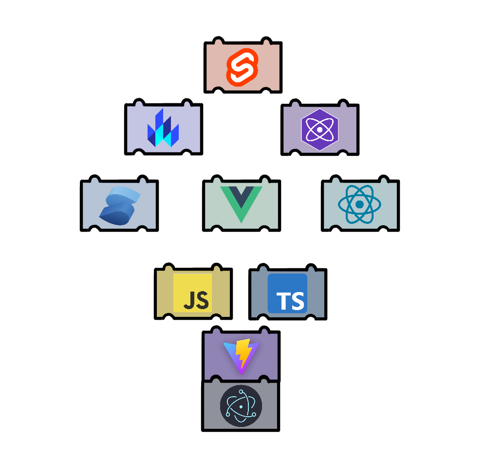

**Github：**<https://github.com/cawa-93/vite-electron-builder>

## uniapp

### unibest

unibest 是由 uniapp + Vue3 + Ts + Vite4 + UnoCss + UniUI 驱动的跨端快速启动模板，使用 VS Code 开发，具有代码提示、自动格式化、统一配置、代码片段等功能，同时内置了大量平时开发常用的基本组件，开箱即用，让你编写 uniapp 拥有 best 体验。

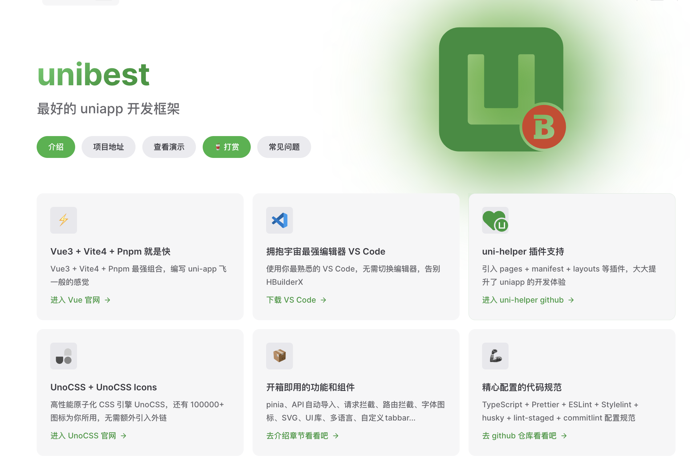

**Github：**<https://github.com/codercup/unibest>

### Vitesse Uni App

一个基于 `Vue` 和 `uni-app` 的开源模板，采用直观且可扩展的方式创建类型安全、高性能和生产级的跨端应用。

**Github：**<https://github.com/uni-helper/vitesse-uni-app>

> 更新: 2024-11-30 00:46:15  
> 原文: <https://www.yuque.com/cuggz/feplus/pl7hiq94y3fakn0m>