# 动画库

很多时候我们在开发前端页面时都会做一些动画效果来提升用户体验度和页面美观度，所以今天就来给大家推荐几个好用的JavaScript动画库，希望对各位小伙伴有所帮助！

## **Animate.css**
animate.css 是一个使用CSS3的animation制作的动画效果的CSS集合，里面预设了很多种常用的动画，且使用非常简单。

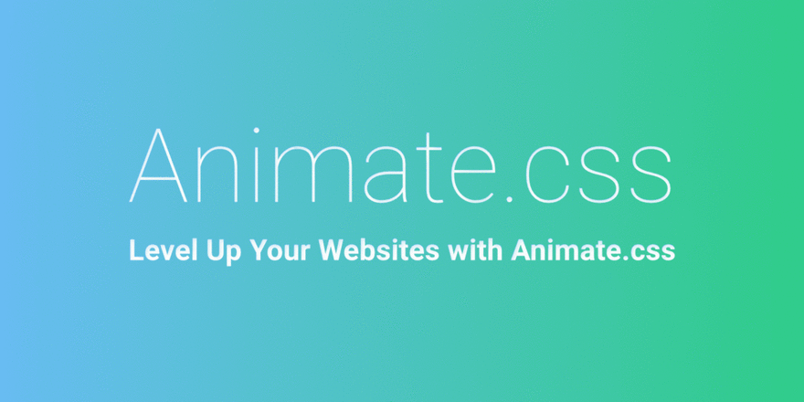

GitHub：[https://github.com/animate-css/animate.css](https://github.com/animate-css/animate.css)

## Hover.css
Hover.css 是一套基于 CSS3 的鼠标悬停效果和动画，这些可以非常轻松的被应用到按钮、LOGO 以及图片等元素。所有这些效果都是只需要单一的标签，必要的时候使用 before 和 after 伪元素。因为使用了 CSS3 过渡、转换和动画效果，因此只支持 Chrome、Firefox 和 Safari 等现代浏览器。  
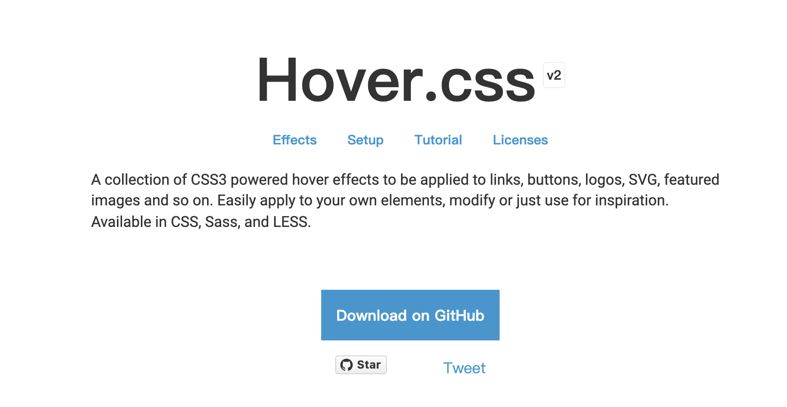

Github：[https://github.com/IanLunn/Hover](https://github.com/IanLunn/Hover)

## Magic.css
Magic CSS3 Animations 动画是一款独特的CSS3动画特效包，可以自由地使用在网页中。只需简单的在页面上引入 CSS 文件: magic.css 或者压缩版本 magic.min.css 就可以使用了。

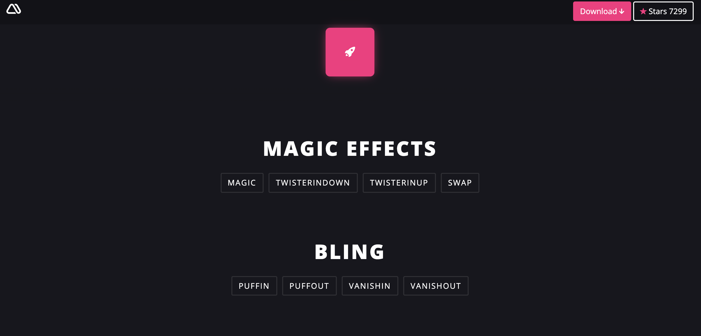

Github：[https://github.com/miniMAC/magic](https://github.com/miniMAC/magic)

## React Spring
react-spring 是一个基于弹簧物理学的动画库，满足大多数与UI相关的动画需求，提供了足够灵活的工具，可以自信地将想法投射到不断变化的界面中。该库代表了一种现代动画方法。它继承了 animated 强大的插值和性能，以及 react-motion 的易用性。

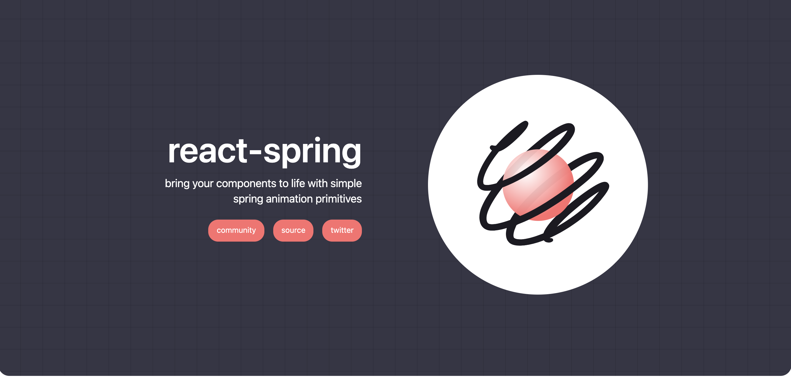

GitHub：[https://github.com/pmndrs/react-spring](https://github.com/pmndrs/react-spring)

## React Reveal
React Reveal 是一个用于 React 的高性能动画库。它占用空间小，专门为 ES6 中的 React 编写。可用于创建各种炫酷的滚动效果显示。

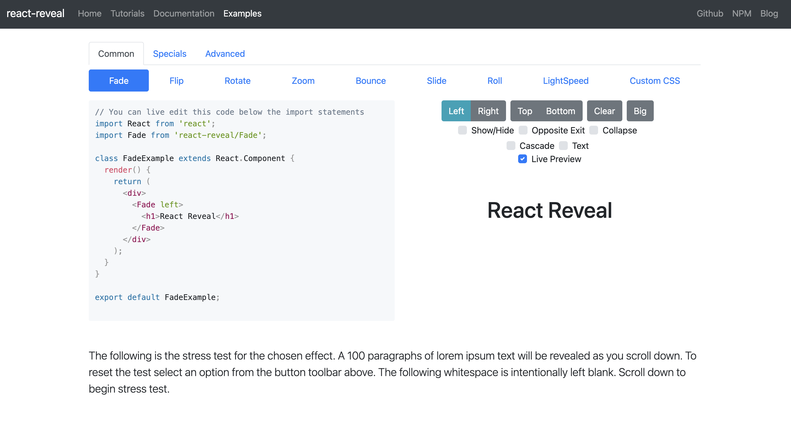

GitHub：[https://github.com/rnosov/react-reveal](https://github.com/rnosov/react-reveal)

## Greensock
GreenSock是一个JavaScript动画库，可轻松对HTML元素进行动画处理。 用于创建高性能，零依赖性，跨浏览器动画，声称在超过 400 万个网站中使用。 其具有一下特点：

+ ****速度快，专门优化了动画性能，使之实现和css一样的高性能动画效果。
+ 轻量与模块化。模块化与插件式的结构保持了核心引擎的轻量，TweenLite包非常小(基本上低于7kb)。提供了TweenLite, TimelineLite, TimelineMax 和 TweenMax不同功能的动画模块，你可以按需使用。
+ 没有依赖。
+ 灵活控制。不用受限于线性序列，可以重叠动画序列，可以通过精确时间控制，灵活地使用最少的代码实现动画。
+ 任何对象都可以实现动画。

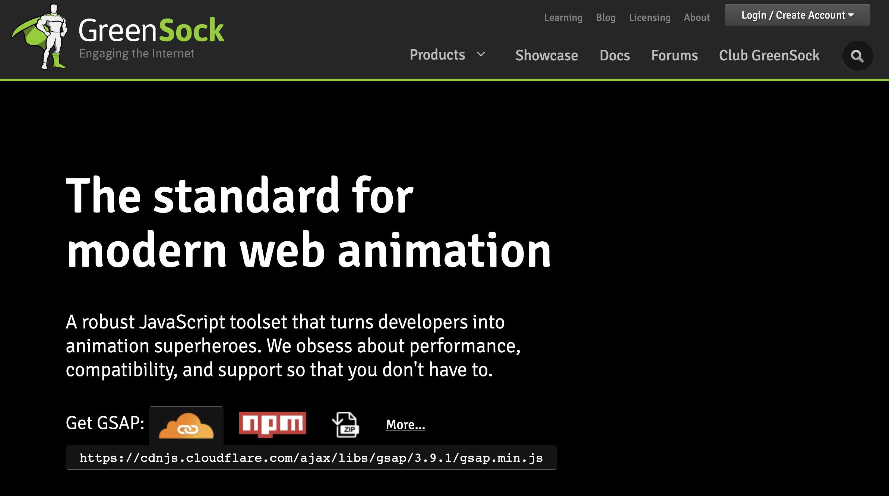

Github：[https://github.com/greensock/GreenSock-JS/](https://github.com/greensock/GreenSock-JS/)

## Velocity.js
Velocity.js 是velocity模板语法的javascript实现。Velocity 是基于Java的模板引擎，广泛应用在阿里集 体各个子公司。Velocity模板适用于大量模板使用的场景，支持复杂的逻辑运算，包含 本数据类型、变量赋值和函数等功能。还拥有：**颜色动画**、**转换动画(transforms)**、**循环**、 **缓动**、**SVG 动画**、和 **滚动动画** 等特色功能。Velocity.js 支持 Node.js 和浏览器环境。

其具有以下特点：

+ 支持客户端和服务器端使用
+ 语法是富逻辑的，构成门微型的语言
+ 语法分析和模板渲染分离
+ 基本完全支持velocity语法
+ 浏览器使用支持模板之间相互引用，依据kissy模块加载机制

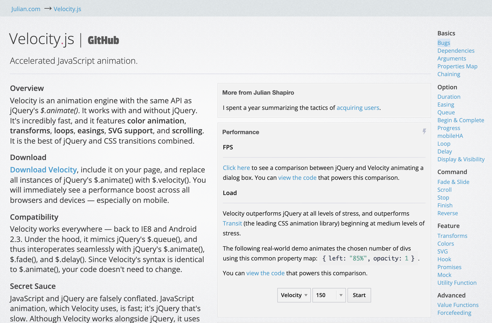

GitHub：[http://github.com/julianshapiro/velocity](http://github.com/julianshapiro/velocity)

## Lax.js
Lax.js 是一款原生零依赖的制作跟随页面滑动的 JavaScript 动画插件，这款插件非常的轻巧，压缩版大小只有3kb。当滑动页面时，帮助创建酷炫的动画效果，比如滚动视差、变形移动等基本的动画效果，响应式兼容方面，比如手机端也有不错的支持。除了可以使用插件默认集成的动画属性，还可以自定义更加丰富的动画属性。

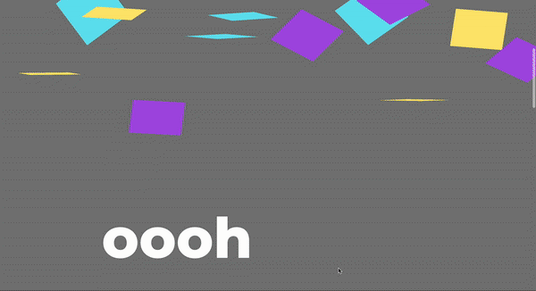

GitHub：[https://github.com/alexfoxy/lax.js](https://github.com/alexfoxy/lax.js)

## Rellax.js
rellax.js是一款轻量级的纯JavaScript滚动视觉差特效插件。rellax.js压缩后的版本仅871字节，在手机等小屏幕设备中，插件会自动限制视觉差特性。

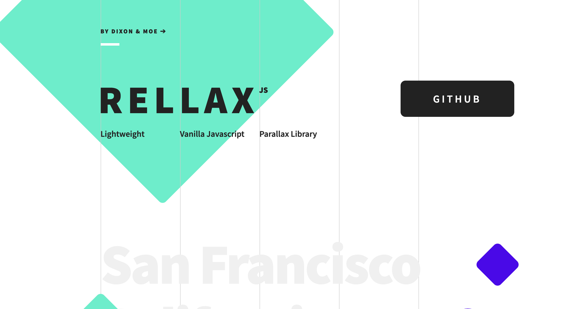

Github：[https://github.com/dixonandmoe/rellax](https://github.com/dixonandmoe/rellax)

## three.js
three.js 是一个易于使用、轻量级、跨浏览器的通用 JavaScript 3D 库，它是一套基于WebGL 开发出的Javascript 函式库，它提供了比 WebGL 更简单的Javascript API，让开发者能够轻易在浏览器制作 3D 绘图。

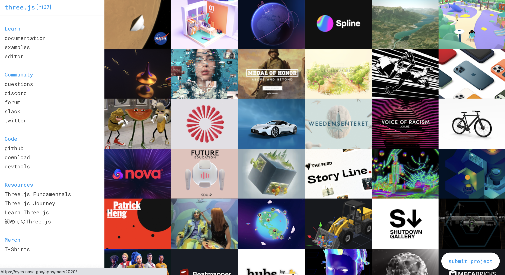

GitHub：[https://github.com/mrdoob/three.js/](https://github.com/mrdoob/three.js/)

## wow.js
WOW.js 是一款帮助你实现滚动页面时触发CSS 动画效果的插件。它依赖 animate.css，所以它支持 animate.css 多达 60 多种的动画效果，可以改变动画设置喜欢的风格、延迟、长度、偏移和迭代等，能满足各种需求。

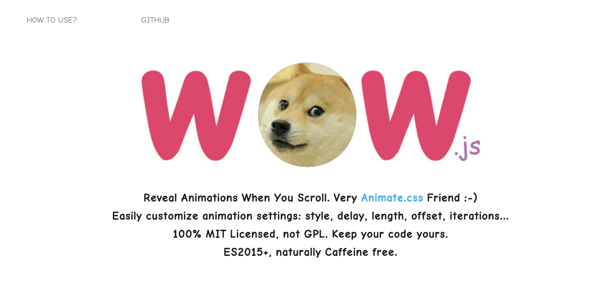  
GitHub：[https://github.com/graingert/wow](https://github.com/graingert/wow)

## AniJS
AniJS允许我们为网站创建动画样式，而无需任何JavaScript或CSS编码！ 您可以使用简单的**If** - **On** - **Do** - **To**语法用HTML指定所有动画

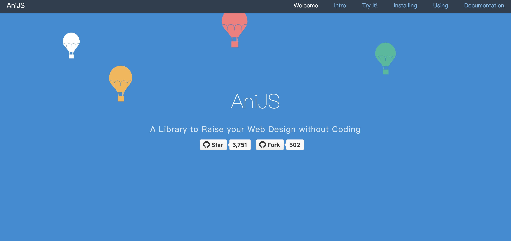

GitHub：[https://github.com/anijs/anijs](https://github.com/anijs/anijs)

## Anime.js
Anime.js 是一个轻量的JavaScript 动画库， 拥有简单而强大的API。可对 CSS 属性、 SVG、 DOM 和JavaScript 对象进行动画。它很轻便，gzip压缩完只有9kb左右。

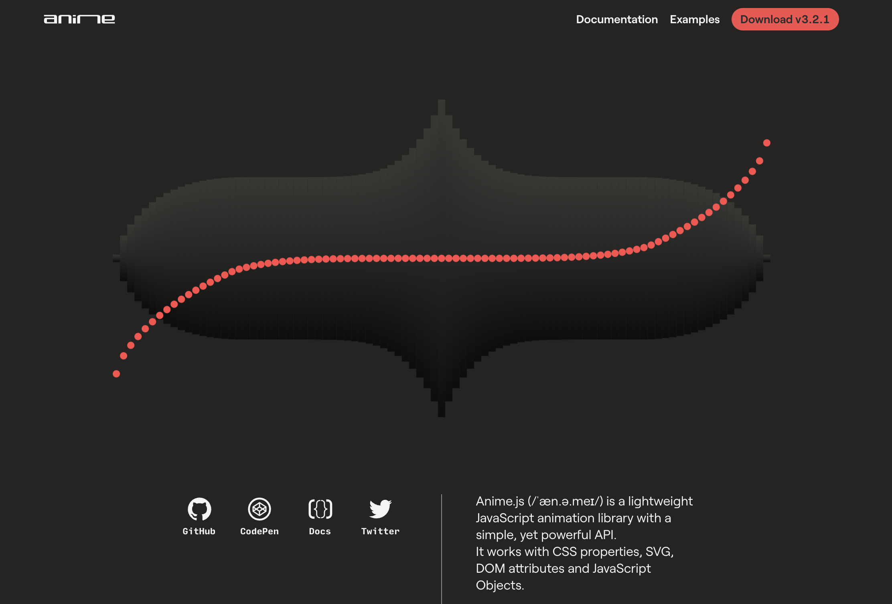

GitHub：[https://github.com/juliangarnier/anime/](https://github.com/juliangarnier/anime/)

## Typed.js
typed.js是一个类型化库，效果是用打字机的方式显示一段话，可以自定义任何字符串、指定显示速度、指定是否循环等。

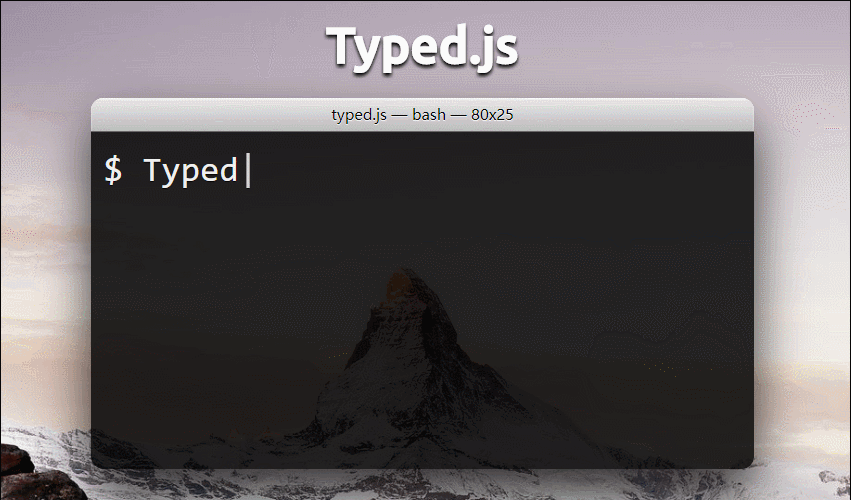

GitHub：[https://github.com/mattboldt/typed.js/](https://github.com/mattboldt/typed.js/)

## Vivus
Vivus 是一个轻量级的 JavaScript 库（没有依赖项），它允许我们对 SVG 进行动画处理，使它们看起来像是被绘制的。它有多种不同的动画可用，以及创建自定义脚本的选项，以喜欢的任何方式绘制 SVG。

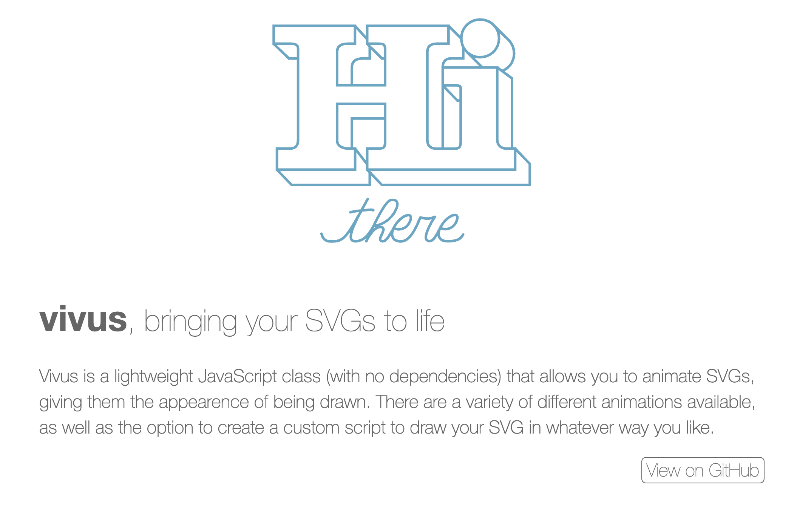

GitHub：[https://github.com/maxwellito/vivus](https://github.com/maxwellito/vivus)

## Popmotion
Popmotion 是一个只有12KB的 JavaScript 运动引擎，可以用来实现动画，物理效果和输入跟踪。原生的DOM支持：CSS，SVG，SVG路径和DOM属性的支持，开箱即用。

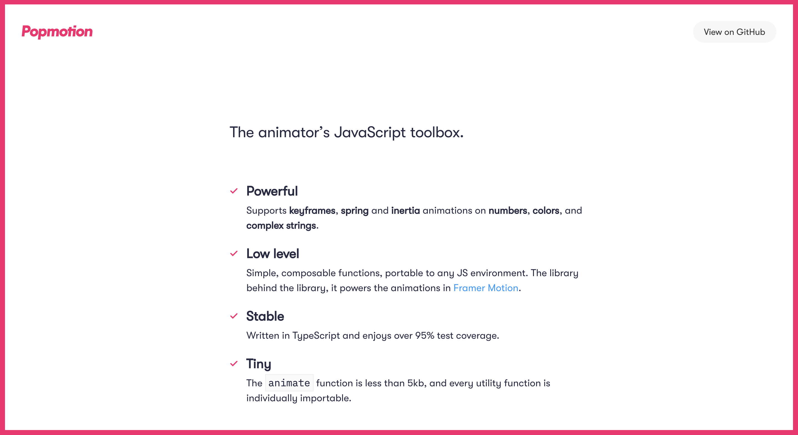

GitHub：[https://github.com/popmotion/popmotion](https://github.com/popmotion/popmotion)

## Granim.js
granim.js是一个在网页中创建流畅的交互式流体动画的小型JavaScript库，granim.js可以实现各种想要的渐变的动画效果，使网页色彩更加丰富，视觉效果更佳！

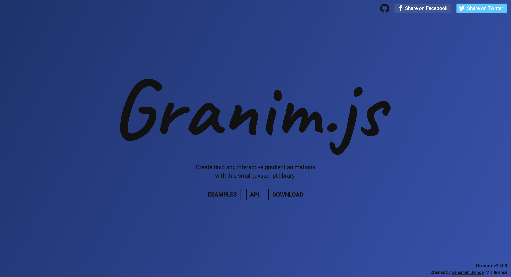

GitHub：[https://github.com/sarcadass/granim.js](https://github.com/sarcadass/granim.js)

## Kute.js
Kute.js 是一个原生的 Javascript 动画引擎，具有优秀的性能和模块化的代码。 它提供了一大堆工具，以帮助创建自定义动画。它提供了易于使用的方法来设置高性能、跨浏览器的动画。 

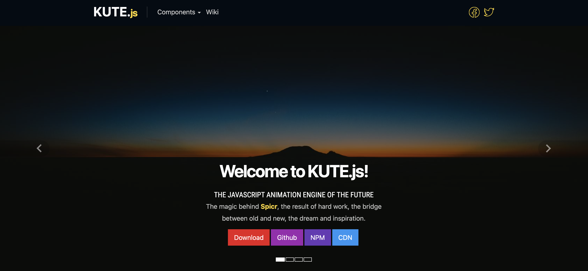

GitHub：[https://github.com/thednp/kute.js](https://github.com/thednp/kute.js)

## Simple Parallax
simpleParallax.js 是一个非常简单且小巧的 Vanilla JS 库，可在任何图像上添加视差动画。它因其易用性和可视化渲染而脱颖而出。视差效果直接应用于图像标签，无需使用背景图像。

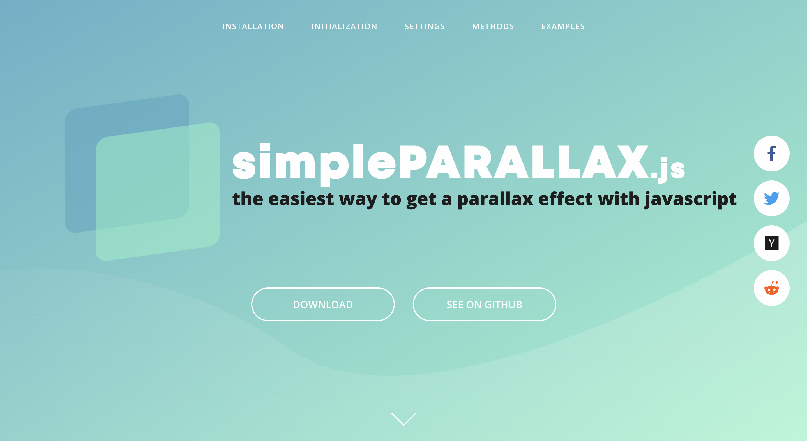

GitHub：[https://github.com/geosigno/simpleParallax.js](https://github.com/geosigno/simpleParallax.js)

## Barba.js
**Barba.js是一个小（4kb的压缩和压缩），灵活和无依赖的库，可以帮助您创建流畅和平滑的过渡网站的页面。 它可以减少页面之间的延迟，最大限度地减少浏览器HTTP请求并增强用户的Web体验。**

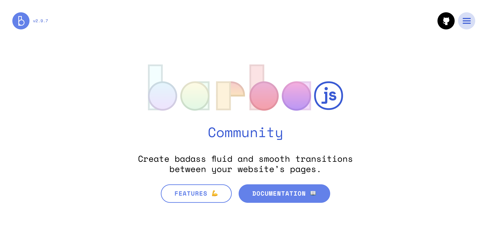

GitHub：[https://github.com/barbajs/barba](https://github.com/barbajs/barba)

## mo.js
Mo.js是一个简洁、高效的图形动画库，拥有流畅的动画和惊人的用户体验，在任何设备上，屏幕密度独立的效果都很好，可以绘制内置的形状或者自定义形状，还可以绘制多个动画，再让它们串联在一起。

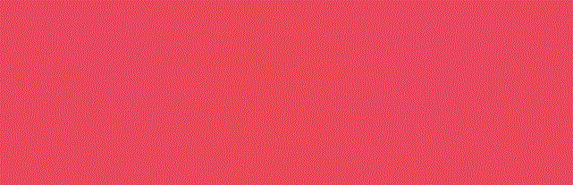

GitHub：[https://github.com/mojs](https://github.com/mojs)

## Particles.js
Particles.js 一个轻量级的JavaScript库，用来在网页上创建颗粒效果。

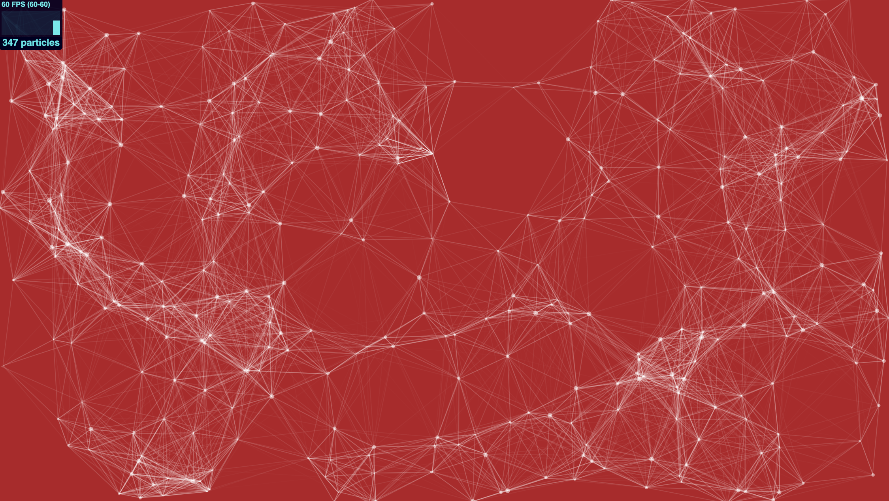

GitHub：[https://github.com/VincentGarreau/particles.js/](https://github.com/VincentGarreau/particles.js/)

## tsParticles
tsParticles可以轻松创建高度可定制的粒子动画并将它们用作网站的动画背景。可用于 React.js、Vue.js（2.x 和 3.x）、Angular、Svelte、jQuery、Preact、Inferno、Solid、Riot 和 Web 组件的现成可用组件。

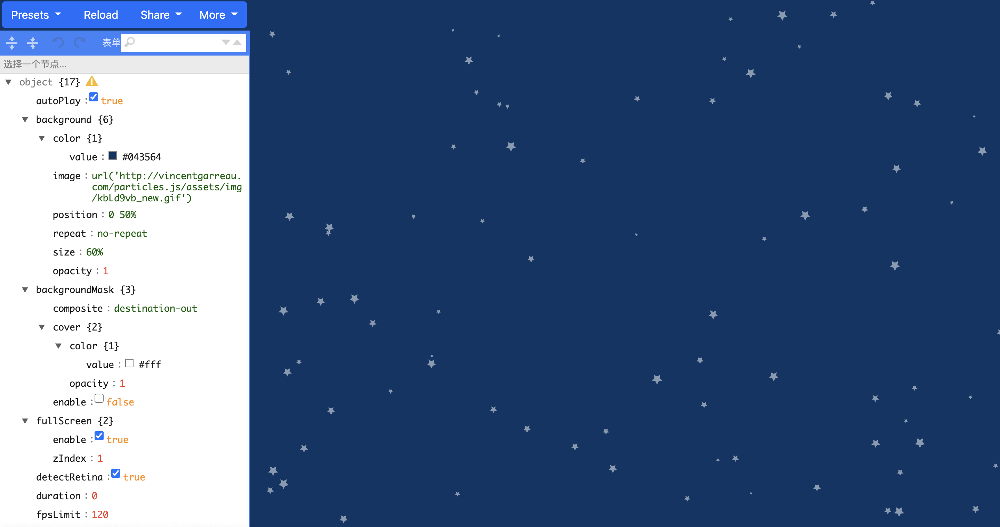

GitHub：[https://github.com/matteobruni/tsparticles](https://github.com/matteobruni/tsparticles)

## Rough Notation
Rough Notation是一个小型 JavaScript 库，用于在网页上创建和动画注释。它使用RoughJS 创建手绘的外观和感觉。元素可以用多种不同的样式进行注释。动画持续时间可以配置，或者只是关闭。压缩后的大小仅 3.83kb。

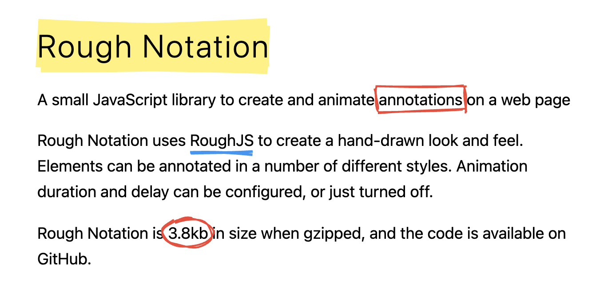

GitHub：[https://github.com/rough-stuff/rough-notation](https://github.com/rough-stuff/rough-notation)

## Animate on Scroll
Animate on Scroll是一个在页面时创建动画的JavaScript动画库。

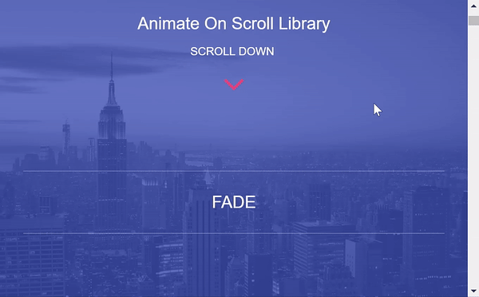

GitHub：[https://github.com/topics/animate-on-scroll](https://github.com/topics/animate-on-scroll)

## Framer Motion
Motion 是Framer的 React 的生产就绪运动库。它带来了声明性动画、轻松的布局转换和手势，同时保持了 HTML 和 SVG 语义。Motion 使用强大的手势识别器扩展了 React 的事件系统。它支持悬停、点击、平移和拖动。注意，Motion 需要 React 16.8 或更高版本。

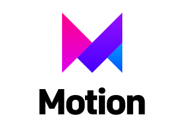

GitHub：[https://github.com/framer/motion](https://github.com/framer/motion)

## React Motion
React Motion 是一个用于 React 应用程序的动画库，可以轻松创建和实现逼真的动画。

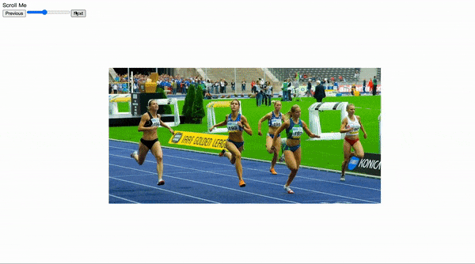

GitHub：[https://github.com/chenglou/react-motion](https://github.com/chenglou/react-motion)

> 更新: 2022-08-09 18:16:06  
> 原文: <https://www.yuque.com/cuggz/feplus/ui6ko4>