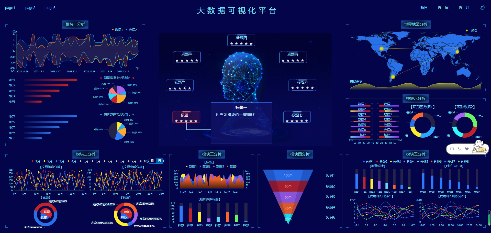
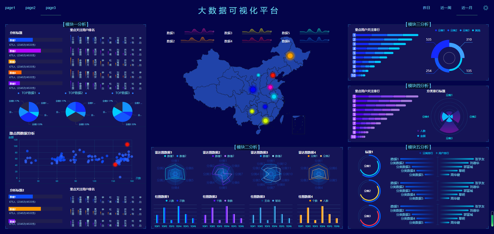
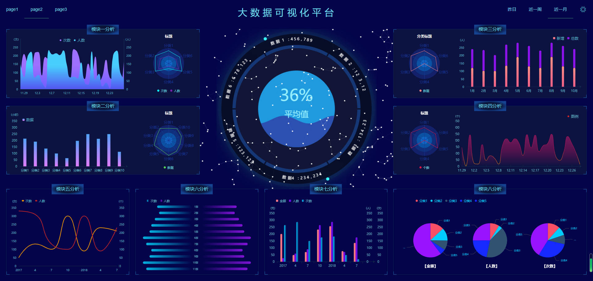
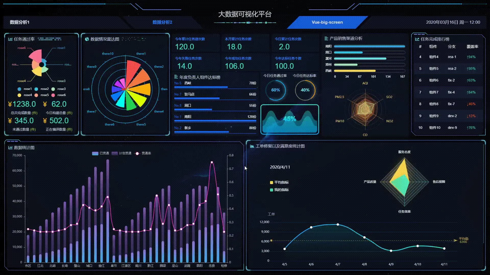
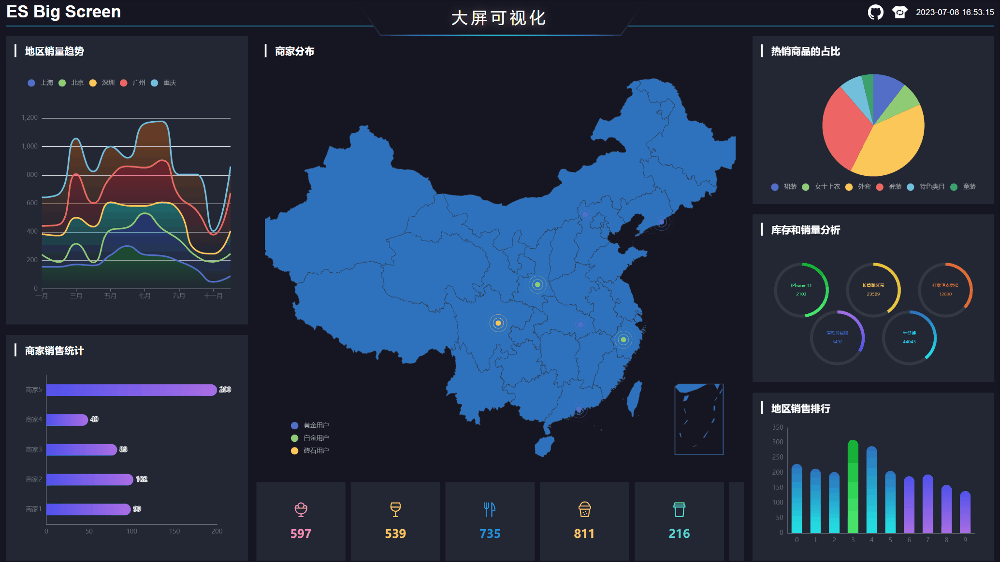
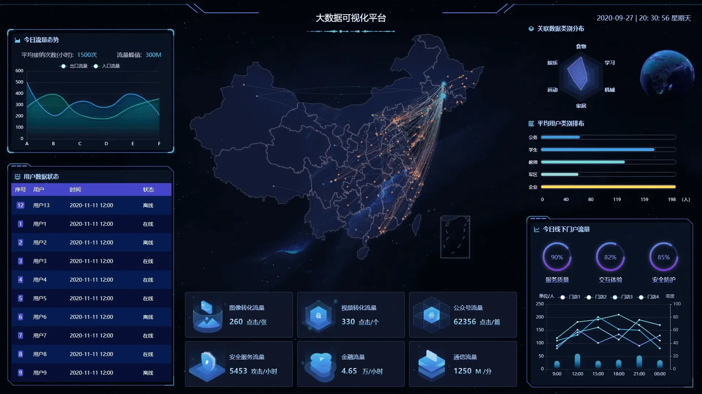
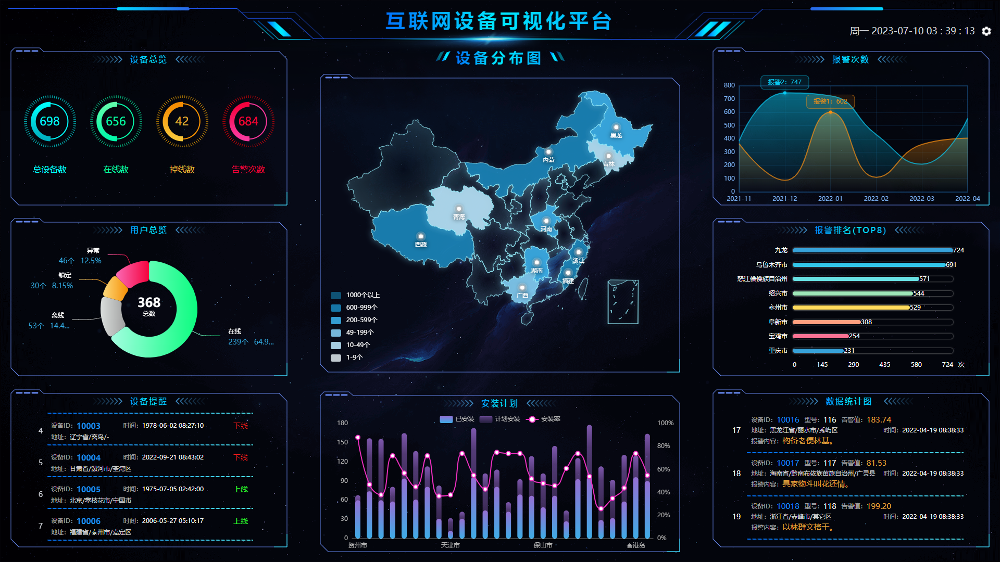
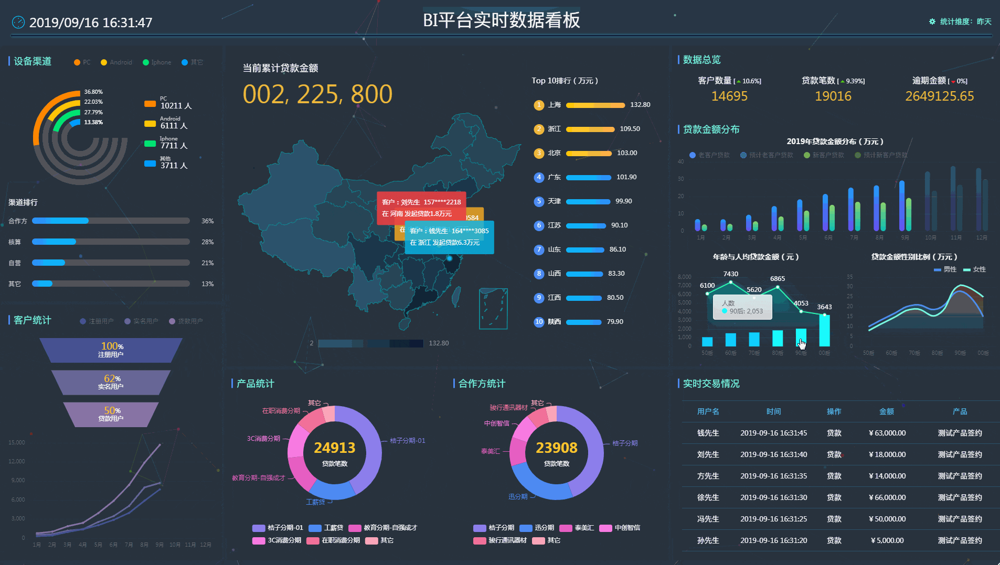
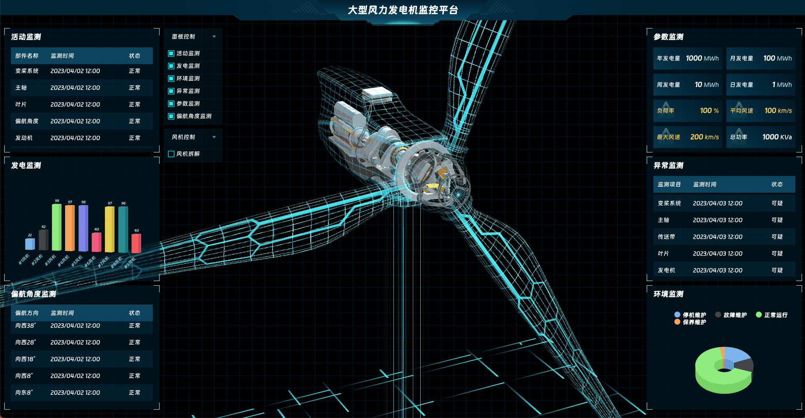
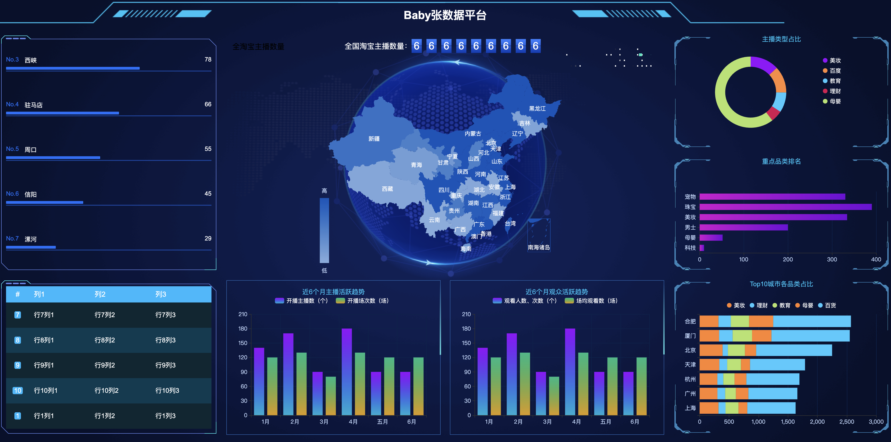

# 可视化大屏模板

**Github：**[https://github.com/bym110/vue-echarts](https://github.com/bym110/vue-echarts)

**Github：**[https://github.com/qiyankai/Big-Screen-Vue-Datav-Echarts](https://github.com/qiyankai/Big-Screen-Vue-Datav-Echarts)

**Github：**[https://github.com/vangleer/es-big-screen](https://github.com/vangleer/es-big-screen)

**Github：**[https://github.com/L-noodle/react-big-screen](https://github.com/L-noodle/react-big-screen)

**Github：**[https://github.com/daidaibg/IofTV-Screen](https://github.com/daidaibg/IofTV-Screen)

**Github**：[https://github.com/hzzly/credit-bi-react](https://github.com/hzzly/credit-bi-react)

**Github：**[https://github.com/fengtianxi001/MF-TurbineMonitor](https://github.com/fengtianxi001/MF-TurbineMonitor)

**Github：**[https://github.com/babybrotherzb/my-datav](https://github.com/babybrotherzb/my-datav)

> 更新: 2024-11-30 15:22:25  
> 原文: <https://www.yuque.com/cuggz/feplus/ige54i3apw7g3w07>