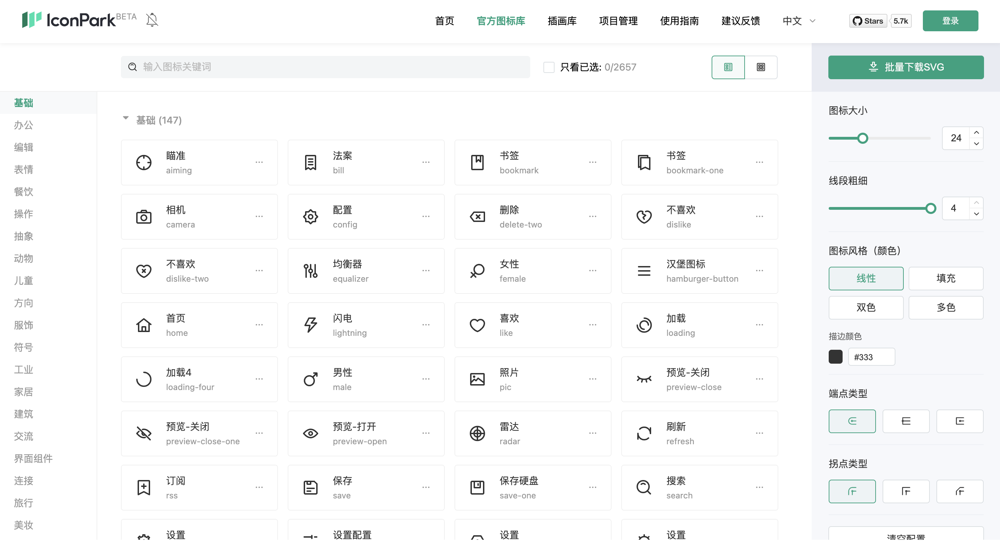
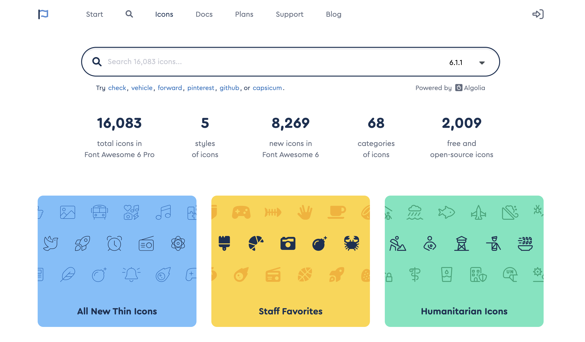
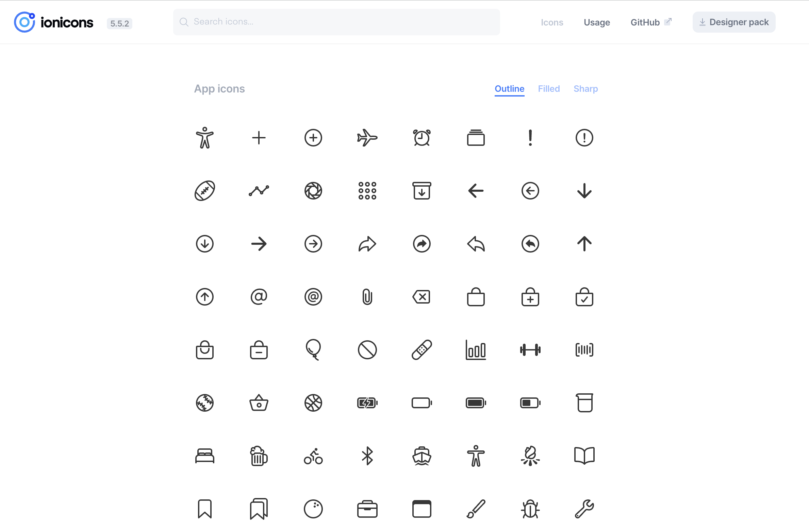
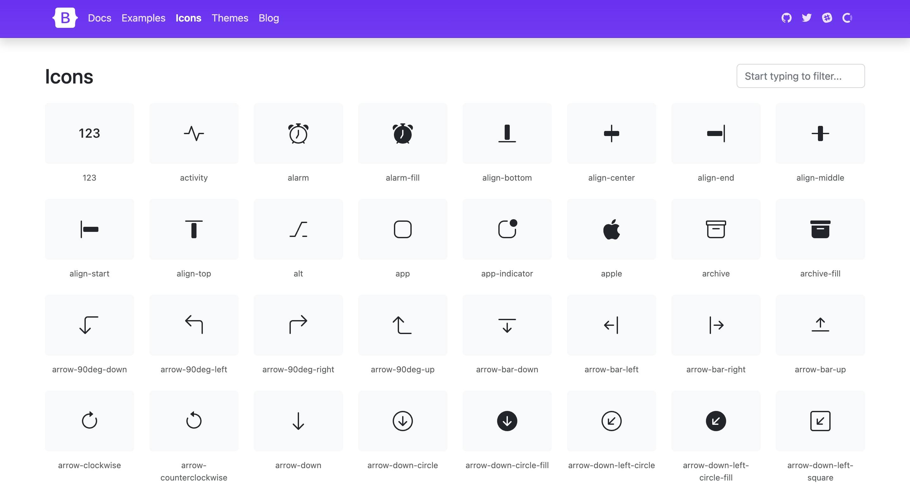
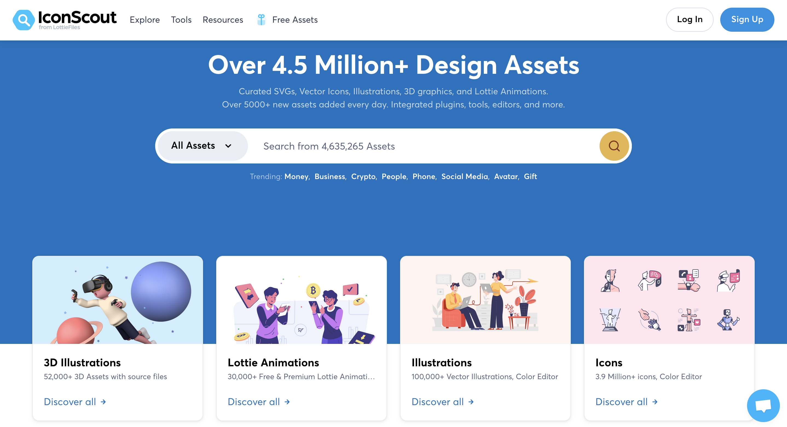
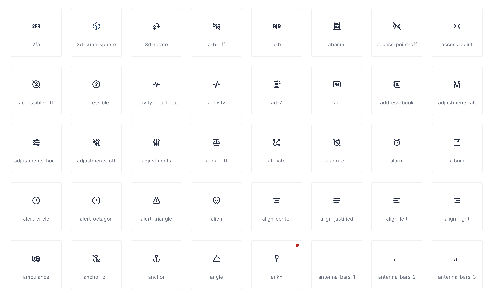

# 图标库

## 1. IconPark
IconPark 提供超过 2400 个高质量图标，还提供了每个图标的含义和来源的描述，便于开发者使用。除此之外，该网站还可以自定义图标，这是与其他图标网站与众不同的地方。该图标库是字节跳动旗下的技术驱动图标样式的开源图标库。

**Github：**[https://github.com/bytedance/iconpark](https://github.com/bytedance/iconpark)

## 2. Font Awesome
Font Awesome 提供了可缩放的矢量图标，可以使用CSS所提供的所有特性对它们进行更改，包括：大小、颜色、阴影或者其它任何支持的效果。

**Github：**[https://github.com/FortAwesome/Font-Awesome](https://github.com/FortAwesome/Font-Awesome)

## 3. Ionicons
Ionicons 是一个完全开源的图标集，是知名混合开发框架 Ionic Framework 内置的图标库，包含 1300 个设计优雅、风格统一的高质量图标，能满足大多数的业务场景。

**Github：**[https://github.com/ionic-team/ionicons](https://github.com/ionic-team/ionicons)

## 4. Bootstrap Icons
Bootstrap Icons 是 Bootstrap 开源的 SVG 图标库，此图标库起初专门针对其组件（从表单控件到导航）和文档进行定制设计和构建，现在可以免费用于任何项目。

**Github：**[https://github.com/twbs/icons](https://github.com/twbs/icons)

## 5. Unicons
Unicons 是一套收录超过 4500 种图标的图标库，提供 SVG 矢量和图标字型（Iconfont）格式，使用者可以自订每个图标大小、颜色和颜色。

**Github：**[https://github.com/Iconscout/unicons](https://github.com/Iconscout/unicons)

## 6. Tabler Icons
Tabler Icons 是一组超过 1950 个免费的高质量 SVG 图标，可以在 Web 项目中用。

**Github：**[https://github.com/tabler/tabler-icons](https://github.com/tabler/tabler-icons)

> 更新: 2022-06-11 00:05:24  
> 原文: <https://www.yuque.com/cuggz/feplus/wa8p2g>