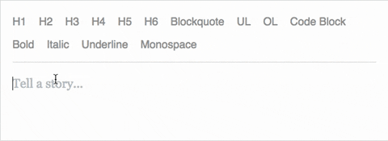
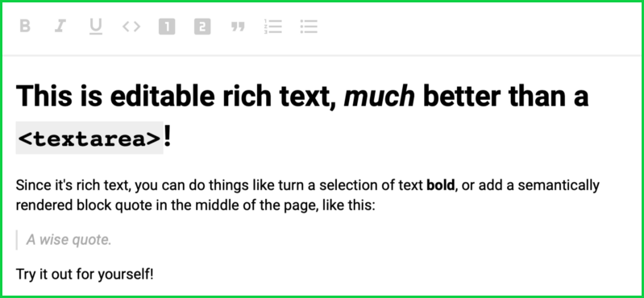
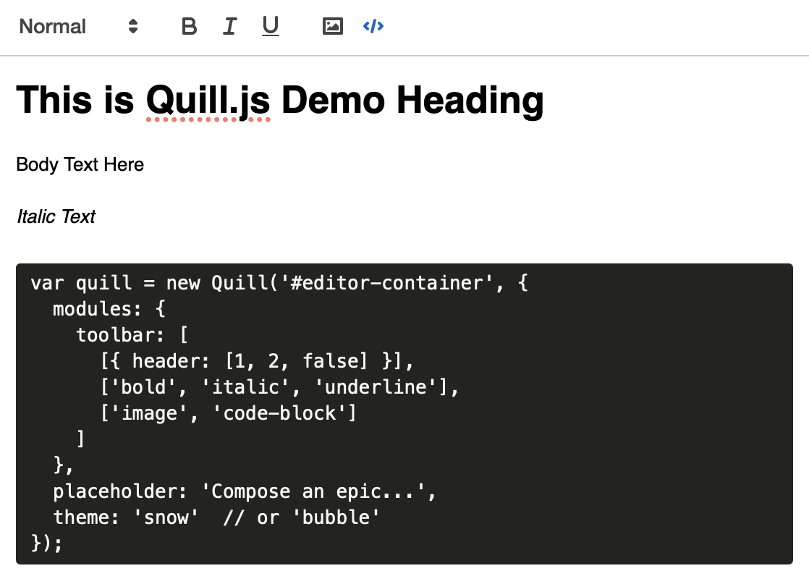
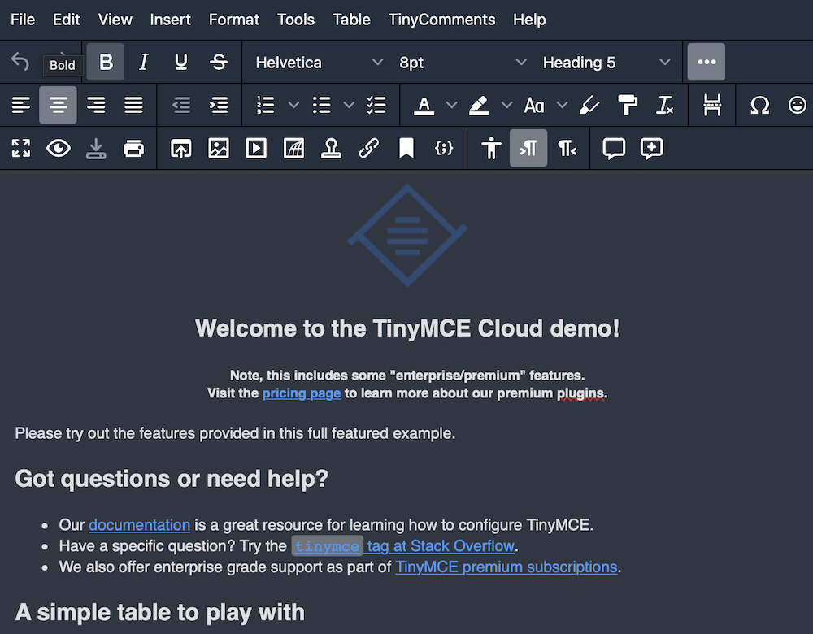
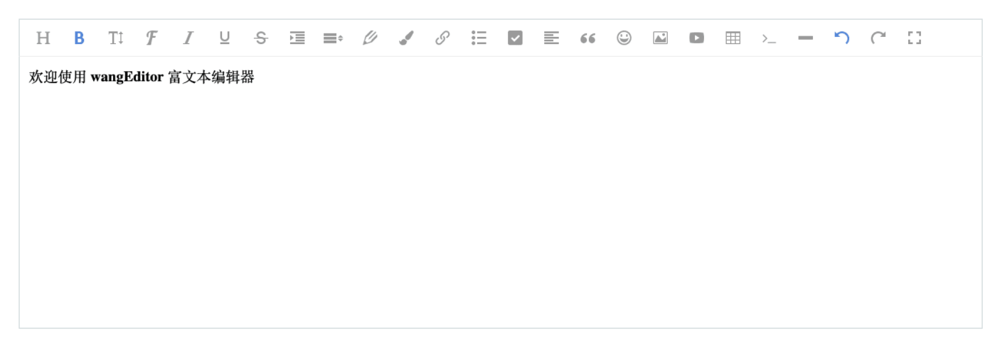
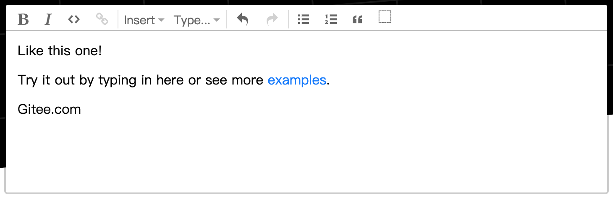
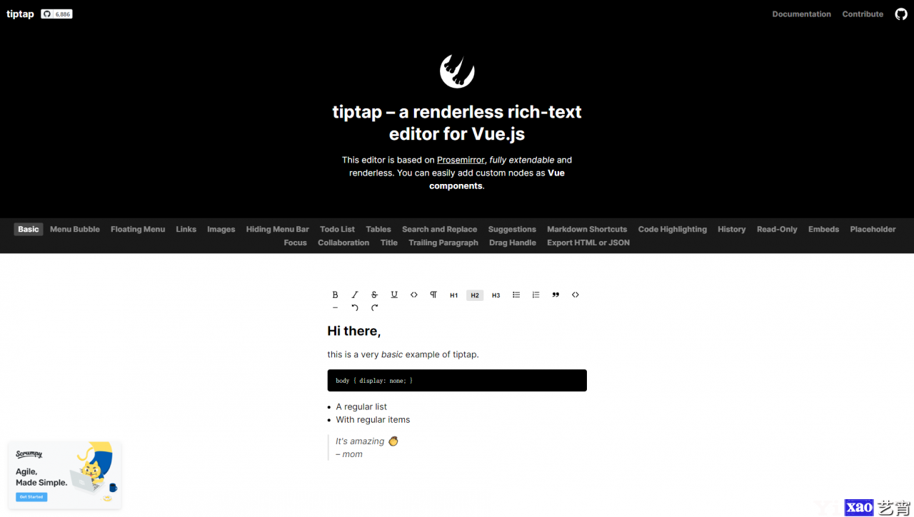
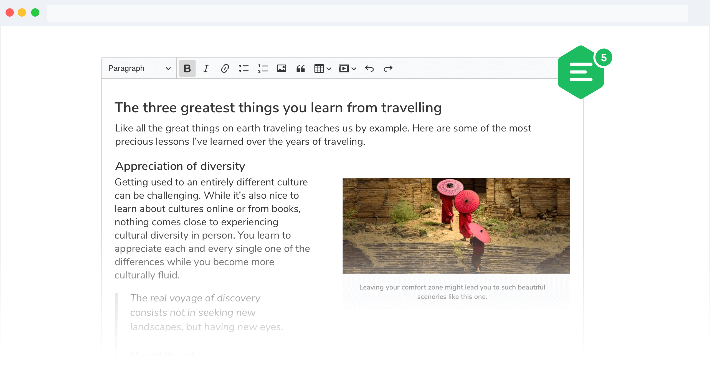
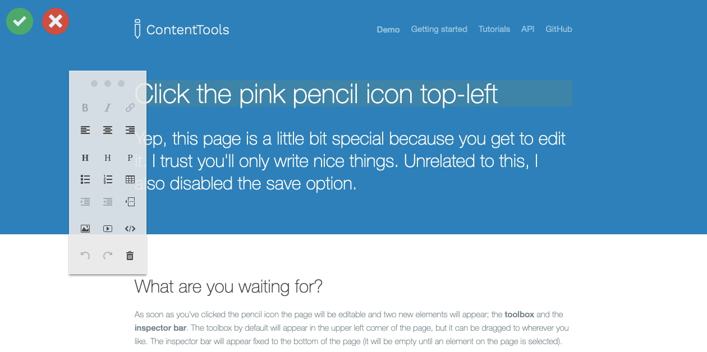
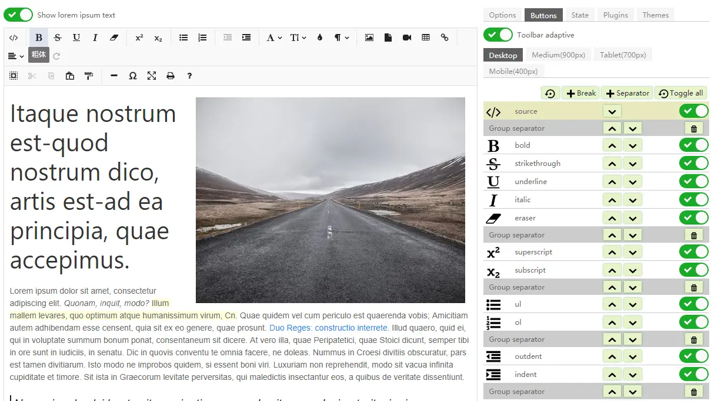

# 富文本编辑器

富文本编辑器，Multi-function Text Editor, 简称 MTE, 是一种可内嵌于浏览器，所见即所得（WYSIWYG）的文本编辑器。今天就来介绍几款常用富文本编辑器插件！

## 1. Draft.js
Draft.js 是 Facebook 的一个开源项目，是 React 项目首选的富文本编辑器框架。这是一个健壮、可扩展和可定制的框架。Draft.js 遵循与 React 中的受控组件相同的范例，并提供了一个 Editor 呈现富文本输入的组件。它还公开了一个EditorStateAPI 来处理/存储Editor组件中的状态更新。 

该富文本编辑器的**特点**：

+ 具有高度可扩展性和可定制性；
+ 由 Facebook 支持的庞大且不断增长的开源开发者社区提供了许多教程和支持；
+ 无缝融入 React 应用程序，使用熟悉的声明式 API 抽象出渲染、选择和输入行为的细节；
+ Draft.js 模型是用 immutable-js 构建的，提供了一个具有功能状态更新的 API，并积极利用数据持久性来实现可扩展的内存使用。

**GitHub：**[https://github.com/facebook/draft-js](https://github.com/facebook/draft-js)

## 2. Slate.js
Slate.js 是受 Draft.js 启发的富文本编辑器。它是一个可深度定制的富编辑器框架，专用于 React。与 Draft.js 类似，它具有良好的 API、强大的插件基础设施以及与 React 的深度连接。此外，插件生态系统比 Draft.js 小一些，但它的插件质量会更好。

该富文本编辑器的**特点**：

+ 生成 JSON 输出，使其更容易与其他模块集成；
+ 它的嵌套文档模型支持更复杂的内容结构，如表格、分页符和其他自定义功能；
+ 可使用插件进行扩展；
+ 提供良好的描述性文档和交互式演示。

**GitHub：**[https://github.com/ianstormtaylor/slate](https://github.com/ianstormtaylor/slate)

## 3. Quill.js
Quill.js 是一个具有跨平台和跨浏览器支持的富文本编辑器。凭借其可扩展架构和富有表现力的 API，可以完全自定义它以满足个性化的需求。由于其模块化架构和富有表现力的 API，可以从 Quill 核心开始，然后根据需要自定义其模块或将自己的扩展添加到这个富文本编辑器中。它提供了两个用于更改编辑器外观的主题，可以使用插件或覆盖其 CSS 样式表中的规则进一步自定义。Quill 还支持任何自定义内容和格式，因此可以添加嵌入式幻灯片、3D 模型等。

该富文本编辑器的**特点**：

+ 由于其 API 驱动的设计，无需像在其他文本编辑器中那样解析 HTML 或不同的 DOM 树；
+ 跨平台和浏览器支持，快速轻便；
+ 通过其模块和富有表现力的 API 完全可定制；
+ 可以将内容表示为 JSON，更易于处理和转换为其他格式；
+ 提供两个主题以快速轻松地更改编辑器的外观。

**GitHub：**[https://github.com/quilljs/quill/](https://github.com/quilljs/quill/)

## 4.  TinyMCE
TinyMCE 是一个热门的富文本编辑器。它的目标是帮助其他开发人员构建精美的 Web 内容解决方案。它易于集成，可以部署在基于云的、自托管或混合环境中。该设置使得合并诸如 Angular、React 和 Vue 等框架成为可能。它还可以使用 50 多个插件进行扩展，每个插件都有 100 多个自定义选项。 

TinyMCE 通过创建和编辑表格、建立字体系列、搜索和替换字体以及更改字体大小等功能，让你可以完全控制你的设计。它还提供了多种云安全功能，包括 JSON Web 令牌和私有 RSA 密钥，以更好地保护你的内容。

该富文本编辑器的**特点**：

+ 实时协作支持；
+ 高级表格和复杂内容支持；
+ 增强的媒体嵌入支持；
+ 自动链接检查器；
+ 编辑器可以在三种模式下使用：经典、内联、无干扰；
+ 提供云安全功能。

**GitHub：**[https://github.com/tinymce/tinymce](https://github.com/tinymce/tinymce)

## 5. wangEditor
wangEditor 是一个使用Typescript 开发的 Web 富文本编辑器， 轻量、简洁、易用、开源免费。它兼容常见的 PC 浏览器：Chrome，Firefox，Safar，Edge，QQ 浏览器，IE11。

  
**GitHub：**[https://github.com/wangeditor-team/wangEditor/](https://github.com/wangeditor-team/wangEditor/)

## 6. **ProseMirror**
ProseMirror 是一个基于 ContentEditable 的所见即所得 HTML 编辑器，功能强大，支持协作编辑和自定义文档模式 ProseMirror 库由多个单独的模块组成。一个理想的富文本编辑器产生结构化的、语义化的、有意义的文档的同时还要能够让用户能够容易的理解与使用。ProseMirror 试着在 Markdown 编辑体验和传统的 WYSIWYG 编辑体验中寻找一种融合的方法。它通过实现一个比普通的 HTML 具有更多的限制和结构化的 WYSIWYG 风格的接口来做到这点。你可以自定义编辑器创建的文档的结构和内容，使它们符合你应用的需要。

该富文本编辑器的**特点**：

+ 实时协同编辑：ProseMirror 内置了对实时协同编辑的坚定支持，它允许多个人同时对一个文档进行编辑。
+ 可扩展的文档结构：文档结构（Document schemas）允许使用自定义的文档结构而无需从头开始编写自己的编辑器。
+ 模块化：模块机制确保你只载入自己需要的模块，同时能够按需替换已有的模块。
+ 插件化：插件系统允许你容易地增加额外的功能，同时以一种简单的方式打包你的插件。
+ 函数式：一个函数式和不可变数据结构让 ProseMirror 很容易的与现代 web app 集成，以实现复杂的编辑行为。
+ 定制化：核心库小巧且通用，为构建不同类型的编辑器提供基础支持。

**GitHub：**[https://github.com/prosemirror/](https://github.com/prosemirror/)

## 7. **Tiptap**
Tiptap 是一个基于 Vue 的无渲染的富文本编辑器，它基于 Prosemirror，完全可扩展且无渲染。可以轻松地将自定义节点添加为Vue组件。使用无渲染组件（函数式组件），几乎完全控制标记和样式。菜单的外观或在DOM中的显示位置。这完全取决于使用者。

该富文本编辑器的**特点**：

+ 支持 Vue，React，Svelte 等框架；
+ 使用 TypeScript 重构，支持类型系统；
+ 代码多包发布，每个模块的功能更加独立，开发者能更好的按需使用；
+ 提供了更多开箱即用的扩展；
+ 完善了文档细节，有了文档站点；
+ 更高程度的支持了协同编辑。

  
**GitHub：**[https://github.com/ueberdosis/tiptap](https://github.com/ueberdosis/tiptap)

## 8. **CKEditor 5**
CKEditor 是一个强大的富文本编辑器框架，具有模块化架构、现代集成和协作编辑等功能。它可以通过基于插件的架构进行扩展，从而可以将必要的内容处理功能引入。CKEditor 在市场上已有近 15 年的历史，因其具有广泛的功能和旧版软件兼容性而成为最负盛名的编辑器之一。

CKEditor 5 是一个超现代的 JavaScript 富文本编辑器，具有 MVC 架构、自定义数据模型和虚拟 DOM。它是在 ES6 中从头开始编写的，并且具有出色的 webpack支持。可以使用与Angular、React和Vue.js的原生集成。

该富文本编辑器的**特点**：

+ 与Electron和移动设备（Android、iOS）兼容；
+ 可以自定义编辑器的颜色、语言、尺寸、工具栏等；
+ 可以通过插件扩展；
+ 支持从 Word、Excel 和 Google Docs 粘贴；
+ 可以通过 Media Embed 插件插入视频、推文、代码片段、数学公式等。

**GitHub：**[https://github.com/ckeditor/ckeditor5](https://github.com/ckeditor/ckeditor5)

## 9. **ContentTools**
ContentTools 是一个开源的富文本编辑器，只需几个步骤即可将其添加到任何 HTML 页面。添加后，将在 HTML 页面上看到一个铅笔图标。单击时，会出现一个工具箱和检查器栏。使用这两个元素，可以在页面内编辑、调整大小或拖放文本图像、嵌入的视频、表格和其他内容。

ContentTools 旨在提供可开箱即用的全功能内容编辑器和可用于构建您自己的编辑器的类和函数工具包。该工具包包括一组轻量级的用户界面类、一组用于执行常见编辑任务的工具，以及一个用于管理撤消/重做的历史堆栈。虽然工具包提供的组件可以很好地协同工作，但它们也可以根据需要使用或更换。

  
该富文本编辑器的**特点**：

+ 只需几个简单的步骤，即可在任何 HTML 页面上安装编辑器；
+ 可以控制页面的哪些区域是可编辑的；
+ 可以通过添加工具进行扩展。

**GitHub：**[https://github.com/GetmeUK/ContentTools](https://github.com/GetmeUK/ContentTools)

## 10. Jodit
Jodit 是一款使用纯 TypeScript 编写的（无需使用其他库），美观实用的所见即所得开源富文本编辑器，支持中文，超强自定义。

GitHub：[https://github.com/xdan/jodit](https://github.com/xdan/jodit)

> 更新: 2022-03-15 10:48:56  
> 原文: <https://www.yuque.com/cuggz/feplus/ea1rg1>