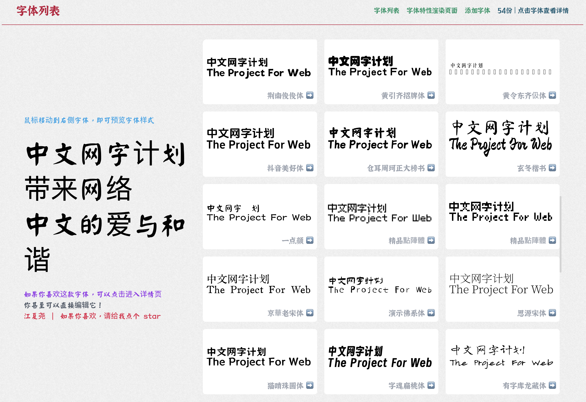
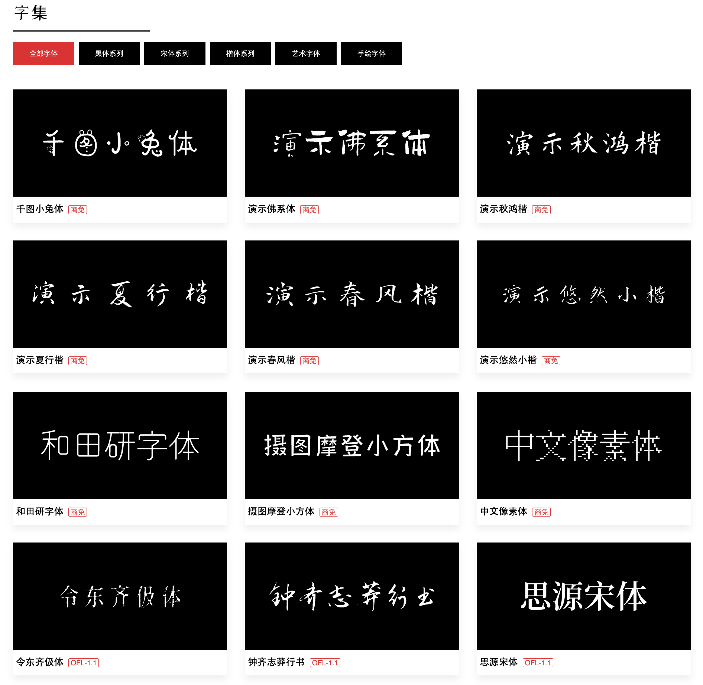
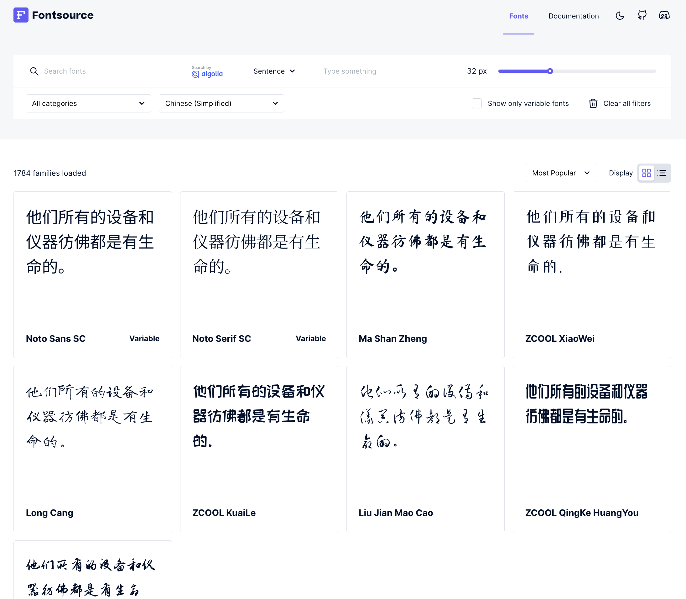
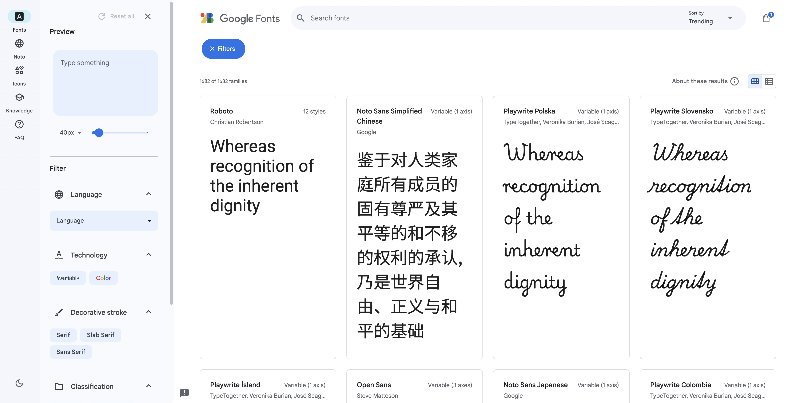
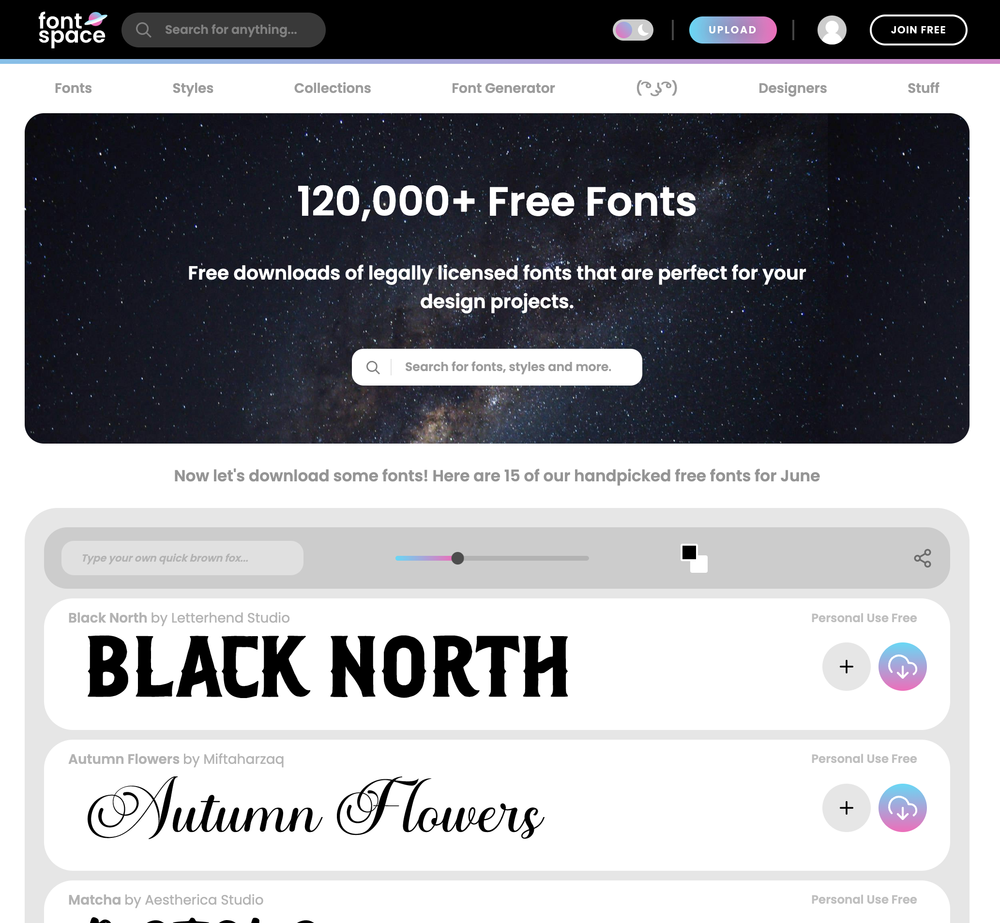

# 开源字体

本文来分享 5 个免费的开源字体大合集，网站开发再也不愁字体不好看了！

## 中文网字计划
中文网字计划是收录众多中文字体并通过 Web Font 的形式为网站开发者提供美丽字体的项目，目前提供了 54 个免费的中文开源字体。

网站：[https://chinese-font.netlify.app/](https://chinese-font.netlify.app/)

## 字集
免费的中文字体集合，提供了近 150 款中文字体，可直接下载使用。

网站：[https://wordshub.github.io/free-font/](https://wordshub.github.io/free-font/)

## Fontsource
Fontsource 是一个不断更新的单体仓库（monorepo），其中包含了大量可自托管的开源字体（目前有 1700+ 字体），并将这些字体打包为独立的NPM包。通过自托管字体，Fontsource能够显著提升网站性能，避免使用CDN（如Google Fonts）时产生的额外延迟。此外，Fontsource 还支持非Google Fonts生态系统的字体，并鼓励社区贡献和扩展字体库。

网站：[https://fontsource.org/](https://fontsource.org/)

## Google Fonts
由 Google 提供支持的在线字体库，提供免费的开源字体。

网站：[https://fonts.google.com/](https://fonts.google.com/)

## Font Space
超大的字体合集，包含了超过 12 万免费字体，其中 1.8 万个字体是可以商用的。

网站：[https://www.fontspace.com/](https://www.fontspace.com/)

> 更新: 2024-11-30 15:01:21  
> 原文: <https://www.yuque.com/cuggz/feplus/gqi77h3z4goxvzak>