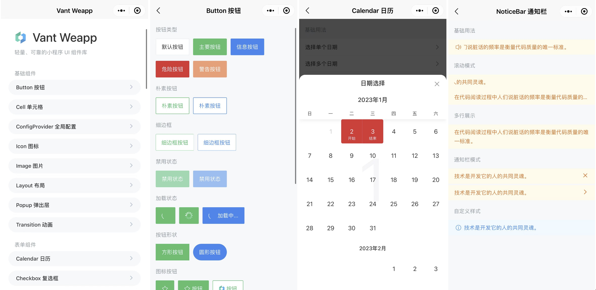
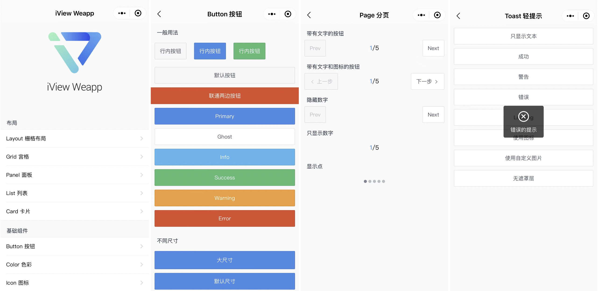
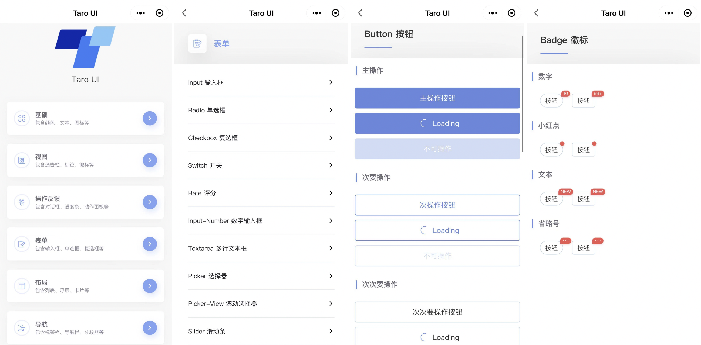
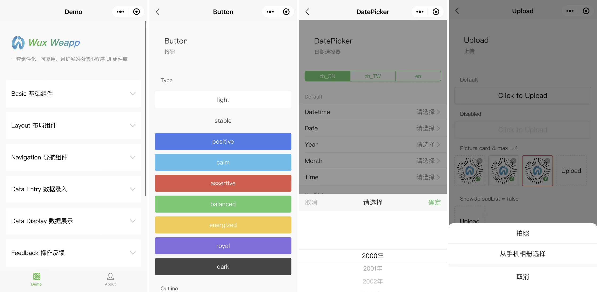
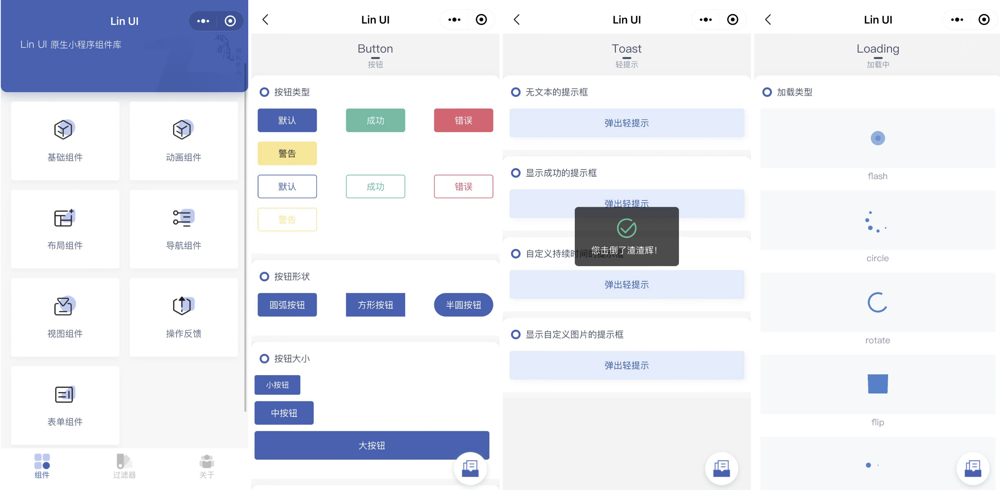
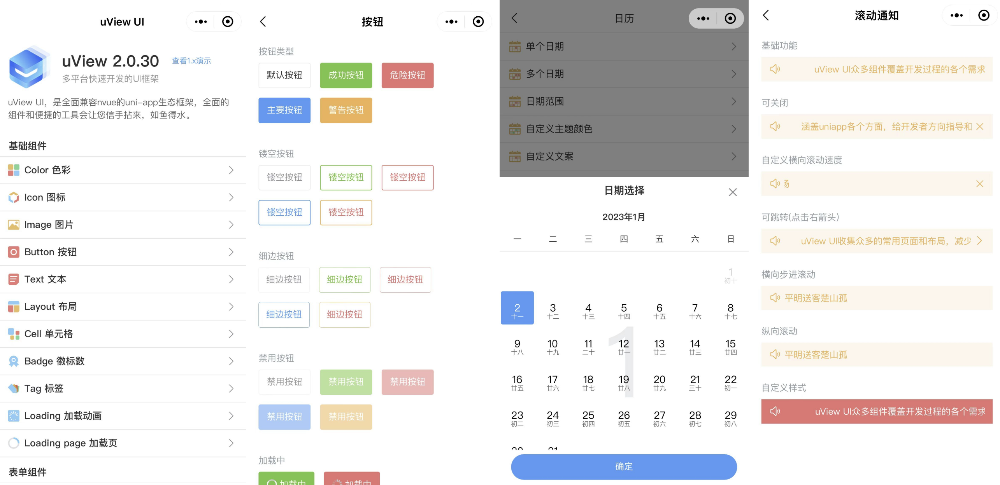
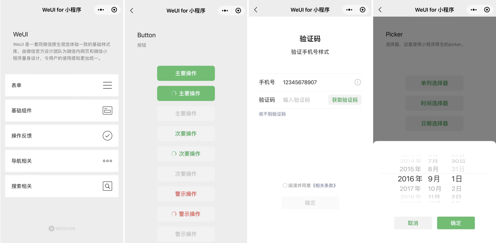
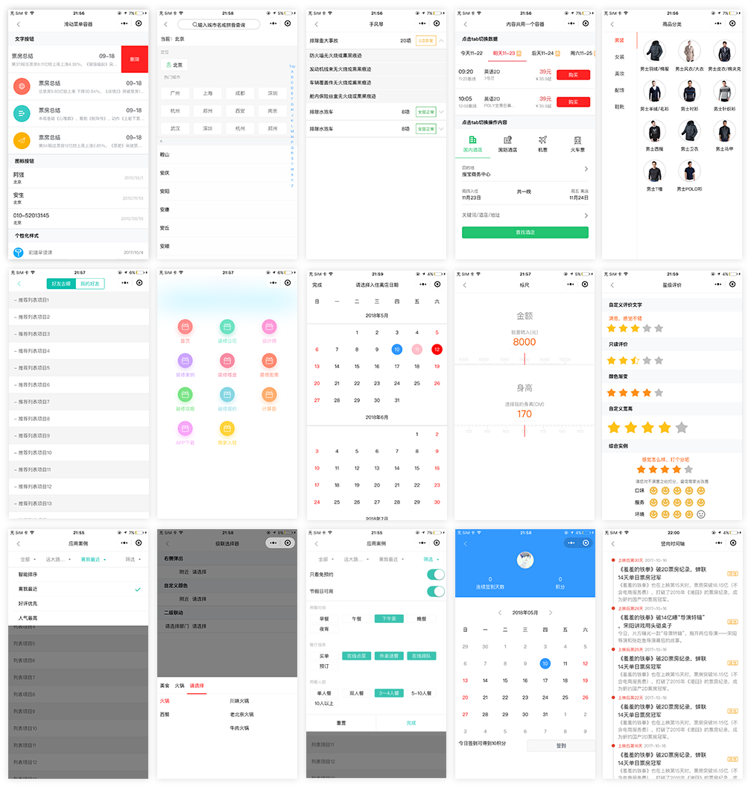

# 微信小程序UI组件库

## Vant Weapp
Vant 是一个轻量、可靠的移动端组件库，由有赞于 2017 年开源。目前 Vant 官方提供了 Vue 2 版本、Vue 3 版本和微信小程序版本，并由社区团队维护 React 版本和支付宝小程序版本。

**Github（****⭐****️ 16.5k）：**[https://github.com/youzan/vant-weapp](https://github.com/youzan/vant-weapp)

## iView Weapp
iView Weapp 是一套高质量的微信小程序 UI 组件库。

**Github（****⭐****️ 6.3k）：**[https://github.com/TalkingData/iview-weapp](https://github.com/TalkingData/iview-weapp)

## Taro UI
Taro UI 是一款基于 Taro 框架开发的多端 UI 组件库。Taro 是由京东凹凸实验室倾力打造的多端开发解决方案。

**Github（****⭐****️ 4.1k）：**[https://github.com/NervJS/taro-ui](https://github.com/NervJS/taro-ui)

## Wux Weapp
Wux Weapp 是一套组件化、可复用、易扩展的微信小程序 UI 组件库。

**Github（****⭐****️ 4.8k）：**[https://github.com/wux-weapp/wux-weapp/](https://github.com/wux-weapp/wux-weapp/)

## Lin UI
Lin UI 是一套基于微信小程序原生语法实现的高质量 UI 组件库。遵循简洁、易用、美观的设计规范。

**Github（****⭐****️ 3.7k）：**[https://github.com/TaleLin/lin-ui](https://github.com/TaleLin/lin-ui)

## uView
uView UI，是uni-app生态优秀的UI框架，全面的组件和便捷的工具会让你信手拈来，如鱼得水。

**Github（****⭐****️ 3.6k）：**[https://github.com/umicro/uView](https://github.com/umicro/uView)

## WeUI
WeUI 是一套同微信原生视觉体验一致的基础样式库，由微信官方设计团队为微信内网页和微信小程序量身设计，令用户的使用感知更加统一。包含 button、cell、dialog、 progress、 toast、article、actionsheet、icon 等各式元素。

**Github（****⭐****️ 14.5k）：**[https://github.com/Tencent/weui-wxss](https://github.com/Tencent/weui-wxss)

## Touch WX
Touch WX是一套完全免费的微信小程序开发框架，包含丰富的UI控件用于官方组件的补充。

**Github（****⭐****️ 805）：**[https://github.com/uileader/touchwx](https://github.com/uileader/touchwx)

> 更新: 2023-01-07 12:32:17  
> 原文: <https://www.yuque.com/cuggz/feplus/gn8pw20sqaarrmll>