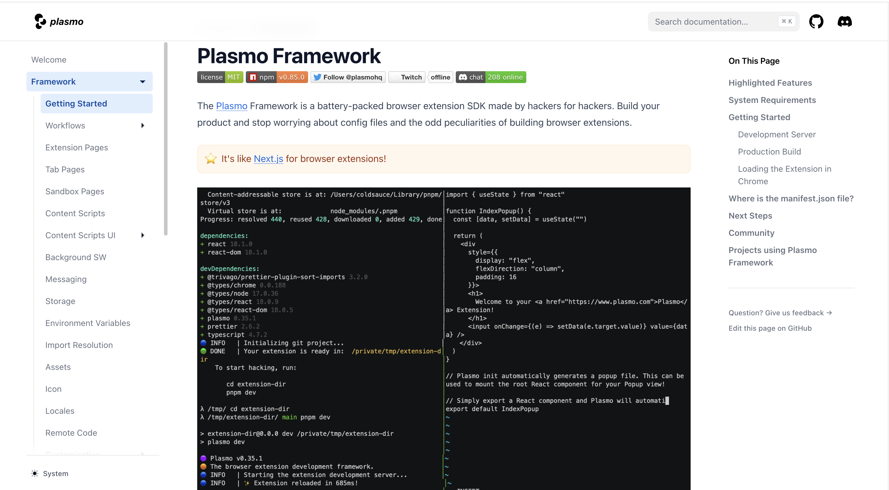
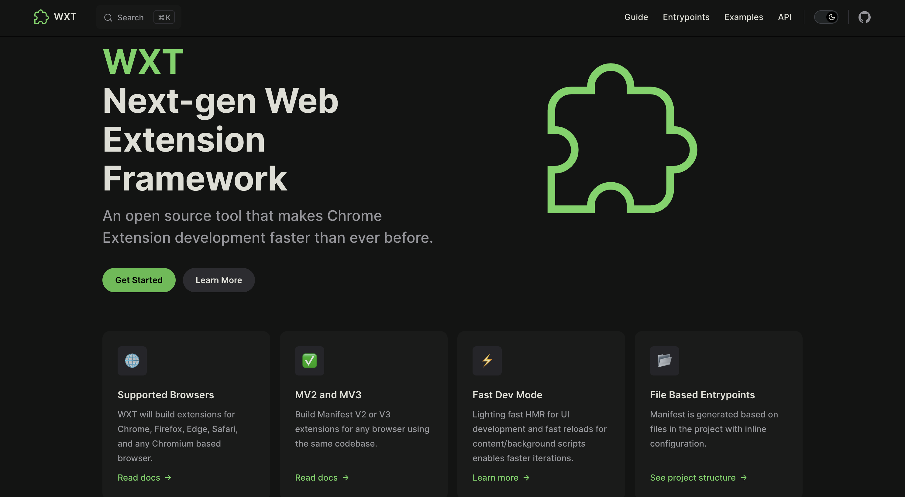

# 扩展框架

浏览器扩展，作为提升浏览器功能与用户体验的得力助手，正逐渐受到广大用户的喜爱。在众多 Web 扩展开发框架中，WXT 和 Plasmo 以其丰富的开发工具和特性，以及简化的开发流程，成为开发者的首选。本文将分别介绍这两个常用的框架，并对比其异同，以便您更深入地了解它们的特点与优势，从而作出明智的选择！

## Plasmo 
Plasmo 是一个专为浏览器扩展开发者设计的全方位平台。它集成了开发、测试和发布扩展所需的一系列工具和服务，旨在简化整个开发流程，提高开发效率，并帮助开发者快速构建出功能强大、性能卓越的浏览器扩展。

****

Plasmo 的特点如下：

+ **一体化解决方案**：Plasmo 提供了从开发到测试再到发布的完整解决方案，开发者无需在不同的工具和服务之间切换，可以更加专注于扩展功能的实现。
+ **高效开发工具**：Plasmo 框架作为其核心产品，提供了强大的开发工具和库，支持多种前端框架。
+ **真实环境测试**：通过 Itero TestBed，开发者可以在真实环境中测试扩展的性能和表现，确保扩展在实际使用中的稳定性和用户体验。
+ **自动化发布流程**：Plasmo BPP 工具使得发布过程变得自动化和简便，开发者只需简单的几步操作就能将扩展发布到各大浏览器平台，快速吸引用户  

其中，Plasmo 框架具有以下特点：

+ **组件化开发**：Plasmo 采用组件化开发方式，允许开发者将复杂的Web应用拆分成一系列独立的、可复用的组件。这种组件化的设计有助于简化开发过程，提高代码的可维护性和可重用性。
+ **支持多种前端框架**：Plasmo 框架支持多种主流前端框架，如 React、Svelte 和 Vue，开发者可以根据自己的技术栈和喜好选择适合的框架进行开发，提高了开发的灵活性和效率。
+ **热更新**：Plasmo 框架内置热更新功能，使开发者能够在开发过程中实时查看代码更改的效果，无需手动刷新扩展。
+ **易于集成与扩展**：Plasmo 框架具有开放的架构和随需扩展的组件体系，使得它易于与其他系统和工具进行集成。同时，其可扩展性也允许开发者根据需求添加新的功能和组件。
+ **简化配置与提高开发效率**：通过简化配置和提供丰富的API支持，Plasmo 框架降低了开发难度，提高了开发效率。开发者可以更加专注于实现业务逻辑和功能，而无需花费过多时间在配置和调试上。

**Github：**[https://github.com/PlasmoHQ/plasmo](https://github.com/PlasmoHQ/plasmo)

## WXT
WXT是一个为 Web 扩展开发者设计的框架，旨在提供更高效、更便捷的扩展开发体验。

WXT 的特点如下：

+ **跨浏览器支持**：WXT 能够为多种主流浏览器构建扩展，包括 Chrome、Firefox、Edge、Safari 以及任何基于 Chromium 的浏览器。这意味着开发者可以使用同一个代码库为不同的浏览器开发扩展，大大提高了开发效率和代码的复用性。
+ **MV2和MV3支持**：WXT 支持构建Manifest V2 或 V3 扩展，这使得开发者可以根据需要选择适合的扩展版本，以满足不同浏览器的兼容性和性能要求。
+ **快速开发模式**：WXT 提供了快速的 HMR 用于 UI 开发，以及内容/后台脚本的快速重载功能。这些特性使得开发者能够更快速地迭代和测试扩展，提高了开发效率。
+ **TypeScript支持**：WXT 默认使用 TypeScript 进行大型项目的开发，这使得代码更加健壮、易于维护和扩展。TypeScript 的类型检查功能还能帮助开发者在编码阶段就发现和修复潜在的问题。
+ **自动导入和自动化发布**：WXT 提供了类似 Nuxt 的自动导入功能，可以加速开发过程。同时，它还支持自动化发布，可以自动完成扩展的压缩、上传、提交和发布流程，节省了开发者大量的时间和精力。
+ **前端框架无关性**：WXT 可以与任何前端框架协同工作，只需使用 Vite 插件即可。开发者可以根据项目需求选择合适的前端框架，而不必受限于特定的技术栈。WXT 还提供了原生 JS、React、Vue、Svelte、Solid 框架的模板，开箱即用！
+ **丰富的工具和特性**：WXT 还提供了项目模板、打包分析、远程代码打包等工具和特性，进一步简化了开发流程，提高了开发质量和效率。

WXT 通过集成压缩和发布工具、打造卓越的开发模式、提供精心设计的项目结构等功能，大幅简化了Chrome扩展的开发流程。让开发者能够更快速地迭代更新，专注于实现功能而非编写构建脚本，并充分利用JS生态系统所提供的丰富资源。

**Github：**[https://github.com/wxt-dev/wxt](https://github.com/wxt-dev/wxt)

## 对比
下面是 WXT 和 Plasmo 的**功能**对比：

| **功能** | **WXT** | **Plasmo** |
| :---: | :---: | :---: |
| 支持所有浏览器 | ✅ | ✅ |
| MV2 支持 | ✅ | ✅ |
| MV3 支持 | ✅ | ✅ |
| 创建扩展 ZIP 包 | ✅ | ✅ |
| 创建 Firefox 源码 ZIP 包 | ✅ | ❌ |
| 一流的 TypeScript 支持 | ✅ | ✅ |
| 自动发现入口点 | 基于文件 | 基于文件 |
| 内联入口点配置 | ✅ | ✅ |
| 自动导入 | ✅ | ❌ |
| 支持所有前端框架 | ✅ | 🟡 仅支持 React、Vue、Svelte |
| 特定框架的入口点 | 🟡 .html .ts .tsx | ✅ .html .ts .tsx .vue .svelte |
| 自动化发布 | ✅ | ✅ |
| 远程代码打包 | ✅ | ✅ |

下面是 WXT 和 Plasmo 的**开发模式**对比：

| **开发模式** | **WXT** | **Plasmo** |
| :---: | :---: | :---: |
| .env 文件 | ✅ | ✅ |
| 打开浏览器并安装扩展 | ✅ | ❌ |
| 热更新 | ✅ | 🟡 仅支持 React |
| 在变更时重新加载HTML文件 | ✅ | 🟡 重新加载整个扩展 |
| 在变更时重新加载内容脚本 | ✅ | 🟡 重新加载整个扩展 |
| 在变更时重新加载后台脚本 | 🟡 重新加载整个扩展 | 🟡 重新加载整个扩展 |

下面是 WXT 和 Plasmo 的**内置实用程序**对比：

| **内置实用程序** | **WXT** | **Plasmo** |
| :---: | :---: | :---: |
| 存储 | ✅ | ✅ |
| 消息传递 | ❌ | ✅ |
| 内容脚本UI | ✅ | ✅ |

> 更新: 2024-03-13 22:07:03  
> 原文: <https://www.yuque.com/cuggz/feplus/le9ntz64dszd526a>